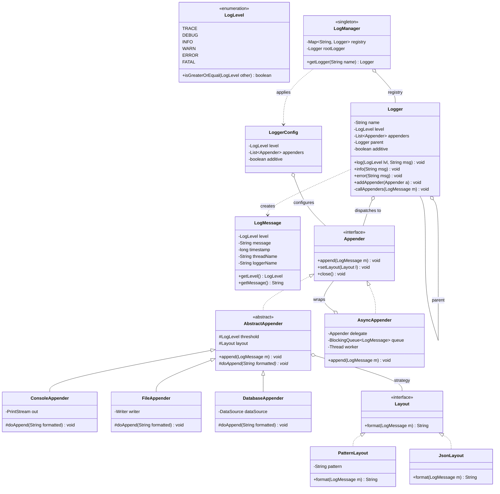

# Design a Logging Framework

This is the canonical **Chain of Responsibility** LLD problem — a Log4j / SLF4J /
`java.util.logging`-style framework. The interviewer is grading whether you can turn a
deceptively simple requirement ("write log messages somewhere") into a clean, extensible
object graph: level filtering, pluggable output destinations, swappable message formats,
a logger hierarchy, and an async path — all assembled from small single-responsibility
classes rather than one `Logger.log()` god method with a `switch` on level and destination.

The star pattern is **Chain of Responsibility** (a message flows up a chain of loggers to
the root, and/or through a chain of appenders each deciding whether to handle it). Around
it sit **Strategy** (formatting/layout), **Observer / composite fan-out** (append to many
destinations), **Factory** (appender creation), **Builder** (config), and **Singleton**
(the `LogManager`). Keep the design single-machine and in-process — shipping logs to a
central store (ELK, CloudWatch) is an HLD concern.

## Requirements Clarification

Spend the first five minutes locking scope. Good clarifying questions:

- **Levels** — which severity levels, and are they *ordered*? (Standard, ascending:
  `TRACE < DEBUG < INFO < WARN < ERROR < FATAL`. Ordering is the whole basis of threshold
  filtering, so pin it down.)
- **Filtering** — a message is emitted only if its level `>=` the configured threshold.
  Per-logger thresholds? Per-appender thresholds? (Real frameworks have both — say so.)
- **Destinations (appenders/handlers)** — console, file, database, at minimum; designed so
  a new one (syslog, Kafka, HTTP) is a drop-in. Can one logger write to *several* at once?
  (Yes — fan-out.)
- **Formatting/layout** — plain text with a pattern (timestamp, level, thread, message),
  or JSON for structured logging? Should format be swappable per appender? (Yes — Strategy.)
- **Logger hierarchy** — named loggers (`com.app.service`) that inherit level/appenders from
  parents up to a root logger, à la Log4j? (This is the *second* Chain of Responsibility.)
- **Sync vs async** — is logging on the caller's thread acceptable, or must the hot path be
  non-blocking (queue + background worker)? (Design sync first; async as a follow-up.)
- **Thread safety** — multiple threads log concurrently to shared appenders — required.
- **Config source** — programmatic (Builder) now; file-based (XML/props) mentioned, scoped out.
- **Out of scope (say it aloud):** centralized log aggregation, log shipping, retention in a
  distributed store, alerting — those are system-design/infra concerns. Also out: exactly-once
  delivery guarantees. This is an in-process framework.

Scoping statement to say out loud: *"I'll build an in-process logging framework with an
ordered level enum, threshold filtering, a hierarchy of named loggers that delegate to a
root, pluggable appenders each with a swappable layout, thread-safe writes, and I'll show
where async logging and new appenders bolt on."*

## Use-Cases and Actors

- **Application code (the primary actor)** calls `logger.info("...")` / `logger.error(...)`.
  It should depend only on a thin `Logger` facade — never on appenders, layouts, or config.
- **Application bootstrap / ops** configures the framework once at startup: sets thresholds,
  registers appenders, picks layouts (via a `LoggerConfig` / Builder).
- **The framework internals** are the real subject of the design: the logger hierarchy, the
  appender chain, formatters, and the async worker.

The core use-case flow for a single call `logger.warn("disk low")`:

1. Logger checks its **effective threshold**; if `WARN < threshold`, drop immediately (cheap
   early exit — critical for hot-path performance).
2. Build a `LogMessage` (level, text, timestamp, thread, logger name).
3. Dispatch to the logger's appenders **and** delegate up the parent chain (if additivity is on).
4. Each appender re-checks its own threshold, **formats** via its layout, and **writes**.

## Identify Core Objects via Noun/Verb Extraction

Pull candidate **classes from the nouns** and candidate **methods from the verbs** in the
requirements, then *filter* — not every noun becomes a class.

Nouns: *logging framework, log message, level (trace/debug/info/warn/error/fatal), logger,
threshold, appender/handler, console, file, database, layout/formatter, pattern, timestamp,
thread, logger hierarchy, root logger, config, queue, worker.*

Verbs: *log, filter (level >= threshold), format, write/append, dispatch, delegate to parent,
configure, enqueue, flush, rotate.*

Filter the noun list into real types:

| Noun | Verdict | Rationale |
|---|---|---|
| Logger | **Class** | The facade app code holds; has a name, level, appenders, parent. |
| Level | **Ordered enum** | Fixed, comparable set of severities — the basis of filtering. |
| LogMessage | **Value object** | Immutable carrier of one event's data (level, text, timestamp, thread, loggerName). |
| Appender / Handler | **Interface + impls** | The output destination abstraction (Console/File/Database). |
| Layout / Formatter | **Interface + impls** (Strategy) | Turns a `LogMessage` into a `String` (or bytes). |
| LoggerConfig | **Class (built via Builder)** | Threshold + appenders + additivity for a logger. |
| LogManager | **Singleton** | Owns the logger registry + hierarchy; `getLogger(name)`. |
| Threshold | **Field** (a `Level`), not a class | Just an attribute of logger/appender. |
| Timestamp, thread, pattern | **Fields / config strings**, not classes | Data inside `LogMessage` / `PatternLayout`. |
| Console, File, Database | **Concrete appenders** | Subtypes of the appender interface, not separate top-level concepts. |
| Queue, worker | **Internals of AsyncAppender** | Not first-class domain objects. |

The filtering *is* the graded skill: promoting `Timestamp` or `Pattern` to a class is
gold-plating; missing the `Layout` abstraction hard-codes formatting into appenders.

## Responsibilities and Relationships

Assign each type **one** reason to change (CRC-style — what it KNOWS / DOES / collaborators):

| Type | Knows | Does | Collaborators |
|---|---|---|---|
| `Logger` | its name, level, appenders, parent | early-level-check, build `LogMessage`, dispatch to appenders + delegate to parent | `LogManager`, `Appender`, `LogMessage` |
| `LogLevel` (enum) | its ordinal severity | `isGreaterOrEqual(other)` | — |
| `LogMessage` | level, text, timestamp, thread, loggerName | immutable getters | `LogLevel` |
| `Appender` (interface) | its own threshold + layout | `append(LogMessage)` (re-filter, format, write), `close()` | `Layout`, `LogMessage` |
| `ConsoleAppender` / `FileAppender` / `DatabaseAppender` | its sink (stream/file/connection) | write formatted output to that sink | `Layout` |
| `Layout` (interface) | the format spec | `format(LogMessage) : String` | `LogMessage` |
| `PatternLayout` / `JsonLayout` | the pattern / JSON schema | render one message | — |
| `LoggerConfig` | threshold, appender list, additivity flag | supply config to a logger | `Appender`, `LogLevel` |
| `LogManager` (singleton) | registry of named loggers + root | `getLogger(name)`, wire parent chain | `Logger`, `LoggerConfig` |
| `AsyncAppender` (decorator) | a delegate appender + queue + worker | enqueue message, drain to delegate off-thread | `Appender`, `BlockingQueue` |

Key relationship calls:

- `Logger` **has-a** parent `Logger` (aggregation) — the hierarchy is the Chain of
  Responsibility for level inheritance and appender additivity, terminating at the root.
- `Logger` **aggregates** many `Appender`s (0..*); one appender can be shared by many loggers.
- `Appender` **has-a** `Layout` (composition/strategy) — swap format without touching the appender.
- Concrete appenders **realize** `Appender`; concrete layouts **realize** `Layout` — new ones
  are *added*, never patched in (Open-Closed).
- `AsyncAppender` **wraps** an `Appender` (Decorator) — same interface, adds buffering.
- `LogManager` **composes** the logger registry and hands out `Logger` instances (Singleton + factory role).

Anti-pattern to name and avoid: a single `Logger.log(level, msg)` that `switch`es on level,
`if`s on destination type, string-concats the format inline, and opens the file — five
reasons to change in one method. Works as a script; fails an LLD round.

## Class Diagram



Interview-grade calibration: ~12 types. Fewer and you've hard-coded destinations or format;
many more (filter chains, marker registries, MDC contexts, appender refs by name) and you're
rebuilding Logback in 45 minutes.

## Key Design Decisions and Patterns

Name each GoF pattern by intent and say *why*; cross-ref `dp-*` for the mechanics.

**1. Chain of Responsibility — the logger hierarchy (Behavioral / the star).** Named loggers
form a tree to the root. A log event travels up the parent chain: each logger contributes its
own appenders (additivity) and level inheritance flows *down* (a logger with no explicit level
uses its nearest ancestor's). This is exactly CoR — each handler decides its part and passes
on. It lets `com.app.svc.Payment` inherit `com.app`'s config with zero duplication. See
`dp-chain-of-responsibility`.

**2. Chain / pipeline of appenders + level filtering (Behavioral).** Filtering is threshold
comparison: emit only if `message.level >= threshold`. The logger does a cheap **early-exit
check** first (so a disabled `debug()` costs almost nothing), and each appender re-checks its
own threshold. Modeling appenders as a chain each independently deciding to handle-or-skip is
the CoR spirit applied to destinations.

**3. Strategy — Layout/Formatter (Behavioral).** *How* a message is rendered (pattern text vs
JSON vs key-value) is the axis of variation. Injecting a `Layout` into an appender means a new
format is a new class, and the same appender can be reused with any layout. An
`if (json) ... else ...` inside `FileAppender.append` would violate Open-Closed. See `dp-strategy`.

**4. Factory — appender/layout creation (Creational).** `AppenderFactory.create(config)` maps
a config type to a concrete appender (and wires its layout). The `switch` over destination types
lives in *creation* code, not in operational logging code. See `dp-factory-method` /
`dp-abstract-factory`.

**5. Builder — LoggerConfig / framework config (Creational).** A logger's configuration has
many optional parts (level, several appenders, additivity, layout patterns). A fluent
`LoggerConfig.builder().level(INFO).appender(console).additive(false).build()` beats a
telescoping constructor. See `dp-builder`.

**6. Singleton — LogManager (Creational).** There must be exactly one logger registry / root
per process so `getLogger("x")` returns the *same* instance everywhere and config is global.
Implement it safely (enum or holder idiom, not double-checked locking done wrong). See
`dp-singleton`. Note the testability cost of Singletons and prefer injecting the manager where
you can.

**7. Decorator — AsyncAppender (Structural).** Async is orthogonal to *where* output goes:
any appender might want a non-blocking queue. `AsyncAppender implements Appender` wrapping a
delegate composes, instead of `AsyncFileAppender`, `AsyncConsoleAppender`, ... exploding
combinatorially. See `dp-decorator`.

**8. Observer / fan-out (Behavioral).** A logger writing to N appenders is a one-to-many
notify: the logger iterates its appender list. This is the Observer shape (destinations
"subscribe" via `addAppender`); adding a metrics sink means registering another appender, no
logger change. See `dp-observer`.

**9. Ordered enum for levels.** `LogLevel` is an enum whose declaration order encodes severity;
`isGreaterOrEqual` compares `ordinal()`. Using ints would lose type safety; unordered enums
couldn't filter. This single decision powers all threshold logic.

## API and Method Signatures

```java
public enum LogLevel {
    TRACE, DEBUG, INFO, WARN, ERROR, FATAL;
    /** Ordering is the basis of threshold filtering. */
    public boolean isGreaterOrEqual(LogLevel other) {
        return this.ordinal() >= other.ordinal();
    }
}

public interface Appender {
    void append(LogMessage message);   // re-filters, formats via layout, writes
    void setLayout(Layout layout);
    void close();                       // flush + release the sink
}

public interface Layout {
    String format(LogMessage message);  // Strategy: LogMessage -> rendered String
}

public final class Logger {
    void log(LogLevel level, String message);
    void trace(String m); void debug(String m); void info(String m);
    void warn(String m);  void error(String m); void fatal(String m);
    void addAppender(Appender a);
    void setLevel(LogLevel level);
}

public final class LogManager {           // Singleton
    public static LogManager getInstance();
    public Logger getLogger(String name);  // creates/returns; wires parent chain
}
```

Contract subtleties worth saying out loud:

- `Logger.log` does the **early threshold check first**, then builds the `LogMessage` once and
  passes the *same immutable* message to every appender — no per-appender re-parsing of args.
- `Appender.append` re-checks its own threshold (a logger at DEBUG may feed an appender that
  only wants ERROR).
- `Layout.format` is pure (no I/O), which makes it trivially unit-testable and thread-safe.
- `getLogger(name)` is idempotent — same name returns the same `Logger`.

## Code Skeleton

Enough structure to demonstrate the design — this is the level of detail to write live.

```java
public final class Logger {
    private final String name;
    private volatile LogLevel level;                 // effective threshold
    private final List<Appender> appenders = new CopyOnWriteArrayList<>();
    private final Logger parent;                     // null only for root
    private volatile boolean additive = true;        // also delegate to parent's appenders

    Logger(String name, LogLevel level, Logger parent) {
        this.name = name; this.level = level; this.parent = parent;
    }

    public void log(LogLevel msgLevel, String message) {
        if (!msgLevel.isGreaterOrEqual(effectiveLevel())) return;   // cheap early exit
        LogMessage m = new LogMessage(msgLevel, message, System.currentTimeMillis(),
                Thread.currentThread().getName(), name);
        callAppenders(m);
    }

    private void callAppenders(LogMessage m) {
        for (Logger l = this; l != null; l = l.parent) {   // Chain of Responsibility
            for (Appender a : l.appenders) a.append(m);      // fan-out (Observer shape)
            if (!l.additive) break;                          // stop climbing the chain
        }
    }

    private LogLevel effectiveLevel() {                 // inherit from ancestors if unset
        for (Logger l = this; l != null; l = l.parent)
            if (l.level != null) return l.level;
        return LogLevel.INFO;                            // root default
    }

    public void info(String m)  { log(LogLevel.INFO, m); }
    public void error(String m) { log(LogLevel.ERROR, m); }
    public void addAppender(Appender a) { appenders.add(a); }
}
```

```java
public abstract class AbstractAppender implements Appender {  // Template Method
    protected volatile LogLevel threshold = LogLevel.TRACE;
    protected volatile Layout layout = new PatternLayout("%d %-5level [%thread] %logger - %msg");

    @Override
    public final void append(LogMessage m) {
        if (!m.getLevel().isGreaterOrEqual(threshold)) return;   // per-appender filter
        String formatted = layout.format(m);                      // Strategy
        doAppend(formatted);                                      // subclass writes the sink
    }

    protected abstract void doAppend(String formatted);           // the varying step
    public void setLayout(Layout layout) { this.layout = layout; }
}

public class ConsoleAppender extends AbstractAppender {
    private final PrintStream out = System.out;
    private final Object lock = new Object();
    @Override protected void doAppend(String formatted) {
        synchronized (lock) { out.println(formatted); }           // atomic per-line write
    }
    @Override public void close() { /* System.out: nothing to release */ }
}
```

```java
public class AsyncAppender implements Appender {                 // Decorator
    private final Appender delegate;
    private final BlockingQueue<LogMessage> queue = new LinkedBlockingQueue<>(10_000);
    private final Thread worker;
    private volatile boolean running = true;

    public AsyncAppender(Appender delegate) {
        this.delegate = delegate;
        this.worker = new Thread(this::drain, "async-appender");
        this.worker.setDaemon(true);
        this.worker.start();
    }
    @Override public void append(LogMessage m) {
        if (!queue.offer(m)) { /* policy: drop, block, or overwrite oldest */ }
    }
    private void drain() {
        while (running || !queue.isEmpty()) {
            try { delegate.append(queue.take()); }
            catch (InterruptedException e) { Thread.currentThread().interrupt(); }
        }
    }
    @Override public void setLayout(Layout l) { delegate.setLayout(l); }
    @Override public void close() { running = false; worker.interrupt(); delegate.close(); }
}
```

Python sketch of the same shape (duck-typed layout/appender):

```python
class Logger:
    def __init__(self, name, level, parent=None):
        self._name, self._level, self._parent = name, level, parent
        self._appenders, self.additive = [], True

    def log(self, msg_level, message):
        if msg_level < self._effective_level():        # IntEnum ordering
            return
        m = LogMessage(msg_level, message, time.time(),
                       threading.current_thread().name, self._name)
        node = self
        while node:
            for a in node._appenders:
                a.append(m)
            if not node.additive:
                break
            node = node._parent
```

## Extensibility

The follow-ups an interviewer throws, and the seam each lands on:

- **"Add a new appender (syslog, Kafka, HTTP, CloudWatch)."** → implement `Appender` (extend
  `AbstractAppender`, define `doAppend`), register via factory/config. Zero changes to
  `Logger`, `Layout`, or existing appenders — Open-Closed in action.
- **"Add JSON / structured logging."** → new `JsonLayout implements Layout`; set it on any
  appender. The Strategy seam means format varies independently of destination.
- **"Async logging so the hot path never blocks on disk."** → wrap any appender in
  `AsyncAppender` (Decorator): a `BlockingQueue` + daemon worker drains off-thread. Discuss
  the bounded-queue overflow policy (drop / block / discard-oldest) — a real trade-off. See
  `concurrency-in-lld`.
- **"Per-package / per-logger levels."** → already supported by the hierarchy: set a level on
  `com.app.noisy` to `WARN` while root stays `INFO`; `effectiveLevel()` inherits otherwise.
  This is the payoff of the Chain of Responsibility logger tree.
- **"Log rotation / size- or time-based rolling file."** → a `RollingFileAppender` subtype (or
  a rollover Strategy inside `FileAppender`): when the file crosses a size/time trigger, close,
  rename, reopen. Isolated inside the file appender; nothing else changes.
- **"Filter by content, not just level (e.g., only messages matching a regex/marker)."** →
  introduce a `Filter` interface and give appenders a filter chain — another Chain of
  Responsibility layered before `doAppend`.
- **"Route ERROR to email/pager but everything to file."** → two appenders with different
  thresholds on the same logger; the fan-out already handles multiple destinations.
- **"Ship logs to a central store / aggregate across machines."** → recognize the boundary:
  aggregation, retention, indexing, and search across hosts are HLD/infra (ELK, CloudWatch,
  Loki). The LLD answer is "a network appender adapter implementing `Appender`"; then redirect
  to system-design logging/observability topics.

The meta-answer to *every* extension: **"which existing seam does this land on — Strategy
(format), Decorator (async/buffering), a new `Appender` (destination), the hierarchy (levels),
or Factory (assembly) — so I add a class instead of editing one?"**

## Concurrency and Thread Safety

Loggers are shared global state hit by every thread, so concurrency is not optional here.

- **Shared appenders must serialize writes to their sink.** Two threads writing a file/stream
  concurrently interleave bytes and produce garbled lines. Guard `doAppend` with a lock (or use
  a thread-safe sink). `PrintStream.println` is individually synchronized, but a multi-write
  format still needs one lock per logical line.
- **`LogMessage` is immutable** — build it once, share it across appenders and threads with no
  locking. Immutability is the cheapest thread-safety tool; call it out.
- **Appender list mutation vs iteration.** `addAppender` can race with a concurrent `log`
  iterating the list. Use `CopyOnWriteArrayList` (reads are lock-free; writes are rare — the
  perfect read-heavy fit) or synchronize.
- **`Layout.format` is pure** — no shared mutable state, so it's naturally thread-safe and
  needs no lock. (A `SimpleDateFormat` field inside a layout would *not* be thread-safe — use
  `DateTimeFormatter`. Classic interview gotcha.)
- **Level/config changes at runtime** — mark mutable config fields `volatile` so a threshold
  change is visible to all threads promptly without locking the hot path.
- **Async path.** `AsyncAppender` decouples caller latency from slow sinks via a `BlockingQueue`
  (a producer/consumer hand-off — see `concurrency-in-lld`). Decide the **overflow policy** for
  a bounded queue: *block* (backpressure, safest, can stall the app), *drop newest* (lossy, never
  stalls), or *discard oldest*. Also handle **graceful shutdown**: on `close()`, stop accepting,
  drain the queue, then join the worker — otherwise buffered logs are lost on exit.
- **Singleton init** — `LogManager.getInstance()` must be safe under concurrent first access;
  use the initialization-on-demand holder idiom or an enum singleton, not a broken
  double-checked lock.

## Edge Cases and Error Handling

- **Logging must never crash the application.** If an appender's sink fails (disk full, DB
  down), catch and report on a fallback (stderr / status logger) — never propagate to the
  caller. A logging failure taking down business logic is unacceptable.
- **Disabled-level calls must be cheap.** `logger.debug(expensiveToString())` still *evaluates*
  the argument even when DEBUG is off — that's the argument-construction cost, not the log cost.
  Mention guarded logging (`if (logger.isDebugEnabled())`) or lambda/`Supplier` message args as
  the fix. The early threshold check protects only the framework's own work.
- **Root logger has no parent** — the CoR climb must terminate; `effectiveLevel()` falls back
  to a default (INFO) at the root.
- **Additivity off** — a logger with `additive=false` stops the climb, so its ancestors'
  appenders don't also receive the message (prevents double-logging).
- **Null message / null level** — decide fast: coerce null message to `"null"` or reject; never
  NPE inside `log`.
- **Async queue full** — governed by the overflow policy above; must be a *decision*, not an
  unbounded queue that OOMs the process.
- **File appender rollover race** — during rollover, in-flight writes from other threads must be
  held or redirected; the rollover must be atomic under the appender's lock.
- **Reentrancy** — a layout or appender that itself logs can recurse infinitely; guard against
  self-logging.

## SOLID in This Design

- **S — Single Responsibility.** Filtering (Logger threshold), formatting (Layout), writing
  (Appender sink), buffering (AsyncAppender), assembly (Factory/Builder), registry (LogManager)
  are separate reasons to change in separate classes — vs the god `log()` method that owns all six.
- **O — Open-Closed.** New appender / layout / filter = new class + config wiring; the tested
  `Logger.log` never reopens.
- **L — Liskov Substitution.** Any `Appender` must honor the contract (filter by its threshold,
  format, write, not throw to the caller). `AsyncAppender` must remain a valid `Appender` — a
  caller can't tell it buffers. Any `Layout` returns a rendered string for any `LogMessage`.
- **I — Interface Segregation.** App code sees only the `Logger` facade (`info`/`error`); it
  never sees `append`/`format`/`setLayout`. `Appender` and `Layout` are small, focused interfaces.
- **D — Dependency Inversion.** `Logger` depends on the `Appender` abstraction; `Appender`
  depends on the `Layout` abstraction — both injected, never on `FileAppender` or `JsonLayout`
  concretely. High-level logging logic names no concrete sink.

## Common Interview Follow-ups

1. **"Why Chain of Responsibility here?"** — Two chains: named loggers delegate up to the root
   (level inheritance + appender additivity), and filters/appenders each decide handle-or-pass.
   It removes per-logger config duplication and lets handlers be added/reordered freely.
2. **"Make logging async / non-blocking."** — `AsyncAppender` decorator: `BlockingQueue` +
   daemon worker; discuss bounded-queue overflow policy and graceful-shutdown drain.
3. **"Add JSON logging without touching appenders."** — New `JsonLayout` (Strategy); set it on
   any appender. Format varies independently of destination.
4. **"Support per-package log levels."** — The logger hierarchy already does it: set a level on
   an intermediate logger; children inherit via `effectiveLevel()`.
5. **"Why is `LogMessage` immutable?"** — One event is built once and fanned out to many
   appenders/threads; immutability makes that share lock-free and prevents an appender mutating
   what another sees.
6. **"Why not `System.out.println` everywhere?"** — No levels, no filtering, no destinations,
   no format control, not testable, not swappable — the framework exists to make all of those
   pluggable.
7. **"A disabled `debug()` is still slow — why?"** — The *argument* is evaluated before the call;
   the framework's early exit doesn't help. Use guards or `Supplier<String>` messages.
8. **"Ship logs to a central cluster."** — Boundary: aggregation/retention/search across hosts
   is HLD (ELK/CloudWatch/Loki). LLD answer: a network `Appender` adapter; redirect to system-design.
9. **"How do you test this?"** — Layouts are pure functions (assert rendered string); a fake
   in-memory `Appender` captures messages to assert filtering/fan-out; the split design is what
   makes each piece unit-testable.

## References

- *Head First Design Patterns* (Freeman & Robson) — Chain of Responsibility, Strategy,
  Decorator, Observer chapters.
- *Design Patterns* (GoF) — Chain of Responsibility (behavioral), Strategy, Decorator, Factory Method, Singleton.
- Log4j 2 / Logback architecture docs — Logger hierarchy, additivity, Appender + Layout separation, AsyncAppender + LMAX Disruptor.
- SLF4J — the facade/abstraction that decouples app code from the logging implementation (Dependency Inversion at library scale).
- `java.util.logging` — `Logger` / `Handler` / `Formatter` / `Level`, the JDK's built-in take on the same shapes.
- Effective Java, 3rd ed. (Bloch) — Item 3 (Singleton via enum), Item 17 (immutability for `LogMessage`), Item 18 (composition — decorator).
- Related topics in this library: `dp-chain-of-responsibility`, `dp-strategy`, `dp-decorator`,
  `dp-observer`, `dp-factory-method`, `dp-builder`, `dp-singleton` (pattern mechanics);
  `concurrency-in-lld` (BlockingQueue producer/consumer, thread-safety); system-design
  logging/observability topics (centralized aggregation, retention, search at scale).
