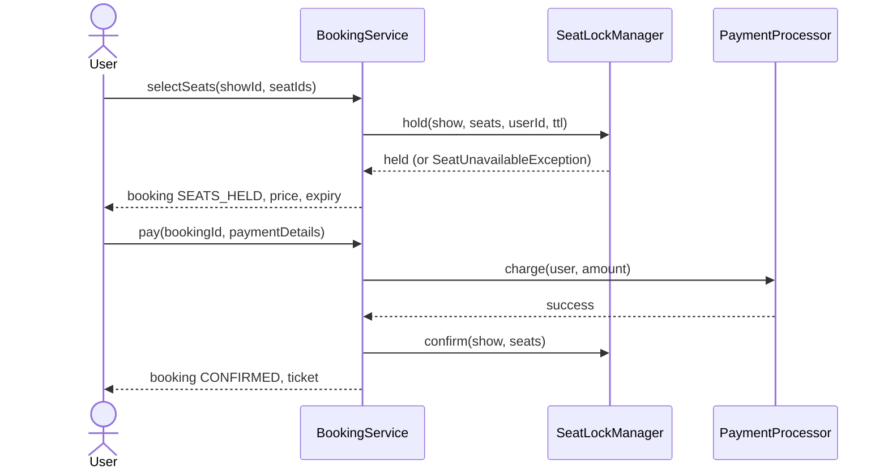
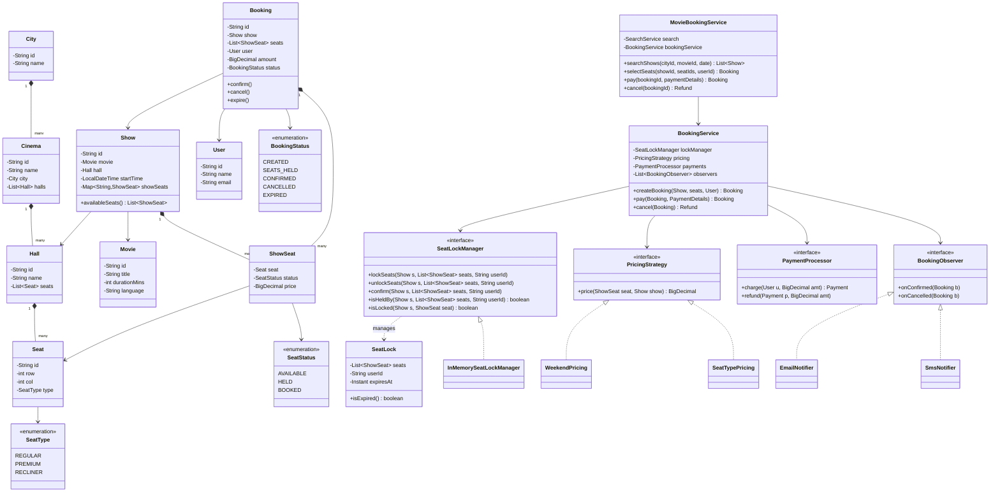
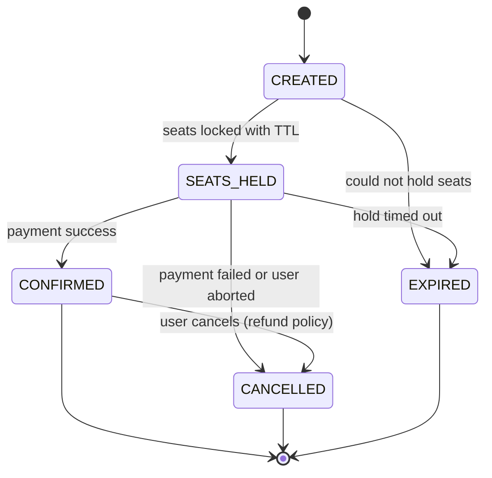

# Design a Movie Ticket Booking System

The movie-ticket booking problem (BookMyShow, Fandango, AMC) is the canonical **concurrent
inventory** LLD question. The domain modeling — Movies, Cinemas, Screens, Shows, Seats — is
approachable, so interviewers use it to probe the one thing that actually separates a real
design from a toy: **how do you stop two users booking the same seat at the same instant?**
The answer is the *seat-hold* problem — temporarily lock selected seats with an expiry so a
user has time to pay, then confirm or release. Get the object model clean, then spend your
capital on the concurrency story. Expect 45–60 minutes; the seat-locking discussion is where
seniority shows.

> [!INTERVIEW]
> If you take one thing into this interview: **a seat is not simply "available" or "booked."**
> It has a third, time-bounded state — **HELD** — owned by one user for a few minutes. That
> HELD state, its expiry, and the race around it *is* the problem. Everything else is warm-up.

## Requirements Clarification

Spend the first five minutes scoping. High-value clarifying questions:

- **Search axis:** users pick a **city**, then a **movie**, then a **date**, and see the
  **shows** across cinemas. Confirm the search entry points (by movie, by cinema, by date).
- **Booking granularity:** users book **specific seats** (BookMyShow-style seat map), not
  "any 2 seats." This is what makes the concurrency interesting — reserved seats are named.
- **Seat types & pricing:** Regular / Premium / Recliner, priced differently; price also
  varies by show time (matinee vs. prime), weekday vs. weekend, and possibly dynamic demand.
  Pricing must be **pluggable**.
- **The hold/lock flow:** when a user selects seats, do we lock them immediately? For how
  long? **Yes — hold seats with a TTL (e.g., 5–10 min)** so the user can pay; release on
  timeout or payment failure. Nail this convention early; it drives the whole design.
- **Payment:** behind an interface — no gateway internals. On success → confirm; on failure
  or timeout → release the held seats.
- **Out of scope (say so explicitly):** distributed inventory across data centers, surge
  traffic for a blockbuster's first-day-first-show at national scale, recommendation ML,
  reviews/ratings, actual payment-gateway integration, and food/concessions ordering. Those
  are HLD or separate features — park them.

A crisp scope statement: *"I'll design a single-process system where a user searches shows by
city + movie + date, sees a seat map for a show, selects seats which are **held with a
timeout** so no one else can grab them, pays, and the booking is confirmed — or the hold
expires and the seats are released. Seats have types with pluggable pricing, and confirmation
goes out via notifications. The core challenge is the seat-hold concurrency: two users must
never confirm the same seat."*

## Actors and Use Cases

The UML-first (Grokking) approach: name the actors, then their use cases, before touching
classes.

- **Customer / User** — search movies by city, view shows for a movie+date, view a show's
  seat map, select and **hold** seats, pay, receive a confirmed booking, cancel a booking,
  view booking history.
- **Cinema Admin / Operator** — add cinemas, halls, and shows; configure seat layout and
  pricing; block seats for maintenance.
- **System (background)** — expire stale seat holds on a timer, send notifications, run the
  no-show / show-ended sweeps.
- **Payment Gateway** — external actor invoked through the `PaymentProcessor` interface.

The critical use case to whiteboard is **"Book seats for a show"**: select seats → *hold
(concurrency guard)* → pay → confirm (or release on failure/timeout). Sketch it as a
sequence and the hold step's importance becomes self-evident.



## Noun and Verb Object Identification

The mechanical technique, shown at work. **Underline the nouns** in the requirements — those
are *candidate* classes and fields. **Underline the verbs** — those are *candidate* methods.
Then **filter**: not every noun becomes a class.

**Candidate nouns:** city, movie, cinema, hall/screen, show, seat, seat type, price, user,
booking, ticket, payment, seat map, hold/lock, notification, refund, date, time.

**Filter them:**

| Noun | Verdict | Reasoning |
|---|---|---|
| City, Movie, Cinema, Hall/Screen, Show | **Classes** — the search/venue hierarchy | Each has identity + data + relationships |
| Seat | **Class** | Has id, type, position; belongs to a hall |
| Seat type (Regular/Premium/Recliner) | **Enum** (+ pricing config), not a class hierarchy | Types differ in *data*, not *behavior* |
| Booking | **Class** (first-class, stateful) | Carries seats, user, price, status, lifecycle |
| Ticket | **Value object / attribute of Booking** | It's the artifact a confirmed booking emits — not its own entity |
| Payment | **Class + `PaymentProcessor` interface** | Record of a charge; gateway hidden behind interface |
| Price | **Not a class — a computed value** via `PricingStrategy` | It's the *output* of a strategy |
| Seat map | **Not a class — a view** | Derived from a Show's seats + their statuses |
| Hold / lock | **Becomes `SeatLock` + `SeatLockManager`** | The concurrency mechanism — the star of the show |
| Notification | **`Observer` / `NotificationService`** | Behavior, not stored state |
| Date/time | **Fields** on Show (`LocalDateTime startTime`) | Attributes, not entities |

**Candidate verbs → methods:** search(city, movie, date), viewShows(), selectSeats(),
holdSeats(), pay(), confirm(), cancel(), releaseSeats(), notify(), price(). These map onto
`BookingService`, `SeatLockManager`, `PricingStrategy`, and `PaymentProcessor`.

> [!TIP]
> The filtering step is the part interviewers reward. Saying out loud *"'seat map' is a
> noun, but it's a **view** derived from the show's seats and their current statuses — not a
> stored entity"* demonstrates the judgment they're testing, not just vocabulary.

## Core Objects and Responsibilities

Assign each surviving class **one** responsibility (CRC-style: what it KNOWS / what it DOES):

| Class | Knows (state) | Does (behavior) + collaborators |
|---|---|---|
| `MovieBookingService` | wiring | Facade: search, select, book, pay, cancel → delegates to services |
| `City` | id, name | Groups cinemas; top of the search hierarchy |
| `Cinema` | name, city, halls | Owns `Hall`s; a venue in a city |
| `Hall` (Screen/Auditorium) | name, seat layout | Owns physical `Seat`s; hosts `Show`s |
| `Movie` | title, duration, language, genre | Pure catalog data; shown across cinemas |
| `Show` | movie, hall, startTime, seat statuses | Ties a movie to a hall at a time; owns the per-show `ShowSeat` availability |
| `Seat` | id, row/col, `SeatType` | A *physical* seat in a hall (identity + position) |
| `ShowSeat` | Seat, `SeatStatus`, price | A seat's bookable state **for one show** (AVAILABLE/HELD/BOOKED) |
| `SeatType` | enum | REGULAR / PREMIUM / RECLINER — pricing input |
| `User` | id, name, contact | The customer; holds booking history |
| `Booking` | id, show, seats, user, amount, `BookingStatus` | First-class stateful reservation; drives the state machine |
| `SeatLock` | seats, user, expiry timestamp | A time-bounded hold record |
| `SeatLockManager` | active locks per show | Acquire/release/confirm holds atomically; expire stale ones — **the concurrency core** |
| `PricingStrategy` | — | Compute price per seat (type + time + demand) |
| `PaymentProcessor` | — | `charge()` / `refund()` behind an interface |
| `BookingObserver` / `NotificationService` | — | React to confirm/cancel (email, SMS) |
| `SeatLockProvider` / factory | — | Create the right lock manager (in-memory now, distributed later) |

Three modeling decisions that matter most:

1. **`Seat` (physical) vs. `ShowSeat` (per-show state).** Seat A12 is one physical object in
   the hall, but its bookability differs per show — free for the 3pm show, held for the 6pm,
   booked for the 9pm. Availability is **per (show, seat)**, so status lives on `ShowSeat`,
   not on `Seat`. Putting a single `isBooked` boolean on the physical `Seat` is the number-one
   modeling mistake in this problem — same trap as `isBooked` on a hotel room.
2. **Three-state seat status, not two.** `SeatStatus = AVAILABLE | HELD | BOOKED`. The `HELD`
   state (with an owner + expiry) is what makes the seat-selection UX safe and is the crux of
   the concurrency discussion.
3. **`Booking` is a first-class, stateful object.** It moves through a lifecycle
   (Created → SeatsHeld → Confirmed / Expired / Cancelled). That state machine is where the
   State pattern earns its place.

## Class Diagram

Interview-grade — the venue hierarchy, the show/seat split, and the pattern seams (Strategy,
Observer, State, the lock manager):



Relationship notes worth saying out loud:

- `City *-- Cinema`, `Cinema *-- Hall`, `Hall *-- Seat` are **composition** — a hall doesn't
  exist outside its cinema, a seat doesn't exist outside its hall.
- `Show *-- ShowSeat` is **composition of the per-show availability**; `ShowSeat --> Seat` is
  a plain **association** — many `ShowSeat`s (one per show) reference the same physical `Seat`.
- `Booking --> Show` / `--> User` are associations (a booking references but doesn't own
  them); `Booking *-- ShowSeat` captures the seats reserved.
- `BookingService` depends on the `SeatLockManager`, `PricingStrategy`, `PaymentProcessor`,
  and `BookingObserver` **interfaces** (DIP) — swap the in-memory lock manager for a
  distributed one, add a pricing rule, or mock payments without touching the service.

## Booking State Machine

`Booking` moves through a well-defined lifecycle. This is the natural home for the **State
pattern** (or, with few states, a guarded transition table). Note that CONFIRMED, CANCELLED,
and EXPIRED are terminal.



Design points:

- **`SEATS_HELD` is the time-bounded state.** Entering it acquires the seat locks with an
  expiry; leaving it (any direction) releases or converts them. A background sweep moves
  timed-out holds `SEATS_HELD → EXPIRED` and releases the seats.
- **Guard illegal transitions in one place.** Paying an already-`EXPIRED` booking, or
  cancelling one already `CANCELLED`, must throw `IllegalBookingStateException`. With this
  many states a transition table on `Booking` is fine; promote to the full **State pattern**
  (one class per state) if per-state behavior grows — see the dp-state topic for the pattern
  itself.
- **The seat's `SeatStatus` mirrors the booking:** `AVAILABLE` when free, `HELD` while the
  booking is `SEATS_HELD`, `BOOKED` once `CONFIRMED`, back to `AVAILABLE` on expiry/cancel.

## Key Design Decisions and Patterns

Each pattern is tied to the requirement that forces it. Patterns are referenced by **name and
intent category** — the dp-* topics teach them in full; here we justify the *choice*.

- **Strategy (Behavioral — pick an algorithm at runtime) — pricing.** Price starts as "seat
  type base rate," then the interviewer piles on: weekend uplift, prime-time premium,
  dynamic demand pricing. An `if/else` in `BookingService` violates Open/Closed and mixes
  orchestration with pricing math. `PricingStrategy.price(showSeat, show)` makes each policy
  its own class; new rules are new classes. Compose them (seat-type base → weekend uplift →
  demand multiplier) by chaining/wrapping strategies decorator-style.
- **Strategy (Behavioral) — payment method.** Card / UPI / wallet / net-banking are
  interchangeable algorithms behind `PaymentProcessor` — a new method is a new implementation,
  not an edit to the booking flow.
- **State (Behavioral — behavior varies by internal state) — booking lifecycle.** As above:
  the Created → SeatsHeld → Confirmed/Expired/Cancelled machine with guarded transitions.
- **Observer (Behavioral — one-to-many event fan-out) — booking events.** On confirm/cancel,
  email + SMS + (later) loyalty + seat-availability push all want to know. If
  `BookingService` calls `emailService.send()` directly, every new channel edits the service.
  `BookingObserver` subscribers invert that: the service fires `onConfirmed(booking)`;
  channels subscribe. **Notification failure must not fail the booking** — notify after commit,
  catch per-observer. Live seat-map updates ("seat just got booked, gray it out") are a
  second Observer use: the UI observes `ShowSeat` status changes.
- **Factory (Creational — encapsulate construction).** A `SeatLockProviderFactory` (or DI
  config) hands out the right `SeatLockManager` — `InMemorySeatLockManager` now, a
  Redis-backed one in production — so the booking code never news-up a concrete lock manager.
  Similarly a factory can build a `Show`'s `ShowSeat` map from a hall's seat layout.
- **Facade (Structural — simplify a subsystem) — `MovieBookingService`.** The driver talks to
  one class; the search/booking/lock/pricing internals stay swappable behind it.
- **What availability is NOT: a boolean on `Seat`.** The single biggest decision (see the
  seat-hold section). Availability is per (show, seat) and has three states.

> [!KEY-TAKEAWAY]
> Classify patterns by **intent** so you can pick under pressure: **Creational** = *how objects
> are built* (Factory for lock managers / show seats); **Structural** = *how objects are
> assembled* (Facade over the subsystem); **Behavioral** = *how responsibility/algorithms are
> assigned* (Strategy for pricing & payment, State for the booking lifecycle, Observer for
> notifications and live seat updates).

## Concurrency: The Seat-Hold Locking Problem

This is *the* interview. The classic race: two users both see seat A12 as `AVAILABLE` and
both click Book. The "check status, then mark booked" is a **check-then-act** sequence —
without mutual exclusion, both checks pass before either write lands, and A12 is
double-booked. Cross-reference the concurrency-in-lld topic for the general check-then-act
and lock-granularity treatment.

**The seat-hold model (the expected answer):**

1. On seat selection, **atomically acquire a hold** on all requested seats for one show,
   stamped with the userId and an expiry (`now + TTL`, e.g., 5–10 min). If *any* requested
   seat is already `HELD` or `BOOKED`, the whole acquisition fails (all-or-nothing) and the
   user gets a `SeatUnavailableException`.
2. Held seats are excluded from other users' availability while the holder pays.
3. **On payment success** → convert holds to `BOOKED` (confirm); **on payment failure, user
   abort, or TTL expiry** → release the holds back to `AVAILABLE`.

**How to make acquisition atomic:**

- **Pessimistic lock per show (the clean interview answer).** Synchronize the
  hold-acquisition critical section on the **`Show`** (one lock per show, not one global
  lock): check every requested seat is free, then mark them all `HELD`, then release the
  lock. One show's bookings never wait on an unrelated show's. Two users hitting the same
  show serialize just for the brief acquire; the loser gets a clean exception.
  ```java
  synchronized (show) {                     // per-show monitor; unrelated shows run in parallel
      for (ShowSeat s : requested)
          if (s.getStatus() != AVAILABLE) throw new SeatUnavailableException(s);
      for (ShowSeat s : requested) { s.setStatus(HELD); }
      lockManager.recordLock(new SeatLock(requested, userId, now.plus(ttl)));
  }
  ```
- **Finer granularity:** a `ConcurrentHashMap<ShowSeat, SeatLock>` and per-seat CAS
  (`putIfAbsent`) avoids locking the whole show — but multi-seat holds must acquire seats in
  a **canonical order** (e.g., sorted by seat id) to avoid deadlock, and need rollback if a
  later seat in the set is taken. Mention it as the optimization and note the added
  complexity.
- **Optimistic alternative:** don't hold; let confirmation fail via a version check / unique
  constraint on (show, seat), and the loser retries. Fine when conflicts are rare, but movie
  seats are *high-contention* (everyone wants the center of row H for the blockbuster), so
  **pessimistic holding is the better default here** — and holding also delivers the UX
  guarantee ("your seats are reserved for 5:00") that optimistic can't.

**Hold expiry — how seats get freed:**

- A background **sweeper** (scheduled executor) periodically scans active `SeatLock`s and
  releases expired ones: seats → `AVAILABLE`, booking → `EXPIRED`, fire an availability-update
  event. Alternatively a lazy check on read (`isExpired()` filters expired locks out of
  availability) avoids a timer but leaves stale state until touched — mention both; the sweep
  is cleaner.
- **Idempotent release:** releasing a lock that already expired or was already confirmed must
  be a no-op, not an error — the sweeper and the payment callback can race.

**In a real (distributed) system** the hold becomes a **Redis key with TTL** (`SET seat NX
PX 300000` — atomic "set if not exists with expiry") or a DB row with an expiry column and a
unique constraint on (show, seat). Name it, then keep the in-memory design — distributed
locking is HLD territory (point to the system-design domain).

## Edge Cases and Error States

- **Payment succeeds but the hold already expired** (user paid at second 301): the confirm
  step must **re-verify** the seats are still `HELD` by this user before flipping to `BOOKED`;
  if the sweep already released them, fail the payment and refund. This check-at-confirm is
  the subtle bug interviewers love.
- **Partial hold:** user requests 3 seats, 1 is taken → **reject the whole set** (all-or-
  nothing); don't leave the user with 2 orphaned holds. Roll back any seats already marked in
  this attempt.
- **Double-submit / retry:** the same user clicking Pay twice must not double-charge —
  idempotency key on the booking; a booking already `CONFIRMED` returns the existing ticket.
- **Cancel after show start / double cancel:** `Booking.cancel()` validates status —
  cancelling an `EXPIRED`/already-`CANCELLED` booking, or one whose show has started, throws
  `IllegalBookingStateException`.
- **Sweeper vs. payment race:** the expiry sweep and a just-arriving payment can touch the
  same lock — guard the transition under the per-show lock so exactly one wins; releases are
  idempotent.
- **Notification failure:** never fails a booking — observers fire after the booking is
  durable, each wrapped in its own try/catch.
- **Show/seat validation:** requesting a seat that isn't in the show, or booking a show in
  the past, is rejected at the service boundary.

## API and Method Signatures

```java
// Search
List<Show> searchShows(String cityId, String movieId, LocalDate date);
List<ShowSeat> availableSeats(String showId);              // seat map: AVAILABLE seats

// Booking lifecycle (the hold flow)
Booking selectSeats(String showId, List<String> seatIds, String userId)
    throws SeatUnavailableException;                       // CREATED -> SEATS_HELD, starts TTL
Booking pay(String bookingId, PaymentDetails details)
    throws PaymentFailedException, HoldExpiredException;   // SEATS_HELD -> CONFIRMED
Refund cancel(String bookingId) throws IllegalBookingStateException;

// Pricing (used inside selectSeats, also for a quote)
BigDecimal quote(String showId, List<String> seatIds);
```

Signature decisions to narrate:

- `selectSeats(...)` returns a `Booking` in `SEATS_HELD` with its price and expiry — the
  caller needs the id, the amount, and *when the hold dies* to show a countdown.
- It throws `SeatUnavailableException` (not null/false): "which seat was taken" and "the card
  declined" are different failures the caller handles differently — typed exceptions carry that.
- `pay(...)` can throw `HoldExpiredException` distinctly from `PaymentFailedException` — the
  UI shows "your seats were released, please reselect" vs. "payment failed, retry."
- `cancel` returns a `Refund` computed by a `RefundPolicy` (extensibility), not a hardcoded
  amount.

## Code Skeleton

Enough structure to show the seams — not a full implementation:

```java
public enum SeatType { REGULAR, PREMIUM, RECLINER }
public enum SeatStatus { AVAILABLE, HELD, BOOKED }
public enum BookingStatus { CREATED, SEATS_HELD, CONFIRMED, CANCELLED, EXPIRED }

public class ShowSeat {
    private final Seat seat;                 // physical seat (shared across shows)
    private SeatStatus status = SeatStatus.AVAILABLE;
    private BigDecimal price;
    public SeatStatus getStatus() { return status; }
    public void setStatus(SeatStatus s) { this.status = s; }
}

public interface SeatLockManager {
    void lockSeats(Show show, List<ShowSeat> seats, String userId);   // atomic, all-or-nothing
    void unlockSeats(Show show, List<ShowSeat> seats, String userId);
    void confirm(Show show, List<ShowSeat> seats, String userId);     // HELD -> BOOKED; re-checks owner, throws HoldExpiredException
    boolean isHeldBy(Show show, List<ShowSeat> seats, String userId); // still held by this user (not swept)?
    boolean isLocked(Show show, ShowSeat seat);
}

public class InMemorySeatLockManager implements SeatLockManager {
    private final Map<Show, Map<ShowSeat, SeatLock>> locks = new ConcurrentHashMap<>();
    private final Duration ttl;

    public void lockSeats(Show show, List<ShowSeat> seats, String userId) {
        synchronized (show) {                                  // per-show critical section
            for (ShowSeat s : seats)
                if (s.getStatus() != SeatStatus.AVAILABLE)     // check
                    throw new SeatUnavailableException(s);
            Instant expiry = Instant.now().plus(ttl);
            for (ShowSeat s : seats) {                         // act (all-or-nothing)
                s.setStatus(SeatStatus.HELD);
                locks.computeIfAbsent(show, k -> new ConcurrentHashMap<>())
                     .put(s, new SeatLock(s, userId, expiry));
            }
        }
    }
    // unlockSeats/confirm: also under synchronized(show); releases are idempotent
}

public interface PricingStrategy { BigDecimal price(ShowSeat seat, Show show); }

public class BookingService {
    private final SeatLockManager lockManager;
    private final PricingStrategy pricing;
    private final PaymentProcessor payments;
    private final List<BookingObserver> observers = new CopyOnWriteArrayList<>();

    public Booking selectSeats(Show show, List<ShowSeat> seats, User user) {
        lockManager.lockSeats(show, seats, user.getId());      // may throw SeatUnavailableException
        BigDecimal total = seats.stream()
            .map(s -> pricing.price(s, show))
            .reduce(BigDecimal.ZERO, BigDecimal::add);
        Booking booking = new Booking(show, seats, user, total);  // status SEATS_HELD
        bookingRepository.save(booking);
        return booking;
    }

    public Booking pay(Booking booking, PaymentDetails details) {
        if (booking.getStatus() != BookingStatus.SEATS_HELD)
            throw new IllegalBookingStateException(booking.getId());
        // Re-verify the hold BEFORE charging (the sweep may have expired it) so we never
        // charge for seats we can't deliver. If the sweep already freed them, fail here —
        // no charge to refund.
        if (!lockManager.isHeldBy(booking.getShow(), booking.getSeats(), booking.getUser().getId()))
            throw new HoldExpiredException(booking.getId());
        Payment payment = payments.charge(booking.getUser(), booking.getAmount());   // may throw
        try {
            lockManager.confirm(booking.getShow(), booking.getSeats(),               // HELD -> BOOKED;
                                booking.getUser().getId());                          // re-checks owner under the lock
        } catch (HoldExpiredException e) {
            payments.refund(payment, booking.getAmount());   // lost the sweep/payment race: compensate
            throw e;
        }
        booking.confirm();
        notifyConfirmed(booking);                                     // after commit, best-effort
        return booking;
    }
}
```

## Extensibility

The "now add X" follow-ups and where they land — each should be a *new class*, not an edit
(Open/Closed):

- **Dynamic / surge pricing:** one more `PricingStrategy` (`DemandPricing` reading the show's
  occupancy %). The seam was built for exactly this.
- **New payment method (UPI, wallet):** a new `PaymentProcessor` implementation — the booking
  flow is untouched.
- **Loyalty points / coupons:** a `LoyaltyObserver implements BookingObserver` accrues on
  `onConfirmed`; a coupon is another pricing adjuster in the chain. Zero edits to
  `BookingService`.
- **Waitlist:** when a `CONFIRMED` booking is cancelled (or a hold expires) for a sold-out
  show, offer freed seats to waitlisted users — a `WaitlistService` subscribes to
  `onCancelled` / release events and offers with its own expiry. Observer again; the cancel
  flow doesn't change.
- **Group booking / seat adjacency:** the hold API already takes a *set* of seats; adjacency
  is a **selection/validation strategy** ("find N contiguous seats in a row") layered on top —
  the all-or-nothing hold guarantees the group books together or not at all.
- **Seat recommendations ("best available"):** a `SeatRecommender` strategy scores available
  `ShowSeat`s (centered, together, seat type) — a read-side add-on, no change to booking.
- **Refunds on cancel:** a pluggable `RefundPolicy` (full if >2h before show, partial within,
  non-refundable) computed at cancel time — same Strategy shape as pricing, kept separate
  (ISP) because it changes for different reasons.
- **Distributed inventory / national scale:** swap `InMemorySeatLockManager` for a
  Redis-backed `SeatLockManager` (TTL keys) behind the same interface — the object model
  doesn't move. This is where LLD hands off to HLD; say so and point to system-design.

## Common Interview Follow-ups

1. **"Two users click Book on the last center seat at the same millisecond — walk me through
   exactly what happens."** Narrate the per-show lock acquire, the check-then-act inside it,
   the loser's `SeatUnavailableException`, and why the same code without the lock double-books.
2. **"The user selects seats but never pays. How do the seats come back?"** The TTL on the
   `SeatLock` + a background sweep (or lazy expiry on read) moves `SEATS_HELD → EXPIRED` and
   releases seats; releases are idempotent.
3. **"Payment succeeds one second after the hold expired — what happens?"** Confirm must
   re-verify the hold before flipping to `BOOKED`; if the sweep already freed the seats, fail
   and refund. This is the subtle correctness bug.
4. **"How do you show other users a seat just got taken, live?"** Observer on `ShowSeat`
   status changes pushes availability updates to viewers of that show's seat map.
5. **"Add 'best available seats' auto-selection."** A recommendation Strategy over available
   `ShowSeat`s — read-side, no change to the hold/booking core.
6. **"Make it work across 100 servers for a blockbuster on-sale."** Name it as HLD:
   distributed lock (Redis TTL / DB unique constraint on show+seat), a queue/waiting-room for
   the thundering herd, idempotent booking API, cache availability. Point to system-design;
   keep this round single-process.
7. **"Why `ShowSeat` instead of a status on `Seat`?"** Because availability is per (show,
   seat) — the same physical seat is free at 3pm and booked at 9pm; a single boolean can't
   represent that.

## References

- Grokking the Object-Oriented Design Interview — "Design a Movie Ticket Booking System"
- *Design Patterns* (GoF) — Strategy, State, Observer, Factory Method, Facade
- *Effective Java* (Bloch) — Item 17 (immutable value objects), Item 78–81 (concurrency:
  shared mutable state, concurrency utilities over raw locks)
- Redis docs — `SET key value NX PX <ms>` as the canonical distributed seat-hold primitive
- Related topics in this library: dp-strategy, dp-state, dp-observer, dp-factory-method
  (pattern deep-dives), concurrency-in-lld (check-then-act, lock granularity, deadlock),
  design-hotel-booking (reservation-over-time contrast: date-range overlap vs. seat holds),
  design-parking-lot (spot-now availability contrast), lld-interview-method (the overall
  approach), system-design ticketing/booking HLD topics
