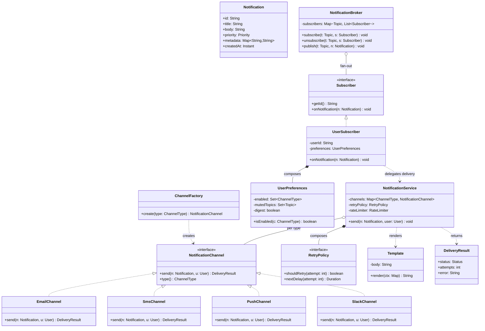

# Design a Notification / Pub-Sub System

The canonical **Observer / publish-subscribe** machine-coding problem. The interviewer
wants a clean, extensible, single-machine OO design that delivers notifications to users
across multiple **channels** (email, SMS, push, Slack), honours **per-user preferences**,
**retries** on failure, and can grow new channels without touching existing code. Two
related shapes live here and you should be able to distinguish them: the **Observer**
pattern (a subject directly holds and notifies its observers) and **pub-sub** (a broker /
topic mediates so publishers and subscribers never reference each other). Making it truly
distributed — a durable Kafka/SQS-backed broker fanning out to millions — is an HLD
follow-up; acknowledge it and keep the class design in-process.

## Requirements Clarification

Spend the first five minutes locking scope. High-signal questions:

- **What triggers a notification?** A domain event (order shipped, price drop, comment
  reply)? A direct API call (`notify(user, message)`)? Both → you want an event/topic
  abstraction, not a hard-wired call.
- **What channels?** Email, SMS, push, Slack, in-app. The moment there are several
  interchangeable delivery mechanisms, say "these are Strategies behind a
  `NotificationChannel` interface" — that framing drives the design.
- **Fan-out shape?** One event to many subscribers (pub-sub / Observer)? One notification
  to many channels for one user (multi-channel fan-out per preference)? Usually **both**.
- **User preferences?** Can a user opt into email-only, mute a topic, set quiet hours,
  choose digest vs. immediate? Preferences are data, not code branches.
- **Delivery guarantees?** Best-effort, at-least-once with retry, ordered? Decide whether
  a failed send is retried, dead-lettered, or dropped.
- **Sync or async?** Should `publish()` block until every channel is hit, or enqueue and
  return? Async via a queue + worker pool is the realistic answer (cross-ref
  `concurrency-in-lld`).
- **Templates / formatting?** Do messages come pre-rendered, or do we render a `Template`
  with user/locale data per channel (an SMS is 160 chars, an email is HTML)?
- **Observer vs. broker?** Ask whether publishers should know their subscribers. If not,
  a broker (`NotificationBroker` / topic registry) decouples them — that's pub-sub.

**Scope out:** a distributed durable log (Kafka), cross-region replication, exactly-once
semantics, provider billing, spam/abuse ML. Name them, park them.

> [!INTERVIEW]
> The one sentence that anchors the whole design: "Subscribers register interest and get
> notified on events (Observer), and delivery mechanisms are interchangeable channels
> (Strategy) — so both the *who-gets-told* axis and the *how-it's-sent* axis are open for
> extension without modifying existing code." Say that and you've framed 80% of the round.

## Use Cases and Actors

Grokking's UML-first approach: name the actors, then the use cases they drive.

**Actors**
- **Publisher / Event Source** — a service that raises an event ("OrderShipped") or calls
  `notify(...)`. Does not know who listens.
- **Subscriber / User** — the recipient; subscribes to topics and owns channel
  preferences.
- **Channel Provider** (external) — email gateway, SMS gateway (Twilio), push (APNs/FCM),
  Slack webhook. The concrete delivery integrations.
- **Admin / System** — configures topics, rate limits, templates, retry policy.

**Core use cases**
- Subscriber **subscribes / unsubscribes** to a topic.
- Publisher **publishes** an event to a topic.
- System **fans out** the event to all subscribers of that topic.
- For each subscriber, system **resolves preferences** and delivers on the chosen
  channel(s), rendering a template.
- On failure, system **retries** per policy, then **dead-letters**.
- System **rate-limits** / **batches (digest)** per user.

## Noun and Verb Object Identification

Pull candidate classes from the **nouns** and candidate methods from the **verbs**, then
filter — not every noun becomes a class.

Requirement prose: *"A **publisher** publishes a **notification** about an **event** to a
**topic**. Each **subscriber** subscribed to that topic receives a **message** delivered
over one or more **channels** (email, SMS, push) according to the subscriber's
**preferences**. A **template** renders the message per channel. Failed **deliveries** are
**retried** by a **retry policy** and logged."*

| Noun | Decision | Becomes |
|---|---|---|
| Notification / Message | Keep | `Notification` value object (payload, priority, metadata) |
| Event | Keep (or fold into topic name) | `Event` / event type — often just the topic key |
| Topic | Keep | `Topic` — the routing key subscribers register on |
| Publisher | Keep | `Publisher` role → calls `broker.publish(topic, notif)` |
| Subscriber | Keep | `Subscriber` (Observer) interface |
| Channel | Keep — **the Strategy axis** | `NotificationChannel` interface + concretes |
| Preference | Keep | `UserPreferences` value object |
| Template | Keep | `Template` / `TemplateEngine` |
| Retry policy | Keep | `RetryPolicy` (Strategy) |
| Delivery | Keep as verb→result | `DeliveryResult` value object; `deliver()` method |
| Broker / dispatcher | Keep (pub-sub) | `NotificationBroker` / `NotificationService` |
| Email / SMS / Push | Filter → **not** peer classes | concrete `NotificationChannel`s, not top-level entities |
| User | Keep (thin) | `User` (id + contact info); preferences may hang off it |

**Verbs → methods:** subscribe, unsubscribe, publish, notify, deliver/send, render,
retry, format, rateLimit, batch. These become methods on the classes above, not classes
themselves.

> [!TIP]
> The classic over-modelling trap is making `Email`, `SMS`, and `Push` sibling
> *entities*. They're not — they're concrete **strategies** of one `NotificationChannel`
> abstraction. Collapsing them there is the single most important filtering decision.

## Responsibilities and Relationships

CRC-style: what each class **knows** and **does**, plus collaborators.

| Class | Knows (state) | Does (behavior) | Collaborators |
|---|---|---|---|
| `Notification` | payload, title, priority, metadata, timestamp | nothing (immutable value) | — |
| `Topic` | name/id | identity/equality | broker |
| `Subscriber` (interface) | — | `onNotification(Notification)` | broker |
| `UserSubscriber` | userId, `UserPreferences` | resolve channels, hand off to service | `NotificationService`, `UserPreferences` |
| `NotificationChannel` (interface) | — | `send(Notification, User)` → `DeliveryResult`; `supports(type)` | provider |
| `EmailChannel` / `SmsChannel` / `PushChannel` / `SlackChannel` | provider client, config | render + send over that medium | `Template`, provider SDK |
| `UserPreferences` | enabled channels, muted topics, quiet hours, digest flag | `isEnabled(channel)`, `wantsImmediate()` | — |
| `Template` / `TemplateEngine` | template body, placeholders | `render(context)` → text per channel | — |
| `RetryPolicy` (interface) | max attempts, backoff | `nextDelay(attempt)`, `shouldRetry(attempt)` | dispatcher |
| `NotificationBroker` | topic → subscribers map | `subscribe`, `unsubscribe`, `publish` (fan-out) | `Subscriber` |
| `NotificationService` | channels, retry policy, rate limiter, queue | orchestrate delivery: preference filter → template → channel → retry | many |
| `ChannelFactory` | channel type → builder | `create(ChannelType)` | channels |
| `DeliveryResult` | status, error, attempts | value object | — |

Relationship notes:
- `NotificationService` **composes** its retry policy, rate limiter and channel map
  (they don't outlive it) — composition (`--*`).
- `NotificationBroker` **aggregates** subscribers — they exist independently and can be
  shared (`--o`).
- Concrete channels **realize** `NotificationChannel` (`..|>`); concrete subscribers
  realize `Subscriber`.
- `NotificationService` **depends on** `Template`, `DeliveryResult` (`..>`).
- Multiplicity: one `Topic` → many `Subscriber`s; one `Subscriber` (user) → many enabled
  `NotificationChannel`s (per preferences).

## Class Diagram



## Key Design Decisions and Patterns

Name each GoF pattern by intent and justify it. (Reference the `dp-*` topics for the
patterns themselves — here we only apply them.)

**1. Observer (Behavioral) — the core.** Subscribers register interest and are notified
when a publisher raises an event; the subject (`NotificationBroker` or a per-topic subject)
holds a list of `Subscriber`s and calls `onNotification()`. This decouples the publisher
from the concrete recipients — the publisher depends only on the `Subscriber` interface.
(See `dp-observer`.)

**2. Strategy (Behavioral) — channels and retry.** Each `NotificationChannel` is an
interchangeable delivery algorithm behind one interface; likewise `RetryPolicy`
(fixed-delay vs. exponential-backoff) is a swappable strategy. Adding a WhatsApp channel or
a jittered-backoff policy is a new class, not an edit — Open/Closed in action. (See
`dp-strategy`.)

**3. Factory (Creational) — channel construction.** A `ChannelFactory` maps a
`ChannelType` (or config) to a fully-wired channel (provider client, credentials), so the
service never `new`s a concrete channel and callers depend only on the interface. (See
`dp-factory-method` / `dp-abstract-factory`.)

**4. Decorator (Structural) — cross-cutting add-ons.** Wrap any `NotificationChannel` to
add rate limiting, metrics, logging, or priority formatting without touching the channel:
`new RateLimitedChannel(new RetryingChannel(new EmailChannel()))`. Each decorator *is a*
`NotificationChannel` and delegates. (See `dp-decorator`.)

**5. Template Method (Behavioral) — the send workflow.** The steps of delivery
(validate → render template → send → record result) are invariant; only the "send over
the wire" step varies per channel. An `AbstractChannel` can fix the skeleton in a `final`
method and leave an abstract `doSend()` hook. Use it when the steps genuinely share a
skeleton; if they don't, plain Strategy is cleaner. (See `dp-template-method`.)

**6. Builder (Creational) — Notification construction.** A `Notification` has many
optional fields (priority, metadata, TTL, deep-link); a builder avoids telescoping
constructors. (See `dp-builder`.)

**7. Singleton / DI for the broker.** There's usually one broker/registry; inject it
rather than using a global static (testability). (See `dp-singleton`.)

> [!KEY-TAKEAWAY]
> Observer to decouple who-gets-notified, Strategy for interchangeable channels and retry
> policies, Factory to build channels, Decorator for rate-limit/metrics/logging, Template
> Method for the shared send skeleton, Builder for the notification object. Every "add X"
> follow-up should map to "new class implementing an existing interface."

## Observer vs. Pub-Sub (Broker)

A distinction interviewers probe explicitly:

| | **Observer** | **Pub-Sub (broker)** |
|---|---|---|
| Coupling | Subject holds **direct references** to observers | Publisher and subscriber know only the **broker/topic** |
| Who notifies | The subject itself calls `update()` | A broker/message channel routes messages |
| Sync | Typically **synchronous**, same thread | Often **async**, queue-mediated |
| Knowledge | Subject knows its observers | Publisher has **no knowledge** of subscribers |
| Scope | In-process, one object graph | Can span threads/processes; scales to distributed |
| Routing | Implicit (all observers of that subject) | Explicit **topic-based** routing |

In LLD, start with Observer for a single subject, then introduce a `NotificationBroker`
with a `Map<Topic, List<Subscriber>>` to get topic-based routing and looser coupling. When
the interviewer says "scale to millions across services," that broker becomes a real
message queue (Kafka/SQS) — an **HLD** concern; point to the system-design pub-sub topic
and keep your class design in-process.

## API and Method Signatures

```java
public interface Subscriber {
    String getId();
    void onNotification(Notification n);
}

public interface NotificationChannel {
    DeliveryResult send(Notification n, User user);
    ChannelType type();
    default boolean supports(Notification n) { return true; }
}

public interface RetryPolicy {
    boolean shouldRetry(int attempt, DeliveryResult last);
    Duration nextDelay(int attempt);
}

public interface Broker {
    void subscribe(Topic topic, Subscriber s);
    void unsubscribe(Topic topic, Subscriber s);
    void publish(Topic topic, Notification n);   // fan-out to subscribers
}

public final class NotificationService {
    // resolve prefs -> pick channels -> render -> send -> retry
    void send(Notification n, User user);
    void sendAsync(Notification n, User user);   // enqueue + return
}

public record DeliveryResult(Status status, int attempts, String error) {
    enum Status { SENT, FAILED, RATE_LIMITED, SKIPPED }
}

public enum ChannelType { EMAIL, SMS, PUSH, SLACK, IN_APP }
public enum Priority   { LOW, NORMAL, HIGH, CRITICAL }
```

Signature choices to defend: `send(Notification, User)` keeps channels ignorant of topics
and preferences (SRP — preference filtering lives in the service). `DeliveryResult` is an
immutable value object so results are safe to log, aggregate, and pass across threads.

## Code Skeleton

Channel strategy plus an abstract Template-Method base:

```java
public abstract class AbstractChannel implements NotificationChannel {
    // Template Method: fixed skeleton, varying doSend hook
    @Override
    public final DeliveryResult send(Notification n, User user) {
        if (!supports(n)) return DeliveryResult.skipped();
        String rendered = template().render(context(n, user));
        try {
            doSend(rendered, user);                 // the only per-channel step
            return DeliveryResult.sent();
        } catch (ChannelException e) {
            return DeliveryResult.failed(e.getMessage());
        }
    }
    protected abstract void doSend(String rendered, User user) throws ChannelException;
    protected abstract Template template();
}

public final class EmailChannel extends AbstractChannel {
    private final EmailGateway gateway;
    public ChannelType type() { return ChannelType.EMAIL; }
    protected void doSend(String body, User u) { gateway.email(u.email(), body); }
    protected Template template() { return EMAIL_TEMPLATE; }
}
```

Broker fan-out (Observer / pub-sub):

```java
public final class NotificationBroker implements Broker {
    private final Map<Topic, List<Subscriber>> subs = new ConcurrentHashMap<>();

    public void subscribe(Topic t, Subscriber s) {
        subs.computeIfAbsent(t, k -> new CopyOnWriteArrayList<>()).add(s);
    }
    public void unsubscribe(Topic t, Subscriber s) {
        subs.getOrDefault(t, List.of()).remove(s);
    }
    public void publish(Topic t, Notification n) {
        for (Subscriber s : subs.getOrDefault(t, List.of())) {
            s.onNotification(n);            // fan-out; each subscriber decides delivery
        }
    }
}
```

Service with preference filtering, retry, and Decorator-friendly wiring:

```java
public final class NotificationService {
    private final Map<ChannelType, NotificationChannel> channels;
    private final RetryPolicy retryPolicy;
    private final ExecutorService pool;      // async delivery

    public void send(Notification n, User user) {
        UserPreferences prefs = user.preferences();
        if (prefs.isMuted(n.topic())) return;                 // preference filter
        for (ChannelType type : prefs.enabledChannels()) {
            NotificationChannel channel = channels.get(type);
            if (channel == null || !channel.supports(n)) continue;
            pool.submit(() -> deliverWithRetry(channel, n, user));  // async fan-out
        }
    }

    private void deliverWithRetry(NotificationChannel c, Notification n, User u) {
        int attempt = 0;
        DeliveryResult r;
        do {
            r = c.send(n, u);
            if (r.status() == Status.SENT) return;
            attempt++;
            sleep(retryPolicy.nextDelay(attempt));
        } while (retryPolicy.shouldRetry(attempt, r));
        deadLetter(n, u, r);                 // exhausted retries
    }
}
```

Decorator for rate limiting (cross-ref `design-rate-limiter-oo`):

```java
public final class RateLimitedChannel implements NotificationChannel {
    private final NotificationChannel delegate;
    private final RateLimiter limiter;
    public DeliveryResult send(Notification n, User u) {
        if (!limiter.allow(u.id()).allowed())
            return DeliveryResult.rateLimited();
        return delegate.send(n, u);          // add behavior, then delegate
    }
    public ChannelType type() { return delegate.type(); }
}
```

## Extensibility

Every follow-up should be "new class implementing an existing interface," not an edit —
that's Open/Closed made visible.

- **"Add a WhatsApp channel."** New `WhatsAppChannel implements NotificationChannel` + one
  `ChannelFactory` case. Zero changes to service, broker, or subscribers.
- **"Add exponential backoff with jitter."** New `RetryPolicy` implementation; inject it.
- **"Add rate limiting / metrics / logging per channel."** A **Decorator** wrapping any
  channel — no channel edits. Rate-limit math lives in `design-rate-limiter-oo`.
- **"Digest / batching: send one daily summary instead of 50 emails."** A
  `DigestSubscriber` (or a `BatchingChannel` decorator) buffers notifications and flushes
  on a schedule; preferences carry a `digest` flag. Immediate vs. digest becomes a
  preference, not a code branch sprinkled everywhere.
- **"Priority: CRITICAL bypasses digest and quiet hours."** `Priority` on the
  `Notification`; the service consults it in the preference filter. A `PriorityChannel`
  decorator can also reorder/expedite.
- **"Per-user preferences (email only, mute topic, quiet hours)."** All data on
  `UserPreferences`; the service filters. No new channel/subscriber types.
- **"Topic hierarchies / wildcard subscriptions."** Extend the broker's routing (topic
  matcher) — the `Subscriber` contract is unchanged.
- **"Make it distributed / durable across services."** Swap the in-memory broker's
  `Map` + `ExecutorService` for a real message queue behind the same `Broker` interface.
  Durability, partitioning, exactly-once — HLD; point to system-design pub-sub.

## Concurrency and Edge Cases

A notification system is inherently concurrent — publishers, a worker pool, and
subscribers list mutations all race.

- **Subscriber list mutation during fan-out.** If `publish()` iterates the list while
  another thread `subscribe()`s/`unsubscribe()`s, a plain `ArrayList` throws
  `ConcurrentModificationException`. Use `CopyOnWriteArrayList` (cheap reads, rare writes —
  the subscribe pattern) or snapshot the list under a lock before iterating.
- **Async delivery.** `sendAsync` enqueues to an `ExecutorService`/bounded queue and
  returns; workers deliver. Decide the queue bound and rejection policy (backpressure vs.
  drop) — an unbounded queue is an OOM waiting to happen.
- **Retry + idempotency.** At-least-once retry can deliver twice (send succeeded but the
  ack was lost). Attach an idempotency key / notification id so the provider or a
  dedup cache suppresses duplicates.
- **Ordering.** A worker pool reorders deliveries. If per-user ordering matters, key work
  onto per-user single-threaded executors (hash userId → one of N queues).
- **Slow / failing channel isolation.** One hung provider must not block others; deliver
  per channel on separate tasks and apply timeouts + a circuit breaker so a dead SMS
  gateway doesn't stall email.
- **Dead-letter after exhausted retries.** Don't drop silently — record to a DLQ / failure
  log for later inspection.
- **Self-notification / re-entrancy in Observer.** A subscriber that publishes during
  `onNotification()` can recurse or deadlock; document that notification is
  fire-and-forget and observers must not block.
- **Duplicate subscription / unsubscribe-during-notify.** `subscribe()` should be
  idempotent (set semantics); removing a subscriber mid-fan-out is safe with
  copy-on-write snapshots.

> [!WARNING]
> The planted trap: iterating a shared `ArrayList` of subscribers in `publish()` while
> another thread subscribes. It throws `ConcurrentModificationException` under load.
> `CopyOnWriteArrayList`, a synchronized snapshot, or a concurrent collection is the fix —
> and note *why* copy-on-write fits (read-heavy, write-rare).

## Common Interview Follow-ups

1. **"Observer vs. pub-sub — what's the difference?"** Observer = subject holds direct
   references to observers and calls them (in-process, usually sync); pub-sub = a broker /
   topic mediates so publisher and subscriber never reference each other (loose coupling,
   often async, topic-routed).
2. **"Why is `NotificationChannel` an interface and not an enum with a switch?"** OCP: a
   switch reopens one class for every new channel and unions all providers' state;
   Strategy isolates each channel's state and change-surface.
3. **"Add a new channel with zero edits to existing code — show me."** New class
   implementing `NotificationChannel` + one factory case; service/broker untouched.
4. **"How do preferences avoid `if channel == EMAIL` branches everywhere?"** Preferences
   are data (`UserPreferences.enabledChannels()`); the service iterates enabled channels
   generically.
5. **"A channel is failing — how do you keep others healthy?"** Per-channel async tasks,
   timeouts, circuit breaker, retry policy, dead-letter; isolate failure.
6. **"Retries cause duplicate emails — fix it."** Idempotency key + dedup; at-least-once
   is expected, so make delivery idempotent downstream.
7. **"Add rate limiting per user without touching channels."** A `RateLimitedChannel`
   Decorator (cross-ref `design-rate-limiter-oo`).
8. **"Daily digest instead of 50 pings."** Buffering `DigestSubscriber` / `BatchingChannel`
   flushed on schedule; `digest` preference flag.
9. **"Now make it scale to millions across services."** Replace the in-memory broker with
   a durable queue (Kafka/SQS) behind the same `Broker` interface; durability/partitioning
   is HLD — point to system-design pub-sub.
10. **"Where does Template Method help vs. hurt?"** Helps when the send steps share a real
    skeleton (validate→render→send→record); hurts if channels share almost nothing — then
    plain Strategy without a base class is cleaner.

## References

- *Design Patterns: Elements of Reusable Object-Oriented Software* (GoF) — Observer,
  Strategy, Factory Method, Decorator, Template Method, Builder.
- Freeman & Freeman, *Head First Design Patterns* — the Observer chapter uses a
  weather-station push/pull example directly analogous to this problem.
- Grokking the Object Oriented Design Interview (DesignGurus) — notification/observer
  problem, UML-first use-case method.
- Martin Fowler, "Event Collaboration" and observer/pub-sub notes — coupling differences
  between direct observers and broker-mediated messaging.
- Enterprise Integration Patterns (Hohpe & Woolf) — Publish-Subscribe Channel, Message
  routing (the HLD analogue when this design goes distributed).
