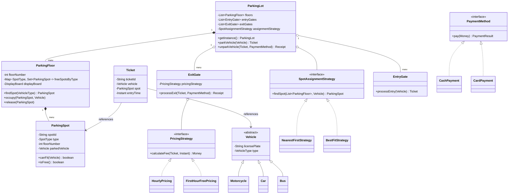

# Design a Parking Lot

The parking lot is THE classic LLD opener — nearly every machine-coding loop has seen it.
Interviewers use it to test whether you can turn a fuzzy real-world domain into a clean set
of collaborating classes: vehicle/spot type compatibility (inheritance vs. enums), spot
allocation (Strategy), pricing (Strategy again, for a different axis), and the ticket
lifecycle (park → ticket → pay → exit). It also has the single most famous LLD concurrency
question baked in: *two cars arrive at two gates and there's one spot left — who gets it?*

> [!INTERVIEW]
> In a 45–60 minute round, budget roughly: 5 min requirements, 10 min entities + class
> diagram, 10 min spot allocation + vehicle/spot compatibility, 10 min ticketing + pricing,
> 15 min code skeleton + follow-ups. The allocation logic and the pricing Strategy are where
> the signal is — don't burn ten minutes modeling the `DisplayBoard`.

## Requirements Clarification

Never draw a class before scoping. Good first-five-minutes questions:

**Functional scope**
- **Structure:** multiple floors? multiple entry and exit gates? (Assume yes to both —
  multi-gate is what makes the concurrency follow-up meaningful.)
- **Vehicle types:** motorcycle, car, bus? Each maps to spot sizes it can use.
- **Spot types:** `MOTORCYCLE`, `COMPACT`, `LARGE`, `HANDICAPPED` (and later `ELECTRIC`).
  Confirm the compatibility matrix: a motorcycle can take any spot, a car needs compact or
  larger, a bus may need one large spot **or** *N* consecutive spots — ask which! The
  consecutive-spot variant changes the allocator significantly; most interviews accept
  "a bus needs one LARGE spot".
- **Ticketing:** ticket issued at entry (records spot, vehicle, entry time), surrendered at
  exit after payment.
- **Pricing:** hourly rate per vehicle type? flat first-hour then per-hour? daily cap?
  Ask — then make pricing a pluggable Strategy so the answer doesn't matter structurally.
- **Payment methods:** cash / card at exit gate or automated kiosk. Model an interface,
  not a payment gateway integration.
- **Capacity feedback:** `DisplayBoard` per floor showing free counts per spot type; reject
  entry with a "lot full" response when nothing fits.

**Scope OUT (say it explicitly)**
- Physical hardware: boom barriers, cameras, license-plate recognition firmware.
- Reservations/booking ahead, mobile apps, loyalty programs (name them as extensions).
- Distributed deployment, database schema, multi-lot franchise management — that's HLD;
  this design is one lot, one process (point to the system-design domain).

**Non-functional expectations worth stating**
- Correctness under concurrency: no double-assignment of the last free spot.
- Extensibility: new vehicle types, spot types, and pricing rules without touching the
  core flow (Open/Closed).
- O(1)-ish spot lookup per request — don't linearly scan 10,000 spots per arrival.

> [!TIP]
> Asking "can a car park in a large spot when compact spots are full?" is a high-signal
> clarification — it tells the interviewer you've spotted that *compatibility* and
> *preference order* are two different concerns.

## Core Objects and Entities

Identify the nouns and give each one responsibility:

| Class | Responsibility |
|---|---|
| `ParkingLot` | Facade + root aggregate. Owns floors and gates, exposes `parkVehicle` / `unparkVehicle`. Often a Singleton (one lot per process). |
| `ParkingFloor` | Owns its `ParkingSpot`s; tracks free spots **per spot type** for fast lookup; owns a `DisplayBoard`. |
| `ParkingSpot` | One physical spot: `id`, `SpotType`, floor, occupancy. Knows *whether* it can fit a vehicle; does **not** choose which vehicle gets it. |
| `Vehicle` (abstract) → `Motorcycle`, `Car`, `Bus` | Identity (`licensePlate`) + `VehicleType`. Pure data; vehicles don't park themselves. |
| `Ticket` | Immutable record of a parking event: ticket id, vehicle, spot, entry time. The join point between entry and payment. |
| `EntryGate` / `ExitGate` | Thin boundary objects. Entry gate asks the lot to allocate and prints the ticket; exit gate computes the fee, takes payment, frees the spot. |
| `PricingStrategy` (interface) | `calculateFee(ticket, exitTime)`. Implementations: `HourlyPricing`, `FirstHourFreePricing`, `DailyCapPricing`. |
| `SpotAssignmentStrategy` (interface) | Given a vehicle, pick a free compatible spot. Implementations: `NearestFirstStrategy`, `BestFitStrategy` (smallest compatible spot first). |
| `Payment` / `PaymentMethod` | Payment record + method abstraction (`CashPayment`, `CardPayment`). |
| `DisplayBoard` | Observer of a floor's free counts; render-only, no logic. |

Key relationship calls to make out loud:
- `ParkingLot` **composes** `ParkingFloor`s, which **compose** `ParkingSpot`s — parts don't
  outlive the whole (a spot has no meaning outside its floor).
- `Ticket` **associates** a `Vehicle` with a `ParkingSpot` — it references both but owns
  neither (plain association, not composition).
- `ParkingLot` **holds a** `SpotAssignmentStrategy` and the exit flow **holds a**
  `PricingStrategy` — aggregation, swappable at runtime.
- `Vehicle` and `ParkingSpot` are related only through the **compatibility rule**
  (`spot.canFit(vehicle)`), not through inheritance — a `Car` is not a kind of `CompactSpot`.

> [!KEY-TAKEAWAY]
> The two axes that vary independently — *where to park* (assignment) and *what to charge*
> (pricing) — each get their own Strategy interface. Everything else (floors, spots,
> tickets, gates) is stable structure. Naming that split early is the strongest signal
> in this problem.

## Class Diagram



Keep it this size. An enterprise-grade diagram with `Address`, `ParkingAttendant`,
`CCTVCamera` classes is *worse* in an interview — it dilutes the design signal.

## Key Design Decisions and Patterns

Name each pattern and the *requirement* that justifies it (see the dp-* topics for the
patterns themselves — here we only apply them):

**Strategy for pricing.** "Hourly today, first-hour-free next quarter, weekend flat rate
after that" is a textbook *policy that varies independently of the mechanism*. An `if-else`
chain over pricing modes inside `ExitGate` violates Open/Closed — every new rate plan edits
tested exit-flow code. `PricingStrategy` implementations are added, not edited, and each is
unit-testable in isolation.

**Strategy for spot assignment.** Same reasoning, different axis: `NearestFirstStrategy`
(minimize walk/drive distance) vs. `BestFitStrategy` (put a motorcycle in a motorcycle
spot even if a compact spot is nearer, preserving big spots for big vehicles). The trade-off
is real — nearest-first can strand a bus because cars ate all the large spots — so making it
pluggable shows judgment, not pattern-collecting.

**Factory for spot/vehicle creation.** Lot initialization ("floor 2: 20 motorcycle, 50
compact, 10 large, 5 handicapped") goes through a `ParkingSpotFactory` so construction
logic (IDs, type wiring) lives in one place. A simple static factory method is enough —
don't build an Abstract Factory hierarchy for this.

**Singleton for `ParkingLot` — with a caveat.** There is one physical lot per process, and
gates need a shared root object. Say the caveat out loud: Singletons hurt testability
(global state), so prefer *injecting a single instance* created in `main()`. Offering
"conceptually a singleton, injected in practice" earns points; reciting
`getInstance()` with double-checked locking without the caveat does not.

**Enums + compatibility method, not subclass-per-combination.** `VehicleType` and
`SpotType` are enums; `ParkingSpot.canFit(vehicle)` encodes the matrix
(motorcycle → any spot, car → COMPACT/LARGE, bus → LARGE only). Creating
`CompactSpotForCar`, `LargeSpotForBus`... subclasses is a combinatorial explosion —
inheritance is for *behavioral* variation, and fitting is a rule, not a behavior.

**Per-floor free-set indexing.** Each floor keeps `Map<SpotType, Set<ParkingSpot>>`
(or a `TreeSet` ordered by spot number for "nearest"). Allocation = probe compatible types
in preference order, floor by floor — no O(n) scan of every spot. This is the
data-structure-choice moment of the problem (internals of the map/heap belong to dsa-coding).

> [!KEY-TAKEAWAY]
> Two Strategies (pricing, assignment), one Factory (spot creation), one carefully-hedged
> Singleton (the lot). If you're reaching for a fifth pattern, you're probably
> over-engineering.

## API and Method Signatures

The public surface is small — two flows plus queries:

```java
// Entry flow
Ticket parkVehicle(Vehicle vehicle) throws ParkingFullException;

// Exit flow
Receipt unparkVehicle(String ticketId, PaymentMethod paymentMethod)
        throws InvalidTicketException, PaymentFailedException;

// Queries
boolean hasAvailableSpot(VehicleType type);
Map<SpotType, Integer> getAvailabilityByFloor(int floorNumber);

// Strategy interfaces
interface SpotAssignmentStrategy {
    Optional<ParkingSpot> findSpot(List<ParkingFloor> floors, Vehicle vehicle);
}
interface PricingStrategy {
    Money calculateFee(Ticket ticket, Instant exitTime);
}
interface PaymentMethod {
    PaymentResult pay(Money amount);
}
```

Signature-design points interviewers notice:
- `parkVehicle` returns a `Ticket`, not a `ParkingSpot` — the ticket is the customer-facing
  artifact and the key for the exit flow.
- Exit takes a `ticketId` (what the customer physically has), and the lot looks up the live
  ticket in a `Map<String, Ticket>` of active tickets.
- `Optional<ParkingSpot>` from the strategy (or a checked `ParkingFullException` from the
  facade) forces callers to handle "lot full" — no silent nulls.
- Fees use a `Money` type (amount + currency), never `double`.

## Code Skeleton

Enough structure to show the design; elide bodies that don't carry signal:

```java
enum VehicleType { MOTORCYCLE, CAR, BUS }
enum SpotType { MOTORCYCLE, COMPACT, LARGE, HANDICAPPED }

abstract class Vehicle {
    private final String licensePlate;
    private final VehicleType type;
    // ctor + getters
}
class Car extends Vehicle { /* type = CAR */ }
class Bus extends Vehicle { /* type = BUS */ }
class Motorcycle extends Vehicle { /* type = MOTORCYCLE */ }

class ParkingSpot {
    private final String spotId;
    private final SpotType type;
    private final int floorNumber;
    private Vehicle parkedVehicle;              // null when free

    boolean canFit(Vehicle v) {
        return switch (v.getType()) {
            case MOTORCYCLE -> true;             // fits anywhere
            case CAR -> type == SpotType.COMPACT || type == SpotType.LARGE;
            case BUS -> type == SpotType.LARGE;
        };
    }
    boolean isFree() { return parkedVehicle == null; }
}

class ParkingFloor {
    private final int floorNumber;
    private final Map<SpotType, NavigableSet<ParkingSpot>> freeSpotsByType;

    Optional<ParkingSpot> findSpot(Vehicle v, List<SpotType> preferenceOrder) {
        for (SpotType t : preferenceOrder) {
            NavigableSet<ParkingSpot> free = freeSpotsByType.get(t);
            if (free != null && !free.isEmpty()) return Optional.of(free.first());
        }
        return Optional.empty();
    }
    void occupy(ParkingSpot spot, Vehicle v) { /* remove from free set, set vehicle */ }
    void release(ParkingSpot spot)           { /* clear vehicle, add back to free set */ }
}

class Ticket {
    private final String ticketId;
    private final Vehicle vehicle;
    private final ParkingSpot spot;
    private final Instant entryTime;
    // immutable — no setters
}

class HourlyPricing implements PricingStrategy {
    private final Map<VehicleType, Money> ratePerHour;
    public Money calculateFee(Ticket t, Instant exitTime) {
        long hours = ceilHours(t.getEntryTime(), exitTime);   // partial hour rounds up
        return ratePerHour.get(t.getVehicle().getType()).times(hours);
    }
}

class ParkingLot {
    private final List<ParkingFloor> floors;
    private final SpotAssignmentStrategy assignmentStrategy;
    private final Map<String, Ticket> activeTickets = new ConcurrentHashMap<>();
    private final Object allocationLock = new Object();       // see Concurrency

    public Ticket parkVehicle(Vehicle v) {
        synchronized (allocationLock) {
            ParkingSpot spot = assignmentStrategy.findSpot(floors, v)
                    .orElseThrow(ParkingFullException::new);
            floorOf(spot).occupy(spot, v);
            Ticket t = new Ticket(UUID.randomUUID().toString(), v, spot, Instant.now());
            activeTickets.put(t.getTicketId(), t);
            return t;
        }
    }

    public Receipt unparkVehicle(String ticketId, PricingStrategy pricing,
                                 PaymentMethod method) {
        Ticket t = activeTickets.get(ticketId);
        if (t == null) throw new InvalidTicketException(ticketId);
        Money fee = pricing.calculateFee(t, Instant.now());
        PaymentResult result = method.pay(fee);
        if (!result.success()) throw new PaymentFailedException();
        synchronized (allocationLock) {
            floorOf(t.getSpot()).release(t.getSpot());
            activeTickets.remove(ticketId);
        }
        return new Receipt(t, fee, result);
    }
}
```

Note what is *not* here: no getters/setters ceremony, no `DisplayBoard` internals, no
payment-gateway plumbing. In a live round, write exactly this much and narrate the rest.

## Concurrency and Edge Cases

**The famous race: two cars, two gates, one spot.** Both entry gates call
`parkVehicle` concurrently; both strategies see the same free spot; both "occupy" it —
one vehicle's ticket points at a spot physically holding the other vehicle. Fixes, in
increasing sophistication:

1. **Single coarse lock** around find-and-occupy (as in the skeleton). Correct and simple —
   the right first answer. Throughput is fine for a parking lot (arrivals per second, not
   thousands).
2. **Per-floor locks** — gates parking on different floors don't contend. Mention lock
   ordering if any operation ever needs two floors.
3. **Atomic claim on the spot** — `AtomicReference<Vehicle>` /
   `compareAndSet(null, vehicle)` inside `ParkingSpot.tryOccupy(vehicle)`; the strategy
   *proposes* a spot and the claim either wins or retries with the next candidate.
   Lock-free, but you must handle the retry loop.

The key point to articulate: **check-then-act must be atomic**. `findSpot()` then
`occupy()` as two separate synchronized calls is still broken — the race lives *between*
them.

**Edge cases to enumerate (each is a one-liner in the interview):**
- Lot full → `ParkingFullException` at entry; display boards show 0; gate rejects.
- Lost ticket → policy question: charge max-day rate (common real-world answer); needs an
  `assessLostTicket(licensePlate)` path that finds the active ticket by plate.
- Payment failure at exit → vehicle stays parked, ticket stays active, spot stays occupied;
  retry payment. Never free the spot before payment succeeds.
- Clock issues → exit time before entry time (clock reset): charge minimum, log it.
- Duplicate exit with the same ticket → second call finds no active ticket → `InvalidTicketException`.
- Handicapped spots → only vehicles with a handicapped permit may take them: a
  *predicate on the vehicle/driver*, enforced in `canFit` or the assignment strategy.

## Extensibility

The "now add X" follow-ups, and why the design absorbs them:

**EV charging spots.** Add `SpotType.ELECTRIC` and an `ElectricVehicle` marker (or a
`needsCharging` attribute). `canFit` gains one rule; assignment strategies pick ELECTRIC
spots for EVs that want charging. Charging *fees* compose with parking fees — a
`CompositePricingStrategy` sums a base strategy and a `ChargingFeeStrategy` (metered by
kWh or charging minutes recorded on the ticket). No existing class is modified beyond the
enum and the matrix — that's Open/Closed working.

**Monthly passes / subscriptions.** A `MonthlyPassPricing` implements `PricingStrategy`
returning zero (or a flat fee) for pass-holders; pass lookup keys off the license plate.
Entry flow unchanged — the ticket is still issued (you still need the spot bookkeeping);
only the exit-time fee calculation differs. This is exactly why pricing was a Strategy.

**Valet parking.** A `ValetService` sits *in front of* the lot: it takes the vehicle at a
drop-off point, calls the same `parkVehicle`, and maps `claimCheckId → ticketId`. The core
lot doesn't change — valet is a new client of the existing API, which is the answer the
interviewer wants to hear.

**Dynamic / surge pricing.** Another `PricingStrategy` that reads current occupancy.
Note the wrinkle: is the rate fixed at entry (stamp it on the ticket) or computed at exit?
Stating that question is the senior move.

**Reservations.** Requires a `Reservation` entity and a spot state beyond free/occupied
(`RESERVED`, with expiry). This genuinely changes the allocator — acknowledge it's the
biggest of the extensions rather than hand-waving it.

**"Scale to a city of lots" →** explicitly an HLD question (multi-node state, a lot-finder
service, payments infra). Say one sentence and point to system-design; don't redesign
classes.

## Common Interview Follow-ups

- "Add EV charging spots with metered charging fees — what changes?" (enum + matrix rule +
  composite pricing; nothing structural)
- "Two cars at two gates race for the last spot — walk me through the failure and fix it."
  (atomic check-then-act; coarse lock → per-floor locks → CAS on spot)
- "A bus needs 5 consecutive motorcycle-row spots — how does the allocator change?"
  (free-*range* tracking per row, e.g. ordered set + adjacency scan; significantly harder —
  scope it honestly)
- "Customer lost the ticket — design the exit flow." (lookup active ticket by plate,
  max-day-rate policy, attendant override)
- "Why Strategy for pricing instead of an if-else on an enum?" (OCP: new plans are added
  not edited; isolated tests; runtime swap per gate/lot)
- "Why is `Ticket → ParkingSpot` an association and not composition?" (independent
  lifecycles — the spot outlives every ticket ever issued against it)
- "Make `ParkingLot` a Singleton — defend or attack." (one-per-process is real, but global
  state hurts tests; inject a single instance instead)
- "Support 10 lots in one process for a mall operator." (drop the Singleton, `ParkingLot`
  becomes a plain aggregate keyed by lotId — cheap if you didn't hard-wire `getInstance()`
  everywhere)
- "Where would Observer fit?" (`DisplayBoard` observing floor occupancy changes; also
  notifications when ELECTRIC spots free up)

## References

- *Head First Design Patterns* (Freeman & Robson) — Strategy and Factory chapters, the two
  patterns this problem leans on.
- *Design Patterns: Elements of Reusable Object-Oriented Software* (GoF) — Strategy,
  Singleton (and its trade-offs).
- Grokking the Object-Oriented Design Interview — "Design a Parking Lot" chapter (the
  canonical interview treatment; this design intentionally trims its enterprise extras).
- *Effective Java* (Bloch) — Item 3 (singletons), Item 17 (immutability, applied to
  `Ticket`), Items on enums vs. class hierarchies.
- Java Concurrency in Practice (Goetz) — check-then-act races and compound-action
  atomicity, the exact bug in the two-gates scenario.
