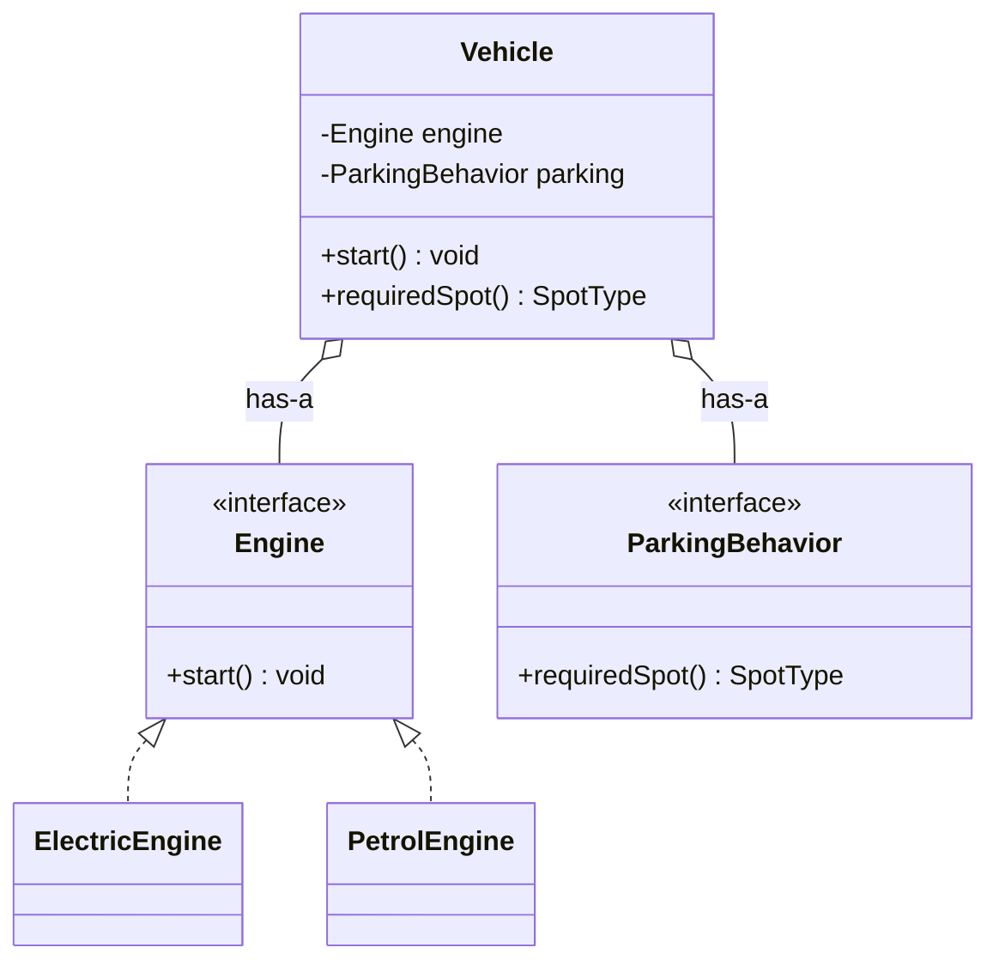
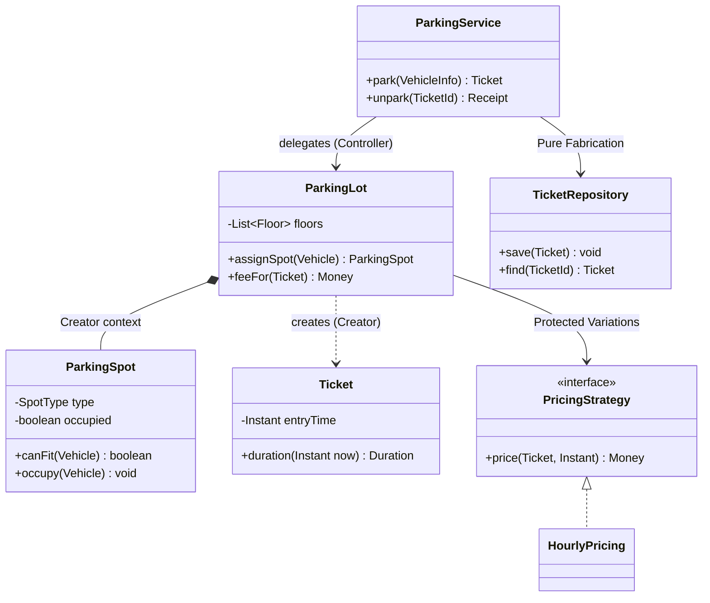

# Design Principles Beyond SOLID

SOLID gets all the airtime, but interviewers listen just as hard for the *other* principles:
DRY without premature abstraction, KISS and YAGNI as scope control, composition over
inheritance, Law of Demeter, Tell-Don't-Ask, separation of concerns, cohesion/coupling,
and the GRASP responsibility-assignment patterns. In a 45–90 minute machine-coding round
these principles are what decide **which class gets which method** — the question you answer
fifty times per session. This topic teaches each principle with violation-vs-fix code and
ties it back to a concrete LLD decision (parking lot, Splitwise, elevator, vending machine).

## Why These Principles Decide Interviews

SOLID tells you what a *finished* design should look like. The principles in this topic tell
you **what to do next** while the design is still forming under time pressure:

- "Should `Order` compute its own total, or should `OrderService` loop over items?" →
  **Information Expert** (GRASP).
- "Who constructs the `Ticket`?" → **Creator** (GRASP).
- "Do I write `VehicleFactory` now or when the interviewer asks for trucks?" → **YAGNI**.
- "These two pricing branches share three lines — extract a base class?" → **DRY vs.
  premature abstraction**.
- "Is `lot.getFloor(2).getSpot(14).setOccupied(true)` OK?" → **Law of Demeter / Tell-Don't-Ask**.

A candidate who can *name the principle behind each micro-decision* signals senior judgment.
The rest of this topic covers each principle as: definition → violation code → fixed code →
where it shows up in a real LLD problem.

## DRY — Don't Repeat Yourself

DRY (from *The Pragmatic Programmer*) says: **every piece of knowledge should have a single,
authoritative representation in the system**. The key word is *knowledge*, not *text*.
Duplicated business rules are the enemy — when the parking fee grace period changes from 15
to 10 minutes, it must change in exactly one place.

Violation — the same fee rule pasted twice:

```java
class EntryGate {
    Ticket issue(Vehicle v) {
        // grace period: first 15 min free
        long freeUntil = clock.now() + 15 * 60_000;
        ...
    }
}
class ExitGate {
    Money charge(Ticket t) {
        if (clock.now() - t.entryTime() < 15 * 60_000) return Money.ZERO; // duplicated rule
        ...
    }
}
```

Fix — one authority for the rule:

```java
class PricingPolicy {
    private static final Duration GRACE = Duration.ofMinutes(15);
    boolean withinGrace(Instant entry, Instant now) {
        return Duration.between(entry, now).compareTo(GRACE) < 0;
    }
}
```

Now both gates delegate to `PricingPolicy`. In an interview, catching your own duplication
and saying "this rule now lives in two places — let me centralize it in a policy object"
is a strong senior signal.

## Wrong DRY — Premature Abstraction and Incidental Duplication

The most common *misuse* of DRY is merging code that merely **looks alike** but represents
**different knowledge**. Sandi Metz's rule: *"duplication is far cheaper than the wrong
abstraction."*

Classic trap: in Splitwise, `EqualSplit` and `PercentageSplit` both "loop over users and
assign amounts", so a candidate extracts an abstract `BaseSplit.computeShares()` template
with boolean flags. Two follow-ups later (`ExactSplit`, rounding rules, payer exclusion)
the shared method sprouts `if (isPercentage && !isExact)` branches — the abstraction now
**couples unrelated rules together**, and every change risks breaking the other splits.

Rule of thumb:

- **Same knowledge, same reason to change** → deduplicate (DRY applies).
- **Coincidentally similar code, different reasons to change** → keep the duplication;
  this is *incidental duplication*.
- **Rule of three (AHA — Avoid Hasty Abstractions):** tolerate the second copy; only on the
  third occurrence do you know enough about the axis of variation to extract the right
  abstraction.
- If an extracted method needs a **boolean/mode parameter to serve its callers differently**,
  the abstraction is wrong — inline it back and let each caller own its version.

Acceptable duplication in a 45-minute round: two similar-looking validation blocks, test
setup code, two DTOs with overlapping fields. Say out loud: "these look similar but change
for different reasons — I'll keep them separate for now."

## KISS — Keep It Simple

KISS: **the simplest design that satisfies the stated requirements wins.** In an LLD
interview, complexity you add must be *paid for* by a requirement you can point to.

Over-engineered (real interview failure mode):

```java
// Tic-tac-toe, 45 minutes on the clock:
interface CellStateVisitor<R> { ... }
abstract class AbstractBoardFactoryProvider { ... }
class ReflectionBasedRuleEngineLoader { ... }   // reads win rules from XML
```

KISS version:

```java
class Board {
    private final Cell[][] grid;
    boolean placeMark(Position p, Mark m) { ... }
    Optional<Mark> winner() { ... }   // checks rows, cols, diagonals
}
```

KISS heuristics for the interview room:

- Start with an `enum` before an interface hierarchy; upgrade only when behavior varies.
- Prefer a plain method to a pattern until the *second* variant appears (then Strategy/State).
- Three classes that do real work beat eight classes that forward calls.
- If you can't finish working code for the happy path, the "beautiful architecture" scores
  worse than a simple design that runs.

KISS is not "no patterns" — it's *no unpaid-for patterns*. Strategy for pricing is simple
**and** justified once the interviewer says "pricing differs by vehicle type."

## YAGNI — You Aren't Gonna Need It

YAGNI (from Extreme Programming): **don't build capability for hypothetical future
requirements.** The cost of a speculative feature is triple: the time to build it now, the
carrying cost of reading/maintaining it, and the likelihood it's *wrong* when the real
requirement arrives.

YAGNI is your **scope-control weapon** in the first five minutes:

- "Should the parking lot support multiple lots per city?" — ask; if not required, **one
  `ParkingLot` object, no `LotRegistry`**.
- "Persistence?" — in-memory `Map` behind a small repository interface; no ORM talk.
- "Do we need user authentication in Splitwise?" — out of scope, say so and move on.

YAGNI vs. extensibility — the crucial nuance: YAGNI forbids **speculative code**, not
**cheap seams**. Coding to an interface (`PricingStrategy`) when you already have one
implementation costs one extra file and buys the follow-up. Building `HourlyPricing`,
`WeekendPricing`, and `SurgePricing` classes *before being asked* burns 15 minutes on
features that score zero. The interview move: **design the seam, implement only the
required variant, and *say* how the next variant would slot in.**

```java
interface PricingStrategy { Money price(Ticket t, Instant exit); }  // the seam — cheap
class HourlyPricing implements PricingStrategy { ... }              // the ONLY impl today
```

## Composition Over Inheritance

Principle (GoF, page 20): **favor object composition over class inheritance.** Inheritance
(*is-a*) is the strongest coupling in OO — the subclass depends on its parent's
implementation details, is fixed at compile time, and each class gets exactly one parent.
Composition (*has-a*) couples only to an interface, can be swapped at runtime, and combines
freely.

Violation — inheritance for code reuse creates a class explosion:

```java
class Car extends Vehicle { ... }
class ElectricCar extends Car { ... }
class ElectricSportsCar extends ElectricCar { ... }
// Now add "sports petrol car" and "electric truck" — the grid of subclasses explodes,
// because engine type and body type vary INDEPENDENTLY.
```

Fix — each independent axis of variation becomes a composed component:

```java
class Vehicle {
    private final Engine engine;         // ElectricEngine | PetrolEngine
    private final BodyType body;
    Vehicle(Engine e, BodyType b) { this.engine = e; this.body = b; }
    void start() { engine.start(); }     // delegation
}
```

Two independent axes with m and n variants: inheritance needs up to **m × n subclasses**;
composition needs **m + n components**. (This is the Bridge pattern's motivation — see the
dp-* topics.)

**Delegation** is the mechanism: the outer object forwards work to the composed part,
optionally adding behavior. Strategy, State, and Decorator are all "composition + delegation"
with different intents.

**The diamond problem** is another reason languages and designs avoid implementation
inheritance: if `D extends B, C` and both `B` and `C` override `A.m()`, which body does `D`
inherit? Java forbids multiple class inheritance outright; interfaces with default methods
force `D` to override and disambiguate (`B.super.m()`). Composition sidesteps it: hold a
`B` and a `C`, and *explicitly choose* what to forward.

## The Is-A vs Has-A Decision Test

When you draw an arrow on the whiteboard, run this checklist before making it inheritance:

1. **Liskov test:** can the subclass be used *everywhere* the parent is, with no surprises?
   (`Square extends Rectangle` fails: `setWidth` breaks callers' expectations.)
2. **Is-a for behavior, not data:** sharing fields is not a reason to inherit; sharing a
   *substitutable contract* is.
3. **Will it vary at runtime?** A `Bird` that can *become* unable to fly (injury) needs a
   composed `FlightBehavior`, not a `FlyingBird` subclass — objects can't change class.
4. **More than one axis of variation?** → composition (see the m×n explosion above).
5. **Do I want only part of the parent's interface?** Inheriting then stubbing methods with
   `UnsupportedOperationException` (like `java.util.Stack extends Vector` exposing
   `insertElementAt`) means it was never is-a.

Interview defaults that follow: `Ticket` **has-a** `Vehicle` (not `CarTicket`/`BikeTicket`
subclasses); `ParkingSpot` has a `SpotType` enum or composed policy, not a subclass per size;
elevator **has-a** `ElevatorState` and a `SchedulingStrategy`. Reserve inheritance for genuine
contracts: `Piece` ← `Knight`/`Bishop` in chess, where every piece truly substitutes and only
`possibleMoves()` varies.



## Law of Demeter — Don't Talk to Strangers

LoD: a method should only call methods on (1) `this`, (2) its own fields, (3) its
parameters, (4) objects it creates locally. **Not on objects returned by other calls** —
those are "strangers." The smell is the *train wreck*:

```java
// ExitGate deciding a fee — violation:
Money fee = lot.getFloor(t.getFloorNo())
              .getSpot(t.getSpotNo())
              .getSpotType()
              .getPricing()
              .compute(t.getDuration());
```

Why it's a real defect, not style pedantry: `ExitGate` now knows the lot's **entire internal
object graph** (lot → floor → spot → type → pricing). Any refactor along that chain — floors
removed, pricing moved onto the ticket — breaks `ExitGate`. Coupling has leaked four levels
deep. It also breaks encapsulation (intermediate objects are forced to expose internals as
getters) and makes the chain null-prone.

Fix — **delegate**: ask the nearest owner to do the work:

```java
Money fee = lot.feeFor(ticket);          // ParkingLot internally knows its structure
// or push the behavior to the expert:
Money fee = ticket.fee(pricingPolicy, clock.now());
```

Each object in the chain exposes *behavior* instead of *structure*. Note the exceptions:
chains on the **same object** returning `this` (builders: `builder.size(2).type(EV).build()`),
and streams/fluent APIs, are fine — LoD counts *strangers*, not *dots*. A DTO with no
behavior is also exempt — there's nothing to delegate to.

## Tell, Don't Ask

Corollary of LoD and encapsulation: **don't query an object's state, decide outside it, and
then push the result back — tell the object what you want done.** The logic belongs with the
data it uses (this is also GRASP's Information Expert).

Violation (ask-then-decide) — vending machine:

```java
// Client code, outside the machine:
if (machine.getState() == State.HAS_MONEY
        && machine.getBalance() >= item.getPrice()
        && machine.getInventory().count(item) > 0) {
    machine.setInventoryCount(item, machine.getInventory().count(item) - 1);
    machine.setBalance(machine.getBalance() - item.getPrice());
    machine.setState(State.DISPENSING);
}
```

Every caller must re-implement this decision; a second entry point (mobile app, admin
console) will inevitably get one condition wrong, and the machine's invariants live in
*client* code where the machine can't defend them. Race conditions also appear — the check
and the mutation are separate calls.

Fix (tell):

```java
DispenseResult result = machine.dispense(itemCode);   // one intention-revealing command
```

`VendingMachine.dispense()` internally checks state, balance, and stock **atomically** and
returns an outcome object. Tell-Don't-Ask is why LLD solutions gravitate to **command-style
methods on domain objects** (`account.debit(amount)`, `elevator.requestFloor(5)`,
`board.placeMark(pos, mark)`) instead of getter/setter soup with logic in a "manager" class.

Limit: don't ban getters. Queries used for *display* or by a different layer are fine; the
smell is **querying in order to make a decision the object could make itself**.

## Separation of Concerns

SoC: partition the system so each unit addresses **one concern** — one cohesive slice of
functionality — and concerns interact through narrow interfaces. SRP is SoC applied at class
level; layering is SoC applied at architecture level.

In a machine-coding round the concerns to visibly separate are:

| Concern | Belongs in | NOT in |
|---|---|---|
| Domain rules (fee math, win check, split logic) | domain classes (`PricingPolicy`, `Board`, `Split`) | `main()`, I/O code |
| Orchestration / use cases | a service/controller (`ParkingService`) | domain entities |
| I/O (CLI parsing, printing) | thin adapter at the edge | domain classes |
| Storage | repository (`TicketRepository`, in-memory `Map`) | services or entities |

Violation everyone commits under time pressure: `System.out.println` and `Scanner` calls
inside `Board` or `ParkingLot`. It seems harmless, but it makes the domain untestable and
signals junior habits. The fix costs nothing: domain methods **return** results
(`MoveResult`, `Ticket`); the CLI layer prints them.

Payoff you can articulate: each concern can change independently (swap CLI for REST, Map for
DB), and each is unit-testable in isolation. When the interviewer says "now expose this as an
API," a separated design answers in one sentence: "replace the CLI adapter; nothing else
changes."

## High Cohesion, Low Coupling

The two master metrics — every other principle serves them.

**Cohesion** = how strongly a class's responsibilities belong together. High cohesion: every
method uses most of the same fields toward one purpose (`PricingPolicy`: all fee math).
Low cohesion: a `ParkingManager` doing spot allocation + billing + gate hardware + reports —
four reasons to change, fields used by disjoint method groups. Fix: split until each class
has one describable job ("computes fees").

**Coupling** = how much a class knows about others. Aim for coupling to **stable
abstractions** (interfaces, small parameter objects), not to concrete classes' internals.
Content coupling (reaching into another object's fields) > common global state > control
coupling (passing a flag telling another method what to do) > data coupling (passing exactly
the values needed) — you want to live at the data/abstract end.

Quantifying it (the vocabulary is worth knowing at senior level, per Robert Martin's package
metrics):

- **Efferent coupling (Ce):** how many classes *this one depends on* (fan-out). High Ce →
  fragile, changes elsewhere break it.
- **Afferent coupling (Ca):** how many classes *depend on this one* (fan-in). High Ca →
  changing it is risky, so it had better be stable.
- **Instability I = Ce / (Ca + Ce)**, from 0 (stable, everyone depends on it, it depends on
  nothing) to 1 (unstable, easy to change). Healthy designs make heavily-depended-on things
  **abstract and stable** (the `PricingStrategy` interface: high Ca, I ≈ 0) and volatile
  things **leaf-like** (`WeekendPricing`: I ≈ 1, nothing depends on it, safe to change).
  Pain = a concrete, hard-to-change class that everything depends on.

Cohesion and coupling trade against each other at the extremes: one giant class has zero
external coupling but no cohesion; a thousand nano-classes are each cohesive but create a
coupling web. The principles above (SoC, LoD, Tell-Don't-Ask) are how you find the balance.

## GRASP — Responsibility Assignment Overview

GRASP (General Responsibility Assignment Software Patterns, from Craig Larman's *Applying
UML and Patterns*) answers the question you face constantly in an LLD round: **"which class
should own this method?"** Nine patterns: Creator, Information Expert, Controller, Low
Coupling, High Cohesion, Polymorphism, Pure Fabrication, Indirection, Protected Variations.
Low Coupling and High Cohesion (above) are the *evaluative* pair — you use them to judge the
assignments the other patterns propose.

Unlike GoF patterns (which are class structures), GRASP patterns are *decision principles*.
You rarely say "I'm using GRASP" — you *demonstrate* it every time you place a method well.
The next sections walk through the remaining seven with LLD-round examples.

## GRASP: Information Expert

**Assign a responsibility to the class that has the information needed to fulfill it.**
This is the default move — start here for every new behavior.

- "Who computes a ticket's parked duration?" → `Ticket` (it holds `entryTime`).
- "Who knows if a `ParkingSpot` fits a vehicle?" → `ParkingSpot.canFit(Vehicle)` — it knows
  its own size and occupancy.
- "Who computes an `Order` total?" → `Order` sums its `LineItem.subtotal()`s; each
  `LineItem` (expert on quantity × price) computes its own.

Violation: an `OrderService` that loops `order.getItems()`, reads each item's price and
quantity, and multiplies — the service demands data from the experts and does their job
(ask-not-tell), coupling itself to `LineItem` internals.

Caveat: expert can conflict with SoC — `Ticket` has the data to *persist itself*, but
saving is a storage concern, so it goes to a repository (a Pure Fabrication) instead.
Information Expert proposes; cohesion and SoC veto.

## GRASP: Creator

**Class A should create instances of B if A contains/aggregates B, closely uses B, or has
the initializing data for B.** Creation is itself a responsibility to assign deliberately.

- `ParkingLot` (or the entry gate flow it owns) creates `Ticket` — it aggregates tickets and
  has the initializing data (spot, vehicle, time).
- `Order` creates its `LineItem`s. `Board` creates its `Cell`s. In Splitwise, `ExpenseManager`
  or `Group` creates `Expense` objects.

Anti-pattern: a random `TicketUtil.createTicket(...)` or letting the CLI layer `new Ticket(...)`
— now creation knowledge (constructor args, invariants) leaks to a class with no relationship
to `Ticket`.

When creation is **complex** — subtype chosen at runtime by conditions, families of related
objects — Creator escalates to a Factory (which is a Pure Fabrication; the GoF dp-* topics
cover the mechanics). In an interview: `new` inside the natural creator first; introduce
`VehicleFactory` only when the interviewer's requirement makes construction genuinely
conditional.

## GRASP: Controller

**Assign the responsibility of receiving a system operation (an external event) to a
controller** — either a facade over the subsystem (`ParkingLotSystem`, `VendingMachine`) or a
per-use-case handler. The controller is the first object *behind the UI* that coordinates the
work; it should **delegate, not do** — a controller performing business logic is the "bloated
controller" smell (low cohesion).

In machine-coding terms: your `main()`/CLI parses input and calls
`parkingService.parkVehicle(plate, type)`; the service coordinates lot, spot assignment, and
ticket issue, each performed by the expert objects. This gives you a natural demo script and
a seam where a REST layer could later replace the CLI (SoC again).

## GRASP: Polymorphism and Protected Variations

**Polymorphism (GRASP):** when behavior varies by type, assign the behavior to the types
themselves via a polymorphic operation — *instead of* `if/switch` on a type tag. The
recurring interview beat: fee `switch (vehicle.type)` → `PricingStrategy` per type; chess
`switch (piece.kind)` → `piece.possibleMoves(board)`; elevator `switch (state)` → State
objects. Each new variant becomes a **new class, zero edits** to existing logic (this is how
you *achieve* OCP).

**Protected Variations:** identify **predicted points of instability** — requirements likely
to change — and wrap them in a stable interface so variations don't ripple outward. It's the
umbrella principle: Strategy-behind-an-interface, repository-over-storage, and even LoD
(protecting against structural change) are all PV. In the interview, PV is the *say-it-out-
loud* principle: "pricing is the volatile axis here, so I'm putting an interface in front of
it; spot layout seems stable, so a plain class is fine." Knowing **where not to add
protection** (YAGNI) is the senior half of PV.

## GRASP: Pure Fabrication and Indirection

**Pure Fabrication:** when assigning a responsibility to any domain class would wreck its
cohesion or coupling, invent a class that **doesn't represent a domain concept**.
`TicketRepository`, `SpotAssignmentStrategy`, `NotificationDispatcher`, `IdGenerator` —
no parking lot in the real world contains a "repository", but the fabrication keeps `Ticket`
and `ParkingLot` clean. Most GoF patterns' participants (factories, adapters, strategies) are
pure fabrications. Guard rail: every fabrication must earn its place; ten `*Manager`/`*Helper`
classes shredding one use case is fabrication abuse (and a KISS violation).

**Indirection:** decouple two elements by assigning the mediation responsibility to an
intermediate object — "any problem can be solved by another level of indirection." The
repository *is* indirection between domain and storage; an event bus between elevator and
display panels is indirection removing a direct dependency. Cost: each level adds a hop to
trace through — add it to break a coupling you can name, not by reflex (KISS).

## Putting It Together: One Parking-Lot Decision Trail

How the principles fire in sequence during a single design conversation:



1. **Controller:** CLI hits `ParkingService.park(...)` — one entry point, delegates down.
2. **Creator:** `ParkingLot` creates `Ticket` (has the initializing data).
3. **Information Expert:** `ParkingSpot.canFit(vehicle)` — the spot knows its size;
   `Ticket.duration(now)` — the ticket holds entry time.
4. **Tell-Don't-Ask / LoD:** exit flow calls `lot.feeFor(ticket)`, never
   `lot.getFloor(...).getSpot(...)`.
5. **Protected Variations + Polymorphism:** pricing behind `PricingStrategy`; **YAGNI**
   says implement only `HourlyPricing` today.
6. **Pure Fabrication:** `TicketRepository` so neither `Ticket` nor `ParkingLot` owns storage.
7. **KISS:** no `Floor` abstraction if the problem says single-level lot; no factory until
   construction becomes conditional.

Narrating even three of these decisions with their principle names is a hire-signal.

## Common Interview Follow-ups

- **"You extracted a base class for the two splits — now percentage splits need rounding
  rules that exact splits must not have. What do you do?"** Admit the abstraction is wrong
  before patching it with flags: inline the shared method back into the variants (undo the
  DRY), let each own its logic, and re-extract later only what is genuinely common knowledge.
- **"Why is `getFloor().getSpot().setOccupied()` bad but `builder.size().type().build()`
  fine?"** LoD counts strangers, not dots: the builder chain returns the same object (`this`)
  each time, so there's one collaborator; the spot chain traverses three different objects'
  internals, coupling the caller to the lot's structure.
- **"Your `ParkingService` is 300 lines. Which GRASP smells is it showing and how do you
  fix it?"** Bloated Controller / low cohesion: it's *doing* instead of *delegating*. Move
  fee math to the pricing expert, spot choice to an assignment strategy (Pure Fabrication),
  persistence to the repository; the service keeps only orchestration.
- **"Should `Vehicle` have subclasses `Car`, `Bike`, `Truck`?"** Only if behavior varies per
  type beyond data. If the only difference is spot size and rate, an enum/`SpotType` field +
  composed pricing is simpler (KISS); subclass when methods like `requiredSpot()` genuinely
  branch — and check Liskov substitutability first.
- **"Where would you put an interface *today* even with one implementation, and where would
  you refuse to?"** Put one at the axis the problem statement flags as variable (pricing,
  spot assignment, notification) — Protected Variations at a predicted instability. Refuse
  everywhere else (entities, value objects) — YAGNI; an interface with one forever-
  implementation is noise.
- **"Two gates can grab the last spot concurrently — does Tell-Don't-Ask help?"** Yes:
  because check-and-occupy live *inside* `ParkingSpot.occupy()`/`ParkingLot.assignSpot()`
  rather than in callers, there's one place to make atomic (synchronize the method or CAS the
  occupied flag). Ask-then-set spreads the race across every caller.
- **"Your design has 14 classes for tic-tac-toe. Defend or simplify."** Simplify: name the
  fabrications that aren't earning their coupling cost (factory with one product, interfaces
  with one stable impl), collapse them, keep the two seams the requirements actually stress
  (player types: human/AI, and win rules if the board generalizes to N×N).

## References

- Andrew Hunt & David Thomas, *The Pragmatic Programmer* — DRY (the original formulation).
- Craig Larman, *Applying UML and Patterns*, ch. 17 & 25 — GRASP patterns.
- Sandi Metz, ["The Wrong Abstraction"](https://sandimetz.com/blog/2016/1/20/the-wrong-abstraction) — duplication vs. premature DRY.
- Kent C. Dodds, ["AHA Programming"](https://kentcdodds.com/blog/aha-programming) — Avoid Hasty Abstractions.
- GoF, *Design Patterns* — "favor object composition over class inheritance" (Introduction).
- Karl Lieberherr et al., "Object-Oriented Programming: An Objective Sense of Style" (OOPSLA '88) — Law of Demeter.
- Alec Sharp via Martin Fowler, ["TellDontAsk"](https://martinfowler.com/bliki/TellDontAsk.html).
- Robert C. Martin, *Agile Software Development* — package coupling metrics (Ca, Ce, Instability).
- Martin Fowler, ["Yagni"](https://martinfowler.com/bliki/Yagni.html).
- Related topics in this library: `dp-strategy`, `dp-state`, `dp-factory` (pattern mechanics), `oop-principles-pillars` (encapsulation, polymorphism), SOLID topic (the five principles this one extends).
