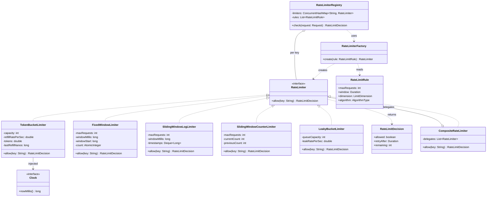

# Design a Rate Limiter (OO)

An LLD classic that bridges toward system design. In the machine-coding round the
interviewer wants a **single-machine, in-memory rate limiter with clean OO structure**:
multiple algorithms behind one interface (Strategy), rules that describe limits,
composable per-user / per-API policies, and thread-safe counters. Distributed rate
limiting (Redis, gateway-level) is explicitly an HLD follow-up — acknowledge it and
keep the class design local.

## Requirements Clarification

Spend the first five minutes locking scope. Good questions to ask:

- **What are we limiting?** Requests per client (userId / API key / IP), per API
  endpoint, or both combined? (Both → you'll need composable rules.)
- **What limit shape?** "N requests per T seconds" is the standard. Do we need burst
  allowance (token bucket) or strict uniform pacing (leaky bucket)?
- **Which algorithm?** Ideally the design should support *several* — that's the hint
  that the core of this problem is the **Strategy pattern**, not the math.
- **What happens on rejection?** Return a decision object (allowed/denied +
  `retryAfter`), throw, or queue the request? Convention: return a decision; let the
  caller (an HTTP filter) map it to `429 Too Many Requests`.
- **Where does config come from?** Static rules at construction vs. dynamic rule
  updates at runtime (dynamic → rules must be swappable, not baked into constructors).
- **Single machine or distributed?** Say out loud: "I'll design a single-process,
  in-memory limiter with a storage abstraction so a distributed backend can be slotted
  in later — the distributed coordination itself is an HLD topic."
- **Concurrency?** Yes — a rate limiter sits on the hot path of a multithreaded
  server. Thread safety is a first-class requirement, not an afterthought.

**Scope out:** distributed consensus, cluster-wide quota sharing, persistence across
restarts, billing/quota tiers. Mention them, park them.

> [!INTERVIEW]
> The single highest-signal sentence you can say in the first five minutes:
> "Different rate-limiting algorithms are interchangeable policies, so I'll put them
> behind a common `RateLimiter` interface — this is the Strategy pattern." That one
> framing drives the entire design.

## Core Objects and Entities

Identify the nouns and give each one responsibility:

| Class / Interface | Responsibility |
|---|---|
| `RateLimiter` (interface) | Single contract: decide whether a request is allowed *now*. |
| `TokenBucketLimiter` | Strategy: bucket of tokens, steady refill, consume one per request; allows bursts up to capacity. |
| `FixedWindowLimiter` | Strategy: counter per fixed time window, reset at window boundary. |
| `SlidingWindowLogLimiter` | Strategy: log of request timestamps, count those inside the trailing window. Exact but memory-heavy. |
| `SlidingWindowCounterLimiter` | Strategy: current-window count + weighted fraction of previous window. Approximate, O(1) memory. |
| `LeakyBucketLimiter` | Strategy: FIFO queue drained at a constant rate; smooths bursts into uniform outflow. |
| `RateLimitRule` | Value object: `maxRequests`, `window` (Duration), and the dimension it applies to (per-user, per-IP, per-API). Pure data — no algorithm logic. |
| `RateLimitDecision` | Value object returned by `allow(...)`: `allowed` flag, `retryAfter`, remaining quota. Richer and more testable than a bare boolean. |
| `Request` (or key extractor) | Carries `userId`, `clientIp`, `apiPath`, timestamp — whatever dimensions rules key on. |
| `RateLimiterFactory` | Creational: builds the right strategy from a `RateLimitRule` + algorithm type, so callers never `new` a concrete limiter. |
| `RateLimiterRegistry` / `RateLimiterManager` | Façade the application talks to: maps each key (e.g., `userId:apiPath`) to its limiter instance, creating lazily via the factory. |
| `Clock` (abstraction) | Injected time source (`java.time.Clock` or a `long now()` supplier) so tests can control time deterministically. |

Two separations matter most:

1. **Rule (data) vs. Limiter (algorithm + state).** A `RateLimitRule` says *"100
   requests per minute per user"*; a limiter instance holds the live counters/tokens
   for one key. Conflating them makes rules impossible to share or hot-reload.
2. **Decision vs. exception.** Being rate-limited is an expected outcome on the hot
   path, not an exceptional condition — return a `RateLimitDecision`, don't throw.

## Class Diagram



Relationship notes worth narrating:

- Concrete limiters **implement** (realization) `RateLimiter` — classic Strategy.
- `CompositeRateLimiter` both **implements** `RateLimiter` and **aggregates** a list
  of `RateLimiter`s — that recursive shape is the Composite pattern, and it means
  the registry can treat "one limit" and "a bundle of limits" uniformly.
- The registry holds limiters by **aggregation** in a map keyed by dimension value
  (e.g., `user:42|api:/search`); limiters are created lazily by the factory.

## Key Design Decisions

**1. Strategy is the load-bearing pattern.** Token bucket, fixed window, sliding
window, leaky bucket are interchangeable algorithms with one job: `allow(key)`.
Putting them behind `RateLimiter` means the registry, filters, and tests are all
closed to modification when a new algorithm arrives (Open/Closed Principle). The
anti-design is one `RateLimiter` class with an `algorithmType` field and a `switch`
inside `allow()` — every new algorithm reopens that class, and its fields become a
union of every algorithm's state. (See the `dp-strategy` topic for the pattern
itself.)

**2. Factory hides construction.** Each strategy has different constructor
parameters (capacity + refill rate vs. window + max count). A
`RateLimiterFactory.create(rule)` maps config → concrete strategy in one place, so
adding an algorithm touches the factory and the new class only — callers depend
solely on the `RateLimiter` interface.

**3. Composite/Chain for multi-dimension limits.** Real policies combine: "100/min
per user AND 10k/min per API AND 5/sec per IP". A `CompositeRateLimiter` that ANDs
its children keeps each individual limiter single-purpose (SRP) and lets policies
nest arbitrarily. A Chain-of-Responsibility phrasing (each handler checks then
forwards) is equally acceptable — say why you chose one: Composite when all rules
always apply and you aggregate the result, Chain when handlers may short-circuit or
be ordered (e.g., an allowlist handler first).

**4. Decision object over boolean.** `allow()` returns `RateLimitDecision` with
`allowed`, `retryAfter`, and `remaining` — enough for the HTTP layer to emit `429`
plus `Retry-After` / `X-RateLimit-Remaining` headers without asking the limiter
anything else.

**5. Inject the clock.** Every algorithm is a function of time. Hard-coding
`System.currentTimeMillis()` makes the limiter untestable without `sleep()` calls.
Inject a `Clock`; in tests, advance a fake clock deterministically. This is
Dependency Inversion applied to time.

**6. Storage abstraction (optional but strong).** Keep per-key state behind a small
`RateLimitStore` (get/update state for key). In-memory `ConcurrentHashMap` today; a
Redis-backed store later becomes a new implementation, not a rewrite. That is the
honest single-machine answer to the "how would you distribute this?" follow-up.

> [!KEY-TAKEAWAY]
> Strategy for the algorithms, Factory for construction, Composite (or Chain) for
> combining rules, a value-object decision for the result, and an injected Clock for
> testability. Those five decisions are the whole interview.

## Rate Limiting Algorithms as Strategies

You need the OO shape and trade-offs of each algorithm, not deep math.

**Token Bucket** — state: `tokens` (double), `capacity`, `refillRatePerSec`,
`lastRefillTime`. On `allow()`: lazily refill `tokens += elapsed × rate` (capped at
capacity), then if `tokens >= 1` consume one and allow. Allows **bursts** up to
capacity while enforcing a long-run average rate. Lazy refill on request beats a
background refill thread: no scheduler, no idle work, same behavior.

**Fixed Window** — state: `count`, `windowStart`. If now is past the window, reset
count and start a new window; allow while `count < max`. O(1) and trivial, but has
the **boundary burst** flaw: a client can send `max` requests at the end of one
window and `max` more at the start of the next — up to 2× the intended rate across
the boundary.

**Sliding Window Log** — state: a deque of request timestamps. On `allow()`: evict
timestamps older than `now - window`, allow if `size < max`, append now. **Exact**
(no boundary problem) but O(max) memory *per key* — expensive with many clients and
high limits.

**Sliding Window Counter** — state: counts for the current and previous fixed
windows. Estimate: `previousCount × overlapFraction + currentCount`, where
`overlapFraction` is how much of the trailing window still overlaps the previous
fixed window. **Approximate** but O(1) memory — the standard production compromise
(Cloudflare uses this shape).

**Leaky Bucket** — state: a bounded FIFO queue drained at a constant leak rate
(or an equivalent counter formulation). Output is perfectly **smooth**; bursts are
queued or dropped rather than passed through. Choose it when downstream needs a
constant processing rate; choose token bucket when clients deserve burst allowance.

| Algorithm | Burst handling | Accuracy | Memory / key | Typical pick when |
|---|---|---|---|---|
| Token bucket | Allows bursts to capacity | Exact avg rate | O(1) | Default; API quotas with burst tolerance |
| Fixed window | 2× burst at boundary | Weak at edges | O(1) | Simplicity trumps precision |
| Sliding window log | No boundary burst | Exact | O(max) | Low traffic, strictness required |
| Sliding window counter | Minor approximation | ~Exact | O(1) | High scale, near-exact |
| Leaky bucket | Smooths/queues bursts | Exact outflow | O(queue) | Downstream needs steady rate |

## API and Method Signatures

```java
public interface RateLimiter {
    RateLimitDecision allow(String key);          // key = "user:42" etc.
}

public record RateLimitDecision(boolean allowed, Duration retryAfter, int remaining) {
    public static RateLimitDecision allowed(int remaining) { ... }
    public static RateLimitDecision denied(Duration retryAfter) { ... }
}

public record RateLimitRule(int maxRequests, Duration window,
                            LimitDimension dimension, AlgorithmType algorithm) { }

public enum LimitDimension { USER, IP, API, USER_AND_API }
public enum AlgorithmType  { TOKEN_BUCKET, FIXED_WINDOW, SLIDING_LOG, SLIDING_COUNTER, LEAKY_BUCKET }

public final class RateLimiterFactory {
    public RateLimiter create(RateLimitRule rule) { ... }   // switch on rule.algorithm()
}

public final class RateLimiterRegistry {
    public RateLimitDecision check(Request request) { ... } // resolve key(s), delegate
}
```

Signature choices to defend: `allow(String key)` keeps strategies ignorant of HTTP;
key extraction (`Request → key`) lives in the registry (SRP). `RateLimitDecision` as
an immutable record makes results safe to log and pass across threads.

## Code Skeleton

Token bucket with an injected clock and coarse synchronization (correct first, then
discuss lock-free):

```java
public final class TokenBucketLimiter implements RateLimiter {
    private final int capacity;
    private final double refillPerNano;
    private final Clock clock;

    private double tokens;          // guarded by this
    private long lastRefillNanos;   // guarded by this

    public TokenBucketLimiter(int capacity, double refillPerSecond, Clock clock) {
        this.capacity = capacity;
        this.refillPerNano = refillPerSecond / 1_000_000_000.0;
        this.clock = clock;
        this.tokens = capacity;                 // start full: first burst allowed
        this.lastRefillNanos = clock.nanos();
    }

    @Override
    public synchronized RateLimitDecision allow(String key) {
        refill();
        if (tokens >= 1.0) {
            tokens -= 1.0;
            return RateLimitDecision.allowed((int) tokens);
        }
        long nanosUntilToken = (long) ((1.0 - tokens) / refillPerNano);
        return RateLimitDecision.denied(Duration.ofNanos(nanosUntilToken));
    }

    private void refill() {                     // lazy refill — no background thread
        long now = clock.nanos();
        tokens = Math.min(capacity, tokens + (now - lastRefillNanos) * refillPerNano);
        lastRefillNanos = now;
    }
}
```

Factory and registry:

```java
public final class RateLimiterFactory {
    public RateLimiter create(RateLimitRule rule) {
        return switch (rule.algorithm()) {
            case TOKEN_BUCKET   -> new TokenBucketLimiter(rule.maxRequests(),
                                        rule.maxRequests() / (double) rule.window().toSeconds(),
                                        Clock.system());
            case FIXED_WINDOW   -> new FixedWindowLimiter(rule.maxRequests(), rule.window());
            case SLIDING_LOG    -> new SlidingWindowLogLimiter(rule.maxRequests(), rule.window());
            // ...
        };
    }
}

public final class RateLimiterRegistry {
    private final ConcurrentHashMap<String, RateLimiter> limiters = new ConcurrentHashMap<>();
    private final List<RateLimitRule> rules;
    private final RateLimiterFactory factory;

    public RateLimitDecision check(Request req) {
        for (RateLimitRule rule : rules) {
            String key = rule.dimension().keyFor(req);        // e.g. "USER:42"
            RateLimiter limiter = limiters.computeIfAbsent(
                    rule.id() + "|" + key, k -> factory.create(rule));
            RateLimitDecision d = limiter.allow(key);
            if (!d.allowed()) return d;                        // AND semantics
        }
        return RateLimitDecision.allowed(-1);
    }
}
```

Note the one-limiter-instance-per-key model: `computeIfAbsent` gives atomic lazy
creation, and each instance's state is independent, so contention is per key — two
different users never contend on the same lock.

Be explicit about *where* keying lives, because it changes what `allow(key)` means:

- **Per-key instances (this skeleton).** The registry owns the keying and creates one
  limiter object per key, so a leaf like `TokenBucketLimiter` holds a single `tokens`
  field — its counters *are* the state for that one key. The `key` passed to `allow()`
  is then redundant for the leaf; it rides along only for logging/decision context. If
  that bothers you, drop the parameter (`allow()`) on the leaves and let the registry
  key the map.
- **Per-rule instance with an internal map.** Alternatively, hold *one* limiter per
  rule that keeps a `ConcurrentHashMap<String,State>` and genuinely uses `allow(key)`
  to look up per-key state. The registry then keys its map by rule id alone, not by
  `rule.id() + "|" + key`.

The trade-off: per-key objects give simple per-key locks and easy TTL/LRU eviction of
idle keys, but multiply object count; a per-rule map amortizes objects but needs
striped or per-entry locking and manual entry eviction. Pick one and keep the skeleton
consistent with it.

## Composing Limits with Composite and Chain

"100/min per user AND 20/sec per API" should not produce a
`UserAndApiRateLimiter` mega-class. Two clean shapes:

**Composite (AND semantics):**

```java
// Each entry pairs a leaf limiter with the dimension it keys on, so the
// composite hands every delegate the CORRECT per-dimension key from the Request.
public final class CompositeRateLimiter {
    private record Entry(LimitDimension dimension, RateLimiter limiter) {}
    private final List<Entry> delegates;

    public RateLimitDecision allow(Request req) {
        for (Entry e : delegates) {
            String key = e.dimension().keyFor(req);   // "user:42" vs "api:/search"
            RateLimitDecision r = e.limiter().allow(key);
            if (!r.allowed()) return r;               // deny fast, propagate retryAfter
        }
        return RateLimitDecision.allowed(-1);
    }
}
```

(If you prefer `CompositeRateLimiter` to *be* a `RateLimiter`, give it an
`allow(Request)` overload or make the whole interface `Request`-based; the point is
that combining dimensions needs the `Request`, not one pre-resolved `String`.)

Because `CompositeRateLimiter` *is a* `RateLimiter`, composites nest: (per-user AND
(per-API OR premium-override)).

One correctness subtlety worth volunteering: a single opaque `key` string cannot serve
both a per-user and a per-API delegate — `"user:42"` is the wrong key for the per-API
limiter, which needs `"api:/search"`. So a composite that forwards *one* key to every
child silently rate-limits the wrong dimension. Two clean fixes: either compose over a
`Request` (`allow(Request req)`, each delegate resolving its own key via its
`LimitDimension`), or do the AND-composition at the *registry* level — the registry
already iterates rules and resolves a per-rule key (`rule.dimension().keyFor(req)`), so
each single-dimension leaf gets the correct key and `allow(String)` stays reserved for
leaves. The skeleton's registry loop is exactly that registry-level composition;
`CompositeRateLimiter` earns its place only when it operates over the `Request` (or
carries a per-delegate key resolver), not a pre-resolved String.

A second subtlety: naive short-circuiting **consumes** quota from earlier limiters even
when a later one denies. Fix by splitting the contract into `tryAcquire`/check-then-commit,
or accept and state the small over-count — noticing it is senior-level signal.

**Chain of Responsibility** — same composition expressed as linked handlers; ideal
when some handlers aren't limiters at all: `AllowlistHandler` (admin IPs bypass
everything) → `BlocklistHandler` → `UserLimitHandler` → `ApiLimitHandler`. The
allowlist requirement is exactly why Chain earns its place: a bypass isn't a limit,
so it doesn't belong inside any limiter — it's an early handler that short-circuits
with "allowed".

A **Decorator** phrasing also works for cross-cutting add-ons: a
`MetricsEmittingRateLimiter` or `LoggingRateLimiter` that wraps any `RateLimiter`,
emits, and delegates — behavior added without touching algorithm classes.

## Concurrency and Thread Safety

The limiter sits on every request thread; a data race here silently breaks the limit.

- **Baseline: `synchronized allow()` per limiter instance.** Since instances are
  per-key, threads only contend when hitting the *same* key — usually fine. Say this
  first; correctness before cleverness.
- **Lock-free counter (fixed window / sliding counter):** `AtomicInteger` +
  `incrementAndGet() <= max`. Beware read-then-act races: `if (count.get() < max)
  count.incrementAndGet();` is broken — two threads both pass the check. The
  increment-then-compare form (optionally decrement on failure) is the atomic fix.
- **CAS loop (token bucket):** pack state into an `AtomicReference<BucketState>`
  (immutable record of tokens + lastRefill) and loop:
  `compareAndSet(oldState, newState)` until it sticks. Guava's `RateLimiter` instead
  uses a short `synchronized` block — a defensible, simpler choice; mention both.
- **Registry:** `ConcurrentHashMap.computeIfAbsent` guarantees one limiter per key
  even under concurrent first requests (a plain check-then-put would create two and
  drop one's state).
- **Time:** use a monotonic source (`System.nanoTime` semantics) for elapsed-time
  math; wall-clock time can jump backward under NTP and mint negative refills.

> [!WARNING]
> The classic trap answer is `if (count.get() < max) { count.incrementAndGet(); }`
> — a check-then-act race that admits more requests than the limit. Interviewers
> plant this deliberately. Atomic increment-then-compare, `synchronized`, or CAS are
> the acceptable fixes.

## Extensibility and Edge Cases

**"Now make it distributed."** Answer at the seam, not with a rewrite: per-key state
lives behind the `RateLimitStore` abstraction, so a `RedisRateLimitStore` (atomic
via a Lua script executing read-modify-write server-side) slots in as a new
implementation. Cluster-wide accuracy, hot keys, and sync intervals are HLD
territory — point to the system-design rate-limiting topic and stay OO.

**"Add a new algorithm."** New class implementing `RateLimiter` + one factory case.
Zero changes to registry, composite, or callers — the Strategy payoff, stated
explicitly.

**"Per-tier limits (free vs. premium)."** Rules are data: select the rule set by
the user's tier in the registry, or map tier → rules in config. No new limiter
classes.

**"Whitelist internal services."** An allowlist handler at the head of the chain
(or an outer decorator) that short-circuits to allowed. Not a flag inside every
limiter.

**"Dynamic rule updates."** Because rules are value objects held by the registry,
swap the rule list atomically (volatile reference to an immutable list) and rebuild
or expire affected limiters; algorithms don't change.

Edge cases to volunteer:

- **First request for a key** — lazy creation must be atomic (`computeIfAbsent`);
  token bucket starts full so a new client isn't instantly throttled.
- **Clock skew / backward time** — clamp negative elapsed to zero; prefer monotonic time.
- **Unbounded key cardinality** — one limiter object per user/IP grows forever;
  evict idle entries (LRU or TTL sweep — cross-reference the LRU cache topic).
- **retryAfter accuracy** — compute from actual state (time until next token /
  window reset), don't hard-code the window length.
- **Fail open vs. fail closed** — if the store/limiter errors, do you admit or
  reject? Availability-oriented APIs usually fail open; state the choice.

## Common Interview Follow-ups

1. **"Why Strategy and not a switch on an enum inside one class?"** OCP: each new
   algorithm reopens the class and unions its state fields; strategies isolate state
   and change-surface per algorithm.
2. **"Token bucket vs. leaky bucket — when each?"** Token bucket permits bursts
   (client-friendly API quotas); leaky bucket emits a constant outflow (protecting a
   fixed-throughput downstream).
3. **"Why does fixed window allow 2× bursts, and what fixes it?"** Boundary
   straddling; sliding log (exact, O(n) memory) or sliding counter (approximate,
   O(1)) fix it.
4. **"How do you unit-test time-based behavior?"** Injected `Clock`; advance a fake
   clock — never `Thread.sleep` in tests.
5. **"Two threads call `allow()` at the same instant with one token left — walk me
   through it."** Expected answer: `synchronized`/CAS ensures exactly one wins;
   name the check-then-act race in the naive version.
6. **"Combine per-user and per-API limits without a combinatorial class
   explosion."** Composite/Chain of `RateLimiter`s; discuss quota consumed by
   earlier limiters when a later one denies.
7. **"Make it distributed."** New `RateLimitStore` implementation (Redis + Lua for
   atomicity); note accuracy/latency trade-offs and hand the rest to HLD.
8. **"Millions of distinct keys — what breaks?"** Memory from per-key limiter
   objects; add idle-entry eviction (TTL/LRU).

## References

- *Design Patterns: Elements of Reusable Object-Oriented Software* (GoF) — Strategy, Composite, Chain of Responsibility, Decorator, Factory Method.
- Alex Xu, *System Design Interview*, Ch. 4 "Design a Rate Limiter" — algorithm survey (token bucket, leaky bucket, fixed/sliding window).
- Guava `RateLimiter` source (Java) — production token-bucket-style limiter, `synchronized` state mutation, injected stopwatch.
- Bucket4j documentation — Java token-bucket library, lock-free CAS design, pluggable backends (in-memory → distributed).
- Cloudflare engineering blog, "How we built rate limiting capable of scaling to millions of domains" — sliding window counter approximation.
- Stripe engineering blog, "Scaling your API with rate limiters" — rule shapes, fail-open guidance.
