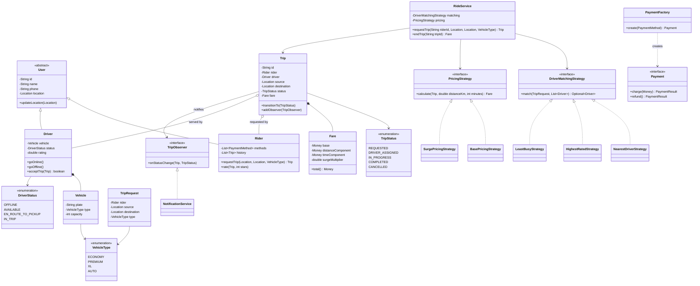
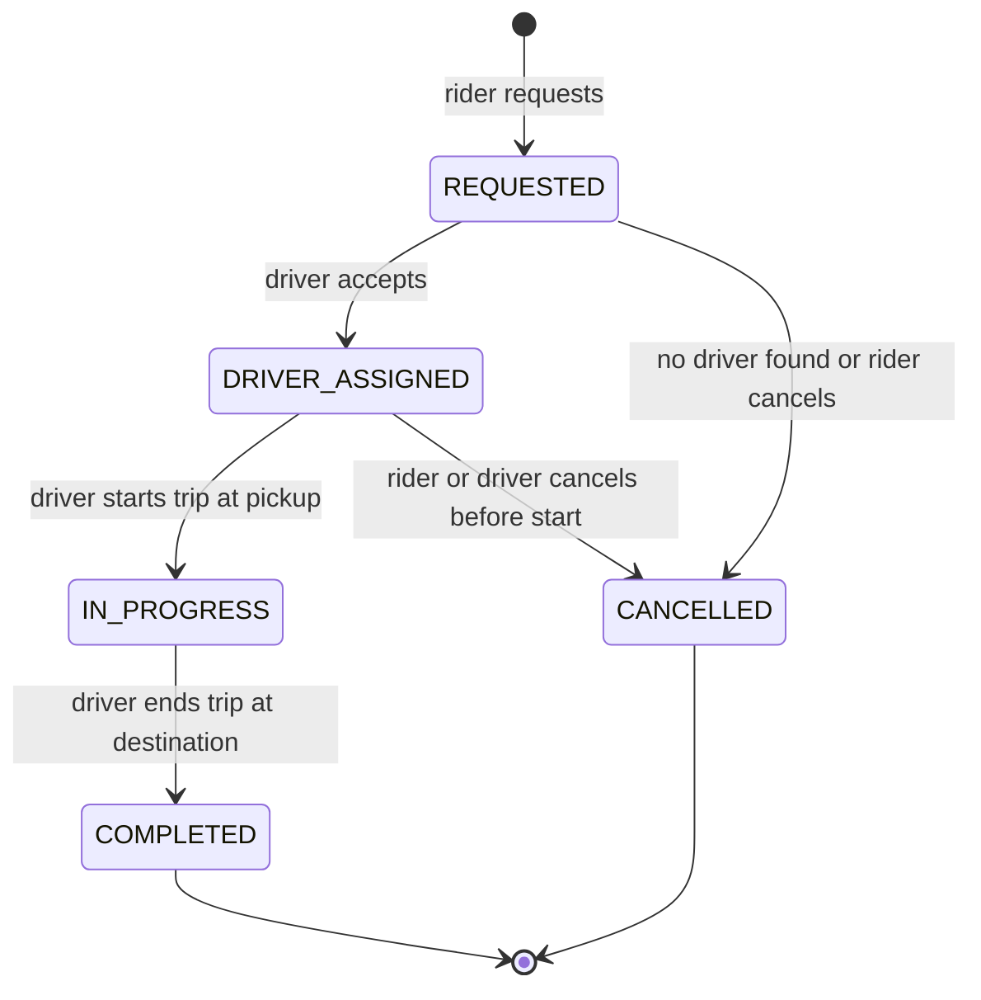

# Design a Ride-Sharing Service (OO)

Ride-sharing (Uber / Ola / Lyft) is the canonical two-sided-marketplace LLD problem: a
rider requests a trip, the system matches the best available driver, the trip runs
through a lifecycle, and at the end a fare is computed, charged, and rated. It packs the
three seams interviewers love — a **pluggable matching rule** (Strategy), an **explicit
lifecycle** for both driver and trip (State), and a **fan-out of status updates** to
rider and driver (Observer) — into one 45–90 minute round. The scope trap is severe:
real-time geo-matching over millions of drivers, surge computed from live demand, and GPS
streaming are all *distributed-systems / HLD* concerns. Name them, draw the seam where
they plug in, and keep this design single-process OO.

## Requirements Clarification

Spend the first five minutes narrowing scope. Strong clarifying questions:

- **Which actors?** Two primary: `Rider` (requests, rates) and `Driver` (accepts, drives,
  rates). Both share identity/contact — model a `User` base with role-specific subclasses.
- **Which flow is core?** The spine: rider requests a trip from A to B → system matches the
  best available nearby driver → driver accepts → drives to pickup → trip starts → trip
  ends → fare computed → payment charged → both parties rate each other. Everything else
  is an extension.
- **How is a driver matched?** Automatically by the system. Ask *which rule* — nearest?
  highest-rated? least-busy? — because "the rule will change" is your cue for Strategy.
  Ask whether a driver can decline (yes — plan a re-offer / fallback path).
- **How is fare computed?** Base fare + per-km + per-minute, times a surge multiplier.
  Ask whether surge is in scope (model the *multiplier as a pluggable component*; where
  the number comes from is HLD).
- **Vehicle types?** Economy / Premium / XL / Auto — each with different pricing and
  seat capacity. This drives a `VehicleType` dimension in matching and pricing.
- **Payments:** multiple methods (card, wallet, cash) behind an interface; no gateway
  internals. Fare charged automatically on trip completion.
- **Out of scope (say it out loud):** distributed geo-index (quadtree/geohash/H3) for
  matching at scale, real-time GPS location streaming, ETA/route prediction, dynamic
  surge computation from demand signals, fraud detection. Note where each plugs in and
  move on.

A crisp scope statement: *"I'll design a single-city, single-process ride-sharing system:
a rider requests a trip; a pluggable strategy matches the nearest available driver of the
requested vehicle type; the driver accepts and drives through an explicit trip lifecycle;
on completion a pluggable pricing strategy computes the fare, payment is charged, and both
parties rate each other. Driver availability and the trip lifecycle are explicit state
machines. Concurrency: two riders must never be matched to the same driver."*

## Use Cases and Actors

Two actors, each with a small, well-bounded set of use cases — keep the diagram honest
about who initiates what:

- **Rider:** register / set location, request a trip (from, to, vehicle type), cancel a
  pending trip, be notified of driver assignment and arrival, pay, rate the driver.
- **Driver:** register a vehicle, go online / offline, receive a trip offer, accept or
  decline, mark arrived / start / end trip, get paid, rate the rider.
- **System (`RideService` facade):** matches drivers, drives the trip state machine,
  computes fare, orchestrates payment, and fans out status updates. It is not a human
  actor but owns the orchestration.

The key insight for the object model: **the rider and driver never talk to each other
directly** — every interaction is mediated by a `Trip` and the `RideService`. That
mediation is what keeps the design from collapsing into two god classes.

## Core Objects via Noun-Verb Extraction

The interview-grade technique is to extract candidate classes from the **nouns** in the
requirements and candidate methods from the **verbs**, then *filter* — not every noun
becomes a class.

Nouns in "a **rider** requests a **trip** from a **location** to a location; the **system**
matches the nearest available **driver** with a **vehicle**; on completion a **fare** is
computed, a **payment** is charged, and a **rating** is given":

| Candidate noun | Verdict | Why |
|---|---|---|
| Rider, Driver | **Classes** (subclasses of `User`) | Distinct actors, shared identity |
| Trip / Ride | **Class** (the aggregate) | The central lifecycle object |
| Location | **Value object** | Immutable (lat, lng) with `distanceTo()` — not an entity |
| Driver | **Class** | Has availability state + a vehicle |
| Vehicle | **Class** | Has a `VehicleType`; capacity, plate |
| VehicleType | **Enum** | Fixed set (ECONOMY, PREMIUM, XL, AUTO) |
| Fare | **Value object** | Result of pricing, not a long-lived entity |
| Payment | **Class/interface** | Method-specific behavior |
| Rating | **Class** | Score + review, attached to a trip |
| TripRequest | **Class** | The rider's ask before a driver exists |
| "System" | Becomes `RideService` (facade) + services | Not one god class |
| "Nearest", "available" | **Verbs/adjectives → methods & state**, not classes | Matching logic + driver state |

Verbs map to methods: *request* → `requestTrip`, *match* → `DriverMatchingStrategy.match`,
*accept* → `driver.acceptTrip`, *compute fare* → `PricingStrategy.calculate`, *charge* →
`payment.charge`, *rate* → `ratingService.rate`.

Filtering discipline to state out loud: **`Location` and `Fare` are value objects, not
entities** (no identity, immutable); **"nearest available driver" is not a class** — it's
the responsibility of a `DriverMatchingStrategy`; and the vague **"System" is decomposed**
into a thin `RideService` facade plus focused services (matching, pricing, payment,
notification) so no single class knows everything.

## Responsibilities and Relationships

CRC-style — each class KNOWS some state, DOES a narrow job, and COLLABORATES with a few
others:

| Class | Knows (state) | Does (behavior) | Collaborators |
|---|---|---|---|
| `RideService` | registries of riders, drivers, trips | orchestrates request→match→trip→fare→pay | strategies, `TripManager` |
| `User` (abstract) | id, name, phone, `Location` | update location | — |
| `Rider` | payment methods, trip history | request/cancel trip, rate | `Trip`, `RideService` |
| `Driver` | `Vehicle`, `DriverStatus`, rating | go online/offline, accept/decline, drive | `Trip`, `Vehicle` |
| `Vehicle` | plate, `VehicleType`, capacity | — (mostly data) | `Driver` |
| `Trip` | rider, driver, from/to, `TripStatus`, `Fare` | guarded state transitions, notify observers | `Rider`, `Driver`, `Fare` |
| `TripRequest` | rider, from, to, requested `VehicleType` | carries the ask into matching | `Rider` |
| `DriverMatchingStrategy` | — | pick best driver from candidates | `Driver`, `Trip` |
| `PricingStrategy` | — | compute `Fare` from trip + distance | `Trip`, `Fare` |
| `Payment` | amount, method, status | charge / refund | `Fare` |
| `TripObserver` | — | react to status changes | `Trip` |
| `Rating` | score, review, target | — | `Trip` |

Relationship decisions an interviewer will probe:

1. **`Driver *-- Vehicle` is composition-ish, `Trip o-- Driver` is aggregation.** A driver
   owns a vehicle for the model's lifetime; a trip merely *references* a driver who exists
   independently and serves many trips over time. Getting composition vs. aggregation
   right here is a classic diagram probe.
2. **`Trip` holds a `Fare` (composition) but references `Rider`/`Driver` (association).**
   The fare is created by and dies with the trip; the participants outlive it.
3. **`Driver` and `Trip` each carry an explicit status enum**, not scattered booleans —
   see the two state machines below.
4. **Multiplicity:** one `Trip` has exactly one `Rider` and (once matched) one `Driver`;
   one `Driver` has one active `Trip` at a time but many over its lifetime; one `Rider`
   has one pending `TripRequest` at a time.

## Class Diagram

Interview-grade: entities, the two state enums, and the three pattern seams (Strategy for
matching and pricing, State for lifecycles, Observer for updates).



Relationship callouts:

- `Driver *-- Vehicle` — **composition**: the vehicle is part of the driver's model.
- `Trip *-- Fare` — **composition**: the fare is created by and dies with the trip.
- `Trip o-- Driver` and `Trip o-- Rider` — **aggregation/association**: participants
  outlive any single trip and are shared across many.
- `PaymentFactory ..> Payment` — **dependency**: the factory creates but does not own.

## Driver and Trip State Machines

Both the driver and the trip have explicit lifecycles. Model each as an enum plus a single
guarded transition — never as scattered booleans (`isAvailable`, `isInTrip`,
`isCancelled`) that drift into impossible combinations like "available and in trip".

**Trip lifecycle:**



**Driver status** moves in lockstep with trips: `OFFLINE → AVAILABLE` (go online) →
`EN_ROUTE_TO_PICKUP` (accepted a trip) → `IN_TRIP` (trip started) → back to `AVAILABLE`
(trip ended) or `OFFLINE`.

Rules to state out loud:

- **Transitions are validated centrally.** A `Map<TripStatus, Set<TripStatus>>` of allowed
  moves is the pragmatic interview answer; upgrade to the full **State pattern** (one class
  per state) only if the interviewer pushes per-state *behavior* (e.g., each state computes
  its own cancellation fee).
- **Cancellation is state-dependent.** Free before `DRIVER_ASSIGNED`; may incur a fee after
  a driver is assigned (they drove toward pickup); **disallowed once `IN_PROGRESS`** — the
  trip is running. This guard lives in the transition validation.
- **The two machines are coupled.** Assigning a trip flips the driver to
  `EN_ROUTE_TO_PICKUP` and *removes them from the candidate pool*; completing or cancelling
  returns them to `AVAILABLE`. Keeping driver status in sync with trip status is what
  prevents double-booking.
- **`COMPLETED` and `CANCELLED` are terminal.** Any transition out throws
  `IllegalStateTransitionException`.

## Driver Matching Strategy

"How do you pick the driver?" is *the* design decision. The rule is volatile — ops tunes
it constantly — so encode it as a **Strategy** (see dp-strategy) instead of an `if-else`
chain inside the service:

```java
public interface DriverMatchingStrategy {
    Optional<Driver> match(TripRequest request, List<Driver> candidates);
}

public class NearestDriverStrategy implements DriverMatchingStrategy {
    public Optional<Driver> match(TripRequest request, List<Driver> candidates) {
        Location pickup = request.getSource();
        return candidates.stream()
            .filter(d -> d.getStatus() == DriverStatus.AVAILABLE)
            .filter(d -> d.getVehicle().getType() == request.getType())
            .min(Comparator.comparingDouble(d -> d.getLocation().distanceTo(pickup)));
    }
}
```

- `NearestDriverStrategy` — minimize pickup distance (fast pickup; may overload drivers
  clustered near demand).
- `HighestRatedStrategy` — prefer top-rated available drivers (rider experience).
- `LeastBusyStrategy` — balance trips across drivers (fairness).
- A `CompositeMatchingStrategy` chains fallbacks ("nearest available premium, else nearest
  economy, else none").

Why Strategy over a conditional? Each rule is independently unit-testable, new rules are
**added** without touching the dispatcher (Open/Closed), and the service depends only on
the interface (DIP). Two operational details worth saying:

- **Return `Optional` — no driver may be available.** The trip then goes `REQUESTED →
  CANCELLED` (or waits in a queue with retry), rather than returning `null`.
- **Matching must be atomic per driver** (see Concurrency): filter-then-assign is a
  check-then-act race when two riders match concurrently.

A naive linear scan over an in-memory driver list is fine here. A geo-index (geohash/H3/
quadtree) serving millions of drivers is the **HLD** version — name it and move on.

## Pricing Strategy

Fare = base + (per-km × distance) + (per-minute × time), all times a surge multiplier.
Because the pricing formula and surge policy change per city and per time of day, model it
as a **Strategy** too, keyed by vehicle type:

```java
public interface PricingStrategy {
    Fare calculate(Trip trip, double distanceKm, int minutes);
}

public class BasePricingStrategy implements PricingStrategy {
    private final Map<VehicleType, Rates> rates;
    public Fare calculate(Trip trip, double distanceKm, int minutes) {
        Rates r = rates.get(trip.getDriver().getVehicle().getType());
        Money base = r.base();
        Money dist = r.perKm().times(distanceKm);
        Money time = r.perMinute().times(minutes);
        return new Fare(base, dist, time, 1.0);   // no surge
    }
}
```

`SurgePricingStrategy` decorates/extends the base with a `surgeMultiplier` (e.g. 1.8×
during peak). The **multiplier value is an input**; computing it from live demand is HLD.
This keeps "add surge" an Open/Closed change: a new strategy, no edits to trip or fare.

## Key Design Decisions

Pattern-by-pattern, each justified by a *requirement* (reference the dp-* topics for
mechanics — do not re-teach them here):

- **Strategy for driver matching.** Requirement: the matching rule changes often and must
  be swappable and testable in isolation.
- **Strategy for pricing (+ surge).** Requirement: fare formula varies by city/vehicle and
  surge must plug in without touching fare computation call sites.
- **State (or a validated transition map) for the trip and driver lifecycles.**
  Requirement: actions are legal only in certain states (can't start a cancelled trip,
  can't cancel one in progress, can only rate after completion).
- **Observer for status updates.** Requirement: on every trip status change, notify the
  rider (driver arriving / trip started) and the driver, and tomorrow an analytics sink.
  `Trip` (subject) fires `onStatusChange`; it knows *that* it has observers, never *who*.
- **Factory for payments (and optionally vehicles/trips).** Requirement: `CardPayment`,
  `WalletPayment`, `CashPayment` behind a `Payment` interface — checkout asks
  `PaymentFactory.create(method)`. Adding a type is one class + one factory case.
- **Facade (`RideService`) as the entry point.** The driver/demo talks to one class; it
  delegates to matching, pricing, payment, and notification internally.
- **Singleton for the matching service is optional, not the answer.** A single
  `RideService` wired with its strategies via constructor injection beats a hard
  `getInstance()` — far easier to test with fakes. Mention Singleton, prefer injection.

## API and Method Signatures

The facade surface — enough to drive every flow in a demo:

```java
public class RideService {
    // registration
    void registerRider(Rider rider);
    void registerDriver(Driver driver, Vehicle vehicle);
    void driverGoOnline(String driverId, Location at);
    void driverGoOffline(String driverId);

    // core flow
    Trip requestTrip(String riderId, Location from, Location to, VehicleType type); // -> REQUESTED, then matched
    boolean acceptTrip(String driverId, String tripId);   // driver accepts an offer
    void startTrip(String tripId);                         // at pickup -> IN_PROGRESS
    Fare endTrip(String tripId);                           // at destination -> COMPLETED, computes fare, charges
    void cancelTrip(String tripId, String byUserId);       // state-dependent fee/refund

    // feedback
    void rateDriver(String riderId, String tripId, int stars, String review);
    void rateRider(String driverId, String tripId, int stars);

    // config
    void setMatchingStrategy(DriverMatchingStrategy s);
    void setPricingStrategy(PricingStrategy s);
}
```

Signature choices worth defending:

- `requestTrip` returns the created `Trip` (caller needs the id to track); it fails fast
  with typed exceptions (`NoDriverAvailableException` → or, better, returns a trip in
  `CANCELLED`/queued state — a design choice to state explicitly).
- `acceptTrip` returns `boolean` — the *loser* of a concurrent race gets `false` and the
  offer is re-routed; it is not an exception.
- `endTrip` returns the `Fare` and is the single point that computes price, charges
  payment, and frees the driver.
- `cancelTrip` takes *who* is cancelling — rider vs. driver cancellations have different
  fee/penalty consequences.

## Code Skeleton

Structure over completeness — the state machine, the observer hook, and the match+assign
choke point:

```java
public enum TripStatus {
    REQUESTED, DRIVER_ASSIGNED, IN_PROGRESS, COMPLETED, CANCELLED;

    private static final Map<TripStatus, Set<TripStatus>> ALLOWED = Map.of(
        REQUESTED,       Set.of(DRIVER_ASSIGNED, CANCELLED),
        DRIVER_ASSIGNED, Set.of(IN_PROGRESS, CANCELLED),
        IN_PROGRESS,     Set.of(COMPLETED),
        COMPLETED,       Set.of(),
        CANCELLED,       Set.of()
    );

    public boolean canTransitionTo(TripStatus next) {
        return ALLOWED.get(this).contains(next);
    }
}

public class Trip {
    private final String id;
    private final Rider rider;
    private final Location source, destination;
    private Driver driver;                    // set on assignment
    private volatile TripStatus status = TripStatus.REQUESTED;
    private Fare fare;
    private final List<TripObserver> observers = new CopyOnWriteArrayList<>();

    public synchronized void transitionTo(TripStatus next) {
        if (!status.canTransitionTo(next)) {
            throw new IllegalStateTransitionException(status, next);
        }
        this.status = next;
        observers.forEach(o -> o.onStatusChange(this, next));   // single fan-out point
    }

    public void addObserver(TripObserver o) { observers.add(o); }
}

public interface TripObserver { void onStatusChange(Trip trip, TripStatus next); }

public class RiderNotifier implements TripObserver {
    public void onStatusChange(Trip trip, TripStatus next) {
        push(trip.getRider(), "Your trip is now " + next);
    }
}

public class RideService {
    private DriverMatchingStrategy matching;   // injected — swappable
    private PricingStrategy pricing;

    public Trip requestTrip(String riderId, Location from, Location to, VehicleType type) {
        Rider rider = riders.get(riderId);
        Trip trip = new Trip(newId(), rider, from, to);
        registerDefaultObservers(trip);                        // rider, driver, analytics
        TripRequest req = new TripRequest(rider, from, to, type);

        Optional<Driver> match = matching.match(req, drivers.availableDrivers());
        match.ifPresentOrElse(
            d -> { if (d.tryAccept(trip)) {                    // atomic claim
                        trip.setDriver(d);
                        trip.transitionTo(TripStatus.DRIVER_ASSIGNED);
                   } },
            () -> trip.transitionTo(TripStatus.CANCELLED));     // no driver
        return trip;
    }

    public Fare endTrip(String tripId) {
        Trip trip = trips.get(tripId);
        Fare fare = pricing.calculate(trip, distanceOf(trip), minutesOf(trip));
        Payment payment = PaymentFactory.create(trip.getRider().defaultMethod());
        payment.charge(fare.total());
        trip.setFare(fare);
        trip.transitionTo(TripStatus.COMPLETED);
        trip.getDriver().freeUp();                              // back to AVAILABLE
        return fare;
    }
}

public class Driver {
    private volatile DriverStatus status = DriverStatus.OFFLINE;

    // atomic claim: only one concurrent trip can win
    public synchronized boolean tryAccept(Trip trip) {
        if (status != DriverStatus.AVAILABLE) return false;
        status = DriverStatus.EN_ROUTE_TO_PICKUP;
        return true;
    }
    public synchronized void freeUp() { status = DriverStatus.AVAILABLE; }
}
```

Narrate while writing: the transition map makes illegal moves impossible by construction;
`transitionTo` is the *only* status mutator, so observers can never be skipped;
`tryAccept` is a `synchronized` compare-and-set on driver status, which is the whole fix
for the double-match race; strategies are constructor-injected so tests pass fakes.

## Concurrency and Edge Cases

Single-process, multi-threaded — raise these before the interviewer does:

- **Double-match race.** Two riders match the same free driver at once: classic
  **check-then-act** (filter for AVAILABLE, then assign). Fix: make claiming atomic on the
  driver — `synchronized boolean tryAccept(Trip)` (or `AtomicReference`/CAS on status) that
  re-checks availability inside the lock and returns `false` to the loser, who then re-runs
  matching against the next candidate. Lock **per driver, not per pool**, so assignments
  don't serialize globally.
- **Cancel-vs-start race.** Rider cancels the instant the driver marks `IN_PROGRESS`.
  Because `transitionTo` is `synchronized` per trip and validates against the *current*
  state, exactly one wins: if `IN_PROGRESS` commits first, the cancel throws
  `IllegalStateTransitionException`; if the cancel commits first, the start fails. The
  state machine *is* the concurrency guard.
- **Driver goes offline mid-offer.** `tryAccept` sees status ≠ `AVAILABLE` and returns
  `false`; matching moves on. Going offline while `IN_TRIP` is disallowed by the driver
  state machine.
- **Payment fails on `endTrip`.** The trip is already `COMPLETED` (service delivered) — mark
  the fare unpaid and enqueue a retry/settlement rather than blocking completion; never
  leave the driver stuck `IN_TRIP`.
- **No driver available.** Expected, not exceptional: `Optional.empty()` → trip goes
  `CANCELLED` or waits in a retry queue — a design choice to state.
- **Rating guards.** Only the trip's own participants, only after `COMPLETED`, only once
  each — the check belongs in the rating service, keyed by trip id.
- **Surge snapshot.** Capture the surge multiplier *at request/quote time* into the trip,
  so the fare doesn't jump between request and completion.

## Extensibility

The follow-ups interviewers actually ask, and why this design absorbs them:

- **Carpool / pool rides (shared trip).** A `Trip` gains multiple `Rider` legs with
  distinct pickup/dropoff points; introduce a `PoolTrip` subtype or a `List<TripLeg>`.
  Matching becomes "driver whose route can absorb this leg" — a new
  `MatchingStrategy`. Pricing splits the fare across riders — a new `PricingStrategy`.
  Both are *additions*, not edits.
- **Scheduled rides.** Add a `scheduledFor` timestamp and a `SCHEDULED` state that
  transitions to `REQUESTED` when due (a scheduler/delay queue fires). Only the transition
  map gains a row; downstream keys off states.
- **Surge pricing.** Already a `PricingStrategy` seam — swap in `SurgePricingStrategy`. The
  demand signal that sets the multiplier is HLD.
- **Driver incentives / gamification.** Register an observer on trip completion that tallies
  trips per driver; incentive rules are strategies over the tally. Zero `Trip` changes.
- **New vehicle type (e.g., BIKE).** Add an enum value + pricing `Rates` entry; matching
  already filters by type. No structural change.
- **Analytics dashboard.** An `AnalyticsObserver implements TripObserver` accumulates
  trip volume, cancellation, and fare metrics off the same status-change events.
- **"Now scale to a whole country."** Distributed geo-index for matching, location streams,
  surge-from-demand — acknowledge as HLD (point to the system-design domain) and note the
  Strategy/Observer seams are exactly where those systems plug in.

## Common Interview Follow-ups

1. **"Why Strategy over an `if (mode == NEAREST) ... else if` block for matching?"** Each
   rule is a testable unit; new rules add classes instead of growing a conditional (OCP);
   the service depends on the interface, so tests inject fakes (DIP).
2. **"Two riders matched the same driver — walk me through the fix."** Check-then-act race;
   atomic claim per driver (`tryAccept` with `synchronized`/CAS on status), loser re-runs
   matching against the next candidate. Lock per driver, not per pool.
3. **"Rider cancels while the driver starts the trip — who wins?"** Whoever's transition
   commits first under the trip's lock; the other gets `IllegalStateTransitionException`.
   Demonstrates why status is a guarded state machine, not a settable field.
4. **"Enum-with-transition-map vs. full State pattern — which and why?"** Transition map for
   lifecycle *validation* alone; State classes once each state carries distinct *behavior*
   (per-state cancellation fees, per-state allowed actions). Start with the map, name the
   upgrade path.
5. **"Where does the fare get computed and payment charged, and how do you avoid
   duplication?"** `endTrip` is the single choke point: compute via `PricingStrategy`,
   charge via `Payment`, transition to `COMPLETED`, free the driver — one path.
6. **"How do you keep driver status in sync with trip status?"** Assignment flips the driver
   to `EN_ROUTE_TO_PICKUP` and removes them from the pool; completion/cancellation frees
   them. The two state machines are coupled by design.
7. **"Add surge pricing without touching fare code."** New `SurgePricingStrategy` behind the
   `PricingStrategy` interface; the multiplier is an input. Where the number comes from is
   HLD.
8. **"Support carpool / pool rides."** Multiple rider legs on a trip; new matching strategy
   (route-fit) + new pricing strategy (fare split). Additions, not edits.
9. **"Add scheduled rides."** New `SCHEDULED` state + one transition-map row + a due-time
   trigger; downstream already keys off states.
10. **"How would this change for millions of drivers and live GPS?"** That's HLD:
    geo-indexes (geohash/H3/quadtree), location streams, push infra, demand-based surge —
    name them, point to system-design, keep this round single-process.

## References

- *Head First Design Patterns* (Freeman & Robson) — Strategy, Observer, State, Factory chapters
- *Design Patterns: Elements of Reusable Object-Oriented Software* (GoF) — State (305), Strategy (315), Observer (293), Abstract Factory (87)
- Grokking the Object-Oriented Design Interview — "Design Uber / a Ride-Sharing Service"
- Refactoring.Guru — State, Strategy, Observer pattern write-ups (refactoring.guru/design-patterns)
- Uber Engineering blog — dispatch / matching overviews (HLD context for the Strategy seam)
- Related topics in this library: dp-strategy, dp-observer, dp-state, dp-factory-method (pattern mechanics), concurrency-in-lld (the double-match race and locking), lld-interview-method (the overall approach), system-design domain (scaling follow-ups)
