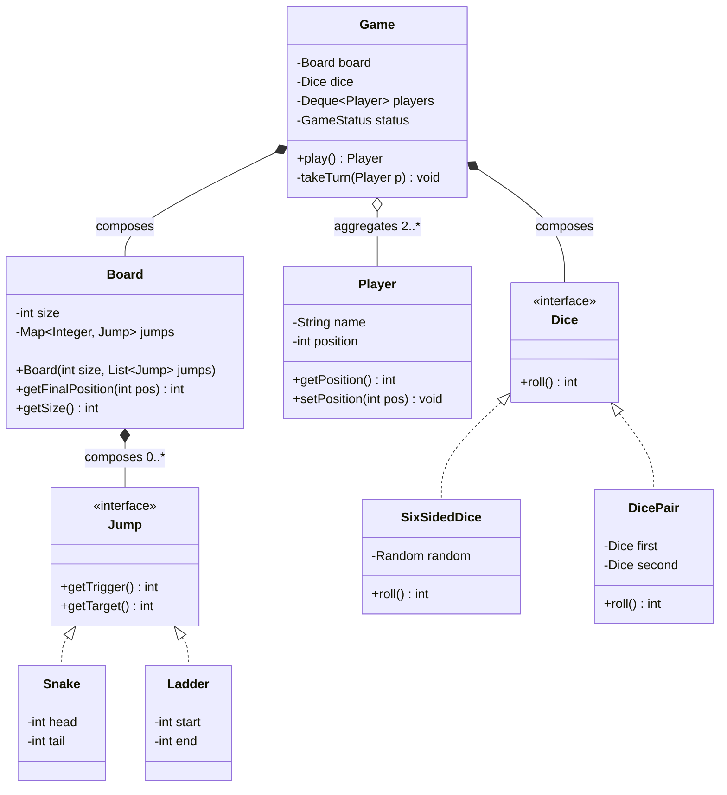

# Design a Snake & Ladder Game

Snake & Ladder is one of the *simplest* problems in the LLD round — and that is exactly the
trap. Interviewers use it to test whether you can produce a clean, correctly-scoped OO design
**without over-engineering**. The signal they want: crisp entity identification, a clean game
loop, validation of the board configuration, and one or two well-justified patterns — not an
`AbstractBoardEntityVisitorFactory`. Expect 30–45 minutes, often with a request to actually
run a simulated game at the end (this is a common machine-coding problem precisely because a
working game fits in the time box).

## Requirements Clarification

Spend the first ~5 minutes locking scope. Good questions to ask, and the typical answers you
should drive toward:

| Question | Typical scoped answer |
|---|---|
| Board size? | 10×10 = 100 cells, but design for a **configurable size N** (cheap to support). |
| How many players? | 2+ players, turn-based in a fixed order (a queue). |
| Dice? | One standard 6-sided die; design so "two dice" or "crooked dice" is a config change. |
| Win condition? | First player to reach cell N (100). Ask: **exact landing or reach/pass?** Both are valid — classic rules require exact landing (overshoot bounces or forfeits the move); many interview versions accept "reach or pass". State your assumption out loud. |
| Extra turn on rolling a 6? | Usually out of scope for v1 — note it as an extension. |
| Can two players share a cell? | Yes in the classic game (no "kill" rule). Ask — some variants send the occupant back to start. |
| Snakes/ladders chaining? | If a ladder ends on a snake's head, do you slide again? Classic answer: **yes, resolve transitively** — but a v1 that resolves one jump is acceptable if stated. |
| UI / persistence / networking? | Out of scope. Console simulation only. This is an LLD round, not HLD. |

Things to explicitly scope OUT (say it, don't just skip it): GUI, online multiplayer,
matchmaking, persistence, AI players. If the interviewer wants any of these, they'll say so —
and online multiplayer is largely an HLD conversation (see the system-design domain).

Also surface the **validation rules** now, because they shape your constructors:

- A snake's head must be **above** its tail (`head > tail`); a ladder's end must be **above**
  its start (`end > start`). Otherwise they'd move you the wrong way (or be a no-op loop).
- No snake head or ladder start on the **final cell** (winning cell must end the game) and
  none on cell 1 (players start off-board or at 1).
- No two entities share the same trigger cell (a cell can't have both a snake head and a
  ladder start), and a cell shouldn't be both an entity's trigger and create an infinite loop
  when jumps are resolved transitively.

## Core Objects and Entities

Underline the nouns in the problem statement — they map almost one-to-one to classes:

- **`Game`** — the orchestrator. Owns the game loop: whose turn it is, rolling, moving,
  detecting the win. Holds a `Board`, a `Dice`, and the player turn order. It should contain
  **no board-layout knowledge** (which cells have snakes) — that belongs to `Board`.
- **`Board`** — the static playing surface plus its jump rules. Given a landing position,
  answers "where do you *actually* end up?" (`getFinalPosition(pos)`). Validates its own
  configuration at construction.
- **`Snake` / `Ladder`** — value objects. A snake is `(head, tail)` with `head > tail`; a
  ladder is `(start, end)` with `end > start`. Many strong candidates unify them behind a
  single abstraction — see [Key Design Decisions](#key-design-decisions).
- **`Player`** — identity (name/id) plus current position. Position can live on the player or
  in a `Map<Player, Integer>` owned by the game — either is defensible; keeping it on the
  player is simpler, keeping it in the game makes `Player` immutable and the game state
  centralized. Pick one and say why.
- **`Dice`** — produces a roll. Make it an **interface** so tests can inject a deterministic
  dice and the interviewer's "now use two dice" follow-up is a one-line change (Strategy).
- **`Cell`?** — here's a scoping insight worth saying out loud: you usually **don't need a
  Cell class at all**. The board is logically a line of 1..N positions; a
  `Map<Integer, Jump>` (trigger position → jump) represents the layout with O(1) lookup and
  no 100-object array. A `Cell` class earns its place only if cells carry behavior (special
  cells like "skip turn") — which is exactly the v2 extension, not v1.

Relationships: `Game` **composes** a `Board` and a `Dice` and **aggregates** `Player`s
(players exist independently of a game; the board is meaningless without one — defensible
either way, but composition for the board is the common call). `Board` composes its
snakes/ladders.

## Class Diagram



Interview-grade notes on this diagram:

- `Snake` and `Ladder` both implement `Jump` — they are behaviorally identical ("if you land
  on my trigger, teleport to my target"); only the validation invariant differs
  (`target < trigger` vs `target > trigger`). Unifying them removes duplicate lookup logic
  from `Board`.
- `Dice` is an interface with a trivial default implementation. `DicePair` composes two dice
  to answer the "two dice" follow-up — composition over a `TwoDice extends SixSidedDice`
  inheritance hack.
- `Deque<Player>` (or a circular queue) models turn order naturally: poll from the front,
  take the turn, offer to the back. No `currentPlayerIndex` modular arithmetic to get wrong.

## Key Design Decisions

**1. `Map<Integer, Jump>` over a 100-element `Cell[]` array.**
Snakes and ladders are sparse (typically 8–10 each on a 100-cell board). A map from trigger
position to jump gives O(1) lookup, trivially supports any board size, and avoids 90+ empty
`Cell` objects. Mention the array alternative and why you rejected it — showing the rejected
option is worth as much as the chosen one.

**2. Unify Snake and Ladder behind a `Jump` abstraction.**
`Board.getFinalPosition` shouldn't care *which* kind of jump it hit:

```java
public int getFinalPosition(int pos) {
    // resolve transitively: a ladder may drop you on a snake's head
    while (jumps.containsKey(pos)) {
        pos = jumps.get(pos).getTarget();
    }
    return pos;
}
```

The subclass constructors enforce the differing invariants (fail fast with
`IllegalArgumentException`). This is basic polymorphism doing honest work — not a pattern for
pattern's sake. (Validation of the *whole* configuration — overlaps, cycles, final-cell rule,
and **target bounds** — lives in `Board`, because only the board sees all jumps together. Note
the skeleton's constructor range-checks each *trigger* but not each *target*; a complete `Board`
should also reject `target < 1` or `target > size` in the same loop, since only `Board` knows
`size`.)

**Trace the transitive resolution.** The subtlety is that `getFinalPosition` loops, so one
landing can fire a chain. Take jumps `{5→14, 14→30}` and land on **5**:

| step | `pos` before | `containsKey(pos)`? | `seen` after add | `pos` after |
|---|---|---|---|---|
| 1 | 5 | yes | `{5}` | 14 |
| 2 | 14 | yes | `{5, 14}` | 30 |
| 3 | 30 | no → exit | — | **return 30** |

So a token dropped on 5 climbs all the way to 30 in one call — the exact "ladder drops you on
another ladder's foot" case.

Now the pathological config `{5→14, 14→5}` (a cycle). `getFinalPosition(5)`:

- `pos=5`: `seen.add(5)` → `true`, `seen={5}`, `pos=14`.
- `pos=14`: `seen.add(14)` → `true`, `seen={5,14}`, `pos=5`.
- `pos=5`: `seen.add(5)` → **`false`** (already present) → throw `IllegalStateException`.

Because the `Board` constructor calls `getFinalPosition(trigger)` for every trigger, this blows
up at *construction*, not mid-game — exactly the fail-fast behavior you want.

**3. `Dice` as a Strategy.**
Randomness is (a) untestable if hard-coded and (b) the most likely axis of change
("two dice", "loaded dice for demo", "crooked dice that only rolls even"). An interface with
injected implementation solves both. This is the *Strategy* pattern (see `dp-strategy` in the
design-patterns domain) — but in the interview, the testability argument lands harder than
the pattern name.

**4. Factory / Builder for board setup, not for everything.**
Constructing a valid board (size + snakes + ladders + validation) is the fiddly part. A
`BoardFactory.standardBoard()` for the classic layout, or a `GameBuilder` that accumulates
players/snakes/ladders and validates at `build()`, keeps `main()` clean and centralizes
validation. That's the *only* creation logic complex enough to justify a creational pattern
here.

**5. What NOT to use — and say so.**
No Observer (there's nothing to notify in a console v1 — mention it as the seam for a UI/event
log later). No State machine (the game has essentially two states, running and finished — a
`GameStatus` enum or even a boolean suffices; contrast with Elevator or Vending Machine where
State genuinely earns its complexity). No Singleton for `Game` (kills testability and
multi-game support). Explicitly declining patterns is a **senior signal** on a simple problem.

**6. The game loop pattern.**
The heart of the design — keep it readable enough to narrate:

```text
while game not won:
    player = next player in turn order
    roll = dice.roll()
    tentative = player.position + roll
    if tentative > board.size: skip move (or bounce back, per agreed rule)
    else: player.position = board.getFinalPosition(tentative)
    if player.position == board.size: winner = player, game over
    else: rotate player to back of queue
```

Every rule the interviewer adds later (extra turn on 6, exact-landing bounce, kill rule) is a
localized edit inside this loop or inside `Board` — point that out.

## API and Method Signatures

Keep the public surface small; the game is the façade.

```java
public interface Dice {
    int roll();
}

public interface Jump {
    int getTrigger();   // where you land to activate it (snake head / ladder start)
    int getTarget();    // where you end up (snake tail / ladder end)
}

public final class Board {
    public Board(int size, List<Jump> jumps);   // validates config, throws IllegalArgumentException
    public int getFinalPosition(int position);  // resolves snake/ladder chains
    public int getSize();
}

public final class Game {
    public Game(Board board, Dice dice, List<Player> players); // >= 2 players
    public Player play();                        // runs to completion, returns winner
    // finer-grained alternative for step-wise / UI-driven play:
    public TurnResult playTurn();                // one turn, returns what happened
    public GameStatus getStatus();
}

public record TurnResult(Player player, int rolled, int from, int to, boolean won) {}
```

Design notes worth voicing:

- `play()` returning the winner is fine for a console simulation, but offering `playTurn()`
  shows you know the difference between a **self-driving loop** and an **externally driven**
  one (a UI or server would call `playTurn` per user action). Implement `play()` as a loop
  over `playTurn()` — one source of truth.
- `TurnResult` is a small immutable value object so callers (logger, UI) can render the turn
  without `Game` doing I/O. Keep `System.out.println` out of `Game` — printing is the
  caller's job (single responsibility, and it makes the class testable).
- Constructor-validate everything: `Board` rejects bad jump configs; `Game` rejects <2
  players. Fail fast beats a corrupt game mid-loop.

## Code Skeleton

Compact Java skeleton — enough structure to finish live, minor bodies elided:

```java
public class Snake implements Jump {
    private final int head, tail;
    public Snake(int head, int tail) {
        if (head <= tail) throw new IllegalArgumentException("snake head must be above tail");
        this.head = head; this.tail = tail;
    }
    public int getTrigger() { return head; }
    public int getTarget()  { return tail; }
}

public class Ladder implements Jump {
    private final int start, end;
    public Ladder(int start, int end) {
        if (end <= start) throw new IllegalArgumentException("ladder end must be above start");
        this.start = start; this.end = end;
    }
    public int getTrigger() { return start; }
    public int getTarget()  { return end; }
}

public final class Board {
    private final int size;
    private final Map<Integer, Jump> jumps = new HashMap<>();

    public Board(int size, List<Jump> jumpList) {
        this.size = size;
        for (Jump j : jumpList) {
            if (j.getTrigger() >= size || j.getTrigger() <= 1)
                throw new IllegalArgumentException("jump trigger out of range: " + j.getTrigger());
            if (jumps.putIfAbsent(j.getTrigger(), j) != null)
                throw new IllegalArgumentException("two jumps share trigger " + j.getTrigger());
        }
        // detect cycles introduced by transitive resolution (e.g., ladder->snake->same ladder)
        for (int trigger : jumps.keySet()) getFinalPosition(trigger); // throws on cycle
    }

    public int getFinalPosition(int pos) {
        Set<Integer> seen = new HashSet<>();
        while (jumps.containsKey(pos)) {
            if (!seen.add(pos)) throw new IllegalStateException("jump cycle at " + pos);
            pos = jumps.get(pos).getTarget();
        }
        return pos;
    }

    public int getSize() { return size; }
}

public class SixSidedDice implements Dice {
    private final Random random = new Random();
    public int roll() { return random.nextInt(6) + 1; }
}

public final class Game {
    private final Board board;
    private final Dice dice;
    private final Deque<Player> players;
    private GameStatus status = GameStatus.IN_PROGRESS;

    public Game(Board board, Dice dice, List<Player> players) {
        if (players.size() < 2) throw new IllegalArgumentException("need >= 2 players");
        this.board = board; this.dice = dice;
        this.players = new ArrayDeque<>(players);
    }

    public Player play() {
        TurnResult result;
        do { result = playTurn(); } while (!result.won());
        return result.player();
    }

    public TurnResult playTurn() {
        Player player = players.pollFirst();
        int rolled = dice.roll();
        int from = player.getPosition();
        int tentative = from + rolled;
        int to = from;
        if (tentative <= board.getSize()) {           // overshoot => stay (agreed rule)
            to = board.getFinalPosition(tentative);
            player.setPosition(to);
        }
        boolean won = (to == board.getSize());
        if (won) status = GameStatus.FINISHED;
        else players.offerLast(player);               // rotate turn order
        return new TurnResult(player, rolled, from, to, won);
    }
}
```

A `BoardFactory` (or `GameBuilder`) supplies the classic layout so `main()` is three lines:
build board, build game, `game.play()`.

## Worked example: one game traced

Interviewers almost always finish with "run me a game." Here is the exact trace to narrate.
**Setup:** board size **100**, one ladder **3→22**, one snake **17→4**, players **P1** and
**P2** both starting off-board at position **0**, queue `[P1, P2]`. The dice is a scripted test
double so the numbers are reproducible. Each turn: `tentative = from + roll`; if
`tentative > 100` the player stays (agreed overshoot rule), else `to = getFinalPosition(tentative)`.

| turn | player | from | roll | tentative | `getFinalPosition` | to | queue after |
|---|---|---|---|---|---|---|---|
| 1 | P1 | 0 | 3 | 3 | 3 is ladder → 22 | **22** | `[P2, P1]` |
| 2 | P2 | 0 | 5 | 5 | 5 plain → 5 | 5 | `[P1, P2]` |
| 3 | P1 | 22 | 6 | 28 | 28 plain → 28 | 28 | `[P2, P1]` |
| 4 | P2 | 5 | 6 | 11 | 11 plain → 11 | 11 | `[P1, P2]` |
| 5 | P1 | 28 | 4 | 32 | 32 plain → 32 | 32 | `[P2, P1]` |
| 6 | P2 | 11 | 6 | 17 | 17 is snake → 4 | **4** | `[P1, P2]` |

Turn 1 shows the **ladder** (`getFinalPosition(3)` loops once: 3→22, then 22 is not a trigger,
returns 22). Turn 6 shows the **snake** (`getFinalPosition(17)`: 17→4, 4 not a trigger, returns
4) — P2's roll of 6 was a bad-luck landing that cost 13 cells.

Fast-forward many turns; P1 now sits on **98**, P2 on **95**, queue `[P1, P2]`:

| turn | player | from | roll | tentative | result | to | note |
|---|---|---|---|---|---|---|---|
| N | P1 | 98 | 5 | 103 | 103 > 100 → **overshoot** | 98 | stays put; `won?` 98≠100 → rotate `[P2, P1]` |
| N+1 | P2 | 95 | 4 | 99 | 99 plain → 99 | 99 | rotate `[P1, P2]` |
| N+2 | P1 | 98 | 2 | 100 | `getFinalPosition(100)` → 100 | **100** | `won?` 100==100 → **P1 wins**, status FINISHED |

Turn N is the **overshoot near the end**: 98+5=103 exceeds 100, so `to` stays at `from` (98) and
P1 forfeits the move — no bounce, per the rule we agreed. Turn N+2 wins: landing exactly on 100
is legal because validation banned any jump *triggering* on the final cell, so
`getFinalPosition(100)` returns 100 unchanged and `won = (to == size)` fires.

## Extensibility

The follow-ups, and why this design absorbs them cheaply:

- **Configurable board size** — already done: `Board(size, jumps)`. Never hard-code 100.
- **Two dice / crooked dice** — new `Dice` implementation (`DicePair`, `EvenOnlyDice`),
  injected into `Game`. Zero changes to `Game` or `Board` — Open/Closed via Strategy.
- **Special cells (skip-next-turn, extra roll, teleport-random)** — *now* the cell/entity
  abstraction earns its keep. Generalize `Jump` into a `CellEffect` interface whose
  `apply(GameContext)` can move a player, mark them skip-next, or grant a re-roll. Snakes and
  ladders become two implementations among many. This is the honest answer to "why didn't you
  build this up front?": you name the seam (`Map<Integer, Jump>` becomes
  `Map<Integer, CellEffect>`) and extend it when the requirement arrives — evolutionary
  design over speculative generality (YAGNI).
- **Extra turn on rolling a 6** — a turn-policy decision inside the loop: instead of
  hard-coding, extract a `TurnPolicy` (given the roll/result, does the same player go again?)
  only if the interviewer piles on more turn rules; a single `if (rolled != 6)` guard before
  the rotate is fine for one rule.
- **Exact-landing / bounce-back win rule** — the overshoot branch in `playTurn` becomes a
  `WinRule`/`MovementRule` strategy if variants multiply; a two-way `if` if not. Same
  judgment call each time: **rule count decides whether a strategy interface pays for itself**.
- **Human vs bot players** — `PlayerStrategy` only matters once players make *choices*
  (classic snake-ladder has none — every move is forced by the dice). Good observation to
  volunteer: a game with no decisions needs no player-AI abstraction.
- **Event log / UI / replay** — `TurnResult` is already an event object; publish it to an
  `Observer`/listener list from `playTurn`. Replay = persist the seed or the `TurnResult`
  stream.
- **Online multiplayer** — session management, matchmaking, realtime sync are HLD concerns
  (WebSockets, server-authoritative state — see the system-design domain). The LLD answer:
  the `playTurn()` externally-driven API and the serializable `TurnResult` stream are exactly
  the seam a game server would drive.

## Concurrency and Edge Cases

Concurrency (usually a brief exchange for this problem):

- A single game is **inherently sequential** — turns are ordered, so there is no intra-game
  parallelism to exploit. Say this plainly; inventing locks for a turn-based game is
  over-engineering.
- If a server hosts **many concurrent games**, the right unit of isolation is one `Game`
  instance per match with no shared mutable state between games — then games need no locks at
  all. Shared mutable state to avoid: static fields, singleton `Game`, a shared `Random`
  (contended; use per-game `Random`, `ThreadLocalRandom`, or an injected seeded RNG for
  reproducibility).
- If external callers (e.g., two socket handlers) may invoke `playTurn()` on the *same* game
  concurrently, guard it — `synchronized playTurn()` or confining each game to a
  single-threaded executor/actor. Also validate *whose* turn it is if moves carry a player id.
- **Memory visibility**, if pushed: `Player.position` is a plain mutable `int` with no
  `volatile`/synchronization, so the single-thread-per-game claim only holds if confinement is
  *real*. The moment another thread (a renderer, a telemetry/logger thread) reads `position`
  directly, it needs a happens-before edge or it may see a stale value. The clean fix is already
  in the design: hand callers immutable `TurnResult` snapshots instead of exposing live mutable
  `Player` state across threads.

Edge cases to enumerate (interviewers keep score on these):

- **Overshoot near the end** (at 98, roll 5): agreed rule — stay put, or bounce back
  (98+5 → 100 then 3 back → 97). Implement one, name the other.
- **Landing exactly on the last cell via a ladder** — winner; via a snake head on 100 —
  impossible because validation banned jumps triggering on the final cell.
- **Chained jumps** — ladder lands on snake head: resolve transitively with cycle detection
  (the `seen` set), or validation rejects configs where a jump's target is another trigger.
- **Zero snakes/ladders** — legal board; game degenerates to a race. Code should not assume
  non-empty jump map.
- **One player** — reject at construction (< 2 players), or allow as "practice mode" if the
  interviewer wants it; default to rejecting.
- **First move rules** — some variants require rolling a 6 to leave the start. Out of scope
  unless asked; it's one guard in `playTurn`.
- **Dice bounds** — trust the `Dice` contract (1..6) but a defensive assertion is cheap; a
  `LoadedDice` test double returning 0 or 7 should fail loudly, not corrupt positions.

## Common Interview Follow-ups

1. **"Add a cell that makes you skip your next turn."** Generalize `Jump` →
   `CellEffect.apply(GameContext)`; `Game` checks a `skipNext` flag (or a per-player status)
   at the top of the turn. Shows you can grow the design without rewriting it.
2. **"Now use two dice."** `DicePair implements Dice` composing two dice; inject it. One new
   class, zero modified ones — the Open/Closed demo the interviewer is fishing for.
3. **"Make the win rule exact-landing with bounce-back."** Localize to the overshoot branch;
   extract a `MovementRule` strategy if more variants appear.
4. **"How would you unit-test the game loop?"** Inject a scripted `Dice` (returns a fixed
   sequence) and assert positions/winner turn by turn — the payoff of the `Dice` interface.
5. **"Support N simultaneous games on a server."** One `Game` per match, no shared statics,
   per-game RNG; per-game lock or single-threaded actor if handlers can race on `playTurn()`.
6. **"Persist and resume a game."** Game state = board config + player positions + turn
   order + RNG seed/state. Snapshot that record; rebuild `Game` from it. (Memento in pattern
   terms — naming it is optional.)
7. **"Make it playable over the network."** Point at the `playTurn()` seam and `TurnResult`
   events, then explicitly hand the rest (sessions, sync, matchmaking) to HLD.
8. **"Why didn't you create a Cell class?"** Sparse map beats 100 objects; Cell earns
   existence only when cells carry behavior — and here's exactly how I'd introduce it (v2
   `CellEffect`). Demonstrates YAGNI with a plan, not YAGNI as an excuse.

## References

- Gamma, Helm, Johnson, Vlissides — *Design Patterns* (Strategy, Factory Method, Observer) —
  referenced here by name; taught in the `design-patterns` (dp-*) topics.
- Robert C. Martin — *Clean Code* / *Agile Software Development* (SRP, OCP applied to small
  designs).
- Kent Beck — *Test-Driven Development: By Example* (injecting deterministic collaborators
  like the scripted dice).
- Martin Fowler — [Yagni](https://martinfowler.com/bliki/Yagni.html) — the case against
  speculative generality, the core lesson of this problem.
- Grokking the Object-Oriented Design Interview — Snake & Ladder / board-game problem
  walkthroughs (structure comparison).
- Game Programming Patterns (Robert Nystrom) — *Game Loop* and *Update Method* chapters for
  the loop pattern in richer games.
