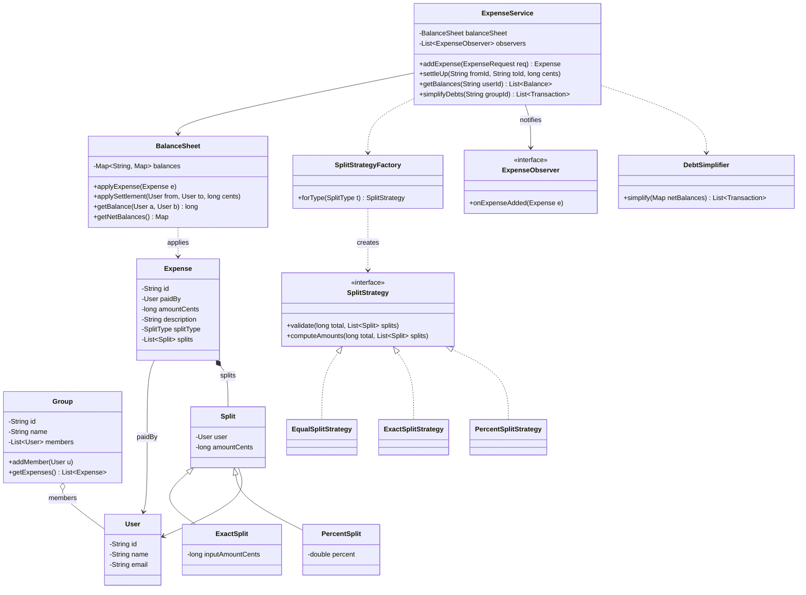

# Design Splitwise / Expense Sharing

Splitwise is the canonical **Strategy-pattern + data-modeling** problem in LLD interviews,
extremely popular at Indian product companies (Flipkart, Swiggy, CRED, Razorpay) and
increasingly everywhere. It tests three things at once: can you model a small domain cleanly
(users, groups, expenses, splits), can you pick the right pattern for varying behavior
(equal / exact / percentage splits scream **Strategy**), and can you reason about a slightly
algorithmic core (the balance sheet and the debt-simplification / min-cash-flow problem).

Budget for a 45–60 min session: ~5 min requirements, ~10 min entities + class diagram,
~15 min split model and balance sheet, ~10 min code skeleton, ~10 min simplify-debts and
follow-ups.

## Requirements Clarification

Good clarifying questions for the first five minutes:

- **Split types**: Equal, exact amounts, percentages? Shares (e.g., 2:1:1)? (Baseline: equal,
  exact, percent — but design so shares can be added without touching existing code. This is
  the extensibility hook the interviewer is fishing for.)
- **Groups**: Are expenses always inside a group, or can two users split ad hoc? (Support
  both: a group is a convenience scope; balances are ultimately between user pairs.)
- **Who can pay**: Single payer per expense, or multiple payers ("A paid 200, B paid 100")?
  (Baseline: single payer; call out multi-payer as an extension.)
- **Balance queries**: "Show my total balance", "show what I owe each person", "show group
  balances"? (All three — this drives the balance-sheet data structure.)
- **Settle up**: Can a user record a repayment that reduces balances? (Yes — it is just a
  balance mutation, not an expense.)
- **Simplify debts**: Should the system minimize the number of settlement transactions?
  (Yes — the classic algorithmic follow-up; know the greedy min-cash-flow approach.)
- **Currency**: Single currency? (Baseline yes; multi-currency is an extension. Either way,
  **money is integer paise/cents or `BigDecimal` — never `double`**.)
- **Persistence / scale**: In-memory single machine is fine for this round; sharding the
  balance sheet across services is an HLD question — say so and move on (see the
  system-design domain).

Explicitly **scope out**: authentication, payment-gateway integration, receipt OCR,
notifications infrastructure (model the hook, not the delivery), and distributed storage.

> [!INTERVIEW]
> State the arithmetic invariant out loud in minute one: *for every expense, the sum of all
> splits must equal the total amount, in integer cents*. Half the edge cases in this problem
> (percent sums, rounding remainders, validation) fall out of that single sentence, and
> interviewers score you on noticing it early.

## Core Objects and Entities

Extract the nouns and assign single responsibilities:

| Class | Responsibility |
|---|---|
| `User` | Identity + profile (id, name, email). No balance logic — balances live in the ledger, not on the user |
| `Group` | A named set of members scoping expenses (trip, flat). Holds member list and expense ids |
| `Expense` | One spend event: who paid, total amount, description, the resulting list of `Split`s, and its `SplitType` |
| `Split` | One participant's share of one expense: `(user, amountCents)`. Subtypes carry input data: `ExactSplit` has the amount, `PercentSplit` has the percent |
| `SplitStrategy` (interface) | Computes and validates the per-user amounts for one split type — `EqualSplitStrategy`, `ExactSplitStrategy`, `PercentSplitStrategy` (Strategy pattern) |
| `SplitStrategyFactory` | Maps a `SplitType` enum to its strategy instance (simple factory) |
| `BalanceSheet` | The pairwise ledger: net amount owed between every pair of users; applies expenses and settlements |
| `ExpenseService` | Facade/orchestrator: validate via strategy, create `Expense`, update `BalanceSheet`, notify observers |
| `ExpenseObserver` (interface) | Notification hook — users/loggers subscribe to expense-added events (Observer pattern) |
| `DebtSimplifier` | Stateless algorithm object: given net balances, produce a minimal-ish list of settlement transactions |

Two modeling decisions to narrate:

- **Split-type variation lives in a Strategy, not an `Expense` inheritance tree.** Many
  tutorial solutions subclass `Expense` (`EqualExpense`, `ExactExpense`, `PercentExpense`).
  That works, but the *only* thing varying is how splits are computed/validated — behavior,
  not identity. Composition (an `Expense` **has a** `SplitType`, the service picks a
  `SplitStrategy`) means adding "split by shares" is a new strategy class + enum value, with
  `Expense` untouched. If you do subclass, be ready to defend it; if you use Strategy, say
  "composition over inheritance" explicitly.
- **Balances are pairwise and netted.** `balanceSheet[A][B] = +150` means B owes A 150. Keep
  the mirror entry consistent (`balanceSheet[B][A] = -150`) or store only one direction with
  a canonical ordering — pick one and state the invariant.

## Class Diagram



Relationship notes worth saying out loud:

- `Expense` **composes** `Split`s (filled diamond): splits have no meaning outside their
  expense and die with it.
- `Group` **aggregates** `User`s (open diamond): users exist independently of any group.
- `ExpenseService` **depends on** (dashed arrow) the factory and simplifier — it uses them
  transiently, it doesn't own their lifecycle as state.

## Key Design Decisions

**Strategy for split computation.** Equal, exact, percent (and future shares/adjustment
splits) are interchangeable algorithms behind one interface:
`validate(total, splits)` + `computeAmounts(total, splits)`. The alternative — a `switch` on
split type inside `ExpenseService` — violates the Open/Closed Principle: every new split
type reopens and re-tests the service. With Strategy, a new type is a new class + a one-line
factory registration. (See the dp-strategy topic for the pattern itself.)

**Simple Factory for strategy selection.** `SplitStrategyFactory.forType(SplitType)`
centralizes the enum→strategy mapping so client code never news up concrete strategies.
Strategies are stateless, so the factory returns shared singletons — no per-call allocation.
(See dp-factory.)

**Observer for notifications.** "Notify group members when an expense is added" should not
put email/push logic inside `ExpenseService`. The service exposes
`registerObserver(ExpenseObserver)` and fires `onExpenseAdded(expense)` after commit.
New channels (SMS, in-app feed, audit log) are new observers — zero service changes.
(See dp-observer.)

**BalanceSheet as its own class, not a map inside the service.** The nested
`Map<String, Map<String, Long>>` plus its invariants (mirror-entry symmetry, netting on
update, zero-cleanup) is real behavior. Burying it in `ExpenseService` gives the service two
reasons to change (orchestration rules *and* ledger arithmetic) — an SRP violation. As a
class, the ledger is unit-testable in isolation.

**Money is `long` cents (or `BigDecimal`), never `double`.** `100.0 / 3` in binary floating
point cannot represent ₹33.33⅓; sums drift and the splits-equal-total invariant silently
breaks. Integer cents make the invariant checkable with `==`.

> [!KEY-TAKEAWAY]
> The one-line pitch for this design: *Strategy computes the splits, the BalanceSheet owns
> the pairwise ledger and its invariants, the ExpenseService only orchestrates, and Observer
> keeps notifications out of the core.* Every class has exactly one reason to change.

## Split Types and Validation

Each strategy has two jobs — validate the input, then produce final per-user amounts:

| Strategy | Input per participant | Validation | Computation |
|---|---|---|---|
| `EqualSplitStrategy` | none (just the user) | participants non-empty | `total / n`, distribute the remainder cents |
| `ExactSplitStrategy` | an exact amount | **sum of amounts == total** | pass-through |
| `PercentSplitStrategy` | a percentage | **sum of percents == 100** | `total * pct / 100`, fix rounding drift |

**The rounding problem** — the detail that separates good candidates. ₹100.00 split equally
three ways is 3333 cents each, leaving 1 cent unassigned. Two accepted fixes:

1. **Remainder-to-first-k**: give `total % n` extra cents to the first `total % n`
   participants (deterministic ordering matters — sort by user id so replays agree).
2. **Last-participant-absorbs**: everyone gets `floor`, the last participant gets
   `total - sum(others)`.

Either is fine; what's not fine is ignoring it, or "fixing" it with doubles. Percent splits
have the same issue (33.33% of ₹100 three times = ₹99.99) — compute `n-1` shares and derive
the last, or re-apply remainder distribution.

Validation belongs **in the strategy**, not in `ExpenseService`: the rule "percents sum to
100" is knowledge about percentage splitting, and the service shouldn't know it exists.
Failing validation throws (or returns) a domain error like `InvalidSplitException` — never
silently normalize the user's numbers.

## Balance Sheet Model

The core data structure: `Map<UserId, Map<UserId, Long>> balances`, where
`balances[A][B] = +v` means **B owes A** `v` cents (creditor-first convention — pick one
and stick to it).

Applying an expense "A paid 300 for A, B, C split equally":

- Splits: A=100, B=100, C=100.
- A's own share is A paying A — **skip it** (no self-edge).
- B owes A 100 → `balances[A][B] += 100`, mirror `balances[B][A] -= 100`.
- C owes A 100 → `balances[A][C] += 100`, mirror `balances[C][A] -= 100`.

**Netting** happens for free with `+=`: if B previously was owed 40 by A, B's new position is
`-100 + 40 = -60` — one number per pair, not a list of IOUs. Queries:

- "What does B owe A?" → `balances[A][B]` (O(1)).
- "My total balance" → sum of my row (O(friends)).
- "Group balances" → filter pairs to group members.

Settle-up is the same mutation in reverse: B pays A 60 → `balances[A][B] -= 60`. When a pair
nets to zero, remove the entry (keeps iteration clean and "you're all settled" queries
truthful).

Storage alternative: keep only **net balance per user** (`Map<UserId, Long>`, positive =
should receive). It's enough for simplify-debts but **loses who-owes-whom** — you can't
answer "what does B owe A specifically", which is Splitwise's main screen. Keep the pairwise
map as the source of truth; derive net balances from it when simplifying.

> [!WARNING]
> Maintain the mirror-entry invariant (`balances[A][B] == -balances[B][A]`) inside a single
> `BalanceSheet.update(creditor, debtor, cents)` method. If callers write both cells
> themselves, one forgotten mirror update corrupts the ledger — and the bug only surfaces
> later as two users seeing different balances.

## Debt Simplification

The follow-up every interviewer asks: *"the group has 12 debts, minimize the number of
settlement payments."* This is the **min-cash-flow** problem.

Key insight: individual debts don't need to be repaid along their original edges — only each
user's **net position** must be honored. Someone who owes 100 to A and is owed 100 by C nets
to zero and can be removed entirely.

**Greedy algorithm** (the interview answer):

1. Compute net balance per user from the pairwise sheet: `net[u] = Σ what u is owed − Σ what
   u owes`. Invariant: `Σ net[u] == 0`.
2. Drop users with `net == 0`. Put creditors (`net > 0`) in a max-heap, debtors (`net < 0`)
   in a max-heap by `|net|`.
3. Pop the largest creditor and largest debtor; the debtor pays
   `min(credit, |debt|)` to the creditor; push back whichever side has a remainder.
4. Repeat until empty.

Properties to state:

- Each step fully settles **at least one** person, so at most **n − 1** transactions for n
  non-zero users. Complexity `O(n log n)` with heaps (plus `O(pairs)` to build net balances).
- **Greedy is not provably optimal.** The true minimum equals `n − (max number of disjoint
  zero-sum subsets)`, and finding those subsets is NP-hard (subset-sum reduction). Saying
  "greedy gives ≤ n−1, optimal is NP-hard, greedy is the accepted trade-off" is a strong
  senior signal — real Splitwise uses the same style of heuristic.
- Simplification produces a **suggested settlement plan**; it must not silently rewrite the
  pairwise ledger unless the group opted into "simplify debts" (Splitwise makes this a group
  setting precisely because users find rewritten creditors confusing).

`DebtSimplifier` is a pure function over `Map<UserId, Long> → List<Transaction>` — keep it
stateless and separately testable.

## API and Method Signatures

The public surface an interviewer expects, on the service facade:

```java
public interface SplitStrategy {
    void validate(long totalCents, List<Split> splits);   // throws InvalidSplitException
    void computeAmounts(long totalCents, List<Split> splits); // fills split.amountCents
}

public class ExpenseService {
    Expense addExpense(String paidByUserId,
                       long totalCents,
                       String description,
                       SplitType splitType,
                       List<Split> splits,          // subtype carries exact/percent input
                       String groupId /* nullable */);

    void settleUp(String fromUserId, String toUserId, long amountCents);

    long getBalance(String userA, String userB);      // + means B owes A
    Map<String, Long> getBalances(String userId);     // per-counterparty view
    List<Transaction> simplifyDebts(String groupId);  // suggested settlements

    void registerObserver(ExpenseObserver o);
}
```

Signature decisions worth narrating: ids (not entity references) at the API boundary;
`List<Split>` doubles as the *input* carrier (an `ExactSplit` arrives with its amount set)
and the *output* (strategy fills computed `amountCents`) — or use a separate
`ExpenseRequest` DTO if you prefer immutability; `simplifyDebts` **returns** a plan rather
than mutating state.

## Code Skeleton

Enough Java to show structure — in the interview, write this much and talk through the rest:

```java
enum SplitType { EQUAL, EXACT, PERCENT }

class Split {                       // base carries the result
    final User user;
    long amountCents;               // filled by the strategy
    Split(User user) { this.user = user; }
}
class ExactSplit extends Split {
    final long inputAmountCents;    // user-provided
    ExactSplit(User u, long cents) { super(u); this.inputAmountCents = cents; }
}
class PercentSplit extends Split {
    final double percent;
    PercentSplit(User u, double percent) { super(u); this.percent = percent; }
}

class EqualSplitStrategy implements SplitStrategy {
    public void validate(long total, List<Split> splits) {
        if (splits.isEmpty()) throw new InvalidSplitException("no participants");
    }
    public void computeAmounts(long total, List<Split> splits) {
        long base = total / splits.size();
        long remainder = total % splits.size();      // distribute leftover cents
        for (int i = 0; i < splits.size(); i++) {
            splits.get(i).amountCents = base + (i < remainder ? 1 : 0);
        }
    }
}

class ExactSplitStrategy implements SplitStrategy {
    public void validate(long total, List<Split> splits) {
        long sum = splits.stream()
                         .mapToLong(s -> ((ExactSplit) s).inputAmountCents).sum();
        if (sum != total) throw new InvalidSplitException("amounts must sum to total");
    }
    public void computeAmounts(long total, List<Split> splits) {
        splits.forEach(s -> s.amountCents = ((ExactSplit) s).inputAmountCents);
    }
}

class BalanceSheet {
    private final Map<String, Map<String, Long>> balances = new HashMap<>();

    void applyExpense(Expense e) {
        for (Split s : e.getSplits()) {
            if (s.user.equals(e.getPaidBy())) continue;      // skip payer's own share
            update(e.getPaidBy().getId(), s.user.getId(), s.amountCents);
        }
    }
    void applySettlement(String fromId, String toId, long cents) {
        update(toId, fromId, -cents);                        // payment reduces debt
    }
    private void update(String creditor, String debtor, long cents) {
        balances.computeIfAbsent(creditor, k -> new HashMap<>())
                .merge(debtor, cents, Long::sum);
        balances.computeIfAbsent(debtor, k -> new HashMap<>())
                .merge(creditor, -cents, Long::sum);         // mirror invariant, one place
    }
}

class ExpenseService {
    private final BalanceSheet balanceSheet = new BalanceSheet();
    private final List<ExpenseObserver> observers = new ArrayList<>();

    public Expense addExpense(User paidBy, long total, String desc,
                              SplitType type, List<Split> splits) {
        SplitStrategy strategy = SplitStrategyFactory.forType(type);
        strategy.validate(total, splits);
        strategy.computeAmounts(total, splits);
        Expense e = new Expense(paidBy, total, desc, type, splits);
        balanceSheet.applyExpense(e);
        observers.forEach(o -> o.onExpenseAdded(e));
        return e;
    }
}
```

And the greedy simplifier core:

```java
List<Transaction> simplify(Map<String, Long> net) {
    PriorityQueue<Entry> creditors = maxHeapByAmount();   // net > 0
    PriorityQueue<Entry> debtors   = maxHeapByAmount();   // |net|, net < 0
    // ... fill heaps, skipping zero balances ...
    List<Transaction> plan = new ArrayList<>();
    while (!creditors.isEmpty()) {
        Entry c = creditors.poll(); Entry d = debtors.poll();
        long paid = Math.min(c.amount, d.amount);
        plan.add(new Transaction(d.userId, c.userId, paid));
        if (c.amount > paid) creditors.add(c.minus(paid));
        if (d.amount > paid) debtors.add(d.minus(paid));
    }
    return plan;
}
```

## Extensibility

The "now add X" follow-ups and where the design absorbs them:

- **Split by shares (2:1:1)**: new `ShareSplit` subtype + `ShareSplitStrategy` + one enum
  value + factory line. No existing class changes — that's OCP working, and exactly why we
  chose Strategy.
- **Settle up**: already first-class — `applySettlement` is a ledger mutation, not an
  expense. Don't model repayment as a fake "expense" with inverted splits; it corrupts
  expense history and reporting.
- **Multiple payers** ("A paid 200, B paid 100 of a 300 bill"): generalize `paidBy` to
  `Map<User, Long> paidBy` with its own sum-equals-total validation; `applyExpense` iterates
  payers × splits on net positions. Signature change on `Expense` — call out that this is
  the one requirement worth asking about upfront because it's structural.
- **Recurring expenses**: a `RecurringExpenseSchedule` (template + cadence) that a scheduler
  turns into ordinary expenses. Don't complicate `Expense` itself — the schedule *creates*
  expenses, it isn't one.
- **Multi-currency**: replace bare `long` with a `Money(amountCents, Currency)` value
  object; balances become per-currency (`Map<Currency, Long>` per pair) or convert at entry
  via an injected `ExchangeRateProvider` (an interface — rates are an external dependency).
  The `long`-everywhere shortcut is the thing this refactor punishes; a `Money` type from
  the start makes it cheap.
- **Group admin / permissions**: authorization checks at the service boundary (who may add
  members, edit others' expenses) — keep them out of `BalanceSheet`, which stays a pure
  ledger.
- **Expense edit/delete**: apply the **reversal** of the old expense's splits, then apply
  the new version — never recompute the whole sheet from scratch on each edit (though a
  full rebuild from the expense log is a good consistency check, which is an event-sourcing
  idea worth name-dropping).

## Concurrency and Edge Cases

**Concurrency** — two users add expenses to the same group simultaneously:

- The critical section is the balance-sheet update. Coarse option: synchronize
  `BalanceSheet` methods — correct, simple, fine for a single-node interview design.
- Finer option: lock per user-pair. To avoid deadlock when expense 1 touches (A,B) and
  expense 2 touches (B,A), acquire pair locks in a **canonical order** (sort the two user
  ids, lock lower id first). Same rule extended to multi-pair expenses: sort all
  participants, lock in order.
- `ConcurrentHashMap` alone is **not** enough: an expense updates multiple cells, and
  readers must not observe half an expense applied — you need atomicity across cells, which
  per-cell thread-safety doesn't give.
- Idempotency: give expenses client-generated ids and reject duplicates, so a retried
  request doesn't double-charge.

**Edge cases to enumerate before being asked:**

- Payer not among participants ("A pays for B and C only") — legal; A gets credit for the
  full amount, no self-split to skip.
- Payer is the *only* participant — legal no-op for the ledger (expense recorded, no debts).
- Percent sum ≠ 100, exact sum ≠ total, negative or zero amounts, empty participant list —
  all rejected by strategy validation with domain errors.
- Rounding remainders (the ₹100/3 problem) — deterministic distribution, never doubles.
- Settlement larger than the outstanding debt — either reject, or allow and let the balance
  flip direction (state which; Splitwise allows the flip).
- Duplicate participant in one expense — reject in validation (or merge, but rejecting is
  cleaner).
- Removing a user from a group with non-zero balances — block until settled, or keep the
  pair balance alive outside the group (balances are pairwise, so nothing breaks — but the
  product rule needs stating).

## Common Interview Follow-ups

- **"Add split-by-shares."** New strategy + subtype + enum value; walk the OCP story.
- **"Minimize settlement transactions — and is your answer optimal?"** Greedy min-cash-flow,
  ≤ n−1 transactions, true optimum NP-hard; greedy is the accepted trade-off.
- **"Why Strategy instead of subclassing Expense per split type?"** Only the computation
  varies; composition avoids a parallel class hierarchy and keeps `Expense` a stable data
  holder. Either is defensible — the signal is *knowing why*.
- **"Two expenses added concurrently — what breaks?"** Multi-cell ledger update needs
  atomicity; canonical lock ordering; idempotency keys for retries.
- **"How would you support editing an expense?"** Reverse old splits, apply new; keep the
  expense log as the source of truth you could rebuild from.
- **"Scale to millions of users."** Explicitly an HLD handoff: partition the ledger, an
  events table + async balance materialization, etc. — point to the system-design domain
  and keep this round's design single-node.
- **"Where does the payer's own share go?"** Nowhere — you never owe yourself; skipping the
  self-edge is the correctness detail graders look for in `applyExpense`.

## References

- Grokking the Object-Oriented Design Interview — "Design Splitwise" style expense-sharing
  problems.
- GeeksforGeeks: *Minimize Cash Flow among a given set of friends* (the greedy simplify-debts
  algorithm).
- Splitwise engineering blog / product docs on the "simplify debts" group setting.
- *Head First Design Patterns* (Freeman & Robson) — Strategy, Observer, Factory chapters
  (cross-reference the dp-* topics in this library).
- Verhas, *Optimal debt settlement is NP-hard* — subset-sum reduction discussions
  (e.g., cs.stackexchange threads on minimum transaction settlement).
