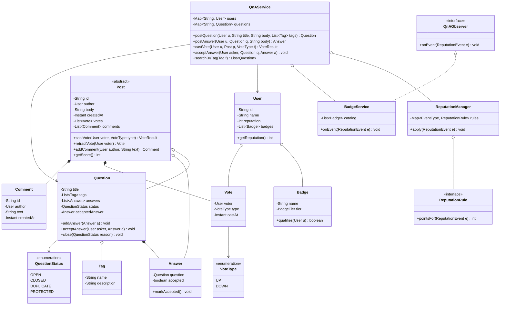

# Design a Q&A Site (Stack Overflow)

> The canonical **rich domain model** LLD problem. There is no scheduler, no board game
> loop, no vending hardware — the entire difficulty is in getting the *entities and their
> associations* right: `User`, `Question`, `Answer`, `Comment`, `Tag`, `Vote`, `Badge`,
> and the derived `Reputation`. Interviewers use it to see whether you can (1) find a
> shared abstraction (`Post`) instead of duplicating vote/comment logic across `Question`
> and `Answer`, (2) express reputation as a *rule set* rather than `if`-soup scattered
> across services, and (3) wire up badge awarding and notifications without every event
> source knowing about every consumer. It is a modeling problem first and a patterns
> problem second — but the two payoff patterns (Strategy for reputation, Observer for
> badges/notifications) fall out naturally once the model is clean.

## Requirements Clarification

Spend the first five minutes bounding the problem. Good questions and typical answers:

- **What can users post?** `Question`s and `Answer`s. Both can be **commented on** and
  **voted on**. Questions carry a title and **tags**; answers belong to exactly one
  question. This symmetry is the hook for a shared `Post` abstraction — call it out early.
- **Voting rules?** Upvote and downvote on questions and answers. A user casts **at most
  one vote per post** and may change or retract it. A user **cannot vote on their own
  post**. Votes drive reputation.
- **Reputation events?** The classic Stack Overflow numbers: answer upvote **+10**,
  question upvote **+5**, accepted answer **+15** (to the answerer), downvote received
  **−2** on the post, casting a downvote on an answer costs the voter **−1**. Ask whether
  the numbers must be *configurable/pluggable* — they should be, which motivates a
  reputation Strategy / rules engine rather than hard-coded constants.
- **Accepting answers?** The question's **author (asker) alone** may accept exactly one
  answer. Acceptance is a distinct reputation event and a distinct state on the question.
- **Badges?** Awarded automatically when a user crosses a threshold (e.g., reputation
  ≥ some value, or "first answer accepted", or "answer scored ≥ 100"). Bronze/Silver/Gold
  tiers. This is the Observer hook — badges react to events, they don't poll.
- **Tags?** A question has 1–5 tags. Tags are shared, reusable entities (many-to-many),
  used for search/filtering. Ask whether **tag search** is in scope (usually a simple
  filter is enough for LLD; full-text search is HLD).
- **Question lifecycle?** `OPEN` is the norm; questions can be `CLOSED` (off-topic/dup),
  marked `DUPLICATE`, or `PROTECTED` (high-value, restricted from new low-rep answers).
  A small state machine — good place to name the State pattern.

**Scope OUT explicitly:** authentication/OAuth, full-text search ranking, the HTML editor,
email/push delivery internals, pagination, and **"scale to Stack Overflow's real traffic"**
— that last one is a distributed-systems/HLD concern (read replicas, search index, caching
tiers). Say so and keep the design single-process, in-memory, thread-safe. See the
`system-design` domain for the scale-out version.

> [!INTERVIEW]
> The single sentence that earns trust here: *"Questions and answers are both votable and
> commentable, so I'll pull a `Post` base type and hang votes and comments off it — that
> way voting and reputation are written once."* It signals you spotted the shared
> abstraction before writing a line of code.

## Use-Cases and Actors

The Grokking "UML-first" move: list actors and their use-cases before drawing classes.

**Actors**

- **Guest** (unauthenticated): search and read questions/answers. Read-only.
- **Member** (registered `User`): everything a guest can do, plus ask, answer, comment,
  vote, accept answers (on own questions), earn reputation and badges.
- **Moderator**: a `User` with elevated privileges — close/reopen/protect questions,
  delete posts, handle flags. Model as a **role/privilege**, not a subclass (see the
  modeling trap below).
- **System/Timer**: awards badges, recomputes reputation on events. Not a human actor but
  worth naming — it's what the Observer machinery represents.

**Primary use-cases**

- Ask a question (with tags); post an answer; comment on a post.
- Upvote / downvote a post; change or retract a vote.
- Accept an answer (asker only).
- Search/filter questions by tag.
- Earn reputation from votes/acceptance; earn a badge on threshold.
- Moderate: close, mark duplicate, protect, delete, resolve flags.

> [!TIP]
> Privileges in real Stack Overflow are **reputation-gated** (e.g., you need ≥15 rep to
> vote up, ≥125 to vote down, ≥3000 to close). Mentioning that privileges derive from
> reputation — rather than a fixed role table — is a strong senior signal and a clean
> extensibility story (a `Privilege` check against `user.reputation`).

## Noun/Verb Object Identification

This is the step-by-step technique the round is really testing. Take the requirement prose
and mechanically extract candidates, then **filter** — not every noun becomes a class.

**Underline the nouns (candidate classes/attributes):**

> A **user** asks a **question** with a **title**, **body**, and **tags**. Other **users**
> post **answers**. Users add **comments** to questions and answers. Users cast **votes**
> (**upvote**/**downvote**). The **asker** **accepts** one **answer**. Users earn
> **reputation** and **badges**. **Moderators** **close** questions.

| Noun | Verdict | Why |
|---|---|---|
| User | **Class** | Core identity/actor. |
| Question | **Class** | Core entity; extends `Post`. |
| Answer | **Class** | Core entity; extends `Post`. |
| Comment | **Class** | Entity attached to a `Post`. |
| Tag | **Class** | Shared, reusable, many-to-many with `Question`. |
| Vote | **Class** | Reifies the *act* of voting (voter + type + target) — not a bool. |
| Reputation | **Attribute + Strategy** | A derived `int` on `User`; *how* it changes is a rule set. |
| Badge | **Class** | Awarded entity with tier + criteria. |
| Title / body | **Attributes** | Fields of `Post`, not classes. |
| Upvote / downvote | **Enum** `VoteType` | Two values of one concept — not two classes. |
| Asker / voter / answerer | **Roles** | Relationships/references, not subclasses of `User`. |
| Moderator | **Role/Privilege** | Elevated `User`, not a subclass (avoid rigid hierarchy). |
| Account | **Class (optional)** | Split credentials/settings from public profile if asked; otherwise fold into `User`. |

**Extract the verbs (candidate methods):** *ask → `postQuestion`, answer → `postAnswer`,
comment → `addComment`, vote → `castVote`, accept → `acceptAnswer`, close → `close`,
earn → `applyReputationEvent` / `awardBadge`, search → `searchByTag`.* Assign each verb to
the class that **owns the data it touches** (Information Expert): `castVote` and
`acceptAnswer` live behind the aggregate that owns the vote list and answer list.

> [!WARNING]
> Two classic traps. **(1)** Modeling `upvote` and `downvote` as separate classes instead
> of a `VoteType` enum on one `Vote` — it duplicates every rule. **(2)** Making `Vote` a
> plain counter (`int votes`) — you then cannot enforce "one vote per user", "no
> self-vote", or vote retraction. Reify the *act*: `Vote(voter, type, target, timestamp)`.

## Responsibilities and Relationships (CRC + associations)

Give each class one job; state what it **knows** and what it **does** and its
collaborators (CRC-style):

| Class | Knows (data) | Does (behavior) | Collaborators |
|---|---|---|---|
| `User` | id, name, reputation, badges | expose profile; hold derived reputation & badge list | `Post`, `Badge`, `ReputationManager` |
| `Post` *(abstract)* | id, author, body, creation time, votes, comments, score | add/retract vote (enforce one-per-user, no self-vote), add comment, compute score | `Vote`, `Comment`, `User` |
| `Question` *(Post)* | title, tags, answers, status, accepted answer | add answer, accept answer, close/protect, search relevance | `Answer`, `Tag`, `QuestionStatus` |
| `Answer` *(Post)* | parent question, accepted flag | mark accepted | `Question` |
| `Comment` | author, text, time | (immutable-ish note) | `User`, `Post` |
| `Tag` | name, description | identify/group questions | `Question` |
| `Vote` | voter, type (UP/DOWN), target, time | represent a single voting act | `User`, `Post` |
| `VoteType` *(enum)* | UP, DOWN | — | — |
| `Badge` | name, tier, criterion | test whether a user qualifies | `User` |
| `ReputationManager` | rule map (event → delta) | compute reputation change for an event | `ReputationRule`, `User` |
| `ReputationRule` *(Strategy)* | delta for one event type | return points for an event | `Post`, `User` |
| `BadgeService` *(Observer)* | catalog of badges | on event, check criteria, award badge | `Badge`, `User` |
| `QnAService` *(Facade)* | registries of users/questions/tags | orchestrate use-cases, publish events | everything |

**Relationships (the payoff of this problem):**

- `Question --|> Post` and `Answer --|> Post` — **inheritance**: both *are* votable,
  commentable posts. This is the one place inheritance is clearly right (an "is-a" that
  shares real behavior — voting/scoring/commenting), *provided* `Post` stays about
  post-hood and role logic lives elsewhere.
- `Post "1" --* "*" Vote` and `Post "1" --* "*" Comment` — **composition**: a vote/comment
  has no life outside its post; delete the post and they go with it.
- `Question "1" --* "*" Answer` — **composition**: an answer belongs to exactly one
  question and dies with it.
- `Question "*" --o "*" Tag` — **aggregation** (many-to-many): tags are shared across
  questions and exist independently.
- `User "1" --o "*" Badge` — aggregation: badges reference a shared catalog definition.
- `User` casts many `Vote`s (`User "1" --o "*" Vote`), each targeting a `Post`.
- `QnAService` **has-a** `ReputationManager` and a `BadgeService` (composition of
  collaborators); `BadgeService` **observes** the service's event stream.

> [!KEY-TAKEAWAY]
> The whole design hinges on one decision: **`Post` as the shared base for `Question` and
> `Answer`.** Get that and voting, commenting, and scoring are written once and inherited.
> Miss it and you duplicate `castVote`/`addComment`/`getScore` in two classes — the exact
> DRY violation the interviewer is hunting for.

## Class Diagram



## Design Decisions and Patterns

Name each pattern and *why*; cross-reference the `dp-*` topic that owns its taxonomy — do
not re-derive the pattern here.

- **Shared `Post` abstraction (inheritance + Template Method flavor).** `Question` and
  `Answer` inherit voting, commenting, and scoring from `Post`. This is composition-free
  reuse that's genuinely justified because the shared behavior is real, not incidental.
  Some designs prefer a `Votable`/`Commentable` **interface** + composition; note the
  trade-off (interface = more flexible, no forced hierarchy; base class = less
  boilerplate). Either is defensible — say which and why.
- **Strategy — reputation calculation** (`ReputationRule` per event type, behavioral:
  *interchangeable algorithm*). Each reputation event (`ANSWER_UPVOTED`,
  `QUESTION_UPVOTED`, `DOWNVOTED`, `ANSWER_ACCEPTED`) maps to a rule returning a point
  delta. Adding a new event = add a rule; the numbers become data, satisfying Open/Closed.
  See `dp-strategy`.
- **Observer — badge awarding & notifications** (behavioral: *one-to-many event
  propagation*). When reputation/action events fire, `BadgeService` and notification
  channels react without the post/vote code knowing they exist. Add a new listener (e.g.,
  an activity feed) without touching the publisher — Open/Closed again. See `dp-observer`.
- **State — question lifecycle** (`QuestionStatus`: OPEN → CLOSED/DUPLICATE/PROTECTED,
  behavioral: *behavior varies by state*). Legal operations depend on status (can't answer
  a `CLOSED` question; only high-rep users answer `PROTECTED` ones). For an interview an
  **enum guard** is usually enough; escalate to full State classes only if transitions get
  complex. See `dp-state`.
- **Facade — `QnAService`** (structural: *simplified entry point*). One coarse API over the
  entity graph; it owns registries and is where events get published. Keeps controllers
  thin and entities free of orchestration.
- **Strategy again — search/sort** (sort answers by score / newest / active). Pluggable
  `Comparator`/sort strategy rather than branching.
- **Information Expert (GRASP)** — behavior lives with the data: `castVote` on `Post`
  (owns the vote list, enforces one-per-user/no-self-vote); `acceptAnswer` on `Question`
  (owns answers and the asker check). See `design-principles-beyond-solid`.

SOLID in play: **SRP** (reputation math isn't in `Vote`; badge logic isn't in `User`);
**OCP** (new reputation rule / badge / listener = new class, no edits); **DIP**
(`QnAService` depends on the `ReputationRule` and `QnAObserver` abstractions, not concretes);
**LSP** (any `Post` subtype is substitutable wherever a votable post is expected). See
`solid-principles`.

## API / Method Signatures

Key public surface (types shown; `Result` objects report accept/reject reasons):

```java
// Facade
Question postQuestion(User author, String title, String body, List<Tag> tags);
Answer   postAnswer(User author, Question question, String body);
Comment  addComment(User author, Post target, String text);
VoteResult castVote(User voter, Post target, VoteType type);   // idempotent; a flip reverses old rep then applies new
void       retractVote(User voter, Post target);               // reverses the reputation the removed vote granted
void       acceptAnswer(User asker, Question question, Answer answer);
List<Question> searchByTag(Tag tag);
List<Question> searchByTag(Tag tag, SortStrategy sort);

// Post (abstract) — shared, inherited by Question & Answer
int getScore();                       // upvotes - downvotes
VoteResult castVote(User voter, VoteType type);

// Reputation
interface ReputationRule { int pointsFor(ReputationEvent e); }
void ReputationManager.apply(ReputationEvent event);

// Observer
interface QnAObserver { void onEvent(ReputationEvent event); }
void QnAService.register(QnAObserver observer);
```

## Code Skeleton

```java
enum VoteType { UP, DOWN }
enum QuestionStatus { OPEN, CLOSED, DUPLICATE, PROTECTED }

abstract class Post {
    protected final String id;
    protected final User author;
    protected String body;
    protected final Instant createdAt;
    protected final Map<String, Vote> votesByUser = new ConcurrentHashMap<>();
    protected final List<Comment> comments = new CopyOnWriteArrayList<>();

    VoteResult castVote(User voter, VoteType type) {
        if (voter.equals(author))
            return VoteResult.rejected("Cannot vote on your own post");
        Vote existing = votesByUser.get(voter.getId());
        if (existing != null && existing.type() == type)
            return VoteResult.rejected("Already voted");     // idempotent
        votesByUser.put(voter.getId(), new Vote(voter, type, this, Instant.now()));
        // hand back the prior vote type (null if none) so the service can reverse its rep
        // delta before applying the new one — a flip is a reversal PLUS a new event
        return VoteResult.accepted(type, existing == null ? null : existing.type());
    }

    // returns the removed Vote (or null) so the service can reverse the reputation it granted
    Vote retractVote(User voter) { return votesByUser.remove(voter.getId()); }

    int getScore() {
        return (int) votesByUser.values().stream().filter(v -> v.type() == VoteType.UP).count()
             - (int) votesByUser.values().stream().filter(v -> v.type() == VoteType.DOWN).count();
    }
    Comment addComment(User a, String text) {
        Comment c = new Comment(a, text);
        comments.add(c);
        return c;
    }
}

class Question extends Post {
    private final String title;
    private final List<Tag> tags;
    private final List<Answer> answers = new CopyOnWriteArrayList<>();
    private volatile QuestionStatus status = QuestionStatus.OPEN;
    private volatile Answer acceptedAnswer;

    void acceptAnswer(User asker, Answer answer) {
        if (!asker.equals(this.author))
            throw new IllegalStateException("Only the asker can accept an answer");
        if (!answers.contains(answer))
            throw new IllegalArgumentException("Answer does not belong to this question");
        if (acceptedAnswer != null) acceptedAnswer.setAccepted(false); // re-accept allowed
        acceptedAnswer = answer;
        answer.setAccepted(true);
        // service publishes ReputationEvent(ANSWER_ACCEPTED, answer.author)
    }
}

// Strategy: reputation as data-driven rules
interface ReputationRule { int pointsFor(ReputationEvent e); }

class ReputationManager {
    private final Map<EventType, ReputationRule> rules = Map.of(
        EventType.ANSWER_UPVOTED,   e -> +10,
        EventType.QUESTION_UPVOTED, e -> +5,
        EventType.DOWNVOTED,        e -> -2,   // to the post author
        EventType.DOWNVOTE_CAST,    e -> -1,   // to the voter, for downvoting an answer
        EventType.ANSWER_ACCEPTED,  e -> +15
    );
    void apply(ReputationEvent e) {
        ReputationRule rule = rules.get(e.type());
        if (rule == null) return;
        // reversal events (vote flip / retract) negate the delta the original event granted
        int delta = e.isReversal() ? -rule.pointsFor(e) : rule.pointsFor(e);
        e.targetUser().addReputation(delta);
    }
}

// Observer: badges/notifications react to events
interface QnAObserver { void onEvent(ReputationEvent e); }

class BadgeService implements QnAObserver {
    private final List<Badge> catalog;
    @Override public void onEvent(ReputationEvent e) {
        for (Badge b : catalog)
            if (b.qualifies(e.targetUser()) && !e.targetUser().hasBadge(b))
                e.targetUser().awardBadge(b);   // idempotent award
    }
}

class QnAService {
    private final ReputationManager reputation = new ReputationManager();
    private final List<QnAObserver> observers = new CopyOnWriteArrayList<>();

    VoteResult castVote(User voter, Post target, VoteType type) {
        VoteResult r = target.castVote(voter, type);
        if (!r.accepted()) return r;
        // A flip (priorType != null) first reverses what the old vote granted, then applies the new vote.
        if (r.priorType() != null)
            reverse(target, voter, r.priorType());
        applyVote(target, voter, type);
        return r;
    }

    void retractVote(User voter, Post target) {
        Vote removed = target.retractVote(voter);
        if (removed != null) reverse(target, voter, removed.type());
    }

    // one physical vote can move TWO users' reputation: the post author (up/down) and,
    // for a downvote on an answer, the voter (-1). Emit an event per affected user.
    private void applyVote(Post target, User voter, VoteType type) {
        publish(new ReputationEvent(eventTypeFor(target, type), target.getAuthor(), false));
        if (type == VoteType.DOWN && target instanceof Answer)
            publish(new ReputationEvent(EventType.DOWNVOTE_CAST, voter, false));
    }
    private void reverse(Post target, User voter, VoteType type) {
        publish(new ReputationEvent(eventTypeFor(target, type), target.getAuthor(), true));
        if (type == VoteType.DOWN && target instanceof Answer)
            publish(new ReputationEvent(EventType.DOWNVOTE_CAST, voter, true));
    }
    private void publish(ReputationEvent e) {
        reputation.apply(e);
        observers.forEach(o -> o.onEvent(e));   // BadgeService, notifiers, ...
    }
}
```

Note how `ReputationManager` (Strategy map) and `BadgeService` (Observer) both hang off the
single `publish(...)` seam — every reputation-affecting action funnels through one place,
so a new consumer or a new rule is an *addition*, never an edit.

## Worked Example: a vote-to-badge trace

The machinery above stays abstract until you push real numbers through it. User **A** starts
at **reputation 0**. A's answer `a7` collects **5 upvotes**, then **2 downvotes**, then the
asker **accepts** it. The badge catalog holds one Silver badge whose `qualifies(u)` returns
true at **reputation ≥ 50**. Watch each action funnel through `publish(...)`:

| # | Action | Event(s) published (target) | `ReputationManager.apply` | A's rep | `BadgeService.onEvent` |
|---|---|---|---|---|---|
| 1 | upvote #1 | `ANSWER_UPVOTED` (A) | +10 | 10 | <50, no award |
| 2 | upvote #2 | `ANSWER_UPVOTED` (A) | +10 | 20 | no |
| 3 | upvote #3 | `ANSWER_UPVOTED` (A) | +10 | 30 | no |
| 4 | upvote #4 | `ANSWER_UPVOTED` (A) | +10 | 40 | no |
| 5 | upvote #5 | `ANSWER_UPVOTED` (A) | +10 | **50** | `qualifies`→true, **award Silver** |
| 6 | downvote #1 | `DOWNVOTED` (A) **+** `DOWNVOTE_CAST` (voter) | −2 to A; −1 to voter | 48 | has Silver → skip |
| 7 | downvote #2 | `DOWNVOTED` (A) **+** `DOWNVOTE_CAST` (voter) | −2 to A; −1 to voter | 46 | skip |
| 8 | asker accepts | `ANSWER_ACCEPTED` (A) | +15 | **61** | skip |

**Arithmetic check:** `5×(+10) + 2×(−2) + (+15) = 50 − 4 + 15 = 61`. The badge fires **exactly
once**, at step 5 — the moment `A.reputation` crosses 50 on the same event that moved it.
Steps 6–8 re-run `onEvent`, but `hasBadge(b)` short-circuits the re-award (Observer
idempotency). Nothing polls; the threshold check rides the reputation event itself. Note also
that each downvote emits **two** events: the −2 hits author A, and a `DOWNVOTE_CAST` −1 hits
the *caster* — one physical click, two `ReputationEvent`s to two different users.

**Now flip a vote.** Say upvote #5 was voter V, who at step 5 leaves A at 50 and then switches
to a downvote. `Post.castVote` overwrites V's map entry and returns `priorType = UP`; the
service first **reverses** the old `ANSWER_UPVOTED` (−10), then applies the new `DOWNVOTED`
(−2): A moves `50 → 40 → 38`, a net **−12** from that one voter — not the `+8` you'd get by
only counting the new downvote against the stale +10. `getScore()` needs no special case: the
map now holds one `DOWN` where a `UP` used to be, so the derived score drops by 2 (from +5,
five upvotes, to +3, four upvotes minus one downvote) automatically.

## Extensibility

The "now add X" follow-ups and where each lands — each should be an addition, not a rewrite:

- **Bounties** ("offer +50 rep to whoever answers"): add a `Bounty` value object on
  `Question` (amount, sponsor, expiry) and two new `EventType`s (`BOUNTY_STARTED` debits
  the sponsor, `BOUNTY_AWARDED` credits the answerer) → new `ReputationRule`s. No change to
  `Post`/`Vote`. Awarding on expiry is a scheduled event through the same `publish` seam.
- **Moderation / flags:** add a `Flag(reporter, reason, target)` entity and a
  `FlagQueue`; moderators act via new `QnAService` methods guarded by a privilege check.
  Closing/protecting is just a `QuestionStatus` transition already modeled.
- **Comment threads / replies:** `Comment` gains a `parentComment` reference (self-
  association) — a Composite-style tree — without touching `Post`.
- **New badge:** add a `Badge` with a `qualifies(user)` predicate to the catalog; the
  Observer awards it automatically. Zero edits to existing code (textbook OCP).
- **New reputation event** (e.g., "answer reaches score 100" → `GREAT_ANSWER` badge + rep):
  add an `EventType` + a `ReputationRule`; publish it where the score is checked.
- **New sort order** (Active, Votes, Newest): a new sort `Strategy`/`Comparator` passed to
  `searchByTag` — no branching in the service.
- **Full-text search / feed at scale:** name it as HLD (inverted index, search service,
  read replicas) and point to `system-design`; the `searchByTag` seam is where an external
  index client would plug in.

## Concurrency and Edge Cases

Single-process, thread-safe. The interesting races are around **votes** and **reputation**:

- **Concurrent votes on the same post:** back the votes by `voter.getId()` in a
  `ConcurrentHashMap` (shown) so "one vote per user" is enforced atomically — a duplicate
  from the same user is idempotent, and two *different* users don't contend. `getScore()`
  derives from the map, so it's always consistent with the stored votes. **Trade-off:**
  derive-on-read is dead simple and never drifts, but it streams the whole vote map (O(n) per
  read) — fine for LLD, painful for a hot question read millions of times. The alternative is
  a denormalized pair of `AtomicInteger` up/down counters bumped on each vote: O(1) reads at
  the cost of keeping them in sync with the map under concurrent votes/flips/retracts. Pick
  the counter only once read pressure justifies the extra invariant to maintain.
- **Reputation updates:** `addReputation(delta)` must be atomic (`AtomicInteger` or a
  synchronized accumulator) — many votes across many posts credit the same author
  concurrently; a naive `rep += delta` loses updates.
- **Self-vote / double-vote / vote flip:** rejected or handled idempotently in
  `Post.castVote` (author check + per-user map). Flipping up→down is a single atomic
  `put` that overwrites the map entry, so the stored vote — and the derived score — never
  transiently double-counts. **Reputation must be reversed too:** `castVote` returns the
  *prior* vote type, and the service publishes a **reversal event** (negating the old
  delta) before applying the new vote's delta, so a +10 upvote flipped to a −2 downvote
  nets the author −12, not +8. `retractVote` returns the removed vote and publishes a
  single reversal, undoing exactly what that vote had granted.
- **Accept answer races:** only the asker accepts, and re-accepting moves the flag
  atomically (unset old, set new) under the question's guard so at most one answer is
  accepted at any instant.
- **Deleting a post with votes/comments:** composition means they cascade; but reputation
  already granted is typically *not* clawed back automatically — decide and state the policy.
- **Observer isolation:** a failing/slow notifier must not block voting or roll back
  reputation — wrap each `onEvent` in try/catch or dispatch asynchronously (same hazard as
  calling foreign code in a hot path; see `dp-observer` notes).
- **Badge idempotency:** `BadgeService` must not award the same badge twice — check
  `hasBadge` before awarding (Observers can fire repeatedly).

> [!KEY-TAKEAWAY]
> One aggregate boundary per `Post` (owns its votes/comments), one `Question` boundary
> (owns its answers + acceptance), and one `publish(...)` seam where **Strategy** decides
> *how much* reputation and **Observer** decides *who reacts*. Every follow-up (bounties,
> badges, flags, feeds) lands in a seam, not a rewrite.

## Common Interview Follow-ups

- **"Why a `Post` base class instead of duplicating vote/comment logic?"** DRY + LSP:
  voting/commenting/scoring are identical for questions and answers; write once, inherit.
  Mention the `Votable`/`Commentable` interface + composition alternative and the trade-off.
- **"How do you stop a user voting twice or voting on their own post?"** Reify `Vote` and
  key votes by user id (map); author check in `castVote`. A plain `int` counter can't
  enforce either.
- **"What happens to reputation when a vote is flipped or retracted?"** The granted rep
  must be reversed, not just overwritten. `castVote` returns the prior vote type; the
  service publishes a **reversal event** (negating the old delta) and then the new vote's
  event, so up→down nets the author −12 (undo +10, then −2). `retractVote` returns the
  removed vote and publishes one reversal. This is also why one physical downvote on an
  answer emits **two** events — −2 to the author and −1 to the voter (`DOWNVOTE_CAST`) —
  each reversible independently. Recomputing rep from the full vote set on every change is
  the simpler-but-slower alternative.
- **"Make the reputation numbers configurable."** They already are — `ReputationManager`
  is a map of `EventType → ReputationRule`; load the map from config. That's the Strategy
  payoff.
- **"Award a badge when a user hits 10k rep."** Add a `Badge` with a `qualifies` predicate
  to the catalog; the `BadgeService` Observer awards it on the next event. No edits.
- **"Add bounties."** `Bounty` on `Question` + two `EventType`s + rules; funnels through
  the same publish seam.
- **"Only the asker can accept — where does that check live?"** On `Question.acceptAnswer`
  (Information Expert: the question owns its answers and knows its author), not in the UI
  or a generic service method.
- **"Model close/duplicate/protected."** `QuestionStatus` state machine (State pattern /
  enum guard); legal operations depend on status.
- **"You said privileges are reputation-gated — show it."** Make `Privilege` a small enum
  carrying its own min-rep threshold, and derive the check from `user.reputation` rather than
  a role table — so the same mechanism that awards badges also unlocks abilities:

  ```java
  enum Privilege {
      VOTE_UP(15), VOTE_DOWN(125), COMMENT(50), EDIT_OTHERS(2000), CLOSE(3000);
      private final int minRep;
      Privilege(int minRep) { this.minRep = minRep; }
      int minRep() { return minRep; }
  }
  // Information Expert: User owns its reputation, so it answers can()
  class User { boolean can(Privilege p) { return reputation >= p.minRep(); } }
  ```

  Worked trace: user A from the example above sits at **rep 61**. `A.can(VOTE_UP)` → `61 ≥ 15`
  → **true**; `A.can(COMMENT)` → `61 ≥ 50` → **true**; `A.can(VOTE_DOWN)` → `61 ≥ 125` →
  **false**; `A.can(CLOSE)` → `61 ≥ 3000` → **false**. `QnAService.castVote` gates on
  `voter.can(type == UP ? VOTE_UP : VOTE_DOWN)` before touching the post. New privilege =
  new enum constant, no edits (OCP) — and a *moderator* is just a `User` whose rep clears the
  bar (or an explicit override flag), not a subclass.
- **"Scale to real Stack Overflow traffic."** Out of LLD scope — read replicas, a search
  index (Elasticsearch), caching, and denormalized reputation counters live in the
  `system-design` domain; the OO model is the single-node core.

## References

- Gamma, Helm, Johnson, Vlissides — *Design Patterns* (Strategy, Observer, State, Composite).
- Craig Larman — *Applying UML and Patterns* (GRASP: Information Expert, noun/verb analysis).
- Joshua Bloch — *Effective Java*, 3rd ed. (favor composition, immutability, enums over
  boolean flags).
- Eric Evans — *Domain-Driven Design* (aggregates, entity vs. value objects).
- Stack Overflow Help Center — reputation, privileges, and badges (real-world reference for
  the rule numbers and lifecycle).
- Related topics in this library: `dp-strategy`, `dp-observer`, `dp-state`, `dp-composite`,
  `solid-principles`, `design-principles-beyond-solid`, `lld-interview-method`,
  `uml-class-diagrams`.
