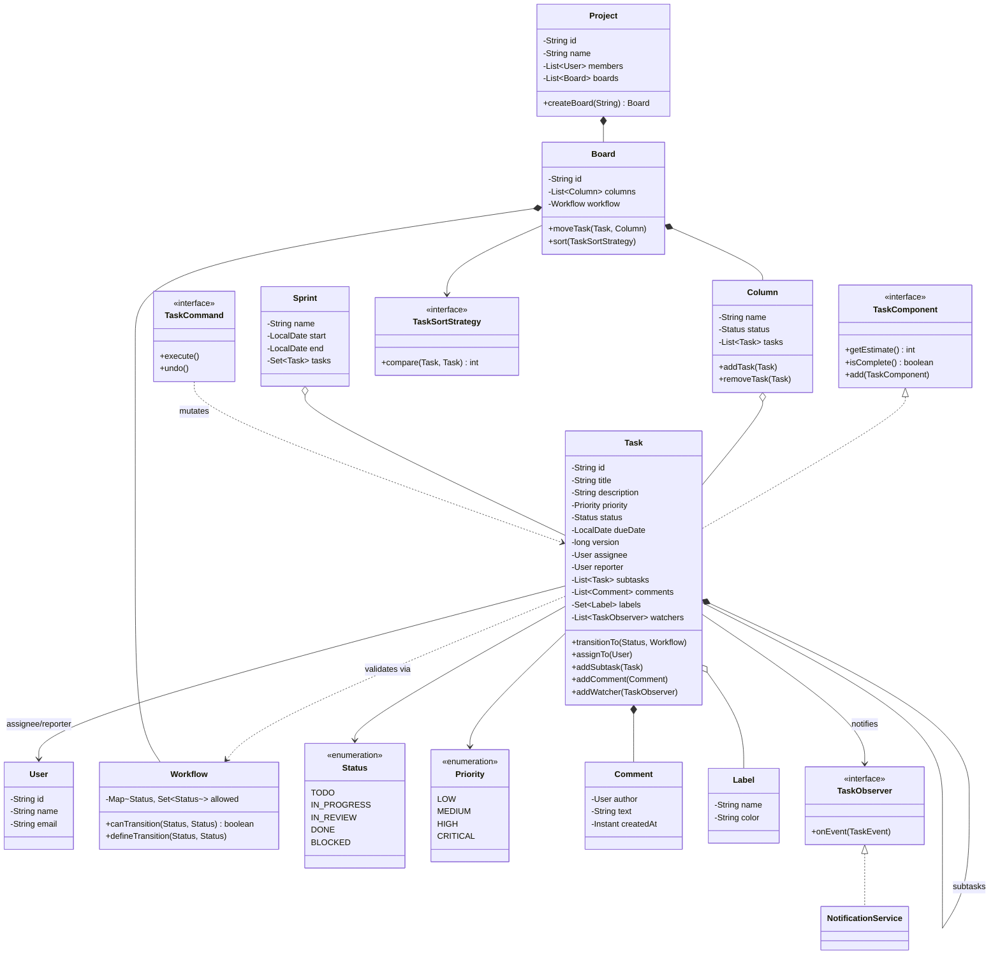
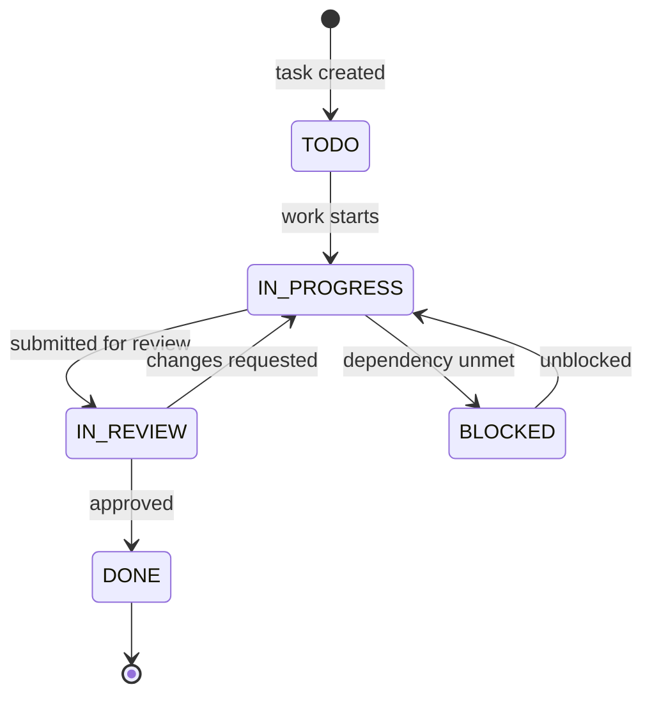

# Design a Task Management System

A Jira / Trello / Asana-style task manager is the LLD problem that most rewards **clean
composition and an explicit workflow**. It looks CRUD-simple ("tasks have a status") but
hides four seams interviewers probe hard: (1) a **configurable status workflow** that says
which transitions are legal — per board, not hard-coded; (2) a **task hierarchy** where a
task can own subtasks (Composite); (3) a **dependency graph** where a task blocks another
(topological ordering); and (4) a **fan-out of notifications** to assignees and watchers on
every change (Observer). The trap is collapsing everything into a god `Task` class with a
`String status` and a wall of `if`s. The other trap is scope: "sync across a million users
in real time" is HLD — name it and keep the design single-process OO.

## Requirements Clarification

Spend the first five minutes narrowing scope. High-signal questions:

- **What's the container hierarchy?** Typical answer: an `Organization`/`Team` owns
  `Project`s; a `Project` has one or more `Board`s; a `Board` has ordered `Column`s (which
  map to a `Status`); `Task`s live in a column. Clarify whether we model teams/orgs or start
  at project level (start at project — teams are an easy extension).
- **What is a Task, exactly?** title, description, an `assignee`, a `reporter`/creator,
  `priority`, `status`, `dueDate`, labels, comments, and — critically — **subtasks** (a task
  can contain child tasks) and **dependencies** (task A blocks task B). Confirm subtasks and
  dependencies are in scope; they are the interesting part.
- **Is the workflow fixed or configurable?** Real tools let each board define its own
  columns/statuses and which transitions are allowed (Kanban `TODO → DOING → DONE` vs. a
  dev flow `TODO → IN_PROGRESS → IN_REVIEW → DONE`). Design for **configurable per-board
  workflows** — this is the whole point of the problem.
- **Who gets notified, and on what?** Assignee and any watchers, on status change,
  assignment change, comment added, due-date change. Fan-out → Observer.
- **Do we need audit / undo?** Every change should be logged (activity feed); interviewers
  often add "undo the last action" — that's your cue for Command.
- **Ordering / scheduling:** given dependencies, produce a valid execution order and detect
  cycles ("A blocks B blocks A" is illegal). Ordering = topological sort (cross-ref
  dsa-coding); we just call it by name.
- **Out of scope (say it out loud):** real-time collaborative editing (OT/CRDT), full-text
  search at scale, permissions/RBAC depth, cross-region sync, analytics dashboards. Note the
  seam where each plugs in and move on.

A crisp scope statement: *"I'll design a single-process task manager: a Project has Boards;
each Board has ordered Columns bound to a configurable set of Statuses with legal-transition
rules; Tasks live in columns, can own subtasks (a tree) and declare blocks/blocked-by
dependencies (a DAG); status changes go through a guarded state machine and fan out to
watchers via Observer; sorting/filtering is pluggable via Strategy; every mutation is a
Command for the activity log and undo. Concurrency: two users editing one task must not
silently clobber each other — optimistic versioning."*

## Actors and Use Cases

Model who acts before you model the nouns (the Grokking UML-first approach).

- **Member (User):** creates tasks, assigns them, comments, moves tasks across columns
  (status change), adds subtasks, declares dependencies, watches tasks.
- **Project Admin:** everything a member can do, plus configures the board — defines
  columns/statuses and the legal transition rules, manages sprints.
- **Watcher:** a passive role — a user subscribed to a task's changes (notified, does not
  act). Watching is a relationship, not a subclass.
- **System / Scheduler (optional):** fires due-date reminders and rolls incomplete tasks at
  sprint end.

Core use cases: *create/assign task*, *move task through workflow*, *add subtask*,
*link dependency*, *comment*, *watch/unwatch*, *filter & sort a board*, *configure workflow*,
*view activity log*, *undo last action*. Each maps to a method on a service or entity below.

## Noun/Verb Object Identification

The step-by-step technique: underline the **nouns** in the requirements (candidate classes)
and the **verbs** (candidate methods), then **filter** — not every noun becomes a class.

**Candidate nouns → verdict:**

| Noun | Verdict | Why |
|---|---|---|
| User / Member | **Class** | Identity + behavior; base for roles |
| Task | **Class** (aggregate root of the domain) | Rich state + lifecycle |
| Project | **Class** | Owns boards, members |
| Board | **Class** | Owns ordered columns + the workflow config |
| Column | **Class** | Ordered lane bound to a status; owns task ordering |
| Status | **Enum / value** (or `WorkflowState`) | Fixed vocabulary per board |
| Comment | **Class** | Author + text + timestamp on a task |
| Label / Tag | **Class** (value object) | Reused across tasks (flyweight-ish) |
| Sprint | **Class** | Time-boxed set of tasks (extension) |
| Team | **Class** (extension) | Group of members |
| Priority | **Enum** | Fixed vocabulary (LOW..CRITICAL) — *not a class* |
| Due date | **Field** (`LocalDate`) — *not a class* | Plain attribute of Task |
| Title / description | **Fields** — *not a class* | Attributes |
| Assignee | **Reference to User** — *not a new class* | It's a role of User on a Task |
| Dependency | **Relationship** modeled as `TaskDependency` edge or adjacency in a graph | Not a standalone entity with behavior |
| Notification | **Class** (message) + Observer channel | |
| Workflow / transition rules | **Class** (`Workflow`) | The configurable legal-transition map |
| Activity / audit entry | **Class** (`ActivityLog` of `Command`s) | |

**Candidate verbs → methods:** *create/assign* (`assignTo`), *move/transition*
(`moveTo(Status)` / `transitionTo`), *add subtask* (`addSubtask`), *block / depend on*
(`addDependency`), *comment* (`addComment`), *watch* (`addWatcher`), *sort/filter*
(`sort(strategy)`, `filter(predicate)`), *configure* (`defineTransition`), *undo* (`undo`).

The filter is the point: **Priority and Status are enums, not classes** (fixed vocabulary,
no behavior of their own worth a type); **due date and title are fields**; **assignee is a
role**, i.e., a `User` reference on the task, not an `Assignee` class; and a **dependency is
an edge** in a graph, not a heavyweight object. Over-classing every noun is the classic
junior mistake.

## Responsibilities and Relationships

CRC-style — what each class *knows* and *does*, plus its collaborators and the relationship
kind (composition ◆ = part dies with whole; aggregation ◇ = part outlives whole; association
→ = uses/refers).

| Class | Knows (state) | Does (behavior) | Key collaborators |
|---|---|---|---|
| `User` | id, name, email | — | referenced by Task (assignee, reporter, watcher) |
| `Task` | id, title, desc, priority, status, dueDate, version, assignee, reporter, subtasks, comments, labels, watchers | `transitionTo`, `addSubtask`, `addDependency`, `assignTo`, `addComment`, `addWatcher`, notify | Board (workflow), User, TaskComponent, Observer |
| `Project` | id, name, members, boards | `createBoard`, `addMember` | Board, User |
| `Board` | id, ordered columns, `Workflow` | `moveTask(task, toColumn)`, `sort(strategy)`, `configureWorkflow` | Column, Workflow, SortStrategy |
| `Column` | name, bound `Status`, ordered task list | `addTask`, `removeTask`, `reorder` | Task, Status |
| `Workflow` | allowed transitions map `Status → Set<Status>` | `canTransition`, `defineTransition` | Status |
| `Comment` | author, text, timestamp | — | User |
| `Label` | name, color | — | Task (many-to-many) |
| `Sprint` | name, start/end, task set | `addTask`, `startSprint`, `complete` | Task |
| `NotificationService` (Observer) | subscribers | `onTaskChanged(event)` | Task events |
| `TaskCommand` | receiver + params + undo state | `execute`, `undo` | Task, ActivityLog |

Relationship callouts (favorite diagram probes):

- **`Project ◆-- Board`, `Board ◆-- Column`** — composition: a board has no meaning without
  its project; columns have no meaning without their board.
- **`Task ◆-- Comment`, `Task ◆-- Subtask(Task)`** — composition: comments and subtasks die
  with the task (delete a task → its comments and child subtasks go).
- **`Task ◇-- Label`, `Column ◇-- Task`, `Task → User`** — aggregation/association: labels,
  tasks, and users all outlive the container that references them. Deleting a column must not
  delete the tasks (they move); deleting a task must not delete the assignee.
- **`Board → Workflow`** — the board *has-a* configurable workflow (composition — one
  workflow per board).
- **Dependencies (`Task blocks Task`)** form a **DAG across tasks**, modeled as directed
  edges, not ownership.

## Class Diagram

Interview-grade: the aggregate, the Composite hierarchy, the workflow seam, and the three
behavioral pattern seams (State-ish workflow, Observer, Strategy). Pattern-heavy detail
(Command, concrete strategies) is summarized to keep it readable.



## Task Status Workflow

The workflow is the backbone. Two decisions: (1) *what* the states are, and (2) *how*
legality is enforced.

Model status as an **enum** (fixed vocabulary) but keep the **legal transitions in a
`Workflow` object owned by the board**, so each board configures its own rules without new
code. This is the pragmatic middle ground between a hard-coded `switch` (not configurable)
and a full class-per-state State pattern (overkill when states carry no distinct behavior).
Upgrade to the **State pattern** (see dp-state) only if each status needs its own *behavior*
(e.g., `IN_REVIEW` auto-assigns a reviewer, `BLOCKED` freezes edits) — then one class per
state, each knowing its own legal next moves.



Rules to state out loud:

- **Transitions are validated centrally** by `Workflow.canTransition(from, to)`, backed by a
  `Map<Status, Set<Status>>`. A move not in the map throws `IllegalTransitionException`.
- **Configurable per board:** a Kanban board defines only `TODO → DOING → DONE`; a dev board
  adds `IN_REVIEW` and `BLOCKED`. Same code, different `Workflow` instance — Open/Closed.
- **A task cannot enter `DONE` while it has open subtasks or unmet blocking dependencies** —
  a guard checked in `transitionTo` (see Concurrency/Edge Cases).
- **`transitionTo` is the single mutator of status**, so it is the one place observers fire
  and the activity log records — no code path can skip notifications.

## Task Hierarchy and Dependencies

Two different graph relationships that beginners conflate — keep them separate.

**Subtasks = containment tree (Composite).** A `Task` can contain child `Task`s, and both a
leaf task and a parent-with-children should be treatable uniformly (roll up an estimate, ask
"are all children done?"). That is the **Composite** pattern (see dp-composite): `Task`
implements a `TaskComponent` interface so a client can call `getEstimate()` on a single task
or a parent and get the recursive sum. Composition is real ownership — deleting a parent
deletes its subtasks.

**Worked example — `getEstimate()` roll-up.** Take a 3-level tree (points shown as `own`):

```
Epic "Checkout"        own 0
├── Story "Cart"       own 3
│   └── "Cart API"     own 4   (leaf)
├── Story "Payment"    own 5   (leaf)
└── Story "Receipt"    own 2   (leaf)
```

`getEstimate()` recurses bottom-up: `Cart API` is a leaf → returns its own `4`. `Cart` has
one child → `3 + 4 = 7`. `Payment` → `5`, `Receipt` → `2` (both leaves). `Epic` sums its
three children onto its own 0 → `0 + (7 + 5 + 2) = 14`. The client calls one method on the
root and gets **14** without knowing the shape of the tree — that is the Composite payoff.
Now completion: `isComplete()` just reports a task's own status (`status == DONE`). The
"are all children `DONE`?" check lives in the transition **guard** — when you call
`transitionTo(DONE, …)` on the `Epic`, it invokes `subtasksAndBlockersResolved()`, which
requires every subtask and blocker to be `isComplete()`. If `Cart API` is still `IN_PROGRESS`,
then `Cart` is not resolved, so the guard fails and `transitionTo(DONE, …)` throws — a parent
cannot close over open descendants.

**Dependencies = directed acyclic graph across tasks.** "A blocks B" is an *edge*, not
ownership: B may be in another project. Store dependencies as adjacency (`blockedBy` /
`blocks` sets). Two operations matter:

- **Cycle detection on add:** adding "A blocks B" when B already (transitively) blocks A
  creates a cycle → reject with `CyclicDependencyException`. Detect via DFS/coloring.
- **Execution ordering:** produce a valid order respecting "blocked tasks come after their
  blockers" → **topological sort** (Kahn's algorithm or DFS). This is a dsa-coding
  primitive — call it by name, don't re-derive it here.

**Worked example — cycle rejection and execution order.** Three tasks with edges
`A blocks B` and `B blocks C` (read the edge as "must finish A before B"):

```
A ──blocks──▶ B ──blocks──▶ C
```

*Ordering:* Kahn's algorithm starts from nodes with no unmet blocker. Only `A` has zero
inbound "blocked-by" edges → emit `A`; removing it frees `B` → emit `B`; that frees `C` →
emit `C`. `executionOrder` returns `[A, B, C]` — every task after its blockers.

*Cycle rejection:* now someone calls `addDependency(A, C)` = "C blocks A". The service runs a
DFS from the new edge's target following existing `blocks` edges: from `A` → `B` → `C`, and
`C` is the task we just said blocks `A` — we've reached back to the origin, so the edge would
close the loop `A → B → C → A`. Reject with `CyclicDependencyException`; the graph stays a
DAG and `executionOrder` is guaranteed to terminate.

Do not model a dependency as a subtask or vice versa: subtasks decompose *one* piece of
work; dependencies sequence *independent* pieces. A task can be `BLOCKED` (status) precisely
when one of its `blockedBy` tasks is not yet `DONE`.

## Key Design Decisions

Pattern-by-pattern, each tied to the *requirement* that justifies it (reference the dp-*
topics for mechanics — here we only say *which* and *why*):

- **Composite for subtasks** (dp-composite). Requirement: uniform treatment of a task and a
  task-with-children (estimate roll-up, completion checks). `Task` is-a `TaskComponent`.
- **State / validated transition map for the workflow** (dp-state). Requirement: only certain
  status moves are legal, and the rules differ per board and must be reconfigurable without
  code changes. `Workflow` holds the map; upgrade to State classes if statuses gain behavior.
- **Observer for notifications** (dp-observer). Requirement: on any task change, notify the
  assignee and all watchers — and tomorrow an analytics sink. `Task` is the subject; it knows
  *that* it has observers, never *who*. Adding a Slack channel touches zero task code.
- **Strategy for sorting/filtering and for the notification channel** (dp-strategy).
  Requirement: boards sort by priority, due date, or created time, and filter by
  assignee/label — swappable, testable rules. `TaskSortStrategy` / `Predicate<Task>`;
  notification delivery (`EmailChannel`, `PushChannel`) is likewise a strategy.
- **Command for actions (audit + undo)** (dp-command). Requirement: every mutation is
  recorded in an activity log and the last action can be undone. `MoveTaskCommand`,
  `AssignCommand`, etc., each with `execute()`/`undo()`; a stack gives undo. Key subtlety:
  `undo()` restores the captured prior state directly rather than re-running the guarded
  mutator, because the reverse workflow edge may be illegal (see the WARNING in Code Skeleton).
- **Factory for task creation** (dp-factory-method). Requirement: creating a "bug" vs. a
  "story" vs. an "epic" sets different defaults/fields — a `TaskFactory` centralizes it so
  callers don't `new` and hand-populate.
- **Optimistic versioning, not a global lock** (see concurrency-in-lld). Requirement: two
  users editing one task must not silently clobber each other; a `version` field + CAS on
  save beats coarse locking for a read-heavy board.
- **Singleton is optional.** One service instance wired via constructor injection (workflow,
  strategies, notifier) beats a hard `getInstance()` — easier to test with fakes.

## API and Method Signatures

The service facade plus the rich-domain methods — enough to drive every use case:

```java
public class TaskManagementService {
    // structure
    Project createProject(String name, User owner);
    Board   createBoard(String projectId, String name, Workflow workflow);

    // task lifecycle
    Task createTask(String boardId, TaskSpec spec);          // via TaskFactory
    void assignTask(String taskId, String userId);
    void moveTask(String taskId, Status to, User actor);     // guarded transition + command
    void addSubtask(String parentTaskId, TaskSpec childSpec);
    void addDependency(String taskId, String blockedByTaskId); // cycle-checked

    // collaboration
    void addComment(String taskId, User author, String text);
    void watch(String taskId, User user);
    void unwatch(String taskId, User user);

    // queries
    List<Task> board(String boardId, TaskSortStrategy sort, Predicate<Task> filter);
    List<Task> executionOrder(String boardId);               // topological sort

    // audit / undo
    List<Activity> activityLog(String taskId);
    void undoLast(String actorId);
}
```

Signature choices worth defending:

- `moveTask` takes the `actor` — the activity log and permission checks need *who* did it.
- `addDependency` can throw `CyclicDependencyException`; callers must handle the reject.
- `board(...)` takes a sort **strategy** and a **filter predicate** rather than boolean flags
  — new sort/filter rules add nothing to the signature (OCP).
- `executionOrder` returns a topologically sorted list; it throws if a cycle exists (should
  be impossible if `addDependency` guarded correctly — defense in depth).

## Code Skeleton

Structure over completeness — the Composite, the guarded transition + observer hook,
optimistic versioning, and the command:

```java
public interface TaskComponent {
    int getEstimate();          // leaf returns own; parent sums children
    boolean isComplete();
}

public class Task implements TaskComponent {
    private final String id;
    private String title;
    private Priority priority;
    private volatile Status status = Status.TODO;
    private long version;                                   // optimistic lock token
    private int ownEstimate;                                // this task's own points
    private User assignee;
    private final List<Task> subtasks = new ArrayList<>();
    private final Set<Task> blockedBy = new HashSet<>();
    private final List<Comment> comments = new ArrayList<>();
    private final List<TaskObserver> watchers = new CopyOnWriteArrayList<>();

    public int getEstimate() {                              // Composite roll-up
        return ownEstimate + subtasks.stream().mapToInt(Task::getEstimate).sum();
    }
    public boolean isComplete() { return status == Status.DONE; }

    public synchronized void transitionTo(Status next, Workflow wf, User actor) {
        if (!wf.canTransition(status, next))
            throw new IllegalTransitionException(status, next);
        if (next == Status.DONE && !subtasksAndBlockersResolved())
            throw new IllegalStateException("open subtasks or unmet dependencies");
        Status prev = this.status;
        this.status = next;
        fire(new TaskEvent(this, EventType.STATUS_CHANGED, prev, next, actor));
    }

    // undo path: restore a captured prior status WITHOUT re-validating the reverse edge,
    // because the reverse transition (e.g. DONE -> IN_REVIEW) may not be legal in the workflow.
    synchronized void restoreStatus(Status prior, User actor) {
        Status cur = this.status;
        this.status = prior;
        fire(new TaskEvent(this, EventType.STATUS_CHANGED, cur, prior, actor));
    }

    private boolean subtasksAndBlockersResolved() {
        return subtasks.stream().allMatch(Task::isComplete)
            && blockedBy.stream().allMatch(Task::isComplete);
    }

    public void addDependency(Task blocker) {               // cycle-checked at service layer
        blockedBy.add(blocker);
    }
    public void addWatcher(TaskObserver o) { watchers.add(o); }
    private void fire(TaskEvent e) { watchers.forEach(w -> w.onEvent(e)); }

    public Status getStatus() { return status; }
    public long getVersion()  { return version; }            // version at load = the "base"
    public void bumpVersion() { this.version++; }             // advanced only on successful save
}

public class Workflow {                                     // per-board, configurable
    private final Map<Status, Set<Status>> allowed = new EnumMap<>(Status.class);
    public void defineTransition(Status from, Status to) {
        allowed.computeIfAbsent(from, k -> EnumSet.noneOf(Status.class)).add(to);
    }
    public boolean canTransition(Status from, Status to) {
        return allowed.getOrDefault(from, Set.of()).contains(to);
    }
}

public interface TaskObserver { void onEvent(TaskEvent e); }

public class NotificationService implements TaskObserver {
    private final NotificationChannel channel;             // Strategy: email/push/slack
    public void onEvent(TaskEvent e) {
        channel.send(e.task().getAssignee(), describe(e));
    }
}

public interface TaskCommand { void execute(); void undo(); }

public class MoveTaskCommand implements TaskCommand {
    private final Task task; private final Status to; private final Workflow wf;
    private final User actor;
    private Status from;                                   // captured at execute() for undo
    public void execute() { this.from = task.getStatus(); task.transitionTo(to, wf, actor); }
    public void undo()    { task.restoreStatus(from, actor); } // restore captured state, NOT a re-validated reverse move
}

// optimistic-versioning save (see concurrency-in-lld)
// `incoming.getVersion()` is the base version the client loaded; compare it to the
// version currently in the repo. Equal => no one else wrote since load, so bump + persist.
public void saveTask(Task incoming) {
    Task current = repo.get(incoming.getId());
    if (current.getVersion() != incoming.getVersion())
        throw new OptimisticLockException(incoming.getId());       // stale — reject/merge
    incoming.bumpVersion();                                        // advance token on write
    repo.put(incoming);
}
```

Notes to narrate: `Task implements TaskComponent`, so `getEstimate()` recurses uniformly
over the tree; `transitionTo` is the *only* status mutator, so the observer fan-out can
never be skipped; the `version` token is advanced on a successful `saveTask` (not on each
in-memory mutation), so the base version a client loaded stays comparable to the repo copy;
`Workflow` is a per-board object, so a new board shape is configuration, not code;
`MoveTaskCommand` records enough to `undo()`; `saveTask` uses a version token instead of a lock.

> [!WARNING]
> `undo()` must **restore** the captured prior status directly (`restoreStatus`), not call
> `transitionTo(from, …)`. `transitionTo` re-runs `Workflow.canTransition`, and the reverse
> edge is frequently one-directional and therefore illegal — `DONE → IN_REVIEW` or
> `IN_REVIEW → IN_PROGRESS` may not be in the map, so a naive "reverse move" undo would throw
> `IllegalTransitionException`. Concretely: a `MoveTaskCommand` that took the task
> `IN_REVIEW → DONE` captures `from = IN_REVIEW`; undoing it needs to put the task back to
> `IN_REVIEW`, but the workflow above has no `DONE → IN_REVIEW` transition, so re-validating
> would fail. Undo is a state *restore*, not a new guarded transition — this is the trade-off
> of guarded mutators: the guard protects forward moves, so undo must bypass it.

## Concurrency and Edge Cases

Single-process, multi-threaded — raise these before the interviewer does:

- **Two users edit the same task (lost update).** User A and B both load task v5, both save.
  With a naive last-write-wins, A's changes vanish. Fix: **optimistic versioning** — each
  save carries the base version; the second save sees `version` already advanced and gets
  `OptimisticLockException` to retry/merge (cross-ref concurrency-in-lld). Prefer this over a
  per-task lock for a read-heavy board; a lock serializes viewers unnecessarily.
  **Traced:** repo holds the task at `version = 5`.
  (1) A loads it → A's base version = 5.
  (2) B loads it → B's base version = 5.
  (3) B edits and calls `saveTask`: check `repo.current.version (5) == B.base (5)` ✓, so
  `bumpVersion()` → repo now stores `version = 6`.
  (4) A edits and calls `saveTask`: check `repo.current.version (6) == A.base (5)` ✗ →
  throws `OptimisticLockException`. A never silently overwrites B's write; A must reload the
  v6 task, re-apply its edit, and save again. Last-write-wins would instead have let A's
  save clobber B's change with no signal.
- **Concurrent status transitions.** Two moves race on one task. `transitionTo` is
  `synchronized` and validates against the *current* status, so exactly one wins; the loser's
  precondition no longer holds and it throws — the state machine *is* the guard.
- **Cyclic dependency on add.** "A blocks B" while B transitively blocks A → detect via DFS at
  `addDependency` and reject with `CyclicDependencyException`; never let the graph become
  cyclic, so `executionOrder`'s topological sort always terminates.
- **Close a parent with open subtasks.** Guard in `transitionTo`: a task can't go `DONE`
  while any subtask is incomplete or any blocker is unresolved.
- **Delete a task that others depend on / that is a subtask.** Deleting a blocker must either
  cascade-unblock dependents or be refused; deleting a parent cascades to subtasks
  (composition). Deleting a task must *not* delete its assignee (association).
- **Column deletion.** Removing a column can't orphan tasks — either forbid deleting a
  non-empty column or require a target column to move them to.
- **Reordering within a column under concurrency.** Two drag-drops reorder the same list;
  guard the column's list mutation (synchronize the reorder) or use position tokens.
- **Watcher list mutation during notification.** A watcher unsubscribes while an event fans
  out — `CopyOnWriteArrayList` (or a snapshot copy) prevents `ConcurrentModificationException`.

**Two locks, two jobs — how they relate.** The design uses two distinct mechanisms and they
guard different things. `synchronized transitionTo` protects a *single in-memory `Task`
instance* against two threads mutating it at the same instant — it's a within-process,
within-object mutual exclusion. Optimistic versioning protects a *load-modify-save cycle*
across separate requests/replicas that each hold their own copy of the task and race to
persist — a cross-request concurrency check at the repository boundary. You need both: the
`synchronized` block keeps one object's transition atomic; the version token keeps two
independently-loaded copies from silently overwriting each other on save.

> [!WARNING]
> `fire()` runs observers synchronously *inside* the `synchronized` block. If a watcher does
> real I/O (email, Slack, a webhook), that call blocks while holding the task's monitor —
> stalling every other thread that needs the lock and risking deadlock if the callback ever
> touches back the task. Dispatch the fan-out asynchronously (hand `TaskEvent`s to an executor
> or queue) or fire *after* releasing the lock, so a slow notification channel never blocks the
> state machine. This is the same "don't serialize viewers" principle applied to observers.

## Extensibility

The follow-ups interviewers actually ask, and why this design absorbs them:

- **Custom workflows per project / board.** Already first-class: hand each `Board` a
  different `Workflow` instance. Adding a `IN_QA` status is one enum value + transition
  config, no logic change.
- **Sprints / agile.** `Sprint` aggregates a set of tasks with start/end; incomplete tasks at
  sprint end roll to the backlog. Tasks already key off status, so nothing downstream changes.
- **Time tracking.** Add a `TimeLog` list to `Task` (`logWork(duration)`); an
  `AnalyticsObserver` implementing `TaskObserver` accumulates burn-down off existing events —
  zero changes to `Task`.
- **Tags / advanced filters.** Filtering is already a `Predicate<Task>` and sorting a
  `TaskSortStrategy` — new filters/sorts are new lambdas/classes, no signature change (OCP).
- **Activity log / audit is free** — it's the Command stream; a new `AuditObserver` or the
  command history is the feed.
- **Undo/redo** — the command stack already gives undo; a redo stack mirrors it.
- **Recurring tasks, attachments, @mentions** — each is an added field or a new observer;
  none touches the workflow or hierarchy code.
- **"Now sync across a million users in real time."** That's HLD: event streaming, CRDT/OT
  for collaborative editing, sharded storage, presence. Name it, point at the system-design
  domain, and note the Observer seam is where the event stream plugs in. Keep this round's
  design single-process.

## Common Interview Follow-ups

1. **"A task can contain subtasks — which pattern, and why not just a list?"** Composite:
   it lets a client treat a leaf task and a parent-with-children uniformly (estimate roll-up,
   completion checks) without type-checking. A bare list forces callers to special-case
   parents.
2. **"Subtask vs. dependency — same thing?"** No. Subtasks are a containment *tree* (own the
   children, composition); dependencies are a *DAG across independent tasks* (edges, not
   ownership). Conflating them breaks deletion semantics and ordering.
3. **"How do you keep the workflow configurable per board?"** Status is an enum, but legal
   transitions live in a `Workflow` object owned by the board (`Map<Status,Set<Status>>`).
   Different boards get different `Workflow`s — Open/Closed, no code change.
4. **"When would you use the full State pattern instead of a transition map?"** When each
   status carries distinct *behavior* (e.g., `IN_REVIEW` auto-assigns a reviewer, `BLOCKED`
   freezes edits) — then one class per state, each owning its transitions and behavior.
5. **"Two users edit the same task simultaneously — how do you avoid a lost update?"**
   Optimistic versioning: a `version` token per task; the second save sees a bumped version
   and gets `OptimisticLockException` to retry/merge. Beats locking on a read-heavy board.
6. **"Someone adds A-blocks-B when B already blocks A."** Cycle: detect with DFS at
   `addDependency` and reject; the DAG invariant keeps topological ordering valid.
7. **"Give me a valid order to work the tasks."** Topological sort over the dependency DAG
   (Kahn/DFS) — a dsa-coding primitive; blocked tasks come after their blockers.
8. **"Notify assignee and watchers on every change without scattering notify() calls."**
   Observer: `transitionTo` (and other mutators) is the single fan-out point; watchers
   register, `Task` never knows who they are; new channels add zero task code.
9. **"Add an audit trail and undo."** Command: every mutation is a `TaskCommand` with
   `execute()/undo()`; the history is the activity log and an undo stack. Watch the gotcha:
   `undo()` must *restore* the captured prior status, not replay a reverse `transitionTo` —
   the reverse edge (e.g. `DONE → IN_REVIEW`) is often not a legal workflow transition and
   would throw, so undo bypasses the guard rather than going through it.
10. **"Different task types (bug/story/epic) with different defaults."** Factory: `TaskFactory`
    centralizes creation so callers don't `new` and hand-populate divergent defaults.

## References

- *Design Patterns: Elements of Reusable Object-Oriented Software* (GoF) — Composite (163),
  State (305), Observer (293), Strategy (315), Command (233), Factory Method (107)
- *Head First Design Patterns* (Freeman & Robson) — Composite, Observer, State, Command chapters
- Grokking the Object-Oriented Design Interview — "Design a Task Management / Jira-like System"
- Refactoring.Guru — Composite, State, Observer, Strategy, Command write-ups (refactoring.guru/design-patterns)
- Atlassian / Jira workflow docs — configurable status-and-transition model (real-world reference)
- Related topics in this library: dp-composite, dp-state, dp-observer, dp-strategy, dp-command,
  dp-factory-method (pattern mechanics); concurrency-in-lld (optimistic versioning); dsa-coding
  (topological sort, cycle detection); lld-interview-method, ooad-requirements-to-classes
  (the design method); system-design domain (real-time-sync scaling follow-ups)
