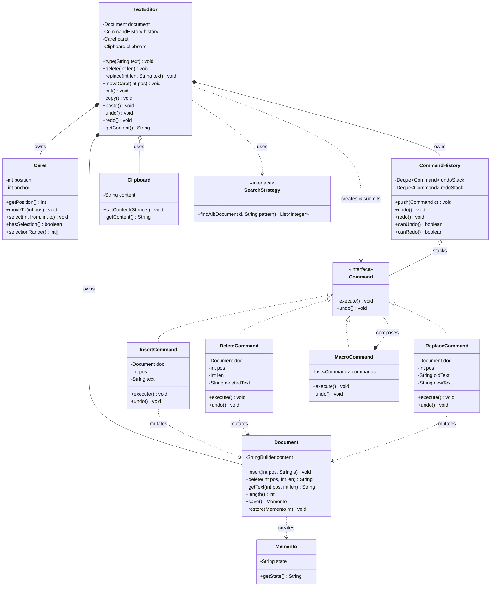

# Design a Text Editor (Undo/Redo)

This is the **canonical Command + Memento** problem in the LLD round. On the surface it is
"build an editor"; what the interviewer is actually grading is whether you can model *every
edit as a first-class object* so that undo, redo, and macros fall out of the design instead
of being bolted on with `if` statements. The star is the **Command** pattern: each mutation
(insert, delete, replace) becomes a command object that knows how to `execute()` itself and
`undo()` itself; an undo stack of executed commands plus a redo stack gives you unlimited
undo/redo almost for free.

The two recurring debates the interviewer wants to hear you reason about are (1) **Command
(delta) undo vs Memento (snapshot) undo** — a memory-vs-simplicity trade-off — and (2) how
to store the text efficiently (array-of-lines for interview scope; gap buffer / piece table /
rope in production — cross-ref `dsa-coding`). Keep the design single-machine, in-process OO;
collaborative editing is an HLD concern (cross-ref system-design).

## Requirements Clarification

Spend the first five minutes bounding the problem. Good clarifying questions:

- **Editing operations** — insert text, delete a range, replace a range? Cut/copy/paste?
  (Interview default: `insert`, `delete`, `replace`, plus cursor movement.)
- **Undo/redo depth** — unlimited, or a bounded history (e.g., last 100 edits)? Bounded is
  more realistic and lets you discuss trimming the stack.
- **Cursor / selection model** — single caret only, or a selection range (anchor + caret)?
  Multi-cursor? (Start with one caret + optional selection; multi-cursor is an extension.)
- **Undo granularity** — per keystroke, or coalesced into "typing runs" (typing a word =
  one undo)? Real editors coalesce; mention it as a refinement.
- **What resets redo?** — the standard rule: **any new edit clears the redo stack** (you
  can't redo into a branch you diverged from). Confirm this out loud.
- **Text storage** — do we need to handle multi-megabyte files efficiently? If pressed on
  performance, name gap buffer / piece table / rope and cross-ref `dsa-coding`; otherwise an
  array-of-lines or `StringBuilder` is fine for interview scope.
- **Find/replace, syntax highlighting** — usually follow-ups; design so they slot in
  (Strategy for search).
- **Persistence (save/load)** — mention file I/O as an adapter; not the core of the round.
- **Concurrency** — single-user, single-threaded first; discuss locking if a "background
  autosave" or "collaborative" follow-up arises.

Scoping statement to say out loud: *"I'll build a single-document, single-caret in-memory
text editor supporting insert/delete/replace with unlimited undo/redo. Each edit is a Command
with execute/undo; two stacks drive undo/redo; a new edit clears redo. I'll show where
find (Strategy), macros (Composite), and efficient buffers plug in."*

## Use-Cases and Actors

Grokking's UML-first approach: name the actor and the use-cases before drawing classes.

- **Actor: User (editor operator).** Types text, deletes/selects text, moves the caret,
  cuts/copies/pastes, triggers undo and redo, runs find/replace, saves.
- **Actor: (extension) Plugin / Macro** — a scripted sequence of edits (record + replay).
- **Actor: (extension) Autosave timer** — a background trigger, not a human.

Primary use-cases: *Insert text at caret*, *Delete selection/range*, *Replace range*,
*Move caret*, *Undo last edit*, *Redo undone edit*, *Cut / Copy / Paste*, *Find text*,
*Record & replay macro*. Undo/Redo and Cut-Paste are the interesting ones — they are why
Command exists here.

## Noun/Verb Object Identification

The core LLD technique: extract **candidate classes from the nouns** and **candidate methods
from the verbs** in the requirements, then *filter* — not every noun becomes a class.

Requirement prose: *"The **user** types **text** into a **document** at a **cursor**
position. The user can **delete** a **selection**, **replace** a **range**, **cut**/**copy**/
**paste** via a **clipboard**, and **undo**/**redo** their **edits**. Each **edit** is
recorded in an edit **history**."*

**Candidate nouns → filter:**

| Noun | Verdict | Why |
|---|---|---|
| User | ❌ actor, not a class | Lives outside the system boundary. |
| Text / character | ❌ primitive | Modeled as `String`/`char[]` inside the buffer, not its own class. |
| Document | ✅ `Document` / `TextBuffer` | Owns the mutable text; core entity. |
| Cursor / caret | ✅ `Caret` | Position (and selection) state; a real object with behavior. |
| Selection / range | ➕ `Selection` (or fields on Caret) | Anchor + caret; can start as two ints. |
| Edit | ✅ `Command` hierarchy | Each edit is a command object — the star abstraction. |
| Insert / delete / replace | ✅ `InsertCommand`, `DeleteCommand`, `ReplaceCommand` | The verbs become command subtypes. |
| History | ✅ `CommandHistory` | Owns undo + redo stacks. |
| Clipboard | ✅ `Clipboard` | Holds cut/copied text; shared sink/source. |
| Editor | ✅ `TextEditor` | Facade the user talks to; wires the pieces. |
| Snapshot / state | ✅ `Memento` | Captured document state for snapshot-style undo. |

**Candidate verbs → methods:** type/insert → `insert()`, delete → `delete()`, replace →
`replace()`, move → `moveCaret()`, undo → `undo()`, redo → `redo()`, cut/copy/paste →
`cut()/copy()/paste()`, save state → `createSnapshot()`, restore → `restore()`.

The filtering *is* the graded skill: "User" is an actor (out of scope), "text" is a
primitive (a field, not a class), but "edit" — easy to overlook as a mere verb — is
promoted to the most important abstraction in the design because undo/redo hang off it.

## Responsibilities and Relationships (CRC)

Give each class one reason to change (SRP). CRC = what it **Knows** / what it **Does** /
who it **Collaborates** with.

| Class | Knows | Does | Collaborators |
|---|---|---|---|
| `TextEditor` (facade) | current caret, references to document + history + clipboard | exposes user-level ops (`type`, `delete`, `undo`...), builds command objects, submits them to history | `Document`, `CommandHistory`, `Caret`, `Clipboard`, `Command` |
| `Document` / `TextBuffer` | the mutable text content | low-level mutations `insert(pos,str)`, `delete(pos,len)`, `getText(range)`, `length()` | (none — leaf) |
| `Caret` | position, selection anchor | move, select, collapse; expose selected range | `Document` (for bounds) |
| `Command` (interface) | — | `execute()`, `undo()` | `Document` |
| `InsertCommand` | pos, inserted text | execute = insert; undo = delete that text | `Document` |
| `DeleteCommand` | pos, deleted text (captured for undo) | execute = delete + remember text; undo = re-insert | `Document` |
| `ReplaceCommand` | pos, old text, new text | execute = swap in new; undo = swap back old | `Document` |
| `MacroCommand` | list of sub-commands | execute all in order; undo all in reverse | `Command` (composite) |
| `CommandHistory` | undo stack, redo stack | `push`/`undo`/`redo`; clears redo on new push | `Command` |
| `Clipboard` | last cut/copied text | `setContent`, `getContent` | — |
| `Memento` | an immutable text snapshot | expose state to the originator only | `Document` |
| `SearchStrategy` (interface) | — | `findAll(text, pattern)` | `Document` |

Key relationship calls (say the multiplicity + kind out loud):

- `TextEditor` **composes** exactly one `Document` and one `CommandHistory` (1:1, lifetime-bound
  → composition, `*--`). The document dies with the editor.
- `CommandHistory` **aggregates** `Command` objects on its stacks (1:many, `o--`) — the
  commands are held, not owned for life.
- Every concrete command **holds a reference to** `Document` (dependency / association) so it
  can apply itself; it does **not** own the document.
- `MacroCommand` **composes** child `Command`s (Composite: `*--` to the `Command` interface).
- `InsertCommand`/`DeleteCommand`/`ReplaceCommand`/`MacroCommand` **realize** `Command`
  (`..|>`).

Anti-pattern to name and avoid: a god `TextEditor` with a giant `undo()` that `switch`es on
an enum "last operation type" and manually reverses it. It re-couples the editor to every
edit type and reopens tested code for each new operation — exactly what Command exists to
prevent.

## Class Diagram



Interview-grade calibration: ~12 types. Fewer and you've hard-coded undo into the editor;
many more (per-glyph objects, undo-tree branch nodes, a plugin registry) and you're
gold-plating a 45-minute session.

## Key Design Decisions and Patterns

**1. Command — the star (Behavioral: encapsulates a request/algorithm as an object).**
Each edit becomes a `Command` with `execute()` and `undo()`. This is *the* decision the
problem is built around: it decouples the editor (the *invoker*) from the details of how each
edit is applied and reversed, turns "undo" into a uniform `stack.pop().undo()`, and makes
"add a new edit type" an open-closed extension. See `dp-command`.

**2. Memento — snapshot-based undo (Behavioral: capture/restore state without breaking
encapsulation).** The `Document` (originator) produces a `Memento` holding its state; the
`CommandHistory` (caretaker) stores mementos and hands them back to restore, but **cannot
read or mutate** the memento's internals. This is the *alternative* undo mechanism — see the
trade-off below. See `dp-memento`.

**3. Command (delta) vs Memento (snapshot) — the headline trade-off.**

| | Command / delta undo | Memento / snapshot undo |
|---|---|---|
| Stores | just the change (pos + inserted/deleted text) | the whole document state at a point in time |
| Memory | tiny per edit — O(edit size) | O(document size) per snapshot — expensive |
| Undo cost | reverse one delta — O(edit size) | swap in a whole snapshot — O(doc size) |
| Complexity | each command must know how to invert itself | trivial to capture; no inverse logic |
| Best when | edits are small and frequent (typing) | state is small, or inverse is hard to compute |

Interview answer: **use Command deltas for a text editor** (typing produces thousands of tiny
edits; snapshotting the whole buffer each keystroke is wasteful). Reach for Memento when an
operation's inverse is hard to express as a delta, or as a periodic checkpoint. Many real
editors combine them: deltas for normal undo, occasional snapshots to bound replay cost.

**4. Composite for macros (Structural: treat a group of commands as one command).**
`MacroCommand` *is-a* `Command` holding a list of `Command`s; `execute()` runs them forward,
`undo()` runs them in **reverse order**. Because it implements the same interface, the history
and editor treat a macro exactly like a single edit — that's the Composite payoff. See
`dp-composite`.

**5. Strategy for find/search (Behavioral: interchangeable algorithm).** `SearchStrategy`
lets plain-substring, regex, and case-insensitive search be swapped without touching the
editor. See `dp-strategy`.

**6. Iterator for buffer traversal (Behavioral).** Exposing a `CharIterator`/line iterator
lets clients (rendering, search) walk the buffer without knowing whether it's an array of
lines, a gap buffer, or a rope underneath. See `dp-iterator`.

**7. Two-stack undo/redo with redo-clear-on-new-edit.** `undo()` pops the undo stack, calls
`undo()` on that command, pushes it to the redo stack. `redo()` pops redo, calls `execute()`,
pushes back to undo. **Any brand-new edit clears the redo stack** — you cannot redo after
diverging. This rule is a frequent bug source; state it explicitly.

### Worked example: watch the two stacks (and the redo-clear rule fire)

Trace `type → type → undo → new edit → redo` on a real buffer. Stacks are written
**bottom … top** (top = most recent, the end `pop()` touches); `Ins(p,"s")` = an
`InsertCommand` with `pos=p`, `text="s"`.

| Step | Call | Action taken | `content` | `undoStack` | `redoStack` |
|---|---|---|---|---|---|
| 0 | — | start empty | `""` | `[]` | `[]` |
| 1 | `type("cat")` | `Ins(0,"cat").execute()`, then `push` | `"cat"` | `[Ins(0,"cat")]` | `[]` |
| 2 | `type(" dog")` | caret at 3; `Ins(3," dog").execute()`, `push` | `"cat dog"` | `[Ins(0,"cat"), Ins(3," dog")]` | `[]` |
| 3 | `undo()` | pop `Ins(3," dog")`; its `undo()` → `delete(3,4)`; push to redo | `"cat"` | `[Ins(0,"cat")]` | `[Ins(3," dog")]` |
| 4 | `type("!")` | `Ins(3,"!").execute()`, `push` → **`redoStack.clear()`** | `"cat!"` | `[Ins(0,"cat"), Ins(3,"!")]` | `[]` |
| 5 | `redo()` | `redoStack` empty → **no-op** | `"cat!"` | `[Ins(0,"cat"), Ins(3,"!")]` | `[]` |

The payoff is step 4→5: typing `"!"` after the undo pushed a new command and wiped the redo
stack, so the `" dog"` edit is gone forever — `redo()` in step 5 finds nothing to replay.
That is the divergence rule in action: you cannot redo into a branch you abandoned. Had you
called `redo()` *before* step 4 instead, it would have popped `Ins(3," dog")`, re-run
`execute()` → `"cat dog"`, and pushed it back onto the undo stack.

Command flow between the stacks:

```text
new edit ─push─►┌───────────┐   undo()   ┌───────────┐
                │ undoStack │ ─────────►  │ redoStack │
                │  (top)    │ ◄─────────  │  (top)    │
                └───────────┘   redo()    └───────────┘
                      ▲                          │
                      └──── any new push ────────┘  clears redoStack
```

**8. Caret as its own object.** Position + selection is real state with invariants (must stay
within `[0, length]`, selection has anchor+caret). Keeping it out of `Document` respects SRP:
the document owns *text*, the caret owns *position*.

## API and Method Signatures

```java
public interface Command {
    void execute();
    void undo();
}

public class TextEditor {
    void type(String text);          // insert at caret (replaces selection if any)
    void delete(int length);         // delete `length` chars from caret (or selection)
    void replace(int length, String replacement);
    void moveCaret(int position);
    void cut();                      // copy selection to clipboard + delete it
    void copy();                     // copy selection to clipboard
    void paste();                    // insert clipboard content at caret
    void undo();
    void redo();
    String getContent();
}

public class CommandHistory {
    void push(Command c);            // executes-then-records is done by caller; this records + clears redo
    void undo();
    void redo();
    boolean canUndo();
    boolean canRedo();
}
```

Contract subtleties to say out loud:

- A `DeleteCommand` must **capture the text it deletes at execute time** so `undo()` can
  re-insert it — the command is self-describing about how to reverse itself.
- `push()` clears the redo stack; `undo()`/`redo()` move a command *between* stacks, they
  don't discard it.
- `type()` on a non-empty selection is really a *replace* (delete selection, then insert) —
  best modeled as one `ReplaceCommand` (or a `MacroCommand` of delete+insert) so it undoes
  atomically.

## Code Skeleton

Enough structure to demonstrate the design — write this level in the interview, not a full
implementation.

```java
// The document is the "receiver" that commands mutate.
public class Document {
    private final StringBuilder content = new StringBuilder();

    public void insert(int pos, String s) { content.insert(pos, s); }

    public String delete(int pos, int len) {          // returns removed text (for undo)
        String removed = content.substring(pos, pos + len);
        content.delete(pos, pos + len);
        return removed;
    }

    public String getText(int pos, int len) { return content.substring(pos, pos + len); }
    public int length() { return content.length(); }
    public String getText() { return content.toString(); }

    public Memento save()             { return new Memento(content.toString()); }
    public void restore(Memento m)    { content.setLength(0); content.append(m.getState()); }
}

// Each edit is a Command that knows how to do and undo itself.
public class InsertCommand implements Command {
    private final Document doc; private final int pos; private final String text;
    public InsertCommand(Document doc, int pos, String text) {
        this.doc = doc; this.pos = pos; this.text = text;
    }
    public void execute() { doc.insert(pos, text); }
    public void undo()    { doc.delete(pos, text.length()); }   // inverse of insert
}

public class DeleteCommand implements Command {
    private final Document doc; private final int pos; private final int len;
    private String deletedText;                                  // captured at execute time
    public DeleteCommand(Document doc, int pos, int len) {
        this.doc = doc; this.pos = pos; this.len = len;
    }
    public void execute() { deletedText = doc.delete(pos, len); }
    public void undo()    { doc.insert(pos, deletedText); }      // re-insert what we removed
}

public class ReplaceCommand implements Command {                 // swap old range for new text
    private final Document doc; private final int pos; private final int len;
    private final String newText; private String oldText;        // oldText captured at execute time
    public ReplaceCommand(Document doc, int pos, int len, String newText) {
        this.doc = doc; this.pos = pos; this.len = len; this.newText = newText;
    }
    public void execute() { oldText = doc.delete(pos, len); doc.insert(pos, newText); }
    public void undo()    { doc.delete(pos, newText.length()); doc.insert(pos, oldText); }
}

public class MacroCommand implements Command {                   // Composite
    private final List<Command> commands;
    public MacroCommand(List<Command> commands) { this.commands = commands; }
    public void execute() { for (Command c : commands) c.execute(); }
    public void undo() {                                          // reverse order!
        for (int i = commands.size() - 1; i >= 0; i--) commands.get(i).undo();
    }
}

// Caretaker: two stacks drive undo/redo.
public class CommandHistory {
    private final Deque<Command> undoStack = new ArrayDeque<>();
    private final Deque<Command> redoStack = new ArrayDeque<>();

    public void push(Command c) { undoStack.push(c); redoStack.clear(); } // NEW edit clears redo

    public void undo() {
        if (undoStack.isEmpty()) return;
        Command c = undoStack.pop();
        c.undo();
        redoStack.push(c);
    }
    public void redo() {
        if (redoStack.isEmpty()) return;
        Command c = redoStack.pop();
        c.execute();
        undoStack.push(c);
    }
    public boolean canUndo() { return !undoStack.isEmpty(); }
    public boolean canRedo() { return !redoStack.isEmpty(); }
}

// The editor is the invoker: it builds a command, executes it, and records it.
public class TextEditor {
    private final Document document = new Document();
    private final CommandHistory history = new CommandHistory();
    private final Caret caret = new Caret();
    private final Clipboard clipboard = new Clipboard();

    public void type(String text) {
        Command c;
        if (caret.hasSelection()) {        // contract: typing over a selection replaces it
            int[] sel = caret.selectionRange();          // [from, to)
            c = new ReplaceCommand(document, sel[0], sel[1] - sel[0], text);
            c.execute();
            history.push(c);               // record for undo (clears redo)
            caret.moveTo(sel[0] + text.length());
        } else {
            c = new InsertCommand(document, caret.getPosition(), text);
            c.execute();                   // apply now
            history.push(c);               // record for undo (clears redo)
            caret.moveTo(caret.getPosition() + text.length());
        }
    }

    public void delete(int length) {
        Command c = new DeleteCommand(document, caret.getPosition(), length);
        c.execute();
        history.push(c);
    }

    public void paste() {
        String clip = clipboard.getContent();
        if (clip != null && !clip.isEmpty()) type(clip);   // reuse type() → InsertCommand
    }

    public void undo()  { history.undo(); }
    public void redo()  { history.redo(); }
    public String getContent() { return document.getText(); }
}
```

Note the division of labor: `TextEditor` (invoker) *creates and submits* commands; `Command`
subtypes *know how to apply and reverse* themselves; `Document` (receiver) *does the raw text
mutation*; `CommandHistory` (caretaker) *sequences* them. No class knows more than its job.

## Extensibility

The follow-ups an interviewer will throw, and the seam each lands on:

- **"Add a macro / record-and-replay."** → `MacroCommand` (Composite). Record the user's
  commands into a list, wrap in a `MacroCommand`; it undoes as one atomic unit. Zero changes
  to `CommandHistory` — it already speaks `Command`.
- **"Coalesce keystrokes so typing a word is one undo."** → have the editor merge consecutive
  `InsertCommand`s at adjacent positions within a time window (a `canMergeWith`/`mergeWith`
  method on the command, or an editor-side buffer) before pushing. Open-closed: merge logic
  lives on the command, not in a switch.
- **"Add a new edit type (e.g., ToUpperCase on selection, or indent)."** → new class
  implementing `Command`; nothing else changes. Open-Closed in action.
- **"Bound the undo history to N edits."** → cap the undo stack (drop the oldest when full).
  A bounded `Deque` or ring buffer; discuss that dropped edits become non-undoable.
- **"Add find & replace."** → `SearchStrategy` (plain / regex / case-insensitive) returns
  match positions; "replace all" becomes a `MacroCommand` of `ReplaceCommand`s so the whole
  replace-all undoes in one step.
- **"Snapshot-based undo for a huge non-invertible operation."** → Memento: capture the
  document state before the op; undo restores the snapshot. Combine deltas + periodic
  snapshots to bound memory/replay.
- **"Syntax highlighting."** → an Observer on document changes recomputes token styling;
  rendering is a separate concern from the buffer (cross-ref `dp-observer`).
- **"Collaborative / multi-user editing."** → recognize the boundary: operational
  transformation (OT) or CRDTs, conflict resolution, and network sync are **HLD** — point to
  the system-design collaborative-editing/real-time topics and keep the LLD answer at "each
  local edit is still a Command."

Meta-answer to every extension: *"which seam does this land on — Command, Composite, Strategy,
Memento, or Observer — so I add a class instead of editing one?"*

## Concurrency and Edge Cases

Start single-threaded (the natural model for one user typing), then upgrade if asked.

- **Autosave / background thread.** If a timer thread reads the document while the UI thread
  edits it, guard the document with a lock (or copy-on-read a snapshot). The command stacks
  must also be mutated under the same lock, or an undo can race with an in-flight edit.
- **Undo/redo atomicity.** A multi-part edit (replace = delete + insert) must be one
  `MacroCommand` so a mid-operation undo can't leave the document half-changed.
- **Empty stacks.** `undo()` with an empty undo stack and `redo()` with an empty redo stack
  must be safe no-ops, never exceptions.
- **Redo invalidation.** After any new edit, redo must be cleared — forgetting this lets a
  redo re-apply a command against a document that has since diverged, corrupting content.
- **Bounds validation.** Insert/delete positions and lengths must be validated against the
  current document length (a stale command replayed after the buffer shrank can throw). Caret
  must clamp to `[0, length]`.
- **DeleteCommand must capture text before deleting.** If `undo()` is written to reconstruct
  text some other way, it will be wrong; the captured `deletedText` is the source of truth.
- **Restore the caret on undo/redo, not just the text.** A classic senior probe: *"after I
  undo, where does the cursor go?"* The skeleton's commands mutate only the document, so
  `undo()` leaves the caret wherever it landed — wrong UX. Real editors restore the caret to
  its **pre-edit** position. Fix: each `Command` also captures caret/selection *before* and
  *after* execute, and `undo()` restores the *before* caret, `redo()` the *after*. Concrete:
  content `"cat"`, caret at 3; `type(" dog")` → content `"cat dog"`, caret 7, and the command
  remembers `caretBefore=3, caretAfter=7`. `undo()` → content `"cat"` **and** caret snaps back
  to 3 (not left at 7). Trade-off: store the caret *in* the command (simple, self-contained)
  vs. a parallel caret-history (decouples cursor policy from edits but adds a second stack to
  keep in sync). A `MacroCommand` restores the caret to the state before the *whole* macro,
  not before each sub-command.
- **`delete(length)` direction is ambiguous — pin it down.** Backspace deletes the `length`
  chars **before** the caret; the Delete key deletes `length` chars **after** it, and the two
  pass a *different* `pos` to `DeleteCommand`. Concrete on `"cat dog"` with caret at 4 (just
  before `d`): forward-delete of 3 → `DeleteCommand(pos=4, len=3)` removes `"dog"` → `"cat "`,
  caret stays 4. Backspace of 3 → `pos = caret - length = 1`, `DeleteCommand(pos=1, len=3)`
  removes `"at "` → `"cdog"`, then caret moves back to 1. The `pos` must be computed for the
  direction so `undo()` re-inserts at the right spot — get it wrong and undo restores the text
  in the wrong place.
- **Memory growth.** An unbounded undo stack grows with edit count; bound it or periodically
  compact with snapshots.
- **Large files.** `StringBuilder`/array-of-lines makes a mid-document insert O(n) (shifting).
  Name gap buffer / piece table / rope for O(log n) or amortized-O(1) edits and cross-ref
  `dsa-coding` — but don't implement a rope in a 45-minute round unless asked.

## SOLID in This Design

- **S — Single Responsibility.** Text storage (`Document`), reversible edit logic (`Command`
  subtypes), history sequencing (`CommandHistory`), position (`Caret`), and paste buffer
  (`Clipboard`) are five separate reasons to change, in five classes. The god-editor collapses
  them into one.
- **O — Open-Closed.** A new edit type or search algorithm is a new class implementing an
  existing interface; the editor and history never reopen.
- **L — Liskov Substitution.** Every `Command` must honor the contract: `undo()` after
  `execute()` restores the exact prior document state; `MacroCommand` is substitutable for a
  single command everywhere the history uses one.
- **I — Interface Segregation.** `Command` exposes only `execute`/`undo`; the caret's
  selection API and the document's mutation API are separate, so a client that only needs to
  read text isn't forced to depend on mutation methods.
- **D — Dependency Inversion.** `CommandHistory` and `TextEditor` depend on the `Command`
  *abstraction*, never on `InsertCommand`/`DeleteCommand` concretely; commands depend on the
  `Document` they receive (injected), not a global.

## Common Interview Follow-ups

1. **"Which pattern makes undo/redo clean, and why?"** — Command: each edit is an object with
   `execute`/`undo`; the undo stack pops and calls `undo()`, redo re-executes. Uniform,
   open-closed, no switch on operation type.
2. **"Command deltas or Memento snapshots for undo?"** — Deltas for a text editor (tiny
   memory per keystroke); Memento when the inverse is hard or as periodic checkpoints;
   real editors combine them.
3. **"What clears the redo stack?"** — Any new edit. Explain the divergence rule and why
   forgetting it corrupts redo.
4. **"How do macros / replace-all undo as one step?"** — Composite `MacroCommand`; `execute`
   forward, `undo` in reverse order; the history treats it as one command.
5. **"Add find & replace without touching the editor."** — Strategy `SearchStrategy`;
   replace-all = `MacroCommand` of `ReplaceCommand`s.
6. **"Coalesce typing into word-level undo."** — Merge adjacent insert commands within a time
   window via `mergeWith` before pushing.
7. **"How do you store text efficiently for large files?"** — Array-of-lines / `StringBuilder`
   for interview; gap buffer / piece table / rope in production — cross-ref `dsa-coding`.
8. **"Make it collaborative / multi-user."** — Recognize the HLD boundary: OT/CRDTs, sync,
   conflict resolution → point to system-design; keep local edits as Commands.
9. **"Why is Caret its own class, not fields on Document?"** — SRP: document owns text, caret
   owns position/selection with its own invariants.
10. **"How do you unit-test this?"** — Commands test in isolation (apply, assert content, undo,
    assert restored); history tests with scripted fake commands — a payoff of the split design.

## References

- Gang of Four, *Design Patterns* — Command (the undo/redo motivating example is literally a
  text editor), Memento, Composite, Strategy, Iterator chapters.
- *Head First Design Patterns* (Freeman & Robson) — Command chapter (remote control / undo).
- Effective Java, 3rd ed. (Bloch) — Item 18 "favor composition over inheritance" (Composite),
  Item 64 "refer to objects by their interfaces."
- "Data Structures for Text Sequences" (Charles Crowley) — gap buffer / piece table / rope
  trade-offs for editor buffers.
- VS Code / Xi editor engineering blogs — piece table and rope in production editors.
- Related topics in this library: `dp-command`, `dp-memento`, `dp-composite`, `dp-strategy`,
  `dp-iterator` (pattern mechanics); `oop-principles-pillars`, `solid-principles`,
  `lld-interview-method`, `ooad-requirements-to-classes` (method); `dsa-coding` (buffer
  internals); system-design collaborative/real-time editing topics (distributed scale).
