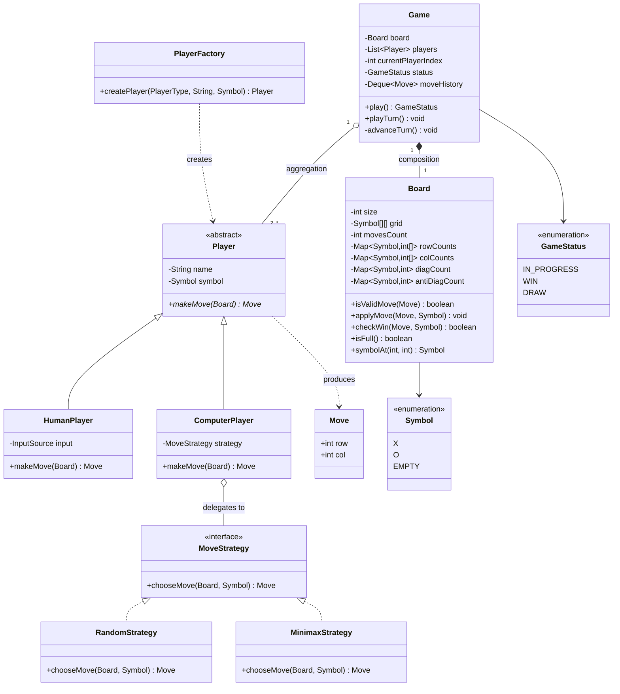

# Design a Tic-Tac-Toe Game

Tic-Tac-Toe is the "hello world" of LLD interviews — deceptively simple, but it exposes
whether you can identify objects cleanly, use polymorphism instead of `if (playerType == ...)`
branches, and spot the one genuinely clever insight in the problem: the **O(1) win check**.
Interviewers use it as a warm-up at many companies and as a full 45-minute problem for
junior/mid-level rounds. The bar is not algorithmic wizardry; the bar is **clean, extensible
object-oriented code written quickly**.

> [!KEY-TAKEAWAY]
> Two things separate a strong answer from a mediocre one: (1) `Game` interacts with a
> `Player` abstraction and never knows whether the move came from a human or an AI, and
> (2) the win check uses per-player row/column/diagonal counters for O(1) per move instead
> of rescanning the board in O(n).

## Requirements Clarification

Spend the first 3–5 minutes scoping. Good questions to ask, and reasonable defaults:

- **Board size?** Classic 3×3, but design for **N×N** from the start — it costs nothing
  and pre-empts the most common follow-up. Win condition: N in a row (row, column, or diagonal).
- **Number of players?** Two for classic, but keep a `List<Player>` so 3+ players on a
  larger board works without redesign.
- **Human vs. computer?** Support both. This is the hook for the Strategy pattern —
  a `ComputerPlayer` with pluggable move-selection AI.
- **Interface?** Console/API-driven single machine. Rendering is out of scope or a thin
  `render()` method — don't burn time on UI.
- **Invalid moves?** Occupied cell or out-of-bounds coordinates → reject and re-prompt
  (or throw), the same player retries. Decide and state your choice.
- **Game end?** Win (N in a row) or draw (board full, no winner). No timers, no scoring
  across games (scope out — or mention a `Scoreboard` as an extension).
- **Undo / replay / persistence?** Scope out initially, but mention that storing a move
  history enables undo via the Command pattern (see Extensibility).

Explicitly **out of scope**: networked multiplayer (that's a transport concern layered on
top), GUI frameworks, and matchmaking. Say so out loud — scoping is graded.

> [!INTERVIEW]
> Saying "I'll design for N×N and K players now because it's the same amount of code"
> signals seniority. Hard-coding 3 and two players, then refactoring live when asked,
> costs you 10 minutes and looks reactive.

## Core Objects and Entities

Identify the nouns and give each a single responsibility:

| Entity | Responsibility |
|---|---|
| `Game` | Orchestrator: owns the board and players, enforces turn order, runs the game loop, holds `GameStatus` |
| `Board` | Grid of `Cell`s; validates and applies moves; performs the O(1) win check via counters; knows nothing about turns or players' types |
| `Cell` | One square; holds its `Symbol` state (EMPTY, X, O) — can be as thin as an enum in a 2-D array |
| `Player` (abstract) | Name + `Symbol`; declares `makeMove(Board): Move` |
| `HumanPlayer` | Reads a move from input (console, API call) |
| `ComputerPlayer` | Delegates move selection to a pluggable `MoveStrategy` |
| `MoveStrategy` (interface) | `chooseMove(Board, Symbol): Move` — Random, Minimax, AlphaBeta implementations |
| `Move` | Value object: row, column (and the symbol/player making it) |
| `Symbol` | Enum: `X`, `O` (extensible to more marks for 3+ players); `EMPTY` either lives here or as a nullable cell |
| `GameStatus` | Enum: `IN_PROGRESS`, `WIN`, `DRAW` |
| `PlayerFactory` (optional) | Creates human/computer players from config so `Game` setup doesn't `new` concrete types |

Key relationship calls:

- `Game` **composes** a `Board` (the board's lifecycle is the game's lifecycle — composition).
- `Game` **aggregates** `Player`s (players could conceptually exist across games — aggregation;
  in practice either answer is defensible if you justify it).
- `ComputerPlayer` **has-a** `MoveStrategy` (composition over inheritance: don't create
  `RandomComputerPlayer`, `MinimaxComputerPlayer` subclasses).
- `Board` does **not** reference `Player` — it deals only in `Symbol` and coordinates.
  This keeps the dependency direction one-way and the board reusable.

## Class Diagram



Interview-grade, not enterprise overkill: ~8 classes, two enums, one interface. If your
diagram has `GameManagerFactoryBuilder`, you've over-engineered a toy problem.

## Key Design Decisions

**1. Polymorphic `Player` — the core OO test.**
`Game.playTurn()` calls `currentPlayer.makeMove(board)` and does not care whether input
comes from a console read or a minimax search. This is Liskov substitution and dependency
inversion in one move: `Game` depends on the `Player` abstraction, not concretions. The
anti-pattern interviewers watch for is `if (player.isComputer()) { ... } else { ... }`
inside the game loop — that violates Open/Closed (adding a `RemotePlayer` would mean
editing `Game`).

**2. Strategy pattern for computer AI.**
`ComputerPlayer` holds a `MoveStrategy` (see the Strategy write-up in design-patterns for
the general form). Why not subclasses like `MinimaxComputerPlayer`? Because difficulty is
a *behavior axis independent of player identity* — composition lets you swap difficulty at
runtime ("make it easier after I lose twice") and avoids a subclass explosion when a second
axis appears. Why not an `if/else` on a difficulty enum inside `ComputerPlayer`? That works
for two branches but every new AI edits tested code; Strategy makes new AIs additive.

**3. O(1) win check with counters — the key insight.**
The naive win check scans the winning lines through the last move: O(N) per move (or O(N²)
if you rescan the whole board). The elegant trick: maintain, **per player**, an array of
N row counters, N column counters, one diagonal counter, and one anti-diagonal counter.
On each move at `(r, c)`:

- `rowCounts[player][r]++`, `colCounts[player][c]++`
- if `r == c`: `diagCount[player]++`
- if `r + c == N - 1`: `antiDiagCount[player]++`
- Win iff any incremented counter reaches `N`.

That's O(1) time per move for O(N) extra space per player. It works because a player wins
only on a line that passes through the move they just made — you never need to look at
other lines. This is the same idea as LeetCode 348 (*Design Tic-Tac-Toe*).

> [!TIP]
> Mention the naive O(N) check first, then improve it. Interviewers reward the
> narrated progression ("scan works, but each move only affects 4 lines, so counters
> give O(1)") more than jumping straight to the trick.

**4. `Board` owns move validation and win detection, `Game` owns turn order.**
Single Responsibility: the board is the physics of the grid; the game is the referee.
If win logic lived in `Game`, you couldn't reuse `Board` for a Connect-K variant, and
`Game` would bloat. If turn order lived in `Board`, the board couldn't be used for
analysis/AI simulation.

**5. Factory for player creation (lightweight).**
A `PlayerFactory.createPlayer(type, name, symbol)` keeps `new HumanPlayer(...)` /
`new ComputerPlayer(new MinimaxStrategy())` wiring out of `Game`. In an interview a simple
static factory method is enough — don't build an abstract factory hierarchy for two types.

**6. `Move` as an immutable value object.**
Row/col pairs passed as two `int`s invite transposition bugs; a small immutable `Move`
(Java `record`) is self-documenting and hashable for history/undo.

## API and Method Signatures

The surface an interviewer expects you to write down:

```java
// Game orchestration
public GameStatus play();                 // loop until WIN or DRAW, return outcome
public void playTurn();                   // one turn: ask player, validate, apply, check end
public Player getCurrentPlayer();
public GameStatus getStatus();

// Board
public boolean isValidMove(Move m);       // in bounds AND cell empty
public void applyMove(Move m, Symbol s);  // throws/false on invalid
public boolean checkWin(Move last, Symbol s);  // O(1) counter check
public boolean isFull();                  // movesCount == size * size
public Symbol symbolAt(int row, int col);

// Player hierarchy
public abstract Move makeMove(Board board);        // Player
public Move chooseMove(Board board, Symbol s);     // MoveStrategy
```

Design notes worth saying out loud:

- `checkWin` takes the **last move** — that's what makes O(1) possible; a signature like
  `checkWin()` with no arguments implies a full-board scan.
- `makeMove` receives the `Board` (read access) so an AI can evaluate positions; give it
  a read-only view or an interface (`BoardView`) if you want to be strict about the AI
  not mutating state.
- Return `GameStatus` from `play()` rather than printing inside — keeps the engine
  testable and UI-agnostic.

## Code Skeleton

Java, trimmed to structure (the shape matters more than completeness):

```java
enum Symbol { X, O, EMPTY }
enum GameStatus { IN_PROGRESS, WIN, DRAW }

record Move(int row, int col) { }

class Board {
    private final int size;
    private final Symbol[][] grid;
    private int movesCount = 0;
    // O(1) win-check counters, keyed by symbol
    private final Map<Symbol, int[]> rowCounts = new EnumMap<>(Symbol.class);
    private final Map<Symbol, int[]> colCounts = new EnumMap<>(Symbol.class);
    private final Map<Symbol, Integer> diag = new EnumMap<>(Symbol.class);
    private final Map<Symbol, Integer> antiDiag = new EnumMap<>(Symbol.class);

    Board(int size) {
        this.size = size;
        this.grid = new Symbol[size][size];
        for (Symbol[] row : grid) Arrays.fill(row, Symbol.EMPTY);
    }

    boolean isValidMove(Move m) {
        return m.row() >= 0 && m.row() < size && m.col() >= 0 && m.col() < size
            && grid[m.row()][m.col()] == Symbol.EMPTY;
    }

    void applyMove(Move m, Symbol s) {
        if (!isValidMove(m)) throw new IllegalArgumentException("Invalid move: " + m);
        grid[m.row()][m.col()] = s;
        movesCount++;
        rowCounts.computeIfAbsent(s, k -> new int[size])[m.row()]++;
        colCounts.computeIfAbsent(s, k -> new int[size])[m.col()]++;
        if (m.row() == m.col()) diag.merge(s, 1, Integer::sum);
        if (m.row() + m.col() == size - 1) antiDiag.merge(s, 1, Integer::sum);
    }

    boolean checkWin(Move m, Symbol s) {   // O(1): only lines through the last move
        return rowCounts.get(s)[m.row()] == size
            || colCounts.get(s)[m.col()] == size
            || diag.getOrDefault(s, 0) == size
            || antiDiag.getOrDefault(s, 0) == size;
    }

    boolean isFull() { return movesCount == size * size; }
}

abstract class Player {
    protected final String name;
    protected final Symbol symbol;
    Player(String name, Symbol symbol) { this.name = name; this.symbol = symbol; }
    abstract Move makeMove(Board board);
    Symbol symbol() { return symbol; }
}

class HumanPlayer extends Player {
    private final Scanner in;   // or any InputSource abstraction
    HumanPlayer(String name, Symbol s, Scanner in) { super(name, s); this.in = in; }
    @Override Move makeMove(Board board) {
        return new Move(in.nextInt(), in.nextInt());   // re-prompt loop omitted
    }
}

interface MoveStrategy { Move chooseMove(Board board, Symbol self); }

class RandomStrategy implements MoveStrategy {
    public Move chooseMove(Board board, Symbol self) { /* pick a random empty cell */ return null; }
}

class MinimaxStrategy implements MoveStrategy {
    public Move chooseMove(Board board, Symbol self) { /* game-tree search */ return null; }
}

class ComputerPlayer extends Player {
    private final MoveStrategy strategy;   // Strategy pattern: pluggable AI
    ComputerPlayer(String name, Symbol s, MoveStrategy strategy) {
        super(name, s); this.strategy = strategy;
    }
    @Override Move makeMove(Board board) { return strategy.chooseMove(board, symbol); }
}

class Game {
    private final Board board;
    private final List<Player> players;
    private int current = 0;
    private GameStatus status = GameStatus.IN_PROGRESS;
    private final Deque<Move> history = new ArrayDeque<>();   // enables undo later

    Game(int size, List<Player> players) {
        this.board = new Board(size);
        this.players = List.copyOf(players);
    }

    GameStatus play() {
        while (status == GameStatus.IN_PROGRESS) playTurn();
        return status;
    }

    void playTurn() {
        if (status != GameStatus.IN_PROGRESS) return;  // guard: no moves after game over
        Player p = players.get(current);
        Move m = p.makeMove(board);            // polymorphic: human OR ai, Game can't tell
        if (!board.isValidMove(m)) return;     // same player retries next loop iteration
        board.applyMove(m, p.symbol());
        history.push(m);
        if (board.checkWin(m, p.symbol()))      status = GameStatus.WIN;
        else if (board.isFull())                status = GameStatus.DRAW;
        else current = (current + 1) % players.size();
    }
}
```

Check the draw condition **after** the win check: the final move onto a full board can
still be a winning move.

## Extensibility

The follow-ups an interviewer will throw at you, and why this design absorbs them:

- **N×N board / K players.** Already parameterized: `Board(size)` and `List<Player>`.
  Add symbols beyond X/O (enum values or a `char` mark). The counter win check is
  size-agnostic. Zero structural change — that's the payoff of not hard-coding 3.
- **Connect-K on N×N (win = K in a row, K < N).** This *breaks* the simple counters —
  full-line counts can't detect K consecutive marks mid-line. Say so honestly: fall back
  to an O(K) check that walks up to K−1 cells in each of the 4 directions through the last
  move. Encapsulate it behind a `WinChecker` interface (`CounterWinChecker` for K == N,
  `DirectionalScanWinChecker` for K < N) so `Board` stays closed for modification —
  Strategy applied a second time.
- **Undo a move (Command pattern preview).** `Game` already keeps a `Deque<Move>` history.
  Full undo means reifying each move as a command object with `execute()`/`undo()` that
  also decrements the win counters and restores the turn pointer — the Command pattern
  (covered in design-patterns). Mentioning "history is the seed of undo/replay" earns
  points even if you don't implement it.
- **New AI difficulty (e.g., alpha-beta pruning).** Add an `AlphaBetaStrategy` class
  implementing `MoveStrategy`. No existing class changes — Open/Closed via Strategy.
- **Networked multiplayer.** Add a `RemotePlayer extends Player` whose `makeMove` blocks
  on a socket/API response. `Game` is untouched — the whole point of the abstraction.
  Matchmaking, sessions, and latency are HLD concerns; keep the engine single-machine and
  point to system-design for the server architecture.
- **Spectators / move notifications.** Have `Game` publish `MoveApplied` / `GameEnded`
  events to registered listeners — the Observer pattern. UI, logging, and remote spectators
  subscribe without `Game` knowing about them.
- **Score tracking across games.** A separate `Scoreboard`/`GameSeries` class that consumes
  game results — do not bolt win counts onto `Player` (SRP: a player identity isn't a stats
  ledger).

## Concurrency and Edge Cases

A local turn-based game is naturally **sequential** — say that first, then handle the cases:

- **Turn enforcement is the real "race".** In a single-threaded loop, alternation is
  structural. The moment players are remote (two HTTP requests), you must reject
  out-of-turn moves: validate `move.playerId == currentPlayer` inside a synchronized
  `playTurn` (or make the whole game actor-like: one thread/queue per game, moves processed
  in arrival order). Optimistic version: send the expected turn number with the move and
  reject on mismatch.
- **Double-submit of the same move.** Cell-occupied validation catches it; idempotency
  keys matter only in the networked variant.
- **Invalid input.** Out-of-bounds or occupied cell → reject, same player retries. Decide
  whether `applyMove` throws (programmer contract) or `playTurn` pre-validates (user error
  path); doing validation twice, as the skeleton does, is a fine belt-and-braces answer.
- **Move after game over.** `playTurn` must check `status == IN_PROGRESS`; otherwise a
  stray input mutates a finished board.
- **Win on the last cell.** Check win before draw — a board-filling move can be a winner.
- **AI given an unwinnable/full board.** `MoveStrategy` must handle "no empty cells"
  (shouldn't be reachable if `Game` checks `isFull`, but a defensive `Optional<Move>` or
  exception is worth a sentence).
- **Counter integrity under undo.** If you add undo, every counter increment needs a
  matching decrement — the most common bug in extended versions. Keeping all counter
  mutation inside `Board.applyMove`/`Board.undoMove` (never in `Game`) contains it.

> [!WARNING]
> Don't volunteer locks for the single-machine console version — sprinkling
> `synchronized` on a sequential game loop signals you're pattern-matching, not reasoning.
> Bring up concurrency exactly when the design goes multi-client.

## Common Interview Follow-ups

- "Make it N×N with M players" — should be a config change, not a refactor (see Extensibility).
- "Now the win condition is K in a row, K < N" — swap the `WinChecker` strategy; explain why plain counters stop working.
- "Add an unbeatable computer player" — new `MinimaxStrategy` (with alpha-beta for N > 3); no changes to `ComputerPlayer` or `Game`.
- "Support undo" — Command pattern over the move history; discuss counter rollback.
- "Two players over a network" — `RemotePlayer` + out-of-turn rejection; server-side game instance per match; scaling beyond that is HLD.
- "How would you test this?" — engine is UI-free and deterministic: unit-test `Board` (valid/invalid moves, all win directions, draw), inject a scripted `MoveStrategy`/fake input for `Game` loop tests.
- "Where exactly is each SOLID principle in your design?" — SRP: Board vs. Game split; OCP: new strategies/players are additive; LSP: any `Player` works in the loop; ISP: slim `MoveStrategy`; DIP: `Game` and `ComputerPlayer` depend on abstractions.
- "Why not just a 2-D char array and one big function?" — works for a script, fails every extension above; the interview is testing whether you can draw the object boundaries.

## References

- LeetCode 348 — *Design Tic-Tac-Toe* (the O(1) counter win check): https://leetcode.com/problems/design-tic-tac-toe/
- *Head First Design Patterns* (Freeman & Robson) — Strategy pattern, composition over inheritance.
- Grokking the Object-Oriented Design Interview — Tic-Tac-Toe / game-design chapters.
- Refactoring Guru — Strategy, Command, Observer pattern references: https://refactoring.guru/design-patterns
- Related topics in this library: design-patterns (dp-strategy, dp-command, dp-observer, dp-factory), design-chess-game (the "scaled-up" sibling problem), design-snake-ladder (turn-loop design).
