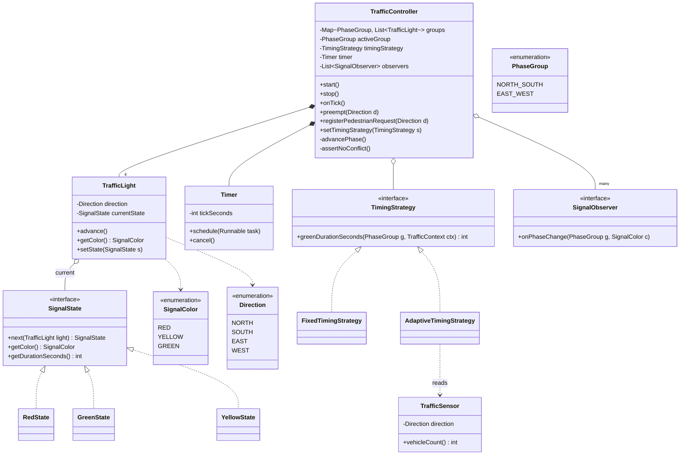
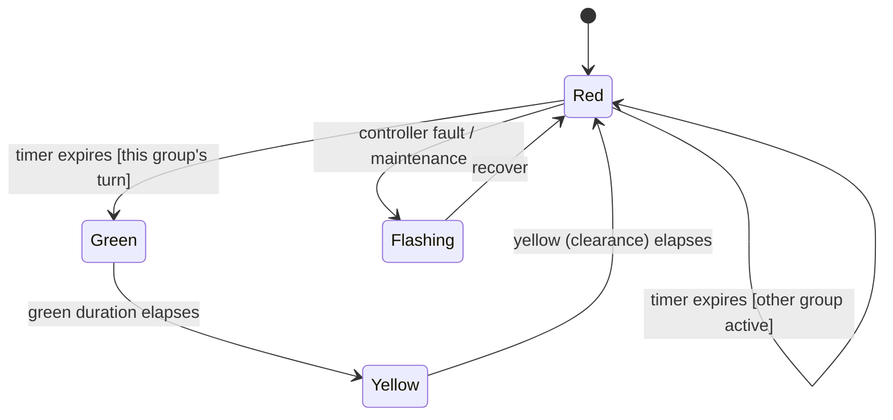

# Design a Traffic Signal Controller

The traffic signal controller is a compact, high-signal **State-pattern** problem — smaller
than the parking lot or elevator, but rich enough to test whether you can model a finite state
machine cleanly, coordinate mutually-exclusive resources (perpendicular directions), and leave
seams for the follow-ups interviewers love: adaptive timing, emergency preemption, pedestrian
crossings, and synchronized "green waves." The trap is to smear the light lifecycle across a
pile of `if (color == RED && elapsed > redDuration)` conditionals; the win is a light whose
each phase *is* an object that knows its own duration and its own successor.

Budget for a 45–60 min session: ~5 min requirements, ~10 min entities + state diagram,
~20 min classes and code, ~10 min coordination/timing and edge cases, rest for follow-ups.
Two ground rules to state out loud up front:

1. **The light is a finite state machine** — `RED → GREEN → YELLOW → RED` — name the states
   and their durations before writing any class.
2. **Safety is an invariant, not a feature.** Perpendicular directions must be **mutually
   exclusive** on green. The design has to make a conflicting-green state *unrepresentable* or
   at least structurally guarded — this is the property an interviewer is really probing.

## Requirements Clarification

Never start drawing classes before scoping. Good clarifying questions:

- **Scope of one controller**: A single intersection, or a corridor of many? (Baseline: one
  four-way intersection — N, S, E, W — with a single controller; design so a `CorridorController`
  coordinating several can be added later.)
- **Approaches / directions**: Four approaches (N/S/E/W)? Do opposite directions (N and S)
  always share a phase, so it's really two *phase groups* (N-S vs E-W)? (Yes — model phase
  groups, not four independent lights, so mutual exclusion falls out naturally.)
- **Light phases**: RED, YELLOW, GREEN only, or also flashing-red/flashing-yellow and a red
  clearance ("all-red") interval? (Baseline three colors; treat an **all-red clearance**
  between phase swaps as a first-class safety state — say why.)
- **Timing**: Fixed-time cycles, or adaptive to traffic density from sensors? (Start fixed;
  make timing a **Strategy** so adaptive/sensor-based plans drop in without touching the FSM.)
- **Pedestrians**: Are there pedestrian WALK/DON'T-WALK signals and crossing buttons?
  (In scope as an extension — a pedestrian phase overlaps the perpendicular red.)
- **Emergency vehicles**: Must the controller preempt to force a direction green
  (ambulance/fire)? (Yes — a preemption override; classic follow-up.)
- **Failure mode**: What happens on controller fault or power blip? (Fall back to
  **flashing-red all-way stop** — a safe degraded mode. Name it.)
- **Concurrency**: Who advances the clock — an internal timer thread, or an injected clock?
  (Timer-driven transitions; inject the clock/scheduler so it's testable.)

Explicitly **scope out**: computer-vision vehicle detection, city-wide traffic optimization
ML, the physical relay/hardware protocol, and multi-intersection network routing at scale.
Those are HLD / systems / ML concerns — say so and move on (the corridor coordination *seam*
stays in scope; the *distributed* version points to the system-design domain).

## Use-Cases and Actors

Sketch the actors before classes (the Grokking UML-first habit):

- **Motorist / the road itself** — the implicit "user"; observes a light and obeys it. Not a
  software actor, but the reason the invariants exist.
- **Timer / Clock** — the primary *driver*: fires ticks that advance the FSM. In most designs
  this is the real actor pushing the system forward, not a human.
- **Traffic sensor** (extension) — reports vehicle density per approach; feeds the adaptive
  timing strategy.
- **Pedestrian** (extension) — presses a crossing button, requesting a WALK phase.
- **Emergency vehicle system** (extension) — requests preemption for a direction.
- **Traffic operator / maintenance** — configures timing plans, forces flashing-red
  maintenance mode, reads status.

Primary use cases: *run the normal cycle*, *advance on timer tick*, *register a
pedestrian request*, *preempt for emergency*, *enter/exit maintenance (flashing) mode*,
*reconfigure timing plan*.

## Noun/Verb Object Identification

Pull candidate classes from the **nouns** and candidate methods from the **verbs** in the
requirements, then **filter** — not every noun earns a class.

Nouns surfaced: *traffic signal, controller, intersection, direction (N/S/E/W), light, signal
state (red/yellow/green), color, duration, timer, clock, cycle, phase, phase group, sensor,
pedestrian, button, emergency vehicle, timing plan, corridor, operator, display.*

Verbs surfaced: *change (color), transition, start, stop, advance/tick, cycle, set duration,
coordinate, preempt, request (walk), sense (density), configure, display.*

Filter to real classes (and justify the cuts):

| Candidate noun | Verdict | Reasoning |
|---|---|---|
| `TrafficLight` | **Class** | One physical light head per direction; holds its current state + duration |
| `TrafficController` (`TrafficSignalSystem`) | **Class** | The **context/coordinator** for one intersection; owns phase sequencing and safety |
| `SignalState` (interface) + `RedState`/`YellowState`/`GreenState` | **Classes** | The FSM — each state knows its duration and its successor (State pattern) |
| `Direction` | **Enum** | N/S/E/W is a fixed closed set of values, not behavior → enum, not a hierarchy |
| `SignalColor` | **Enum** | RED/YELLOW/GREEN — a value the state exposes for display; distinct from the *state object* |
| `PhaseGroup` | **Class/Enum** | Directions that go green together (N-S, E-W); the unit of mutual exclusion |
| `Timer`/`Clock` (`Scheduler`) | **Class (injected)** | Drives ticks; inject it so tests control time |
| `TimingStrategy` (interface) | **Class** | Fixed vs adaptive plan (Strategy pattern) — a seam, not baked in |
| `TrafficSensor` | **Class** (extension) | Feeds density to adaptive strategy |
| `PedestrianSignal` / `PedestrianRequest` | **Class** (extension) | WALK/DON'T-WALK + button request |
| *color, duration, cycle, phase, red, green, yellow* | **NOT classes** | color/duration are *fields/enum values*; "cycle/phase" is a *process*, not an object |
| *motorist, road, operator* | **NOT classes** | External actors — outside the software boundary |
| *display* | **Observer, not owned data** | A `Display` *observes* the controller; don't tangle rendering into the FSM |

The most important filtering call: **`SignalColor` (the enum value) is not the same thing as
`SignalState` (the state object).** The color is what a driver sees; the state object is
behavior — how long to stay and where to go next. Conflating them is the classic beginner slip.

## Responsibilities and Relationships

Assign each class one responsibility, CRC-style (what it **knows** / what it **does** / who it
**collaborates** with):

| Class | Knows | Does | Collaborators |
|---|---|---|---|
| `TrafficController` | phase groups, current active group, timing strategy, the timer | sequences phases, enforces mutual exclusion + all-red clearance, handles tick, applies preemption | `TrafficLight`, `TimingStrategy`, `Timer`, observers |
| `TrafficLight` | its current `SignalState`, its direction/phase group | delegates "advance" to its state; exposes current `SignalColor` | `SignalState` |
| `SignalState` | its color, its duration, its successor | returns next state and how long to hold; realized by Red/Green/Yellow | `TrafficLight` (as context) |
| `TimingStrategy` | how to compute each phase's green duration | `greenDurationFor(group, context)` | `TrafficSensor` (adaptive only) |
| `Timer`/`Scheduler` | tick interval / current time | fires `onTick` to the controller | `TrafficController` |
| `Direction` / `SignalColor` | fixed value sets | — | — |

Relationship calls to narrate:

- `TrafficController` **composes** its `TrafficLight`s and its `Timer` — they don't exist
  outside the intersection (composition, filled diamond).
- `TrafficController` **holds a reference to** a `TimingStrategy` (aggregation-like: the same
  strategy object could be shared/swapped) and to its observers.
- `TrafficLight` **holds a reference to** its current `SignalState`; the concrete state
  instances are stateless flyweights shared across lights (aggregation, not composition).
- **Mutual exclusion lives in the controller, never in the lights.** A single `TrafficLight`
  cannot know about its perpendicular sibling without creating a cyclic, unsafe dependency;
  centralizing "only one group is green at a time" in the controller keeps the invariant in
  exactly one place. This is the single most important relationship decision in the problem.
- **Multiplicity**: one `TrafficController` — `4` `TrafficLight`s (or `2` `PhaseGroup`s of
  2 lights each) — each light `1` current `SignalState` drawn from a shared pool of `3`.

## Class Diagram



## State Machine

Draw the light lifecycle before writing code — it is the spec the state classes implement:



Rules encoded here:

- The per-light cycle is strictly `RED → GREEN → YELLOW → RED`. **A light never jumps
  RED → GREEN for a group whose turn it is not** — the controller gates the RED→GREEN edge on
  "this group is the active group," which is where mutual exclusion is enforced.
- `YELLOW` is the **clearance** phase: it exists so vehicles already in the intersection can
  clear before the perpendicular group turns green. Skipping yellow (RED↔GREEN directly) is an
  instant safety red flag.
- Between one group's YELLOW ending and the next group's GREEN starting, a good design inserts
  a brief **all-red clearance** (both groups red). You can model it as a short RED hold in the
  controller rather than a separate state class — say which.
- `Flashing` (all-way flashing red) is the safe degraded mode on fault/maintenance.

Each transition maps to a `light.setState(nextState)` call the controller orchestrates on tick.

## Key Design Decisions

**State pattern — the star.** Each color is a phase with its own duration and its own
successor. Modeling `RedState`, `GreenState`, `YellowState` as objects means "how long do I
stay, and what comes next?" is answered by the state itself — no `switch (color)` ladder that
every new phase (e.g., a flashing state) would force you to edit. This is Open/Closed in
action: adding a `LeftTurnArrowState` is a new class, not a surgery across conditionals.
Reference: `dp-behavioral-state` owns the pattern mechanics — here we apply it. Because states
hold no per-light mutable data, make them **shared flyweights/singletons** (or a Java `enum`
implementing `SignalState`).

**Strategy pattern — timing plans.** `TimingStrategy` isolates *how long green lasts*.
`FixedTimingStrategy` returns a constant; `AdaptiveTimingStrategy` reads a `TrafficSensor` and
lengthens green for the busier approach. Swapping fixed → adaptive is a `setTimingStrategy(...)`
call, not an FSM rewrite — the states don't know or care how their duration was computed.
(Cross-ref `dp-behavioral-strategy`; the optimization *algorithm* internals are out of scope.)

**Observer pattern — displays and downstream reactions.** The physical lamps, a dashboard, a
pedestrian-signal updater, and a logger all need to react when a phase flips. `TrafficController`
publishes `onPhaseChange`; observers subscribe. The controller stays ignorant of who listens
(cross-ref `dp-behavioral-observer`). This keeps rendering/telemetry *out* of the FSM.

**Singleton — the controller (with a caveat).** For a single intersection a `TrafficController`
Singleton is defensible: there is exactly one authority coordinating the lights, and you want a
single source of the mutual-exclusion invariant. But **don't reach for it reflexively** — a
corridor of many intersections means many controllers, and Singletons poison testability.
State the assumption ("one intersection ⇒ one controller instance") rather than hardcoding a
global; cross-ref `dp-creational-singleton`.

**Mutual exclusion is a controller invariant, not per-light state.** Repeat this: the property
"at most one phase group is green" is enforced in one place — the controller's `advancePhase`
and an `assertNoConflict` guard — because an invariant spread across the lights is an invariant
no one owns.

## API and Method Signatures

The public surface, split by concern (Interface Segregation — the timer driver shouldn't see
operator config):

```java
public interface TrafficControllerApi {
    void start();                              // begin cycling from a safe all-red
    void stop();                               // halt into a safe state
    void onTick();                             // advance FSM; called by the Timer

    // read-only status
    SignalColor colorFor(Direction d);
    PhaseGroup activeGroup();
}

public interface OperatorApi {
    void setTimingStrategy(TimingStrategy strategy);
    void enterMaintenanceMode();               // all-way flashing red
    void exitMaintenanceMode();
}

public interface PreemptionApi {
    void preempt(Direction d);                 // force this direction's group green (emergency)
    void clearPreemption();
    void registerPedestrianRequest(Direction d);
}

public interface TimingStrategy {
    int greenDurationSeconds(PhaseGroup group, TrafficContext ctx);
}
```

Design notes:

- `onTick()` is the heartbeat — every transition is triggered by a tick, never by a blocking
  `Thread.sleep` inside a state. Keeping time external makes the FSM deterministically testable.
- `preempt(Direction)` returns the system to normal via `clearPreemption()`; internally it
  drives all other groups to red (through yellow), then greens the requested group.
- Errors surface as domain exceptions (`ConflictingGreenException` from the safety guard,
  `IllegalStateException` for bad transitions) — never silent no-ops on a safety system.

## Code Skeleton

Java, trimmed to structure. States are stateless and shareable; the controller owns time and
the mutual-exclusion invariant.

```java
public enum SignalColor { RED, YELLOW, GREEN }
public enum Direction { NORTH, SOUTH, EAST, WEST }
public enum PhaseGroup { NORTH_SOUTH, EAST_WEST }

public interface SignalState {
    SignalState next(TrafficLight light);   // successor in the cycle
    SignalColor getColor();
    int getDurationSeconds();
}

// Stateless flyweights — one shared instance each (durations come from the strategy at runtime
// in a richer version; shown as constants here for clarity).
public final class RedState implements SignalState {
    public SignalState next(TrafficLight l) { return States.GREEN; }
    public SignalColor getColor() { return SignalColor.RED; }
    public int getDurationSeconds() { return 30; }
}
public final class GreenState implements SignalState {
    public SignalState next(TrafficLight l) { return States.YELLOW; }
    public SignalColor getColor() { return SignalColor.GREEN; }
    public int getDurationSeconds() { return 25; }
}
public final class YellowState implements SignalState {
    public SignalState next(TrafficLight l) { return States.RED; }
    public SignalColor getColor() { return SignalColor.YELLOW; }
    public int getDurationSeconds() { return 5; }   // clearance interval
}
final class States {   // shared flyweight pool
    static final SignalState RED = new RedState();
    static final SignalState GREEN = new GreenState();
    static final SignalState YELLOW = new YellowState();
}

public class TrafficLight {
    private final Direction direction;
    private SignalState currentState = States.RED;

    public TrafficLight(Direction d) { this.direction = d; }
    public void advance() { currentState = currentState.next(this); }
    public void setState(SignalState s) { this.currentState = s; }
    public SignalState getState() { return currentState; }
    public SignalColor getColor() { return currentState.getColor(); }
    public Direction getDirection() { return direction; }
}

public class TrafficController {           // the context + coordinator
    private static final int ALL_RED_SECONDS = 2;   // clearance beat between phase swaps
    private final Map<PhaseGroup, List<TrafficLight>> groups;
    private PhaseGroup activeGroup;
    private TimingStrategy timing;
    private TrafficContext ctx;                      // sensor snapshot the adaptive strategy reads
    private final List<SignalObserver> observers = new ArrayList<>();
    private boolean preempted = false;
    private PhaseGroup preemptTarget = null;         // group to green once the current wind-down finishes
    private int elapsedSeconds = 0;                  // time held in the active group's current phase
    private int allRedRemaining = 0;                 // >0 while BOTH groups are held red

    // One tick == one second. A phase advances only when its duration elapses, so
    // getDurationSeconds() (and the TimingStrategy for GREEN) actually governs timing —
    // a tick is NOT a whole phase.
    public synchronized void onTick() {
        if (allRedRemaining > 0) {                   // all-red clearance beat: both groups red
            if (--allRedRemaining == 0) handOverToNextGroup();
            assertNoConflict();
            notifyObservers();
            return;
        }
        TrafficLight lead = groups.get(activeGroup).get(0);
        int hold = lead.getState().getDurationSeconds();
        if (lead.getColor() == SignalColor.GREEN && timing != null) {
            hold = timing.greenDurationSeconds(activeGroup, ctx);   // Strategy governs green length
        }
        if (++elapsedSeconds >= hold) {
            elapsedSeconds = 0;
            lead.advance();                          // GREEN -> YELLOW -> RED
            groups.get(activeGroup).forEach(l -> l.setState(lead.getState()));
            if (lead.getColor() == SignalColor.RED) {
                allRedRemaining = ALL_RED_SECONDS;   // hold a genuine all-red beat before the swap
            }
        }
        assertNoConflict();                          // safety invariant, every tick
        notifyObservers();
    }

    // Runs only after the all-red clearance beat, so both groups were genuinely red in between.
    private void handOverToNextGroup() {
        activeGroup = (preemptTarget != null) ? preemptTarget : other(activeGroup);
        preemptTarget = null;
        elapsedSeconds = 0;
        groups.get(activeGroup).forEach(l -> l.setState(States.GREEN));
    }

    // Preemption never slams a green group to red. It winds the active group down through
    // YELLOW; onTick() then runs the normal yellow -> all-red clearance before the emergency
    // group greens (handOverToNextGroup honors preemptTarget).
    public synchronized void preempt(Direction d) {
        PhaseGroup wanted = groupOf(d);
        preempted = true;
        if (wanted == activeGroup) return;           // already this group's turn — nothing to wind down
        preemptTarget = wanted;
        elapsedSeconds = 0;
        for (TrafficLight l : groups.get(activeGroup)) {
            if (l.getColor() == SignalColor.GREEN) {
                l.setState(States.YELLOW);           // begin safe wind-down, not a hard slam to red
            }
        }
        assertNoConflict();
    }

    private void assertNoConflict() {
        long greens = groups.entrySet().stream()
            .filter(e -> e.getValue().stream().anyMatch(l -> l.getColor() == SignalColor.GREEN))
            .count();
        if (greens > 1) throw new ConflictingGreenException(activeGroup);
    }

    public void setTimingStrategy(TimingStrategy s) { this.timing = s; }
    public void addObserver(SignalObserver o) { observers.add(o); }
    private void notifyObservers() {
        SignalColor c = groups.get(activeGroup).get(0).getColor();
        observers.forEach(o -> o.onPhaseChange(activeGroup, c));
    }
}
```

```java
public interface TimingStrategy {
    int greenDurationSeconds(PhaseGroup group, TrafficContext ctx);
}
public class FixedTimingStrategy implements TimingStrategy {
    private final int seconds;
    public FixedTimingStrategy(int s) { this.seconds = s; }
    public int greenDurationSeconds(PhaseGroup g, TrafficContext ctx) { return seconds; }
}
public class AdaptiveTimingStrategy implements TimingStrategy {
    private final Map<PhaseGroup, TrafficSensor> sensors;
    public int greenDurationSeconds(PhaseGroup g, TrafficContext ctx) {
        int cars = sensors.get(g).vehicleCount();     // longer green for busier approach
        return Math.min(60, 15 + cars * 2);           // clamped
    }
}
```

The tell that the design is working: `TrafficController`'s tick contains **no** `switch` on
color — the color transitions live inside the state objects, and the controller only orchestrates
*which group* advances and *guards the safety invariant*.

## Extensibility

The follow-ups an interviewer will actually ask, and the seam each one uses:

- **"Make timing adaptive to traffic density."** Swap `FixedTimingStrategy` for
  `AdaptiveTimingStrategy` reading `TrafficSensor`s — a `setTimingStrategy(...)` call. The FSM
  is untouched (Open/Closed via the Strategy seam).
- **"Add emergency-vehicle preemption."** `preempt(Direction)` forces everything red, then
  greens the requested group; `clearPreemption()` resumes the normal cycle. The mutual-exclusion
  guard still runs, so preemption can't create a conflicting green.
- **"Add pedestrian crossing signals + buttons."** A `PedestrianSignal` (WALK/DON'T-WALK) per
  approach, updated by an Observer on phase change; a `registerPedestrianRequest(d)` that the
  controller honors by ensuring a minimum WALK window overlapping the perpendicular red. New
  classes + one observer — no existing state edited.
- **"Add a flashing/maintenance mode."** A new `FlashingState` (or a controller mode flag) —
  one new class implementing `SignalState`; existing states untouched. The payoff of the pattern.
- **"Add a protected left-turn arrow phase."** New `SignalState` (`LeftArrowGreen`) inserted
  into the cycle for a group — again additive.
- **"Synchronize a corridor into a 'green wave.'"** Introduce a `CorridorController` that
  offsets each intersection's cycle start by travel time, coordinating several
  `TrafficController`s. This is the seam where LLD meets HLD: single-corridor offset logic is
  fine here; *city-scale* coordination is a distributed system-design problem — say so and point
  to the system-design domain.

## Concurrency and Edge Cases

**Concurrency.** The controller is inherently driven by a **timer thread** firing `onTick()`,
while operator/preemption/pedestrian requests may arrive from other threads. That is a real
race: a `preempt()` and an `onTick()` interleaving could momentarily green two groups. Cheapest
correct answer: make the controller's mutating methods `synchronized` on the controller (a
single coarse lock — throughput is trivially low, so contention is a non-issue), or funnel all
mutations through a **single-threaded command/event queue** the timer also posts to. Do *not*
put `Thread.sleep` inside states — durations are data the timer consumes, so the FSM stays
deterministically testable. Cross-ref `concurrency-in-lld` for the lock-vs-queue trade-off.

**Edge cases checklist:**

- **Conflicting green (the cardinal sin)** — two perpendicular groups green at once. Prevented
  structurally (only the active group is greened) *and* asserted (`assertNoConflict` every tick)
  — defense in depth on a safety system.
- **Missing yellow / all-red clearance** — never transition a group RED→GREEN while the other
  group is still clearing. Yellow + a brief all-red beat guarantees the intersection empties.
- **Preemption during a green** — must still pass through yellow for the currently-green group
  before the emergency group greens; slamming it to red is unsafe. Model the wind-down.
- **Two simultaneous preemption requests (cross-directions)** — a conflict-resolution policy is
  needed (priority, or first-come with the other queued); name it, don't hand-wave.
- **Pedestrian request mid-green** — honor it on the *next* eligible cycle with a guaranteed
  minimum WALK time; don't cut a crossing short.
- **Power failure / controller fault** — fall back to **all-way flashing red** (a safe stop),
  not a dark/frozen intersection. Persist minimal state (active group, phase) if warm-restart
  matters; otherwise reboot into flashing and let an operator resume.
- **Clock drift / missed ticks** — because durations are counted in ticks, a monotonic clock or
  elapsed-time check (not wall-clock) avoids drift; a watchdog forces flashing mode if ticks stall.
- **Adaptive starvation** — an adaptive strategy must cap max green and guarantee a minimum green
  per group, or a busy approach could starve a quiet one forever (fairness clamp).

## Common Interview Follow-ups

1. **"Why State and not an enum + switch?"** — For three colors a switch is survivable; State
   wins as phases multiply (flashing, left-arrow, pedestrian) and as "duration + successor" want
   to live with each phase. Know both and articulate the crossover.
2. **"Where does mutual exclusion live?"** — In the controller, as an invariant enforced in one
   place (only-active-group-greens + `assertNoConflict`), never spread across the lights.
3. **"Make it adaptive."** — Strategy swap reading sensors; clamp min/max green for fairness.
4. **"Emergency preemption without breaking safety?"** — Wind the green group down through
   yellow, all-red, then green the emergency group; the conflict guard still runs.
5. **"Add pedestrian signals."** — Observer-driven `PedestrianSignal` + a request API with a
   minimum WALK window; no FSM surgery.
6. **"Coordinate a whole road (green wave)."** — `CorridorController` with per-intersection
   offsets; recognize the shift to distributed HLD at city scale and point to system-design.
7. **"Who advances the clock, and how do you test it?"** — An injected `Timer`/clock fires
   `onTick()`; tests drive ticks directly and assert colors — no real time needed. Durations are
   data, not `sleep`s.
8. **"What happens on failure?"** — All-way flashing red degraded mode; watchdog on stalled ticks.

## References

- Gamma, Helm, Johnson, Vlissides — *Design Patterns* (GoF): State, Strategy, Observer, Singleton.
- Freeman & Robson — *Head First Design Patterns*, Ch. 10 "The State of Things" (State pattern
  built from a state-machine problem, directly transferable).
- Cross-reference in this library: `dp-behavioral-state`, `dp-behavioral-strategy`,
  `dp-behavioral-observer`, `dp-creational-singleton` (pattern mechanics);
  `design-vending-machine`, `design-elevator-system` (sibling State/timer problems);
  `concurrency-in-lld` (timer thread vs command queue); `lld-interview-method` (session structure).
- Grokking-style LLD problem sets: "Design a Traffic Signal / Traffic Light Controller" chapters
  (educative.io / GitHub `awesome-low-level-design`).
- U.S. FHWA *Manual on Uniform Traffic Control Devices* (MUTCD) — real signal phasing, clearance
  intervals, and preemption vocabulary (background, not required reading).
