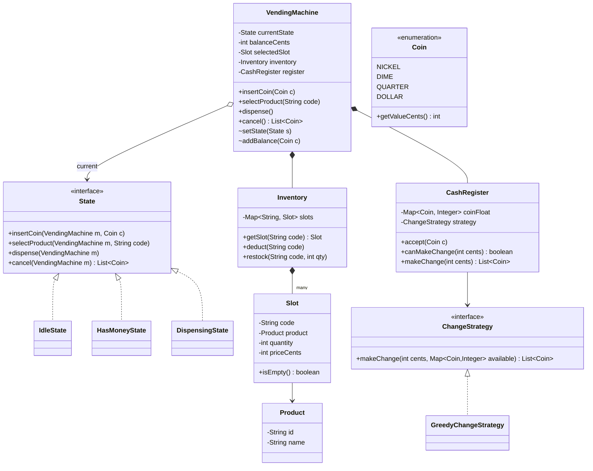
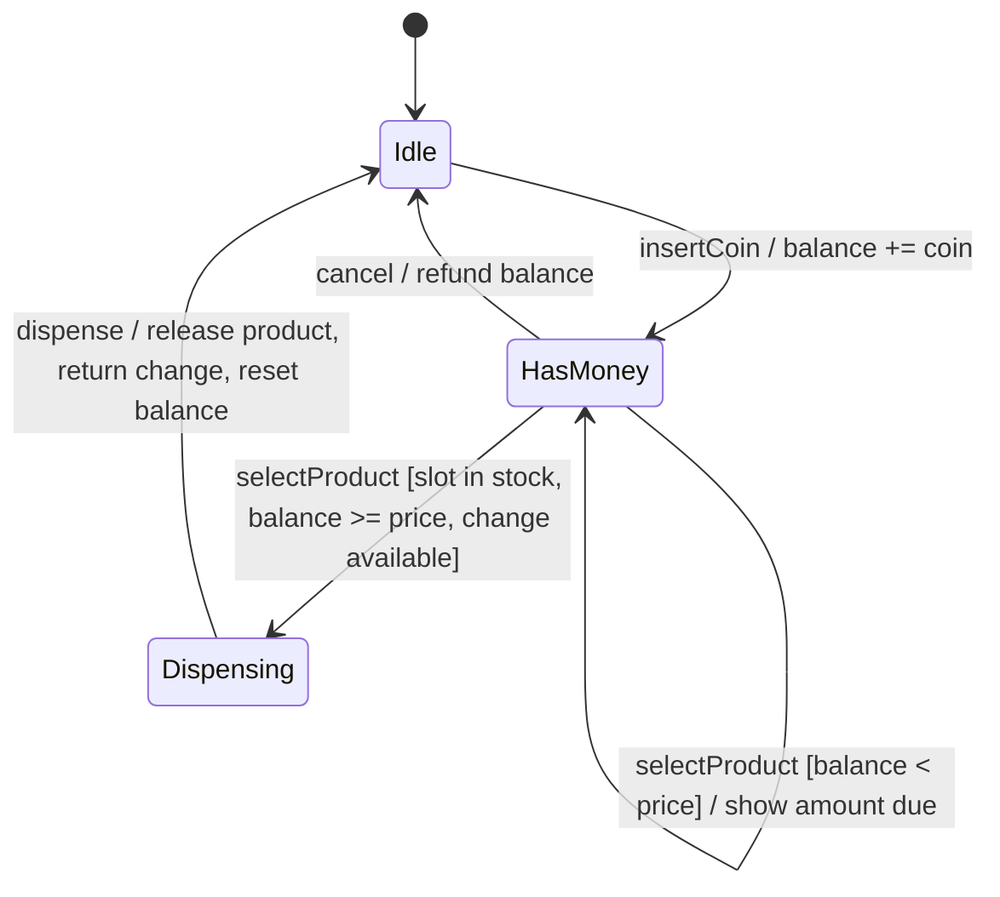

# Design a Vending Machine

The vending machine is the canonical **State-pattern** problem in LLD interviews. A machine
that behaves differently depending on what has happened so far — no money inserted, money
inserted, dispensing in progress — is a textbook finite state machine, and interviewers use
this problem to see whether you reach for the State pattern or drown in a swamp of
`if (hasMoney && !dispensing && ...)` conditionals. Secondary themes: a **Strategy** for the
change-making algorithm, clean money handling (never floats), and inventory modeling.

Budget for a 45–60 min session: ~5 min requirements, ~10 min entities + state diagram,
~20 min classes and code, ~10 min change-making and edge cases, rest for follow-ups.

## Requirements Clarification

Never start drawing classes before scoping. Good clarifying questions for a vending machine:

- **Payment**: Coins only, or notes and cards too? (Baseline: coins of fixed denominations —
   e.g., 5¢, 10¢, 25¢, $1 — but design so card payment can be added later.)
- **Product selection**: Does the user select by slot code (e.g., "A3") after inserting money,
  or before? (Typical: insert money first, then select; but support either.)
- **Change**: Must the machine return change? What if it can't make exact change?
  (Yes — and "insufficient change" is a first-class error, not an afterthought.)
- **Cancel/refund**: Can the user cancel mid-transaction and get a refund? (Yes.)
- **Inventory**: Multiple slots, each holding one product type with a quantity? Can two slots
  hold the same product at different prices? (Model per-slot, not per-product.)
- **Admin operations**: Restocking, collecting cash, price changes? (In scope as simple APIs;
  no auth flows.)
- **Concurrency**: One physical user at a time, but is there a remote monitoring/restock
  feed? (Physical panel is serial; background threads may read inventory.)

Explicitly **scope out**: distributed fleet management, payment-gateway integration details,
telemetry pipelines, UI rendering. Those are HLD concerns — say so and move on
(see the system-design domain for fleet-scale concerns).

Two ground rules to state out loud:

1. **Money is integer cents** (or a `Money` value object) — never `double`. Floating-point
   money is an instant red flag.
2. **The machine is a finite state machine** — name the states before writing any class.

## Core Objects and Entities

Extract the nouns and give each a single responsibility:

| Class | Responsibility |
|---|---|
| `VendingMachine` | The **context**: holds current state, current balance, selected slot; delegates user actions to the state object |
| `State` (interface) | Contract for user actions: `insertCoin`, `selectProduct`, `dispense`, `cancel` |
| `IdleState`, `HasMoneyState`, `DispensingState` | Concrete states — each implements the actions valid for that phase and rejects the rest |
| `Slot` | A physical slot: code (e.g., "A3"), the `Product` it holds, quantity, price |
| `Product` | Value object: id, name (price lives on the `Slot`, so the same product can be priced differently per slot) |
| `Coin` | Enum of accepted denominations with a value in cents (`NICKEL(5)`, `DIME(10)`, `QUARTER(25)`, `DOLLAR(100)`) |
| `Inventory` | Owns the slot map; `getSlot`, `isAvailable`, `deduct`, `restock` |
| `CashRegister` | Tracks the machine's own coin float per denomination; delegates change computation to a `ChangeStrategy` |
| `ChangeStrategy` (interface) | Algorithm to break an amount into coins from the available float (Strategy pattern) |

Key modeling decisions to narrate:

- **Balance lives on `VendingMachine`, not on a state.** States hold *behavior*, the context
  holds *data*. This keeps concrete states stateless, so a single instance of each can be
  shared (or made an enum).
- **`SOLD_OUT` is a per-slot condition, not a machine state.** One empty slot shouldn't brick
  the machine; other slots still sell. Model it as `slot.isEmpty()` checked inside
  `HasMoneyState.selectProduct`, not as a global machine state. (If the interviewer's spec is
  a single-product machine, then a machine-level `SoldOutState` is fine — say which spec
  you're designing for.)
- **`Coin` is an enum, not a class hierarchy.** Denominations are a fixed closed set with data
  (value), not varying behavior — an enum is the honest model.

## Class Diagram



Relationship notes worth saying aloud:

- `VendingMachine` **composes** `Inventory` and `CashRegister` — they have no life outside the
  machine (composition, filled diamond).
- `VendingMachine` holds a *reference* to its current `State` (aggregation-like arrow); the
  state instances themselves are shared flyweights, not owned parts.
- `Slot` **references** a `Product` — products are catalog data that can outlive any slot.

## State Machine

Draw this before writing code — it is the spec the states implement:



Rules encoded here:

- `insertCoin` in `Idle` moves to `HasMoney`; in `HasMoney` it just accumulates.
- `selectProduct` is only meaningful in `HasMoney`. Three guards must all pass before the
  transition to `Dispensing`: slot has stock, balance covers price, **and the register can
  make the change**. Failing any guard keeps the machine in `HasMoney` with a message
  (or refunds, per your policy for insufficient change).
- `Dispensing` accepts no user input — `insertCoin`/`selectProduct`/`cancel` are rejected
  there. This is exactly the kind of invariant the State pattern enforces for free.
- Every terminal path resets balance and selection and returns to `Idle`.

Each transition maps 1:1 to a `machine.setState(...)` call inside a concrete state method.

## Key Design Decisions

**State pattern — the star.** Each user action behaves differently per phase. Without the
pattern, `VendingMachine.insertCoin` becomes a conditional ladder over a status enum, and
*every* new state or action means editing every ladder — a shotgun-surgery magnet and an
Open/Closed violation. With the pattern, each concrete state class is the single home for
"what is legal right now"; illegal actions fail in one obvious place. Reference:
the `dp-behavioral-state` topic owns the pattern mechanics — here we apply it.

- **Who triggers transitions?** Two idioms: the state itself calls
  `machine.setState(next)` (states know their successors — standard GoF, used here), or the
  context decides based on state return values. State-driven transitions keep the transition
  table readable straight from the state classes; just don't let states hold mutable
  transaction data.
- **Stateless states → share them.** Because balance/selection live on the machine, concrete
  states have no fields. Make each a singleton — or model `State` as a Java `enum`
  implementing the interface, which gives you singletons, serialization safety, and an
  exhaustive switch for free.

**Strategy pattern — change-making.** `ChangeStrategy` isolates the coin-breaking algorithm.
Greedy (largest coin first) is optimal for **canonical** denomination systems like
{5, 10, 25, 100}, but fails on arbitrary sets — e.g., coins {1, 3, 4} for amount 6: greedy
gives 4+1+1 (3 coins), optimal is 3+3 (2 coins); worse, greedy can fail entirely when a
limited float means the greedy choice is a dead end. Swapping in a DP-based strategy for a
market with odd denominations is a config change, not a machine rewrite. (Algorithm
internals belong to dsa-coding; here the design point is the seam.)

**Factory for states (light touch).** If states were stateful or needed wiring, a
`StateFactory` would centralize creation. With flyweight/enum states, the "factory" collapses
into constants — say this rather than adding ceremony. Interviewers reward knowing when a
pattern is *not* needed.

**No Singleton for `VendingMachine` itself.** A tempting trap: "there's one machine, so
Singleton!" But an operator runs fleets, and singletons poison testability. Instantiate
normally; cardinality is the caller's business.

**Money as `int` cents.** Repeat it whenever you touch arithmetic; it's a cheap signal of
production maturity.

## API and Method Signatures

The public surface a user (or button panel) touches, plus admin operations:

```java
public interface VendingMachineApi {
    // user actions — delegated to current State
    void insertCoin(Coin coin);
    void selectProduct(String slotCode);           // may complete purchase
    List<Coin> cancel();                           // refund inserted coins

    // read-only
    int getBalanceCents();
    Map<String, SlotView> listAvailableProducts(); // code -> (name, priceCents, qty)
}

public interface AdminApi {
    void restock(String slotCode, int quantity);
    void loadCoins(Coin coin, int count);          // top up change float
    int collectCash();                             // empty register, returns cents
    void setPrice(String slotCode, int priceCents);
}
```

Design notes:

- **Split user vs admin APIs** (Interface Segregation): the button panel should not see
  `collectCash()`.
- `selectProduct` doing the whole purchase (validate → dispense → change) matches real
  machines; alternatively expose `dispense()` separately if the hardware needs a two-phase
  handshake. State the choice.
- Errors surface as domain exceptions — `InsufficientBalanceException`,
  `SoldOutException`, `InsufficientChangeException` — or a `Result` object; pick one and be
  consistent. Don't return `null` or magic ints.

## Code Skeleton

Java, trimmed to structure. The State interface takes the machine as a parameter so state
instances stay shareable:

```java
public enum Coin {
    NICKEL(5), DIME(10), QUARTER(25), DOLLAR(100);
    private final int valueCents;
    Coin(int v) { this.valueCents = v; }
    public int getValueCents() { return valueCents; }
}

public interface State {
    void insertCoin(VendingMachine m, Coin coin);
    void selectProduct(VendingMachine m, String slotCode);
    void dispense(VendingMachine m);
    List<Coin> cancel(VendingMachine m);
}

public class IdleState implements State {
    public void insertCoin(VendingMachine m, Coin coin) {
        m.addBalance(coin);
        m.setState(m.getHasMoneyState());
    }
    public void selectProduct(VendingMachine m, String slotCode) {
        throw new IllegalStateException("Insert money first");
    }
    public void dispense(VendingMachine m) {
        throw new IllegalStateException("Nothing to dispense");
    }
    public List<Coin> cancel(VendingMachine m) { return List.of(); } // nothing to refund
}

public class HasMoneyState implements State {
    public void insertCoin(VendingMachine m, Coin coin) {
        m.addBalance(coin);                              // stay in HasMoney
    }
    public void selectProduct(VendingMachine m, String slotCode) {
        Slot slot = m.getInventory().getSlot(slotCode);
        if (slot.isEmpty()) throw new SoldOutException(slotCode);
        if (m.getBalanceCents() < slot.getPriceCents())
            throw new InsufficientBalanceException(slot.getPriceCents() - m.getBalanceCents());
        int changeDue = m.getBalanceCents() - slot.getPriceCents();
        if (!m.getRegister().canMakeChange(changeDue))   // guard BEFORE dispensing
            throw new InsufficientChangeException();
        m.setSelectedSlot(slot);
        m.setState(m.getDispensingState());
        m.dispense();                                    // drive the next step
    }
    public void dispense(VendingMachine m) {
        throw new IllegalStateException("Select a product first");
    }
    public List<Coin> cancel(VendingMachine m) {
        List<Coin> refund = m.getRegister().makeChange(m.getBalanceCents());
        m.resetBalance();
        m.setState(m.getIdleState());
        return refund;
    }
}

public class DispensingState implements State {
    public void insertCoin(VendingMachine m, Coin coin) {
        throw new IllegalStateException("Dispensing in progress");
    }
    public void selectProduct(VendingMachine m, String slotCode) {
        throw new IllegalStateException("Dispensing in progress");
    }
    public void dispense(VendingMachine m) {
        Slot slot = m.getSelectedSlot();
        m.getInventory().deduct(slot.getCode());  // simplified — production deducts after the
                                                  // drop sensor confirms (see edge cases)
        int changeDue = m.getBalanceCents() - slot.getPriceCents();
        List<Coin> change = m.getRegister().makeChange(changeDue);
        m.getHardware().releaseProduct(slot.getCode());
        m.getHardware().returnCoins(change);
        m.resetBalance();
        m.setSelectedSlot(null);
        m.setState(m.getIdleState());
    }
    public List<Coin> cancel(VendingMachine m) {
        throw new IllegalStateException("Too late to cancel");
    }
}

public class VendingMachine {
    private final State idle = new IdleState();
    private final State hasMoney = new HasMoneyState();
    private final State dispensing = new DispensingState();

    private State currentState = idle;
    private int balanceCents = 0;
    private Slot selectedSlot;
    private final Inventory inventory;
    private final CashRegister register;
    private final DispenserHardware hardware;

    public VendingMachine(Inventory inv, CashRegister reg, DispenserHardware hw) {
        this.inventory = inv; this.register = reg; this.hardware = hw;
    }

    // public API — pure delegation, no conditionals on state
    public void insertCoin(Coin c)           { currentState.insertCoin(this, c); }
    public void selectProduct(String code)   { currentState.selectProduct(this, code); }
    public void dispense()                   { currentState.dispense(this); }
    public List<Coin> cancel()               { return currentState.cancel(this); }

    // context mutators used by states
    void setState(State s)   { this.currentState = s; }
    void addBalance(Coin c)  { balanceCents += c.getValueCents(); register.accept(c); }
    void resetBalance()      { balanceCents = 0; }
    // getters: getIdleState, getHasMoneyState, getDispensingState,
    //          getInventory, getRegister, getBalanceCents, getSelectedSlot ...
}
```

```java
public interface ChangeStrategy {
    /** Returns the coins to dispense, or throws InsufficientChangeException. */
    List<Coin> makeChange(int amountCents, Map<Coin, Integer> available);
}

public class GreedyChangeStrategy implements ChangeStrategy {
    public List<Coin> makeChange(int amount, Map<Coin, Integer> available) {
        List<Coin> result = new ArrayList<>();
        for (Coin c : DESCENDING_BY_VALUE) {
            int usable = Math.min(amount / c.getValueCents(), available.getOrDefault(c, 0));
            for (int i = 0; i < usable; i++) result.add(c);
            amount -= usable * c.getValueCents();
        }
        if (amount != 0) throw new InsufficientChangeException();
        return result;
    }
}
```

The tell that the pattern is working: `VendingMachine`'s public methods contain **zero**
`if`/`switch` on machine status — all conditional behavior lives inside states.

## Extensibility

The follow-ups an interviewer will actually ask, and the seam each one uses:

- **"Add card payment."** Introduce a `PaymentMethod` abstraction: `CoinPayment` and
  `CardPayment implements PaymentMethod { authorize(amount), capture(), refund() }`. The
  `HasMoneyState` guard becomes `payment.covers(price)` instead of comparing coin balance.
  Card purchases skip change-making entirely (charge exact price). No existing state class
  is rewritten — Open/Closed holds because the states depend on the payment abstraction,
  not on coins. (Gateway integration itself is an HLD/system-design concern.)
- **"Add a touch screen / new UI."** The machine already exposes a UI-agnostic API
  (`insertCoin`, `selectProduct`, ...). A screen is just another driver of the same API —
  if your design tangled display logic into states, this question exposes it.
- **"Remote inventory monitoring / restock alerts."** Observer: `Inventory` publishes
  `SlotLevelChanged` events; a `TelemetryListener` and a `RestockAlertListener` subscribe.
  The machine doesn't know or care who listens (see `dp-behavioral-observer`). Fleet-scale
  aggregation is system-design territory.
- **"Add a new state"** (e.g., `MaintenanceState` where all user actions are rejected):
  one new class implementing `State`, plus the transitions into/out of it. Existing states
  untouched — the payoff of the pattern.
- **"Discounts / dynamic pricing."** A `PricingStrategy` on the slot or machine
  (`int price(Slot, Context)`) — same Strategy seam as change-making.
- **"Multiple currencies / new denominations."** Add enum constants and register float —
  works because nothing hardcodes coin values outside the enum and the change strategy.

## Concurrency and Edge Cases

**Concurrency.** Be honest about the physics: one physical panel means user actions are
inherently serial — say this, don't invent locks for imaginary races. Real concurrency comes
from background threads (telemetry reads, remote restock commands) touching `Inventory` and
`CashRegister` while a purchase runs. Cheapest correct answer: make the machine's public
methods `synchronized` (a single coarse lock — contention is irrelevant at vending-machine
throughput), or confine all mutations to a single-threaded command queue. Per-slot fine-grained
locking is over-engineering here; saying *why* it's over-engineering scores points.

**Edge cases checklist:**

- **Insufficient change** — the classic. Check `canMakeChange(changeDue)` *before*
  dispensing (you can't un-dispense a soda). Policy options: reject the sale and refund, or
  display "exact change only" mode when the float is low. Note the subtlety: a correct
  `canMakeChange` must respect the *limited* float — plain greedy arithmetic can say "yes"
  when the actual coins say "no".
- **Cancel mid-transaction** — refund the session's balance; legal in `HasMoney`, a no-op in
  `Idle`, rejected in `Dispensing` (product already committed). Subtlety worth naming: the
  skeleton refunds *equivalent value* from the register float (`makeChange(balance)`), which
  can theoretically fail if the float can't compose it. Real machines sidestep this by holding
  inserted coins in an **escrow tray** until the sale commits — cancel just releases the tray,
  returning the exact coins inserted. Mention the escrow model if the interviewer probes.
- **Invalid slot code / sold-out slot** — validate in `HasMoneyState.selectProduct`; stay in
  `HasMoney` so the user can pick another slot without re-inserting money.
- **Foreign/invalid coin** — hardware rejects it to the return tray; the model only ever
  sees `Coin` enum values.
- **Dispense hardware jam** — product deducted from inventory but never released: the reason
  real machines deduct *after* the drop sensor fires; model a `DispenseFailed` path that
  refunds and flags maintenance.
- **Power failure mid-transaction** — persist a small snapshot (state name, balance,
  selected slot) to non-volatile storage after each transition (a Memento, journaled); on
  boot, restore or refund-and-reset. Mention it, don't build it.
- **Session timeout** — money inserted, user walks away: a timer fires `cancel()` after N
  minutes, refunding and returning to `Idle`.

## Common Interview Follow-ups

1. **"Why the State pattern and not an enum + switch?"** — For 2 states and 2 actions a
   switch is fine; the pattern wins as the action×state matrix grows: each state's rules live
   in one class, new states don't touch existing code, and illegal-action handling is
   structural rather than remembered. Know both and articulate the crossover.
2. **"Add card/UPI payment without breaking coin flow."** — `PaymentMethod` abstraction;
   states depend on it, not on coins (see Extensibility).
3. **"What if greedy change fails?"** — Explain canonical vs non-canonical systems and
   limited-float dead ends; swap the `ChangeStrategy` for DP/backtracking.
4. **"Two users, one machine?"** — Physically serial; the real question is background
   threads. Coarse lock or command queue; justify simplicity.
5. **"Machine dies mid-dispense — who wins, user or operator?"** — Persist transitions,
   deduct inventory on drop-sensor confirmation, refund on unresolved boot state.
6. **"Now design a fleet of 10,000 machines with live inventory."** — Recognize the domain
   shift: that's HLD (event streaming, aggregation, fleet dashboards) — outline in one
   sentence and point to system-design.
7. **"Where would Observer fit?"** — Inventory/level events to telemetry and restock
   listeners; also display updates if you model a `Display` observer of machine events.
8. **"How do you test this?"** — States are pure and shareable: unit-test each state method
   against a mock machine; property-test the change strategy (amount = sum of returned
   coins, all coins available in float).

## References

- Gamma, Helm, Johnson, Vlissides — *Design Patterns* (GoF): State pattern (Ch. 5), Strategy pattern.
- Freeman & Robson — *Head First Design Patterns*, Ch. 10 "The State of Things" — builds this exact gumball/vending machine step by step.
- Cross-reference in this library: `dp-behavioral-state`, `dp-behavioral-strategy`, `dp-behavioral-observer` (pattern mechanics), `lld-interview-method` (session structure), dsa-coding (coin-change DP internals).
- Grokking-style LLD problem sets: "Design a Vending Machine" chapters (educative.io / GitHub `awesome-low-level-design`).
- Pekka Kilpeläinen — research on canonical coin systems (why greedy is optimal for {1,5,10,25}).
