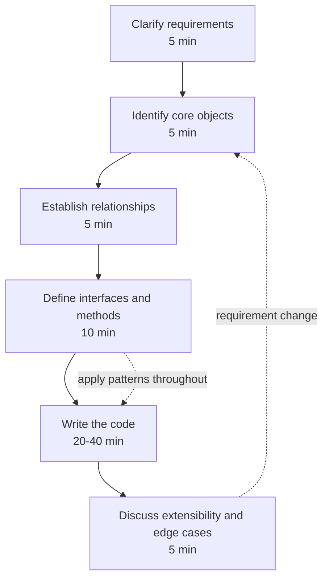
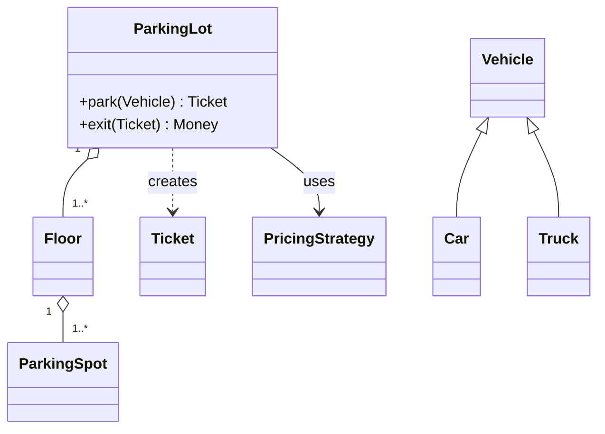

# The LLD Interview Method

The low-level design (LLD) round — often called *machine coding* or *object-oriented
design* — sits between DSA and high-level system design. The prompt is deceptively simple:
"Design a parking lot / elevator / rate limiter / LRU cache / Splitwise as clean,
extensible OO code," and you have **45–90 minutes** to do it live. Unlike DSA, there is no
single correct answer and no hidden test suite; unlike HLD, you are not drawing boxes for
load balancers and shards. You are being judged on whether you can turn fuzzy requirements
into **well-factored classes with clear responsibilities**, name the design decisions you
make, and evolve the design when the interviewer changes the requirements.

This topic teaches a **repeatable seven-step method** for running that session under time
pressure, plus the evaluation criteria interviewers actually score and the pitfalls that
sink otherwise-strong candidates. It references the GoF patterns by name — the mechanics of
each pattern live in the `dp-*` design-pattern topics; data-structure internals live in
`dsa-coding`; anything about scaling to many machines belongs in `system-design`. Keep this
round **single-machine, in-memory, object-oriented**.

> [!KEY-TAKEAWAY]
> The LLD round rewards *process*, not memorized answers. A candidate who narrates a
> disciplined method — clarify, model, relate, define API, apply patterns with
> justification, code, then extend — reads as senior even on an unfamiliar problem.

## The Round at a Glance

A time budget keeps you from spending 30 minutes on requirements and then panic-coding a
god class in the last five. A rough allocation for a 45-minute round (scale up
proportionally for 60–90 min):

| Phase | Time | Output |
|---|---|---|
| 1. Clarify requirements | ~5 min | Agreed scope: actors, use-cases, in/out list |
| 2. Identify core objects | ~5 min | Candidate class list, one responsibility each |
| 3. Establish relationships | ~5 min | Rough class diagram: is-a / has-a, multiplicity |
| 4. Define key interfaces & methods | ~10 min | Public API, signatures, return types |
| 5. Apply patterns | ongoing | Named patterns with *why* |
| 6. Write the code | ~20 min | Compile-ready skeleton + critical methods |
| 7. Extensibility & edge cases | ~5 min | "What if we add X?" answered via OCP |



> [!TIP]
> Announce your plan out loud at minute zero: "I'll spend a few minutes clarifying scope,
> then sketch the classes and their relationships, agree the key APIs with you, and then
> code. Does that work?" This frames the whole session and signals that you have a method.

## Step 1 — Clarify Requirements (5 min)

Never start coding on the literal prompt. "Design a parking lot" hides a dozen decisions.
Spend the first five minutes turning the one-liner into an agreed, bounded problem.

Ask about, in roughly this order:

- **Actors and use-cases.** Who uses the system and what do they do? For a parking lot:
  a driver enters, parks, exits, and pays; an admin configures floors and rates. Listing
  actors and their use-cases is the fastest route to the right classes.
- **Scope — what is in and what is out.** "Do we need online reservation and a payment
  gateway, or just entry/exit and fee calculation?" Explicitly park features out of scope:
  "I'll leave the payment integration as an interface and focus on spot assignment and
  pricing — sound right?"
- **Constraints.** Single machine or distributed? (For LLD, confirm single machine — if
  they want multi-node, that is a `system-design` conversation.) Concurrent access — many
  gates hitting the same floor at once, or single-threaded? In-memory or persisted?
- **Scale of the model, not the traffic.** How many vehicle types? Fixed floors or
  dynamic? Multiple pricing strategies (hourly, flat, day-vs-night)? These directly shape
  how much extensibility you build in.

Capture the answers as a short bulleted list you both can see. This list is your contract:
it justifies every class you create and protects you from scope creep later.

> [!INTERVIEW]
> Interviewers deliberately give vague prompts to see if you clarify. Diving straight into
> code is the single most common way strong coders fail this round. Two or three sharp
> scoping questions ("concurrent? which features are in scope? how many vehicle types?")
> earn immediate credit.

Common questions worth memorizing as a checklist: *Who are the actors? What are the core
use-cases? What is explicitly out of scope? Single-threaded or concurrent? In-memory or
persisted? Which dimensions vary (types, strategies, rules)?*

## Step 2 — Identify Core Objects (5 min)

With scope agreed, extract the **nouns** from the requirements — they are your candidate
classes — and the **verbs**, which become methods. This "noun-and-verb" pass is a fast,
defensible way to seed a model.

For a parking lot the nouns yield: `ParkingLot`, `Floor`, `ParkingSpot`, `Vehicle`,
`Ticket`, `EntryGate`, `ExitGate`, `PricingStrategy`, `Payment`. The verbs — *park*,
*issue ticket*, *calculate fee*, *pay* — hint at the methods and where they live.

Then apply the discipline that separates senior candidates:

- **Assign each class a single responsibility (SRP).** A `Ticket` holds entry time and
  spot; it does not compute fees. A `PricingStrategy` computes fees; it does not know about
  gates. If you can't describe a class's job in one sentence without "and," split it.
- **Prune ruthlessly.** Not every noun deserves a class. "Driver" might just be an `id`
  string in v1. Over-modeling wastes your limited time — a real pitfall (see
  [Common Pitfalls](#common-pitfalls)).
- **Prefer value objects for money, time, coordinates.** A `Money` type beats a raw
  `double`; it signals care and prevents rounding bugs interviewers love to probe.

> [!WARNING]
> The opposite failure of over-modeling is the **god class**: a single `ParkingLotManager`
> that parses input, assigns spots, computes fees, and processes payment. It violates SRP
> and becomes impossible to extend. If one class accumulates every verb, redistribute
> responsibilities before you write a line of code.

## Step 3 — Establish Relationships (5 min)

Now connect the classes. For each pair, decide the relationship and its multiplicity, and
sketch a rough class diagram (`dp-*`/`uml-class-diagrams` covers UML notation in depth —
here you just need enough to communicate).

- **is-a (inheritance / interface implementation).** `Car`, `Truck`, `Motorcycle` *are*
  `Vehicle`s. Reach for this only when there's a genuine subtype relationship that honors
  Liskov substitution — otherwise prefer composition.
- **has-a (composition / aggregation).** A `ParkingLot` *has* `Floor`s; a `Floor` *has*
  `ParkingSpot`s. Favor **composition over inheritance** — it's more flexible and avoids
  fragile hierarchies.
- **Multiplicity.** One `ParkingLot` to many `Floor`s (1..\*); one `Ticket` to one
  `ParkingSpot`. Stating "1-to-many" or "many-to-many" out loud shows rigor.
- **Who creates whom (the Creator responsibility).** Does the `EntryGate` create the
  `Ticket`, or does the `ParkingLot`? Deciding ownership now prevents tangled dependencies
  later, and hints at where a Factory may help.



> [!TIP]
> Draw the diagram *with* the interviewer, not silently. Point at each arrow and say why:
> "ParkingLot owns Floors — composition, because floors don't exist without the lot." A
> narrated diagram is a communication win, one of the explicit scoring criteria.

## Step 4 — Define Key Interfaces and Methods (10 min)

Before implementing anything, nail down the **public API** — the method signatures, their
parameters, and return types. This is where you commit to the shape of the design, and it's
the highest-leverage 10 minutes of the round: get the interfaces right and the code writes
itself.

For each core class, write the signatures:

```java
interface PricingStrategy {
    Money calculate(Ticket ticket, Instant exitTime);
}

class ParkingLot {
    Ticket park(Vehicle vehicle);          // returns null / throws if full
    Money  exit(Ticket ticket);            // computes fee, frees the spot
}
```

Decisions to make explicit here:

- **Return types carry meaning.** Return a `Ticket` (not `void`) from `park` so the caller
  has a handle. Consider `Optional<ParkingSpot>` over returning `null` for "no spot."
- **Interfaces at the variation points.** Anywhere requirements said "this can vary"
  (pricing, spot-assignment strategy, notification channel), define an *interface* now.
  That interface is where the Open/Closed Principle and the Strategy pattern will pay off.
- **Error signaling.** How does "lot full" surface — exception, `Optional`, a result
  object? Say which and why.
- **Keep it minimal.** Only the methods the agreed use-cases need. Speculative methods are
  YAGNI violations and waste time.

> [!INTERVIEW]
> When you present the API, ask: "Does this interface look right to you before I implement
> it?" This catches misunderstandings early and turns the interviewer into a collaborator —
> exactly the dynamic senior interviewers want to see.

## Step 5 — Apply Patterns (Ongoing)

Design patterns are not a checklist to shoehorn in — they're vocabulary for solving
recurring problems, applied *when the problem appears*. The skill being tested is **naming
the pattern and justifying why**, not reciting all 23 GoF patterns. (Each pattern's full
mechanics live in the `dp-*` topics; here, recognize the trigger.)

The patterns that earn their keep in LLD rounds:

- **Strategy** — when an algorithm varies. Pricing (hourly vs. flat vs. surge), spot
  assignment (nearest vs. cheapest), eviction (LRU vs. LFU). This is the single most useful
  LLD pattern.
- **Factory / Abstract Factory** — when object creation is conditional or likely to grow.
  `VehicleFactory.create(type)` centralizes the `switch` so adding a type touches one place.
- **Observer** — when state changes must notify others. Spot freed → notify a waiting
  display; game move → notify scoreboard.
- **State** — for a finite state machine. Vending machine (idle → has-money → dispensing),
  order lifecycle, elevator doors. Replaces sprawling `if (status == ...)` chains.
- **Singleton** — for a single shared resource (a `ParkingLot` registry, a config). Use
  sparingly; interviewers probe thread-safety (double-checked locking, enum singleton) and
  its testability downsides.
- **Decorator, Builder, Command, Template Method** — appear in specific prompts (toppings
  on a pizza, complex object construction, undoable operations, fixed algorithm skeletons).

The rule: **name the pattern, state the problem it solves, and note the alternative you
rejected.** "I'll use Strategy for pricing so a new fee model is a new class rather than an
edit to `ParkingLot` — that keeps `ParkingLot` closed for modification." That one sentence
demonstrates pattern knowledge *and* SOLID adherence at once.

> [!WARNING]
> Pattern-dropping without justification backfires. Wrapping a two-line calculation in a
> Factory, Strategy, *and* Observer is over-engineering — the interviewer sees cargo-culting,
> not judgment. Introduce a pattern only when a real variation or duplication demands it.

## Step 6 — Write the Code (20-40 min)

Now implement — the bulk of the round. Write **compile-ready** code (real types, real
method bodies for the critical paths), not pseudocode. You don't have time to write
everything, so sequence deliberately:

1. **Skeleton first.** Lay down the classes, fields, and empty method bodies so the whole
   structure is visible. This also lets the interviewer redirect you early.
2. **Implement the critical methods fully.** The 2–3 methods that are the heart of the
   problem (`park` / `exit` and `PricingStrategy.calculate` for a parking lot) get real,
   correct bodies. Stub the peripheral ones with a comment.
3. **Show extensibility as you go.** Code to interfaces, inject dependencies via the
   constructor (so pricing can be swapped/mocked), and keep `switch`/`if` chains behind a
   factory or strategy.

Practices that read as senior while coding:

- **Encapsulate state.** Private fields, behavior-rich objects. Prefer `spot.occupy(vehicle)`
  over `spot.setOccupied(true)` (Tell-Don't-Ask).
- **Immutability where natural.** `final` fields, value objects for `Money`/`Ticket`.
- **Handle the obvious edge cases in code**, not just talk: lot full, ticket not found,
  double-exit.
- **Narrate as you type.** "I'm injecting `PricingStrategy` in the constructor so it's
  swappable and testable." Silence during coding wastes the communication signal.

> [!TIP]
> If you're running low on time, say so and prioritize: "I'll fully implement `park` and
> `exit`, and stub `Payment` behind an interface — I can flesh it out if you'd like." Managing
> your own time visibly is a positive signal, not an admission of failure.

Address **concurrency** only if the requirements called for it: mention that spot assignment
needs synchronization (a lock per floor, or a concurrent structure / atomic compare-and-set
on spot state) to prevent two gates assigning the same spot. Don't bolt on threading if the
scope was single-threaded — that's over-engineering.

## Step 7 — Discuss Extensibility and Edge Cases (5 min)

Reserve the last few minutes to demonstrate that your design *bends without breaking*. The
interviewer will almost always ask a "what if we add X?" follow-up — this is the payoff for
the interfaces and patterns you set up.

- **Answer extension questions via the Open/Closed Principle.** "What if we add electric
  vehicles with charging spots?" → "I add an `ElectricVehicle` type and an
  `ElectricSpot`; because assignment goes through a `SpotAssignmentStrategy` interface, I
  add a new strategy without touching existing classes." Point at the exact seam.
- **Walk the edge cases** you didn't fully code: lot full, lost ticket, vehicle that
  doesn't fit any spot, exit without valid ticket, clock skew in pricing.
- **Mention concurrency and its handling** if relevant to scope, and explicitly say what
  you'd guard.
- **Note what you'd test.** "I'd unit-test each pricing strategy in isolation, which is easy
  because they're injected." This closes the loop on testable design.
- **Flag scaling as out of scope, with a pointer.** "If we needed this across many lots and
  millions of events, that's a distributed-systems conversation — sharding, a datastore,
  eventing — but for this round I've kept it single-machine." That respects the round's
  boundary while showing you know where it ends.

> [!KEY-TAKEAWAY]
> The follow-up isn't a trap — it's the interviewer handing you a chance to prove your design
> is extensible. If adding the new feature means editing five existing classes, your design
> failed OCP; if it means adding one class behind an existing interface, you nailed it.

## A Worked Mini-Walkthrough — Rate Limiter

Applying the method end-to-end to "design a rate limiter" in miniature:

**1. Clarify.** Actors: clients making requests; the limiter decides allow/deny. Scope:
single machine, in-memory (I confirm we're *not* doing a distributed Redis-backed limiter —
that's system-design). Which algorithm — fixed window, sliding window, token bucket? I ask,
and the interviewer says "make the algorithm pluggable." Concurrent? Yes, many threads.

**2. Core objects (nouns).** `RateLimiter` (facade the client calls), `RateLimitStrategy`
(the varying algorithm), `TokenBucket` / `SlidingWindowLog` (concrete strategies), `Clock`
(injected so time is testable), `Rule` (limit + window config per client).

**3. Relationships.** `RateLimiter` *has-a* `RateLimitStrategy` (composition). Concrete
strategies *are-a* `RateLimitStrategy` (interface implementation). `RateLimiter` holds a map
of clientId → strategy instance. Multiplicity: one limiter, many client buckets.

**4. Interfaces & methods.**

```java
interface RateLimitStrategy {
    boolean allowRequest(String clientId, Instant now);
}

class RateLimiter {
    private final RateLimitStrategy strategy;
    RateLimiter(RateLimitStrategy strategy) { this.strategy = strategy; }
    boolean allow(String clientId) { return strategy.allowRequest(clientId, clock.now()); }
}
```

**5. Patterns.** *Strategy* for the pluggable algorithm — "a new algorithm is a new class,
`RateLimiter` stays closed for modification." *Factory* could build the strategy from config.
The injected `Clock` is a testability seam, not a pattern to name.

**6. Code.** Implement `TokenBucket.allowRequest` fully: refill tokens based on elapsed time,
decrement on allow, use an atomic/synchronized section per client so concurrent requests
don't over-admit. Stub `SlidingWindowLog` with a comment.

**7. Extensibility & edge cases.** "Add a new algorithm?" → new `RateLimitStrategy` impl,
zero edits elsewhere. Edge cases: first-ever request (bucket lazily initialized full), clock
going backwards, burst at window boundary. Concurrency: per-client lock or atomic CAS on the
bucket. Scaling across machines → out of scope, points to `system-design`'s distributed
rate-limiting.

That's the whole method in one problem: each step took a minute or two of talk, the design
fell out of it, and every decision had a stated reason.

## How Interviewers Evaluate You

LLD rounds are scored on a rubric, not a pass/fail test run. The dimensions, roughly in the
order interviewers weight them:

- **Correctness & completeness.** Does the design actually satisfy the agreed requirements?
  Do the core methods work? A beautiful design that doesn't solve the problem fails.
- **SOLID adherence & clean structure.** Single-responsibility classes, dependencies on
  abstractions, extension without modification. This is the heart of the round.
- **Pattern knowledge & judgment.** Do you recognize where a pattern fits, name it, and
  justify it — *and* avoid forcing patterns where they don't belong? Judgment counts as much
  as recall.
- **Communication clarity.** Did you clarify scope, narrate decisions, draw a shared
  diagram, and check in? A silent coder with great code often scores below a clear
  communicator with good code, because the job is collaborative.
- **Handling follow-ups.** When requirements change, does the design flex gracefully, or do
  you rewrite? This is the clearest signal of extensible design.

> [!INTERVIEW]
> Many companies use a **collaborative** LLD interview: the interviewer *is* your teammate
> for 45 minutes. They're partly assessing "would I want to design with this person?" Thinking
> aloud, taking feedback gracefully, and admitting trade-offs all raise your score.

## Common Pitfalls

The failure modes that recur across LLD rounds — each is directly avoidable with the method:

- **Not clarifying scope.** Coding on the literal prompt and building the wrong thing, or an
  unbounded thing. Fix: Step 1.
- **The monolithic god class.** One `Manager` that does everything, violating SRP and
  impossible to extend. Fix: Step 2's single-responsibility discipline.
- **Over-engineering.** Abstract factories, deep inheritance trees, and three patterns for a
  problem that needs none. YAGNI. It burns your clock and signals poor judgment. Fix:
  introduce structure only when a real variation demands it.
- **No pattern justification.** Naming "Singleton!" without saying what it solves, or using
  a pattern reflexively. Fix: Step 5's name-problem-alternative sentence.
- **Anemic model / feature envy.** Data-only classes with all logic in a service that reaches
  into their fields. Fix: put behavior with the data it uses (Information Expert,
  Tell-Don't-Ask).
- **Coding in silence.** Producing correct code without narrating loses the communication
  score entirely. Fix: think aloud throughout.
- **Poor time management.** Spending 20 minutes on requirements, or gold-plating one class
  while core methods stay unwritten. Fix: the time budget in [The Round at a Glance](#the-round-at-a-glance).
- **Premature scaling.** Bringing in queues, shards, and caches for a single-machine OO
  problem. Fix: keep it in-memory and point scaling questions at `system-design`.

## Common Interview Follow-ups

- "You didn't ask me anything and started coding — walk me through why you chose these
  classes." (Tests whether you can *retroactively* justify — much weaker than clarifying up
  front.)
- "Add a new vehicle type / pricing model / algorithm. How much code changes?" (OCP probe —
  the answer should be "one new class.")
- "Make it thread-safe — two gates assign spots simultaneously. What breaks and how do you
  fix it?" (Concurrency probe within single-machine scope.)
- "Why a Strategy here and not just an `if`/`switch`?" (Justify the pattern; the honest
  answer includes "if there were only ever two fixed cases, a switch would be fine.")
- "This class does a lot — is that a problem?" (SRP probe; recognize and split the god class.)
- "How would you unit-test the pricing logic?" (Tests whether your seams — dependency
  injection, interfaces — actually enable testing.)
- "How would this change if it had to run across 100 servers?" (Boundary check — name it as a
  system-design problem and sketch the direction without derailing the LLD round.)

## References

- Martin, *Clean Code* & *Agile Software Development: Principles, Patterns, and Practices*
  (SOLID, class design).
- Gamma, Helm, Johnson, Vlissides (Gang of Four), *Design Patterns: Elements of Reusable
  Object-Oriented Software* — pattern catalog (see the `dp-*` topics).
- Larman, *Applying UML and Patterns* — GRASP responsibility assignment, use-case-driven OO
  analysis.
- Fowler, *Refactoring* & *Patterns of Enterprise Application Architecture* — code smells
  (god class, feature envy, anemic model).
- Grokking the Low Level Design Interview / educative.io LLD problem catalog — canonical
  prompts (parking lot, elevator, vending machine, Splitwise).
- Related topics in this library: `oop-principles-pillars`, `design-principles-beyond-solid`,
  `uml-class-diagrams`, the `dp-*` design-pattern topics, and the `design-*` worked LLD
  problems.
