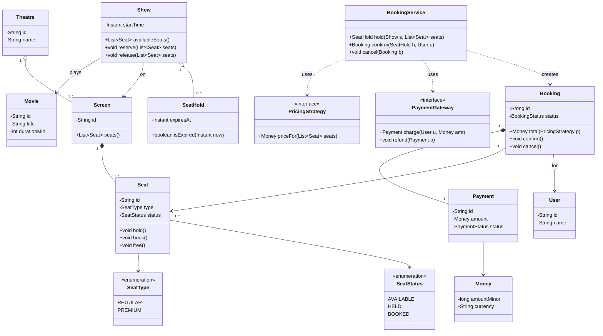

# OOAD: From Requirements to Classes

The hardest part of a low-level design round is not knowing the patterns — it is the blank
page. The interviewer says *"design a ride-hailing app"* or *"design a movie-booking system,"*
and you have a paragraph of fuzzy English and 45 minutes to turn it into a set of
well-factored classes. **Object-Oriented Analysis and Design (OOAD)** is the discipline that
bridges that gap: a repeatable pipeline from *requirements text → candidate objects →
responsibilities → relationships → class diagram*. This topic teaches the *how-to-think*
skill — the mechanical-but-heuristic techniques that senior candidates run almost
unconsciously, so that under time pressure you never freeze staring at a prompt.

The three classic techniques, applied in sequence, do the heavy lifting:

1. **Noun/verb (Abbott textual) analysis** — mine the requirements for candidate classes
   (nouns) and responsibilities (verbs).
2. **CRC cards (Class–Responsibility–Collaborator)** — a cheap, tactile way to assign
   responsibilities and discover collaborations before you commit to a diagram.
3. **Responsibility-Driven Design (RDD)** and **domain modeling** — the mindset ("what should
   this object *own*?") plus the vocabulary (entities, value objects) that keeps the model
   coherent.

> [!KEY-TAKEAWAY]
> OOAD is *analysis then design*: first understand the problem domain as objects and
> responsibilities (analysis), then shape that into a class structure that is implementable
> and extensible (design). The techniques here are **heuristics, not algorithms** — they
> generate a strong first draft that you refine iteratively, not a guaranteed-correct answer.

This topic complements the process-level `lld-interview-method` (the seven-step session flow)
by zooming into steps 2 and 3 — *identify objects* and *establish relationships* — and shows
the concrete mechanics. It leans on `uml-class-diagrams` for notation and
`design-principles-beyond-solid` for the GRASP responsibility-assignment principles it invokes.
GoF patterns are referenced by name only; their mechanics live in the `dp-*` topics.

## Analysis vs Design: What OOAD Actually Means

**Object-Oriented Analysis (OOA)** answers *"what are the things in this problem, and what are
they responsible for?"* — it is about the **problem domain**, independent of any
implementation. Its output is a *domain model* / *conceptual model*: the concepts (a `Movie`,
a `Show`, a `Seat`, a `Booking`) and how they relate, expressed without worrying about Java
types, getters, or persistence.

**Object-Oriented Design (OOD)** answers *"how do I structure software objects to fulfill
those responsibilities?"* — it introduces method signatures, visibility, interfaces, patterns,
and the pragmatic classes (a `BookingService`, a `PaymentGateway` interface) that don't exist
in the real world but make the software work.

The distinction matters in an interview because it sequences your thinking: **model the
domain first** (so your classes mirror reality and are intuitive to the interviewer), *then*
add design-level machinery (controllers, factories, strategies) only where the software needs
it. Candidates who skip analysis and jump straight to `XxxManager` and `XxxService` classes
produce anemic, procedural designs that don't map to the problem.

> [!TIP]
> Larman's *Applying UML and Patterns* frames this as: OOA finds **conceptual classes** in
> the domain; OOD assigns **software responsibilities** to design classes. Do the conceptual
> pass out loud — "in this domain we have shows, seats, bookings…" — before you write a single
> `class` keyword. It reads as maturity and it seeds a better model.

## Noun/Verb (Abbott Textual) Analysis

The oldest and most practical starting technique, from Russell Abbott's 1983 paper *Program
Design by Informal English Descriptions*: **write the requirements as plain prose, then
underline the nouns and circle the verbs.**

- **Nouns / noun-phrases → candidate classes or attributes.** "A *user* books a *seat* for a
  *show* of a *movie* at a *theatre*" yields candidates `User`, `Seat`, `Show`, `Movie`,
  `Theatre`.
- **Verbs / verb-phrases → candidate responsibilities (methods).** *books*, *reserves*,
  *cancels*, *pays* become methods that live on some class.
- **Adjectives → attributes or subclasses.** "a *premium* seat" hints at either a `type`
  attribute or a `PremiumSeat` subtype.

The output is a *candidate list*, deliberately over-generated. The skill is what comes next.

> [!KEY-TAKEAWAY]
> Noun/verb analysis is a **heuristic that generates candidates, not a mechanical rule that
> outputs the final model.** Its job is to defeat the blank page. You *must* then filter,
> because natural language is messy: it over-produces classes, hides some behind synonyms, and
> omits others entirely.

### Filtering candidate nouns

Not every noun becomes a class. Run each candidate through these filters:

- **Redundant / synonym** — "customer" and "user" and "patron" are the same concept; pick one.
- **Attribute, not a class** — "name," "price," "date," "colour" are usually fields of another
  class, not classes themselves. (Promote to a class only if it has its own behaviour or
  identity — e.g. `Money` deserves a class for currency + rounding.)
- **Value object vs entity** — does it have a distinct **identity** that must be tracked over
  time (an entity, e.g. a `Booking` with an id), or is it defined purely by its **values**
  (a value object, e.g. `Money`, `DateRange`, `SeatPosition`)? See
  [Domain Modeling](#domain-modeling-entities-value-objects-relationships).
- **Out of scope** — the noun belongs to a feature you agreed to exclude; drop it.
- **An operation, not a thing** — "reservation" might be the *act* (a method) or the *record*
  (a class). Decide based on whether it has state worth persisting.
- **Vague / meta** — "system," "data," "information," "the application" are almost never
  domain classes.

### The limits of the technique

Abbott's method has well-known blind spots you should acknowledge:

- **It misses implicit objects.** Requirements rarely say the noun "PricingStrategy" or
  "SeatAllocator," yet the design needs them. These *design classes* come from RDD and pattern
  recognition, not from the text.
- **It over-weights grammar.** Whether a concept appears as a noun or a verb is an accident of
  how the requirement was phrased ("payment" vs "pay"), not a reliable signal of class vs
  method.
- **Synonyms and homonyms mislead.** The same word can mean different things ("book" the verb
  vs "book" the noun in a library).

So treat it as **pass one**. It reliably surfaces the obvious domain entities; you supply the
non-obvious design objects afterward.

## CRC Cards (Class–Responsibility–Collaborator)

Invented by Kent Beck and Ward Cunningham (OOPSLA 1989) as a teaching and design tool, **CRC
cards** are the fastest way to turn your candidate list into responsibilities and discover how
objects collaborate — *before* you invest in a diagram. Each class gets one physical index
card divided into three regions:

```
+-------------------------------------------------+
|  Class name:  Booking                           |
+----------------------------+--------------------+
|  Responsibilities          |  Collaborators     |
|  - knows its seats         |  Seat              |
|  - knows its show          |  Show              |
|  - knows total price       |  Payment           |
|  - confirm / cancel itself |  User              |
+----------------------------+--------------------+
```

Definitions (from Beck & Cunningham):

- A **responsibility** is *"something a class knows or does."* "Knows its seats" (knowing) and
  "confirms itself" (doing) are both responsibilities. Keep them at a high level — a card that
  overflows is a class doing too much (an SRP smell).
- A **collaborator** is *another class this one sends a message to* — *"a request for
  information or a request to do something."* If `Booking` must ask `Seat` "are you
  available?", then `Seat` is a collaborator of `Booking`.

### The CRC session, step by step

CRC's real value is the **role-play session**, which is exactly the design-thinking an
interviewer wants to watch:

1. **Lay out a card per candidate class** from your filtered noun list.
2. **Walk each use-case as a scenario**, moving through the cards. "A user books two seats":
   pick up the `BookingService` card — what is *its* responsibility? To create a `Booking`. To
   do that it must ask `Show` for available `Seat`s → so `Show` and `Seat` become
   collaborators. `Seat` must know how to mark itself reserved → that's a responsibility on
   `Seat`.
3. **Assign each responsibility to exactly one card** — the one that *has the information to
   fulfil it* (this is GRASP Information Expert; see
   [Tying It to GRASP](#tying-it-to-grasp-information-expert--creator)). If two cards fight over
   a responsibility, that tension is telling you something about the design.
4. **Record collaborators as you discover them.** A responsibility a card can't fulfil alone
   reveals a collaboration.
5. **Refine iteratively** — split overloaded cards, merge redundant ones, add missing ones.
   The famous rule of thumb: **"if in doubt, make it a class."** A cheap extra card is easier
   to discard than a missing concept is to retrofit.

> [!INTERVIEW]
> You can't hand out index cards in a virtual interview, but you can *narrate the CRC session*:
> "Let me play out the booking scenario across my classes. `BookingService` needs to create a
> booking — for that it collaborates with `Show` to find seats, and each `Seat` is responsible
> for its own availability state." This think-aloud walkthrough is one of the strongest senior
> signals you can send, because it shows responsibility assignment *in motion*.

> [!WARNING]
> The most common CRC mistake is putting a responsibility on the wrong card — e.g. making
> `BookingService` reach in and flip `seat.isBooked = true` directly. That is **feature envy /
> anemic model**: the behaviour belongs with the data. `Seat` should own `reserve()`. If a
> card's responsibilities are all "hold data" and another card does everything to it, your
> model is procedural, not object-oriented.

## Responsibility-Driven Design (Wirfs-Brock)

Rebecca Wirfs-Brock's **Responsibility-Driven Design (RDD)** reframes the central question.
Instead of asking *"what data does this class hold?"* or *"what does this class do?"*, you ask:

> **"What responsibilities should this object *own*?"**

The mental model is **software as a community of collaborating objects**, each playing a clear
**role** and fulfilling a **contract** with its collaborators — like a well-run organization
where every person has defined duties and knows whom to ask for what. This shift matters
because it pushes behaviour *toward the data it operates on* (avoiding the anemic-model trap)
and makes coupling explicit (you see exactly who must talk to whom).

RDD introduces useful **role stereotypes** for classifying what a class is *for* — a
vocabulary that helps you spot missing objects:

| Stereotype | Role | Example |
|---|---|---|
| **Information holder** | Knows and provides information | `Seat`, `Movie` |
| **Structurer** | Maintains relationships among objects | `Theatre` holding `Screen`s |
| **Service provider** | Performs work / computation on request | `PricingStrategy`, `PaymentGateway` |
| **Controller / Coordinator** | Directs and sequences the work of others | `BookingService` |
| **Interfacer** | Translates between the system and the outside | `PaymentGatewayAdapter` |

Notice that *service providers*, *coordinators*, and *interfacers* rarely appear as nouns in
the requirements — RDD is precisely how you discover the **design classes** that noun/verb
analysis misses.

> [!TIP]
> When a use-case needs work done that no domain entity naturally owns — "who calculates the
> dynamic surge price?" — resist stuffing it into an entity. Create a **service provider**
> (`PricingStrategy`) or **coordinator** (`BookingService`). This is GRASP's *Pure Fabrication*:
> inventing a non-domain class to keep responsibilities cohesive.

## Domain Modeling: Entities, Value Objects, Relationships

A **domain model** is the visual/conceptual map of the significant concepts in the problem
space and their associations — the analysis-phase output before software concerns intrude.
Building it forces two classifications that shape the whole design:

- **Entity** — an object with a **distinct identity** that persists over time and through
  state changes. Two entities with identical attributes are still *different* if their ids
  differ. A `Booking`, a `User`, an `Order` are entities: you track *this specific one*.
- **Value object** — an object defined **entirely by its attribute values**, with no
  conceptual identity; interchangeable if equal. `Money(500, "INR")`, a `DateRange`, a
  `SeatPosition(row=5, col=12)` are value objects. They should be **immutable** and implement
  value-based `equals`/`hashCode`.

Getting this right prevents a class of bugs interviewers probe: mutable value objects shared
by reference, or comparing money by identity instead of value.

Relationships in the domain model (rendered with `uml-class-diagrams` notation):

- **Association** — a general "uses / refers to" link (`User` — `Booking`).
- **Aggregation (has-a, shared)** — a whole/part where the part can outlive the whole; hollow
  diamond. A `Theatre` aggregates `Movie`s (a movie exists independently of any theatre).
- **Composition (has-a, owned)** — a stronger whole/part where the part's lifecycle is bound
  to the whole; filled diamond. A `Show` is composed of `SeatAssignment`s that mean nothing
  without it.
- **Generalization (is-a)** — inheritance, used only for genuine substitutable subtypes that
  honour Liskov (see [From Model to Class Diagram](#putting-it-together-from-model-to-class-diagram)).
- **Multiplicity** — always annotate: one `Show` has `1..*` `Seat`s; one `Booking` has `1..*`
  `Seat`s but a `Seat` is in `0..1` active `Booking`s.

> [!WARNING]
> Composition vs aggregation is decided by **lifecycle ownership**, not by how "big" the parts
> feel. Ask: *if the whole is destroyed, must the part be destroyed too?* Seats in a specific
> show — yes (composition). Movies in a theatre — no, the movie plays elsewhere (aggregation).
> This is the single most common relationship question in LLD rounds; see
> `design-principles-beyond-solid#the-is-a-vs-has-a-decision-test`.

## Tying It to GRASP: Information Expert & Creator

Noun/verb analysis and CRC tell you *what* the classes are; **GRASP** (General Responsibility
Assignment Software Patterns, from Larman) tells you *where each responsibility belongs*. Two
GRASP principles do most of the work during the requirements-to-classes translation; the full
set lives in `design-principles-beyond-solid`.

- **Information Expert** — *assign a responsibility to the class that has the information
  needed to fulfil it.* Who should compute a booking's total price? The `Booking`, because it
  knows its seats and their prices — not a `BookingService` reaching into `booking.getSeats()`
  and looping externally. This is the single most useful heuristic for placing a method on the
  right CRC card, and it directly prevents the anemic model.
- **Creator** — *assign the responsibility of creating object B to class A if A aggregates,
  contains, records, or closely uses B, or has the initializing data for B.* A `Show`
  aggregates `Seat`s, so `Show` (or a factory it owns) creates them; a `BookingService` has
  the user request and payment data, so it creates the `Booking`. Creator answers the "who
  instantiates whom?" question that otherwise leaves your object graph ambiguous, and points to
  where a Factory pattern may formalize the choice.

> [!KEY-TAKEAWAY]
> The pipeline dovetails: **noun/verb** surfaces candidate classes → **CRC role-play**
> distributes responsibilities → **Information Expert** decides *which* class each
> responsibility lands on → **Creator** decides who instantiates whom. Naming these principles
> aloud as you assign responsibilities is exactly the reasoning senior interviewers score.

## Worked Example: Requirements → Classes for a Movie-Booking Kiosk

Let's run the *entire* pipeline on a compact prompt, the way you would live.

**Raw requirement (given by interviewer):**

> "Build a kiosk where a **user** can browse **movies** playing at a **theatre**, pick a
> **show** (a movie at a specific screen and time), select one or more **seats**, and **book**
> them by making a **payment**. Seats have **types** (regular, premium) with different
> **prices**. A booking can be **cancelled** before the show starts, which **refunds** the
> payment. The system should **hold** selected seats for 5 minutes during checkout so two users
> can't book the same seat."

### Step 1 — Noun/verb pass

**Nouns (candidate classes/attributes):** user, movie, theatre, show, screen, time, seat, seat
type, price, booking, payment, refund, hold.

**Verbs (candidate responsibilities):** browse, pick, select, book, pay, cancel, refund, hold.

### Step 2 — Filter the nouns

| Candidate | Verdict | Reasoning |
|---|---|---|
| User | **Entity** | Has identity; the actor. |
| Movie | **Entity** | Distinct catalog item. |
| Theatre | **Entity (structurer)** | Holds screens/shows. |
| Screen | **Entity** | Physical auditorium; has seats. |
| Show | **Entity** | Movie + screen + time; the thing booked. |
| Seat | **Entity** | Has identity and availability state. |
| Booking | **Entity** | Core record with lifecycle. |
| Payment | **Entity** | Has id, amount, status; refundable. |
| Price | **Attribute → `Money` value object** | No identity; value-defined. |
| Time | **Attribute** | A field of `Show`. |
| Seat type | **Value/enum** | `SeatType {REGULAR, PREMIUM}` (drives price). |
| Refund | **Operation, not a class** | A verb → method on `Payment`/`BookingService`. |
| Hold / SeatHold | **Design entity (discovered)** | Needed for the 5-min lock; has expiry — promote to a class. |

**Design classes not in the text (from RDD):** `BookingService` (coordinator — orchestrates
select→hold→pay→confirm), `PricingStrategy` (service provider — computes price by seat type,
extensible to surge/discounts), `PaymentGateway` (interfacer — external payment).

### Step 3 — CRC role-play (booking scenario)

- **`BookingService`** — *coordinator.* Responsibilities: create a hold, initiate payment,
  confirm the booking, cancel/refund. Collaborators: `Show`, `SeatHold`, `PaymentGateway`,
  `Booking`, `PricingStrategy`.
- **`Show`** — *information holder + structurer.* Knows its seats and their availability;
  reserves/releases seats. Collaborators: `Seat`.
- **`Seat`** — *information holder.* Knows its type and current status (AVAILABLE / HELD /
  BOOKED); transitions its own state. (Information Expert: the seat owns its state.)
- **`Booking`** — *information holder.* Knows its seats, show, user, payment; computes its own
  total via `PricingStrategy` (Information Expert); confirms/cancels itself.
- **`SeatHold`** — knows held seats + expiry timestamp; knows if it's expired.
- **`PricingStrategy`** — *service provider.* Computes `Money` for a set of seats. Interface →
  Strategy pattern for extensibility.
- **`PaymentGateway`** — *interfacer.* Charges and refunds. Interface → hides external system.

### Step 4 — Relationships & multiplicity

`Theatre` 1 *o--* `1..*` `Screen`; `Screen` 1 *--* `1..*` `Seat` (composition — seats belong
to a screen). `Show` refers to one `Movie` and one `Screen`; a `Booking` has `1..*` `Seat`s and
one `Payment`; a `User` has `0..*` `Booking`s. `BookingService` *uses* `PricingStrategy` and
`PaymentGateway` (dependency on abstractions).

### Step 5 — Domain/class diagram



> [!WARNING]
> **A subtle modeling bug hides in the diagram above.** It puts `status` directly on the physical
> `Seat`, but availability is really *per-show*: the same physical seat can be `BOOKED` for the
> 6pm show and `AVAILABLE` for the 9pm show at the same instant — one `status` field on the
> shared `Seat` cannot represent that. The fix is the `SeatAssignment` (a.k.a. `ShowSeat`)
> already named in [Domain Modeling](#domain-modeling-entities-value-objects-relationships):
> model `Show "1" *-- "1..*" SeatAssignment`, where each `SeatAssignment` references a physical
> `Seat` and carries *that show's* `SeatStatus` (so `hold()`/`book()`/`free()` and the
> `SeatHold` move onto `SeatAssignment`). The physical `Seat` then owns only intrinsic facts
> (id, row/column, `SeatType`), and `Screen *-- Seat` still holds. Collapsing per-show status
> onto the shared `Seat` — as this first draft does — is the single most common modeling error
> in this problem, and exactly what a senior interviewer probes. The diagram is shown in its
> naive form on purpose so you can catch the smell and refactor it, per
> [Iteration and Refinement](#iteration-and-refinement).

### Step 6 — Patterns that fall out (named, not re-taught)

- **Strategy** for `PricingStrategy` — a new pricing rule (surge, loyalty discount) is a new
  class, `BookingService` stays closed for modification (OCP). See `dp-strategy`.
- **Adapter** behind `PaymentGateway` — wrap Stripe/Razorpay to a stable interface. See
  `dp-adapter`.
- **State** for `Seat`/`Booking` status transitions if they grow complex — see `dp-state`.
- **Factory** for creating `Show`s with their seat grid (Creator). See `dp-factory-method`.

Every one of these design classes was discovered by RDD, not by the noun pass — which is
exactly the point of running the full pipeline.

## Putting It Together: From Model to Class Diagram

The domain model (analysis) is not yet code. The transition to a design-level class diagram
applies a few conversions:

- **Conceptual class → software class**, adding visibility (`private` fields), method
  signatures, and constructors.
- **Association → reference field** with the right multiplicity (a `1..*` becomes a
  `List<Seat>`; a `0..1` becomes an `Optional` or nullable reference).
- **Add design classes** (services, factories, strategies, adapters) that the domain model
  omitted — the RDD stereotypes.
- **Choose inheritance vs composition deliberately.** Use `is-a` only for genuine substitutable
  subtypes; prefer composition/delegation otherwise (see
  `design-principles-beyond-solid#composition-over-inheritance`). A common analysis-to-design
  refactor is turning a tempting subtype ("PremiumSeat extends Seat") into an attribute
  (`SeatType type`) plus a strategy for the varying behaviour.

> [!INTERVIEW]
> Interviewers love to watch the *conversion*: "In the domain model a seat has a type; in the
> design I'll model type as an enum plus a `PricingStrategy`, rather than a `PremiumSeat`
> subclass, because the only thing that varies is price — inheritance would be over-modeling."
> Narrating a rejected alternative and *why* is a top senior signal.

## Iteration and Refinement

OOAD is emphatically **not** a single forward pass. The requirements-to-classes pipeline is a
loop you traverse several times, each pass cheaper and more concrete:

- **First pass:** over-generate (noun/verb + "if in doubt make it a class"). Breadth over
  precision.
- **Refine on scenarios:** role-play each use-case (CRC). Missing responsibilities and
  collaborators surface; overloaded classes reveal themselves and get split (SRP).
- **Refine on change:** apply the interviewer's "now add X" follow-ups. If a new feature forces
  edits across many classes, the model failed OCP — refactor the seam (usually: extract an
  interface and a Strategy) *before* moving on.
- **Refine on smells:** an anemic class (all getters, no behaviour), a god coordinator (every
  verb landed on `BookingService`), or feature envy (one class constantly reaching into
  another's fields) each triggers a targeted redistribution of responsibilities.

The interviewer *expects* your first model to be imperfect; what they score is whether you can
**see the smell and refine deliberately**, naming the principle that motivates each change.

> [!KEY-TAKEAWAY]
> Treat the first class list as a hypothesis, not an answer. The most senior thing you can do
> is say "let me play a scenario through this and see if the responsibilities land in the right
> place" — and then actually move a method to a better-fitting class when they don't.

## Common Interview Follow-ups

- "Walk me from the raw prompt to your class list — what technique are you using?" (Expect you
  to name noun/verb analysis and then *filter*, not just list every noun.)
- "Is X a class or an attribute?" (The value-object-vs-entity and "does it have behaviour or
  identity?" test.)
- "Which class should own this responsibility, and why?" (GRASP Information Expert — put it
  where the data lives.)
- "Should this be composition or aggregation?" (Lifecycle-ownership test.)
- "Should `PremiumSeat` be a subclass?" (Inheritance-vs-composition; usually an attribute +
  strategy is better.)
- "You put everything on `BookingService` — is that a problem?" (God-class / SRP probe; expect
  you to redistribute to information experts.)
- "This class only has getters and setters — what smell is that?" (Anemic domain model /
  feature envy; move behaviour to the data.)
- "Where did `PricingStrategy` come from? It's not in the requirements." (Design classes from
  RDD stereotypes / Pure Fabrication — not everything is discoverable by noun/verb.)
- "Now add loyalty discounts / a new seat tier / group bookings. How much changes?" (OCP probe
  — the answer should be "one new class behind an existing interface.")

## References

- Abbott, R. (1983). *Program Design by Informal English Descriptions*, CACM — origin of
  noun/verb textual analysis.
- Beck, K. & Cunningham, W. (1989). *A Laboratory for Teaching Object-Oriented Thinking*,
  OOPSLA — the CRC-card technique.
- Wirfs-Brock, R. & McKean, A. *Object Design: Roles, Responsibilities, and Collaborations* —
  Responsibility-Driven Design and role stereotypes.
- Larman, C. *Applying UML and Patterns* — OOA/OOD, domain modeling, and GRASP (Information
  Expert, Creator, Pure Fabrication).
- Booch, G. *Object-Oriented Analysis and Design with Applications* — foundational OOAD.
- Evans, E. *Domain-Driven Design* — entities vs value objects, domain modeling depth.
- Fowler, M. *Refactoring* / *PoEAA* — anemic domain model, feature envy code smells.
- Related topics in this library: `lld-interview-method`, `uml-class-diagrams`,
  `design-principles-beyond-solid` (GRASP, composition-over-inheritance),
  `oop-principles-pillars`, and the `dp-*` design-pattern topics (Strategy, Factory, Adapter,
  State).
