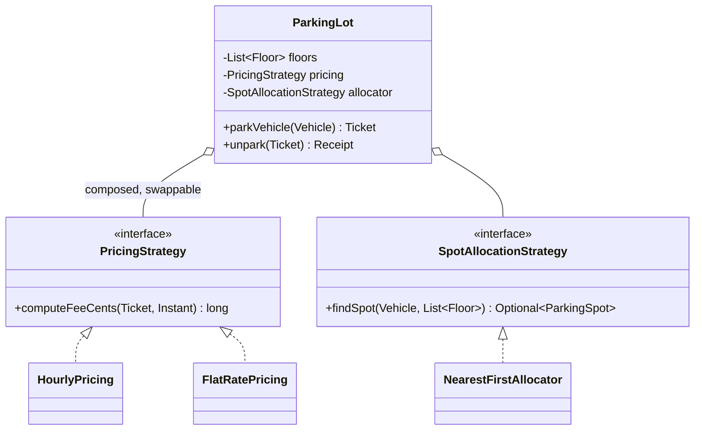
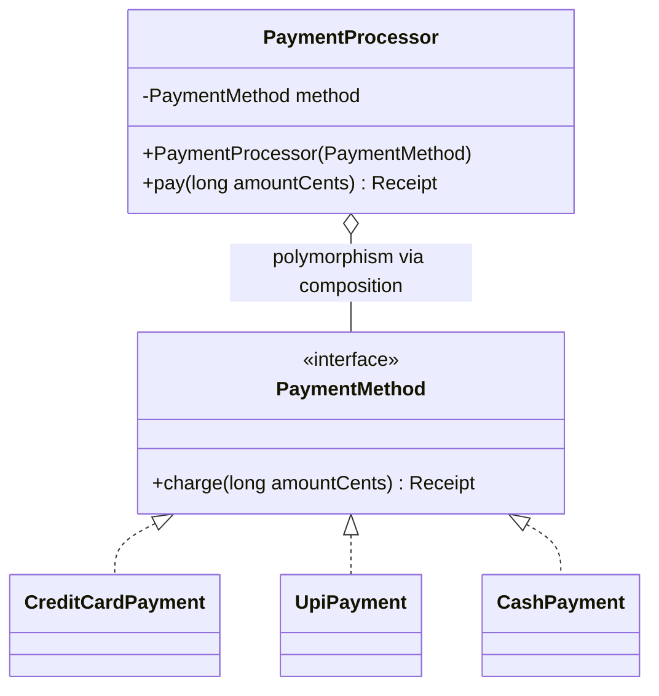

# OOP Principles & Pillars

Every LLD interview — parking lot, elevator, Splitwise — is ultimately graded on the same
four pillars: **encapsulation, abstraction, inheritance, polymorphism**. Interviewers rarely
ask "define encapsulation"; instead they watch whether your parking lot exposes a public
`List<Spot>` for callers to mutate, whether your elevator hides its scheduling behind an
interface, whether you bolt `PremiumParkingLot extends ParkingLot` onto the design or
compose a pricing strategy in. This topic teaches each pillar the way it shows up in a
45–90 minute design session: a short violation, the fix, and the sentence you say out loud
to earn the signal.

The pillars are also the foundation for SOLID (covered in its own topic) and for the GoF
patterns (covered in the `dp-*` topics). Here we reference patterns by name where a pillar
manifests as one — e.g., Strategy *is* polymorphism productized — but we don't re-teach them.

## Why Pillars Matter in a 45-Minute Session

In a machine-coding round you have no time to refactor. The pillars are how you get the
design right on the *first* pass:

- **Encapsulation** decides your public API surface. Get it wrong and every follow-up
  ("now add X") forces edits in five files instead of one.
- **Abstraction** decides where the seams are. Interviewers probe seams with "now swap the
  pricing model" — if pricing is behind an interface, that's a one-class answer.
- **Inheritance vs composition** is the single most common trap. Reaching for `extends` to
  share code (rather than to model a true is-a substitutable relationship) is the classic
  mid-level mistake interviewers screen for.
- **Polymorphism** is how you kill `if/else` chains. Every `switch (vehicleType)` in your
  code is a place the interviewer will ask "and when we add a new type?" — the polymorphic
  answer is "add a class", the procedural answer is "edit every switch".

A practical habit: as you name each class, say its responsibility in one sentence and what
it *hides*. That single narration demonstrates all four pillars without a single definition.

## Encapsulation

Encapsulation = bundling state with the behavior that operates on it, and **hiding the
representation** so invariants can't be broken from outside. The mechanical part is access
modifiers (`private` fields, minimal `public` methods); the design part is *information
hiding* — callers depend on what an object **does**, never on how it stores things.

Violation — the "anemic" object that leaks its internals:

```java
// VIOLATION: BankAccount is a dumb data bag; every caller re-implements the rules
public class BankAccount {
    public double balance;                 // public mutable state
    public List<Transaction> transactions; // callers can clear() this!
}

// somewhere else, business logic scattered across callers:
if (account.balance >= amount) {
    account.balance -= amount;             // forgot to record a transaction — invariant broken
}
```

Fixed — state is private, invariants live next to the data:

```java
public class BankAccount {
    private long balanceCents;                       // int cents, never double for money
    private final List<Transaction> transactions = new ArrayList<>();

    public void withdraw(long amountCents) {
        if (amountCents <= 0) throw new IllegalArgumentException("amount must be positive");
        if (amountCents > balanceCents) throw new InsufficientFundsException();
        balanceCents -= amountCents;
        transactions.add(Transaction.withdrawal(amountCents));   // invariant enforced HERE
    }

    public long getBalanceCents() { return balanceCents; }       // read-only view is fine
    public List<Transaction> getTransactions() {
        return Collections.unmodifiableList(transactions);       // never leak the mutable list
    }
}
```

Rules of thumb that score in interviews:

- **Fields are `private` by default.** Widen visibility only with a reason you can say aloud.
- **A getter that returns a mutable internal (a `List`, a `Map`, a mutable object) is a
  violation** even though the field is private — the caller can mutate your state behind
  your back. Return an unmodifiable view or a copy.
- **Getter/setter pairs for every field ≈ no encapsulation.** `setBalance()` on an account
  is a bug factory; `withdraw()`/`deposit()` express the domain and guard invariants.
- Encapsulate what varies: if the interviewer might change it in a follow-up (pricing rules,
  spot-allocation policy), hide it behind one class now.

## Tell, Don't Ask

The behavioral face of encapsulation. Don't **ask** an object for its data, make the
decision outside, and write results back — **tell** the object what you want and let it
decide using its own state.

Violation — logic that belongs to `ParkingSpot` leaks into the caller:

```java
// VIOLATION: caller interrogates the spot, decides, and mutates it
if (spot.isFree() && spot.getSize().fits(vehicle.getSize()) && !spot.isReserved()) {
    spot.setVehicle(vehicle);
    spot.setFree(false);
}
```

Fixed — one message, the spot guards its own invariants:

```java
// Caller tells; ParkingSpot decides
boolean parked = spot.tryPark(vehicle);   // all checks + mutation inside ParkingSpot
```

Why interviewers care: the ask-style version must be **duplicated at every call site**, and
each duplicate is a chance to forget a check (a race, too, once threads arrive — the
check-then-act spans two calls). The tell-style version gives you one method to make
atomic (`synchronized` or a lock inside `tryPark`) when the concurrency follow-up comes.

Heuristic: a chain like `a.getB().getC().doThing()` (a Law-of-Demeter smell) or a cluster of
getters feeding an `if` that then calls setters means the logic is in the wrong class —
move it to the object that owns the data.

## Abstraction

Abstraction = exposing a minimal, intention-revealing contract and hiding the complexity
behind it. Where encapsulation hides *state*, abstraction hides *mechanism*: callers of a
`NotificationService` shouldn't know whether it batches, retries, or talks SMTP.

In Java the tools are **interfaces** and **abstract classes**. The design skill is choosing
the *right* seam — the axis along which requirements will change:

```java
// The seam: HOW a fee is computed will change (hourly, flat, weekend surge...)
public interface PricingStrategy {
    long computeFeeCents(Ticket ticket, Instant exitTime);
}

// The lot depends on the abstraction, never a concrete pricing class
public class ParkingLot {
    private final PricingStrategy pricing;              // injected — swappable in one line
    public ParkingLot(PricingStrategy pricing) { this.pricing = pricing; }
}
```

Violation — a leaky abstraction that names its mechanism:

```java
// VIOLATION: the contract exposes implementation detail; swapping storage breaks callers
public interface TicketStore {
    HashMap<String, Ticket> getInternalMap();   // leaks the data structure
    void writeToMySql(Ticket t);                // leaks the backend
}
```

Fixed:

```java
public interface TicketStore {
    void save(Ticket t);
    Optional<Ticket> findById(String ticketId);
}
```

Interview guidance: **don't abstract everything.** An interface with exactly one conceivable
implementation (`ParkingLotImpl implements IParkingLot`) is ceremony, not abstraction, and
costs you time. Create an abstraction where you can name ≥2 plausible variants (hourly vs
flat pricing, email vs SMS notification) or where the interviewer's follow-ups will land.

## Abstract Classes vs Interfaces

Both create abstractions; they answer different questions.

| Dimension | Interface | Abstract class |
|---|---|---|
| Models | a **capability / contract** ("can price", "can notify") | a **partial implementation** of an is-a family |
| State | no instance fields (constants only) | can hold fields, constructors, invariants |
| Multiple? | a class can implement many | single inheritance only — you spend your one `extends` |
| Default behavior | `default` methods (Java 8+), but no state to support them | full methods sharing protected state |
| Typical pattern | Strategy, Observer contracts | Template Method skeletons |

Decision rule for interviews:

- **Default to an interface.** It's the loosest coupling and doesn't burn the subclass's
  single `extends` slot.
- Use an **abstract class** when variants genuinely share *state and partial behavior* —
  e.g., an abstract `Vehicle` holding `licensePlate` and a `Piece` base in chess holding
  `color` and `position`, with `abstract boolean canMove(...)` left to subclasses.
- The two compose: `abstract class AbstractCache implements Cache` — contract in the
  interface, shared plumbing in the abstract class, specifics (eviction policy) in
  subclasses or an injected strategy.

Since Java 8 `default` methods narrowed the gap, but the essential difference stands:
**interfaces cannot hold per-instance state**. If shared code needs a field, you need an
abstract class — or better, extract the shared code into a component and compose it.

## Inheritance

Inheritance (`extends`) creates an **is-a** relationship: the subclass inherits the parent's
contract and implementation, may **override** methods, and can reuse the parent via `super`.
It is the strongest coupling in OO — the subclass depends on its parent's *implementation
details*, not just its interface — so it must be reserved for true, substitutable is-a.

The test is not grammar ("a Car is-a Vehicle" sounds right) but **substitutability** — the
Liskov preview: *can every caller holding a `Vehicle` be handed your subclass without
surprises?* If the subclass must throw `UnsupportedOperationException`, weaken a guarantee,
or stub methods out, it is not an is-a, whatever English says.

Violation — inheriting for code reuse, not substitutability:

```java
// VIOLATION: "a HandicappedSpot is-a CompactSpot"? No — it inherits to steal size checks
public class HandicappedSpot extends CompactSpot {
    @Override
    public boolean tryPark(Vehicle v) {
        if (!v.hasHandicapPermit()) throw new UnsupportedOperationException(); // LSP alarm
        return super.tryPark(v);
    }
}
```

Fixed — model the actual variation:

```java
public class ParkingSpot {
    private final SpotSize size;
    private final Set<Permit> requiredPermits;   // data + composition, not a subclass per rule
    public boolean canFit(Vehicle v) {
        return size.fits(v.getSize()) && v.getPermits().containsAll(requiredPermits);
    }
}
```

Legitimate inheritance in LLD problems does exist: `Piece` → `King`/`Knight` in chess
(every piece is substitutable wherever a `Piece` is moved), abstract `Vehicle` →
`Car`/`Truck` when they share state and every operation applies to all. Keep hierarchies
**shallow** (1–2 levels); deep trees are a smell.

Also remember: overriding is not overloading. `@Override` replaces the parent's behavior for
that method and is dispatched at runtime by the object's actual class; always annotate with
`@Override` so a typo becomes a compile error instead of a silent overload.

## The Fragile Base Class Problem

Why implementation inheritance is dangerous even when is-a holds: a subclass can silently
depend on *how* the parent is implemented, so an innocent change to the parent breaks
subclasses that never changed.

The classic (from *Effective Java*, Item 18):

```java
// Count elements ever added — by extending HashSet
public class InstrumentedSet<E> extends HashSet<E> {
    private int addCount = 0;

    @Override public boolean add(E e) { addCount++; return super.add(e); }

    @Override public boolean addAll(Collection<? extends E> c) {
        addCount += c.size();
        return super.addAll(c);      // HashSet.addAll calls add() internally...
    }                                // ...which is OUR add() — every element counted TWICE
}
```

The bug exists because the subclass depends on an undocumented detail (`addAll` delegates to
`add`). If a future JDK changes that, the "fix" of removing the `addCount += c.size()` line
breaks instead. The subclass and parent are locked in an invisible embrace — this is why
**self-use is part of the inherited API** and why `extends` across a boundary you don't own
is a liability.

The fix is composition — a **forwarding wrapper** (this is also the Decorator pattern's
skeleton, see `dp-decorator`):

```java
public class InstrumentedSet<E> implements Set<E> {
    private final Set<E> inner;                 // HAS-A, not IS-A
    private int addCount = 0;
    public InstrumentedSet(Set<E> inner) { this.inner = inner; }

    public boolean add(E e) { addCount++; return inner.add(e); }
    public boolean addAll(Collection<? extends E> c) {
        addCount += c.size();
        return inner.addAll(c);                 // inner's self-calls stay INSIDE inner
    }
    // ...forward the rest to inner
}
```

Now `inner.addAll`'s internal calls dispatch to `inner`'s own methods, not ours — no double
count, and it works wrapping *any* `Set` implementation.

## Prefer Composition Over Inheritance

The most quotable design rule in the round, and the reasoning behind it:

1. **Inheritance is compile-time and static** — a class gets exactly one parent, fixed
   forever. Composition is **runtime and swappable**: inject a different collaborator per
   instance, or change it mid-flight.
2. **Inheritance breaks encapsulation** (fragile base class above); composition talks to
   collaborators only through their public API.
3. **Inheritance multiplies classes combinatorially.** Variants on two axes as subclasses:
   `CompactCoveredSpot`, `CompactOpenSpot`, `LargeCoveredSpot`… n×m classes. Composed:
   one `ParkingSpot` holding a `SpotSize` and a `CoverType` — n+m parts.

The litmus question: *am I extending to be substitutable (is-a), or to reuse code /
configure a variant?* Only the first justifies `extends`; the second wants a field.



Contrast with the inheritance version — `PremiumParkingLot extends ParkingLot` overriding
`computeFee()` — which hard-wires one pricing model per lot class, can't switch a lot to
weekend pricing at runtime, and reopens the lot class for every new rule.

Composition's relationship flavors (worth naming on your diagram):

- **Composition** (filled diamond, owns lifecycle): `ParkingLot` *owns* its `Floor`s — they
  die with the lot.
- **Aggregation** (hollow diamond, shared lifecycle): a `Floor` aggregates the `Vehicle`s
  currently parked — vehicles exist independently.
- **Association/dependency**: `ParkingLot` *uses* a `PricingStrategy` handed to it.

Inheritance is not banned — it's the sharpest tool in the box, to be used where is-a is
real and the hierarchy is shallow. "Prefer" means: when both would work, compose.

## Polymorphism

Polymorphism = one message, many behaviors — callers program against a supertype and the
right implementation runs based on the actual object. It is the pillar that converts
type-`switch`es into pluggable classes, which is exactly what "extensible design" means in
this round.

Violation — the procedural type-switch every interviewer is waiting to catch:

```java
// VIOLATION: every new vehicle type reopens this method (and its siblings)
public long feeCents(Vehicle v, Duration d) {
    switch (v.getType()) {
        case CAR:   return d.toHours() * 200;
        case BIKE:  return d.toHours() * 50;
        case TRUCK: return d.toHours() * 350;
        default: throw new IllegalArgumentException();
    }
}
```

Fixed — dispatch replaces selection:

```java
public abstract class Vehicle {
    public abstract long hourlyRateCents();
}
public class Car extends Vehicle   { public long hourlyRateCents() { return 200; } }
public class Bike extends Vehicle  { public long hourlyRateCents() { return 50; }  }
public class Truck extends Vehicle { public long hourlyRateCents() { return 350; } }

// caller — closed for modification, open for extension (OCP preview):
long fee = d.toHours() * vehicle.hourlyRateCents();   // adding Bus = add a class, edit nothing
```

The runtime mechanism is **dynamic dispatch**: the JVM selects the override via the object's
actual class (conceptually a vtable lookup) at the moment of the call, regardless of the
static type of the reference. `Vehicle v = new Truck(); v.hourlyRateCents()` runs `Truck`'s
method — the *reference type* only limits which methods you may call; the *object type*
decides which body runs.

**Interface polymorphism** is the LLD workhorse: unrelated classes can satisfy the same
contract without sharing an ancestor (`CreditCardPayment`, `UpiPayment`, `CashPayment` all
`implements PaymentMethod`). This is more flexible than class polymorphism because it
doesn't spend the `extends` slot and crosses class hierarchies.

Note: fields and `static` methods are **not** polymorphic in Java — they resolve by the
reference's static type (static methods are *hidden*, not overridden). Only instance methods
dispatch dynamically.

## Compile-Time vs Runtime Polymorphism

Two mechanisms share the name; only one of them is a design tool.

| | Compile-time (overloading) | Runtime (overriding) |
|---|---|---|
| Resolved | at compilation, by **static types of the arguments** | at runtime, by the **actual class of the receiver** |
| Declared via | same method name, different parameter lists, same class | same signature, subclass + `@Override` |
| Return type | may differ freely | must be covariant (same or subtype) |
| Design value | convenience API (`park(Vehicle)`, `park(Vehicle, Preference)`) | **extensibility** — the pillar itself |

The classic trap: overload resolution ignores runtime types.

```java
void handle(Vehicle v) { System.out.println("vehicle"); }
void handle(Truck t)   { System.out.println("truck"); }

Vehicle v = new Truck();
handle(v);        // prints "vehicle" — overload chosen from the STATIC type of v
```

If behavior must vary by the object's real type, use overriding (put `handle()` *on* the
type) — or you're reaching for double dispatch / Visitor (see `dp-visitor`). In an
interview, when you say "polymorphism" as a design justification, you mean **runtime**
polymorphism; overloading never made a design extensible.

## Strategy Pattern as Polymorphism in Action

The Strategy pattern (full treatment in `dp-strategy`) is nothing more than interface
polymorphism plus composition, packaged: define the varying algorithm as an interface,
implement each variant as a class, and **compose** the chosen one into the context.



Why this beats the two alternatives you'd otherwise write:

- **vs an if/else chain on a payment-type enum**: adding PayPal means editing (and
  re-testing) the processor — a modification. With Strategy it's a new class — an extension.
- **vs subclassing the context** (`UpiPaymentProcessor extends PaymentProcessor`): burns
  inheritance on one axis of variation; two axes (payment × refund policy) explode
  combinatorially, and you can't switch method at runtime.

This trio — pillar (polymorphism) → principle (open/closed, encapsulate what varies) →
pattern (Strategy) — is the single most reusable argument in the whole round. Pricing,
allocation, eviction (LRU/LFU in the cache problem), split rules in Splitwise, rate-limit
algorithms: same shape every time.

## Pillars on the Whiteboard: a Checklist

A self-review to run in the last five minutes of any design (or while narrating):

- **Encapsulation**: any `public` fields? Any getter returning a mutable collection? Any
  setter that can break an invariant (`setBalance`, `setState` from outside)?
- **Tell-don't-ask**: any call site doing `get → decide → set` on another object's data?
  Move that logic inside.
- **Abstraction**: does every interface earn its keep (≥2 plausible implementations or a
  named follow-up)? Any interface leaking `HashMap`/SQL/transport details?
- **Inheritance**: is every `extends` a substitutable is-a? Any subclass throwing
  `UnsupportedOperationException`? Hierarchy deeper than ~2 levels?
- **Composition**: are the axes of variation (pricing, allocation, notification) fields
  typed as interfaces, injectable via constructor?
- **Polymorphism**: any `switch`/`if-else` on a type tag or enum that grows when a new
  variant arrives? Replace with dispatch or a strategy.

Narrating even three of these checks out loud ("I'm returning an unmodifiable list so
callers can't corrupt inventory") is a strong senior signal — it shows the pillars are
reflexes, not trivia.

## Common Interview Follow-ups

- **"Your `Vehicle` has getType() and a switch downstream — what happens when I add `EV`
  with charging needs?"** — Replace the switch with polymorphism: behavior moves onto
  `Vehicle` subclasses or into a strategy keyed by capability, so `EV` is a new class plus
  a new strategy, zero edits to existing logic.
- **"Why is `PricingStrategy` an interface and `Vehicle` an abstract class?"** —
  `PricingStrategy` is a stateless capability with many implementations (interface);
  vehicles share state (`plate`, `size`) and partial behavior worth one shallow is-a
  hierarchy (abstract class). Be ready to defend each seam individually.
- **"Could `Square` extend `Rectangle`?"** — The canonical LSP question: no — callers of
  `Rectangle` may `setWidth` independently of height; `Square` breaks that expectation.
  Substitutability, not English is-a, decides inheritance. (Full treatment in the SOLID
  topic.)
- **"You exposed `getSpots()` returning the list — how do I reserve a spot?"** — Trap:
  they're inviting you to let callers mutate the list. Answer with tell-don't-ask: add
  `reserveSpot(spotId)` on the lot and return only unmodifiable views.
- **"How would you make `tryPark` thread-safe?"** — Because tell-don't-ask put
  check-and-mutate in *one* method, synchronize there (or a per-spot lock / `AtomicReference`);
  the ask-style design can't be fixed without changing every caller.
- **"Interface with one implementation — why does it exist?"** — Either name the concrete
  second variant a follow-up would need, or concede and inline it. Both answers score;
  hand-waving "for flexibility" doesn't.
- **"Show me composition and aggregation on your diagram."** — Lot–Floor is composition
  (owned lifecycle, filled diamond); Floor–Vehicle is aggregation (independent lifecycle,
  hollow diamond); Lot–PricingStrategy is an injected dependency.

## References

- Joshua Bloch, *Effective Java* (3rd ed.) — Item 18 "Favor composition over inheritance",
  Item 19 "Design and document for inheritance or else prohibit it", Item 15 "Minimize
  accessibility", Item 64 "Refer to objects by their interfaces".
- Gamma, Helm, Johnson, Vlissides, *Design Patterns* — "Program to an interface, not an
  implementation"; "Favor object composition over class inheritance" (the two GoF mottos).
- Robert C. Martin, *Agile Software Development* — LSP and OCP chapters (previewed here,
  full treatment in the SOLID topic).
- Andy Hunt & Dave Thomas, *The Pragmatic Programmer* — "Tell, Don't Ask" and the Law of
  Demeter.
- Related topics in this library: `solid-principles` (deep dive on LSP/OCP), `dp-strategy`,
  `dp-decorator`, `dp-template-method`, and every `design-*` problem topic where these
  pillars are applied.
