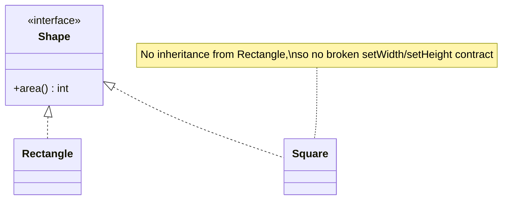
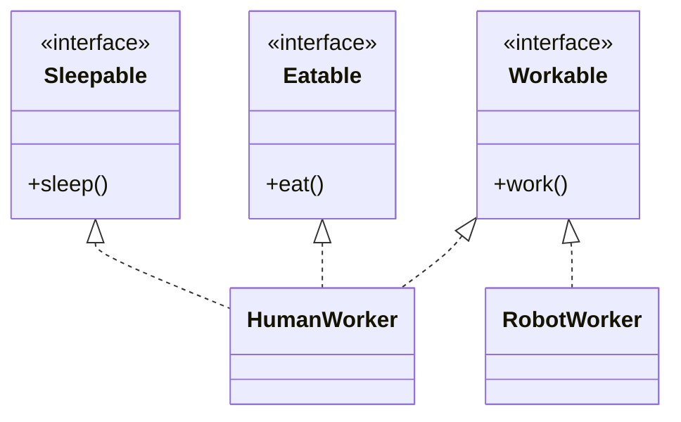
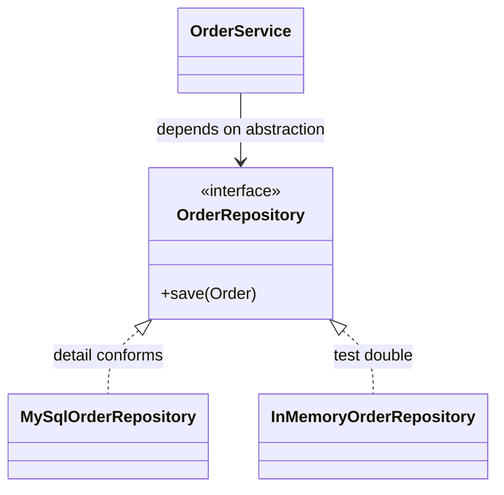
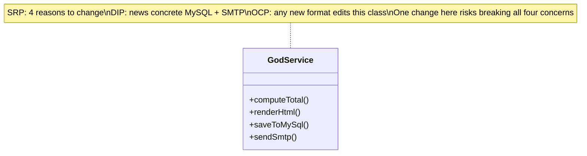

# SOLID Principles Deep Dive

SOLID is the five-letter checklist interviewers run against your class design in the
machine-coding round. It is not academic — each letter names a *specific failure mode* that
shows up when the interviewer says "now also support trucks / percentage splits / a second
payment provider" and your code either flexes or shatters. This topic teaches each principle
with **before/after Java** (violation vs. fix), then shows how the five compound into rigid,
fragile, immobile code — and how to use them as a live checklist while you design.

> [!INTERVIEW]
> Interviewers rarely ask "recite SOLID." They *watch for it*: they add a requirement and
> see whether you modify existing, working classes (OCP smell) or add a new one. Narrating
> "to stay open/closed I'll add a new strategy rather than edit the switch" is a strong
> senior signal.

## What SOLID Buys You

The five principles (coined by Robert C. Martin; the acronym by Michael Feathers) all serve
one goal: **localize change**. Good OO design means a new requirement touches few classes,
and the classes it touches are the *obvious* ones. Bad design has three symptoms, and each
SOLID principle attacks one or more of them:

- **Rigidity** — one change forces a cascade of edits in unrelated modules. (Attacked by SRP, OCP.)
- **Fragility** — a change in one place breaks something far away and unrelated. (SRP, LSP.)
- **Immobility** — you cannot reuse a class elsewhere because it drags irrelevant dependencies. (ISP, DIP.)

| Letter | Principle | One-line test |
|---|---|---|
| **S** | Single Responsibility | "How many *reasons to change* does this class have?" Should be one. |
| **O** | Open/Closed | "Can I add a variant *without editing* existing code?" |
| **L** | Liskov Substitution | "Can I pass any subtype where the base is expected and nothing breaks?" |
| **I** | Interface Segregation | "Is any implementer forced to stub a method it doesn't need?" |
| **D** | Dependency Inversion | "Does my high-level policy `new` a concrete class, or receive an abstraction?" |

> [!KEY-TAKEAWAY]
> SOLID is a means, not an end. The end is code where change is cheap and local. If applying
> a principle makes change *harder* (needless abstraction, YAGNI violation), you have
> over-applied it. Interviewers reward judgment, not dogma.

## Single Responsibility Principle

**SRP: a class should have one, and only one, reason to change.** A "reason to change" maps
to an *actor* or *concern* — a business rule, a persistence format, a report layout. The
classic violation is a class that mixes **business logic + I/O + presentation**.

Violation — `Invoice` computes totals, formats a report, *and* saves to disk:

```java
class Invoice {
    private final List<LineItem> items;

    double total() {                       // business rule — changes when tax rules change
        return items.stream().mapToDouble(LineItem::amount).sum() * 1.18;
    }

    String toHtml() {                      // presentation — changes when the report layout changes
        return "<h1>Invoice</h1>...";
    }

    void saveToFile(String path) throws IOException {   // persistence — changes when storage changes
        Files.writeString(Path.of(path), toHtml());
    }
}
```

Three actors (finance, design, ops) all have edit rights to one file. A layout tweak risks
breaking the tax calculation; the class is impossible to unit-test without touching the disk.

Fix — separate each concern into its own class:

```java
class Invoice {                            // pure domain: only tax/pricing rules change it
    private final List<LineItem> items;
    Money total(TaxPolicy tax) { return tax.apply(subtotal()); }
    Money subtotal() { /* sum items */ }
}

class InvoiceRenderer {                    // presentation only
    String toHtml(Invoice inv) { /* ... */ }
}

class InvoiceRepository {                  // persistence only
    void save(Invoice inv) { /* ... */ }
}
```

> [!WARNING]
> SRP is *not* "one method per class." A class can have many methods as long as they serve
> **one cohesive responsibility**. Splitting too aggressively creates anemic classes and
> shotgun surgery — the opposite failure. Cohesion is the real target.

> [!TIP]
> Fast interview heuristic: describe the class in one sentence. If you need "and" ("it
> calculates totals **and** writes files"), you likely have two responsibilities.

## Open Closed Principle

**OCP: software entities should be open for extension but closed for modification.** You
should be able to add new behavior by adding new code, *without editing* existing, tested
code. The tell-tale violation is a `switch`/`if-else` over a type tag that grows every time
a new variant appears.

Violation — adding a shape means editing `AreaCalculator`:

```java
class AreaCalculator {
    double area(Object shape) {
        if (shape instanceof Circle c)      return Math.PI * c.r * c.r;
        else if (shape instanceof Square s) return s.side * s.side;
        // every new shape → edit this method, re-test it, risk breaking the others
        throw new IllegalArgumentException("unknown shape");
    }
}
```

Fix — invert with polymorphism; new shapes plug in without touching the calculator:

```java
interface Shape { double area(); }

record Circle(double r) implements Shape { public double area() { return Math.PI * r * r; } }
record Square(double side) implements Shape { public double area() { return side * side; } }

class AreaCalculator {
    double totalArea(List<Shape> shapes) {  // never edited again when shapes are added
        return shapes.stream().mapToDouble(Shape::area).sum();
    }
}
```

Adding `Triangle` is now a *new file*, not an edit. This is the polymorphism/Strategy move —
see `dp-strategy` in the design-patterns domain for the pattern's full treatment.

> [!INTERVIEW]
> OCP is the principle interviewers probe hardest, because they *always* add a follow-up
> requirement. When they say "now also support X," a design that flexes by adding a class
> (not editing a switch) is what separates mid from senior. Say it out loud: "I'll keep
> this closed for modification by adding a new `Shape` implementation."

> [!WARNING]
> OCP does not mean "never edit code." It means isolate the *variation points* you expect.
> Guessing every possible axis of change up front is YAGNI/over-engineering. Apply OCP where
> the interviewer signals variation (payment types, pricing strategies), not everywhere.

## Liskov Substitution Principle

**LSP: subtypes must be substitutable for their base type** — code written against the base
must work unchanged when handed any subtype. A subtype may not strengthen preconditions,
weaken postconditions, or violate invariants the base promised. When an "is-a" passes the
English test but breaks behaviorally, you have an LSP violation.

The canonical trap — `Square extends Rectangle`:

```java
class Rectangle {
    protected int w, h;
    void setWidth(int w)  { this.w = w; }
    void setHeight(int h) { this.h = h; }
    int area() { return w * h; }
}

class Square extends Rectangle {           // "a square IS-A rectangle" — mathematically true...
    @Override void setWidth(int w)  { this.w = w; this.h = w; }   // ...but forces both sides
    @Override void setHeight(int h) { this.w = h; this.h = h; }
}
```

Client code relying on the `Rectangle` contract now breaks:

```java
void resizeAndCheck(Rectangle r) {
    r.setWidth(5);
    r.setHeight(4);
    assert r.area() == 20;                 // holds for Rectangle, FAILS for Square (area == 16)
}
```

Fix — don't force a broken hierarchy. Model the shared contract, not English "is-a":

```java
interface Shape { int area(); }
record Rectangle(int w, int h) implements Shape { public int area() { return w * h; } }
record Square(int side)        implements Shape { public int area() { return side * side; } }
```

Immutable value types sidestep the mutation contradiction entirely; both simply implement
`Shape`. The lesson: **behavioral substitutability, not taxonomy, decides inheritance.**



> [!TIP]
> Detection heuristic: if a subclass overrides a method to **throw** `UnsupportedOperationException`
> or to **no-op / ignore** arguments the base honored, that is an LSP red flag. (E.g. an
> immutable `Collections.unmodifiableList` throwing on `add` is a well-known LSP wart.)

> [!WARNING]
> A `Penguin extends Bird` with `fly()` that throws is the other classic violation — the fix
> is to segregate the capability (`interface Flyable`), which ties LSP directly to ISP.

## Interface Segregation Principle

**ISP: no client should be forced to depend on methods it does not use.** Prefer many small,
role-focused interfaces over one fat, do-everything interface. A fat interface forces
implementers to stub methods with empty bodies or `throw`, which is *also* an LSP violation.

Violation — a fat `Worker` interface forces a robot to fake eating:

```java
interface Worker {
    void work();
    void eat();
    void sleep();
}

class HumanWorker implements Worker {
    public void work()  { /* ... */ }
    public void eat()   { /* ... */ }
    public void sleep() { /* ... */ }
}

class RobotWorker implements Worker {
    public void work()  { /* ... */ }
    public void eat()   { throw new UnsupportedOperationException(); }  // robots don't eat
    public void sleep() { throw new UnsupportedOperationException(); }  // ISP + LSP violation
}
```

Fix — split by role so each client depends only on what it needs:

```java
interface Workable   { void work(); }
interface Eatable    { void eat(); }
interface Sleepable  { void sleep(); }

class HumanWorker implements Workable, Eatable, Sleepable { /* implements all three */ }
class RobotWorker implements Workable { public void work() { /* ... */ } }   // only what it needs
```



> [!KEY-TAKEAWAY]
> Fat interfaces create *needless coupling*: a change to `eat()` forces `RobotWorker` to
> recompile/redeploy even though it never eats. Role interfaces keep the blast radius of a
> change contained. Java's own `Runnable`, `Comparable`, `Closeable` are ISP done right.

## Dependency Inversion Principle

**DIP: high-level modules should not depend on low-level modules; both should depend on
abstractions. Abstractions should not depend on details; details depend on abstractions.**
The violation smell is a high-level policy class that does `new ConcreteThing()` inside
itself, hard-wiring itself to a specific implementation.

Violation — `OrderService` (high-level policy) hard-codes a concrete MySQL repo and SMTP mailer:

```java
class OrderService {
    private final MySqlOrderRepository repo = new MySqlOrderRepository();  // hard-wired detail
    private final SmtpEmailSender mailer   = new SmtpEmailSender();        // hard-wired detail

    void place(Order o) {
        repo.save(o);
        mailer.send(o.customerEmail(), "Order confirmed");
    }
}
```

`OrderService` now *cannot* be unit-tested without a real database and SMTP server, and
swapping to Postgres or SNS means editing this policy class. High-level depends on low-level.

Fix — depend on abstractions and inject them (constructor injection):

```java
interface OrderRepository { void save(Order o); }
interface Notifier        { void notify(String to, String msg); }

class OrderService {
    private final OrderRepository repo;
    private final Notifier notifier;

    OrderService(OrderRepository repo, Notifier notifier) {   // injected — inverted
        this.repo = repo;
        this.notifier = notifier;
    }

    void place(Order o) {
        repo.save(o);
        notifier.notify(o.customerEmail(), "Order confirmed");
    }
}
```

Now `MySqlOrderRepository` / `PostgresOrderRepository` / an in-memory test double all
implement `OrderRepository`; the policy never changes. Note the **inversion**: the interface
is owned by (and defined for) the high-level policy, and the low-level detail conforms to it.



> [!WARNING]
> DIP is not the same as Dependency Injection. DIP is the *principle* (depend on abstractions);
> DI (constructor/setter injection) and IoC containers (Spring) are *mechanisms* that achieve
> it. You can honor DIP with a manual factory and no framework at all.

> [!TIP]
> DIP is what makes your LLD code **testable in a 45-minute round without a database**. If an
> interviewer asks "how would you test this?", an injected `InMemoryRepository` is the answer
> — and only possible if you inverted the dependency.

## How the Violations Compound

The five principles are not independent — a violation of one usually drags in others, which
is why a small design smell metastasizes into rigid, fragile, immobile code:

- An **SRP** violation (a class doing I/O + logic) makes it hard to keep **OCP** — you end up
  editing the mega-class for every kind of change.
- A **fat interface** (ISP violation) forces implementers to `throw UnsupportedOperationException`,
  which is simultaneously an **LSP** violation (subtype isn't substitutable).
- A **DIP** violation (`new Concrete()` in high-level code) freezes the design against **OCP**:
  you cannot extend by swapping implementations because the concrete type is hard-wired.



> [!KEY-TAKEAWAY]
> This compounding is why interviewers treat SOLID as a *system*. Fixing the root SRP/DIP
> violation early (separate concerns, inject abstractions) tends to make the other principles
> fall out naturally. Chasing them one at a time after the fact is far more work.

## SOLID as an Interview Checklist

Under time pressure you won't recite definitions — you run a quick mental pass at two moments:
**after sketching your classes**, and **each time the interviewer adds a requirement.**

The pass, in order:

1. **S — one reason to change?** Point at each class: is it mixing domain logic with I/O or
   presentation? If yes, split.
2. **O — will the new requirement force an edit?** If adding "trucks" or "percentage split"
   means editing a `switch`, refactor to a Strategy/polymorphic type *before* adding it.
3. **L — are my subtypes truly substitutable?** Any overridden method that throws or ignores
   its arguments? Reconsider the hierarchy (favor composition / separate abstractions).
4. **I — is any implementer stubbing methods?** Split fat interfaces into role interfaces.
5. **D — does high-level code `new` a concrete?** Extract an interface and inject it; it
   also makes the design testable, which is your answer to "how would you test this?"

> [!INTERVIEW]
> Narrate the checklist as you design. Saying "let me make sure this stays open/closed — I'll
> add a `PricingStrategy` instead of another `if`" shows the interviewer your judgment in real
> time. That narration, more than a perfect final diagram, is what earns the senior signal.

> [!WARNING]
> Don't over-apply. Introducing five interfaces for a problem with one implementation is
> speculative generality (YAGNI). Apply a principle when there's a *concrete* second variant or
> a *stated* need for testability/extension — not preemptively. Judgment > dogma.

## Common Interview Follow-ups

- **"Which SOLID principle does this violate?"** — Learn the smells: `switch` on type → OCP;
  `new Concrete()` in policy code → DIP; overridden method throws → LSP (and often ISP); a
  class you describe with "and" → SRP; implementer stubbing unused methods → ISP.
- **"Fix this without modifying the existing class."** — The OCP answer: add a new subtype /
  strategy implementing an existing interface, and (if needed) inject it via DIP.
- **"Isn't a square a rectangle?"** — Behavioral substitutability, not English taxonomy,
  governs inheritance. Model a shared `Shape` abstraction; immutability removes the mutation
  contradiction.
- **"Difference between DIP and dependency injection?"** — DIP is the principle (depend on
  abstractions); DI is one mechanism to satisfy it. You can honor DIP without a framework.
- **"Doesn't SOLID lead to too many tiny classes?"** — Only if over-applied. The goal is
  localized change and cohesion; apply at real variation points, not speculatively (YAGNI).
- **"How does SOLID relate to design patterns?"** — Patterns are concrete recipes that
  *embody* SOLID: Strategy/Template Method achieve OCP, Adapter/Bridge achieve DIP, etc. See
  the design-patterns (`dp-*`) domain for the taxonomy.
- **"How does SRP relate to cohesion and coupling?"** — SRP maximizes cohesion (one concern
  per class) and, combined with DIP/ISP, minimizes coupling. See `design-principles-beyond-solid`.

## References

- Robert C. Martin — *Agile Software Development, Principles, Patterns, and Practices* (the
  original SOLID essays) and *Clean Architecture*.
- Robert C. Martin — "The Principles of OOD" (butunclebob.com / cleancoder.com articles on SRP, OCP, LSP, ISP, DIP).
- Barbara Liskov & Jeannette Wing — "A Behavioral Notion of Subtyping" (1994), the formal LSP.
- Bertrand Meyer — *Object-Oriented Software Construction* (origin of the Open/Closed Principle).
- Freeman & Freeman — *Head First Design Patterns* (SOLID applied through patterns).
- Related topics in this library: `oop-principles-pillars`, `design-principles-beyond-solid`,
  `uml-class-diagrams`, and the `dp-*` design-patterns domain.
