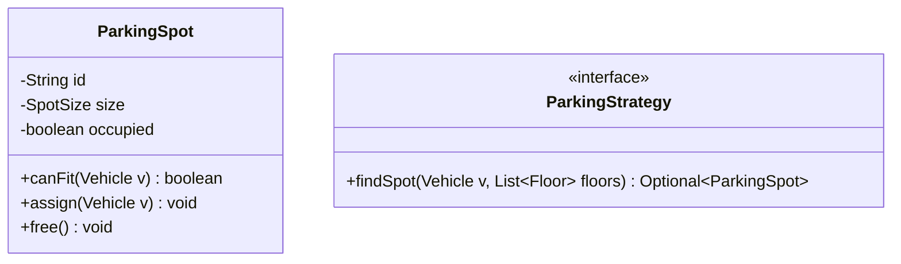
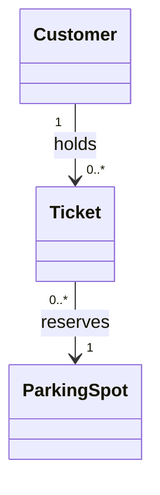
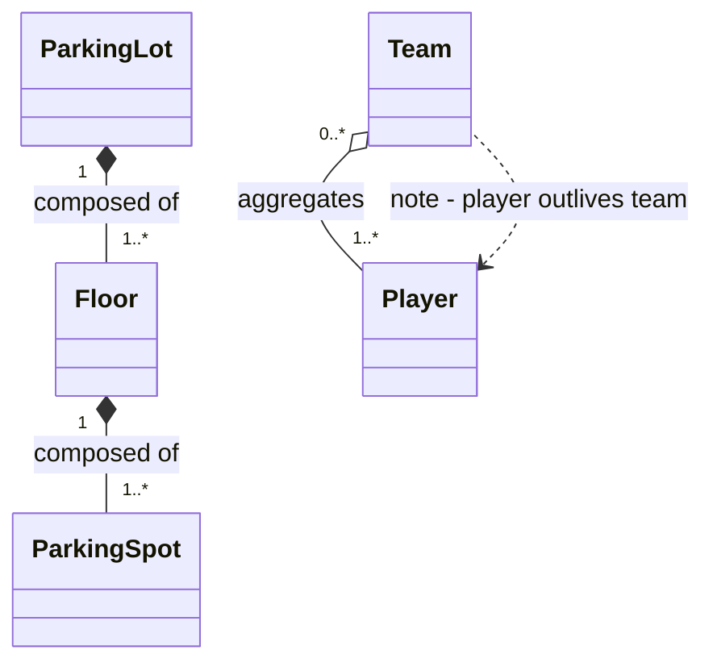
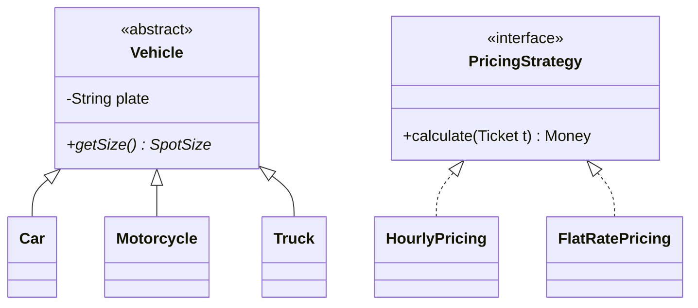
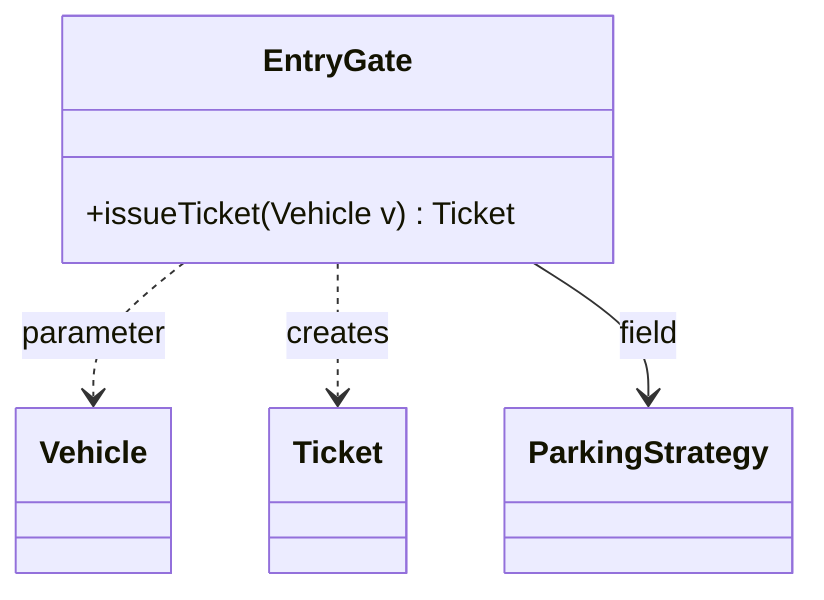
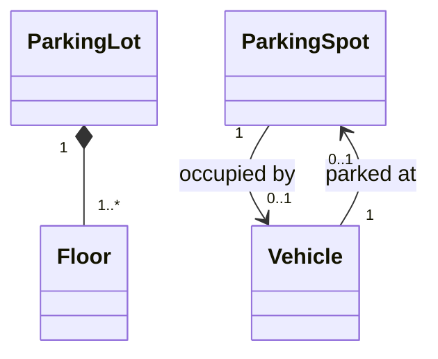
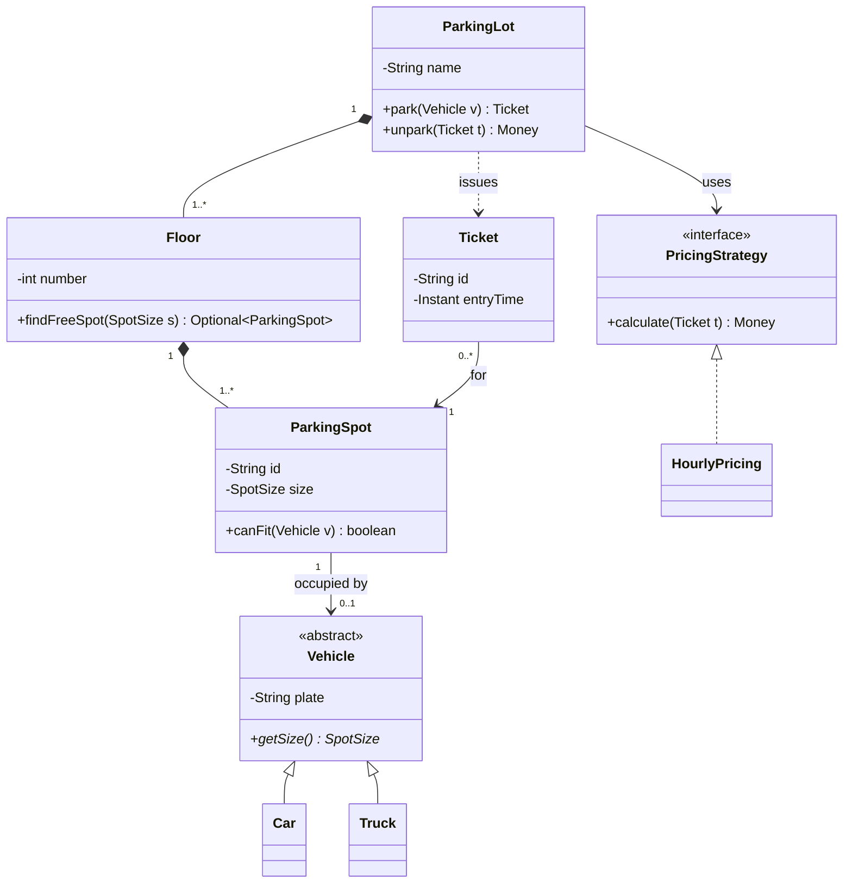

# UML Class Diagrams for Interviews

You will never be asked to "draw UML" in an LLD round — but you will absolutely be asked to
"sketch your classes before you code," and the interviewer will read that sketch using UML
conventions whether you know them or not. Get the arrows wrong and you silently claim things
you don't mean ("a `ParkingSpot` *inherits from* `ParkingLot`?"). This topic teaches the
**interview subset** of UML class diagrams: the six relationship lines, multiplicity, and a
fast nouns→classes method — all expressed in Mermaid `classDiagram` syntax, the same notation
used throughout this study site and in most modern docs.

This is a foundational topic. The problem topics (`design-parking-lot`, `design-elevator-system`,
etc.) apply this notation; the `dp-*` topics own the patterns themselves. Here we only care
about *drawing structure clearly and quickly*.

## Why Class Diagrams Matter in a 45-Minute Session

In a machine-coding round the diagram is not documentation — it is your **design contract
with the interviewer**, drawn in the first 10 minutes so the remaining 35 go into code that
was already agreed on. Three concrete payoffs:

1. **It front-loads the feedback loop.** If the interviewer disagrees with your structure,
   you want that disagreement while it costs 30 seconds of eraser, not 20 minutes of refactor.
   A diagram invites "why is `Payment` inside `Ticket`?" *before* you've written either class.
2. **It exposes your relationship reasoning.** The difference between "a `ParkingLot` *has*
   floors" (composition) and "a `Ticket` *references* a spot" (association) is exactly the
   signal senior interviewers grade: do you know who owns whom, who outlives whom, and what
   dies together.
3. **It becomes your coding TODO list.** Every box is a file; every method in a box is a
   signature you've already committed to. Candidates who sketch first rarely thrash on naming
   or "wait, where does this method live?" mid-round.

What it is **not**: full UML 2.5. Nobody in an interview wants stereotypes on every class,
association classes, qualified associations, or OCL constraints. The bar is: *another engineer
can read your board and reconstruct your class files*.

> [!INTERVIEW]
> Narrate while you draw: "solid diamond here because a `Floor` can't exist without its
> `ParkingLot` — if the lot goes, the floors go." One sentence per line you draw converts a
> silent sketch into continuous design signal.

## What to Draw and What to Skip

Interview-grade means ruthless triage. For each class show only:

- **Name** — and a `<<interface>>` or `<<abstract>>` marker when it matters.
- **2–4 key attributes** — the ones that define identity or state (`id`, `status`, `capacity`).
  Skip timestamps, audit fields, and anything obvious.
- **2–4 key methods** — the public API that other classes call (`park(vehicle)`, `unpark(ticket)`).
  Skip getters/setters entirely; they are noise.

And for the diagram as a whole:

| Draw | Skip |
|---|---|
| Domain entities and their relationships | DTOs, mappers, config, loggers |
| Interfaces that create seams (Strategy, Repository) | Every concrete strategy if there are 5 — draw 2 and say "…and siblings" |
| Multiplicity where it's a design decision (`1` vs `*`) | Multiplicity that's obvious or irrelevant |
| The 5–8 classes at the heart of the problem | Enterprise scaffolding (controllers, DI wiring) |

A good interview diagram has **5–10 boxes**. Fewer usually means a god class is hiding work;
more usually means you're modeling fields as classes or drawing infrastructure.

> [!TIP]
> If you catch yourself drawing a class with no behavior (only fields) ask: is this really
> a class, or an attribute of another class? `Address` with validation logic is a class;
> `Color` with one string field is probably just an attribute or an enum.

## Drawing a Class: Name, Attributes, Methods

A UML class is a three-compartment box: **name**, **attributes**, **operations**. Visibility
markers: `+` public, `-` private, `#` protected, `~` package. In Mermaid:



Conventions worth following even on a whiteboard:

- Attributes as `visibility name: Type` (UML) or `visibility Type name` (Mermaid/Java-style) —
  either is fine, just be consistent.
- Mermaid puts the **return type after** the method: `+canFit(Vehicle v) boolean`.
- Mark interfaces with `<<interface>>` and abstract classes with `<<abstract>>`; in strict UML
  abstract members are *italicized*, which you can't do on a whiteboard — the stereotype
  annotation is the practical substitute.
- Static members get an underline in UML; Mermaid uses a `$` suffix (`+getInstance()$`),
  abstract methods a `*` suffix.
- Generics in Mermaid use tildes: `List~Ticket~`, because `<` `>` collide with arrow syntax.

Default to `-` (private) for state and `+` (public) only for the API you intend other classes
to call — the diagram should *show* encapsulation, not just claim it.

## Association

Association is the plain "knows-about / has-a" relationship: a **solid line**, optionally with
an arrowhead showing navigability (who can reach whom). It implies a durable structural link —
typically a field — but **no ownership or lifecycle claim**.



Read `Ticket --> ParkingSpot` as: a `Ticket` holds a reference to a `ParkingSpot`; the spot
neither knows nor cares. Key properties:

- **Both objects have independent lifecycles.** Deleting a `Ticket` must not delete the spot.
- **Direction = navigability.** `A --> B` means A has a field of type B. A plain line
  `A -- B` leaves navigability unspecified (or bidirectional) — acceptable early in a sketch,
  but pick a direction before coding, because bidirectional references are a maintenance tax
  (two fields to keep consistent).
- Label the line with a verb (`reserves`, `holds`, `drives`) so the diagram reads as sentences.

Association is your **default relationship**. Only upgrade it to aggregation or composition
when you consciously want to say something about ownership and lifetime — and only downgrade
it to dependency when there is no field at all.

## Aggregation vs Composition

Both are "whole–part" associations; the difference is **lifecycle coupling**, and it's the
most-probed distinction in interviews.

**Aggregation** — hollow (open) diamond on the *whole* side. The part can exist independently
of the whole and may be shared: a `Team` aggregates `Player`s, but a player exists before,
after, and outside any team.

**Composition** — filled (solid) diamond on the *whole* side. The part is created by, owned
by, and dies with the whole, and belongs to **at most one whole at a time**: a `ParkingLot`
is composed of `Floor`s; a `Floor` of `ParkingSpot`s. Delete the lot and floors/spots are
meaningless.



In Mermaid the **diamond sits at the character next to the whole**: `Whole *-- Part`
(composition), `Whole o-- Part` (aggregation). Getting the diamond on the wrong end reverses
your ownership claim — a classic whiteboard slip.

Practical decision test, in order:

1. *Does the part die with the whole?* Yes → composition.
2. *Can the part be shared by two wholes simultaneously?* Yes → aggregation (composition forbids it).
3. *Neither question feels meaningful?* → plain association. Don't invent ownership.

In code, composition usually shows up as the whole **constructing** its parts internally and
never handing out mutable references to the collection; aggregation shows up as parts being
**passed in** from outside (constructor/setter injection of already-existing objects).

> [!KEY-TAKEAWAY]
> Filled diamond = "part dies with whole, exclusively owned." Hollow diamond = "whole groups
> parts that live independently." If you can't defend the diamond in one sentence, draw a
> plain association instead — an unjustified composition is a stronger error than no diamond.

## Inheritance and Interface Realization

**Generalization (inheritance)** — solid line with a **hollow triangle** pointing at the
parent. It claims strict *is-a substitutability* (LSP): anywhere the parent is accepted, the
child must work.

**Realization (interface implementation)** — **dashed** line with a hollow triangle pointing
at the interface. Same triangle, dashed shaft: "implements the contract" rather than "inherits
the implementation."



Mermaid gives you two equivalent spellings; both mean "Car is-a Vehicle":

- `Vehicle <|-- Car` (triangle drawn at Vehicle, reads "Vehicle is specialized by Car")
- `Car --|> Vehicle` (reads "Car inherits Vehicle")

The triangle **always touches the parent/interface**. Pointing it at the child is the single
most common notation error in interviews — and it inverts your entire hierarchy.

Design guidance that the notation should reflect:

- Prefer shallow hierarchies (1–2 levels) driven by genuinely different *behavior*, not by
  attribute values. `Car`/`Truck` differing only in a `size` field is an enum, not a subclass.
- When the axis of variation is a swappable policy (pricing, parking placement, notification
  channel), draw an **interface + realizations** (Strategy — see `dp-strategy`), not a subclass
  per policy hanging off your entity.
- If you find yourself inheriting just to reuse code, switch to composition and draw an
  association to the helper instead ("composition over inheritance").

## Dependency

Dependency — **dashed line with an open arrowhead** (`A ..> B`) — is the weakest relationship:
A *uses* B transiently, with **no field**. Typical sources: a method **parameter**, a **return
type**, a **local variable**, or a call to a static factory.



The association vs dependency test is mechanical: **would this show up as a member field?**
Field → association (solid). Parameter/local/return only → dependency (dashed). This matters
because dependencies are cheap and expected, while associations are structural commitments —
a diagram whose every line is solid claims far more coupling than the code will have.

In interviews, don't draw every dependency (that way lies spaghetti). Draw the two or three
that carry design meaning — e.g., "`EntryGate` *creates* `Ticket`" is worth a dashed arrow
because it answers "who constructs tickets?", a question interviewers actually ask (and the
hook for a Factory if creation gets complex — see `dp-factory-method`).

## Multiplicity

Multiplicity annotates each association end with **how many instances** may participate:

| Notation | Meaning |
|---|---|
| `1` | exactly one |
| `0..1` | optional (zero or one) |
| `*` (or `0..*`) | zero or more |
| `1..*` | at least one |
| `2..4` | bounded range |



Read the number **at the far end** from the class you start at: "one `ParkingSpot` is occupied
by zero-or-one `Vehicle`; one `Vehicle` occupies zero-or-one `ParkingSpot`."

Multiplicity is quietly load-bearing — it dictates your field types and null-handling:

- `0..1` → a nullable reference / `Optional<Vehicle>`; your code must handle the empty case.
- `1` → a non-null field set in the constructor; if it can't be enforced at construction,
  the multiplicity is a lie.
- `*` → a collection; now you must decide list vs map, and whether the whole exposes it
  (encapsulation: prefer `addFloor(...)` over `getFloors().add(...)`).
- `1..*` → a collection that is **never empty** — enforce it in the constructor or the
  diagram is aspirational.

Only annotate multiplicity where it encodes a real decision ("can a vehicle hold two active
tickets?"). `0..1` vs `1` on the same line is often the difference between two different
products — that's exactly the kind of ambiguity to surface in the requirements phase.

## Nouns to Classes, Verbs to Methods: The 5-Minute Sketch Method

The classic linguistic pass over the requirements, done live:

1. **Underline the nouns** → candidate classes. "Customers park vehicles in spots on floors,
   receive a ticket, and pay at exit." → `Customer`, `Vehicle`, `ParkingSpot`, `Floor`,
   `Ticket`, `Payment`.
2. **Filter the nouns.** Drop synonyms (car ≈ vehicle), attributes masquerading as classes
   (license plate → field of `Vehicle`), actors outside the system (`Customer` may reduce to
   an id on the ticket), and values → enums (`SpotSize`, `TicketStatus`).
3. **Underline the verbs** → methods, assigned to the noun that owns the *data* the verb
   changes. "park" mutates spot state → lives near `ParkingSpot`/`ParkingLot`, not on `Vehicle`.
   A verb with no natural owner (e.g., "calculate fee" needs ticket + tariff) hints at a
   service/strategy object — that's how `PricingStrategy` is born.
4. **Draw the lines.** For each pair of related classes ask the three questions in order:
   is-a? (triangle) → owns-and-outlives? (diamond, pick hollow/filled by lifecycle) →
   has-a-field? (solid arrow) → merely-uses? (dashed arrow). Add multiplicity only where it
   was a clarifying question.
5. **Walk one scenario through the diagram** ("vehicle arrives → gate asks strategy for a
   spot → spot assigned → ticket issued") and check every hop has a line to travel on. A
   scenario that needs a missing line just found your first bug — for free.

Budget: ~2 minutes for nouns/verbs, ~3 minutes for lines and one scenario walk. Then start
coding; the diagram has done its job.

> [!WARNING]
> The noun pass gives you *candidates*, not a design. Applied naively it produces a class per
> noun and zero behavior ("anemic domain model"). Steps 2–3 — filtering nouns and assigning
> verbs to data owners — are where the design actually happens.

## Mermaid classDiagram Cheat-Sheet

The full interview vocabulary on one screen — the same syntax renders on this site, in GitHub
markdown, and in most doc tools:

```text
classDiagram
    %% --- class with members ---
    class Ticket {
        <<interface>>            %% or <<abstract>>, <<enumeration>>
        -String id               %% - private, + public, # protected, ~ package
        +close() Money           %% return type goes AFTER the method
        +helper()$               %% $ = static
        +area() double*          %% * = abstract; classifier goes at the very END (after the return type)
        -List~Item~ items        %% generics use tildes, not < >
    }

    %% --- the six relationships ---
    Car --|> Vehicle             %% inheritance: hollow triangle at Vehicle (parent)
    HourlyPricing ..|> PricingStrategy   %% realization: dashed + triangle at interface
    ParkingLot *-- Floor         %% composition: FILLED diamond at ParkingLot (whole)
    Team o-- Player              %% aggregation: HOLLOW diamond at Team (whole)
    Ticket --> ParkingSpot       %% association: solid arrow (field / has-a)
    EntryGate ..> Ticket         %% dependency: dashed arrow (uses / creates, no field)

    %% --- multiplicity + label ---
    ParkingLot "1" *-- "1..*" Floor : contains
```

Memory hooks:

- **Triangle = type relationship** (is-a / implements). Solid shaft = inherits class, dashed
  shaft = implements interface. Triangle touches the *parent*.
- **Diamond = whole–part.** Filled = "part dies with whole" (composition); hollow = "parts
  merely grouped" (aggregation). Diamond touches the *whole*.
- **Dashed = weak.** Dashed anything means "no owned field": dashed arrow = uses; dashed
  triangle = implements (no inherited state).
- Coupling strength, weakest → strongest: **dependency < association < aggregation <
  composition < inheritance** — inheritance is strongest because the child is coupled to the
  parent's implementation, not just its interface.

## Worked Example: Parking Lot in Six Boxes

Everything above, assembled the way you'd actually leave it on the board (the full design is
in `design-parking-lot`; here we care only that the notation is right):



Read the design claims straight off the lines: floors and spots are **owned** by the lot
(filled diamonds — they die with it); the pricing policy is a **swappable seam** (association
to an interface, dashed-triangle implementations behind it); vehicles are **outside** the
lot's lifecycle (plain associations — a car existing doesn't depend on any lot); tickets are
**created by** the lot (dashed dependency) but structurally point at a spot. Six boxes plus
three satellites, three sentences of narration — that's a complete first-10-minutes artifact.

## Common Mistakes

The recurring diagram-level failures interviewers see (design-level failures like god classes
are covered in the SOLID topic, but they *show up* here first):

1. **Triangle at the child.** `Vehicle --|> Car` claims Vehicle is a kind of Car. Always
   double-check: the triangle touches the parent.
2. **Diamond on the part.** `Floor *-- ParkingLot` claims a floor owns the lot. Diamond
   touches the whole.
3. **Composition everywhere.** Filled diamonds between every pair "because it looks thorough."
   Each one claims exclusive ownership + lifecycle death — claims you'll be asked to defend.
   Default to plain association.
4. **Inheritance for attribute differences.** `CompactCar`, `LargeCar` subclasses that differ
   only in a size value. That's an enum field. Subclass only for different *behavior*.
5. **The god-class radiograph.** One box with 15 methods and lines to every other box. The
   diagram makes SRP violations visible before any code exists — if one box is a hub, split
   responsibilities now (see the SOLID topic).
6. **A box per noun.** 20 classes including `LicensePlate`, `Color`, `Timestamp`. Fields and
   enums are not classes; interview diagrams carry 5–10 boxes.
7. **Floating boxes.** Classes with no lines at all. If nothing relates to it, either you
   forgot the relationship (walk a scenario to find it) or the class doesn't belong.
8. **Getter/setter noise.** Twenty accessors drowning the two methods that matter. Show only
   the API other classes call.
9. **Missing multiplicity where it's the whole question.** "Can a member hold two loans?"
   is `0..1` vs `*` on one line — leaving it blank skips a requirements decision.
10. **Treating the diagram as immutable.** It's a sketch. When coding reveals a better split,
    say "I'm updating the diagram — `Gate` should own ticket issuing" and move on. Updating
    it live is senior signal, not an admission of error.

## Common Interview Follow-ups

- **"Why a hollow diamond here and not filled?"** — Answer with lifecycle + sharing: "a
  `Player` exists before and after the `Team`, and could belong to none; nothing dies when
  the team disbands." If you can't produce that sentence, you drew the wrong diamond.
- **"What's the difference between the dashed and solid arrow you drew?"** — Field vs no
  field: association is a structural member; dependency is a parameter/local/return. Bonus:
  dependencies are cheaper coupling, which is why Strategy injection (solid line to the
  *interface*) beats hard-coding a concrete class.
- **"Should `Ticket` know about `Payment`, or `Payment` about `Ticket`?"** — Navigability
  question. Point the arrow the way queries flow (you look up payments *from* a ticket), and
  keep it unidirectional unless a real use case needs the reverse traversal.
- **"You made `Vehicle` abstract — why not an interface?"** — Abstract class when there's
  shared *state* (plate, owner) plus a contract; interface when it's pure contract. Realization
  (dashed triangle) vs generalization (solid triangle) makes the choice visible on the board.
- **"Now add EV charging spots — what changes in the diagram?"** — The extensibility probe.
  Good answer: a new `ParkingSpot` subtype (or a capability flag + strategy) and *no edits* to
  existing lines — demonstrating OCP on the diagram before the code (see the SOLID topic).
- **"Draw the state machine for the ticket."** — Different diagram type: `stateDiagram-v2`,
  not a class diagram. Knowing *which* diagram answers which question (class = structure,
  state = lifecycle, sequence = interaction over time) is itself a signal; the elevator and
  vending-machine topics lean on state diagrams heavily.
- **"Your diagram has `List<ParkingSpot>` exposed via a getter — is that OK?"** — Encapsulation
  trap: return an unmodifiable view or expose intent methods (`findFreeSpot`) instead. The
  diagram hint is a `+getSpots() List~ParkingSpot~` method you probably shouldn't have drawn.

## References

- UML 2.5.1 Specification (OMG) — class diagrams chapter: https://www.omg.org/spec/UML/2.5.1/
- Mermaid class diagram syntax docs: https://mermaid.js.org/syntax/classDiagram.html
- Martin Fowler, *UML Distilled* (3rd ed.) — the "UML as sketch" philosophy this topic follows
- Craig Larman, *Applying UML and Patterns* — noun/verb analysis and responsibility assignment (GRASP)
- Bloch, *Effective Java* — Item 18 "Favor composition over inheritance" (why the solid triangle is the strongest coupling you can draw)
- Related topics in this library: `solid-principles`, `oop-principles-pillars`, `design-parking-lot`, and the `dp-*` design-pattern topics referenced throughout
