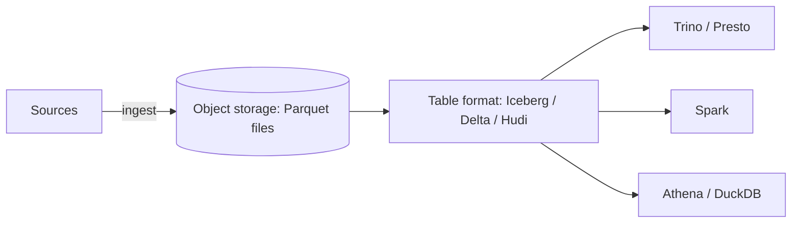
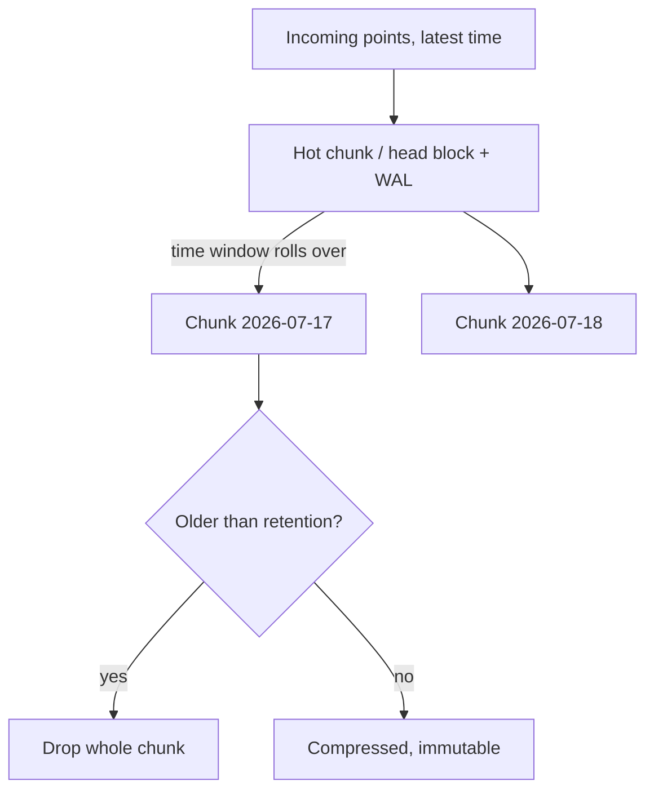

# Analytics, Columnar & Time-Series Databases

This topic covers the *mechanism* side of analytical data systems: how columnar
storage physically lays out and compresses data, why that layout crushes analytic
scans, how MPP warehouses separate storage from compute, and how time-series
databases (TSDBs) exploit the append-only, time-ordered nature of metrics. The goal
is to reason about *why* a query is fast or slow on a given engine — not to draw a
capacity-planning diagram (that lives in system-design).

> [!KEY-TAKEAWAY]
> OLTP is optimized for *point reads/writes of whole rows*; OLAP is optimized for
> *scanning a few columns across billions of rows*. Almost every design choice below
> (row-vs-column layout, compression, vectorization, storage/compute separation)
> follows from that single distinction.

## OLTP vs OLAP workloads

**OLTP** (Online Transaction Processing) is the world of application databases:
short, interactive transactions that read or modify a *few rows identified by key*,
with high concurrency and strict latency/consistency requirements. Think
`SELECT * FROM orders WHERE id = 42` or `UPDATE accounts SET balance = balance - 100
WHERE id = 7`. Access is *selective* (index lookups), touches *whole rows*, and is
*write-heavy per transaction but small*.

**OLAP** (Online Analytical Processing) is the world of analytics/BI/reporting:
long-running, read-mostly queries that *scan huge numbers of rows but project only a
few columns* and aggregate. Think `SELECT region, SUM(revenue) FROM sales WHERE
order_date >= '2026-01-01' GROUP BY region`. Access is a *large scan*, touches *few
columns*, and there are essentially no single-row updates.

| Dimension | OLTP | OLAP |
|---|---|---|
| Typical query | Point lookup / small range by key | Large scan + aggregate |
| Rows touched | Few | Millions–billions |
| Columns touched | All (whole row) | A handful |
| Writes | Frequent, small, transactional | Bulk load / append; rare updates |
| Concurrency | Very high (many users) | Lower (fewer, heavier queries) |
| Latency target | Milliseconds | Seconds–minutes acceptable |
| Storage layout | Row-oriented | Column-oriented |
| Example systems | PostgreSQL, MySQL/InnoDB | Redshift, BigQuery, Snowflake, ClickHouse |

The term **HTAP** (Hybrid Transactional/Analytical Processing) describes systems that
try to serve both on one copy of the data (e.g. SingleStore, TiDB, or Postgres with
a columnar extension), usually by keeping a row store for writes and a column store
for reads.

> [!INTERVIEW]
> A classic probe: "You have a transactional Postgres database and analysts keep
> running heavy `GROUP BY` reports against it, slowing down the app." The mechanism
> answer is that OLAP scans thrash the buffer cache and hold resources; the fix is to
> *offload analytics* to a replica or a columnar warehouse via ETL/CDC, not to add
> more indexes to the OLTP box.

## Row vs columnar storage

The single most important idea in analytics. In a **row store**, all columns of a row
are stored contiguously on disk (a "row" or "tuple" per record, packed into pages).
In a **column store**, all values of *one column* are stored contiguously, in separate
files/blocks per column.

```
Row store   (page):  [id1,name1,age1,city1][id2,name2,age2,city2][id3,...]
Column store:        id:  [id1,id2,id3,...]
                     name:[name1,name2,...]
                     age: [age1,age2,age3,...]
                     city:[city1,city2,...]
```

Why columnar wins for analytics:

1. **Read only the columns you need.** `SELECT AVG(age) FROM users` reads *only* the
   `age` column. A row store must read every row (all columns) off disk because the
   `age` values are interleaved with everything else. If a table has 50 columns and
   the query touches 2, columnar reads ~4% of the bytes.
2. **Compression is dramatically better.** A column holds values of *one type and one
   domain* (all ages, all timestamps), so adjacent values are similar and compress far
   better than a heterogeneous row. Better compression → fewer bytes read → less I/O.
3. **Vectorized / SIMD execution.** Because a column is a dense array of like-typed
   values, the engine processes it in tight batches (e.g. 1024 values at a time)
   through CPU-vectorized operators, instead of the tuple-at-a-time interpretation a
   row engine uses. Cache locality is excellent.
4. **Late materialization.** Operators work on compressed column vectors and only
   reconstruct full rows at the very end, keeping data compressed deep into the plan.

Why row stores win for OLTP: an `INSERT` or single-row `SELECT *` touches one
contiguous location; a column store would scatter that write across N column files.
Point updates and full-row retrieval are cheap in a row store, expensive in a column
store. That is why columnar systems are typically *append/bulk-load, read-mostly* and
often forbid or heavily penalize single-row `UPDATE`/`DELETE`.

> [!TIP]
> Rule of thumb: if the query pattern is "few rows, all columns" → row store. If it's
> "all rows, few columns" → column store. Columnar's advantage grows with the number
> of columns *not* touched by the query.

## Compression schemes

Columnar storage enables lightweight, per-column encodings that both shrink data and
let operators run *directly on the encoded form*.

- **Run-length encoding (RLE):** store `(value, run_length)` instead of repeating a
  value. Superb for sorted or low-cardinality columns (e.g. a `country` column sorted
  so `US` repeats 10,000 times → `(US, 10000)`). Aggregations can operate on runs.
- **Dictionary encoding:** map each distinct value to a small integer code; store the
  compact codes plus a dictionary. `status ∈ {ACTIVE, CLOSED, PENDING}` becomes 2-bit
  codes. Predicates like `status = 'CLOSED'` are evaluated as integer comparisons, and
  equality/`IN` filters run on codes without decoding. Best for low-to-medium
  cardinality strings.
- **Bit-packing:** if a column's values fit in *k* bits (e.g. dictionary codes 0–7 fit
  in 3 bits), pack them tightly instead of using a full 32/64-bit word.
- **Delta encoding:** store differences between consecutive values. Ideal for sorted or
  slowly-changing sequences — monotonic IDs, and especially **timestamps** in
  time-series data, where consecutive values differ by a near-constant interval.
  **Delta-of-delta** (used by Facebook's Gorilla/Prometheus) stores the change in the
  delta, collapsing regular-interval timestamps to a few bits each.
- **Frame-of-reference (FOR):** subtract a per-block minimum, then bit-pack the small
  residuals.
- **XOR encoding for floats:** Gorilla XORs consecutive float values; similar readings
  share leading/trailing bits, so the XOR is mostly zeros and packs tightly.

These "lightweight" encodings are usually combined with a **general-purpose block
compressor** (LZ4, Zstd, Snappy, gzip) applied on top. The lightweight encodings are
preferred first because operators can filter/aggregate *without fully decompressing*.

> [!WARNING]
> High-cardinality columns (unique IDs, free-text, UUIDs) compress poorly and blow up
> dictionaries. Sorting the data by a low-cardinality column before load dramatically
> improves RLE/delta ratios — sort order is a real tuning knob in columnar stores.

## Columnar formats and data lakes

Beyond databases, columnar is a *file format* standard used in data lakes on object
storage (S3/GCS/ADLS):

- **Apache Parquet** and **Apache ORC** are open, columnar, on-disk formats. Data is
  split into **row groups** (Parquet) / **stripes** (ORC); within each, data is stored
  column-by-column ("column chunks"), compressed and encoded as above.
- Each row group/stripe carries **footer metadata and per-column statistics**
  (min/max, null counts, sometimes bloom filters). Engines use these for
  **predicate pushdown / min-max pruning**: skip an entire row group whose `[min,max]`
  cannot match the `WHERE` clause. Combined with **projection pushdown** (read only
  requested column chunks), a query can skip the vast majority of bytes.
- **Data lake** = raw/curated files (often Parquet) in cheap object storage, queried in
  place by engines like Spark, Trino/Presto, Athena, DuckDB. A **lakehouse** adds a
  transactional table layer — **Apache Iceberg, Delta Lake, Apache Hudi** — providing
  ACID commits, schema evolution, time-travel, and partition/file pruning via a
  manifest/metadata layer on top of the Parquet files.



> [!TIP]
> Parquet is columnar-within-row-group, *not* one giant column file. This lets you get
> both column projection *and* row-group-level parallelism/pruning, and lets a reader
> fetch one row group without downloading the whole file.

## MPP warehouses and storage/compute separation

**MPP** (Massively Parallel Processing) warehouses partition data across many nodes and
run a query as parallel fragments, each node scanning its **shard/slice** locally, then
exchanging/aggregating partial results (a **shuffle**). Examples: Amazon Redshift,
Google BigQuery, Snowflake, ClickHouse.

**Shared-nothing (classic MPP)** — each node owns its slice of storage and CPU
(original Redshift, Greenplum). Fast because compute sits next to data, but *resizing*
means redistributing data, and storage and compute scale together (you pay for both).

**Separation of storage and compute** — the modern design (Snowflake, BigQuery,
Redshift RA3/Serverless, Databricks). Data lives in a shared durable store (object
storage); stateless compute clusters read it on demand, caching hot data locally.
Benefits:

- **Independent scaling:** grow compute for a big query without moving data; shrink to
  zero when idle.
- **Elastic, isolated compute:** Snowflake **virtual warehouses** (BigQuery **slots**)
  let separate teams run on separate compute against the *same* data with no
  contention.
- **Cheap, effectively unlimited storage** decoupled from query capacity.
- Trade-off: reads go over the network, mitigated by aggressive **result caching**,
  **local SSD caching**, and metadata pruning.

Other warehouse mechanics interviewers probe: **columnar storage + compression**,
**zone maps / min-max block metadata** for pruning, **distribution keys** (how rows
hash to nodes — a bad key causes skew), **sort keys / clustering** (physical ordering
for range pruning), and **materialized views** for precomputed aggregates. BigQuery
hides nodes entirely behind a *serverless slot* model; Snowflake exposes sizeable
virtual warehouses; Redshift exposes explicit clusters (with Serverless as an option).

> [!INTERVIEW]
> "Why is Snowflake able to give each team its own performance?" → Storage/compute
> separation: the *data* is central in object storage, and each team spins up an
> independent virtual warehouse (compute) that reads it, so one team's heavy query
> can't starve another's.

## Time-series databases

A **time-series database (TSDB)** is specialized for data indexed primarily by time:
metrics, IoT sensor readings, events, financial ticks. Examples: InfluxDB,
TimescaleDB (Postgres extension), Prometheus, and columnar systems repurposed for it.

Defining workload characteristics:

- **Append-heavy, time-ordered writes.** New data almost always has the *latest*
  timestamp; existing points are rarely updated. This lets the engine keep the most
  recent time range "hot" and treat older ranges as immutable.
- **Time-range queries.** Reads are overwhelmingly `WHERE time BETWEEN a AND b`, often
  grouped into time buckets.
- **High ingest rate** with values organized as `(measurement, tags/labels, timestamp,
  value)`.

Mechanisms that follow:

- **Time partitioning / chunking.** Data is split into chunks by time interval so that
  a range query touches only relevant chunks, old chunks compress/drop cheaply, and
  writes hit a small hot chunk. TimescaleDB calls this a **hypertable** (a logical
  table auto-partitioned into **chunks**); InfluxDB uses time-bucketed **shards**;
  Prometheus uses time-window **blocks** on top of a head/WAL.
- **Columnar + delta/delta-of-delta + XOR compression** (see above) exploits the
  regular timestamp spacing and slowly-changing values for large space savings.
- **Retention policies** automatically expire data older than N days by *dropping whole
  chunks/shards* (a metadata operation), which is far cheaper than row-by-row `DELETE`.



## Downsampling, roll-ups & continuous aggregates

Raw high-resolution data is expensive to store and slow to query over long ranges.
**Downsampling / roll-ups** precompute coarser aggregates (e.g. 1-minute raw →
5-minute, 1-hour, 1-day averages/min/max/sum) so long-range dashboards query small
pre-aggregated tables while raw data is retained only briefly.

- **TimescaleDB continuous aggregates** are incrementally-refreshed materialized views
  over a hypertable: only new/changed time buckets are recomputed, not the whole view.
- **InfluxDB** uses tasks (formerly continuous queries) to write roll-ups into a new
  retention bucket.
- **Prometheus recording rules** precompute expensive expressions at scrape/eval time
  and store the result as a new series, so dashboards/alerts read the cheap series.

A common tiered strategy: keep raw for 7 days, 1-minute roll-ups for 90 days, 1-hour
roll-ups for 2 years — combining short raw retention with long low-resolution history.

> [!TIP]
> Roll-ups are a *precomputation* trade-off: you spend write-time compute and some
> extra storage to make long-range reads cheap. Choose aggregation functions that are
> *composable* (sum, count, min, max) so hourly roll-ups can be built from minute
> ones; averages need (sum, count), and percentiles/`COUNT(DISTINCT)` need sketches
> (t-digest, HyperLogLog) because they are not directly re-aggregable.

## Cardinality explosion in TSDB

**Series cardinality** = the number of *unique* time series, which equals the number of
distinct combinations of metric name + all tag/label key-value pairs. In Prometheus/
InfluxDB each unique combination is a *separate series* with its own index entry and
storage stream.

```
http_requests_total{method="GET", status="200", instance="host1"}  ← one series
http_requests_total{method="POST", status="500", instance="host2"} ← another series
```

Cardinality is *multiplicative*: `methods × statuses × instances × …`. Adding a tag
whose values are effectively unbounded — **user IDs, email addresses, request IDs,
full URLs, timestamps, session IDs** — causes **cardinality explosion**: millions of
one-point series. Consequences:

- The in-memory **inverted index** of label→series balloons, driving memory/OOM.
- Ingest and query slow down; TSDBs like Prometheus can crash or hit series limits.
- Compression suffers because each series has too few points to amortize.

Mitigations: keep tags **bounded and low-cardinality**; put unbounded identifiers in
*fields/log lines*, not tags/labels; drop or aggregate high-cardinality labels at
ingest (relabeling); or use a store designed for high cardinality (e.g. columnar
stores or systems like VictoriaMetrics/Mimir) when it's truly required.

> [!WARNING]
> The #1 operational failure mode of Prometheus/InfluxDB in interviews is putting a
> high-cardinality value (user ID, request ID, raw URL) into a *label/tag*. Recognize
> and reject it: labels are for *bounded dimensions you group/filter by*, not for
> unique identifiers.

## When to use a warehouse vs an OLTP database

Choosing the engine is really about matching the workload to the storage/execution
model — the mechanism, not a capacity diagram.

Use an **OLTP row database** (PostgreSQL, MySQL) when:

- You serve an application: many concurrent users, point reads/writes by key,
  single-row updates, strong per-transaction consistency, millisecond latency.
- Data volume per query is small and selective (index-supported).

Use a **columnar/MPP warehouse** (Redshift/BigQuery/Snowflake) when:

- Read-mostly analytics: scans over huge tables, aggregations, `GROUP BY`, joins across
  large fact/dimension tables, ad-hoc BI, and you can tolerate seconds-to-minutes.
- Data is loaded in bulk/append or streamed via ETL/**CDC** from the OLTP system, not
  mutated row-by-row by end users.

Use a **TSDB** when the primary key is *time* and the workload is append-heavy metrics
with retention/downsampling needs.

The standard architecture is **both, not one**: OLTP is the system of record; data is
replicated into a warehouse/lake via ETL or change-data-capture so that heavy
analytics never touch (and never slow) the transactional database. Running big OLAP
`GROUP BY`s directly on the OLTP primary is the anti-pattern this separation exists to
prevent.

> [!INTERVIEW]
> If asked "can't I just add indexes to Postgres to make my analytics fast?" — indexes
> help *selective* lookups, not full-table scan-and-aggregate. Analytics that read most
> of the table gain little from indexes; the win comes from columnar layout,
> compression, and parallel scan — i.e. a different storage/execution model.

## Common follow-up questions

- **Why does columnar storage compress better than row storage?** Because a column
  contains values of a single type and domain, so neighbors are similar → RLE,
  dictionary, delta, and general compressors all do far better than on a mixed-type row.
- **What is vectorized execution and why does columnar enable it?** Processing batches
  of like-typed column values through CPU-friendly (often SIMD) operators instead of
  tuple-at-a-time; columns are already dense arrays, so it's a natural fit.
- **How does predicate pushdown work in Parquet?** Per-row-group min/max statistics let
  the reader skip row groups that can't satisfy the `WHERE` clause without reading them.
- **Snowflake vs BigQuery vs Redshift in one line each?** Snowflake: virtual warehouses
  over shared storage; BigQuery: serverless slots, fully managed; Redshift: cluster
  (with RA3/Serverless separating storage/compute).
- **Why is single-row UPDATE slow in a column store?** The row's fields are scattered
  across N separate, compressed column files; touching one row disturbs many blocks.
- **What causes a Prometheus OOM?** High series cardinality — usually an unbounded value
  placed in a label.
- **Continuous aggregate vs recording rule vs materialized view?** All precompute
  aggregates; continuous aggregates (Timescale) refresh incrementally, recording rules
  (Prometheus) evaluate on a schedule into new series, MVs may be full or incremental.
- **What is a lakehouse?** A transactional table layer (Iceberg/Delta/Hudi) over
  columnar files in object storage, adding ACID, schema evolution, and time travel.

## References

- M. Kleppmann, *Designing Data-Intensive Applications*, Ch. 3 (Column-oriented
  storage, data warehousing, OLTP vs OLAP).
- D. Abadi et al., *The Design and Implementation of Modern Column-Oriented Database
  Systems* (compression, late materialization, vectorization).
- Apache Parquet documentation — file format, row groups, encodings, statistics.
- Apache ORC documentation — stripes, indexes, predicate pushdown.
- Apache Iceberg / Delta Lake / Apache Hudi documentation — table formats & lakehouse.
- Amazon Redshift Developer Guide — distribution/sort keys, zone maps, RA3/Serverless.
- Google BigQuery documentation — serverless architecture, slots, Dremel.
- Snowflake documentation — virtual warehouses, storage/compute separation, caching.
- TimescaleDB documentation — hypertables, chunks, continuous aggregates, compression.
- InfluxDB documentation — TSM engine, tags vs fields, retention policies, cardinality.
- Prometheus documentation — data model & labels, TSDB blocks/WAL, recording rules.
- T. Pelkonen et al., *Gorilla: A Fast, Scalable, In-Memory Time Series Database*
  (delta-of-delta timestamps, XOR float compression).
