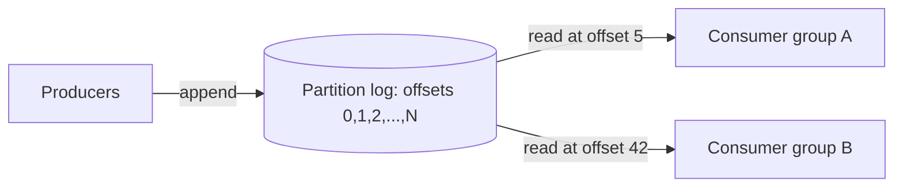
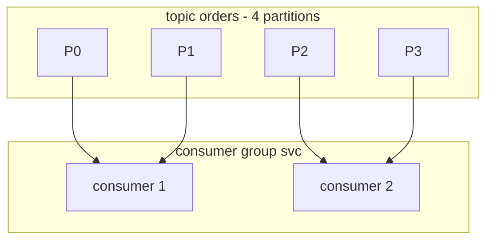
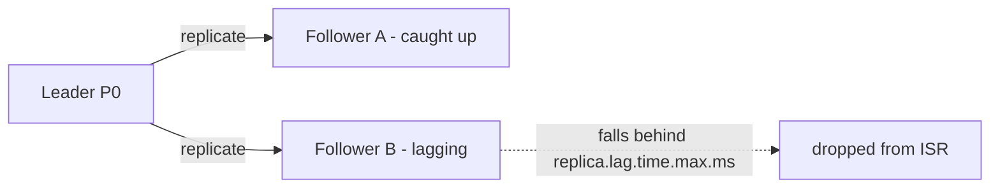

# Apache Kafka

Apache Kafka is a distributed, partitioned, replicated **commit log** used as a
messaging system, an event-streaming platform, and a durable buffer between services.
This page teaches the **mechanism** level: how the log, partitions, offsets, consumer
groups, replication, and delivery guarantees actually work, and how a backend engineer
configures producers and consumers correctly. It stays out of the whiteboard/architecture
altitude (where-does-the-queue-go, capacity math) that the system-design pages own —
here we talk brokers, configs, offsets, ISR, and failure modes.

> [!KEY-TAKEAWAY]
> Kafka is not a queue that deletes messages on read — it is an **append-only log** that
> retains messages for a configured time/size, and each consumer group tracks its own
> read position (offset). Ordering is guaranteed **only within a partition**, and the
> partition key is what decides both ordering and parallelism.

---

## The distributed commit log abstraction

At its core Kafka is a **distributed, append-only, immutable commit log**. Producers
append records to the end of a log; the log is never modified in place; consumers read
forward by tracking an **offset** (a monotonically increasing sequence number). This is
the same idea as a database's write-ahead log (WAL) or a replication binlog, generalized
into a first-class product.

Key consequences of the log model:

- **Reads are non-destructive.** Unlike a traditional queue where a consumer dequeues
  (removes) a message, a Kafka consumer just advances its offset. The record stays on
  disk until retention expires, so *many* independent consumers can read the same data.
- **Replay is native.** A consumer can seek to an older offset and re-read history —
  useful for reprocessing, backfilling a new service, or recovering from a bug.
- **Sequential writes are cheap.** Appending to the end of a file is sequential I/O,
  which is fast even on spinning disks and friendly to the OS page cache.



> [!INTERVIEW]
> A common opener: "How is Kafka different from a message queue like RabbitMQ?" The crisp
> answer is the log abstraction: Kafka retains records and lets each consumer group read
> independently at its own offset, whereas a classic broker deletes a message once it is
> acknowledged by a consumer.

---

## Topics, partitions, offsets, and the ordering guarantee

A **topic** is a named stream of records (e.g. `orders`). A topic is split into one or
more **partitions**; each partition is an independent ordered log. A record's position in
a partition is its **offset**, unique and monotonically increasing *within that
partition*.

- **Ordering is per-partition only.** Kafka guarantees that records within a single
  partition are delivered in the order they were appended. There is **no global ordering
  guarantee across partitions of a topic.** If you need total order for a set of related
  records, they must all go to the same partition.
- **Offsets are per-partition.** "Offset 100" is meaningless without naming the
  partition. A consumer's committed position is a map of `(topic, partition) -> offset`.
- **A record is `(key, value, timestamp, headers)`** plus its assigned partition and
  offset. The physical log is stored as **segment files** on the broker; old segments are
  deleted or compacted per the retention policy.

Partition count is the unit of parallelism (see below) and is hard to decrease — you can
add partitions to a topic but not remove them, and adding partitions changes the
key→partition mapping for future records.

> [!WARNING]
> Adding partitions to a keyed topic breaks the "same key → same partition" property for
> keys hashed after the change, which can reorder or split a key's history across
> partitions. Size partitions up front for keyed/ordered topics.

---

## Partition key and why it drives ordering + parallelism

When a producer sends a record it may set a **key**. The default partitioner computes the
partition as `hash(key) % numPartitions` (Kafka uses murmur2), so **all records with the
same key land in the same partition** and therefore preserve order relative to each other.

- **Key = ordering domain.** Use the entity you need ordered as the key — e.g. `userId`
  or `orderId`. All events for that entity are then totally ordered on one partition.
- **Key = parallelism unit.** Consumers in a group are assigned whole partitions, so the
  number of partitions caps the number of *actively consuming* members in a group. More
  partitions → more parallelism, but also more open file handles, more rebalance cost, and
  more replication overhead.
- **No key (null key):** the producer spreads records across partitions. Modern clients
  (Kafka ≥ 2.4) use the **sticky partitioner** — batch to one partition until the batch is
  sent, then switch — for better batching; older clients did strict round-robin.

> [!TIP]
> Hot-key skew is a real problem: if one key (e.g. a celebrity `userId`) dominates
> traffic, its partition becomes a bottleneck because a partition is processed by exactly
> one consumer in the group. Consider a composite key or a salted key when a single key's
> volume exceeds one partition's throughput.

**Worked example — "how many partitions?"** This is the single most common Kafka
capacity question. The heuristic is `partitions >= max(target_in / per_partition_in,
target_out / per_partition_out)`, then round up for headroom.

- Target ingest: **600 MB/s** into topic `orders`.
- Measured ceiling on this hardware: a single partition sustains **~10 MB/s** (bounded by
  leader disk write + replication to followers).
- Producer side: `ceil(600 / 10) = 60` partitions to *accept* the write rate.
- Consumer side: suppose each consumer thread processes **~10 MB/s** too, so you also need
  `ceil(600 / 10) = 60` consumers — and since a partition maps to at most one consumer in a
  group, you need **>= 60 partitions** for 60 consumers to all be busy.
- Take the max (60) and add headroom for growth/rebalance skew → provision **~90
  partitions** (1.5x). You can add partitions later but never remove them, and adding them
  reshuffles the `hash(key) % n` mapping — so for a keyed/ordered topic, size up front.

The trap: picking 30 partitions here caps you at 300 MB/s no matter how many consumers you
add — the extra consumers just sit idle.

---

## Producers: acks, batching, and linger

A producer batches records and sends them to the **partition leader** broker. Two families
of settings dominate producer behavior: durability (`acks`) and throughput
(`batch.size` / `linger.ms`).

**`acks` — durability vs latency:**

| `acks` | Meaning | Durability | Risk |
|---|---|---|---|
| `0` | Fire-and-forget; don't wait for broker | none | message lost on any failure |
| `1` | Leader writes to its log and replies | leader only | lost if leader dies before followers replicate |
| `all` (`-1`) | Leader waits for all **in-sync replicas** | strongest | higher latency |

`acks=all` combined with `min.insync.replicas` is the durable configuration (see below).

**Batching / throughput:**

- **`batch.size`** — max bytes per partition batch. The producer fills a batch up to this
  size before sending.
- **`linger.ms`** — how long to wait for more records before sending a partial batch.
  `linger.ms=0` (default) sends as soon as possible; a small value (e.g. 5–20 ms) trades a
  little latency for much larger batches and higher throughput.
- **`compression.type`** (`lz4`, `zstd`, `snappy`, `gzip`) compresses the *batch*, so
  bigger batches compress better and cut network + disk cost.
- **`buffer.memory`** bounds the producer's send buffer; when full, `send()` blocks (up to
  `max.block.ms`) applying backpressure.

```
# Durable, throughput-tuned producer
acks=all
enable.idempotence=true
linger.ms=10
batch.size=65536
compression.type=zstd
```

**Worked example — what batching buys you.** Say each record is ~200 bytes and one
partition takes **5000 msg/s**.

- With `linger.ms=0` and tiny batches, in the worst case each record is its own request:
  ~5000 requests/s to that partition — request overhead (headers, acks round-trips)
  dominates and throughput stalls.
- With `linger.ms=10` and `batch.size=65536` (64 KB): in a 10 ms window you accumulate
  `5000 msg/s × 0.010 s = 50 records ≈ 50 × 200 B = 10 KB`, which fits in one 64 KB batch.
  So you send **~100 batches/s** instead of 5000 requests/s — a **~50x** drop in request
  count for only 10 ms of added latency.
- Compression then works on the whole 10 KB batch. JSON-ish payloads often compress ~3–5x,
  so `zstd` might ship ~2–3 KB per batch over the wire and store it compressed on disk and
  all the way to the consumer.

The knob interaction: a batch is sent when *either* it hits `batch.size` *or* `linger.ms`
elapses, whichever comes first. Under high load `batch.size` fires first (latency stays
low); under light load `linger.ms` caps how long a partial batch waits.

---

## Idempotent producer and min.insync.replicas

**The retry problem:** if a producer sends a record, the broker writes it, but the ack is
lost in the network, the producer retries and the record is written **twice** — a
duplicate. Naive retries give at-least-once *on the producer side*.

**Idempotent producer (`enable.idempotence=true`, default since Kafka 3.0):** the producer
gets a **producer ID (PID)** and stamps each record with a monotonic **sequence number**
per partition. The broker de-duplicates by rejecting a sequence number it has already
seen, so retries no longer create duplicates. This gives **exactly-once *writes* to a
single partition** within a producer session. It requires `acks=all`,
`max.in.flight.requests.per.connection <= 5`, and `retries > 0` (the defaults satisfy
this).

*Why the `<= 5` cap, and why it also protects ordering:* pre-idempotence, having more than
one request in flight with retries enabled could **reorder** writes within a partition —
picture batch A (offsets it wants) failing and being retried while batch B, sent right
after, succeeds first: B lands before the retried A, so the log order no longer matches
send order. The idempotent producer stamps each batch with a per-partition sequence number,
so the broker can detect an out-of-order or duplicate sequence, **reject it, and let the
client resend in order** — preserving ordering even with up to 5 in-flight requests. Beyond
5 the broker can't track enough sequence state to guarantee this, hence the cap.

**`min.insync.replicas` (broker/topic config):** the minimum number of replicas that must
acknowledge an `acks=all` write for it to succeed. With replication factor 3 and
`min.insync.replicas=2`, a write needs the leader + at least one follower. If too many
replicas are down (fewer than `min.insync.replicas` in-sync), the producer gets
`NotEnoughReplicasException` and the write is **rejected** rather than silently accepted
with weak durability.

> [!KEY-TAKEAWAY]
> The durable-write recipe is a **pair of settings on both sides**: producer `acks=all` +
> `enable.idempotence=true`, and topic `replication.factor=3`, `min.insync.replicas=2`.
> `acks=all` alone with `min.insync.replicas=1` still risks loss because "all in-sync
> replicas" could be just the leader.

---

## Consumers and consumer groups

A **consumer** reads records by polling. Consumers that share a **`group.id`** form a
**consumer group** — Kafka's mechanism for both load balancing and fault tolerance.

- **Each partition is assigned to exactly one consumer in a group.** Kafka distributes the
  topic's partitions across the group's members, so records are processed in parallel
  without two members handling the same partition. If there are more consumers than
  partitions, the extra consumers sit **idle**.
- **Different groups are independent.** Two groups subscribed to the same topic each get a
  full copy of every record and track separate offsets — this is how you fan out the same
  stream to multiple applications.
- **Failover:** if a consumer dies (misses heartbeats), its partitions are reassigned to
  surviving members via a rebalance.



**Liveness detection:** members send heartbeats to the group coordinator.
`session.timeout.ms` bounds how long a missed heartbeat is tolerated before the member is
evicted; `max.poll.interval.ms` bounds how long processing between `poll()` calls may take
before the member is considered dead (a slow message handler can trigger a rebalance even
while heartbeats are fine).

---

## Rebalancing and partition assignment

A **rebalance** redistributes partitions among group members when membership or
subscription changes (a consumer joins/leaves/crashes, or partitions are added).

- **Assignment strategies** (`partition.assignment.strategy`): `RangeAssignor`,
  `RoundRobinAssignor`, `StickyAssignor`, and `CooperativeStickyAssignor`. Sticky
  strategies try to keep existing assignments to minimize churn.
- **Eager (stop-the-world) rebalancing** — the classic protocol: *every* consumer revokes
  *all* its partitions, then the group re-joins and gets new assignments. Processing halts
  group-wide during the rebalance.
- **Cooperative (incremental) rebalancing** (`CooperativeStickyAssignor`, Kafka ≥ 2.4):
  only the partitions that actually need to move are revoked, so most consumers keep
  processing. This is now the recommended default for large groups.
- **Static membership** (`group.instance.id`, Kafka ≥ 2.3): gives a consumer a stable
  identity so a transient restart within `session.timeout.ms` does **not** trigger a
  rebalance — great for reducing churn from rolling restarts.

> [!WARNING]
> "Rebalance storms" are a classic production incident: a handler that occasionally takes
> longer than `max.poll.interval.ms` gets kicked out, triggering a rebalance, which slows
> everyone, causing more timeouts. Fixes: raise `max.poll.interval.ms`, lower
> `max.poll.records`, move slow work off the poll thread, or use cooperative rebalancing.

---

## Offset commits and delivery semantics

A consumer's progress is a **committed offset** per partition, stored in the internal
`__consumer_offsets` topic. On restart or reassignment, a consumer resumes from the last
committed offset (or from `auto.offset.reset` = `earliest`/`latest` if none exists).

- **Auto-commit** (`enable.auto.commit=true`, default) commits the *last polled* offset
  periodically (`auto.commit.interval.ms`, default 5 s). Simple but risky: offsets can be
  committed for records you have not finished processing.
- **Manual commit** (`commitSync`/`commitAsync`) lets you commit **after** processing,
  which is required for correct at-least-once handling.

**Delivery semantics depend on commit order:**

- **At-least-once (the default posture):** process the record, *then* commit. If you crash
  after processing but before committing, you reprocess on restart → possible **duplicates**,
  never loss. This is why downstream logic should be **idempotent**.
- **At-most-once:** commit *before* processing. A crash after commit loses the in-flight
  records → no duplicates, but possible loss.
- **Exactly-once:** requires transactions / an idempotent sink (next section).

**Worked example — trace the offsets.** Committed offset for partition `orders-0` is
**5** (records 0–4 are done). The consumer polls and gets records **5, 6, 7, 8, 9**.

- *At-least-once (process, then commit):* it processes 5, 6, 7, then **crashes** before
  `commitSync()`. Committed offset is still **5**. On restart the consumer resumes at 5 and
  re-polls **5, 6, 7, 8, 9** — so **5, 6, 7 are processed a second time → duplicates**.
  Nothing is lost. (This is why the sink must be idempotent.)
- *At-most-once (commit, then process):* it polls 5–9, immediately commits offset **10**,
  then processes 5, 6, 7 and **crashes**. On restart it resumes at 10 — records **8 and 9
  were never processed → lost**. No duplicates.

Same crash, same records; only the commit *order* changed and it flipped duplicate-vs-loss.
Note the committed offset is the *next* offset to read (10 = "I'm past 9"), not the last
one processed.

> [!KEY-TAKEAWAY]
> "Commit before processing = at-most-once (may lose). Commit after processing =
> at-least-once (may duplicate)." Kafka's out-of-the-box behavior is **at-least-once**, so
> design consumers to tolerate duplicates.

**Consumer lag** is the #1 operational health metric — it tells you whether consumers are
keeping up. Per partition, `lag = log-end-offset − committed-offset`: how many records have
been produced that this group hasn't processed yet. In the trace above, if the producer has
written up to offset 100 while the group is committed at 5, lag = 95. Monitor it with
`kafka-consumer-groups --describe`, Burrow, or the client's JMX `records-lag-max`. Steadily
*rising* lag means consumers are falling behind; the scaling lever is more partitions +
more consumers (up to the partition count), or faster per-record processing. Heartbeats
tell you a consumer is *alive*; lag tells you it's *keeping up* — you need both.

> [!WARNING]
> **Poison pills and the missing DLQ.** Kafka has **no native dead-letter queue** (unlike
> SQS/RabbitMQ — see the comparison table). Because offsets advance in order, a record that
> *always* throws during processing can stall its partition **indefinitely**: you can't
> skip it without committing past it, and committing past it under at-least-once means
> giving up on it. Patterns: (1) catch the failure, write the bad record to a **DLQ topic**,
> then commit and move on; (2) **retry topics** with increasing backoff (Spring Kafka's
> `DeadLetterPublishingRecoverer` / `@RetryableTopic`, or Kafka Connect's
> `errors.tolerance` + `errors.deadletterqueue.topic.name`); (3) **error-handling
> deserializers** so a malformed byte payload doesn't crash the poll loop. The interviewer's
> probe is usually "what happens to a message that can never be processed?" — the honest
> answer is "it blocks the partition unless you build DLQ/skip logic yourself."

---

## Replication: leader, followers, and ISR

Each partition is replicated to `replication.factor` brokers. One replica is the
**leader**; the rest are **followers**. All reads and writes go through the leader;
followers pull from the leader to stay caught up. (Follower fetching for reads exists but
is a special case; treat the leader as the single source by default.)

- **ISR — In-Sync Replica set:** the replicas (including the leader) that are fully caught
  up with the leader (within `replica.lag.time.max.ms`). Only ISR members are eligible to
  become leader. A record is considered **committed** (visible to consumers) once all ISR
  members have it.
- **`acks=all` waits for the ISR**, not for *all* replicas — so a lagging follower dropping
  out of the ISR doesn't stall producers, but `min.insync.replicas` sets the floor.
- **Leader failover:** if the leader dies, the controller elects a new leader from the ISR.
  Committed records survive because every ISR member already has them.



**Worked trace — ISR shrinking past the floor** (RF=3, `min.insync.replicas=2`,
`acks=all`): ISR starts as `{Leader, A, B}` = **3**. Follower B GCs and lags beyond
`replica.lag.time.max.ms` → dropped, ISR = `{Leader, A}` = **2**. Writes still succeed
(2 ≥ 2). Now A also dies → ISR = `{Leader}` = **1**, which is *below* `min.insync.replicas`
= 2, so producers get `NotEnoughReplicasException` and writes are **rejected** — Kafka
refuses under-replicated writes rather than accept them with weak durability. Consumers can
still read already-committed records. Recovery of A or B back into the ISR restores writes.

**Unclean leader election (`unclean.leader.election.enable`):**

- **`false` (default, and recommended):** if no ISR replica is available, the partition
  goes **offline** and waits — prioritizing **consistency/durability** (no data loss) over
  availability.
- **`true`:** an out-of-sync replica may be elected leader, restoring availability but
  **losing** any records it never replicated — a classic CAP-style choice favoring
  availability over durability.

> [!INTERVIEW]
> Expect: "You have RF=3, min.insync.replicas=2, acks=all. Two brokers holding a partition
> die. What happens?" Answer: only the leader remains in-sync; ISR size (1) is below
> `min.insync.replicas` (2), so producers get `NotEnoughReplicas` and writes fail — Kafka
> chooses to reject rather than accept under-replicated writes. Consumers can still read
> committed data.

---

## Retention and log compaction

Kafka retains records independently of consumption. Two retention modes exist:

**Time/size retention (`cleanup.policy=delete`, the default):**

- **`retention.ms`** — delete segments older than this (default 7 days).
- **`retention.bytes`** — cap the partition's total size; oldest segments are deleted
  first. Retention operates at **segment** granularity (`segment.ms` / `segment.bytes`),
  not per-record, and the *active* segment is never deleted.

**Log compaction (`cleanup.policy=compact`):** instead of deleting by age, compaction
keeps **the latest value for each key** and garbage-collects superseded older values. The
result is a topic that behaves like a **changelog / snapshot**: replaying it reconstructs
the current state of every key.

- A record with a **null value** is a **tombstone** — it marks the key as deleted, and
  after `delete.retention.ms` the tombstone itself is removed.
- Use cases: `__consumer_offsets`, Kafka Streams state-store changelogs, CDC/table
  materialization ("this topic is the current state of every account").
- `cleanup.policy=compact,delete` combines both — compact, but still drop very old data.

> [!TIP]
> Compaction guarantees the *latest* value per key survives, but does **not** guarantee
> only one value per key at all times — recently written duplicates in the "dirty" (head)
> portion of the log are compacted in the background, not synchronously.

---

## Exactly-once semantics (transactions)

"Exactly-once" in Kafka means **exactly-once processing** for the common
**consume→process→produce** pipeline, built from two primitives:

1. **Idempotent producer** — removes duplicate *writes* from producer retries (per
   partition, per session).
2. **Transactions** (`transactional.id` + `initTransactions`/`beginTransaction`/
   `sendOffsetsToTransaction`/`commitTransaction`) — make a set of writes to multiple
   partitions **and** the consumer-offset commit **atomic**: either all become visible or
   none do.

The trick that closes the loop is `sendOffsetsToTransaction`: the consumer's *offset
commit* is written **inside the same transaction** as the output records. So "I read input
offset N and produced output records" commit or abort together — no double-processing.

**Reader side:** consumers must set **`isolation.level=read_committed`** to skip records
from aborted (and still-open) transactions; the default `read_uncommitted` sees everything.

Broker/producer settings: `enable.idempotence=true` (implied), `transactional.id` set,
`transaction.timeout.ms`. In Kafka Streams, exactly-once is a single switch
(`processing.guarantee=exactly_once_v2`).

**Zombie fencing** is the classic deep probe once you mention transactions. A **fixed
`transactional.id`** is the identity the broker fences on. Each `initTransactions()` bumps
an **epoch** for that id: say instance A calls `initTransactions()` and gets epoch **5**,
then hangs (long GC pause) while the orchestrator, thinking it dead, starts instance B with
the *same* `transactional.id`; B calls `initTransactions()` and gets epoch **6**. Now A
wakes up as a "zombie" and tries to `commitTransaction()` with epoch 5 — the broker sees a
stale epoch (current is 6) and rejects it with `ProducerFencedException`. Only one active
producer per `transactional.id` can write, so the zombie can't double-produce or corrupt
the output.

> [!WARNING]
> Exactly-once is **scoped to Kafka**. If your "process" step writes to an external system
> (a database, an email) that is not part of the Kafka transaction, you are back to
> at-least-once at that boundary unless that system is idempotent or you use an outbox/2PC
> pattern. Interviewers love probing this limit.

---

## Throughput design: zero-copy, sequential I/O, page cache

Kafka's high throughput comes from working *with* the OS rather than around it:

- **Sequential I/O:** appends go to the end of a segment file — sequential writes, which
  are far faster than random writes and let the disk and page cache prefetch efficiently.
- **OS page cache:** Kafka does not maintain its own in-JVM message cache. It writes to the
  page cache and lets the OS flush to disk; recently produced data is usually served to
  consumers straight from RAM (page cache) without hitting disk. This also means the JVM
  heap stays small and GC pressure is low.
- **Zero-copy (`sendfile`):** when sending log data to a consumer, Kafka uses the
  `sendfile` syscall to copy bytes directly from the page cache to the network socket,
  **bypassing user space** and avoiding redundant copies and context switches. (Zero-copy
  is disabled when TLS is on, because encryption must touch the bytes in user space.)
- **Batching + compression:** records are grouped into batches and compressed together, so
  fewer, larger network/disk operations amortize per-record overhead end to end (the batch
  stays compressed on disk and over the wire to the consumer).

> [!KEY-TAKEAWAY]
> Kafka's speed is mostly *systems engineering*, not clever data structures: append-only
> sequential writes + rely on the page cache + zero-copy reads + batched/compressed
> transfers. Enabling TLS forfeits zero-copy, which is a real throughput cost to remember.

---

## KRaft and the removal of ZooKeeper

Historically Kafka used **ZooKeeper** to store cluster metadata (brokers, topics,
partitions, ACLs, controller election). **KRaft** ("Kafka Raft") replaces ZooKeeper with a
built-in Raft-based consensus among Kafka nodes acting as **controllers**, storing metadata
in an internal `__cluster_metadata` log.

- **Timeline:** KRaft went GA for new clusters in **Kafka 3.3** (2022); ZooKeeper was
  deprecated and, as of **Kafka 4.0 (2025)**, **removed** — 4.0 runs KRaft only.
- **Why it matters:** one system to operate instead of two; metadata as an event log (the
  controller applies changes as log records); **much faster failover and far higher
  partition scalability** (metadata propagation no longer bottlenecks on ZooKeeper).
- **Roles:** nodes run as `broker`, `controller`, or both (combined mode for small
  clusters). The **active controller** is the Raft leader of the metadata quorum.

> [!TIP]
> If asked "what replaced ZooKeeper and why," the answer is KRaft: metadata now lives in an
> internal Raft log managed by controller quorum, which removes the external dependency and
> scales to millions of partitions with quicker controller failover.

---

## When to use Kafka vs a traditional message queue

Both move messages between services, but the models differ. Choose by workload, not hype.

| Dimension | Kafka (log) | Traditional queue (RabbitMQ/SQS/ActiveMQ) |
|---|---|---|
| Storage model | Retained append-only log; consumers track offsets | Message removed after ack (destructive read) |
| Replay | Native (seek to old offset) | Not generally supported |
| Ordering | Per-partition | Per-queue (or none with competing consumers) |
| Fan-out | Many groups read same data independently | Needs multiple queues / exchange routing |
| Throughput | Very high (batched sequential log) | Lower per broker, but rich routing |
| Per-message semantics | Coarse (offset-based, batch) | Per-message ack/nack, redelivery, TTL, DLQ, priority |
| Routing | Simple (topic + partition by key) | Rich (exchanges: direct/topic/fanout/headers) |

**Reach for Kafka when** you need durable event streams, replay, high throughput, multiple
independent consumers of the same data, event sourcing, or stream processing.

**Reach for a traditional queue when** you need per-message routing, priorities, TTLs,
dead-letter queues, delayed delivery, complex fan-out routing, or a task/work-queue with
per-message acknowledgement and low operational footprint.

> [!INTERVIEW]
> A sharp framing: "Kafka is a distributed log you subscribe to; RabbitMQ is a smart broker
> that routes and hands off individual messages." Kafka pushes routing intelligence to the
> partition key and the consumer; RabbitMQ keeps it in exchanges and bindings.

---

## Common follow-up questions

- **"Why is ordering only per-partition, and how do you get total order?"** Because each
  partition is an independent log; total order requires a single partition (which caps
  throughput) or ordering only within a key by routing that key to one partition.
- **"acks=all guarantees no data loss — true or false?"** Not alone. You also need
  `min.insync.replicas >= 2` and RF ≥ 3; otherwise "all in-sync replicas" could be just the
  leader.
- **"Default delivery semantic?"** At-least-once (process then commit) — design idempotent
  consumers.
- **"Idempotent producer vs transactions?"** Idempotent producer removes duplicate writes
  to one partition within a session; transactions add atomic multi-partition writes plus
  atomic offset commit for true exactly-once processing (with `read_committed` consumers).
- **"What breaks exactly-once?"** A side effect to an external non-transactional system;
  it's only exactly-once within Kafka.
- **"Consumers outnumber partitions — what happens?"** Extra consumers idle; parallelism is
  capped by partition count.
- **"How do you know consumers are keeping up?"** Watch consumer lag =
  `log-end-offset − committed-offset` per partition (`kafka-consumer-groups --describe`,
  Burrow, JMX `records-lag-max`); rising lag = falling behind, scale partitions + consumers.
- **"What do you do with a record that always fails to process?"** Kafka has no native DLQ;
  a poison pill blocks the partition since offsets advance in order. Build a DLQ topic +
  skip-and-commit, retry topics with backoff, or error-handling deserializers.
- **"How does exactly-once stop a zombie/duplicated producer?"** A fixed `transactional.id`
  gets an incrementing epoch on `initTransactions`; a resurrected producer with a stale
  epoch is fenced (`ProducerFencedException`) — one active writer per id.
- **"Why is Kafka fast?"** Sequential writes, page cache, zero-copy `sendfile`, batching +
  compression — not per-message cleverness.
- **"What is unclean leader election and when would you enable it?"** Electing an
  out-of-sync replica as leader to restore availability at the cost of losing unreplicated
  records; enable only when availability beats durability.
- **"What replaced ZooKeeper?"** KRaft (Raft-based controller quorum, metadata as an
  internal log); ZooKeeper removed in Kafka 4.0.

## References

- Apache Kafka Documentation — Design, Implementation, Operations: https://kafka.apache.org/documentation/
- Kafka Protocol Guide: https://kafka.apache.org/protocol
- KIP-98 — Exactly Once Delivery and Transactional Messaging: https://cwiki.apache.org/confluence/display/KAFKA/KIP-98
- KIP-500 / KIP-833 — KRaft (replace ZooKeeper) and marking KRaft production-ready: https://cwiki.apache.org/confluence/display/KAFKA/KIP-500
- KIP-429 — Incremental Cooperative Rebalancing: https://cwiki.apache.org/confluence/display/KAFKA/KIP-429
- Jay Kreps, "The Log: What every software engineer should know about real-time data's unifying abstraction": https://engineering.linkedin.com/distributed-systems/log-what-every-software-engineer-should-know-about-real-time-datas-unifying
- Martin Kleppmann, *Designing Data-Intensive Applications*, Ch. 11 (Stream Processing)
- Confluent documentation — Producer/Consumer configs, Exactly-Once Semantics, KRaft: https://docs.confluent.io/
