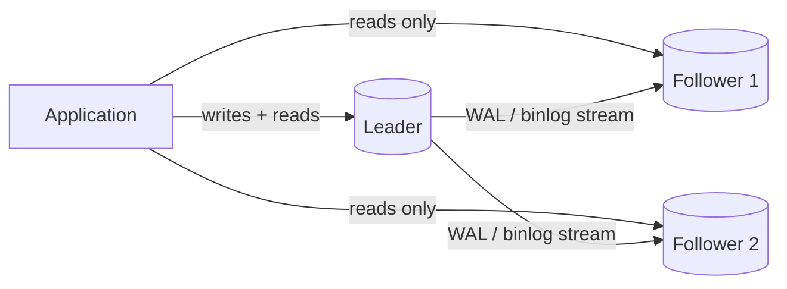
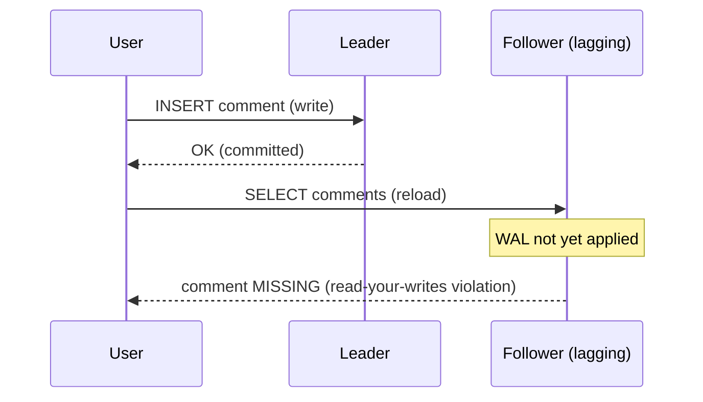
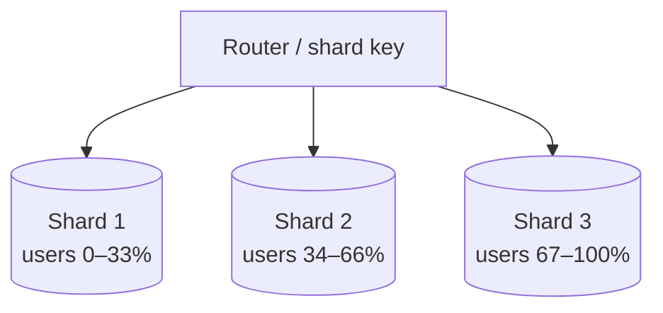
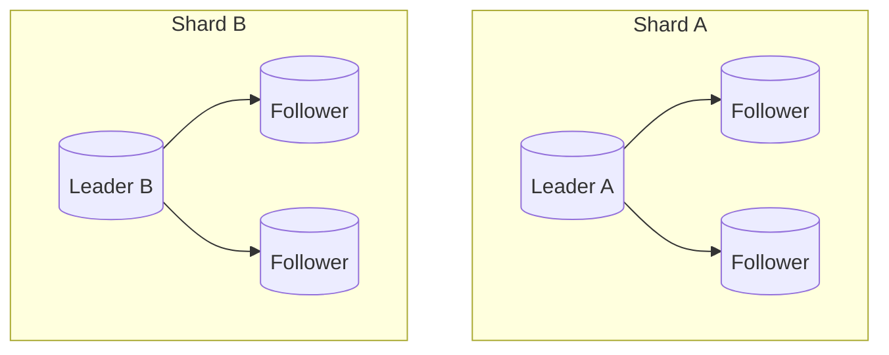

# Database Scaling: Replication, Read Replicas & Pooling

This note is about the **mechanisms** a backend engineer uses to make a single logical
database serve more load and survive failures: adding bigger hardware (vertical) vs
more machines (horizontal); copying the same data to more nodes (**replication**) vs
splitting different data across nodes (**partitioning/sharding**); how the copies are
kept in sync (WAL/binlog shipping, statement vs row-based, sync vs async); the
correctness problems replicas introduce (replication lag, read-your-writes, monotonic
reads); how failover promotes a new leader without splitting the brain; and why you put
a **connection pooler** in front of the database and how you size it.

This is the practitioner/mechanism altitude. Capacity estimation, "which datastore for
this scenario", and whiteboard topology diagrams belong to the system-design domain.
Here we look at real config, commands, and failure modes.

The canonical references are the PostgreSQL and MySQL/InnoDB manuals, the PgBouncer
docs, Jepsen analyses for consistency claims, and Kleppmann's *Designing Data-Intensive
Applications* (DDIA), chapters 5 (Replication) and 6 (Partitioning).

> [!KEY-TAKEAWAY]
> **Replication ≠ partitioning.** Replication copies the *same* data to multiple nodes
> (for read scaling + HA); partitioning splits *different* data onto different nodes
> (for write/storage scaling). Read replicas scale reads but give you **eventual
> consistency** on the followers; only writes to the leader are strongly consistent.
> They are orthogonal and large systems use both together.

---

## Vertical vs horizontal scaling

**Vertical scaling (scale up)** = give one machine more resources: more CPU cores, more
RAM, faster NVMe, higher IOPS. **Horizontal scaling (scale out)** = add more machines
and distribute the work across them.

- **Vertical is the first and simplest lever.** No application changes, no distributed
  transactions, no cross-node joins. A single Postgres/MySQL box on modern hardware
  (dozens of cores, hundreds of GB of RAM, NVMe) handles a *lot* — often more than
  teams assume. You keep ACID on one node.
- **Ceilings and downsides of vertical:** there is a biggest instance you can buy;
  cost grows super-linearly at the top end; a single box is a single point of failure;
  and scaling up usually needs a restart/failover (downtime). It does nothing for
  availability by itself.
- **Horizontal scales further and adds HA**, but you pay in complexity: data must be
  replicated and/or partitioned, cross-node queries get expensive, and you inherit the
  distributed-systems problems (consistency, coordination, partial failure).

The usual progression: **scale up first**, then add **read replicas** (scale reads +
HA), then **shard/partition** (scale writes + storage) only when a single leader can no
longer absorb the write volume or the dataset no longer fits.

> [!TIP]
> Reads and writes scale differently. Read replicas scale **read** throughput cheaply.
> They do **not** scale write throughput — every write still goes through the single
> leader and is then replayed on every replica, so each replica does the *same* write
> work the leader does. To scale writes you must partition.

---

## Replication: what it is and why

**Replication** keeps a copy of the same dataset on more than one node. You do it for
several reasons:

1. **High availability** — if the leader dies, a replica can take over.
2. **Read scaling** — route read-only queries to followers.
3. **Latency / locality** — put a replica near users in another region.
4. **Analytics offload** — run heavy reporting on a replica so it does not disturb the
   OLTP leader.

The dominant model in relational databases is **single-leader (leader–follower,
historically "primary–replica")**: one node accepts writes, streams its changes to
read-only followers. The core mechanism is **shipping the write-ahead log**: every
change the leader durably records in its WAL (Postgres) / binlog (MySQL) is sent to
followers, which replay it to converge to the same state.



> [!WARNING]
> A follower is **read-only** and lags the leader. Never send writes to it, and be
> aware that a read from a follower may return data that is milliseconds-to-seconds
> stale. That staleness is the source of most replica bugs (see replication lag).

---

## Statement-based vs row-based (logical) replication

The leader can ship its changes in different formats. This is the classic MySQL
`binlog_format` distinction, but the concepts are general.

- **Statement-based replication (SBR)** ships the *SQL statement itself*
  (`UPDATE accounts SET balance = balance - 10 WHERE id = 5`) and each replica
  re-executes it. Compact, but **non-deterministic statements break it**: `NOW()`,
  `RAND()`, `UUID()`, `LAST_INSERT_ID()`, triggers, and some `AUTO_INCREMENT`
  interleavings can produce different results on the replica. Statements that depend on
  execution order or non-deterministic functions diverge silently.
- **Row-based replication (RBR)** ships the *actual before/after row images* that
  changed. Deterministic and safe regardless of the statement, at the cost of larger
  log volume (a single `UPDATE ... WHERE` touching a million rows ships a million row
  images). This is the safe default. MySQL's default since 5.7.7 is `ROW`.
- **MIXED** (MySQL) uses statement-based normally and switches to row-based when it
  detects a non-deterministic statement.

**Physical vs logical replication (PostgreSQL framing):**

| | Physical (streaming) | Logical |
|---|---|---|
| Unit shipped | raw WAL byte changes (block/page level) | decoded row-level changes (INSERT/UPDATE/DELETE) |
| Replica must match | exact same PG major version + architecture | can differ in version/schema; selective tables |
| Use case | HA replicas, read replicas (whole cluster) | selective/partial replication, upgrades, CDC, cross-version |
| Postgres feature | streaming replication / WAL shipping | logical replication (PUBLICATION/SUBSCRIPTION), pgoutput |

Row-based/logical replication is what feeds **change-data-capture (CDC)** pipelines
(Debezium reads the MySQL binlog / Postgres logical decoding stream).

> [!INTERVIEW]
> "Why is statement-based replication dangerous?" Answer: non-determinism. A statement
> that uses `NOW()`, `RAND()`, or that updates rows in a non-deterministic order can
> produce a *different* result on the replica than on the leader, so the copies
> silently diverge. Row-based ships the resulting row values, so it is deterministic.

---

## Synchronous vs asynchronous vs semi-synchronous replication

The key trade-off is **when the leader tells the client "committed"** relative to when
followers have the data. It is a **durability/latency** dial.

- **Asynchronous** — the leader commits and acks the client *immediately*, then streams
  to followers whenever it can. **Lowest write latency**, highest throughput. Risk: if
  the leader crashes before a write reaches any follower, that committed write is
  **lost** on failover. This is the default for read replicas (e.g. PostgreSQL
  streaming replication default, MySQL classic replication, most managed read
  replicas).
- **Synchronous** — the leader waits for one or more followers to confirm the write is
  durable *before* acking the client. **No data loss** if the leader dies (the synced
  follower has it). Cost: write latency now includes a network round-trip to the
  follower, and if the synchronous follower is down or slow, **commits block** — a
  single synchronous replica becomes an availability risk.
- **Semi-synchronous** — a middle ground: the leader waits for **at least one** replica
  to acknowledge *receipt* (not necessarily full apply) before acking. Bounds data loss
  without waiting for all replicas. MySQL calls this semi-sync replication; PostgreSQL
  approximates degrees of this with `synchronous_commit` levels and
  `synchronous_standby_names` (including quorum-based `ANY 1 (s1, s2, s3)`).

PostgreSQL's `synchronous_commit` values illustrate the fine-grained dial on a single
node too:

| `synchronous_commit` | Meaning |
|---|---|
| `off` | don't even wait for local WAL flush to disk (can lose recent commits on crash, but no corruption) |
| `local` | wait for local WAL fsync only (no wait for standby) |
| `on` (default) | wait for local flush; if sync standbys configured, wait for them to flush |
| `remote_write` | standby has received + written to OS (not necessarily fsynced) |
| `remote_apply` | standby has applied + made visible (read replicas see it) — strongest, slowest |

> [!KEY-TAKEAWAY]
> A common production pattern: **one synchronous** standby (bounded data loss, HA) plus
> **several asynchronous** read replicas (cheap read scaling). Making *all* replicas
> synchronous is usually a mistake — one slow replica stalls every commit.

---

## Replication lag and its read anomalies

Because followers apply the leader's log with a delay, a read from a follower can be
**stale**. Under normal load lag is milliseconds; under heavy write bursts, long
transactions on the leader, network hiccups, or a slow-applying replica it can grow to
seconds or minutes. The three classic consistency problems on asynchronous read
replicas:

1. **Read-your-own-writes (read-after-write) violation.** A user submits a comment
   (write → leader), the page reloads and reads from a follower that hasn't applied it
   yet → the user's own comment "disappears." Fixes: read the user's *own* recently
   written data from the **leader** (or a session pinned to leader for N seconds after a
   write); or track the write's log position (LSN/GTID) and only read from a replica
   that has caught up to it.
2. **Monotonic reads violation.** A user reads once from a caught-up replica (sees new
   data), then a second read hits a laggier replica (data goes *backwards* in time).
   Fix: pin each user to a **single replica** (e.g. hash the user id to a replica) so
   they never see time move backward — monotonic reads is a weaker guarantee than
   strong consistency but stronger than "read from any replica."
3. **Consistent-prefix / causal violation.** With partitioned replication a reader can
   see an answer before the question. Fix: ensure causally related writes go to the
   same partition, or use causal-consistency tracking.



> [!WARNING]
> "Add a read replica and send all reads to it" is the #1 replica footgun. Any flow that
> **writes then immediately reads its own result** (form submit → confirmation page,
> "create then fetch") will intermittently break under lag. Route those reads to the
> leader.

Measuring lag: PostgreSQL exposes it via `pg_stat_replication` (compare
`pg_current_wal_lsn()` to each standby's `replay_lsn`, or `replay_lag`); MySQL exposes
`Seconds_Behind_Source` in `SHOW REPLICA STATUS` (note: this can read 0 misleadingly if
the replication thread is stalled or idle).

---

## Single-leader vs multi-leader vs leaderless replication

Three topologies for who may accept writes.

- **Single-leader (leader–follower).** One node takes all writes; followers are
  read-only copies. Simplest to reason about — no write conflicts, since there is one
  authority for ordering. This is the default for PostgreSQL, MySQL, SQL Server, Oracle
  primary/standby. Weakness: the leader is a write bottleneck and a failover point.
- **Multi-leader (multi-master).** More than one node accepts writes (e.g. one leader
  per region/datacenter), and they replicate to each other. Better write availability
  and local-region write latency, at the cost of **write conflicts**: two leaders can
  update the same row concurrently, and you must resolve conflicts (last-write-wins by
  timestamp — lossy; application merge; CRDTs). Used for multi-datacenter, offline
  clients (calendar apps), collaborative editing.
- **Leaderless (Dynamo-style).** No leader; clients (or a coordinator) write to
  **multiple replicas** and read from multiple replicas, using **quorums** for
  consistency. With N replicas, W write acks and R read acks, choosing **W + R > N**
  gives a strong overlap so a read sees the latest write; anti-entropy (read repair,
  Merkle-tree background sync) heals stragglers. Used by Amazon Dynamo, Cassandra,
  Riak, ScyllaDB.

| | Single-leader | Multi-leader | Leaderless |
|---|---|---|---|
| Who accepts writes | 1 node | several nodes | any/many replicas |
| Write conflicts | none | yes — must resolve | yes — resolved by quorum/versioning |
| Write availability on leader loss | needs failover | high | high |
| Typical systems | PostgreSQL, MySQL | CouchDB, multi-region MySQL/Postgres tooling | Cassandra, DynamoDB, Riak |

> [!INTERVIEW]
> Quorum math: N=3, W=2, R=2 → W+R=4 > 3, so any read quorum overlaps any write quorum
> by at least one up-to-date replica. W=1 favors write availability but risks reading
> stale data (R would need to be 3). It's a tunable consistency/availability knob, not a
> guarantee of linearizability (sloppy quorums and concurrent writes still complicate it).

---

## Failover, promotion, split-brain and fencing

**Failover** = promoting a follower to leader when the current leader fails. Steps: (1)
detect the leader is dead (usually a heartbeat timeout), (2) choose the best replica
(most caught-up — highest LSN/GTID, to minimize data loss), (3) reconfigure the system
to route writes there and re-point remaining followers, (4) redirect clients (often via
a virtual IP, DNS, or a proxy like HAProxy/pgpool). Tools: Patroni, repmgr,
pg_auto_failover (Postgres); Orchestrator, MHA, group replication (MySQL).

Failover is where things go wrong:

- **Lost writes on async failover.** If replication was asynchronous, writes the old
  leader acked but hadn't shipped are gone. If the old leader rejoins later, its extra
  writes usually must be **discarded** (this is exactly what caused GitHub's 2012
  incident and others). GTID/LSN tracking minimizes but cannot eliminate this with pure
  async.
- **Split-brain (the big one).** Two nodes both believe they are leader (e.g. a network
  partition made the old leader look dead, a new one was promoted, then the old leader
  came back). Both accept writes → **divergent, conflicting data** that is painful or
  impossible to reconcile.
- **Fencing / STONITH.** The defense: ensure the old leader **cannot** keep serving
  writes. Techniques: "shoot the other node in the head" (forcibly power off / kill the
  old node), revoke its access to shared storage, or require a **leader lease + quorum**
  so a node that cannot reach a majority (loses the lease) demotes itself and refuses
  writes. Consensus systems (Raft/Paxos, used by etcd, Patroni's DCS) make promotion
  require a majority, which structurally prevents two leaders.
- **Timeout tuning.** Too short → false-positive failovers (flapping) on a transient
  network blip; too long → extended downtime. There is no universally safe value.

> [!WARNING]
> Split-brain is prevented by **quorum/consensus**, not by "the old leader will notice
> it's demoted." A partitioned old leader may not know it lost. Correct systems require
> a majority to be leader **and** fence the loser. Two nodes with no arbiter cannot
> safely auto-failover (no majority possible) — you need an odd number / a witness.

---

## Read/write splitting

**Read/write splitting** = route writes (and reads that need the freshest data) to the
leader, and route read-only queries to followers. This is how you actually *use* read
replicas.

Where the routing happens:

- **Application-level:** the app keeps two connection pools (a "writer" DSN → leader, a
  "reader" DSN → replica endpoint) and chooses per query. Explicit and predictable; the
  app must know which queries are safe on a replica.
- **Proxy/middleware-level:** a proxy inspects traffic and splits automatically — ProxySQL,
  MaxScale (MySQL); pgpool-II, or a managed reader endpoint (Amazon Aurora/RDS provide a
  cluster reader endpoint that load-balances across replicas). Convenient, but automatic
  SQL parsing can misroute (e.g. a `SELECT ... FOR UPDATE` or a SELECT that calls a
  writing function must go to the leader).

Correctness rules for splitting:
- Anything inside a **read-write transaction** goes to the leader (a transaction can't
  span nodes).
- **Read-your-writes** flows go to the leader (or a lag-aware/LSN-pinned replica).
- Analytics / dashboards / exports → replicas (staleness is fine).

> [!TIP]
> Read replicas scale reads and offload the leader, but they add **eventual
> consistency** and **operational surface**. Before adding replicas, exhaust caching and
> query/index tuning — a slow query fixed with an index removes far more load than
> spraying the same slow query across three replicas.

---

## Why connection pooling and the cost of a connection

Opening a database connection is **not free**, and databases cap concurrent connections
for good reasons. A connection pool keeps a small set of already-open connections and
hands them out, so requests skip the setup cost and the server stays within a safe
concurrency limit.

Costs a raw connection incurs:

- **TCP + TLS handshake + authentication** on every new connection (multiple round
  trips, plus password/cert verification) — tens of milliseconds, dwarfing a fast query.
- **Per-connection server memory.** In **PostgreSQL every connection is a separate OS
  process** (fork), costing several MB of RAM each plus backend structures; thousands of
  connections exhaust memory and thrash the scheduler. MySQL uses a thread per
  connection (lighter than a process, but still not free). This is *the* reason Postgres
  in particular needs an external pooler.
- **Contention.** More concurrent active connections than the box has CPU cores/IO
  capacity does **not** increase throughput — it increases context switching, lock
  contention, and latency. Past the sweet spot, throughput *drops*.

`max_connections` (Postgres default 100) is a hard ceiling; hitting it returns
`FATAL: sorry, too many clients already`. Serverless/autoscaling apps and per-request
connection creation blow through it fast, which is exactly what a pooler prevents.

> [!KEY-TAKEAWAY]
> A connection pool exists to (1) amortize connect/handshake cost and (2) **bound**
> concurrency so the database runs at its efficient operating point instead of drowning
> in thousands of mostly-idle connections. More connections ≠ more throughput.

---

## Pooler modes: session vs transaction vs statement (PgBouncer)

There are two layers of pooling and they solve different problems:

- **Client-side / in-app pool** (HikariCP, `node-postgres` pool, SQLAlchemy pool):
  reuses connections within one app process.
- **Server-side pooler** (PgBouncer, pgpool-II, Amazon RDS Proxy): a separate process
  in front of the DB that multiplexes **many** client connections onto **few** real
  server connections. Essential when you have many app instances that would each
  otherwise open their own pool.

PgBouncer's **pool modes** control how tightly a server connection is shared:

| Mode | A server connection is returned to the pool… | Multiplexing | Restrictions |
|---|---|---|---|
| **Session** | when the client disconnects | lowest (1 client ≈ 1 server conn for its whole session) | none — everything works |
| **Transaction** | at the end of each transaction (COMMIT/ROLLBACK) | high — many clients share few server conns | **no** session-scoped features across txns |
| **Statement** | after each individual statement | highest | no multi-statement transactions at all |

**Transaction mode** is the workhorse for web apps: between transactions the connection
goes back to the pool, so 1000 idle clients can share 20 server connections. The catch:
anything that relies on **session state** breaks, because your next transaction may land
on a *different* server connection. That means **no** `SET` session variables that must
persist, no session-level `PREPARE`d statements (prepared-statement caching in drivers
must be disabled or handled — PgBouncer added `max_prepared_statements` support to help),
no `LISTEN/NOTIFY`, no advisory session locks, no `WITH HOLD` cursors, no temp tables
spanning transactions.

> [!WARNING]
> The classic PgBouncer bug: enable **transaction pooling**, then use a driver with
> server-side prepared statements or session `SET`s (common in Java/JDBC, some ORMs) →
> intermittent "prepared statement already exists" / lost-session-setting errors,
> because a follow-up statement executes on a different backend. Use **session mode**, or
> disable server-side prepared statements, or configure `max_prepared_statements`.

---

## Pool sizing: how many connections

Bigger pools are **not** better. The database can only truly execute as many queries in
parallel as it has CPU cores and IO channels; beyond that, connections queue *inside*
the database, adding context-switching overhead and latency.

A widely cited starting formula (from the HikariCP project, credited to PostgreSQL
performance work) for a mostly-CPU-bound OLTP workload:

```
pool_size = ((core_count * 2) + effective_spindle_count)
```

- `core_count` = physical cores (not counting hyperthreads).
- `effective_spindle_count` ≈ number of disks that can service IO in parallel (for
  SSD/NVMe this is effectively the IO parallelism, often small). The `* 2` accounts for
  connections stalled on IO while others use the CPU.

For example an 8-core box with SSD lands around `8*2 + 1 ≈ 17` — i.e. a pool of ~15–20,
**not** hundreds. It is genuinely counter-intuitive: a small pool often yields **higher
throughput and lower latency** than a large one, because it keeps the DB at its
efficient operating point and lets work queue in the (cheap) pool instead of the
(expensive) database.

Other sizing rules:
- Size for the *database's* capacity, not the number of app threads. If you have 40 app
  servers each wanting a pool, an intermediate server-side pooler is what reconciles
  that with the DB's real limit.
- Watch **pool-wait time** and **`max_connections` headroom** as the signals, and leave
  room for superuser/maintenance connections (`superuser_reserved_connections`).
- A too-small pool starves the app (requests wait for a connection); a too-large pool
  starves the database. Tune between those, guided by measured latency, not guesses.

> [!INTERVIEW]
> "Your app is slow under load and you have 500 DB connections open — do you add more?"
> No. 500 connections on a small box is almost certainly *the problem* (context
> switching, memory). Reduce the pool toward `~2×cores`, put a server-side pooler in
> front, and throughput/latency typically improve.

---

## Partitioning and sharding: range, hash, directory

**Partitioning** (a.k.a. **sharding** when partitions live on different nodes) splits
one large dataset into pieces so each node holds only a subset. This is how you scale
**writes** and **storage** beyond one machine — the thing replication cannot do.

The partition key (shard key) determines which piece a row lives in. Three strategies:

- **Range partitioning.** Assign contiguous key ranges to partitions (A–F, G–M, …; or
  by date: 2024-Q1, 2024-Q2). Great for **range scans** (they hit few partitions). Risk:
  **hot spots / skew** — e.g. sharding by timestamp puts *all* current writes on the
  newest partition. Used by HBase, Bigtable, range-partitioned Postgres.
- **Hash partitioning.** Apply a hash to the key and assign by hash range/modulo. Spreads
  load **evenly**, avoiding hot spots — but **destroys range-scan locality** (adjacent
  keys scatter across partitions, so a range query fans out to all). Naive `hash % N`
  reshuffles almost everything when N changes; **consistent hashing** minimizes movement
  on resharding. Used by Cassandra, DynamoDB (partition key), Postgres hash partitions.
- **Directory-based (lookup table).** A separate lookup service maps each key (or key
  range) to its shard. Most **flexible** — you can rebalance individual keys and move
  tenants freely — but the directory is an extra hop and a potential single point of
  failure/bottleneck; it must be highly available and cached. Common in multi-tenant
  systems (map tenant_id → shard).



Choosing a good shard key is the whole game: it must **spread load evenly** *and* keep
**related data co-located** so most queries hit one shard. A celebrity/hot key
(e.g. a viral user) can overwhelm a single shard regardless of scheme.

> [!KEY-TAKEAWAY]
> Range = good scans, risk of hot spots. Hash = even spread, bad scans. Directory =
> flexible, extra indirection. There is no free lunch; you pick based on your dominant
> query pattern and rebalancing needs.

---

## Cross-shard queries, joins and transactions

Once data is split across shards, any operation that must touch **more than one shard**
becomes expensive and is the main pain of sharding:

- **Cross-shard joins** aren't a single-node join anymore — the app or a query layer
  must gather rows from each shard and join in the middle tier ("scatter-gather"),
  losing the database's optimized join algorithms. Mitigation: pick a shard key that
  co-locates the rows you join (e.g. shard both `orders` and `order_items` by
  `customer_id` so a customer's data lives on one shard), and denormalize.
- **Fan-out / scatter-gather reads.** A query without the shard key must be sent to
  **every** shard and the results merged; its latency is bounded by the *slowest* shard,
  and it doesn't scale (more shards → more fan-out). Aggregations (`COUNT`, `SUM`,
  `ORDER BY ... LIMIT` across shards) need partial-aggregate-then-merge.
- **Cross-shard transactions** need a distributed-commit protocol (two-phase commit),
  which is slow and creates coordinator failure / blocking risk. Most sharded systems
  **avoid** them — they design so each transaction stays within one shard.
- **Global secondary indexes** and **uniqueness across shards** are hard: a `UNIQUE`
  constraint on a non-shard-key column can't be enforced locally on each shard.
- **Rebalancing** when adding a shard means moving data while serving traffic; hash-mod
  schemes move almost everything, which is why consistent hashing or pre-split
  vnodes/ranges are used.

> [!INTERVIEW]
> "Why avoid sharding as long as possible?" Because it turns cheap single-node
> operations (joins, transactions, unique constraints, `ORDER BY/LIMIT`) into
> distributed problems. Exhaust vertical scaling, read replicas, caching, and archiving
> old data first; shard only when a single leader genuinely can't take the write volume
> or the data no longer fits.

---

## Replication vs partitioning: the clean distinction

They are **orthogonal** and solve different problems; large systems combine them.

| | Replication | Partitioning (sharding) |
|---|---|---|
| What it does | copies the **same** data to multiple nodes | splits **different** data across nodes |
| Primary goal | HA + **read** scaling + locality | **write** + storage scaling |
| Each node holds | a full copy of (that partition's) data | only its subset |
| Consistency issue introduced | replication lag / stale reads | cross-shard queries/joins/transactions |
| Fails to help with | write throughput | availability (a shard's loss loses that data unless *also* replicated) |

In practice: **shard first, then replicate each shard.** A production layout is N shards,
each shard being a small replica set (one leader + a couple of followers). That gives
write scaling (across shards) *and* HA + read scaling (within each shard).



> [!KEY-TAKEAWAY]
> If someone says "we added replicas to handle more writes," they've confused the two.
> Replicas scale **reads**; each replica does *all* the leader's write work, so they
> cannot raise write ceiling. Only partitioning scales writes.

---

## Common follow-up questions

- "Add a read replica and point all reads at it — what breaks?" Any read-your-writes
  flow (submit then immediately read) breaks intermittently due to replication lag;
  route those reads to the leader or use LSN/GTID-aware routing.
- "Sync vs async replication trade-off in one line?" Sync = no data loss on failover
  but commits block on the replica (latency + availability risk); async = fast commits
  but a crashed leader loses un-shipped writes.
- "How do you prevent split-brain?" Quorum/consensus for promotion (majority
  required) plus fencing/STONITH of the old leader; two nodes without a witness can't
  auto-failover safely.
- "Why is a pool of 20 faster than 500?" The DB can only do `~cores` real work in
  parallel; extra connections add context switching and memory pressure, so throughput
  drops. Queue in the pool, not the database.
- "PgBouncer transaction mode breaks my prepared statements — why?" Consecutive
  statements can land on different backend connections, so server-side session state
  (prepared statements, `SET`, temp tables, `LISTEN`) doesn't carry over. Use session
  mode or disable server-side prepared statements.
- "Statement vs row-based replication — which and why?" Row-based (the modern
  default), because statement-based silently diverges on non-deterministic statements
  (`NOW()`, `RAND()`, ordering).
- "Range vs hash sharding?" Range → good range scans but hot-spot risk; hash → even
  load but scatters range queries. Directory adds flexibility at the cost of a lookup hop.
- "What's the default replication mode of managed read replicas?" Asynchronous —
  expect lag and design reads accordingly.

## References

- Kleppmann, *Designing Data-Intensive Applications* (DDIA), ch. 5 (Replication) & ch. 6
  (Partitioning) — O'Reilly, 2017.
- PostgreSQL manual: *High Availability, Load Balancing, and Replication*;
  *Streaming Replication*; *Logical Replication*; `synchronous_commit`;
  `max_connections`, `superuser_reserved_connections`.
- MySQL manual: *Replication* (statement/row/mixed `binlog_format`), *Semisynchronous
  Replication*, `SHOW REPLICA STATUS` / `Seconds_Behind_Source`.
- PgBouncer documentation: pool modes (session/transaction/statement),
  `max_prepared_statements`.
- HikariCP wiki: *About Pool Sizing* (`connections = (core_count * 2) + effective_spindle_count`).
- Amazon *Dynamo* paper (DeCandia et al., 2007) — leaderless replication & quorums.
- Google *Spanner* paper (Corbett et al., 2012) — synchronous replication + TrueTime.
- Jepsen analyses (jepsen.io) — replication/consistency failure modes under partition.
