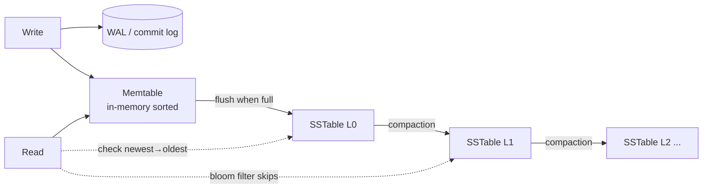
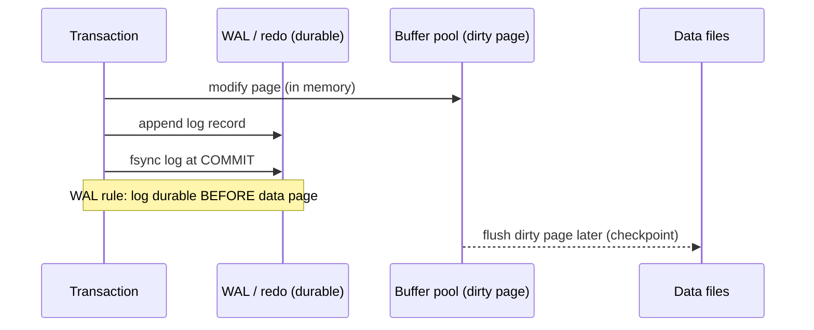

# Database Storage Internals & Engines

This topic is about **how a database physically stores and retrieves your rows** —
the layer under the SQL. Two questions decide almost everything: *how is data laid out
on disk* (the on-disk structure and its update discipline) and *how do we survive a
crash without losing or corrupting committed data* (write-ahead logging and recovery).
Every serious engine is a set of answers to those questions, and interviewers probe
whether you understand the mechanisms and their trade-offs rather than reciting vendor
marketing.

The two dominant on-disk families are the **B+tree** (in-place update, read-optimized —
PostgreSQL, InnoDB/MySQL, SQL Server, Oracle) and the **LSM-tree** (append-only,
write-optimized — RocksDB, LevelDB, Cassandra, ScyllaDB, HBase). Both are wrapped in a
durability layer (WAL / redo / binlog) and, in an MVCC engine, a versioning scheme. This
file walks each mechanism, the amplification trade-offs that connect them (the RUM
conjecture), and the concrete differences between real engines.

> [!KEY-TAKEAWAY]
> Storage engines trade among **Read, Update, and Memory** overhead — you cannot minimize
> all three at once (the RUM conjecture). B+trees optimize reads with in-place updates;
> LSM-trees optimize writes by batching them into an append-only log and paying later in
> compaction and read amplification.

## B-Tree and B+Tree Storage Engines

A **B+tree** is a balanced, block-oriented search tree that is the default index and
table structure for virtually every relational OLTP engine. Nodes are the size of a disk
**page** (commonly 4–16 KB; InnoDB default 16 KB, PostgreSQL 8 KB). Interior (branch)
nodes store only keys and child pointers to route the search; **all actual row data or
row pointers live in the leaf level**, and leaves are linked in a doubly-linked list so a
range scan walks siblings without re-descending the tree. That last property is why B+trees
(not plain B-trees, which store data in every node) dominate: range queries and ordered
scans are cheap.

Key facts an interviewer expects:

- **Height is very small.** With fan-out of hundreds per page, a tree of billions of rows is
  typically 3–4 levels deep, so a point lookup is a handful of page reads — and the upper
  levels stay cached in the buffer pool, so in practice it is ~1 physical I/O.
- **Updates are in-place.** To change a row you find its leaf page and mutate it in the
  buffer pool, marking the page dirty; the change is made durable by the WAL, and the dirty
  page is flushed later at a checkpoint. This is the defining contrast with LSM.
- **O(log n)** for point lookup, insert, delete, and the *start* of a range scan.
- **Splits and merges** keep the tree balanced: inserting into a full page splits it into
  two half-full pages and pushes a separator key up; deletes can merge underfull pages. Splits
  are the source of B+tree write amplification and fragmentation.

**Clustered vs secondary index.** In InnoDB the table *is* a B+tree keyed by the primary
key — this is the **clustered index**, and the leaf holds the full row. A secondary index
leaf stores the indexed columns plus the **primary key value**, so a secondary lookup that
needs non-indexed columns must do a second probe into the clustered index (a "bookmark
lookup"). PostgreSQL is different: its table is an unordered **heap**, and *all* indexes
(including the primary key) are separate B+trees whose leaves hold a `ctid` (physical
tuple pointer) into the heap — Postgres has no clustered index.

```sql
-- InnoDB: leaf of the clustered index holds the whole row, ordered by PK.
-- A range scan on PK is sequential I/O along the linked leaf pages.
SELECT * FROM orders WHERE id BETWEEN 1000 AND 2000;

-- Postgres: the primary key is a separate B-tree; rows live in the heap.
EXPLAIN (ANALYZE, BUFFERS) SELECT * FROM orders WHERE id = 1500;
--  Index Scan using orders_pkey on orders  (cost=0.43..8.45 rows=1 ...)
--    Index Cond: (id = 1500)
--    Buffers: shared hit=4       -- ~3 tree levels + 1 heap page
```

> [!TIP]
> "B-tree" in database conversation almost always means **B+tree** (data only in leaves,
> leaves linked for range scans). Saying so out loud signals you know the distinction.

## LSM-Trees: Memtable, SSTables, and Compaction

A **Log-Structured Merge-tree** turns random writes into sequential ones. Writes go to two
places: an on-disk **WAL** (for durability) and an in-memory sorted structure called the
**memtable** (usually a skip list or balanced tree). No disk seek to find-and-update a page —
you just append. When the memtable fills, it is **flushed** as an immutable, sorted file on
disk called an **SSTable** (Sorted String Table), and a fresh memtable takes over. SSTables
are never modified in place; they are only created and deleted.

Because data is spread across many SSTables plus the memtable, a **read** may have to check
several places, newest-to-oldest, until it finds the key. To keep this bounded, engines
use:

- **Per-SSTable Bloom filters** so a read can skip a file that definitely does not contain
  the key (turns "check every file" into "check only files that might match").
- **Sparse block indexes / fence pointers** to jump to the right block within an SSTable.
- **Compaction**: a background process that merges multiple SSTables into fewer, larger,
  non-overlapping ones, discarding overwritten values and **tombstones** (delete markers).
  Compaction is what reclaims space and keeps read amplification in check — and it is the
  dominant source of an LSM engine's write amplification and I/O cost.



**Compaction strategies** (the classic interview fork):

| Strategy | How it merges | Optimizes | Costs |
|---|---|---|---|
| **Leveled** (RocksDB default, Cassandra LCS) | Non-overlapping levels, each ~10x the previous; key exists in ≤1 SSTable per level | Low **read** & **space** amplification | High **write** amplification (~10–30x) |
| **Size-tiered / Tiered** (Cassandra STCS, default HBase) | Merge SSTables of similar size into a bigger one | Low **write** amplification | High **space** amp (transient 2x) & **read** amp |

Deletes are subtle: an LSM cannot erase a key in place, so it writes a **tombstone**. The
key is only truly gone once compaction has processed every SSTable containing an older
version *and* enough time has passed (`gc_grace_seconds` in Cassandra) to guarantee the
tombstone reached all replicas. Until then, deletes *cost* space and can *slow* reads.

> [!WARNING]
> LSM range scans and reads of frequently-deleted key ranges can be pathologically slow if
> **tombstones** accumulate (e.g. a Cassandra queue anti-pattern). The read must scan past
> thousands of tombstones that have not yet been compacted away.

## Read, Write, and Space Amplification (the RUM Conjecture)

These three ratios are the vocabulary for comparing engines. They are *amplification
factors* — how much more work the engine does than the logical operation implies:

- **Write amplification (WA):** bytes actually written to storage ÷ bytes of logical data
  written. A B+tree rewrites a whole 8–16 KB page to change one row and also writes the
  WAL; an LSM rewrites data repeatedly during compaction. On flash this also determines
  device wear.
- **Read amplification (RA):** pages/files read per logical read. A B+tree point lookup
  reads ~tree-height pages; an LSM may probe the memtable + several SSTables (mitigated by
  Bloom filters).
- **Space amplification (SA):** bytes on disk ÷ bytes of live logical data. B+trees waste
  space via partially-full pages and fragmentation; LSMs hold obsolete versions/tombstones
  until compaction, and tiered compaction transiently doubles space.

The **RUM conjecture** (Athanassoulis et al., 2016) states you can optimize for at most two
of **R**ead, **U**pdate, and **M**emory (space) overhead at the expense of the third — there
is no structure that is simultaneously best at all three. This is the theoretical anchor for
"B+tree vs LSM": choose based on your workload's read/write mix and space budget.

| | B+tree | LSM-tree |
|---|---|---|
| Write amplification | Moderate (page rewrite + WAL) | High (compaction), but **sequential** |
| Read amplification | Low (few, cached pages) | Higher (many SSTables; Bloom-filtered) |
| Space amplification | Fragmentation, half-full pages | Obsolete versions + tombstones |
| Best for | Read-heavy, point + range, updates | Write-heavy, ingest, append-mostly |

> [!INTERVIEW]
> "When would you pick an LSM engine over a B+tree?" Good answer: **write-heavy / ingest-heavy
> workloads on flash** where you want to convert random writes into sequential ones and can
> tolerate higher read/compaction cost (time-series, event logs, metrics, message stores).
> Pick a B+tree for **read-heavy OLTP** with mixed point/range queries and in-place updates.

## Page Layout, Heap Files, and the Buffer Pool

Storage is organized into fixed-size **pages** (a.k.a. blocks) — the unit of I/O between
disk and memory. A typical **slotted page** layout has a header, a **slot array / line
pointer array** growing from the front, and the actual row data (tuples) growing from the
back; free space sits in the middle. The slot array indirection lets a row be moved within
its page (e.g. after an update grows it) without invalidating pointers that reference it by
slot number.

- **Heap file:** a table stored as an unordered collection of pages (PostgreSQL tables,
  MyISAM data files). Rows are appended wherever there is free space; order is not
  guaranteed. Contrast with a **clustered index** (InnoDB) where the table *is* the
  primary-key B+tree and rows are stored in key order.
- **Free space management:** Postgres uses a **Free Space Map (FSM)** per table to find a
  page with room for a new/updated tuple; a **Visibility Map (VM)** tracks all-visible pages
  to allow index-only scans and skip them during vacuum.
- **Large values / overflow:** a value too big for a page is stored out-of-line — Postgres
  **TOAST** (compress + slice into chunks in a side table); InnoDB stores long
  `VARCHAR/BLOB/TEXT` on **overflow pages** with a 20-byte pointer in the row.

The **buffer pool** (InnoDB `innodb_buffer_pool_size`) or, for Postgres, its own
`shared_buffers` *plus* the OS page cache, is the in-memory cache of pages. Reads and writes
happen against cached pages, not the disk directly. Key mechanics:

- Pages are evicted by an approximate-LRU policy (InnoDB uses a young/old sublist to resist
  a large scan flushing the whole pool). A page brought in by a full scan goes on the "old"
  end so it is evicted quickly.
- A modified cached page is a **dirty page**; it differs from its on-disk copy. Dirty pages
  are flushed asynchronously so the write path is not blocked by disk latency.
- **The buffer pool is the single most important tuning knob** for a B+tree engine: if the
  working set (hot pages + index upper levels) fits in the pool, most reads are memory hits.

> [!TIP]
> PostgreSQL deliberately keeps `shared_buffers` modest (commonly ~25% of RAM) because it
> *also* relies on the OS page cache — it does double buffering. InnoDB expects to own the
> memory and is typically sized to ~70–80% of RAM with `O_DIRECT` to bypass the OS cache.

## Dirty Pages, Checkpoints, and Flushing

Because writes hit the WAL immediately but modified data pages sit dirty in the buffer pool,
the engine must periodically reconcile the two. A **checkpoint** writes dirty pages out to
their data files and records a marker in the WAL saying "all changes up to this log position
are now safely in the data files." Its two jobs:

1. **Bound recovery time.** After a crash, recovery only has to replay WAL from the last
   checkpoint forward, not from the beginning of time. More frequent checkpoints → faster
   recovery but more steady-state I/O.
2. **Allow log reclamation.** WAL segments older than the checkpoint can be recycled/removed
   (assuming no replication slot or archive still needs them).

Engines spread checkpoint I/O over time to avoid a "write storm" that stalls foreground work:

- **PostgreSQL:** `checkpoint_timeout` (default 5 min) and `max_wal_size` trigger
  checkpoints; `checkpoint_completion_target` (default 0.9) spreads the flush over ~90% of the
  interval. A background writer trickles out dirty pages between checkpoints.
- **InnoDB:** does **fuzzy (sharp-free) checkpointing** continuously via page-cleaner threads,
  driven by how full the redo log is (adaptive flushing). It tracks the oldest un-flushed
  change with an LSN watermark so redo can be trimmed.

> [!WARNING]
> If dirty pages accumulate faster than they can be flushed (undersized redo log, slow disk,
> a huge burst of writes), the engine throttles or stalls user writes to keep recovery
> bounded. In InnoDB this shows up as "checkpoint age" pressure / flushing sync waits.

## Write-Ahead Logging, Redo, Undo, and the binlog

**Write-Ahead Logging (WAL)** is the rule that makes durability cheap and recovery possible:
**the log record describing a change must be flushed to durable storage *before* the modified
data page is** (or before commit is acknowledged). Because the log is written sequentially
and the data pages are flushed lazily, you get durability at the cost of one sequential
append instead of a random page write per commit. This is the mechanism behind the "D" in
ACID.

There are two logically distinct logs, and confusing them is a classic interview trip-up:

- **Redo log** (InnoDB redo, Postgres WAL, Oracle redo): *physical/physiological* records of
  page changes. Used at recovery to **redo** committed changes not yet flushed to data files
  ("roll forward"). This is the crash-recovery log.
- **Undo log** (InnoDB undo tablespace, Oracle undo, Postgres old row versions in the heap):
  records how to **reverse** a change. Used to **roll back** uncommitted transactions and,
  crucially, to **reconstruct old row versions for MVCC** reads.

Separately, MySQL has the **binary log (binlog)** — a *logical* record of changes at the
server layer (above the storage engine), used for **replication** and point-in-time recovery,
not crash recovery. So a committed MySQL transaction is written to *both* the InnoDB redo log
(engine, physical, for durability) and the binlog (server, logical, for replication),
coordinated by an internal **two-phase commit** so they never disagree after a crash.
PostgreSQL has no separate binlog: its single WAL serves both crash recovery *and* streaming
replication.



## Crash Recovery and ARIES

The canonical recovery algorithm is **ARIES** (Mohan et al., IBM, 1992), and its ideas are
in essentially every WAL-based engine. It relies on the **LSN** (Log Sequence Number): every
log record has a monotonic LSN, and every page stores the LSN of the last log record that
modified it (`pageLSN`). Comparing a page's LSN to a log record's LSN tells recovery whether
that change is already reflected in the page.

ARIES recovery has **three phases**, in order:

1. **Analysis:** scan forward from the last checkpoint to rebuild the Dirty Page Table and
   the Transaction Table — determine which transactions were in-flight and which pages might
   need redo.
2. **Redo:** replay *all* logged changes (even those of transactions that later aborted) from
   the earliest needed LSN, but only where `pageLSN < logLSN` (idempotent — skip changes
   already on the page). This restores the exact pre-crash state ("repeating history").
3. **Undo:** roll back the changes of transactions that had not committed at crash time, using
   the undo/log chain, writing **CLRs** (Compensation Log Records) so that undo work itself is
   crash-safe and never repeated.

Three ARIES principles worth naming: **WAL** (log before data), **repeating history during
redo** (redo everything, then undo losers), and **logging changes during undo** via CLRs.

> [!KEY-TAKEAWAY]
> Because redo is **idempotent** (guarded by `pageLSN`), recovery can crash and restart
> repeatedly and still converge to the correct state. That idempotence is the whole reason WAL
> replay is safe.

## MVCC Version Storage: Postgres Heap vs InnoDB Undo

**Multi-Version Concurrency Control (MVCC)** lets readers and writers avoid blocking each
other by keeping *multiple versions* of a row: a reader sees a consistent snapshot as of its
transaction/statement start, while a concurrent writer creates a new version. The interview
depth is in *where the old versions physically live*, because the two mainstream engines chose
opposite designs with opposite operational consequences.

**PostgreSQL — versions stored in the heap (append-mostly).** An `UPDATE` does **not**
overwrite the row; it writes a **new tuple version** in the heap and marks the old one with
`xmax`. Each tuple carries `xmin`/`xmax` (creating/deleting transaction ids); a snapshot
decides which version is visible. Consequences:

- **Updates and deletes leave dead tuples behind** → tables and indexes grow ("**bloat**").
- **VACUUM** reclaims space from dead tuples (making it reusable within the table); **VACUUM
  FULL** rewrites the table to actually shrink it (takes an `ACCESS EXCLUSIVE` lock).
  **Autovacuum** runs this automatically. VACUUM also updates the visibility map and prevents
  **transaction-ID wraparound**.
- **HOT (Heap-Only Tuple)** updates optimize the common case: if the updated columns are not
  indexed *and* the new version fits on the same page, Postgres chains the new version on the
  page without adding index entries — greatly reducing index bloat.

**MySQL/InnoDB — old versions stored in the undo log.** An `UPDATE` modifies the row **in
place** in the clustered index and writes the *previous* values to the **undo log**. A reader
needing an older snapshot walks the undo chain (via the row's roll pointer) to reconstruct it.
Consequences:

- The main table does not accumulate dead row versions the way a Postgres heap does; instead
  the **undo log (history) grows** if a long-running transaction holds back **purge** (the
  background thread that discards undo no longer needed by any snapshot).
- A **long-running read transaction** is dangerous in *both* engines but shows up differently:
  Postgres can't vacuum dead tuples (bloat); InnoDB can't purge undo (history-list length
  grows, secondary-index scans slow down).

| | PostgreSQL | InnoDB |
|---|---|---|
| Old versions live in | The heap (new tuple per update) | The undo log |
| Update cost | Cheap write, but bloat + index churn | Rewrites row + undo write |
| Reclaiming space | VACUUM / autovacuum | Purge thread |
| Long-txn hazard | Table/index **bloat** | **History list** growth |
| Rollback cost | Cheap (just don't make version visible) | Must apply undo |

> [!WARNING]
> A forgotten open transaction (e.g. an idle `BEGIN` in a connection pool, or a leaked
> analytics session) is one of the most common production incidents in MVCC databases: it
> pins the oldest snapshot, so Postgres bloats and InnoDB's undo history explodes. Monitor
> `pg_stat_activity` / `information_schema.innodb_trx` for long-idle transactions.

## Fill Factor and Page Fragmentation

**Fill factor** (Postgres `fillfactor`, SQL Server `FILLFACTOR`) is the percentage of a page
that is filled when the page is first populated, deliberately leaving free space for future
in-page growth. It is a direct lever on the WA/SA trade-off:

- **B+tree indexes default to a high fill factor (~90%)** because index entries rarely grow in
  place — you want them packed for read efficiency and small size.
- **Heap tables** benefit from a *lower* fill factor when rows are frequently **updated**: the
  reserved space lets an updated row stay on the same page. In Postgres this enables **HOT
  updates** (no new index entries); in general it avoids **page splits** (B+tree) and
  **row migration / forwarding pointers** (InnoDB moves an over-grown row and leaves a pointer,
  costing an extra I/O forever after).

```sql
-- Postgres: leave 20% free on heap pages of a hot, frequently-updated table
ALTER TABLE sessions SET (fillfactor = 80);
-- new pages fill to 80%, leaving room for HOT updates in place
```

Trade-off: a lower fill factor **wastes space and reduces cache density** (fewer live rows per
cached page → higher read amplification) but **reduces write amplification and fragmentation**
from splits/migrations. Append-only or insert-only tables should keep a high fill factor;
update-heavy tables benefit from headroom. Over time, page splits and dead-tuple churn cause
**fragmentation** (logical order ≠ physical order, half-empty pages), remedied by `REINDEX`,
`CLUSTER`, `VACUUM FULL`, or `OPTIMIZE TABLE` — all of which rewrite the structure.

## Row vs Column Storage

The **storage orientation** decides which workloads are fast. A **row store** (a.k.a.
row-oriented / N-ary Storage Model, NSM) stores all columns of a row contiguously; a **column
store** (Decomposition Storage Model, DSM) stores each column's values contiguously across
rows.

- **Row store — OLTP.** Reading or writing a *whole row* touches one page. Ideal for point
  lookups, single-row inserts/updates, and transactional workloads that need most columns of a
  few rows. This is InnoDB, PostgreSQL heap, MyISAM.
- **Column store — OLAP / analytics.** A query like `SELECT AVG(price) FROM sales` reads only
  the `price` column, skipping all others — enormous I/O savings on wide tables. And because a
  column holds homogeneous values, **compression is far better**: run-length encoding,
  dictionary encoding, delta, bit-packing, frame-of-reference. Vectorized/SIMD execution
  processes a column batch at a time. This is Parquet/ORC, ClickHouse, Redshift, Snowflake,
  DuckDB, Vertica, and Postgres/columnar extensions.

| Dimension | Row store (OLTP) | Column store (OLAP) |
|---|---|---|
| Access unit | Whole row | Single column across rows |
| Best query | Point lookup, get/update a row | Aggregate/scan over few columns |
| Writes | Cheap single-row insert/update | Batch load; single-row update expensive |
| Compression | Modest (heterogeneous row) | Excellent (homogeneous column) |
| Examples | InnoDB, Postgres heap | Parquet, ClickHouse, Redshift, DuckDB |

> [!INTERVIEW]
> A common trap: "just add columns/indexes to my OLTP database for analytics." Point out that
> a full-table aggregate over a wide row store reads every column of every row; a column store
> reads only the needed columns and compresses them 10x+. That's why analytics belongs on a
> columnar engine (or a columnar replica / HTAP setup), not the OLTP primary.

## Write-Ahead (WAL) vs Write-Behind Caching

These are two different flush disciplines and are easily confused:

- **Write-ahead logging** is about **durability ordering**: the *log* is forced to disk before
  the *data page*, and before commit is acknowledged. The commit is durable via the sequential
  log even though the data page is still dirty in memory. This is the database engine's commit
  path.
- **Write-behind (write-back) caching** is about **deferring the data-page write itself**: the
  cache acknowledges a write immediately and flushes the dirty page to the backing store later,
  asynchronously (the buffer-pool dirty-page/checkpoint mechanism, or a disk controller's
  write-back cache). It boosts throughput but risks data loss if the cache's contents are lost
  before the flush — *unless* a durable log (WAL) already recorded the change.

The two work **together**: the WAL provides durability so that the data-page flush is free to
be lazy (write-behind). Contrast with **write-through**, where every write goes synchronously
to the backing store (safe, slower). A dangerous real-world case is a disk/RAID controller with
a **volatile write-back cache and no battery/flash backup**: it can acknowledge an `fsync`
that has not truly hit stable media, silently breaking the WAL's durability guarantee.

> [!KEY-TAKEAWAY]
> WAL = *ordering* guarantee (log before data, for durability). Write-behind = *timing*
> optimization (flush data pages lazily, for throughput). WAL is precisely what makes lazy
> write-behind of data pages safe.

## fsync, Durability, and the Performance Knob

Writing to a file is not durable until the OS has flushed the page cache to stable storage via
`fsync()` / `fdatasync()`. This single syscall is the crux of the **durability-vs-performance**
trade-off: a real `fsync` costs a full rotation/flash-program latency and caps commit
throughput, so every engine exposes knobs to relax it.

- **PostgreSQL:** `synchronous_commit` controls whether a COMMIT waits for the WAL `fsync`.
  `on` (default) = durable; `off` = commit returns before WAL is flushed, risking loss of the
  last few hundred ms of *committed* transactions on crash but **never corrupting** the
  database (the WAL is still consistent). The `fsync = off` GUC disables flushes entirely and
  **can corrupt** the database — never use it in production. `wal_sync_method` selects the
  actual syscall.
- **MySQL/InnoDB:** `innodb_flush_log_at_trx_commit` — `1` (default, ACID): flush + fsync redo
  every commit; `2`: write to OS cache every commit but fsync ~once/sec (survives a *process*
  crash, loses ~1s on an *OS/power* crash); `0`: flush ~once/sec regardless of commit (fastest,
  least durable). `sync_binlog=1` similarly forces an fsync of the binlog per commit.
- **Group commit:** engines batch the fsyncs of many concurrent commits into one flush, so
  fsync cost is amortized across the group — this is why concurrency can *raise* commit
  throughput.

> [!WARNING]
> Relaxing fsync (`synchronous_commit=off`, `innodb_flush_log_at_trx_commit=2`) trades a
> **bounded window of committed-transaction loss** on power failure for large throughput gains.
> That is acceptable for logs/metrics/derived data, but not for a system of record. Never
> confuse it with `fsync=off`, which risks **corruption**, not just recent-transaction loss.

## InnoDB vs MyISAM vs RocksDB vs LevelDB

A concrete comparison of four widely-discussed engines pins down the abstractions above:

| Engine | Structure | Transactions | Durability/Recovery | MVCC | Notable |
|---|---|---|---|---|---|
| **InnoDB** (MySQL default since 5.5) | Clustered B+tree | Full ACID, row-level locks | Redo/undo logs, crash-safe | Yes (undo log) | FKs, buffer pool, the workhorse OLTP engine |
| **MyISAM** (old MySQL default) | B-tree index + separate heap data | **None** | Not crash-safe; needs `REPAIR TABLE` | No | **Table-level locking**, no FKs; fast read-mostly, small footprint. Legacy. |
| **LevelDB** (Google) | LSM-tree | Single-key atomic + `WriteBatch` | WAL + manifest | Snapshots | Embedded KV library; single-process, no server, no built-in concurrency for multiple processes |
| **RocksDB** (Meta, forked from LevelDB) | LSM-tree | Optimistic + pessimistic txns | WAL, crash-safe | Snapshots | Column families, tunable compaction, prefix Bloom; powers MyRocks, Kafka Streams, CockroachDB storage, Cassandra alt, etc. |

Points interviewers like to hear:

- **InnoDB vs MyISAM:** InnoDB replaced MyISAM as MySQL's default because MyISAM offers **no
  transactions, no crash recovery, and only table-level locks** (a single write blocks all
  readers/writers of the table). MyISAM's remaining niches (compact read-only data, full-text
  in old versions) are largely obsolete; choosing it today is almost always wrong.
- **RocksDB vs LevelDB:** RocksDB is a heavily-engineered fork adding **multi-threaded
  compaction, column families, transactions, better tunability, and merge operators**. LevelDB
  is a minimal single-threaded embedded store. Both are **libraries** (embedded in your
  process), not standalone database servers — contrast with InnoDB, which is a storage engine
  inside the MySQL server.
- **MyRocks** = MySQL with RocksDB as the storage engine (via the pluggable engine API),
  chosen at Meta for its far lower **space and write amplification** than InnoDB on flash — a
  clean illustration of swapping a B+tree engine for an LSM engine under the same SQL layer.

## Common follow-up questions

- **"Why do write-heavy systems favor LSM-trees?"** They convert random in-place page writes
  into sequential appends (memtable flush + WAL), and defer/merge the real I/O in background
  compaction — great for flash endurance and ingest throughput, at the cost of read and
  compaction (write) amplification.
- **"What is write amplification and why does it matter on SSDs?"** Bytes physically written ÷
  logical bytes. On flash it drives wear (limited program/erase cycles) and steals write
  bandwidth; LSM compaction and B+tree page rewrites are the main sources.
- **"Difference between the redo log, undo log, and binlog?"** Redo = physical, roll-forward
  committed changes at recovery (durability). Undo = reverse changes / build MVCC snapshots.
  Binlog = MySQL server-layer logical log for replication & PITR (not crash recovery).
- **"Why does a long-running transaction hurt Postgres?"** It pins the oldest snapshot, so
  autovacuum can't reclaim dead tuples → table/index **bloat**; in InnoDB the same thing blocks
  **purge** → undo history growth and slow scans.
- **"What does a checkpoint do?"** Flushes dirty pages and records a WAL position so recovery
  can start there (bounds recovery time) and old WAL can be recycled.
- **"How does ARIES guarantee correctness across repeated crashes?"** Redo is idempotent
  (guarded by `pageLSN`), and undo logs CLRs, so recovery can be interrupted and restarted and
  still converge.
- **"When would you tune `innodb_flush_log_at_trx_commit=2` or `synchronous_commit=off`?"** For
  non-authoritative data (metrics, logs, caches, derived tables) where a bounded loss of the
  last ~1s of committed transactions on power loss is acceptable in exchange for throughput —
  never for a system of record.
- **"Row vs column store — which for reporting?"** Column store: it reads only the needed
  columns and compresses homogeneous data far better, ideal for scans/aggregations.

## References

- Athanassoulis, Kester, et al., **"Designing Access Methods: The RUM Conjecture"** (EDBT 2016).
- Mohan et al., **"ARIES: A Transaction Recovery Method..."** (ACM TODS, 1992).
- Berenson, Bernstein, Gray, et al., **"A Critique of ANSI SQL Isolation Levels"** (SIGMOD 1995).
- Martin Kleppmann, **Designing Data-Intensive Applications**, Ch. 3 (Storage & Retrieval).
- O'Neil et al., **"The Log-Structured Merge-Tree (LSM-Tree)"** (Acta Informatica, 1996).
- PostgreSQL docs: Storage (Ch. 73), WAL (Ch. 30), Routine Vacuuming (Ch. 25), `fillfactor`,
  `synchronous_commit`.
- MySQL Reference Manual: InnoDB Architecture, Redo/Undo Log, `innodb_flush_log_at_trx_commit`,
  InnoDB vs MyISAM.
- RocksDB & LevelDB documentation (wiki): compaction styles, column families, `WriteBatch`.
- Cassandra docs: compaction strategies (STCS/LCS/TWCS), tombstones & `gc_grace_seconds`.
