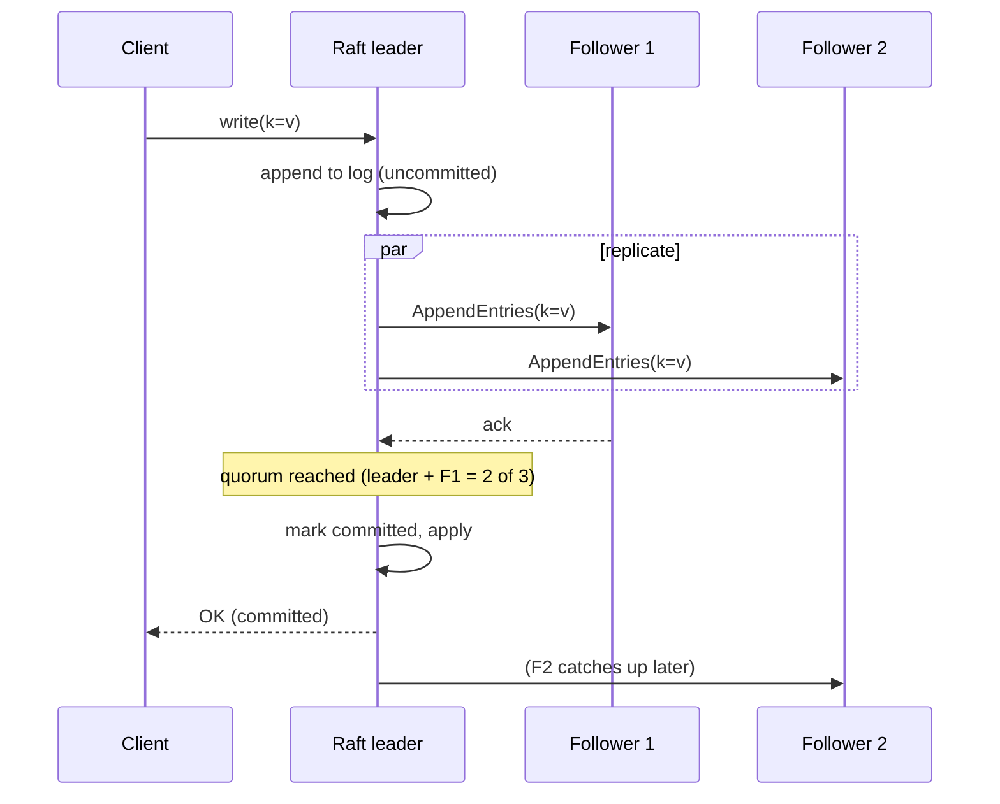
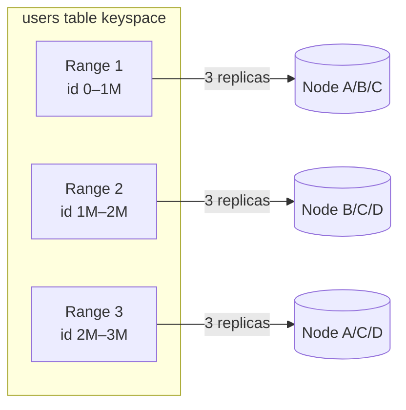
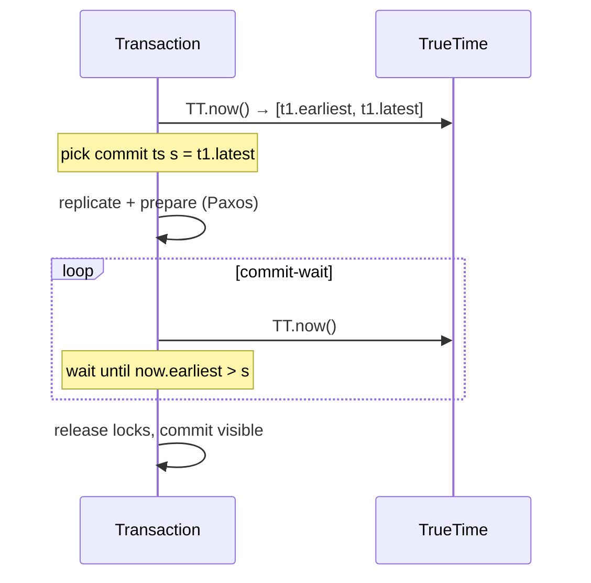
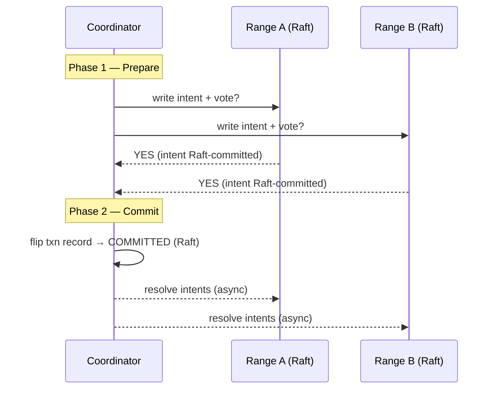

# Distributed SQL & NewSQL

**NewSQL** is a class of databases that keep the relational SQL interface and full
ACID transactions of a traditional RDBMS while scaling **horizontally** across many
nodes — the property that classic single-node PostgreSQL/MySQL lack and that first-
generation NoSQL systems (Dynamo, Cassandra, MongoDB) achieved only by giving up
strong consistency and/or SQL. **Distributed SQL** is the modern subset of NewSQL that
is genuinely shared-nothing and geo-distributed: Google **Spanner**, **CockroachDB**,
**YugabyteDB**, TiDB, and (deterministically) Calvin/FaunaDB.

This note is about the *mechanism*: how these systems replicate data with a consensus
protocol (Raft/Paxos), how they shard the keyspace automatically and rebalance it, how
they order transactions in time without a global clock (TrueTime vs hybrid logical
clocks), how distributed commit (two-phase commit layered on Raft) works and why a
cross-region commit is inherently slow, and what consistency guarantees
(serializability, linearizability, external consistency) actually mean.

The canonical references are the Spanner paper (Corbett et al., OSDI 2012), the Raft
paper (Ongaro & Ousterhout, 2014), the Calvin paper (Thomson et al., SIGMOD 2012),
Amazon's Dynamo paper (2007) for the NoSQL contrast, the CockroachDB and YugabyteDB
architecture docs, and Kleppmann's *Designing Data-Intensive Applications* (DDIA),
ch. 5–9.

> [!KEY-TAKEAWAY]
> Distributed SQL does not repeal physics. Strong consistency across geographic regions
> costs at least one round-trip of consensus latency on every write, because a majority
> of replicas — potentially in other data centers — must acknowledge each committed
> log entry. NewSQL buys you SQL + ACID *at scale*; it does not buy you free low-latency
> global writes.

---

## The NewSQL premise vs NoSQL and sharded SQL

For decades the "scaling a database" menu had three unappealing options:

1. **Scale up a single-node RDBMS** (bigger box). Keeps SQL + ACID, but hits a
   hardware ceiling and a single point of failure.
2. **Manually shard SQL** (application-level partitioning, or Vitess in front of
   MySQL). Scales writes, but cross-shard transactions, joins, and re-sharding become
   the application's problem.
3. **Adopt NoSQL** (Dynamo/Cassandra/Mongo). Scales horizontally and survives node
   loss, but historically dropped multi-key ACID transactions, SQL, and often strong
   consistency (eventual consistency, "tunable" quorums).

**NewSQL's premise is that you should not have to choose.** A NewSQL database:

- Speaks SQL (usually a PostgreSQL- or MySQL-wire-compatible dialect).
- Offers **ACID transactions**, including multi-row and multi-shard, at a strong
  isolation level (typically **serializable**).
- **Scales out horizontally**: add nodes to add throughput and capacity.
- **Survives node and zone failures automatically** via replication + consensus.

The term "NewSQL" was coined by analyst Matthew Aslett (451 Group) in 2011. Michael
Stonebraker's H-Store/VoltDB (in-memory, single-threaded partitions) is an early
example; Google Spanner (2012) is the landmark geo-distributed one.

| Dimension | Traditional single-node SQL | Sharded SQL (Vitess) | NoSQL (Dynamo/Cassandra) | Distributed SQL (Spanner/CRDB) |
|---|---|---|---|---|
| SQL + joins | Yes | Yes, but cross-shard is hard | No / limited | Yes |
| Horizontal write scale | No | Yes | Yes | Yes |
| Multi-key ACID | Yes | Hard across shards | Usually no | Yes |
| Automatic resharding | N/A | Manual/assisted | Yes | Yes |
| Default consistency | Strong | Strong per shard | Eventual/tunable | Strong (serializable) |
| Survives node loss | No (needs replica) | Per-shard | Yes | Yes |

> [!INTERVIEW]
> "Isn't NewSQL just NoSQL with SQL bolted on?" No. The defining claim is **ACID +
> serializable transactions across shards**, which NoSQL systems deliberately gave up
> for availability/latency (per Dynamo/CAP). NewSQL chooses the CP side of CAP and
> engineers around the latency cost with consensus and clever clocks.

---

## Consensus replication with Raft

Distributed SQL replicates each piece of data to an odd number of nodes (typically 3
or 5) and keeps the copies consistent using a **consensus protocol** — **Raft** in
CockroachDB, YugabyteDB, and TiDB; **Paxos** (Multi-Paxos) in Spanner. Consensus is
what lets the system commit a write to a majority and survive the loss of a minority
of replicas without ever exposing a divergent value.

**How Raft works (the mechanism):**

- Each replication group elects one **leader**; the others are **followers**.
- Every write is an entry appended to the group's **replicated log**. The leader sends
  the entry to followers (`AppendEntries` RPCs).
- An entry is **committed** once a **majority (quorum)** of replicas have durably
  persisted it. With 3 replicas the quorum is 2; with 5 it is 3.
- Committed entries are then **applied** to each replica's state machine (the actual
  key-value/SQL storage) in log order, so every replica converges to the same state.
- Leaders hold a **lease** and send heartbeats; if followers stop hearing from the
  leader they start an election for a new **term**. A candidate needs a majority of
  votes to win, which guarantees at most one leader per term.

**Why a majority?** Any two majorities of the same group overlap in at least one node,
so a newly elected leader is guaranteed to have seen the latest committed entry. This
is why clusters use **odd** replica counts: 3 tolerates 1 failure, 5 tolerates 2. Going
from 3 to 4 replicas does **not** improve fault tolerance (a 4-node quorum is still 3,
so you still only tolerate 1 failure) but adds write cost.

> [!WARNING]
> Consensus provides consistency, not free durability against correlated failure. If a
> majority of a range's replicas are in the same failure domain (rack, AZ, region) and
> that domain dies, the range loses quorum and becomes **unavailable** for writes until
> replicas recover. Placement/zone constraints exist to spread replicas across domains.

Reads are **not** usually run through the log. The **leaseholder** (in CockroachDB) or
the Paxos leader (in Spanner) can serve a linearizable read locally as long as it holds
a valid time-based lease, avoiding a consensus round-trip per read.

In CockroachDB the **Raft leader** and the **leaseholder** are two distinct roles, not
the same thing. The Raft leader drives log replication for a range (it sends the
`AppendEntries` and decides commit order). The leaseholder is the single replica that
holds the time-based **lease** and is the only one allowed to serve consistent reads and
coordinate writes for that range. They are normally **co-located** on the same node —
CockroachDB actively rebalances to keep the leaseholder on the Raft leader so a read/write
doesn't have to hop from one to the other — but they are conceptually separate and can
temporarily diverge after a leadership change until the system re-converges them.

---

## Automatic sharding: ranges vs hashing, and rebalancing

Distributed SQL splits the total keyspace into many **shards** (Spanner: *splits*;
CockroachDB: *ranges*; TiDB: *regions*; YugabyteDB: *tablets*), each of which is an
independently Raft-replicated unit. This automatic, online partitioning — with no
application involvement — is a core differentiator from manual sharding.

**Two partitioning strategies:**

- **Range partitioning** (ordered): the key space is split into contiguous key ranges,
  e.g. `[A, F)`, `[F, M)`, `[M, Z)`. Keeps sorted order, so **range scans and `ORDER
  BY`/`BETWEEN` queries are efficient** (a scan hits a small number of contiguous
  ranges). This is Spanner's and CockroachDB's default and TiDB's model.
- **Hash partitioning**: the key is hashed and the hash determines the shard. Spreads
  writes **evenly** and avoids hotspots, but **destroys key order**, so a range scan
  must fan out to every shard. YugabyteDB defaults to hash sharding; CockroachDB offers
  hash-sharded indexes as an opt-in.

> [!TIP]
> The classic hotspot is a **monotonically increasing key** (auto-increment ID or a
> `timestamp`-prefixed primary key) under range partitioning: every new row lands at
> the "end" range, so one shard/leaseholder takes all the write traffic while the rest
> sit idle. Fixes: use a random UUID, a hash-sharded index, or reverse/scatter the
> key prefix. This is the single most common distributed-SQL performance bug.

**Automatic rebalancing / splitting:**

- When a range exceeds a size threshold (CockroachDB default ~512 MiB) or gets too hot,
  it **splits** into two; when ranges shrink they can **merge**.
- A background process (CockroachDB's "distribution layer" driven by gossip; Spanner's
  placement driver; TiDB's **PD**, Placement Driver) continuously **rebalances**
  replicas across nodes to equalize load and capacity, moving replicas by adding a new
  one and removing an old one via Raft membership changes.
- Because each range is small and independently replicated, the system scales by simply
  spreading more ranges over more nodes — no global stop-the-world reshard.

---

## TrueTime and external consistency (Spanner)

Spanner's headline innovation is **TrueTime**: an API that returns time as an
**interval** `[earliest, latest]` (`TT.now()` returns a bounded uncertainty window),
backed by **GPS receivers and atomic clocks** in every data center. Instead of
pretending a machine's clock is exact, TrueTime *quantifies* the clock uncertainty ε
(epsilon), typically a few milliseconds.

**Why this matters:** Spanner uses TrueTime to assign each transaction a commit
**timestamp** and to guarantee **external consistency** (a.k.a. linearizability /
strict serializability for transactions): if transaction T1 commits before T2 *starts*
in real time, then T1's timestamp < T2's timestamp, and any reader sees them in that
order. This is the strongest guarantee — the serial order the database picks respects
real-world wall-clock order.

**The commit-wait trick:** to make timestamps safe despite clock uncertainty, Spanner
picks a commit timestamp `s` and then **waits out the uncertainty** — it blocks the
commit until `TT.now().earliest > s`, i.e. until it is *certain* that `s` is in the
past everywhere. This "commit wait" is on the order of `2 * ε` and is what turns
bounded clock error into a correctness guarantee.

**Worked example — how long is commit-wait, and why is it correct?** TrueTime returns
an interval whose width is `2ε` (from `earliest` to `latest`). Say ε ≈ 4 ms, so a call
returns something like `[t−4ms, t+4ms]`. The transaction picks `s = latest = t+4ms`, then
blocks until `TT.now().earliest > s`. The `earliest` bound started at `t−4ms`, so it must
advance past `t+4ms` — a slide of about `2ε ≈ 8 ms`. That ~8 ms of blocking per read-write
commit is the entire reason Google invests in GPS/atomic clocks: halving ε to 2 ms halves
the wait to ~4 ms.

Why the wait buys correctness: T1 commits at `s1`, waits out commit-wait, *then* acks the
client. The client now starts T2, and the server stamps it `s2 = TT.now().latest`, which is
`≥` the real time right now — and real time is already past `s1` (commit-wait proved `s1`
is in everyone's past before the ack). So `s2 > s1` necessarily, and any reader orders them
T1→T2. **Skip the wait** and T2 could be stamped from an interval that still straddles `s1`
(e.g. `s2 = t+3ms < s1 = t+4ms`), making a transaction that finished *before* T2 began look
like it happened *after* — violating external consistency.

> [!KEY-TAKEAWAY]
> TrueTime doesn't make clocks perfect — it makes the **error bound explicit** and then
> pays for it with commit-wait. Tighter clock sync (smaller ε) means shorter waits and
> lower latency. Without specialized hardware, ε would be large and Spanner would be
> slow, which is exactly why non-Google systems took a different route (see HLC).

---

## Hybrid logical clocks (CockroachDB, YugabyteDB — no TrueTime)

CockroachDB and YugabyteDB run on **commodity hardware in any cloud**, so they cannot
assume GPS/atomic clocks. Instead they use **Hybrid Logical Clocks (HLC)** (Kulkarni et
al., 2014): a timestamp combining a **physical component** (wall-clock, kept loosely in
sync by NTP) with a **logical counter** that breaks ties and preserves causality. Every
message carries an HLC timestamp; on receipt a node advances its clock to
`max(local, received) (+1 logical)`, so causally-related events always get increasing
timestamps even if the physical clocks drift.

**The consequence — a maximum clock offset assumption:** because HLC has no TrueTime
uncertainty interval, CockroachDB assumes a configured **maximum clock skew**
(`--max-offset`, default **500 ms**). A node whose clock drifts beyond this is
**forcibly crashed** to protect correctness. Within the offset, CockroachDB handles the
uncertainty differently from Spanner's commit-wait:

- **Uncertainty restarts (read refresh):** when a read encounters a value whose
  timestamp falls inside the reader's **uncertainty window** (`[read_ts, read_ts +
  max_offset]`), the transaction can't tell whether that write is "before" or "after"
  it, so it **restarts** at a higher timestamp (or advances its read timestamp). This
  is CockroachDB's analog of commit-wait: it pays the uncertainty cost on the *read*
  side (as occasional retries) rather than on every commit.

**Worked example — a single uncertainty restart, step by step.** Suppose `max-offset = 500 ms`
and a read-only transaction begins at HLC `read_ts = 100 ms`. Its **uncertainty window** is
`[100, 600]` — anything committed in that window *might* have really happened before the read
(the reader's clock could be up to 500 ms slow relative to the writer's).

1. The read scans key `X` and finds a committed version with `commit_ts = 350 ms`.
2. `350` lies inside `[100, 600]`. The reader cannot prove whether `X` was written *before*
   or *after* its own read in real wall-clock time — the clock skew makes it genuinely
   ambiguous. Returning "not found" could violate linearizability if `X` was actually written
   first; returning the value could violate the snapshot if it was written after.
3. To break the tie safely, CockroachDB assumes the write **might** be visible and pushes the
   read timestamp forward to just past the offender: `read_ts → 350` (technically `350+`).
   Re-reading at `350` makes `X` (commit_ts `350`) unambiguously in the past → it is returned.
4. **Restarts are bounded, not infinite.** Each key is only checked against uncertainty *once*;
   after the bump the window's upper bound is **not** re-extended to `350+500`. So a transaction
   can be pushed at most by the values it actually encounters inside the original window — it
   cannot ping-pong forever. In practice most reads see zero restarts; skew-window collisions
   are rare.

| | Spanner | CockroachDB / YugabyteDB |
|---|---|---|
| Clock source | TrueTime (GPS + atomic clocks) | NTP-synced wall clock |
| Timestamp model | Bounded interval `[earliest, latest]` | Hybrid Logical Clock (physical + logical) |
| Consensus | Multi-Paxos | Raft |
| Uncertainty handled by | **Commit-wait** (`~2ε` per commit) | **Uncertainty restarts** on reads within max-offset |
| Strongest guarantee | External consistency (linearizable) | Serializable (CRDB SERIALIZABLE default); linearizable per-key |
| Hardware requirement | Specialized clocks | Commodity + NTP |

> [!WARNING]
> HLC/max-offset is a *safety assumption*, not a guarantee. If two nodes' physical
> clocks drift beyond `max-offset` without the offending node noticing in time, the
> serializability guarantee can be violated in a narrow window. This is why NTP hygiene
> (or better, PTP/chrony) matters operationally for CockroachDB, and why cloud clock
> quality affected early deployments.

---

## Distributed transactions: 2PC layered on consensus

A transaction that touches keys living in **different ranges/shards** (which likely
have different Raft leaders on different nodes) needs a distributed commit protocol so
that the whole thing is atomic. Distributed SQL uses **two-phase commit (2PC)** — but
crucially, **each participant is itself a Raft group**, which removes the classic 2PC
weakness (a coordinator or participant crash blocking forever).

**The two phases:**

1. **Prepare / write intents.** The transaction coordinator asks each participant range
   to lay down provisional writes (**write intents** in CockroachDB — a value tagged
   with the transaction ID and a pointer to its **transaction record**) and to vote
   COMMIT/ABORT. Each intent is itself Raft-replicated, so it survives a node crash.
2. **Commit.** Once all participants have voted COMMIT, the coordinator flips a single
   **transaction record** to `COMMITTED` (one atomic, Raft-replicated write). That flip
   is the linearization point: the transaction is now committed. Intents are then
   asynchronously "resolved" into real values.

**Why classic 2PC blocks and why this doesn't:** In textbook 2PC a single coordinator
is a single point of failure — if it crashes after PREPARE, participants hold locks
indefinitely. In distributed SQL the coordinator state (the transaction record) and
every intent are replicated by consensus, so a crashed node is replaced by a new leader
that can drive the transaction to completion. Fault tolerance comes from *combining* 2PC
(atomic multi-shard commit) with Raft (no single point of failure per shard).

> [!INTERVIEW]
> Be ready for "2PC is blocking / avoid it" (the DDIA-classic critique) vs "Spanner and
> CockroachDB use 2PC." Both are true: the critique is about 2PC with a *non-replicated*
> coordinator. Replicating the coordinator and participants with Paxos/Raft is exactly
> the fix Spanner's paper describes ("2PC over Paxos groups").

**Gotcha — the intent cleanup / contention footprint.** The happy path is clean, but
consider what happens when a coordinator crashes *after* laying down intents but *before*
flipping its transaction record: those write intents **linger** on their keys. A later
transaction that touches one of those keys reads the intent, follows the pointer to the
transaction record, and must **resolve** it: if the original coordinator's heartbeat has
expired, the new txn can abort the stale one and clean up; if it is still live, the new txn
may **wait** or **push** the other txn's timestamp. The practical consequence: a hot row
(one many transactions contend on) forces those transactions to **serialize** through this
resolve-and-push dance and can **thrash** even when the row's *replicas* are perfectly
placed. This is why "no placement hotspot" does not mean "no contention hotspot" — a single
high-write key hurts throughput regardless of how evenly its range is distributed.

---

## Why cross-region commit is slow (the latency cost of strong consistency)

The single most important operational fact about geo-distributed SQL: **every strongly-
consistent write costs at least one consensus round-trip to a majority of replicas, and
if those replicas span regions, that round-trip is a WAN round-trip.**

Concrete arithmetic:

- Committing a Raft/Paxos entry needs a majority ack. With replicas in `us-east`,
  `us-west`, and `eu-west`, the leader in `us-east` must hear back from at least one
  distant region. A `us-east ↔ us-west` round-trip is ~60–70 ms; `us-east ↔ eu-west`
  is ~80–90 ms. So a single geo-replicated write commit takes **tens of milliseconds**
  no matter how fast the disks are.
- A **multi-shard** transaction adds a 2PC round on top: prepare across shards, then
  commit — potentially several consensus round-trips, compounding latency.
- Spanner additionally pays **commit-wait** (`~2ε`) on every read-write transaction.

**Mitigations distributed SQL provides:**

- **Follower / stale reads.** Serve reads from a nearby follower replica at a slightly
  past timestamp (CockroachDB `AS OF SYSTEM TIME follower_read_timestamp()`; YugabyteDB
  follower reads; Spanner bounded-staleness reads). Trades a few seconds of staleness
  for local, no-consensus reads.
- **Data domiciling / geo-partitioning.** Pin a row's replicas to the region where it's
  accessed (CockroachDB `REGIONAL BY ROW`, Spanner placement) so the common case commits
  within one region.
- **Leaseholder locality.** Keep the leaseholder near the writers.

> [!WARNING]
> "Distributed SQL is magic scaling" is a dangerous interview answer. The honest
> statement is: it gives you SQL + serializable ACID at scale, but a globally-replicated
> row's write latency is **floored by the speed of light between your regions**. If your
> workload can't tolerate that, you geo-partition so most transactions stay local — you
> don't wish the physics away.

---

## Consistency guarantees: serializable vs linearizable vs external consistency

These terms get conflated; interviewers probe the distinction.

- **Serializability** (an *isolation* / transaction property): the result of executing
  concurrent transactions equals *some* serial order of them. It says nothing about
  whether that order matches real time.
- **Linearizability** (a *consistency* / recency property on a single object): every
  operation appears to take effect atomically at some instant between its invocation and
  response, and reads see the latest committed write. It's about a single register/key
  and real-time ordering, not multi-object transactions.
- **Strict serializability / external consistency** = serializable **+** linearizable:
  transactions are serializable *and* the serial order respects real-time order across
  the whole database. This is Spanner's guarantee (they call it "external consistency").

| Guarantee | Scope | Respects real-time order? |
|---|---|---|
| Snapshot isolation | Multi-object txn | No (allows write skew) |
| Serializable | Multi-object txn | Not necessarily |
| Linearizable | Single object | Yes |
| Strict serializable / external consistency | Multi-object txn | Yes |

**What is write skew (the defining weakness of snapshot isolation)?** Two transactions read
an overlapping snapshot, each makes a decision based on what it read, and each writes to a
*different* row — so they never conflict on the same key, and SI happily commits both, yet
together they break an invariant that no serial order would allow. Canonical example: two
doctors, Alice and Bob, are on-call, and a rule says **at least one must remain on-call**.
Both open the "go off-call" transaction at the same snapshot; each reads `on_call = 2` (sees
the *other* is still on), each concludes "safe for me to leave," and each updates its **own**
row to off-call. The two writes touch different rows, so SI sees no write-write conflict and
commits both → **zero doctors on-call**, violating the invariant. Serializable forbids this
(no serial order Alice-then-Bob or Bob-then-Alice ever leaves zero on-call); snapshot
isolation permits it precisely because the conflict is on a *read* the other txn invalidated,
not on a shared write key. This is why the table marks SI "No" for real-time/serial safety.

Where the systems land (defaults matter — cite them):

- **Spanner:** external consistency (strict serializable) for read-write transactions;
  bounded-staleness / snapshot reads available for lower latency.
- **CockroachDB:** **SERIALIZABLE** is the default (and until v23.2 the only) isolation
  level; v23.2+ adds an opt-in `READ COMMITTED`. Single-key linearizability holds; the
  overall guarantee is documented as serializable (with per-key linearizability), not
  full strict-serializable, because it has no TrueTime.
- **YugabyteDB:** supports SERIALIZABLE, REPEATABLE READ (snapshot), and READ COMMITTED;
  default is SNAPSHOT (mapped from the YSQL default), matching PostgreSQL-ish behavior.
- **Contrast:** classic single-node PostgreSQL default is READ COMMITTED; MySQL/InnoDB
  default is REPEATABLE READ. Distributed SQL tends to push the default *stronger*
  (toward serializable) than legacy engines.

> [!INTERVIEW]
> "Is serializable the same as linearizable?" No. Serializable is about transaction
> equivalence to *a* serial order (isolation); linearizable is about single-object
> real-time recency (consistency). You need *both* — strict serializability — to get the
> intuitive "as if there were one database processed one request at a time in real-time
> order," which is Spanner's external consistency.

---

## MVCC and reads in distributed SQL

Like PostgreSQL, modern distributed SQL uses **multi-version concurrency control
(MVCC)**: writes create new versioned values tagged with their commit timestamp rather
than overwriting in place, so **readers never block writers and writers never block
readers**. A read at timestamp `t` sees the latest version with commit timestamp `≤ t`.
This is what makes consistent, lock-free snapshot reads and time-travel queries (`AS OF
SYSTEM TIME`) possible.

**How do you get from MVCC to *serializable*?** MVCC by itself only gives you **snapshot
isolation** — each transaction reads a consistent point-in-time snapshot, which (as above)
still permits write skew. To climb from SI to full serializable, CockroachDB tracks each
transaction's **read set** and performs a **read refresh** at commit: it re-checks every key
the txn read and verifies no *other* transaction committed a write to that key at a timestamp
between the txn's read time and its commit time. If nothing changed, the reads are still valid
at the commit timestamp and the txn commits; if some key *was* overwritten, the read the txn
relied on is stale, so the txn **restarts** (retries at a newer timestamp). This is
optimistic, timestamp-ordered concurrency control (an SSI-style approach): it detects
read-write conflicts and aborts one side rather than preventing them with locks.

**Worked contrast — write skew, caught.** Take the two-doctors case above under CockroachDB
SERIALIZABLE. Both txns read `on_call` rows (read set = {Alice.on_call, Bob.on_call}). Alice's
txn commits first, flipping `Alice.on_call = false`. When Bob's txn tries to commit, its read
refresh re-reads `Alice.on_call` and finds it was written *after* Bob's read timestamp → Bob's
read is invalidated → Bob's txn restarts, re-reads `on_call = 1`, and its "safe to leave" test
now fails. Invariant preserved. Spanner reaches the same guarantee **pessimistically**: its
read-write transactions take **locks** on the rows they read, so the second doctor's txn blocks
until the first commits, then sees the updated value — locks up front vs. optimistic refresh at
commit is the core trade-off (Spanner favors contention-heavy correctness with blocking; CRDB
favors lock-free reads with occasional retries).

- **Leaseholder reads (strongly consistent):** the range's leaseholder (CockroachDB) /
  Paxos leader (Spanner) serves reads at the current time without a consensus round-trip,
  because its lease guarantees it has all committed writes for that range. This is the
  default, linearizable read path.
- **Follower reads (stale, local):** read a slightly older, safe timestamp from the
  nearest replica, avoiding cross-region hops. `AS OF SYSTEM TIME follower_read_timestamp()`
  in CockroachDB; bounded-staleness reads in Spanner.
- **Garbage collection:** old MVCC versions are reclaimed after a **GC TTL** (CockroachDB
  default 25 hours, historically); time-travel reads only work within that window. Long-
  running transactions and large GC backlogs cause bloat, mirroring PostgreSQL's vacuum
  concerns.

> [!TIP]
> If a read-only workload doesn't need the very latest data, follower/stale reads are the
> single biggest latency win in a multi-region cluster: they turn a cross-region
> leaseholder round-trip into a local read.

---

## The deterministic alternative: Calvin

**Calvin** (Thomson et al., SIGMOD 2012; commercialized as **FaunaDB**) is a different
route to distributed ACID that **avoids two-phase commit entirely**. The idea:

- A **sequencing layer** first orders all incoming transactions into a global input log
  (agreed via replication/consensus) — this decides the serial order *up front*.
- Because execution is **deterministic** (given the same ordered inputs, every replica
  computes the same result), replicas just replay the agreed log independently. There is
  **no commit-time coordination** between shards: since all nodes agreed on the order and
  behave deterministically, they cannot diverge, so no 2PC vote is needed.

**Trade-off:** Calvin needs to know the transaction's **read/write set in advance** (to
schedule locks deterministically), which makes interactive/conversational transactions
(where the next statement depends on a prior read) awkward — it may require a
"reconnaissance" pre-read. In exchange it removes 2PC latency and handles high-contention
workloads well.

| | Spanner / CockroachDB | Calvin / FaunaDB |
|---|---|---|
| Ordering | Decided at commit (timestamps + 2PC) | Decided **up front** by a sequencer |
| Cross-shard commit | Two-phase commit | **None** (determinism replaces it) |
| Needs read/write set ahead of time | No | Yes (or a recon phase) |
| Clock dependence | TrueTime / HLC | None (order is explicit) |

> [!INTERVIEW]
> The Spanner-vs-Calvin debate (Abadi's blog posts are the classic source) is a great
> senior-level talking point: Spanner-style systems order transactions *lazily* with
> clocks + 2PC; Calvin orders them *eagerly* with a deterministic sequencer and pays with
> a less flexible programming model.

---

## Distributed SQL vs sharded MySQL/Vitess

**Vitess** (the sharding middleware behind YouTube, and CNCF-graduated) is the standard
comparison point because it also "scales MySQL horizontally" — but the mechanism is
fundamentally different.

- **Vitess = a sharding/routing layer on top of many independent MySQL instances.** It
  routes queries to the right shard(s) via a **VSchema** and vindexes, handles connection
  pooling, and manages resharding. Each shard is a normal MySQL primary+replicas with
  MySQL's own semi-sync replication. Vitess is battle-tested at massive scale.
- **Distributed SQL (Spanner/CRDB) = a single logical database** whose transactions,
  consensus replication, and rebalancing are native to the storage engine.

Key mechanistic differences:

| | Vitess (sharded MySQL) | Distributed SQL (CRDB/Spanner) |
|---|---|---|
| Cross-shard transactions | Limited; 2PC is opt-in and discouraged; often app avoids them | Native, serializable, first-class |
| Cross-shard joins | Restricted / must be routed carefully | Native distributed SQL execution |
| Replication | MySQL replication (semi-sync/async) per shard | Raft/Paxos consensus per range |
| Resharding | Powerful but an operational workflow (MoveTables/Reshard) | Automatic, continuous |
| Consistency across shards | Not globally serializable by default | Globally serializable / external |
| Maturity / ecosystem | Very mature MySQL ecosystem | Newer, but purpose-built |

> [!KEY-TAKEAWAY]
> Vitess scales the *plumbing* around MySQL while asking the application to mostly stay
> within a shard for transactions; distributed SQL makes the *whole cluster* behave like
> one ACID database at the cost of consensus latency. Choose Vitess when you already run
> MySQL at scale and shard cleanly by a key (e.g. tenant/user); choose distributed SQL
> when you need transparent cross-shard ACID and automatic geo-distribution.

---

## Common follow-up questions

- **"Why do these clusters use 3 or 5 replicas and not 4?"** Fault tolerance depends on
  keeping a *majority*; 4 replicas need a 3-node quorum, tolerating only 1 failure — same
  as 3 replicas but with more write cost. Odd counts maximize tolerance per replica.
- **"How does Spanner give external consistency without a global clock?"** It uses
  TrueTime's bounded uncertainty and **commit-wait** to ensure a transaction's timestamp
  is provably in the past before its writes are visible.
- **"CockroachDB has no atomic clocks — how does it stay correct?"** HLC + a `max-offset`
  assumption + **uncertainty restarts** on reads; nodes that exceed the offset self-
  terminate.
- **"Isn't 2PC bad?"** Textbook 2PC with a non-replicated coordinator is blocking;
  distributed SQL replicates the coordinator and participants with consensus, removing
  that failure mode.
- **"How do I avoid a write hotspot?"** Don't use a monotonic primary key with range
  sharding; use a UUID, hash-sharded index, or scattered key prefix.
- **"How do I make multi-region reads fast?"** Follower/stale reads and geo-partitioning
  (pin replicas/leaseholders near access).
- **"Serializable vs linearizable vs strict serializable?"** Isolation order vs single-
  object real-time recency vs both combined.
- **"What's the catch with distributed SQL?"** Write latency across regions is floored by
  consensus round-trips (physics); you engineer locality, you don't remove it.

## References

- Corbett et al., *Spanner: Google's Globally-Distributed Database*, OSDI 2012 (TrueTime,
  external consistency, 2PC over Paxos).
- Ongaro & Ousterhout, *In Search of an Understandable Consensus Algorithm (Raft)*, 2014.
- Thomson et al., *Calvin: Fast Distributed Transactions for Partitioned Database
  Systems*, SIGMOD 2012.
- DeCandia et al., *Dynamo: Amazon's Highly Available Key-value Store*, SOSP 2007 (NoSQL
  consistency-vs-availability contrast).
- Kulkarni et al., *Logical Physical Clocks (HLC)*, 2014.
- Berenson et al., *A Critique of ANSI SQL Isolation Levels*, SIGMOD 1995.
- CockroachDB Architecture docs (life of a distributed transaction, ranges/leaseholders,
  MVCC, follower reads); default isolation SERIALIZABLE, `READ COMMITTED` added v23.2.
- YugabyteDB Architecture docs (DocDB, tablets, HLC, isolation levels).
- Vitess documentation (VSchema, vindexes, resharding, 2PC caveats).
- PostgreSQL manual (READ COMMITTED default, MVCC) and MySQL/InnoDB manual (REPEATABLE
  READ default) for the single-node contrast.
- Kleppmann, *Designing Data-Intensive Applications*, ch. 5 (replication), 7
  (transactions/isolation), 8–9 (distributed troubles, consistency/consensus).
- Daniel Abadi, blog posts comparing Spanner and Calvin approaches.
