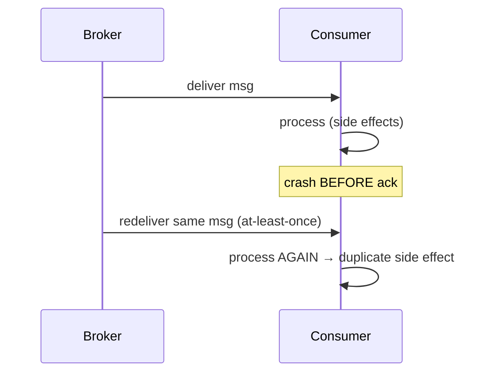
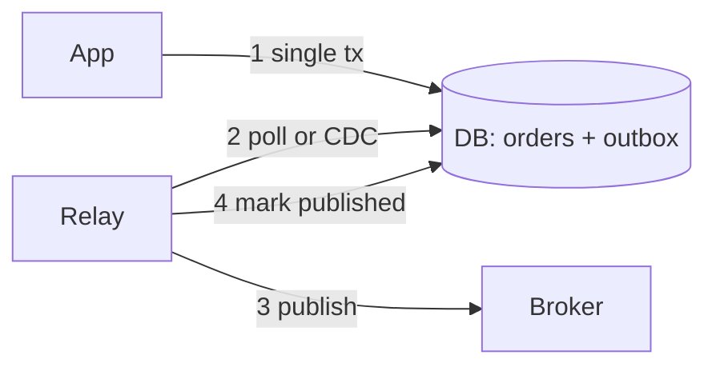
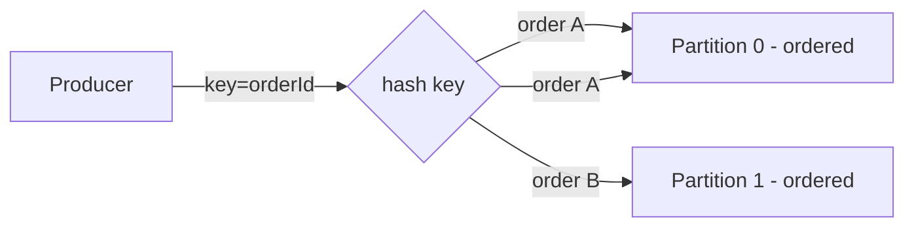
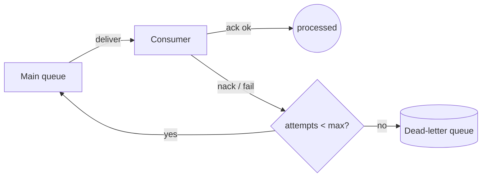
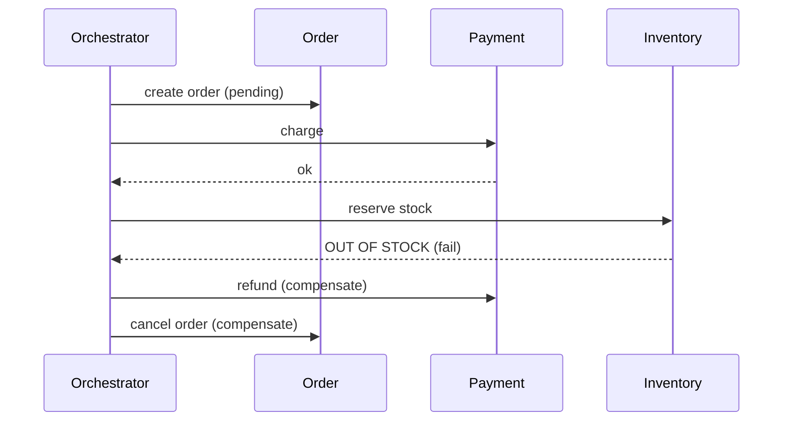

# Messaging Reliability & Distributed Messaging Patterns

Distributed systems talk to each other over networks and brokers that can drop,
duplicate, reorder, and delay messages, and the processes on both ends can crash at any
point. This page teaches the **mechanism-level** patterns a backend engineer uses to make
message-driven systems *correct* despite all of that: delivery semantics and why true
exactly-once is (almost) a myth, idempotent consumers and dedup stores, the dual-write
problem and the transactional outbox/inbox patterns that fix it, message ordering and
partitioning, poison messages and dead-letter queues, retry with backoff and jitter,
sagas and compensating transactions, and consumer lag and backpressure.

It stays out of the whiteboard altitude (where the queue goes in an architecture, how many
brokers to provision) that the system-design pages own. Here we talk acks, offsets,
idempotency keys, outbox rows, DLQs, and failure modes.

> [!KEY-TAKEAWAY]
> The network gives you a hard choice: **at-most-once** (send-and-forget, can lose) or
> **at-least-once** (retry until acked, can duplicate). You cannot have neither loss nor
> duplication at the transport layer. "Exactly-once" in practice is at-least-once delivery
> plus **idempotent processing** — often called *effectively-once*. Design every consumer
> to tolerate duplicates and reordering.

---

## Delivery semantics: at-most-once, at-least-once, exactly-once

The three delivery guarantees describe what happens when messages or acknowledgements are
lost:

| Semantic | Behavior | Mechanism | Risk |
|---|---|---|---|
| **At-most-once** | Each message delivered 0 or 1 times | Fire-and-forget; ack/commit *before* processing | Message loss on crash |
| **At-least-once** | Each message delivered 1 or more times | Retry until acked; ack *after* processing | Duplicates |
| **Exactly-once** | Each message effectively processed once | At-least-once + dedup/idempotency, or transactional | Hard/expensive |

The knob that flips at-most-once vs at-least-once is **when you acknowledge**:

- **Ack before processing** (or auto-commit offsets early) → if the consumer crashes
  mid-processing, the message is already acked and is *never redelivered* → at-most-once,
  possible loss.
- **Ack after processing succeeds** → if the consumer crashes before acking, the broker
  redelivers → at-least-once, possible duplicate (the work may have partially or fully
  completed before the crash).



**Why true exactly-once delivery is impossible over an unreliable network:** the classic
result is that a sender can never *know* whether its message (or the receiver's ack) was
lost, so it must either give up (risk loss) or retry (risk duplicate). This is the same
reasoning as the Two Generals Problem. No amount of acking removes the fundamental
ambiguity; it only shifts *which* failure you get.

> [!INTERVIEW]
> If asked "does Kafka give exactly-once?", the honest answer: Kafka provides
> **exactly-once *semantics* (EOS)** for the specific case of Kafka-to-Kafka stream
> processing via idempotent producers + transactions (atomic produce-and-commit-offset).
> The moment a side effect leaves the Kafka world (a DB write, an email, a payment API),
> you are back to at-least-once and must make the consumer idempotent.

Most real systems standardize on **at-least-once + idempotent consumers**. At-most-once
is acceptable only for lossy-tolerant data (metrics samples, some telemetry).

---

## Effectively-once and why exactly-once is really idempotency

"Exactly-once" that works in production is almost always **effectively-once**:

> at-least-once delivery (broker retries until acked) **plus** processing that is
> idempotent (or transactionally deduplicated), so that duplicate deliveries produce no
> additional observable effect.

Two building blocks make this real:

1. **Idempotent side effects** — the operation can be applied many times with the same
   result (`SET balance = 100` is idempotent; `balance = balance + 10` is not).
2. **A dedup boundary** — a stored record of what has already been processed, so a
   redelivery is recognized and skipped.

Kafka's EOS is a concrete implementation of the idea *within Kafka*: the **idempotent
producer** (a per-partition sequence number the broker uses to reject duplicate appends)
plus **transactions** that atomically write output records and commit the input offsets.
Because the "side effect" and the "offset commit" are the same Kafka transaction, a
consume-transform-produce loop is effectively-once — but only end-to-end inside Kafka.

> [!WARNING]
> Enabling `enable.idempotence=true` on a Kafka producer only dedups *producer retries to a
> partition*; it does **not** make your consumer's database writes idempotent. Consumer-side
> idempotency is a separate, application-level concern.

---

## Idempotent consumers and idempotency keys

An **idempotent consumer** produces the same end state whether it processes a message once
or five times. Two ways to get there:

**1. Naturally idempotent operations.** Design the effect to be a set/upsert rather than a
delta:

```sql
-- idempotent: applying twice = same result
INSERT INTO account_state (account_id, status) VALUES ('a1', 'CLOSED')
ON CONFLICT (account_id) DO UPDATE SET status = 'CLOSED';

-- NOT idempotent: applying twice double-charges
UPDATE accounts SET balance = balance - 50 WHERE id = 'a1';
```

**2. An idempotency key + dedup store.** When the effect is inherently a delta or an
external call, attach a stable unique **idempotency key** to each message (a business id, a
message id, or a client-supplied `Idempotency-Key`), and record processed keys so
duplicates are dropped:

```sql
-- dedup table; PK enforces "process a key at most once"
CREATE TABLE processed_messages (
  message_id   TEXT PRIMARY KEY,
  processed_at TIMESTAMPTZ NOT NULL DEFAULT now()
);
```

The key rule: **the dedup insert and the business side effect must be in the same
transaction** (or the effect must itself be idempotent). Otherwise you can process the
effect, crash before recording the key, and reprocess on redelivery.

```sql
BEGIN;
  INSERT INTO processed_messages (message_id) VALUES ('msg-42');  -- fails if duplicate
  UPDATE accounts SET balance = balance - 50 WHERE id = 'a1';
COMMIT;  -- either both happen or neither
```

If the `INSERT` hits a unique-violation, the message is a duplicate → roll back / skip and
ack. This is the **inbox pattern** applied to dedup (see below).

> [!TIP]
> Choose the idempotency key from the *business* domain when possible (order id, payment
> intent id). A broker-assigned message id changes if the upstream republishes the same
> business event, so it dedups redeliveries but not genuine upstream duplicates.

**Dedup-store gotchas:**

- The dedup table grows forever unless you expire old keys (TTL, partition drop, or a
  time-windowed unique index). Sizing this is a real design point.
- A distributed dedup store (Redis `SET key val NX EX 86400`) is fast but is a *second*
  system that can be inconsistent with your DB — prefer a DB row in the same transaction as
  the effect when correctness matters.

---

## The dual-write problem

The **dual-write problem** is the root cause of most messaging-reliability bugs: a service
must update its **database** *and* publish a **message** describing that update, but these
are two separate systems with no shared transaction. Any crash between them leaves the two
inconsistent.

```java
// BROKEN: two writes, no atomicity
orderRepository.save(order);          // (1) commits to DB
kafkaProducer.send(orderCreatedEvt);  // (2) may fail, or process may crash between (1) and (2)
```

Failure interleavings:

- Crash **after (1), before (2)** → DB has the order, no event ever published →
  downstream never learns. **Silent lost message.**
- (2) sent but the **broker ack lost / DB tx later rolls back** → event published for an
  order that does not exist. **Phantom event.**
- Reverse the order (publish first, then DB) and you get the symmetric problems.

> [!WARNING]
> "Just publish inside the DB transaction" does **not** work — the broker send is not part
> of the DB transaction, and a DB `COMMIT` can still fail *after* the send. There is no
> ordering of two independent commits that is safe. You need a single atomic write.

The only robust fixes make the DB update and the "intent to publish" **atomic**:

1. **Two-phase commit (2PC / XA)** across DB + broker — a distributed transaction.
2. **Transactional outbox** — write the event as a row *in the same DB transaction*, then
   relay it to the broker asynchronously.

---

## Transactional outbox pattern

The **outbox pattern** eliminates the dual write by turning it into a **single local
database transaction**. The service writes both the business row and an *outbox row*
atomically; a separate **relay** (message relay / dispatcher) reads the outbox and
publishes to the broker.

```sql
CREATE TABLE outbox (
  id           BIGSERIAL PRIMARY KEY,
  aggregate_id TEXT NOT NULL,
  event_type   TEXT NOT NULL,
  payload      JSONB NOT NULL,
  created_at   TIMESTAMPTZ NOT NULL DEFAULT now(),
  published_at TIMESTAMPTZ            -- NULL until relayed
);

BEGIN;
  INSERT INTO orders (id, customer_id, total) VALUES ('o1', 'c9', 42.00);
  INSERT INTO outbox (aggregate_id, event_type, payload)
    VALUES ('o1', 'OrderCreated', '{"orderId":"o1","total":42.00}');
COMMIT;   -- order + outbox row commit together, atomically
```



Two ways to relay:

- **Polling publisher:** a background job `SELECT ... WHERE published_at IS NULL ORDER BY id`,
  publishes, then marks/deletes. Simple, but adds query load and latency; use `FOR UPDATE
  SKIP LOCKED` so multiple relay instances don't grab the same rows.
- **Change Data Capture (CDC):** tail the DB's replication log (Postgres WAL / MySQL
  binlog) with a tool like Debezium; every committed outbox insert becomes a broker
  message. Lower latency, no polling load, no application query — but adds CDC
  infrastructure.

**Crucial property:** the relay is **at-least-once**. If it publishes and crashes before
marking the row published, it republishes on restart. Therefore *outbox guarantees no lost
messages, not no duplicates* — consumers must still be idempotent.

> [!KEY-TAKEAWAY]
> Outbox converts an unsafe dual write into one atomic local commit + an asynchronous
> at-least-once relay. It guarantees **the event is published iff the DB change committed**,
> at the cost of possible duplicate publishes and a little latency.

---

## Transactional outbox with CDC vs two-phase commit

Both solve the dual write; they differ sharply in coupling and operational cost.

| Aspect | Transactional outbox (+ CDC/polling) | Two-phase commit (XA) |
|---|---|---|
| Atomic unit | One **local** DB transaction | Distributed tx across DB + broker |
| Delivery | At-least-once (duplicates possible) | Attempts atomic once |
| Coupling | Loose; broker can be down, relay catches up | Tight; both resource managers must be up |
| Availability | High — broker outage just delays relay | Low — a participant/coordinator crash blocks |
| Latency | Extra hop (poll interval or CDC lag) | Synchronous, but slow (2 round trips + fsync) |
| Support | Works with any broker (Kafka has no XA) | Needs XA-capable resources; Kafka is not XA |
| Failure mode | Simple retry | **In-doubt** transactions if coordinator dies mid-commit |

**Why 2PC is usually avoided:** the coordinator can crash *after* participants vote "yes"
but *before* the global commit/abort decision reaches them, leaving participants **blocked
holding locks** (in-doubt) until the coordinator recovers. It also couples availability
(all participants must be up) and is slow. Kafka and most modern brokers don't implement
XA at all. Hence the industry default is the transactional outbox.

> [!INTERVIEW]
> "How do you publish an event and update the DB atomically?" The expected answer names the
> **transactional outbox** and explains *why not 2PC* (blocking coordinator, tight coupling,
> no broker XA) and *why consumers still need idempotency* (relay is at-least-once).

---

## Inbox pattern

The **inbox pattern** is the consumer-side mirror of the outbox: before processing an
incoming message, atomically record its id in an **inbox / processed-messages** table in
the *same transaction* as the side effect. This gives exactly-once *processing* on top of
at-least-once delivery.

```sql
BEGIN;
  -- fails on duplicate: the message was already processed
  INSERT INTO inbox (message_id, received_at) VALUES ('msg-42', now());
  -- the actual business effect, atomic with the dedup marker
  UPDATE inventory SET qty = qty - 1 WHERE sku = 'X';
COMMIT;
```

If the `INSERT` raises a unique-violation, this is a redelivery → abort and ack without
re-applying the effect. Because the dedup marker and the effect commit together, a crash
either commits both or neither — no window where the effect happened but the marker didn't.

**Inbox vs plain dedup table:** they're the same mechanism; "inbox" emphasizes it's the
symmetric partner of outbox in an outbox→broker→inbox pipeline, sometimes also storing the
payload to decouple receipt from processing.

> [!TIP]
> Outbox (don't lose sends) + inbox (don't double-apply receipts) together give a robust
> **effectively-once** pipeline over an at-least-once broker.

---

## Message ordering and partitioning for order

Most brokers guarantee ordering only within a **single partition / queue / shard**, not
globally. Understanding the scope of the guarantee is essential:

- **Kafka:** ordered **per partition**. Records with the same partition key hash to the
  same partition → same-key ordering preserved. No cross-partition order.
- **RabbitMQ:** a single queue with one consumer is FIFO, but multiple consumers (competing
  consumers) or requeues break strict order.
- **SQS standard:** best-effort ordering, no guarantee. **SQS FIFO:** ordered within a
  *message group id* (analogous to a partition key).

**The core trade-off: ordering vs parallelism.** Strict total order forces a single
serial consumer (no parallelism). To scale, you partition by a key so that *related*
messages (same entity) stay ordered while *unrelated* ones process in parallel.



**Gotchas that silently break ordering even within a partition:**

- **Async in-flight requests + retries:** with Kafka's `max.in.flight.requests.per.connection > 1`
  and retries, a retried batch can land *after* a later batch, reordering the partition.
  The idempotent producer (`enable.idempotence=true`) preserves order for up to 5 in-flight
  because the broker uses sequence numbers to reject/reorder correctly.
- **Concurrent consumers of one partition** (e.g. handing records to a thread pool) destroys
  order unless you re-serialize per key.
- **Repartitioning** (adding Kafka partitions) changes key→partition mapping, so a key's
  history can split across partitions.
- **DLQ / retry topics:** moving a failed message aside and continuing means later messages
  for the same key are processed before the retried one.

> [!WARNING]
> "We use Kafka so messages are ordered" is a common wrong assumption. Ordering holds only
> per partition, only if the key routes consistently, and only if in-flight/retry settings
> don't reorder. Choose the partition key = the entity whose events must stay ordered.

---

## Poison messages and dead-letter queues

A **poison message** (poison pill) is a message that a consumer can never successfully
process — malformed payload, a bug, a referenced entity that doesn't exist, a schema it
can't deserialize. With naive at-least-once retry, a poison message is **redelivered
forever**, blocking the queue/partition (head-of-line blocking) and burning resources.

The fix is a **dead-letter queue (DLQ)** (a.k.a. dead-letter exchange/topic): after a
bounded number of failed delivery attempts, the broker or consumer moves the message to a
separate queue for later inspection, and the main flow continues.



Mechanics by broker:

- **RabbitMQ:** configure a **dead-letter exchange (DLX)** on the queue (`x-dead-letter-exchange`).
  A message is dead-lettered when it is rejected/nacked with `requeue=false`, when it
  **expires (TTL)**, or when the queue **length limit** is exceeded. A per-message delivery
  count (`x-delivery-limit` on quorum queues) can dead-letter after N attempts.
- **Kafka:** no built-in DLQ; the *application* (or Kafka Connect / a framework like Spring
  Kafka) publishes the failed record to a **dead-letter topic** after N retries and commits
  the offset to move past it.
- **SQS:** attach a **redrive policy** with `maxReceiveCount`; after that many receives
  without deletion, SQS moves the message to the configured DLQ.

Always store **why** it failed (exception, stack, attempt count) with the dead-lettered
message, and build a **redrive** path to replay from the DLQ after fixing the bug.

> [!WARNING]
> A DLQ with no alarm is a silent data-loss hole. Alert on DLQ depth > 0. Also guard against
> a *poison message that keeps the whole partition stuck* — in Kafka a single un-handleable
> record at the current offset blocks all later records until you route it aside.

---

## Retry with exponential backoff and jitter

When a failure is **transient** (timeout, `503`, deadlock, throttling), retrying helps —
but retrying *immediately and in lockstep* hurts. Two techniques:

**Exponential backoff:** wait longer after each attempt so a struggling dependency gets
room to recover: `delay = base * 2^attempt`, capped at a max.

```
attempt 1: 1s
attempt 2: 2s
attempt 3: 4s
attempt 4: 8s   (cap, e.g. 30s)
```

**Jitter:** add randomness so many clients that failed at the same instant don't retry in a
synchronized wave (the **thundering herd / retry storm** that keeps a recovering service
down). AWS's canonical analysis recommends **full jitter**:

```
# exponential backoff, capped
cap_delay = min(max_delay, base * 2^attempt)
# FULL JITTER: sleep a random amount in [0, cap_delay]
sleep = random_between(0, cap_delay)
```

Compared to fixed backoff, full jitter spreads retries uniformly and minimizes both
collision and total completion time. "Equal jitter" (`cap/2 + random(0, cap/2)`) is a
milder variant.

**Rules that matter as much as the formula:**

- **Cap the number of retries**, then dead-letter. Infinite retry of a permanent failure is
  a poison message.
- **Only retry idempotent operations** (or retries duplicate side effects) — retry and
  idempotency are inseparable.
- **Distinguish retryable vs non-retryable errors:** a `400 Bad Request` / validation error
  / deserialization failure will never succeed on retry → straight to DLQ. Retry `429`,
  `503`, timeouts, deadlocks.
- **Add a circuit breaker** in front of a failing dependency so you stop hammering it at
  all once failures cross a threshold.
- **Retry off the hot path** — in Kafka, retrying in place blocks the partition; use
  tiered **retry topics** (e.g. `orders.retry.5s`, `orders.retry.1m`) so the main consumer
  keeps moving.

> [!TIP]
> "Backoff without jitter" is the classic wrong answer. Exponential backoff alone still
> synchronizes clients into waves; jitter (preferably full jitter) is what actually breaks
> the herd.

---

## Saga pattern and compensating transactions

A **saga** manages a business transaction that spans multiple services/databases where a
single ACID transaction is impossible (no distributed 2PC across microservices). A saga is
a sequence of **local transactions**; if step *k* fails, the saga runs **compensating
transactions** to semantically undo steps *k-1 … 1*.

Because there's no global lock, a saga gives **ACD without I** — no isolation. Intermediate
states are visible to others (a "reservation" exists before "payment"). You design for that
with semantic locks / pending states rather than relying on isolation.

**Compensation is a *semantic* undo, not a rollback.** You can't un-send an email; you send
a cancellation. You can't roll back a captured payment; you issue a refund. Compensations
must themselves be idempotent and should (ideally) be **commutative/retriable**.

Two coordination styles:

| | **Choreography** | **Orchestration** |
|---|---|---|
| Control | Each service reacts to events, emits next event | A central **orchestrator** tells each service what to do |
| Coupling | Decentralized; no central brain | Centralized coordinator holds the workflow |
| Visibility | Hard to see the whole flow (implicit) | Explicit, easy to monitor/debug |
| Risk | Cyclic event dependencies, hard to reason about | Orchestrator is a complexity/coupling hotspot |
| Good for | Few steps, simple flows | Many steps, complex conditional logic |



> [!INTERVIEW]
> Expect: "How do you keep a saga consistent if a compensation itself fails?" Answer:
> compensations must be **idempotent and retried until they succeed** (persist saga state so
> you can resume), and unrecoverable cases escalate to a DLQ / human. Also note sagas provide
> **eventual** consistency and **no isolation**, so guard visible intermediate state (semantic
> locks, `PENDING` statuses).

Sagas are typically implemented *on top of* the outbox pattern (each local step atomically
writes its state change + the next command/event to its outbox).

---

## Consumer lag and backpressure

**Consumer lag** is how far behind a consumer is: in Kafka, `lag = log-end-offset −
committed-offset` per partition — the number of unread records. Growing lag means the
consumer can't keep up with the producer; it's the single most important health metric for
a streaming consumer.

```bash
# Kafka: inspect a group's lag per partition
kafka-consumer-groups.sh --bootstrap-server localhost:9092 \
  --describe --group order-processor
# columns: TOPIC PARTITION CURRENT-OFFSET LOG-END-OFFSET LAG ...
```

Causes and levers: slow processing (optimize/parallelize), too few partitions (partition
count caps consumer parallelism in a group — you can't have more active consumers than
partitions), a downstream bottleneck, or a poison message stalling a partition.

**Backpressure** is the mechanism by which a slow consumer signals "slow down" so it isn't
overwhelmed and its lag/memory doesn't blow up:

- **Pull-based brokers (Kafka)** have *natural* backpressure — the consumer polls at its own
  pace; unread data simply sits durably in the log (bounded by retention, not consumer
  memory). Control intake with `max.poll.records` and `max.partition.fetch.bytes`, and make
  sure you process a poll batch within `max.poll.interval.ms` or the consumer is considered
  dead and the group **rebalances** (worse lag).
- **Push-based brokers (RabbitMQ)** must be throttled with **consumer prefetch**
  (`basic.qos` / `prefetch_count`) — the max unacked messages the broker will push to a
  consumer. Prefetch too high → consumer memory bloat and unfair distribution; too low →
  underutilized consumer. This is the primary RabbitMQ backpressure knob.

> [!KEY-TAKEAWAY]
> Kafka lag is absorbed *durably on the broker* (the log retains data), so a lagging Kafka
> consumer risks *staleness* and eventually *data expiry past retention* — not memory
> exhaustion. A push broker without prefetch limits risks *overwhelming the consumer's
> memory*. Backpressure = matching intake rate to processing rate.

When lag is chronic: scale consumers up to the partition count, add partitions (plan for
the key-remap), batch/parallelize processing, or shed load. Alert on lag trend, not just
absolute value.

---

## Common follow-up questions

- "Can you get exactly-once delivery?" No — the network forces at-most-once or
  at-least-once. You get *effectively-once* via at-least-once + idempotent processing.
  Kafka EOS is exactly-once *semantics* for Kafka-internal stream processing only.
- "Why is publishing an event after a DB commit unsafe?" The dual-write problem — the
  process can crash between the two independent writes, or the second can fail, leaving DB
  and broker inconsistent. Use the transactional outbox.
- "Outbox or 2PC?" Outbox: one local transaction + at-least-once relay, loosely coupled,
  broker outage tolerated. 2PC: distributed, blocking coordinator, tight coupling, and Kafka
  isn't XA-capable. Prefer outbox.
- "Does the outbox give exactly-once?" No — the relay is at-least-once (it can
  republish after a crash). It guarantees *no lost events*; consumers still need idempotency.
- "How do you dedup?" Idempotency key + a unique constraint in a dedup/inbox table,
  inserted in the *same transaction* as the effect (or make the effect naturally
  idempotent).
- "How does Kafka guarantee ordering?" Only per partition, only for same-keyed records,
  and only if in-flight/retry settings (idempotent producer) don't reorder.
- "What breaks ordering that people forget?" DLQ/retry-topic detours, concurrent
  consumers of one partition, adding partitions, and `max.in.flight > 1` without
  idempotence.
- "How do you handle a poison message?" Bounded retries with backoff+jitter, then
  dead-letter it with the failure reason; alert on DLQ depth; provide a redrive path.
- "Backoff formula?" `min(cap, base·2^attempt)` with **full jitter**:
  `sleep = rand(0, that)`. Jitter breaks the retry-storm/thundering-herd.
- "Choreography vs orchestration saga?" Choreography = event-reaction, decentralized,
  good for simple flows; orchestration = central coordinator, visible/testable, good for
  complex flows. Both undo via compensating (semantic) transactions and give eventual
  consistency with no isolation.
- "What is consumer lag and how do you fix it?" Unread offsets between producer and
  consumer; fix by scaling consumers to partition count, adding partitions, speeding
  processing, or shedding load. Backpressure matches intake to processing rate (pull =
  natural; push = prefetch/qos).

## References

- Martin Kleppmann, *Designing Data-Intensive Applications* — Ch. 11 (Stream Processing),
  delivery guarantees, exactly-once, and the dual-write / change-capture discussion.
- Chris Richardson, *Microservices Patterns* — Transactional Outbox, Polling Publisher,
  Transaction Log Tailing, Saga, and API composition patterns (microservices.io).
- Gregor Hohpe & Bobby Woolf, *Enterprise Integration Patterns* — Idempotent Receiver,
  Dead Letter Channel, Guaranteed Delivery, Competing Consumers.
- Apache Kafka documentation — idempotent producer (`enable.idempotence`), transactions /
  exactly-once semantics (KIP-98), `max.in.flight.requests.per.connection`, consumer group
  offsets and rebalancing.
- Confluent — "Exactly-Once Semantics in Apache Kafka" and consumer-lag monitoring guides.
- RabbitMQ documentation — Dead Letter Exchanges, Consumer Prefetch (`basic.qos`), Quorum
  Queues delivery-limit, and Reliability guide.
- AWS Architecture Blog — Marc Brooker, "Exponential Backoff and Jitter" (full jitter
  analysis); Amazon SQS Developer Guide — dead-letter queues and `maxReceiveCount`.
- Pat Helland, "Life Beyond Distributed Transactions" — activities, idempotence, and
  at-least-once messaging without 2PC.
- Debezium documentation — Change Data Capture and the Outbox Event Router (SMT).
