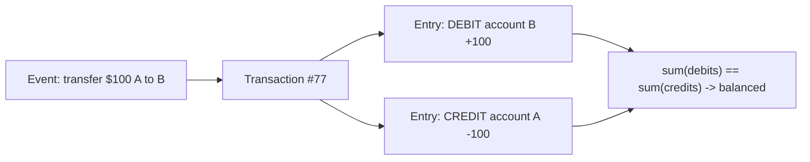
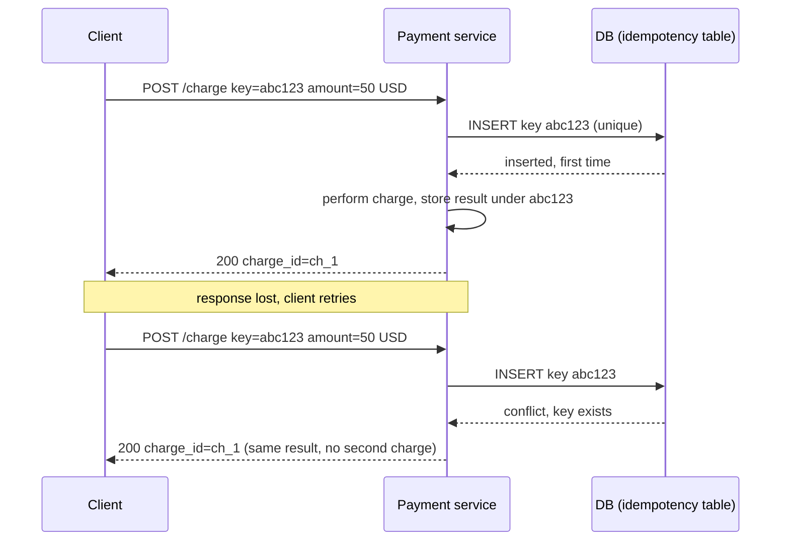

# Money, Currency & Financial Data Handling

Money looks like a number, so beginners store it in a `double` and move on. That is the
single most common — and most expensive — data-modelling mistake in backend systems.
Money is not a real number: it is a **fixed-precision quantity denominated in a
currency**, manipulated under legally- and accounting-defined rounding rules, and it
must round-trip through databases, JSON, and message queues without losing a cent. This
note covers why binary floating point is disqualified, how to store amounts (DECIMAL vs
integer minor units), why an amount is meaningless without its currency, the rounding
modes and when each applies, multi-currency handling and conversion, the **double-entry
ledger** pattern that professional accounting systems use, idempotency to prevent
double-charges, reconciliation, keeping precision in transit, and how to split/allocate
amounts without losing pennies.

The reference points here are Martin Fowler's *Money* pattern (PoEAA ch. 18), IEEE 754,
ISO 4217 (currency codes), the accounting principle of double-entry bookkeeping, and the
`BigDecimal`/`numeric` facilities in mainstream languages and databases.

> [!KEY-TAKEAWAY]
> Three rules survive every interview: (1) **never** use `float`/`double` for money — use
> a fixed-precision decimal or integer minor units; (2) an amount is only half of a money
> value — the **currency travels with it**; (3) money systems favour an **append-only,
> double-entry ledger** over a mutable balance column because the ledger is auditable and
> self-checking.

See also **transactions-acid-isolation-levels** for the atomicity/isolation guarantees a
ledger relies on, and **relational-modeling-normalization** for schema design.

---

## Why never use float or double for money

`float` and `double` are IEEE 754 **binary** floating-point types. They represent numbers
as `mantissa × 2^exponent`. Just as base-10 cannot represent 1/3 exactly (0.333…), base-2
cannot represent most decimal fractions exactly — including the everyday value **0.10**.
`0.1` in a `double` is actually `0.1000000000000000055511151231257827021181583404541015625`.

The classic demonstration, in essentially any language:

```python
>>> 0.1 + 0.2
0.30000000000000004
>>> 0.1 + 0.2 == 0.3
False
```

```java
System.out.println(0.1 + 0.2);            // 0.30000000000000004
System.out.println(1.03 - 0.42);          // 0.6100000000000001
```

The errors are tiny individually but they **accumulate** over millions of transactions,
they make equality comparisons (`amount == 0.30`) unreliable, and they cause reports that
are off by a cent — which in finance is a defect, not a rounding nicety. Worse, the error
is **non-deterministic across the order of operations**: `(a + b) + c` can differ from
`a + (b + c)`, so summing a column in a different order gives a different total.

> [!WARNING]
> "Just round the double at the end" does not save you. The representation error is
> already baked in before you round, and intermediate rounding can push a value across a
> `.5` boundary the wrong way. The fix is to never introduce binary FP error in the first
> place.

Use a **decimal** type (fixed base-10 precision) or **integer minor units** instead. Both
are exact for the decimal fractions money actually uses.

---

## DECIMAL/NUMERIC vs integer minor units

There are two correct representations. Both are exact; they trade off differently.

**1. Fixed-precision decimal.** In SQL this is `DECIMAL(p, s)` / `NUMERIC(p, s)` (the two
are synonyms in the SQL standard); in code it is Java `BigDecimal`, C# `decimal`, Python
`decimal.Decimal`, JS libraries like `big.js`/`decimal.js`. `p` is total significant
digits (precision), `s` is digits after the point (scale).

```sql
-- amount up to 99,999,999.99  (10 total digits, 2 after the point)
CREATE TABLE payment (
  id           bigint PRIMARY KEY,
  amount       NUMERIC(12, 2) NOT NULL,
  currency     char(3)        NOT NULL   -- ISO 4217, see next section
);
```

Choose scale to fit the currency's minor unit (2 for USD/EUR, 0 for JPY, 3 for BHD/KWD).
For intermediate results (per-unit prices, tax, FX), many systems store **4–6 decimal
places** and only round to the currency's scale at the final, presentational step.

**2. Integer minor units.** Store the amount as a whole number of the smallest unit —
cents, pennies, satoshi — in a `bigint`/64-bit integer. `$19.99` is stored as `1999`.
Arithmetic is plain integer arithmetic: exact, fast, and impossible to represent a
fractional cent by accident.

```
$19.99  -> 1999  (minor units, scale 2)
¥500    -> 500   (JPY, scale 0)
0.5 BHD -> 500   (BHD, scale 3)
```

| Dimension | `DECIMAL(p,s)` | Integer minor units |
|---|---|---|
| Exactness | Exact | Exact |
| Fractional units (sub-cent pricing) | Native (raise scale) | Needs a known scale or a separate field |
| Readability in DB | Reads as `19.99` | Reads as `1999` — must know the scale |
| Overflow risk | Bounded by `p` | Bounded by 64-bit range (huge) |
| Mixed-currency safety | Must store currency separately either way | Must store currency AND scale |
| Language support | `BigDecimal`, `Decimal`, `decimal` | Any integer type |

> [!TIP]
> Integer minor units are popular in high-throughput payment systems (Stripe's API
> amounts are integers in the smallest unit) because integer math is unambiguous and
> serializes cleanly. `DECIMAL` is more natural in SQL analytics and when sub-cent scales
> vary. Both are correct — what is *never* correct is `float`/`double`/`real`.

The one thing you must **not** do with integer minor units is assume a global scale of 2.
JPY has 0 minor digits and BHD has 3; a hard-coded "divide by 100" is a bug in any system
that touches more than one currency.

---

## Money is an amount plus a currency

A bare number like `1000` is not money — is it $1000, ¥1000, or 1000 minor units? A money
value is **inseparably a pair: `(amount, currency)`**. This is the heart of Fowler's
*Money* pattern: a `Money` object carries both, and every operation is currency-aware.

```java
final class Money {
    private final long minorUnits;   // e.g. 1999
    private final Currency currency; // ISO 4217, e.g. USD

    Money plus(Money other) {
        if (!currency.equals(other.currency))
            throw new IllegalArgumentException("cannot add " + currency + " to " + other.currency);
        return new Money(minorUnits + other.minorUnits, currency);
    }
}
```

Currencies are identified by **ISO 4217** codes: a three-letter alphabetic code (`USD`,
`EUR`, `JPY`, `INR`) — and ISO 4217 also defines each currency's number of minor-unit
digits, which is exactly the scale you need. Store the code as `char(3)`; do not invent
your own currency enum that will drift from the standard.

> [!WARNING]
> Adding two `Money` values of **different currencies must be a hard error**, not a silent
> coercion. `$10 + €10` has no meaning without an exchange rate and a rate timestamp.
> Systems that model money as a plain number cannot enforce this and inevitably sum mixed
> currencies somewhere.

Schema-wise this means: never a lone `amount` column. Always `amount` **and** `currency`
together (see **relational-modeling-normalization**). A `total` that aggregates rows must
either be constrained to a single currency or be grouped by currency.

---

## Rounding modes: half-even vs half-up (and others)

Once you divide (tax, interest, FX, splitting a bill), you get more decimal places than the
currency allows and must **round**. The mode matters and is often legally specified.

- **Round half up** (a.k.a. "arithmetic rounding," `ROUND_HALF_UP`): ties go away from
  zero. `2.5 -> 3`, `2.4 -> 2`. Intuitive; what most people mean by "round." Common in
  retail pricing and many tax jurisdictions.
- **Round half to even** (a.k.a. **banker's rounding**, `HALF_EVEN`): ties go to the
  nearest **even** last digit. `2.5 -> 2`, `3.5 -> 4`, `2.45 -> 2.4`. This removes the
  upward **bias** that half-up introduces when you round and sum many numbers — half-up
  nudges every tie in the same direction, so a large sum drifts high; half-even splits ties
  roughly evenly so errors cancel. It is the **IEEE 754 default** and the default for
  `BigDecimal` in some APIs, and is widely used in accounting and statistics precisely
  because *sums* stay unbiased.
- **Round half down**, **floor/ceiling**, **round toward zero (truncate)**: used in
  specific contexts — e.g. some interest calculations truncate, some fees always round in
  the house's favour by regulation.

```java
new BigDecimal("2.5").setScale(0, RoundingMode.HALF_UP);   // 3
new BigDecimal("2.5").setScale(0, RoundingMode.HALF_EVEN); // 2
new BigDecimal("3.5").setScale(0, RoundingMode.HALF_EVEN); // 4
```

> [!INTERVIEW]
> "Why banker's rounding?" Because rounding-half-up is biased: over many rounded values the
> total creeps upward (error grows ~linearly). Half-even has no directional bias, so the
> error of a large sum grows ~with the square root of the count and tends to cancel — which
> matters when you round thousands of line items and reconcile totals. But the **correct**
> answer for a real system is: *use whatever the jurisdiction/contract mandates*, make it
> configurable, and apply it consistently. Never rely on a language's default silently.

Two rules that catch people out: (1) **round once, at the boundary you present/settle** —
not on every intermediate multiply; carry extra precision internally. (2) The rounding
mode is a **business decision**, so put it in code you can point to, not buried in a
`double` cast.

---

## Multi-currency, exchange rates, and conversion

The moment a system handles more than one currency, three rules apply:

1. **Store amount + currency on every row** (never a bare number).
2. **Never sum or compare across currencies** without converting first. A "total revenue"
   across USD, EUR, JPY is a category error unless you convert to one reporting currency.
3. **Conversion needs a rate and a time.** An exchange rate is only valid at an instant.
   Persist the **rate, the rate's source, and the timestamp** used for any conversion, so
   the result is reproducible and auditable.

```sql
CREATE TABLE fx_conversion (
  id             bigint PRIMARY KEY,
  from_amount    NUMERIC(18,4) NOT NULL,
  from_currency  char(3)       NOT NULL,
  to_amount      NUMERIC(18,4) NOT NULL,
  to_currency    char(3)       NOT NULL,
  rate           NUMERIC(18,8) NOT NULL,   -- units of to per 1 from
  rate_source    text          NOT NULL,   -- e.g. 'ECB 2026-07-18'
  converted_at   timestamptz   NOT NULL
);
```

Because conversion introduces division, it introduces rounding — so `convert(A→B)` then
`convert(B→A)` will **not** generally return the original amount. Model FX as its own
recorded event, not a lossless transformation you can redo on the fly. For pricing, keep a
higher scale (4–8 dp) on the stored rate, and round the converted amount to the target
currency's minor unit at the end.

> [!WARNING]
> A subtle bug: reporting dashboards that `SUM(amount)` across a table containing multiple
> currencies. The number is meaningless and usually wrong. Guard it with a `GROUP BY
> currency`, a single-currency constraint, or a conversion step that records the rate.

---

## Double-entry ledger vs a mutable balance column

The naive design stores each account's money as a single mutable column and updates it:

```sql
UPDATE account SET balance = balance - 100 WHERE id = :from;
UPDATE account SET balance = balance + 100 WHERE id = :to;
```

This works numerically (inside one transaction) but is **not accounting-grade**: it keeps
only the *current* balance, so you cannot answer "why is the balance this number?", you
have no audit trail, a bug can silently create or destroy money, and there is no built-in
check that money was conserved.

The professional model is **double-entry bookkeeping**: money is never created or
destroyed, only moved between accounts. Every business event is a **transaction** made of
two or more **entries (postings)** — some **debits**, some **credits** — and *the debits
must equal the credits*. The table is **append-only** (immutable); you never `UPDATE` or
`DELETE` a posting. A balance is **derived** by summing an account's entries.



```sql
CREATE TABLE ledger_entry (
  id             bigint PRIMARY KEY,
  transaction_id bigint      NOT NULL,     -- groups a balanced set of entries
  account_id     bigint      NOT NULL,
  direction      char(2)     NOT NULL,     -- 'DR' or 'CR'
  amount_minor   bigint      NOT NULL CHECK (amount_minor > 0),
  currency       char(3)     NOT NULL,
  created_at     timestamptz NOT NULL DEFAULT now()
);
-- Invariant enforced per transaction_id: SUM(signed amount) = 0 (and per currency).
-- Balance of an account = SUM over its entries.
```

Benefits: a complete **audit trail** (every change is a row), **self-checking** (each
transaction must balance, so bugs surface immediately), trivial **historical balances**
(sum entries up to any timestamp), and correct **corrections** — you never edit history,
you post a **reversing entry**. The cost is that reading a balance means an aggregation,
so high-read systems keep a **cached/materialized balance** (a running total or periodic
snapshot) that is *derived from and reconcilable against* the immutable ledger — the ledger
remains the source of truth.

> [!KEY-TAKEAWAY]
> Mutable balance = fast but forgetful and unauditable. Double-entry ledger = append-only,
> balanced, auditable, and correctable by reversal. Real money systems use the ledger and
> treat any cached balance as a derived optimization, not the truth.

This is where **transactions-acid-isolation-levels** matters: the set of postings for one
event must be written **atomically** (all or nothing) and at an isolation level that
prevents lost updates on any cached balance.

---

## Idempotent financial operations (no double-charge)

Networks retry. A client that doesn't get a response to "charge $50" may resend it, and a
naive server will charge twice. The standard defence is an **idempotency key**: the client
generates a unique key per logical operation and sends it (e.g. an `Idempotency-Key`
header). The server records it; a repeat with the same key **returns the original result
instead of performing the action again**.



Key points: the idempotency key must be stored with a **unique constraint** so concurrent
duplicates collide at the database, not just in application logic; the stored record should
capture the **result** (and ideally a hash of the request) so a retry returns the same
outcome and a *different* request reusing a key can be rejected; keys have a retention
window. This is the request-level complement to the ledger's correctness: the ledger keeps
money conserved, idempotency keeps a single intent from being applied twice.

> [!TIP]
> Idempotency and the ledger reinforce each other: make the idempotency-key insert and the
> ledger postings part of the **same database transaction**. Then "recorded the key" and
> "posted the entries" succeed or fail together — no key without a charge, no charge
> without a key.

---

## Reconciliation

**Reconciliation** is the process of verifying that two independent records of the same
money agree — e.g. your ledger vs the bank/processor statement, or a derived cached balance
vs the sum of ledger entries. It is how financial systems *detect* the discrepancies that
floating point, missed events, duplicate processing, or bugs introduce.

Typical checks:

- **Internal:** `cached_balance == SUM(ledger_entries)` for every account; every
  `transaction_id`'s debits equal its credits; totals per currency net to zero across
  internal accounts.
- **External:** match each processor/bank line to a ledger transaction by amount, currency,
  date, and reference id; flag unmatched items on either side (a payment we recorded but the
  bank didn't settle, or a bank line we have no record of).

Reconciliation is a strong argument for the **append-only ledger** and for recording FX
rates and idempotency keys: you can only reconcile what you have durably and immutably
recorded. Discrepancies are investigated and resolved by posting **adjusting/reversing
entries**, never by editing history.

---

## Precision in transit: JSON and message payloads

Storing money correctly is wasted if it loses precision crossing the wire. The trap is
**JSON numbers**: the JSON spec doesn't bound numeric precision, but most parsers decode a
JSON number into an IEEE 754 `double`. JavaScript has a single number type (`double`), so
`JSON.parse` turns `10.10` and any large integer beyond `2^53` into a lossy double —
reintroducing exactly the error you avoided in the database.

The fixes, in order of preference:

1. **Serialize money as a string:** `{"amount": "10.10", "currency": "USD"}`. A string
   preserves the exact decimal text; the receiver parses it into a decimal type. This is
   the safest, most language-neutral choice and is what many payment APIs do.
2. **Integer minor units:** `{"amount_minor": 1010, "currency": "USD"}`. Safe as long as it
   stays within `2^53` (JS `Number.MAX_SAFE_INTEGER`) or is itself sent as a string; the
   receiver must know the scale.
3. Binary/exact formats (Protobuf `string`/`decimal`, Avro `decimal` logical type backed by
   bytes) when not using JSON.

```json
{ "amount": "10.10", "currency": "USD" }        // preferred: string amount
{ "amount": 10.10, "currency": "USD" }           // BUG: parsed as double, lossy
{ "amount_minor": 1010, "scale": 2, "currency": "USD" }  // integer minor units
```

> [!WARNING]
> Even if *your* service uses `BigDecimal` end to end, a JSON `number` in the contract
> means every consumer that uses a double-based parser (JavaScript especially) can corrupt
> the value. Put money in a **string** in the API schema and validate it on both sides.

---

## Allocation and splitting without losing pennies

Divide $10.00 three ways and each share is $3.333…, which rounds to $3.33 — but
`3.33 × 3 = 9.99`. A penny vanished. **Allocation** is the algorithm that splits an amount
into parts that (a) each respect the currency's minor unit and (b) **sum back exactly to the
original**. This is Fowler's `Money.allocate` and it is a favourite interview question.

The standard approach: compute each share by integer division of the **minor units**, then
distribute the remainder one minor unit at a time (the "largest remainder" method). For
$10.00 = 1000 cents split 3 ways: `1000 / 3 = 333` each, remainder `1`; give the extra cent
to the first party.

```python
def allocate(total_minor: int, n: int) -> list[int]:
    base, remainder = divmod(total_minor, n)      # 333, 1  for 1000, 3
    shares = [base] * n
    for i in range(remainder):                    # hand out the leftover cents
        shares[i] += 1
    return shares                                 # [334, 333, 333] -> sums to 1000

# Weighted split (e.g. by ratio 3:1) uses the same "largest remainder" idea:
# floor each weighted share, then distribute leftover minor units to the
# entries with the largest fractional parts until the sum matches the total.
```

`allocate([334, 333, 333])` sums to `1000` — no penny lost, no penny invented. The general
rule: **work in integer minor units, floor each share, then deterministically distribute the
remainder**, so the parts always re-sum to the whole. Doing this with `double` division and
independent rounding is exactly how systems leak or duplicate money.

> [!INTERVIEW]
> If asked "split $100 across 3 accounts," the wrong answer is `100/3` rounded. The right
> answer is: convert to minor units (10000), `divmod(10000, 3)` = 3333 each + remainder 1,
> distribute the leftover cent → `[3334, 3333, 3333]`, verify the sum equals 10000. State
> that the distribution rule (who gets the extra cent) should be deterministic and, if it
> matters, defined by business rules.

---

## Common follow-up questions

- "Why is `0.1 + 0.2 != 0.3`?" Binary floating point can't represent 0.1/0.2/0.3
  exactly; the stored values are the nearest `double`s and their sum isn't the nearest
  `double` to 0.3. Use decimal or integer minor units.
- "DECIMAL or integer cents — which do you pick?" Either is exact. Integer minor units
  for high-throughput payments and clean serialization; `DECIMAL(p,s)` for SQL analytics and
  variable sub-cent scales. Never `float`/`double`.
- "What scale should the DECIMAL column have?" Match the currency's minor unit (2 for
  USD, 0 for JPY, 3 for KWD), plus extra places (4–6) for intermediate values you round only
  at the end.
- "Half-up or half-even?" Half-even (banker's) removes summation bias and is the IEEE
  default; but use whatever the jurisdiction/contract mandates, made explicit and consistent.
- "How do you total revenue across currencies?" You don't sum them directly — convert to
  one reporting currency at a recorded rate/time, or `GROUP BY currency`.
- "Mutable balance or ledger?" Append-only double-entry ledger as source of truth
  (auditable, self-balancing, corrected by reversal); a cached balance is a derived
  optimization reconciled against the ledger.
- "How do you prevent a double-charge on retry?" Idempotency key with a unique
  constraint; a repeat returns the original result. Ideally in the same transaction as the
  ledger postings.
- "How do you split $10 three ways without losing a cent?" Integer minor units +
  divmod + distribute the remainder so shares re-sum to the total.
- "Why send money as a string in JSON?" JSON numbers decode to `double` in most parsers
  (all of JS); a string preserves the exact decimal.

## References

- Martin Fowler, *Patterns of Enterprise Application Architecture*, ch. 18 — the **Money**
  pattern (amount + currency, arithmetic, `allocate`).
- IEEE 754 — binary floating-point representation and the round-half-to-even default.
- ISO 4217 — currency codes and per-currency minor-unit digits.
- PostgreSQL documentation — "Numeric Types" (`numeric`/`decimal`; note the `money` type's
  limitations) and MySQL Reference Manual — fixed-point `DECIMAL`.
- Java `java.math.BigDecimal` and `java.math.RoundingMode`; Python `decimal` module; C#
  `System.Decimal`.
- Double-entry bookkeeping (accounting principle) — debits equal credits, immutable journal.
- Stripe API reference — integer amounts in the smallest currency unit; `Idempotency-Key`.
- Kleppmann, *Designing Data-Intensive Applications* — idempotency, exactly-once effects.
- JSON (RFC 8259) — numbers have no mandated precision; interoperability guidance to treat
  them as IEEE 754 doubles.
