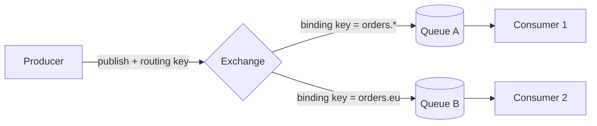
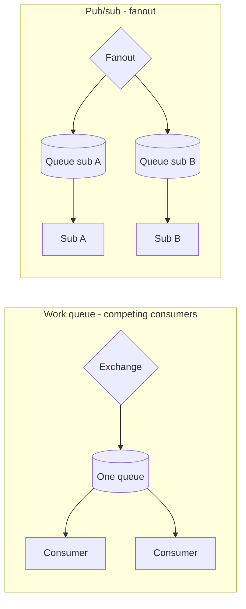
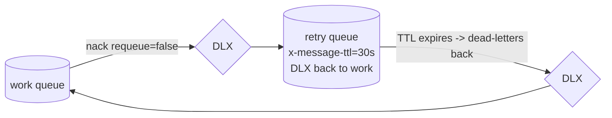

# RabbitMQ & Message Queue Patterns

RabbitMQ is a **message broker** that speaks AMQP 0-9-1 (Advanced Message Queuing
Protocol). This page teaches the **mechanism** level: how a message travels from a
producer through an exchange and binding into a queue and out to a consumer, what the
different exchange types actually do to routing keys, how acknowledgements and prefetch
control delivery, what it takes to survive a broker restart, and how dead-lettering,
TTL, and quorum queues work. It stays out of the whiteboard/architecture altitude that
the system-design pages own — here we deal in the protocol, the config, and the failure
modes.

> [!KEY-TAKEAWAY]
> RabbitMQ is a **smart broker / dumb consumer** with **push** delivery: producers never
> publish to a queue directly — they publish to an **exchange**, which uses **bindings**
> and a **routing key** to decide which queue(s) get a copy. Kafka is the opposite — a
> **dumb broker / smart consumer** with a **replayable pull log**. Knowing which model a
> problem needs is the single most-probed idea in this space.

---

## AMQP 0-9-1 model: producer, exchange, binding, queue, consumer

The core insight of AMQP 0-9-1 is that **a producer never sends a message straight to a
queue.** It publishes to an **exchange** together with a **routing key**. The exchange
looks at its **bindings** (rules that link the exchange to queues) and routes the message
to zero, one, or many queues. Consumers then read from queues.



Key entities and terms:

- **Producer / publisher** — the app that emits a message. It sets a routing key and
  message properties (delivery mode, headers, priority, expiration, correlation-id).
- **Exchange** — the routing switch. Has a *type* (direct/topic/fanout/headers) that
  decides the matching algorithm. Producers publish here, not to queues.
- **Binding** — a link from an exchange to a queue (or to another exchange), optionally
  with a *binding key* or header-match arguments. This is where routing rules live.
- **Queue** — an ordered buffer that stores messages until a consumer acks them. This is
  the only place messages actually live.
- **Consumer** — the app that subscribes to a queue and processes messages.
- **Connection / Channel** — a connection is one TCP connection to the broker. A
  **channel** is a lightweight virtual connection multiplexed over it; almost all AMQP
  operations happen on a channel, and apps open many channels over one connection instead
  of many TCP connections.
- **Virtual host (vhost)** — a logical namespace of exchanges/queues/bindings for
  multi-tenancy and permission isolation. Default vhost is `/`.

The **default exchange** is a pre-declared direct exchange with no name (`""`). Every
queue is automatically bound to it with a binding key equal to the queue's name. That is
why "publish to a queue by name" appears to work in tutorials — you are really publishing
to the default exchange with the routing key set to the queue name.

> [!TIP]
> If a message is routed to *no* queue (no binding matches), the broker **silently drops
> it** by default. To detect this, publish with the `mandatory` flag so the broker returns
> an unroutable message to the producer (a `basic.return`), or bind an **alternate
> exchange** to catch unroutable messages.

---

## Exchange types: direct, topic, fanout, headers

The exchange *type* determines how a routing key (or headers) is matched against bindings.

| Type | Matching rule | Typical use |
|---|---|---|
| **direct** | routing key **equals** binding key exactly | route by a single category / severity (e.g. `error`, `info`) |
| **topic** | routing key matched against a **pattern** with wildcards `*` and `#` | route by multi-part topic (`orders.eu.created`) |
| **fanout** | ignores routing key — copies to **every** bound queue | pub/sub broadcast (cache invalidation, notifications) |
| **headers** | matches on message **header attributes**, not the routing key | route on multiple structured attributes |

**Direct** — a message with routing key `error` goes to every queue bound with binding
key `error`. Multiple queues can share a binding key (all get a copy); one queue can bind
with several keys.

**Topic** — routing keys are dot-delimited words (`stock.usd.nyse`). Binding keys use two
wildcards:

- `*` (star) matches **exactly one** word.
- `#` (hash) matches **zero or more** words.

Examples against routing key `orders.eu.created`:

| Binding key | Matches `orders.eu.created`? |
|---|---|
| `orders.eu.created` | yes (exact) |
| `orders.*.created` | yes (`*` = `eu`) |
| `orders.#` | yes (`#` = `eu.created`) |
| `orders.*` | **no** — `*` is exactly one word, but two follow |
| `#` | yes (matches everything — behaves like fanout) |
| `*.eu.*` | yes |

**Fanout** ignores the routing key entirely and delivers a copy to *all* bound queues —
the classic broadcast/pub-sub primitive.

**Headers** ignores the routing key and matches on header key/value pairs. The binding's
special `x-match` argument is either `all` (every listed header must match — logical AND)
or `any` (at least one — logical OR).

> [!INTERVIEW]
> A common trick question: "direct vs topic when the routing key is a single word." A
> topic exchange with a binding key containing no wildcards behaves exactly like a direct
> exchange. Topic is a strict superset; direct is chosen for clarity/performance when you
> only need exact-match.

---

## Queue vs pub-sub semantics: work queue vs broadcast

Two fundamentally different delivery shapes, and the exchange/binding topology is how you
pick between them:

- **Work queue (competing consumers)** — *one* queue, *many* consumers. Each message is
  delivered to **exactly one** of the consumers (round-robin / by prefetch). Used to
  distribute work and scale throughput horizontally. Adding consumers processes more
  messages in parallel; a message is *not* duplicated.
- **Pub/sub (broadcast)** — a **fanout** (or topic) exchange bound to *multiple* queues,
  one per subscriber. Each subscriber has its **own** queue, so **every** subscriber gets
  its **own copy** of the message. Used for events that many independent services react to.



The critical rule: **fan-out happens at the exchange (one queue per subscriber);
load-balancing happens at the queue (many consumers on one queue).** If two services
share a single queue, they *compete* and each message is processed once total — usually a
bug when you actually wanted both to react.

> [!WARNING]
> Ordering is only guaranteed **within a single queue to a single consumer**, and even
> then requeues and redeliveries can reorder. With multiple competing consumers or after a
> `nack`-requeue, do not assume messages arrive in publish order. If you need strict
> ordering, use a single consumer, or a partition key model (Kafka) instead.

---

## Acknowledgements: ack, nack, reject, requeue

By default RabbitMQ uses **manual acknowledgement** in most clients for reliability. When
a consumer receives a message the broker marks it *unacknowledged* and keeps it; the
consumer must send:

- **`basic.ack`** — success; the broker deletes the message.
- **`basic.nack`** (multi-message capable) or **`basic.reject`** (single) — failure.
  The `requeue` flag decides the fate: `requeue=true` puts it back on the queue for
  redelivery; `requeue=false` **discards or dead-letters** it (if a DLX is configured).

If a consumer's channel/connection drops **before** it acks, the broker **redelivers** the
message to another consumer (with the `redelivered` flag set). This gives **at-least-once**
delivery — a crash after processing but before ack means the message is processed twice, so
**consumers must be idempotent.**

**Auto-ack (`no-ack=true`)** acknowledges on delivery, before processing. It is faster but
gives **at-most-once** delivery — a crash loses the in-flight message. Only use it when
loss is acceptable (e.g. live metrics).

> [!WARNING]
> A message `nack`'d with `requeue=true` that keeps failing creates a **poison-message
> loop**: it is redelivered, fails, requeued, forever, burning CPU. The fix is to
> dead-letter it after N attempts (nack with `requeue=false` into a DLX, or track a retry
> count) — never blindly requeue.

The **`redelivered` flag** is a *hint*, not a guarantee — it can be true even if the
message was never actually processed (e.g. broker restart). Use it as a signal to be
careful, not as a reliable dedup mechanism.

---

## Prefetch and QoS: fair dispatch and flow control

By default a broker will push as many messages as it can to a consumer, filling that
consumer's unacked buffer. With round-robin dispatch, a slow consumer that received a
burst of heavy messages sits idle-blocked while a fast consumer starves — unfair.

**`basic.qos` with `prefetch_count`** caps how many *unacknowledged* messages a consumer
may hold at once. With `prefetch=1`, the broker won't dispatch a new message to a consumer
until it acks the previous one — so a fast consumer naturally pulls more work. This is
**fair dispatch**.

```text
channel.basicQos(1)      # at most 1 unacked message per consumer
# broker only sends the next message after this consumer acks
```

Tuning:

- **`prefetch=1`** — maximally fair; best when tasks vary wildly in cost. But it adds a
  round-trip per message, so throughput drops for small/fast tasks.
- **Higher prefetch (e.g. 20–100)** — better throughput (pipelining) at the cost of some
  fairness and larger in-flight memory. Tune to `≈ round-trip-time / processing-time`.
- Prefetch also bounds memory: too high and one consumer hoards the whole queue.

Prefetch can be set **per-consumer** or **per-channel** (`global` flag). It only has an
effect with **manual ack** — with auto-ack there is no unacked state to limit.

> [!INTERVIEW]
> "One consumer is overloaded while others idle" → the answer is almost always *set a low
> prefetch for fair dispatch* (default with unbounded prefetch pins bursts to whichever
> consumer round-robin happened to hit).

---

## Durability and persistence: surviving a broker restart

Message survival across a **broker restart** requires **three independent** things — miss
any one and messages are lost:

1. **Durable queue** — declared with `durable=true`. A non-durable (transient) queue and
   all its messages vanish on restart regardless of message settings.
2. **Persistent messages** — published with `delivery_mode=2` (persistent). A transient
   message (`delivery_mode=1`) in a durable queue is still lost on restart.
3. **Publisher confirms** — so the producer *knows* the broker durably accepted the
   message before considering it sent (see below).

Even with all three, there is a small window: a persistent message is written to disk
**asynchronously** and may sit in an OS/broker buffer briefly. Publisher confirms close
that gap by only confirming *after* the message is safely persisted (or, for a mirrored/
quorum queue, replicated).

**Publisher confirms** (`confirm.select`) are RabbitMQ's lightweight alternative to slow
AMQP transactions. After enabling confirm mode, the broker sends an async `basic.ack` back
to the *publisher* once the message is safely handled (routed + persisted if persistent +
replicated for quorum). A `basic.nack` to the publisher means the broker failed to take
responsibility — the producer should resend. Confirms can be batched or awaited async, so
they are far faster than transactions.

> [!WARNING]
> **Persistence ≠ delivery guarantee, and durable ≠ persistent.** Interviewers love this:
> a durable queue with transient messages loses data on restart; a persistent message on a
> transient queue also loses data. And even fully durable+persistent+confirmed messages can
> be lost if `fsync` hasn't flushed and the *machine* (not just the process) dies — which is
> why quorum queues (replication) matter for real durability.

> [!TIP]
> Persistence costs throughput (disk writes). For maximum durability use **durable queue +
> persistent messages + publisher confirms + quorum queue**; for maximum speed use transient
> everything and accept loss. Most production systems pick durable+persistent+confirms.

---

## Dead-letter exchanges (DLX), TTL, and retry/backoff

A **dead-letter exchange (DLX)** is a normal exchange that a queue republishes messages to
when they are "dead-lettered." A message is dead-lettered when:

1. It is **rejected/nacked with `requeue=false`**, or
2. Its **TTL expires** (message-level or queue-level), or
3. The queue **overflows** its max-length (`x-max-length`) and the message is dropped from
   the head.

You attach a DLX to a queue with the `x-dead-letter-exchange` argument (and optionally
`x-dead-letter-routing-key` to override the routing key on dead-letter).

**TTL (time-to-live)** can be set two ways:

- **Per-queue** via `x-message-ttl` (all messages expire after N ms in that queue).
- **Per-message** via the `expiration` property.

**The delayed-retry / backoff pattern** combines TTL + DLX to build retry with delay
*without* busy-looping:



The failed message goes to a **retry/wait queue** whose own DLX points *back* at the work
queue and whose `x-message-ttl` is the backoff delay. After the TTL elapses the message is
dead-lettered back to the work queue for another attempt. Increasing TTLs per level give
**exponential backoff**; a retry-count header (incremented each pass) lets you route to a
final **parked/dead queue** after N attempts for manual inspection.

> [!WARNING]
> **Per-queue TTL only expires messages at the head of the queue** (RabbitMQ checks
> expiry from the front). A message behind an un-expired one won't be removed until it
> reaches the head — so per-queue TTL does not guarantee prompt expiry of every message.
> For precise per-message delays, prefer the **delayed-message plugin** (`x-delayed-message`
> exchange) over TTL hacks when delays vary widely.

---

## Work queues, competing consumers, RPC, and priority queues

**Work queue / competing consumers** — the canonical pattern: publish tasks to one durable
queue; run N worker consumers with manual ack + low prefetch. Work is distributed, survives
worker crashes (redelivery), and scales by adding workers. This is the go-to for background
jobs.

**Request/reply (RPC)** — RabbitMQ supports synchronous-style RPC over async messaging:

- The client declares an exclusive **reply queue** (often the pseudo-queue
  `amq.rabbitmq.reply-to` for a cheap "direct reply-to" with no queue churn).
- It publishes the request with two properties: **`reply_to`** (the reply queue name) and
  **`correlation_id`** (a unique token).
- The server processes and publishes the response to the `reply_to` queue, echoing the
  same `correlation_id`.
- The client matches responses to requests by `correlation_id` (needed because one client
  may have many outstanding requests on one reply queue).

**Priority queues** — declare a queue with `x-max-priority` (e.g. 10). Messages published
with a higher `priority` property are delivered before lower-priority ones. Caveats:
priority only reorders messages **already in the queue** — a high-priority message can't
jump ahead of one already delivered/prefetched to a consumer, so keep prefetch low for
priorities to matter. Higher max-priority values cost more memory/CPU; keep the range small
(1–10 is plenty).

> [!TIP]
> For RPC, always set a **timeout** on the client and handle the case where the reply never
> arrives (server crashed). And use **direct reply-to** (`amq.rabbitmq.reply-to`) instead of
> declaring a fresh reply queue per request — otherwise you churn queues and hurt performance.

---

## RabbitMQ vs Kafka: smart broker vs replayable log

This contrast is the most common design question in this area. They solve overlapping but
different problems.

| Dimension | **RabbitMQ** | **Kafka** |
|---|---|---|
| Model | Smart broker, dumb consumer | Dumb broker, smart consumer |
| Delivery | **Push** to consumers | Consumers **pull** (poll) |
| Storage | Queue = transient buffer; **message deleted after ack** | **Append-only log**, retained by time/size; not deleted on read |
| Replay | No — once acked, it's gone | **Yes** — consumers seek to any offset and re-read |
| Routing | Rich: exchanges, bindings, topics, headers | Minimal: topic + partition (key hash) |
| Ordering | Per queue (best-effort with requeues) | **Strong per partition** |
| Consumer scaling | Competing consumers on a queue | Consumer group; **≤ 1 consumer per partition** |
| Throughput | High, but lower than Kafka for huge streams | Very high sequential-I/O throughput |
| Offset/position | Broker tracks acks | **Consumer tracks its own offset** |
| Best for | Task queues, RPC, complex routing, per-message workflows | Event streaming, log aggregation, replay, high-volume analytics |

**Choose RabbitMQ** when you need complex routing, per-message acknowledgement/retry
semantics, request/reply, priority, or a classic task queue where messages are consumed
once and discarded.

**Choose Kafka** when you need a durable, replayable event log, very high throughput,
strict per-partition ordering, multiple independent consumer groups reading the same
stream at their own pace, or event sourcing / stream processing.

> [!INTERVIEW]
> The crispest one-liner: **RabbitMQ moves messages and forgets them; Kafka stores a log
> and lets consumers remember where they are.** "Multiple teams need to re-process the same
> events independently, possibly from the past" → Kafka. "Distribute background jobs with
> rich routing and per-message retry" → RabbitMQ.

---

## Quorum queues and high availability

For HA, a queue's contents must survive a **node** failure, not just a process restart.
RabbitMQ's modern answer is the **quorum queue** (introduced in 3.8 and now the
recommended queue type for replicated, highly-available queues — though the declaration
default queue type remains `classic`).

- A **quorum queue** replicates its state across an odd number of cluster nodes using the
  **Raft** consensus algorithm. Writes are confirmed once a **majority (quorum)** of
  replicas have persisted them, so it tolerates the loss of a minority of nodes (e.g. 1 of
  3, 2 of 5) without data loss. Publisher confirms on a quorum queue mean the message is
  **replicated to a majority**, giving real durability.
- **Classic mirrored queues** (the old `ha-mode` policy / classic HA) were the legacy
  approach. They had well-known problems — split-brain edge cases, unsafe failover, "loss
  of a mirror re-syncs the whole queue" — and are **deprecated and removed in RabbitMQ
  4.0**. New designs should use quorum queues.
- Quorum queues are optimized for **durability and data safety over raw latency**; they
  always persist to disk and are heavier per-message than a transient classic queue. They
  don't support some classic features (e.g. per-message priority, non-durable mode).
- **Streams** are a separate, newer RabbitMQ construct: an append-only, replayable log
  (Kafka-like) for high-throughput fan-out and replay — distinct from quorum queues, which
  keep AMQP queue semantics (delete-on-ack).

> [!KEY-TAKEAWAY]
> For durable, highly-available AMQP queues in modern RabbitMQ, the answer is **quorum
> queues** (Raft, majority-ack). Mirrored/classic HA queues are legacy and gone in 4.0. If
> you need a replayable log rather than a queue, use **Streams** (or Kafka).

---

## Common follow-up questions

- **Why publish to an exchange instead of directly to a queue?** Decoupling: producers
  don't need to know which queues exist. Routing rules (bindings) live in the broker and
  can change without touching producers.
- **What's the difference between a connection and a channel?** A connection is one TCP
  socket; channels are lightweight multiplexed sessions over it. Open one connection per
  process and many channels (ideally one channel per thread) — don't open a TCP connection
  per operation.
- **How do you guarantee a message is never lost end-to-end?** Durable queue + persistent
  message + publisher confirms on the producer, manual ack on the consumer, and quorum
  queues for node-failure survival. Even then it's at-least-once, so make consumers
  idempotent.
- **At-least-once vs exactly-once?** RabbitMQ gives at-least-once with manual ack.
  "Exactly-once" is achieved at the application layer via idempotency keys / dedup, not by
  the broker.
- **What happens to an unroutable message?** Dropped silently unless you set `mandatory`
  (returned to publisher) or configure an alternate exchange.
- **How do you implement delayed/retry-with-backoff?** TTL on a wait queue + DLX pointing
  back to the work queue, or the delayed-message exchange plugin. Track a retry count and
  park to a dead queue after N attempts.
- **Why is my one consumer overloaded while others idle?** Prefetch is too high (or
  unbounded); set a low `basic.qos` prefetch for fair dispatch.
- **RabbitMQ or Kafka for this?** Replay/high-volume streaming/multiple independent
  readers → Kafka. Complex routing/task queue/RPC/per-message retry → RabbitMQ.

## References

- AMQP 0-9-1 Model Explained — RabbitMQ docs: <https://www.rabbitmq.com/tutorials/amqp-concepts>
- RabbitMQ Tutorials (Work Queues, Pub/Sub, Routing, Topics, RPC): <https://www.rabbitmq.com/tutorials>
- Consumer Acknowledgements and Publisher Confirms: <https://www.rabbitmq.com/docs/confirms>
- Consumer Prefetch (QoS): <https://www.rabbitmq.com/docs/consumer-prefetch>
- Dead Letter Exchanges: <https://www.rabbitmq.com/docs/dlx>
- Time-To-Live and Expiration: <https://www.rabbitmq.com/docs/ttl>
- Priority Queues: <https://www.rabbitmq.com/docs/priority>
- Quorum Queues: <https://www.rabbitmq.com/docs/quorum-queues>
- Streams: <https://www.rabbitmq.com/docs/streams>
- Classic Queue Mirroring (deprecated/removed in 4.0): <https://www.rabbitmq.com/docs/ha>
- Apache Kafka documentation (design, log, consumer groups): <https://kafka.apache.org/documentation/>
- Martin Kleppmann, *Designing Data-Intensive Applications*, Ch. 11 (Stream Processing) — messaging vs log-based brokers.
