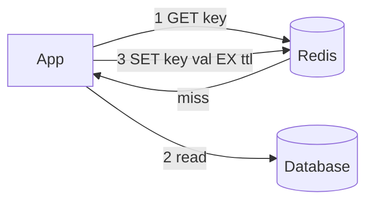
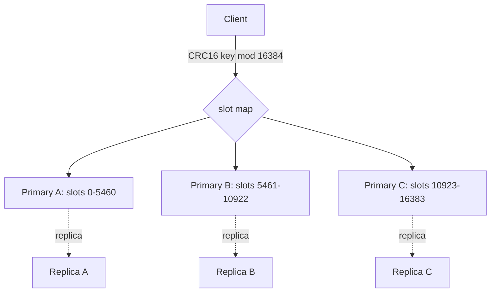

# Redis & Caching Strategies

Redis (REmote DIctionary Server) is an in-memory data-structure store used as a cache,
database, and message broker. This page teaches the **mechanism** level: how the event
loop, data structures, expiry, persistence, replication, and locking actually work, and
how you use them correctly to build caches that don't fall over under load. It is
deliberately hands-on (real `redis-cli` commands, config directives, failure modes) and
stays out of the whiteboard/architecture altitude that the system-design pages own.

> [!KEY-TAKEAWAY]
> Redis is fast because everything is in RAM and command execution is single-threaded
> (no locks, no context switches per op). That same single thread is also its main
> gotcha: one `O(N)` command (`KEYS *`, big `SMEMBERS`) blocks *every* other client.

---

## Single-threaded event loop and why Redis is fast

Redis executes commands on **one thread**, driven by an event loop (`ae`, built on
`epoll`/`kqueue`). Each client command is processed to completion before the next one
starts, so there are no data races and no per-operation locking. Commands are therefore
effectively **atomic** — `INCR`, `LPUSH`, `SET ... NX` cannot interleave with another
client's command.

Why it's fast despite one thread:

- **Everything is in memory.** No disk seek on the hot path; a `GET` is a hash-table
  lookup. Typical latency is tens of microseconds; a single instance can do 100k+
  ops/sec.
- **Efficient data structures** with tuned encodings (see below).
- **Multiplexed non-blocking I/O** — the event loop handles thousands of connections
  without a thread per connection.
- **No lock contention / no context-switch storms** that plague multi-threaded stores.

What is *not* single-threaded:

- Since **Redis 6.0**, optional **I/O threads** (`io-threads`) can parallelize the
  reading of requests and writing of replies off the socket. **Command execution itself
  stays single-threaded.**
- Background tasks run in separate threads/processes: `BGSAVE` (a `fork`ed child),
  AOF rewrite, and lazy freeing of large keys (`UNLINK`, `lazyfree-lazy-*`).

> [!WARNING]
> A single slow `O(N)` command blocks the whole server. Never run `KEYS *` in
> production — use `SCAN` (cursor-based, incremental). Watch out for `SMEMBERS`/`HGETALL`
> on huge collections, `ZRANGE 0 -1`, and `DEL` of a multi-GB key (use `UNLINK` for
> async free). Use the `SLOWLOG` to find offenders.

---

## Core data structures and their use-cases

Redis keys map to typed values. Knowing which structure fits a problem is the most
common practical interview probe.

| Type | Key commands | Typical use |
|---|---|---|
| **String** (binary-safe, ≤512 MB) | `SET`/`GET`, `INCR`, `APPEND`, `SETEX` | cache blobs, counters, sessions, feature flags |
| **Hash** (field→value map) | `HSET`, `HGET`, `HGETALL`, `HINCRBY` | store an object's fields without JSON-encoding the whole thing |
| **List** (linked list / quicklist) | `LPUSH`/`RPUSH`, `LPOP`/`RPOP`, `LRANGE`, `BLPOP` | queues, stacks, recent-activity feeds |
| **Set** (unordered, unique) | `SADD`, `SISMEMBER`, `SINTER`, `SUNION` | tags, unique visitors, relationship sets |
| **Sorted set / ZSET** (unique members + score) | `ZADD`, `ZRANGE`, `ZRANK`, `ZINCRBY` | leaderboards, priority queues, rate limiting, time-series index |
| **Stream** (append-only log) | `XADD`, `XREAD`, `XREADGROUP`, `XACK` | durable event log with consumer groups |
| **HyperLogLog** | `PFADD`, `PFCOUNT`, `PFMERGE` | approximate cardinality (unique counts) in ~12 KB |
| **Bitmap** (bits on a string) | `SETBIT`, `GETBIT`, `BITCOUNT`, `BITOP` | daily active users, per-user boolean flags |
| **Geospatial** | `GEOADD`, `GEOSEARCH`, `GEODIST` | radius queries (stored as a ZSET of geohashes) |

```bash
# Hash: store a user object compactly
HSET user:1001 name "Ada" plan "pro" logins 42
HINCRBY user:1001 logins 1        # atomic field increment
HGETALL user:1001
```

**Encodings matter for memory.** Small collections use compact encodings and only
"upgrade" to the general structure past a threshold:

- Small hashes/ZSETs → `listpack` (was `ziplist`) until `hash-max-listpack-entries` /
  `-value` is exceeded, then a real hashtable/skiplist.
- Integer-only small sets → `intset`.
- Lists are `quicklist` (a linked list of listpacks).

> [!TIP]
> Prefer a Hash over many top-level `String` keys for an object's fields — small hashes
> in listpack encoding are far more memory-efficient than N separate keys (each key has
> per-key overhead).

---

## Sorted sets for leaderboards and rate limiting

A **sorted set (ZSET)** stores unique members each with a floating-point **score**, kept
in score order. Internally it is a **skip list** (ordered traversal, `O(log N)`
insert/rank) plus a **hash table** (member→score, `O(1)` lookup). This dual structure is
why it can do both "rank of member X" and "top N by score" cheaply.

**Leaderboard:**

```bash
ZADD leaderboard 1500 "player:7"
ZINCRBY leaderboard 50 "player:7"        # add 50 points atomically
ZREVRANGE leaderboard 0 9 WITHSCORES     # top 10 (highest first)
ZREVRANK leaderboard "player:7"          # this player's 0-based rank
```

**Sliding-window rate limiting** — use a ZSET per client, score = timestamp, member =
unique request id; trim the window and count:

```bash
# limit = 100 requests / 60s for key rl:user:42, now = current epoch ms
ZREMRANGEBYSCORE rl:user:42 0 (now-60000)   # drop entries older than the window
ZADD           rl:user:42 now  <request-id> # record this request
ZCARD          rl:user:42                    # if > 100 -> reject
EXPIRE         rl:user:42 60                  # let the key self-clean
```

A simpler **fixed-window** limiter uses a counter: `INCR rl:user:42:<minute>` then
`EXPIRE ... 60`; reject when the value exceeds the limit. Fixed windows are cheaper but
allow up to 2× burst at the boundary; the ZSET sliding window is smoother but heavier.

> [!TIP]
> Wrap multi-step limiters in a **Lua script** (`EVAL`) so the check-and-increment is
> atomic and survives concurrent requests without a round-trip race. Redis runs the whole
> script on its single thread with no interleaving.

---

## Streams, HyperLogLog, bitmaps, and geo

**Streams** (`XADD`) are an append-only log of entries, each with an auto-generated
`<ms>-<seq>` ID. Unlike Pub/Sub, entries are **persisted** and can be re-read.
**Consumer groups** (`XREADGROUP`, `XACK`) let multiple consumers split a stream with
per-consumer delivery tracking and a **Pending Entries List (PEL)** for un-acked
messages — this is Redis's Kafka-like primitive. Use `XCLAIM`/`XAUTOCLAIM` to reassign
messages from a dead consumer.

**HyperLogLog** estimates the number of **distinct** elements using ~12 KB regardless of
cardinality, with a standard error of ~**0.81%**. It cannot list members — only count.

```bash
PFADD visitors:2026-07-19 user1 user2 user3
PFCOUNT visitors:2026-07-19          # approximate unique count
PFMERGE visitors:week visitors:2026-07-18 visitors:2026-07-19
```

**Bitmaps** are operations on a String treated as a bit array — 1 bit per user id is
extremely compact for daily-active-user style flags:

```bash
SETBIT dau:2026-07-19 1001 1         # user 1001 was active today
BITCOUNT dau:2026-07-19              # how many active users
BITOP AND dau:both dau:2026-07-18 dau:2026-07-19   # retention: active both days
```

**Geo** commands store lon/lat as geohash scores inside a ZSET and let you do radius
queries: `GEOADD`, then `GEOSEARCH ... BYRADIUS 5 km ASC`.

---

## TTL, expiry, and eviction policies

**TTL / expiry** attaches a lifetime to a key: `SET k v EX 60`, `EXPIRE k 60`,
`PEXPIRE` (ms). `TTL k` returns remaining seconds (`-1` = no expiry, `-2` = key gone).
Redis removes expired keys two ways:

1. **Passive (lazy):** on access, if a key is expired it's deleted and treated as absent.
2. **Active:** a background cycle ~10×/sec samples keys with TTLs from the expires dict
   and deletes the expired ones (probabilistic — keeps expired fraction low, not zero).

So an expired key can linger in memory until sampled or touched. On a replica, keys are
**not** expired independently — the primary sends explicit `DEL`/`UNLINK` so all replicas
agree (reads of a logically-expired key on a replica return nil in modern versions).

**Eviction** is different from expiry: it kicks in when `maxmemory` is reached, to make
room. Set the policy with `maxmemory-policy`:

| Policy | Evicts from | Strategy |
|---|---|---|
| `noeviction` (**default**) | — | reject writes with OOM error |
| `allkeys-lru` | all keys | approximate least-recently-used |
| `allkeys-lfu` | all keys | approximate least-frequently-used (Redis 4.0+) |
| `volatile-lru` | keys with a TTL | approximate LRU |
| `volatile-lfu` | keys with a TTL | approximate LFU |
| `allkeys-random` / `volatile-random` | all / TTL keys | random victim |
| `volatile-ttl` | keys with a TTL | shortest remaining TTL first |

> [!WARNING]
> The default `maxmemory-policy` is **`noeviction`** — once memory is full, writes fail
> with `OOM command not allowed`. If you use Redis as a pure cache, set an explicit
> `maxmemory` and an eviction policy like `allkeys-lru`. `volatile-*` policies evict
> **only keys that have a TTL** and can OOM if too few keys have one.

LRU/LFU are **approximate**: Redis samples `maxmemory-samples` keys (default 5) and evicts
the best candidate, trading precision for speed. Higher samples = closer to true LRU/LFU,
more CPU. LFU counters use a probabilistic logarithmic increment and decay over time, so
a key that was once hot but is now cold gets evicted.

---

## Persistence: RDB vs AOF

Redis is in-memory but can persist to disk so it survives a restart.

**RDB (Redis Database) — point-in-time snapshot.** `SAVE` (blocking, rarely used) or
`BGSAVE` writes a compact binary dump. `BGSAVE` **`fork()`s** a child that uses
**copy-on-write**: the child sees a frozen memory image while the parent keeps serving;
only pages modified during the dump are copied. Triggered by `save <sec> <changes>`
rules (e.g. `save 900 1`).

- **Pros:** compact single file, fast restart/load, cheap for backups and replication
  bootstrap.
- **Cons:** you lose everything written since the last snapshot (minutes of data) if the
  process dies. `fork()` on a huge dataset can cause a latency spike and needs headroom
  (COW can transiently ~2× memory under heavy writes).

**AOF (Append Only File) — log every write command.** Redis appends each mutating command
to the AOF; on restart it replays them. The durability knob is `appendfsync`:

| `appendfsync` | Meaning | Data loss on crash |
|---|---|---|
| `always` | fsync after every write | ~none, but slowest |
| `everysec` (**default**) | fsync once per second | up to ~1 second |
| `no` | let the OS flush | up to OS buffer window (seconds) |

The AOF grows unbounded, so Redis periodically does an **AOF rewrite** (`BGREWRITEAOF`) —
a compacted rewrite representing current state in fewer commands. Redis 7 uses a
**multi-part AOF** (a base RDB/AOF + incremental files in an `appenddirs` folder).

**Trade-offs & combined mode:**

- RDB alone → smaller footprint, faster restarts, but a wider data-loss window.
- AOF alone → better durability (down to ~1s with `everysec`), larger files, slower
  restart replay.
- **Both enabled** (recommended for durability): on restart Redis loads the **AOF** first
  because it's the more complete/recent record.

> [!TIP]
> Defaults: RDB snapshotting is on out of the box; **AOF is off by default**
> (`appendonly no`). For a cache you may disable both. For a datastore, enable AOF
> `everysec` (often with RDB too). Neither gives cross-node durability — for that you need
> replication and/or `WAIT`.

---

## Cache-aside, read-through, write-through, and write-behind

These are the canonical patterns for wiring a cache in front of a database.

**Cache-aside (lazy loading)** — the application manages the cache; the cache doesn't know
about the DB. This is the most common Redis pattern.



- **Read:** check cache → on miss, read DB, then populate cache with a TTL.
- **Write:** write DB, then **invalidate** (delete) the cached key.
- **Pros:** only requested data is cached; cache failure ≠ outage. **Cons:** first request
  is a miss (cold); stale reads possible in the gap between DB write and invalidation.

**Read-through** — the app talks only to the cache; the **cache library/layer** loads from
the DB on a miss. Same laziness as cache-aside but the load logic lives in the caching
layer, not scattered in app code.

**Write-through** — writes go **through the cache**, which synchronously writes to the DB
before acking. Cache and DB stay consistent; write latency = cache + DB. Often paired with
read-through.

**Write-behind (write-back)** — writes hit the cache and are ack'd immediately; the cache
**asynchronously** flushes to the DB (batched). Lowest write latency and can coalesce
writes, but you can **lose acknowledged writes** if the cache dies before flush, and the
DB is temporarily stale.

| Pattern | Who loads/writes DB | Consistency | Risk |
|---|---|---|---|
| Cache-aside | app | eventual (invalidate on write) | stale window, cold miss |
| Read-through | cache layer | eventual | cold miss |
| Write-through | cache layer (sync) | strong-ish | higher write latency |
| Write-behind | cache layer (async) | weak (lag) | data loss on crash |

> [!INTERVIEW]
> A frequent trap: "on a write, should you *update* or *delete* the cache?" Prefer
> **delete/invalidate**. Updating the cache in place invites lost-update races between
> concurrent writers and readers; deleting forces the next read to repopulate from the
> source of truth.

---

## Cache invalidation and the thundering-herd / stampede problem

**Cache stampede (thundering herd / dogpile):** a hot key expires (or is missing) and
thousands of concurrent requests all miss simultaneously, all hit the database at once,
and can overwhelm it — often re-computing the *same* value redundantly.

Mitigations:

- **Request coalescing / lock (mutex):** on a miss, the first caller acquires a short lock
  (`SET lock:key uuid NX PX 5000`); others briefly wait and re-read the cache instead of
  hitting the DB. Only one recompute happens.
- **TTL jitter:** add randomness to TTLs (`ttl = base + rand(0, spread)`) so keys don't all
  expire at the same instant.
- **Early / probabilistic recomputation:** refresh a key *before* it expires (e.g.
  XFetch: recompute early with probability rising as expiry nears), so it's never cold.
- **Stale-while-revalidate:** serve the old value while one worker refreshes in the
  background.
- **Background refresh:** a scheduled job repopulates hot keys, decoupling refresh from
  user requests.

```bash
# Mutex pattern on miss
SET lock:report:42 <uuid> NX PX 3000   # only one worker wins
# winner recomputes and repopulates; losers sleep briefly and re-GET the key
```

**Invalidation** is famously hard ("there are only two hard things..."). Options: TTL-based
expiry (simple, allows staleness), explicit delete on write (cache-aside), versioned keys
(`user:42:v7` — bump the version instead of deleting), or key-space notifications /
change-data-capture to push invalidations.

---

## Cache penetration, avalanche, and breakdown

Three related-but-distinct failure modes the interviewer likes to separate:

- **Cache penetration:** requests for keys that **don't exist anywhere** (not in cache,
  not in DB) — e.g. malicious lookups of random/invalid IDs. Every request misses the
  cache and pounds the DB. **Fixes:** cache the **negative result** (store a short-TTL
  sentinel/null for the missing key) and/or put a **Bloom filter** in front to reject IDs
  that provably don't exist. Also validate/whitelist inputs.

- **Cache avalanche:** a **large number of keys expire at the same time** (or the whole
  Redis node goes down), so a flood of misses hits the DB simultaneously. **Fixes:**
  **TTL jitter** so expiries spread out, high availability (replica/Sentinel/Cluster) so a
  single node failure doesn't nuke the whole cache, and request rate-limiting/circuit
  breakers protecting the DB.

- **Cache breakdown (hot-key stampede):** a **single very hot key** expires and all its
  traffic stampedes the DB at once. **Fixes:** mutex/coalescing recompute, "logical
  expiry" (store value + expiry timestamp, never let it hard-expire; refresh async), or
  keep hot keys warm via background refresh.

| Problem | Trigger | Primary fix |
|---|---|---|
| Penetration | key exists nowhere | negative caching + Bloom filter |
| Avalanche | many keys expire / node down | TTL jitter + HA |
| Breakdown | one hot key expires | mutex / logical expiry / never expire hot key |

---

## Replication, Sentinel, and Cluster

**Replication** is asynchronous by default. A **replica** (`REPLICAOF <host> <port>`)
gets an initial full sync (the primary `BGSAVE`s an RDB and streams it, then forwards the
replication backlog) and thereafter receives a continuous command stream. Because it's
async, a primary can ack a write to the client and then crash **before** the replica
receives it → that write is lost on failover.

- `WAIT <numreplicas> <ms>` blocks a write until N replicas have acknowledged it — a
  synchronous-ish durability boost, but **not** true consensus (it doesn't roll back on
  timeout).
- `min-replicas-to-write` / `min-replicas-max-lag` can make the primary **refuse writes**
  if too few replicas are caught up, trading availability for safety.

**Redis Sentinel** provides HA for a single-primary setup: a set of Sentinel processes
**monitor** the primary and replicas, agree (via a **quorum**) that the primary is down
(`SDOWN`→`ODOWN`), **elect** a leader Sentinel, **promote** a replica, and reconfigure the
others + notify clients. Sentinel gives automatic failover but does **not** shard data.

**Redis Cluster** shards data across nodes using **16384 hash slots**. The slot for a key
is `CRC16(key) mod 16384`; each primary owns a range of slots. Clients are redirected with
`MOVED` (permanent) / `ASK` (during migration) responses and cache the slot map.

- **Multi-key operations** must involve keys in the **same slot**, or Redis returns a
  `CROSSSLOT` error. Force co-location with a **hash tag**: only the substring inside
  `{...}` is hashed, so `{user42}:profile` and `{user42}:cart` land in the same slot.
- Each shard is itself primary + replica(s); the cluster does its own failover
  (no separate Sentinel needed). A cluster needs a **majority of primaries** reachable to
  keep serving; `cluster-require-full-coverage yes` (default) stops serving if any slot is
  uncovered.



---

## Distributed locks and the Redlock debate

The simple, widely-used single-instance lock:

```bash
SET lock:resource <random-token> NX PX 30000   # acquire: only if not set, 30s TTL
# ... do work ...
# release ONLY if we still own it (compare token) — must be atomic, use Lua:
#   if redis.call('GET', KEYS[1]) == ARGV[1] then return redis.call('DEL', KEYS[1]) else return 0 end
```

- `NX` = set only if absent (mutual exclusion); `PX` = auto-expiring TTL so a crashed
  holder doesn't deadlock the resource forever.
- The **random token** identifies the owner. Release must **check the token then delete
  atomically** (via `EVAL`), or you might delete a lock a *different* client acquired after
  yours expired.

**Redlock** is an algorithm to acquire a lock across **N independent** Redis primaries
(no replication between them): the client tries to `SET NX PX` on a majority (N/2+1) within
a time budget and considers the lock held only if it got the majority quickly enough.

> [!WARNING]
> The **Redlock debate**: Martin Kleppmann argued Redlock is unsafe for correctness
> because it relies on bounded clocks and GC pauses — a process can pause after acquiring
> the lock, its TTL expires, another client acquires it, and now **two** clients believe
> they hold it. His remedy is a **fencing token** (a monotonically increasing number the
> protected resource checks and rejects stale writers). Salvatore Sanfilippo (antirez)
> defended Redlock's assumptions. **Interview-safe stance:** for *efficiency* (avoid
> duplicate work) a single-instance Redis lock is fine; for *correctness* (never two
> holders) you need fencing tokens or a real consensus system (ZooKeeper/etcd), because a
> TTL lock alone cannot guarantee mutual exclusion under pauses.

---

## Pub/Sub vs Streams

Both move messages between producers and consumers, but with very different guarantees.

**Pub/Sub** (`SUBSCRIBE`, `PUBLISH`) is **fire-and-forget, at-most-once**: a message is
delivered only to clients **connected at that instant**; there is **no persistence, no
history, no acknowledgment, no replay**. A subscriber that disconnects for a second misses
everything sent meanwhile. Great for live notifications, cache-invalidation fan-out, and
ephemeral signals — bad when you can't afford to lose a message.

**Streams** (`XADD`/`XREAD`/`XREADGROUP`) are a **persistent append-only log**. Messages
are stored (bounded via `MAXLEN`/`MINID`), can be **re-read from any ID**, and consumer
groups give **at-least-once** delivery with explicit `XACK` and a Pending Entries List for
in-flight/un-acked messages. This is the right choice for durable work queues and
event-sourcing-style consumption.

| | Pub/Sub | Streams |
|---|---|---|
| Persistence | none | yes (append-only log) |
| Replay / history | no | yes (read from any ID) |
| Delivery | at-most-once | at-least-once (with groups + `XACK`) |
| Offline consumer | misses messages | catches up on reconnect |
| Consumer groups | no (each sub gets all) | yes (`XREADGROUP`, load-balanced) |
| Backpressure/tracking | none | PEL tracks un-acked |

> [!TIP]
> There's also **sharded Pub/Sub** (`SPUBLISH`/`SSUBSCRIBE`, Redis 7) for Cluster, where a
> message stays within its shard's slot instead of being broadcast cluster-wide — better
> scaling but the same at-most-once semantics.

---

## Common follow-up questions

- **"Redis is single-threaded — how does it use multiple cores?"** Command execution is
  one thread; run multiple Redis instances/shards (Cluster) per host to use more cores, and
  optionally enable `io-threads` for network I/O. CPU-bound Lua/`O(N)` commands still
  serialize on the one thread.
- **"Difference between expiry and eviction?"** Expiry removes keys whose TTL elapsed
  (lazy + active sampling); eviction removes keys when `maxmemory` is hit, per
  `maxmemory-policy`. Default policy is `noeviction` (writes fail when full).
- **"RDB or AOF for a database?"** Enable AOF (`everysec`) for a ≤1s loss window, often
  alongside RDB for fast restarts/backups; on restart AOF wins as the more complete record.
- **"Can Redis lose acknowledged writes?"** Yes — async replication means a primary can ack
  then crash before a replica receives the write; failover loses it. Use `WAIT` /
  `min-replicas-*` to reduce the window (not eliminate it).
- **"How do you cache and keep it consistent on writes?"** Cache-aside with delete (not
  update) on write, TTLs as a safety net, and versioned keys or CDC-driven invalidation for
  tighter freshness.
- **"Update or delete the cache on write?"** Delete/invalidate — updating in place races
  with concurrent readers/writers and can persist a stale value.
- **"How to prevent hammering the DB when a hot key expires?"** Mutex/request coalescing,
  logical (never-hard) expiry with async refresh, TTL jitter, and stale-while-revalidate.
- **"Is a Redis lock safe for correctness?"** Only with fencing tokens; a bare TTL lock can
  admit two holders under GC/network pauses — that's the Redlock critique.
- **"Why 16384 slots in Cluster?"** A fixed, small slot count keeps the per-node slot
  bitmap tiny to gossip and makes resharding a matter of moving slot ownership.

## References

- Redis documentation — Data types, Persistence (RDB/AOF), Eviction, Replication,
  Sentinel, Cluster spec, Keyspace, `SCAN`, Streams intro: <https://redis.io/docs/latest/>
- Redis command reference (`SET`, `EXPIRE`, `ZADD`, `XADD`, `PFADD`, `SETBIT`, `GEOADD`,
  `WAIT`, `EVAL`): <https://redis.io/docs/latest/commands/>
- Redis Cluster specification (hash slots, `MOVED`/`ASK`, failover):
  <https://redis.io/docs/latest/operate/oss_and_stack/reference/cluster-spec/>
- Redis distributed locks / Redlock: <https://redis.io/docs/latest/develop/use/patterns/distributed-locks/>
- Martin Kleppmann, "How to do distributed locking" (Redlock critique):
  <https://martin.kleppmann.com/2016/02/08/how-to-do-distributed-locking.html>
- Salvatore Sanfilippo (antirez), "Is Redlock safe?": <http://antirez.com/news/101>
- Redis LRU/LFU eviction internals: <https://redis.io/docs/latest/develop/reference/eviction/>
- Martin Kleppmann, *Designing Data-Intensive Applications* — caching, replication, logs.
