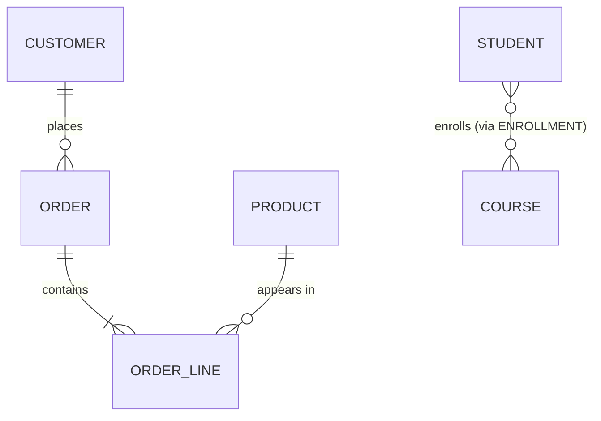
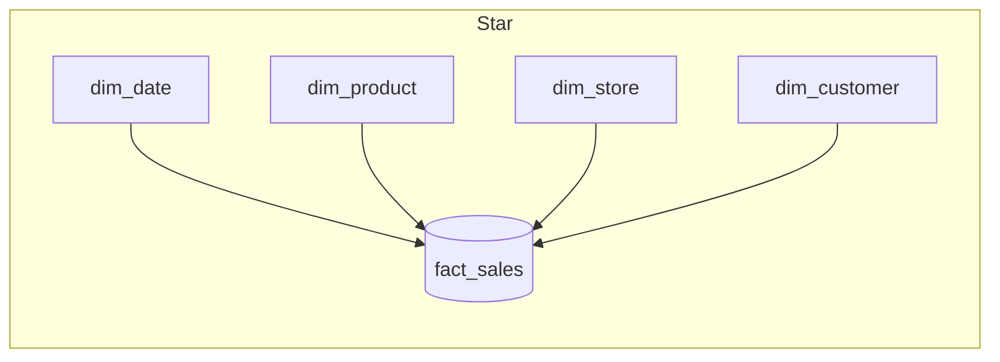

# Relational Modeling & Normalization

Relational modeling is the discipline of turning a messy real-world domain into a set
of well-structured tables whose correctness the database engine can *enforce* for you.
Get the model right and a whole class of bugs — duplicated facts, contradictory rows,
data that silently disappears when you delete something unrelated — simply cannot
happen. Get it wrong and no amount of application code fully rescues you.

This note works from the ground up: the relational model itself (Codd's algebra of
relations), the keys that give rows identity, ER modeling and cardinality, the theory
that tells you *when* a schema is well-formed (functional dependencies and normal
forms), the update/insert/delete anomalies normalization prevents, and finally the two
places practitioners deliberately break the rules — **denormalization** for read-heavy
OLTP and **star/snowflake schemas** for analytics.

Everything here is vendor-neutral ANSI SQL; where PostgreSQL and MySQL/InnoDB differ,
that is called out explicitly.

---

## The relational model

The relational model was defined by **E. F. Codd (1970, "A Relational Model of Data for
Large Shared Data Banks")**. Its core idea: represent all data as **relations** — sets
of tuples — and manipulate them with a closed algebra so that queries return relations
too. The vocabulary maps onto SQL as follows:

| Relational theory | SQL term | Meaning |
|---|---|---|
| Relation | Table | A set of tuples over a fixed set of attributes |
| Tuple | Row | One fact/record |
| Attribute | Column | A named, typed component of every tuple |
| Domain | Data type (+ constraints) | The set of legal values for an attribute |
| Degree / arity | Number of columns | — |
| Cardinality | Number of rows | — |

Key properties that follow from "a relation is a **set**":

- **No duplicate tuples** in the mathematical model — every relation has a key. (SQL
  tables are technically *bags*/multisets and permit duplicate rows unless a key or
  `UNIQUE` constraint forbids them — a deliberate deviation from pure theory.)
- **No inherent row order** — you must `ORDER BY` to get a defined order; the physical
  storage order is an implementation detail and can change.
- **No inherent column order** in theory (attributes are named). SQL does give columns a
  positional order, which is why `SELECT *` column order is stable and `INSERT` without a
  column list is positional — but relying on it is fragile.
- **Attribute values are atomic** with respect to the schema (this is 1NF, below).

> [!KEY-TAKEAWAY]
> A table is a *set of rows identified by a key*, not an ordered list. "Give me the
> first row" is meaningless without an `ORDER BY`. Everything about keys and normal
> forms flows from treating rows as set members that must be uniquely identifiable.

**NULL** is the model's most argued-over feature: it represents *unknown or
inapplicable*, not zero or empty string. It uses **three-valued logic** — a comparison
with NULL yields `UNKNOWN`, not true/false. This is why `WHERE x = NULL` never matches
(use `IS NULL`), why `NOT IN (subquery-with-nulls)` can return no rows unexpectedly, and
why `UNIQUE` constraints treat NULLs specially (most engines allow multiple NULLs in a
unique column because two unknowns are not "equal").

---

## Keys: primary, candidate, foreign, composite, surrogate vs natural

A **key** is a set of attributes that uniquely identifies a tuple. Terminology:

- **Superkey** — any attribute set that uniquely identifies a row (may have extra,
  redundant columns).
- **Candidate key** — a *minimal* superkey: no attribute can be removed without losing
  uniqueness. A relation can have several candidate keys.
- **Primary key (PK)** — the candidate key you *choose* as the row's official identity.
  Implies `NOT NULL` + `UNIQUE`. A table has at most one primary key.
- **Alternate key** — any candidate key not chosen as the primary key (enforce with a
  `UNIQUE` constraint).
- **Composite (compound) key** — a key made of two or more columns, e.g. the pair
  `(order_id, line_no)` on an order-lines table.
- **Foreign key (FK)** — a column set in one table that references the PK/candidate key
  of another (or the same) table, enforcing **referential integrity**.

**Natural key vs surrogate key** — the classic interview trade-off:

| | Natural key | Surrogate key |
|---|---|---|
| Source | Real-world attribute (email, ISBN, SSN, country code) | System-generated, no business meaning (auto-increment, UUID, sequence) |
| Stability | Can change (people change email/name); risky | Never changes |
| Width | Often wide/multi-column → fat FKs and indexes | Narrow (int/bigint) → compact indexes and joins |
| Uniqueness guarantee | Depends on external world (SSNs get reused/reissued) | Guaranteed by the DB |
| Meaning in FK | FK carries readable info, sometimes avoids a join | FK is opaque |

Most practitioners use a **surrogate PK** (auto-increment/sequence/UUID) *and* a
`UNIQUE` constraint on the natural key, getting stable identity plus a uniqueness
guarantee on the business attribute.

```sql
CREATE TABLE customer (
    customer_id  BIGINT GENERATED ALWAYS AS IDENTITY PRIMARY KEY,  -- surrogate PK
    email        VARCHAR(320) NOT NULL UNIQUE,                     -- natural/alternate key
    created_at   TIMESTAMPTZ  NOT NULL DEFAULT now()
);
```

> [!WARNING]
> **Auto-increment vs random UUID as PK matters for storage.** InnoDB stores the table
> as a clustered index on the PK (rows physically ordered by PK). A monotonic
> auto-increment appends to the rightmost B-tree leaf — cheap. A random UUIDv4 PK scatters
> inserts across the whole index, causing page splits, poor cache locality, and index
> bloat. If you need UUIDs, prefer time-ordered UUIDv7/ULID so inserts stay roughly
> sequential. PostgreSQL uses a heap (not clustered), so the effect is milder there but
> the PK B-tree still bloats.

---

## Auto-generated primary keys: identity vs sequence vs UUID

Surrogate PKs need a value generator. There are two families — **server-side integer
counters** and **UUIDs** — and the choice drives index size, insert locality, and whether
you can mint keys without a database round-trip.

**Integer counters (one per table).**

| Mechanism | Engine | Notes |
|---|---|---|
| `GENERATED ALWAYS AS IDENTITY` | ANSI SQL, PostgreSQL 10+, Oracle 12c+, DB2 | Standard-compliant. Column is backed by an internal sequence the DB **owns** (dropped with the table). `ALWAYS` rejects manual inserts unless you say `OVERRIDING SYSTEM VALUE`; `GENERATED BY DEFAULT AS IDENTITY` permits them. Preferred modern default in PG. |
| `SERIAL` / `BIGSERIAL` | PostgreSQL (legacy) | Pseudo-type sugar: creates a sequence and sets `DEFAULT nextval(...)`. The sequence is only loosely tied to the column (ownership/grant quirks), and manual inserts can collide with the sequence, causing duplicate-key errors later. Superseded by `IDENTITY`. |
| `AUTO_INCREMENT` | MySQL/InnoDB | Table-level counter on an indexed column (usually the PK). Governed by `innodb_autoinc_lock_mode`. Gaps are normal and expected — a rolled-back or failed insert still consumes the value; bulk inserts may reserve ranges. Never assume contiguity. |

All three share the same trade-offs: a monotonic 4/8-byte integer gives the **smallest
indexes, tightest FKs, and best B-tree/clustered-index insert locality** (append to the
right edge). The costs: values require a DB round-trip or central coordination (awkward
for sharded/multi-primary or offline/client-side generation), the key **leaks row count
and insertion order**, and a plain 32-bit `SERIAL`/`INT` can overflow (~2.1B rows) — use
`BIGINT`/`BIGSERIAL` for anything that might grow.

**UUIDs as primary key.** A UUID is 128 bits (16 bytes native; PostgreSQL has a `uuid`
type, MySQL should store `BINARY(16)`, never `CHAR(36)` which wastes ~20 bytes/row and
bloats every index). UUIDs can be generated **client-side with no coordination**, which is
their headline advantage for distributed systems, merges, and pre-knowing an ID before
insert. The catch is **layout by version**:

- **UUIDv4** — 122 random bits. Values are uniformly scattered, so on a clustered index
  (InnoDB) or any PK B-tree, successive inserts land in random pages → **page splits,
  fragmentation, poor cache/buffer-pool locality, and larger WAL/redo**. Bad choice for a
  high-insert PK.
- **UUIDv7** (RFC 9562, 2024) — a 48-bit Unix-millisecond timestamp prefix followed by
  random bits, so values are **time-ordered**. Inserts stay roughly sequential like an
  identity column → good index locality — while keeping global uniqueness and client-side
  generation. **ULID** is an equivalent time-ordered 128-bit scheme. (UUIDv1 is also
  time-based but exposes the MAC address and orders bytes awkwardly; MySQL's
  `UUID_TO_BIN(x, 1)` swaps its time bytes to make it sortable.)

**bigint identity vs UUIDv7 — the senior probe.** Prefer **`BIGINT` identity** when a
single database mints keys: it is half the width (8 vs 16 bytes, compounding across every
secondary index and FK) and marginally faster. Prefer **UUIDv7** when you need
coordination-free generation (sharding, multi-primary, client/offline creation, merging
datasets) and want to avoid leaking counts/ordering — accepting the wider key. Reach for
UUIDv7/ULID rather than **UUIDv4** whenever the table is insert-heavy, because v4's random
layout is the specific thing that wrecks index locality.

```sql
-- PostgreSQL: standard identity (preferred over SERIAL)
CREATE TABLE account (
    account_id BIGINT GENERATED ALWAYS AS IDENTITY PRIMARY KEY
);
-- PostgreSQL 18+ has a built-in uuidv7(); earlier versions use an extension/app code:
CREATE TABLE event (
    event_id UUID PRIMARY KEY DEFAULT uuidv7()      -- time-ordered => good locality
);
```

---

## ER modeling and cardinality

**Entity–Relationship (ER) modeling** (Chen, 1976) is the conceptual step before tables:
you identify **entities** (things: Customer, Order, Product), their **attributes**, and
the **relationships** between them, annotated with **cardinality**.

Cardinality answers "how many of B can relate to one A, and vice versa":

- **One-to-one (1:1)** — e.g. `user` ↔ `user_profile`. Implement by putting a FK with a
  `UNIQUE` constraint on one side (or merging into one table).
- **One-to-many (1:N)** — the most common, e.g. one `customer` has many `orders`.
  Implement by putting the FK on the **many** side (`orders.customer_id`).
- **Many-to-many (M:N)** — e.g. `students` ↔ `courses`. A relational table cannot store
  this directly; you introduce a **junction / associative / bridge table** whose PK is
  the composite of both FKs.

```sql
CREATE TABLE enrollment (          -- junction table for students <-> courses
    student_id BIGINT NOT NULL REFERENCES student(student_id),
    course_id  BIGINT NOT NULL REFERENCES course(course_id),
    enrolled_on DATE NOT NULL DEFAULT CURRENT_DATE,   -- attribute OF the relationship
    PRIMARY KEY (student_id, course_id)               -- composite PK
);
```

**Participation / optionality**: a relationship end is **total (mandatory)** if every
entity must participate (every order must have a customer → `customer_id NOT NULL`) or
**partial (optional)** if it may not (a customer may have zero orders). Mandatory maps to
`NOT NULL` on the FK; optional maps to a nullable FK.



The crow's-foot notation reads: `||` = exactly one, `o{` = zero-or-many, `|{` =
one-or-many. `CUSTOMER ||--o{ ORDER` = one customer, zero-or-many orders.

---

## Functional dependencies

A **functional dependency (FD)** `X → Y` ("X determines Y") means: any two tuples that
agree on all attributes in `X` must also agree on all attributes in `Y`. It is a
statement about the *semantics of the data*, not about one particular table instance —
you assert it from domain knowledge.

Examples in an `orders` table:
- `order_id → order_date, customer_id` (the order id determines everything about the order)
- `zip_code → city, state` (in the US, a ZIP determines its city/state) — this one is the
  source of a lot of normalization discussion.
- `{student_id, course_id} → grade` (a composite determinant).

Terminology you should be fluent in:

- **Trivial FD**: `X → Y` where `Y ⊆ X` (e.g. `{a,b} → a`). Always holds.
- **Full functional dependency**: `Y` depends on the *whole* of a composite `X`, not part
  of it. If `{student_id, course_id} → grade` but `student_id → student_name`, then
  `student_name` is only **partially** dependent on the composite key — a 2NF violation.
- **Transitive dependency**: `X → Y` and `Y → Z` imply `X → Z`. If the PK determines
  `zip_code` and `zip_code → city`, then `city` depends *transitively* on the key — a 3NF
  violation.
- **Determinant**: the left-hand side `X` of an FD.
- **Prime attribute**: an attribute that is part of *some* candidate key. Non-prime
  otherwise. (These definitions power the precise statements of 2NF/3NF/BCNF.)

**Armstrong's axioms** let you derive all FDs implied by a set: **reflexivity** (Y⊆X ⟹
X→Y), **augmentation** (X→Y ⟹ XZ→YZ), and **transitivity** (X→Y, Y→Z ⟹ X→Z). The
**closure** `X⁺` is the set of all attributes functionally determined by X; if `X⁺`
covers every attribute, X is a superkey. This is the mechanical way to *find* candidate
keys and check normal forms.

---

## Normal forms 1NF to BCNF (with decomposition)

Normalization progressively removes redundancy by decomposing relations so that "every
non-key fact depends on the key, the whole key, and nothing but the key" (Kent's mnemonic
for 3NF/BCNF). Each form assumes the previous one holds.

**1NF — atomic, single-valued attributes.** No repeating groups, no arrays/lists stuffed
into one column, and each row unique (has a key). A `phone_numbers = "555-1, 555-2"`
column or `item1, item2, item3` columns violate 1NF; split into separate rows.

**2NF — no partial dependency on a composite key.** Applies only when the key is
composite. Every non-prime attribute must depend on the *whole* key, not part of it.

```
-- NOT 2NF:  PK = (order_id, product_id)
order_line(order_id, product_id, qty, product_name, product_price)
--   product_name, product_price depend only on product_id (part of the key)
-- Decompose:
order_line(order_id, product_id, qty)
product(product_id, product_name, product_price)
```

**3NF — no transitive dependency.** No non-prime attribute depends on another non-prime
attribute. Every non-key column depends *directly* on the key.

```
-- NOT 3NF:  PK = employee_id
employee(employee_id, name, dept_id, dept_name)
--   employee_id -> dept_id -> dept_name  (transitive; dept_name via dept_id)
-- Decompose:
employee(employee_id, name, dept_id)
department(dept_id, dept_name)
```

**BCNF (Boyce–Codd, "3.5NF") — every determinant is a candidate key.** Stronger than
3NF; it closes a loophole 3NF permits when there are *overlapping candidate keys*. For
every non-trivial FD `X → Y`, `X` must be a superkey.

```
-- 3NF but NOT BCNF: teaching assignments where each course is taught by one teacher,
-- and each teacher teaches one subject.
enroll(student, course, teacher)
-- FDs: {student, course} -> teacher   (candidate key)
--      teacher -> course              (determinant 'teacher' is NOT a superkey!)
-- 'course' is prime (part of a candidate key) so 3NF is satisfied, but BCNF is violated.
-- Decompose:
teaches(teacher, course)          -- teacher -> course
takes(student, teacher)           -- student's teacher assignment
```

> [!INTERVIEW]
> The canonical BCNF answer: "3NF allows a non-key **prime** attribute to be transitively
> determined when candidate keys overlap; BCNF forbids *any* non-superkey determinant.
> BCNF is always achievable via lossless decomposition, but the decomposition is not
> always **dependency-preserving** — you may not be able to enforce every original FD with
> a single-table constraint. 3NF, by contrast, is always both lossless *and*
> dependency-preserving. That trade-off is why 3NF is the usual practical target."

**4NF — no non-trivial multivalued dependencies (MVDs).** An MVD `X ↠ Y` means Y is a set
of values independent of the rest. If a table stores two *independent* multivalued facts
(e.g. a person's `skills` and their `languages`) keyed only by `person_id`, you get a
Cartesian-product explosion of rows; split into two tables.

**5NF (PJ/NF) — no non-trivial join dependency** not implied by candidate keys; the
relation can't be losslessly decomposed further. Rare in practice; relevant for complex
ternary relationships.

> [!TIP]
> **Lossless-join** is the non-negotiable property of any decomposition: joining the
> pieces back must reproduce exactly the original rows — no spurious tuples, none lost. A
> binary decomposition of R into R1 and R2 is lossless iff the common attributes
> (R1 ∩ R2) form a superkey of at least one of them. Always verify this, especially when
> hand-decomposing for BCNF.

---

## Anomalies normalization prevents

Redundant storage of the same fact causes three classic **update anomalies**. Consider
an un-normalized table that repeats department data on every employee row:

`employee(emp_id, emp_name, dept_id, dept_name, dept_location)`

- **Update anomaly** — the department "Sales" moves to a new building. `dept_location` is
  stored on *every* Sales employee row, so you must update N rows atomically. Miss one and
  the DB now holds two contradictory locations for one department — data is inconsistent.
- **Insertion anomaly** — you want to record a *new department* that has no employees yet.
  But `emp_id` is (part of) the key, so you cannot insert the department without inventing
  a fake employee, or storing NULLs where the schema forbids them.
- **Deletion anomaly** — you delete the last employee of a department. The department's
  name and location vanish with that row, even though the department still exists — you
  lost a fact you didn't mean to delete.

Normalizing to `employee(emp_id, emp_name, dept_id)` + `department(dept_id, dept_name,
dept_location)` stores each fact **once**, in exactly one place, so all three anomalies
become structurally impossible. That single-source-of-truth property — not disk savings
— is the real point of normalization.

> [!KEY-TAKEAWAY]
> Normalization is about **correctness under change**, not storage. "One fact, one place"
> means an `UPDATE` touches one row, a fact can exist independently (no insert anomaly),
> and deleting a row can't erase an unrelated fact (no delete anomaly).

---

## Constraints: NOT NULL, UNIQUE, CHECK, foreign-key actions

Constraints are **declarative invariants** the engine enforces on every write, so the
guarantee holds no matter which application, script, or human touches the data. Types:

- **NOT NULL** — the column must always have a value.
- **UNIQUE** — no two rows share the value(s). Enforces alternate/candidate keys.
  Standard SQL and most engines allow *multiple NULLs* in a unique column (NULL ≠ NULL).
  (SQL Server historically allowed only one NULL — a deviation. PostgreSQL 15+ adds
  `UNIQUE NULLS NOT DISTINCT` to opt into treating NULLs as equal.)
- **PRIMARY KEY** — `UNIQUE` + `NOT NULL`, one per table.
- **CHECK** — a boolean predicate over the row, e.g. `CHECK (price >= 0)` or
  `CHECK (end_date > start_date)`. A row is rejected only if the predicate evaluates to
  `FALSE`; `UNKNOWN` (from NULLs) is accepted. (MySQL ignored CHECK before 8.0.16.)
- **FOREIGN KEY** — child value must exist as a key in the parent (or be NULL).

**Referential actions** define what happens to child rows when the referenced parent row
is updated/deleted:

| Action | On parent DELETE/UPDATE |
|---|---|
| `NO ACTION` (SQL default) | Reject if children exist; checked at end of statement (deferrable) |
| `RESTRICT` | Reject immediately; not deferrable |
| `CASCADE` | Delete/update the child rows too |
| `SET NULL` | Set child FK to NULL (column must be nullable) |
| `SET DEFAULT` | Set child FK to its column default |

```sql
CREATE TABLE order_line (
    order_id   BIGINT NOT NULL,
    product_id BIGINT NOT NULL,
    qty        INT NOT NULL CHECK (qty > 0),
    FOREIGN KEY (order_id)   REFERENCES orders(order_id)   ON DELETE CASCADE,
    FOREIGN KEY (product_id) REFERENCES product(product_id) ON DELETE RESTRICT,
    PRIMARY KEY (order_id, product_id)
);
```

Here deleting an order removes its lines (`CASCADE`), but you cannot delete a product
that still appears on any order line (`RESTRICT`).

> [!WARNING]
> `ON DELETE CASCADE` is convenient but dangerous: a single `DELETE` on a parent can
> silently remove huge subtrees of related data and take long locks. Many teams enforce
> deletes in application/service code precisely so cascades are explicit and auditable.
> Also note InnoDB requires an index on the FK column (it creates one automatically);
> PostgreSQL does **not** auto-index FK columns, so FK-heavy delete/join workloads can be
> slow until you add the index yourself.

---

## Denormalization and when it's justified

**Denormalization** deliberately reintroduces redundancy (duplicated columns,
precomputed aggregates, pre-joined "wide" tables) to make **reads** faster, accepting the
cost of harder, slower, and riskier **writes**. It is an optimization, not a starting
point: **normalize first, then denormalize with evidence** (a measured hot query, a
proven join bottleneck).

Techniques and when they pay off:

- **Precomputed/derived columns** — store `order.total` instead of summing lines each
  read. Justified when the aggregate is read far more often than the components change.
- **Materialized views** — the engine maintains a physical, queryable copy of a query's
  result (PostgreSQL `MATERIALIZED VIEW` refreshed manually/on schedule; Oracle/SQL Server
  can refresh incrementally). Great for expensive reporting joins.
- **Duplicated (redenormalized) lookup columns** — copy `customer_name` onto `orders` to
  skip a join on a hot list view.
- **Pre-joined wide tables / read models** — CQRS-style: writes go to a normalized model,
  reads to a denormalized projection kept in sync by events.

When it's justified: **read-heavy** workloads (reads ≫ writes), **reporting/analytics**,
expensive repeated joins on the critical path, and cases where the source data changes
rarely. When it's *not*: write-heavy OLTP, or when the redundancy can't be reliably kept
consistent.

The cost you take on: **you reintroduce exactly the anomalies normalization removed.**
Every duplicated fact must now be kept in sync (triggers, application logic, scheduled
jobs, or event pipelines), and there's a window where the copy is **stale**. Denormalize
only when you have a concrete plan for keeping copies consistent.

> [!INTERVIEW]
> Strong answer to "normalize or denormalize?": "Model normalized (usually 3NF) so the
> DB guarantees correctness, then denormalize *specific* hot paths backed by
> measurements, and pair each denormalization with an explicit consistency mechanism
> (trigger, materialized view refresh, or CDC/event sync). The default is normalized;
> denormalization is a targeted, justified exception — most naturally in the analytics
> layer, not core OLTP."

---

## Star vs snowflake schema for analytics

Analytical (OLAP/data-warehouse) workloads use **dimensional modeling** (Kimball), which
is intentionally *denormalized* compared to OLTP because the access pattern is different:
few huge aggregating scans, not many small point writes. Two layouts dominate.

A **fact table** holds the measurements/events (one row per sale, click, shipment) with
numeric **measures** (amount, quantity) and **foreign keys** to dimensions. **Dimension
tables** hold the descriptive context you filter/group by (date, product, customer,
store).

- **Star schema** — dimensions are **denormalized/flat**: one table per dimension holding
  all its attributes (e.g. `dim_product` includes category, brand, supplier as plain
  columns). Queries are simple single-level joins fact→dimension; fast, few joins.
- **Snowflake schema** — dimensions are **normalized** into sub-tables (e.g. `dim_product
  → dim_category → dim_department`). Saves some storage and reduces update anomalies in
  dimensions, at the cost of more joins per query and more complexity.



| | Star | Snowflake |
|---|---|---|
| Dimension form | Denormalized (flat) | Normalized (sub-tables) |
| Joins per query | Fewer (1 hop) | More (multi-hop) |
| Query speed | Faster, simpler SQL | Slower, more complex |
| Storage | More redundancy | Less redundancy |
| Dimension update integrity | Weaker | Stronger |
| Typical choice | Default for BI/BI-tool friendliness | When dimensions are huge/volatile |

Most warehouses default to **star** because query simplicity and scan performance
dominate, and modern columnar storage/compression makes the redundant dimension columns
cheap. Snowflaking is used selectively for very large or frequently-changing dimensions.
Related concepts: **grain** (what one fact row means — decide it first), **slowly
changing dimensions (SCD)** for tracking history (Type 1 overwrite vs Type 2 versioned
rows), and **conformed dimensions** shared across fact tables.

> [!TIP]
> Normalization target by workload: **OLTP → normalize (≈3NF)** to protect write
> correctness; **OLAP/warehouse → denormalize (star)** because reads scan-and-aggregate
> and writes are bulk ETL loads, not concurrent transactional updates. Same data, opposite
> optimization pressure.

---

## Common follow-up questions

- "Why is 3NF usually the practical target rather than BCNF?" 3NF is always
  achievable with a lossless *and* dependency-preserving decomposition; BCNF is lossless
  but may sacrifice dependency preservation, meaning some FDs can no longer be enforced by
  a single-table constraint. 3NF removes essentially all redundancy that matters in
  practice.
- "Surrogate or natural primary key?" Surrogate for stable, narrow identity (great for
  FKs/indexes/clustered storage); add a `UNIQUE` constraint on the natural key to keep the
  business uniqueness guarantee. Natural keys are risky because real-world values change
  and aren't always truly unique.
- "Is a UUID a good primary key?" Functionally yes, but random UUIDv4 hurts insert
  locality (especially InnoDB's clustered index) — prefer time-ordered UUIDv7/ULID.
- "How do you model many-to-many?" A junction table whose PK is the composite of the
  two FKs; relationship attributes live on the junction row.
- "When would you denormalize?" Read-heavy/reporting hot paths, backed by
  measurement, with an explicit mechanism (trigger, materialized view, CDC) to keep the
  redundant copy consistent.
- "1NF violation examples?" Comma-separated lists in a column, repeating groups like
  `phone1/phone2/phone3`, or arrays used to dodge a child table.
- "What's the difference between a candidate key and a superkey?" A superkey uniquely
  identifies rows but may include redundant attributes; a candidate key is a *minimal*
  superkey.
- "Star vs snowflake — which and why?" Star by default (fewer joins, faster scans,
  BI-tool friendly); snowflake when dimensions are very large or change enough that
  dimension-side integrity/storage matters.

## References

- E. F. Codd, "A Relational Model of Data for Large Shared Data Banks," CACM, 1970.
- P. Chen, "The Entity-Relationship Model," ACM TODS, 1976.
- C. J. Date, *An Introduction to Database Systems* — relational model, keys, normal forms.
- W. Kent, "A Simple Guide to Five Normal Forms in Relational Database Theory," CACM 1983.
- ISO/IEC 9075 (SQL standard) — constraints, referential actions, NULL semantics.
- PostgreSQL documentation: "Constraints," "Data Definition," `CREATE TABLE`,
  `UNIQUE NULLS NOT DISTINCT` (PG 15+), Materialized Views.
- MySQL 8.0 Reference Manual: InnoDB clustered index / auto-increment, foreign key
  constraints and required indexes, CHECK constraints (8.0.16+).
- R. Kimball & M. Ross, *The Data Warehouse Toolkit* — dimensional modeling, star vs
  snowflake, slowly changing dimensions.
- M. Kleppmann, *Designing Data-Intensive Applications*, Ch. 2–3 — data models and storage.
