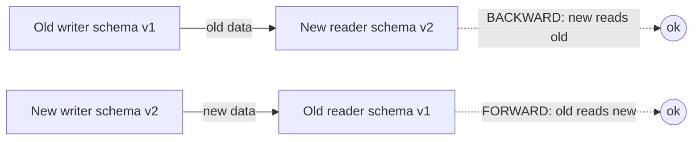
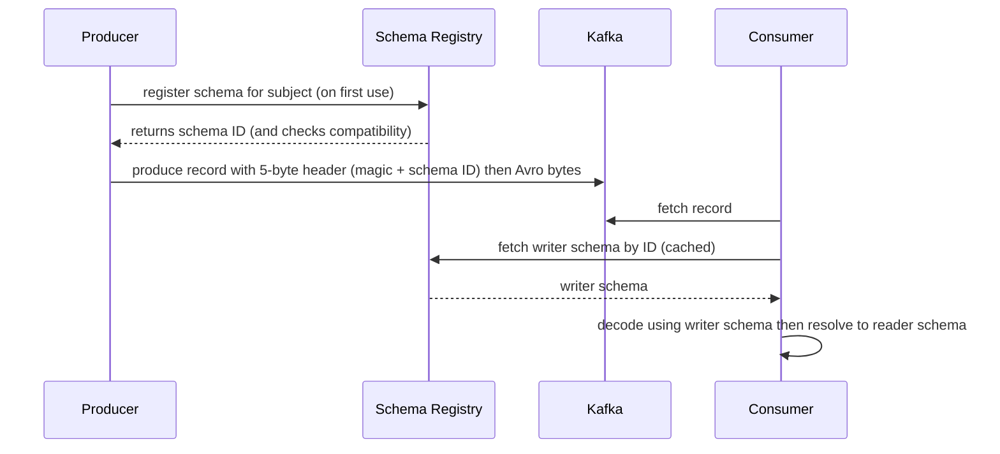

# Serialization Formats & Schema Evolution

When services and stream processors exchange data, two decisions dominate operability:
**how you encode a record on the wire** (JSON? Protobuf? Avro?) and **how the
producer and consumer agree on its shape as that shape changes over time**. Get the
first wrong and you pay in bytes, CPU, and debuggability. Get the second wrong and a
"harmless" field rename takes down every consumer in production during a rolling
deploy. This page teaches the wire formats, the rules of **schema evolution**, the
**compatibility modes** that encode those rules, and the **schema registry** that
enforces them so producers and consumers can deploy independently.

> [!KEY-TAKEAWAY]
> A message's bytes are only half the contract — the *schema* is the other half.
> Binary formats (Protobuf, Avro, Thrift) are compact but unreadable without the
> schema, so the schema has to travel *with* the data or live in a *registry*. Schema
> evolution is the discipline of changing that schema so that old and new code can
> still read each other's data; **compatibility modes** (BACKWARD / FORWARD / FULL)
> are the machine-checkable rules, and a **schema registry** enforces them at
> registration time so a bad change is rejected before it ever hits the topic.

See also: **apache-kafka** (message keys/values and where serializers plug in),
**stream-processing-cdc** (CDC event schemas and the outbox), and
**rest-api-design / api-versioning-and-evolution** for the synchronous REST/OpenAPI
side of the same problem.

---

## Why serialization formats matter

**Serialization** (a.k.a. marshalling) turns an in-memory object into a byte
sequence you can put on a socket, a Kafka topic, or a disk; **deserialization** does
the reverse. The format you pick is a long-lived contract that affects:

- **Size on the wire / disk** — directly drives network cost, broker storage, and
  throughput. At millions of messages/sec, a 3x size difference is a real bill.
- **CPU cost** to encode/decode — JSON parsing is famously expensive; binary formats
  with field tags are cheap.
- **Cross-language interop** — can a Go producer and a Java consumer agree?
- **Human readability / debuggability** — can you `cat` a message and understand it?
- **Schema evolution** — can you add a field next quarter without a coordinated,
  big-bang redeploy of every producer and consumer?

The last point is the one that bites teams in practice. A format that is convenient
on day one (hand-written JSON with no schema) can become the thing that forces
lockstep deploys and 2 a.m. incidents by year two.

> [!INTERVIEW]
> A strong answer never says "just use JSON" or "always use Protobuf." It frames the
> choice against the axes above and the *use case*: JSON for external/public APIs and
> low-volume config, a schema'd binary format for high-volume internal event streams
> and analytics.

## Text vs binary trade-offs

Formats split into two families.

**Text formats** (JSON, XML, YAML, CSV) encode values as human-readable characters.

- Self-describing-ish: field names travel with every record, so you can read a
  message without an external schema.
- Verbose: field names and delimiters are repeated in every record; numbers are ASCII
  digits, not packed bytes.
- Ambiguous types: JSON has one number type (an IEEE-754 double in most parsers), so
  large 64-bit integers lose precision; there's no native `bytes`, date, or decimal.
- Slow to parse relative to binary.

**Binary formats** (Protobuf, Avro, Thrift, MessagePack) encode values as packed
bytes, usually keyed by an integer **field tag/number** rather than a name.

- Compact: integers use varint/zig-zag encoding, no repeated field names (Protobuf,
  Thrift) or no field names at all (Avro relies on schema order).
- Fast to parse.
- **Not human-readable** and, for the schemaless case, **undecodable without the
  schema** — a raw Avro record is just bytes; you must know the writer schema.
- Richer type systems (fixed-width ints, `bytes`, enums, nested messages).

| Property | Text (JSON/XML) | Binary (Protobuf/Avro/Thrift) |
|---|---|---|
| Size | Large (repeated field names) | Small (tags/positional) |
| Parse speed | Slow | Fast |
| Human-readable | Yes | No |
| Needs schema to decode | No | Protobuf: no (tags in bytes) · Avro: **yes** |
| Type richness | Weak | Strong |
| Ubiquity / tooling | Everywhere | Needs codegen/libraries |

> [!TIP]
> "Binary" does not automatically mean "you need a registry." Protobuf embeds field
> *numbers* in the bytes and can be decoded (structurally) without the schema. **Avro**
> is the format where the writer schema is mandatory to decode, which is exactly why
> Avro + a schema registry is such a common pairing.

## JSON as a wire format

**JSON** is the default for public/external HTTP APIs and for low-volume,
human-facing messaging. Strengths: universal support, human-readable, schemaless so
you can ship without codegen, trivially inspectable in logs and `curl`.

Weaknesses that matter at scale:

- **Verbose.** `{"customerId":12345,"amount":99}` repeats the keys in every message.
- **No enforced schema by default.** Any producer can emit any shape; consumers
  discover breakage at runtime. (You *can* bolt on **JSON Schema** to add validation
  and even register it in a schema registry — Confluent supports JSON Schema as a
  first-class type alongside Avro and Protobuf.)
- **Weak types.** Numbers are doubles; 64-bit IDs and money need string encoding or
  lose precision. No native binary/date/decimal.
- **Slower** to serialize/parse than binary.

```json
{ "eventType": "OrderPlaced", "orderId": "o-8891", "amountCents": 9900, "currency": "USD" }
```

Because JSON is self-describing, *adding* a field is naturally tolerated by lenient
consumers (they ignore unknown keys) and *removing* an optional field is usually safe
— but nothing *enforces* that discipline unless you add JSON Schema + registry.

## Protocol Buffers (Protobuf)

**Protobuf** (Google) is a compact binary format defined by an **IDL** (`.proto`
file) that you compile with `protoc` into typed classes in your language. It is the
default payload for **gRPC**.

```proto
syntax = "proto3";
message Order {
  string order_id   = 1;   // the "= 1" is the FIELD NUMBER, not a default
  int64  amount_cents = 2;
  string currency   = 3;
  reserved 4;              // 4 was deleted; never reuse it
  reserved "old_status";   // and the old name
}
```

Key ideas:

- Each field has a **field number** (the `= N`). On the wire, Protobuf writes
  `(field_number << 3 | wire_type)` as a varint tag, then the value. **Field names
  are not on the wire** — only numbers. This is why you can rename a field freely but
  must never change its number.
- **Field numbers 1–15 encode in one byte**; 16–2047 take two bytes. Put your hottest
  fields in 1–15.
- proto3 fields have **implicit presence** by default (a scalar left unset is
  indistinguishable from one set to its zero/default). Use the `optional` keyword (or
  wrapper types) when you need explicit "was it set?" semantics.
- **Unknown fields are preserved** in proto3: an old binary that parses a message
  containing a newer field keeps those bytes and re-emits them on serialization
  (important for proxies/round-tripping).
- Great cross-language codegen and tooling; used heavily for **service-to-service
  RPC** (gRPC).

Because the schema is compiled into both sides and field numbers are self-contained,
Protobuf is often used **without** a registry for RPC — but a registry is still
valuable for Kafka topics to enforce evolution rules centrally.

## Apache Avro

**Avro** is a compact binary format designed for **data / big-data pipelines**
(Hadoop, Kafka). Its defining trait: **the data is encoded positionally against a
schema, so you cannot decode a record without the writer's schema.** There are no
field tags in the bytes at all.

```json
{
  "type": "record",
  "name": "Order",
  "fields": [
    { "name": "orderId",     "type": "string" },
    { "name": "amountCents", "type": "long" },
    { "name": "currency",    "type": "string", "default": "USD" }
  ]
}
```

- Schemas are written in **JSON**; data is binary and *tiny* (no field names, no
  tags).
- Decoding uses **two schemas at once**: the **writer schema** (what produced the
  bytes) and the **reader schema** (what the consumer expects). Avro's **schema
  resolution** rules reconcile them — matching fields by **name**, filling in
  **defaults** for fields the reader has but the writer didn't, and skipping fields
  the writer had but the reader dropped.
- **Defaults are first-class and load-bearing**: a reader can add a field with a
  default and still read old data written without it.
- This is why Avro pairs naturally with a **schema registry**: the writer schema has
  to travel somehow. On Kafka, Confluent's serializer prepends a 5-byte header — a
  magic byte plus a 4-byte **schema ID** — and stores the actual schema in the
  registry, so consumers fetch the writer schema by ID instead of shipping it in
  every message.

### Worked example: bytes on the wire

Take the same `OrderPlaced` record — `orderId="o-8891"`, `amountCents=9900`,
`currency="USD"` — and count the bytes each way.

**JSON** (minified, keys included):

```
{"orderId":"o-8891","amountCents":9900,"currency":"USD"}
```

That's **56 bytes**: the three field *names* (`orderId`, `amountCents`, `currency`),
the braces, quotes, colons and commas all cost bytes on *every* message, and `9900`
travels as the four ASCII characters `9 9 0 0`.

**Avro** encodes positionally against the schema — no field names, no tags:

| Field | Encoding | Bytes |
|---|---|---|
| `orderId` = "o-8891" | length prefix `0x0C` (zig-zag of 6) + 6 ASCII bytes | 7 |
| `amountCents` = 9900 | zig-zag(9900)=19800 → varint `D8 9A 01` | 3 |
| `currency` = "USD" | length prefix `0x06` (zig-zag of 3) + 3 ASCII bytes | 4 |
| **payload total** | | **14** |

Add Confluent's **5-byte header** (1 magic byte + 4-byte schema ID) and the wire
message is **19 bytes** vs JSON's 56 — a **4x** shrink on the raw payload, **~3x**
after the header. Multiply by millions of messages/sec and that ratio *is* the broker
storage and network bill the intro promised.

### Worked example: Avro schema resolution

Now watch resolution reconcile a **writer** and **reader** schema that differ by one
field.

**New reader, old data (BACKWARD).** Writer schema v1 has `{orderId, amountCents}`;
it emitted the 10-byte record `0C "o-8891" D8 9A 01`. Reader schema v2 adds
`currency` with `default:"USD"`. Resolution walks the *reader's* fields, matching by
name: `orderId` and `amountCents` are present in the writer bytes and read directly;
`currency` is in the reader but **not** the writer, so the reader substitutes its
default. Decoded value: `{orderId:"o-8891", amountCents:9900, currency:"USD"}` — the
`USD` came from the default, not the bytes. *New code read old data.*

**Old reader, new data (FORWARD).** Reverse it: writer v2 emits the 14-byte record
with `currency="EUR"`, but the consumer still runs reader v1 `{orderId, amountCents}`.
Resolution reads `orderId` and `amountCents`, then sees the writer has a `currency`
field the reader lacks, so it **parses-and-skips** those 4 bytes to stay byte-aligned
and discards the value. Decoded value: `{orderId:"o-8891", amountCents:9900}` — the
`EUR` is silently dropped, and the old consumer keeps working. *Old code read new
data.* (Note the reader always needs the writer schema to know how many bytes to skip;
that's why Avro ships the schema ID.)

> [!TIP]
> Rule of thumb interviewers like: **Protobuf for RPC / service APIs, Avro for data
> streams and analytics.** Avro's tag-free, schema-resolved records and rich default
> semantics are ideal for long-lived Kafka topics and data lakes.

## Thrift, MessagePack, and other formats

- **Apache Thrift** (originally Facebook): like Protobuf, an IDL + codegen binary
  format, but it bundles a full **RPC framework** (transports, protocols, servers) in
  the box. It uses field IDs like Protobuf and has similar evolution rules. Chosen
  when you want the batteries-included RPC stack; less momentum than gRPC/Protobuf
  today.
- **MessagePack**: "binary JSON." It maps the JSON data model onto a compact binary
  encoding — **schemaless**, self-describing, no IDL. You get JSON's flexibility and
  smaller/faster payloads, but **not** the enforced schema evolution of Protobuf/Avro.
  Good for caches, Redis payloads, and JSON-shaped data that needs to shrink.
- **BSON** (MongoDB's binary JSON), **CBOR** (IETF, used in COSE/WebAuthn),
  **FlatBuffers / Cap'n Proto** (zero-copy, read without a parse step — great for
  games/latency-critical reads) round out the space.

| Format | Schema | Binary | IDL/codegen | Typical use |
|---|---|---|---|---|
| JSON | none (or JSON Schema) | no | no | Public APIs, config |
| Protobuf | required (`.proto`) | yes | yes | gRPC / service RPC |
| Avro | required (JSON schema) | yes | schema, not codegen-required | Kafka / data lakes |
| Thrift | required (IDL) | yes | yes | RPC stack (legacy-heavy) |
| MessagePack | none | yes | no | Compact JSON, caches |

## Schema evolution fundamentals

**Schema evolution** is changing a record's schema over time while keeping old and
new code interoperable. The mental model is **two schemas at play**:

- **Writer schema** — the schema the *producer* used to encode the bytes.
- **Reader schema** — the schema the *consumer* uses to decode them.

They are frequently **different versions** because producers and consumers deploy at
different times. Evolution asks: *given writer schema V_w and reader schema V_r, can
the reader still make sense of the data?* Two directions:

- **Backward compatibility** — a **new reader** can read data written by an **old
  writer**. (New code, old data.)
- **Forward compatibility** — an **old reader** can read data written by a **new
  writer**. (Old code, new data — the reader ignores what it doesn't understand.)



Whether a specific change is backward- or forward-safe depends on the change *and*
the format's default rules. The registry turns these into enforceable modes.

## Compatibility modes (BACKWARD, FORWARD, FULL, NONE)

The names trip everyone up, so anchor them to *time* and *upgrade order*:
**BACKWARD** = the new schema is compatible looking **backward in time at old data**,
so the new-schema side (usually the **consumers**) can be upgraded **first** and still
read everything already on the topic. **FORWARD** = the old schema can read data from
the **future**, so **producers** can go first and old consumers survive the new bytes.
Whichever direction is guaranteed is the side you *don't* have to rush.

Confluent Schema Registry (and Apicurio, and others) let you set a **compatibility
mode** per subject. The mode decides which schema changes are allowed to register.

| Mode | Guarantees | Allowed changes | Upgrade first |
|---|---|---|---|
| **BACKWARD** (default) | New schema can read data from the previous schema | Add **optional/defaulted** fields, **delete** fields | **Consumers** |
| **BACKWARD_TRANSITIVE** | New schema reads data from **all** prior schemas | Same as BACKWARD | Consumers |
| **FORWARD** | Previous schema can read data written with new schema | **Add** fields, delete **optional** fields | **Producers** |
| **FORWARD_TRANSITIVE** | **All** prior schemas can read new data | Same as FORWARD | Producers |
| **FULL** | Both backward and forward vs. the previous schema | Add/delete **optional (defaulted)** fields only | Either (independent) |
| **FULL_TRANSITIVE** | Both directions vs. **all** prior schemas | Same as FULL | Either (independent) |
| **NONE** | No checks | Anything | — (no guarantees) |

Two crucial nuances:

1. **Transitive vs. non-transitive.** Non-transitive modes check the new schema only
   against the **latest** registered version. Transitive modes check against **every**
   previous version — necessary if consumers might still see very old data (e.g.,
   replaying a topic from the beginning, or a compacted topic with old records).
2. **Upgrade order follows the mode.** Under **BACKWARD**, upgrade **consumers first**
   (they must handle both old and new). Under **FORWARD**, upgrade **producers first**.
   Under **FULL**, either side can go first. The default mode is **BACKWARD**.

**Worked example: why the upgrade order is not arbitrary.** Say the subject is
**BACKWARD** and you add `currency` with `default:"USD"` (a BACKWARD-legal change).
BACKWARD only guarantees *new reads old*, not *old reads new*. Trace two rollout
orders during a rolling deploy:

- **Consumers first (correct for BACKWARD).** Upgrade consumers to v2 while producers
  still emit v1. v2 consumers read v1 bytes and fill `currency` from the default —
  fine. Later, producers flip to v2 and now emit `currency` explicitly — v2 consumers
  read it — fine. Nothing ever breaks.
- **Producers first (wrong order).** A producer ships v2 and starts emitting the extra
  `currency` bytes *before* consumers upgrade. Now old v1 consumers hit new bytes —
  and that's a **forward** read, which BACKWARD does **not** promise. With Avro they'd
  need the writer schema to skip the field cleanly; a stricter/positional decoder can
  desync. You bet on a guarantee the mode never gave you.

That's the whole rule: upgrade the side the mode *protects* (BACKWARD → consumers,
FORWARD → producers) first, so the unprotected direction never occurs on the wire.

> [!WARNING]
> **NONE disables all checks.** It does not make evolution safe — it just stops the
> registry from stopping you. Reserve it for controlled migrations, and prefer a
> transitive mode when consumers replay history.

## Adding and removing fields safely

The single most important table to internalize:

| Change | Backward-safe? (new reads old) | Forward-safe? (old reads new) |
|---|---|---|
| **Add** a field **with a default** | ✅ (default fills missing) | ✅ (old reader ignores it) |
| **Add** a field **without a default / required** | ❌ (old data has no value) | ✅ |
| **Remove** an **optional/defaulted** field | ✅ | ✅ (old reader uses its default) |
| **Remove** a **required** field | ✅ | ❌ (new data lacks it) |
| **Rename** a field | ❌ in Avro (matched by name) · ✅ in Protobuf (matched by number) | same |
| **Change a field's type** | usually ❌ (only narrow promotions, e.g. int→long in Avro) | usually ❌ |

How this composes with the mode table above: the **mode** is the registry's per-subject
*gate*, and this **field table** is the underlying per-change rule the mode enforces.
BACKWARD's "delete fields" is safe precisely because of the row below — a new reader
simply stops looking for a field that's gone, so old data still decodes.

Practical rules:

- **Always give new fields a default.** This is what makes *adding* a field both
  backward- and forward-compatible.
- **Never make a new field required** on an existing schema — old data won't have it.
- **Removing a field** is safe only if it was optional/defaulted (or, for forward
  compat, if readers can supply a default).
- **Renaming** is safe in tag-based formats (Protobuf/Thrift match by number) but
  **breaks Avro**, which matches by field name (use **aliases** to rename in Avro).

## Protobuf field numbers: never reuse or renumber

The cardinal Protobuf rule: **a field number is a permanent identity.** On the wire,
only the number is written, so:

- **Never change an existing field's number** — that's semantically deleting the old
  field and adding a brand-new one, and readers will misinterpret bytes.
- **Never reuse a deleted field's number** for a new, differently-typed field. Old
  serialized data (or an old peer) still has bytes tagged with that number and the
  same wire type; a new field reusing it will silently mis-decode — the Protobuf docs
  list consequences up to **data corruption and leaked PII**.
- When you delete a field, **`reserved` its number (and name)** so nobody can
  accidentally reuse them:

```proto
message User {
  reserved 2, 5, 9 to 11;   // numbers that were used and removed
  reserved "email", "ssn";  // names too, to protect JSON/TextFormat
}
```

- Field numbers 19000–19999 are reserved by the Protobuf implementation itself.

> [!INTERVIEW]
> "Why can you rename a Protobuf field freely but never renumber it?" Because the wire
> format keys fields by **number, not name** — names exist only in the `.proto` for
> humans and codegen. Renaming changes nothing on the wire; renumbering changes the
> key that every byte is tagged with.

## Enum evolution and unknown values

Enums are a classic evolution trap because a producer can emit a value a consumer's
code has never heard of.

- **proto3 enums must have a zero value** (e.g., `STATUS_UNSPECIFIED = 0`), used as
  the default when the field is unset. Reserve slot 0 for "unknown/unspecified," not a
  real state.
- **Adding a new enum value is forward-dangerous** for old consumers unless they
  handle unknowns gracefully. proto3 preserves unknown enum values as their raw
  integer (kept in unknown fields / accessible via the underlying int), so old code
  can round-trip them; older proto2 and many strict deserializers instead **reject or
  crash** on an unknown enum. Java's proto3 exposes an `UNRECOGNIZED` sentinel.
- **Defensive pattern:** always have a `default`/`else` branch on enum switches, and
  model an explicit `UNKNOWN`/`UNSPECIFIED` so consumers degrade instead of failing.
- In **Avro**, an enum can declare a **`default`** symbol (Avro 1.9+): if the reader
  sees a symbol not in its schema, it resolves to that default instead of erroring —
  the safe way to add enum symbols.

**Worked example: the breakage in code.** Producer adds `STATUS_REFUNDED = 3` to the
enum and starts emitting it. An old consumer compiled against `{UNSPECIFIED=0,
PENDING=1, SHIPPED=2}` runs this strict switch:

```java
switch (order.getStatus()) {   // no default arm
  case PENDING: reserveInventory(); break;
  case SHIPPED: sendTracking();   break;
  // STATUS_REFUNDED (3) matches nothing
}                                // proto3 Java: getStatus() returns UNRECOGNIZED
```

In proto3 Java the wire value `3` deserializes to the `UNRECOGNIZED` sentinel (the raw
int is preserved), so the switch silently falls through and the refund is **never
processed** — a data-loss bug, not a crash. In proto2 or many strict deserializers the
same message is **rejected at decode time**. The fix is one arm:

```java
  default: log.warn("unknown status {}", order.getStatusValue()); park(order);
```

Same idea in Avro: declare `"default":"UNKNOWN"` on the enum so an unrecognized symbol
resolves to `UNKNOWN` instead of erroring.

> [!WARNING]
> Adding an enum value looks trivial and is one of the most common production
> breakages: an old consumer that does a strict `switch` with no default branch will
> throw the first time a new value arrives. Treat "add enum value" as a compatibility
> change, not a freebie.

## Defaults, optional, and required

Defaults are the machinery that makes add/remove safe.

- **Avro**: a field with a `default` can be added to the reader schema and still read
  old data (the default is substituted). Removing a field is safe if the *reader* can
  ignore it; making a removed-field readable forward requires a default on the reader.
- **Protobuf proto3**: scalars have **implicit presence** — an unset `int32` reads as
  `0`, an unset `string` as `""`; you can't tell "unset" from "set to default" unless
  you mark the field **`optional`** (explicit presence) or use wrapper types. This is
  why proto3 removed `required` entirely.
- **"required considered harmful."** proto2 had `required`; it was a notorious
  footgun because you can **never** safely remove a required field or add one to an
  existing message — a single required field can make a message permanently
  unparseable across versions. proto3 dropped `required` for exactly this reason. The
  lesson generalizes: **treat every field as optional-with-a-default** for evolution.

## The schema registry (Confluent, Apicurio)

A **schema registry** is a centralized service that stores versioned schemas and
enforces compatibility. It decouples producers from consumers so they can deploy
independently.



How it works (Confluent model):

1. On produce, the serializer **registers** the schema under a **subject** (or looks
   up its existing ID). The registry runs the **compatibility check** against the
   subject's mode and **rejects incompatible schemas** at registration time.
2. The message on the wire carries a **magic byte + 4-byte schema ID**, not the whole
   schema — so payloads stay small.
3. On consume, the deserializer reads the ID, **fetches the writer schema** from the
   registry (cached locally), and decodes; for Avro it then resolves writer→reader.

**Apicurio Registry** is the popular open-source alternative (Red Hat), API-compatible
with Confluent's and supporting Avro/Protobuf/JSON Schema plus OpenAPI/AsyncAPI
artifacts. AWS **Glue Schema Registry** is the managed AWS equivalent.

> [!KEY-TAKEAWAY]
> The registry's superpower is **decoupled deploys**: because a bad schema is rejected
> *at registration*, and because compatibility modes guarantee old/new interop, a
> producer team can ship a schema change without coordinating a lockstep redeploy with
> every consumer team. The check moves the failure from *runtime in production* to
> *CI / registration time*.

## Subject naming strategies and who validates

A **subject** is the scope under which schema versions and the compatibility mode
live. Confluent offers three **subject name strategies**:

- **TopicNameStrategy** (default): subject = `<topic>-key` and `<topic>-value`. One
  schema type per topic — simplest, most common.
- **RecordNameStrategy**: subject = the record's fully-qualified name. Lets you put
  **multiple event types on one topic**, each evolving independently.
- **TopicRecordNameStrategy**: subject = `<topic>-<record-name>`. Multiple types per
  topic, but scoped per topic.

**Who validates, and when:**

- **At registration (produce side):** the registry checks the new schema against the
  subject's compatibility mode and rejects it if it violates the rule. This is the
  primary gate. You can also run it in CI with the Maven/Gradle plugin's
  `test-compatibility` goal so breakage is caught *before* deploy.
- **At runtime (consume side):** the consumer fetches the writer schema by ID and
  performs schema resolution; it does not re-run the compatibility policy, it just
  decodes.

> [!TIP]
> The compatibility mode lives on the **subject**, not globally — you can set a strict
> `FULL_TRANSITIVE` on a critical shared topic and a looser `BACKWARD` elsewhere. Set
> it deliberately per subject; don't rely on the global default.

## Contrast with REST and OpenAPI versioning

The same "don't break consumers" problem exists for synchronous HTTP APIs, but the
tooling differs — worth contrasting in interviews.

| Aspect | Event schemas (Kafka + registry) | REST / OpenAPI |
|---|---|---|
| Contract lives in | Schema Registry (per subject, versioned) | OpenAPI/Swagger spec, docs, code |
| Enforcement | **Automatic** at register time (rejects) | Mostly manual / contract tests / linters |
| Versioning unit | Schema version + compatibility mode | URL (`/v2/`), header, or media type |
| Break handling | Evolve in place under a mode | Often a **new version** (`/v1` → `/v2`) run in parallel |
| Consumer coupling | Decoupled via registry + defaults | Client updates or version negotiation |
| Removing a field | Governed by compat mode | Deprecate → sunset window → remove |

The philosophies differ: REST tends to **version explicitly** (new URL/media type)
and run versions in parallel, while event streaming tends to **evolve one schema in
place** under a compatibility contract and avoid versioned URLs. Both share the core
discipline: additive/optional changes are safe, removing/renaming/retyping required
fields is a breaking change, and defaults/deprecation windows are how you avoid
lockstep upgrades. See **rest-api-design / api-versioning-and-evolution** for the
REST side in depth.

## When you must break compatibility

Sometimes a change genuinely can't be made backward/forward compatible (a field
changes meaning, a `required` type flips). In-place evolution is off the table, so
streaming borrows the REST `/v1 → /v2` parallel-run trick:

- **New topic + dual-write.** Producers write both the old topic (old schema) and a
  new `orders.v2` topic (new schema) for a migration window. Consumers cut over topic
  by topic; when the last old consumer is gone, stop the dual-write and retire the old
  topic. This is the streaming analog of running `/v1` and `/v2` in parallel.
- **Versioned envelope.** Wrap the payload in a record with a `version` field (or a
  union of the old and new payload types) so one topic carries both shapes and
  consumers branch on the version — useful when a second topic is too heavy.
- **Schema references.** For shared/nested types, registries let one schema
  **reference** another registered subject (e.g., a common `Address` record) so you
  compose and version shared types once instead of copy-pasting them into every event.

## Common follow-up questions

- "JSON vs Avro vs Protobuf — when each?" JSON for public/external APIs and
  low-volume human-facing data; Protobuf for gRPC/service RPC (schema compiled into
  both sides, tags in the bytes); Avro for high-volume Kafka streams and data lakes
  (tiny tag-free records, rich defaults, schema resolution — pairs with a registry).
- "What does BACKWARD compatibility actually let me do?" Add optional/defaulted
  fields and delete fields; a new consumer can read data written by the previous
  schema. Upgrade **consumers first**.
- "Why must you never reuse a Protobuf field number?" The wire format keys fields
  by number; a reused number makes old bytes decode as the wrong field — up to data
  corruption/PII leaks. Use `reserved`.
- "How does a consumer decode an Avro message it didn't produce?" The message
  carries a schema **ID**; the consumer fetches the **writer schema** from the registry
  and resolves it against its own **reader schema**.
- "Where does the compatibility check happen?" At **schema registration** (produce
  side / CI), not at consume time. The consumer just fetches and decodes.
- "How do you safely add an enum value?" Model an `UNKNOWN`/`UNSPECIFIED` (0 in
  proto3), give Avro enums a `default` symbol, and always have a default branch —
  otherwise old strict consumers break.
- "Transitive vs non-transitive — why care?" If consumers can see very old data
  (topic replay, compaction), you need a **transitive** mode so the new schema is
  checked against *all* history, not just the latest version.
- "Why did proto3 drop `required`?" A required field can never be safely
  added/removed, permanently breaking cross-version parsing — a well-known footgun.

## References

- Confluent, *Schema Evolution and Compatibility* — compatibility types, upgrade
  order, transitive modes, default (BACKWARD).
- Confluent, *Schema Registry Concepts* and *Serializer/Deserializer* — subjects,
  subject name strategies, magic byte + schema ID wire format, register/fetch flow.
- Google, *Protocol Buffers* language guide (proto3) — field numbers, `reserved`,
  unknown fields, defaults, enum zero value, dropping `required`.
- Apache Avro *Specification* — schema resolution (writer vs reader schema), defaults,
  enum `default` symbol, aliases for renames.
- Apache Thrift and MessagePack project documentation — IDL/RPC framework; schemaless
  binary JSON.
- Martin Kleppmann, *Designing Data-Intensive Applications* — Ch. 4 (Encoding and
  Evolution): JSON/XML vs Thrift/Protobuf/Avro, writer/reader schema, forward/backward
  compatibility.
- Apicurio Registry and AWS Glue Schema Registry documentation — open-source and
  managed registry alternatives.
