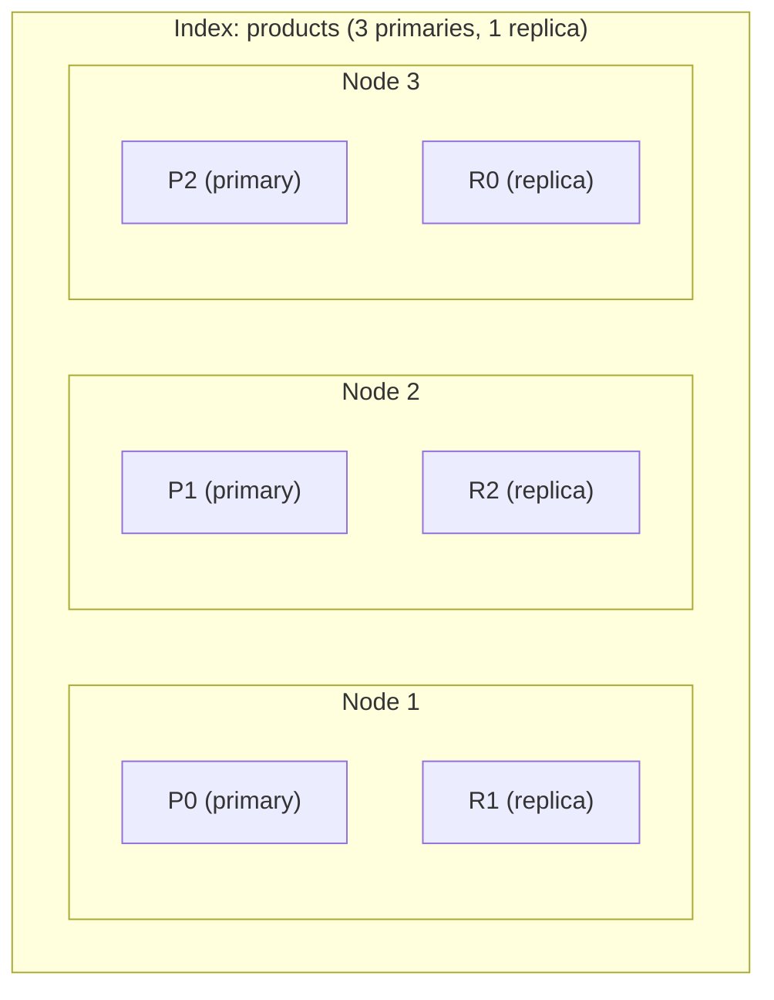
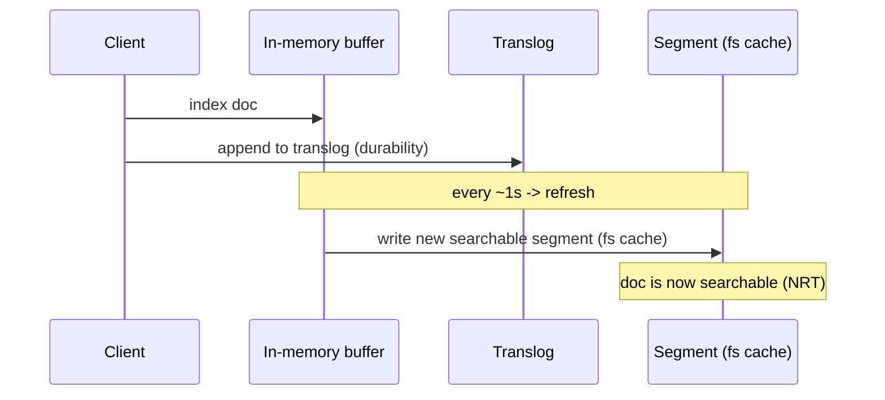
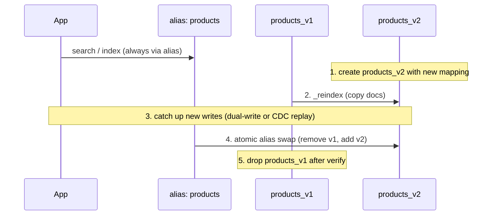
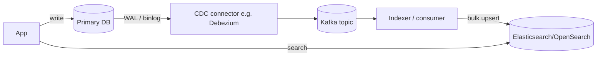

# Search Engines & Elasticsearch Internals

Full-text search is a different problem from the point/range lookups relational databases
are built for. A user typing `wireless noise-cancelling headphones` expects ranked, typo-
and grammar-tolerant results in milliseconds over millions of documents — not a substring
scan. Search engines (Lucene, and the distributed systems built on it: **Elasticsearch** and
its fork **OpenSearch**) solve this with an **inverted index**, a text **analysis pipeline**,
and a **relevance scoring** model. This topic covers those internals, the Elasticsearch data
and durability model, mapping and query mechanics, and the operational reality of keeping a
search index in sync with your system of record.

> [!INTERVIEW]
> The single most common opening question is "why can't you just use `LIKE '%term%'` in
> Postgres?" A staff-level answer connects three things: the inverted index (data structure),
> BM25 (ranking), and the analysis pipeline (matching *concepts*, not bytes). If you can
> explain all three and then say when you'd still just use the database, you've covered 80%
> of what an interviewer probes here.

See also: **vector-databases-similarity-search** for semantic / hybrid (BM25 + vector) search,
and **nosql-databases-data-models** for the document-store side of Elasticsearch's data model.

## Why full-text search needs a search engine

A relational `LIKE '%headphone%'` (or even `ILIKE`) performs a **full scan**: a leading
wildcard means the B-tree index on that column cannot be used, so the engine reads every row
and runs a substring match. Cost is O(rows × string length) and grows linearly with data.
Worse, it matches *bytes*, not *meaning*: `LIKE '%headphone%'` misses "headphones" only if you
forget the plural, matches "beheadphoned" nonsense substrings, ignores case unless you normalize,
and gives you no **ranking** — every row either matches or doesn't.

Postgres full-text search (`tsvector`/`tsquery` + GIN index) is a real inverted index and
closes much of this gap for modest corpora. A dedicated search engine adds: distributed scale-out,
BM25 relevance out of the box, rich analyzers (stemming, synonyms, language packs), fuzzy/prefix/
phrase queries, aggregations/faceting, and near-real-time indexing. The trade-off is running and
syncing a *second* datastore.

| Need | `LIKE`/`ILIKE` | Postgres FTS | Elasticsearch/OpenSearch |
|---|---|---|---|
| Leading-wildcard substring | Full scan | n/a | n/a (use ngram/wildcard field) |
| Ranked relevance | No | Basic (`ts_rank`) | BM25 by default |
| Stemming / synonyms / language | No | Yes (dictionaries) | Yes (rich analyzers) |
| Typo tolerance (fuzzy) | No | Limited (trigram) | Yes |
| Faceting / aggregations | Manual `GROUP BY` | Manual | First-class |
| Horizontal scale | Via DB sharding | Via DB sharding | Native shards/replicas |

## The inverted index

An **inverted index** maps each *term* to a **posting list**: the set of document IDs that
contain that term (plus, optionally, positions and frequencies). It is the inverse of a
"forward" index (document → its terms), hence the name. To answer "which docs contain
`headphones`?" you look up one term and read its posting list — O(1)-ish dictionary lookup plus
a linear read of matching docs — instead of scanning every document.

```
Docs:
  1: "wireless headphones"
  2: "wireless mouse"
  3: "noise cancelling headphones"

Inverted index (term -> posting list of doc ids):
  cancelling -> [3]
  headphones -> [1, 3]
  mouse      -> [2]
  noise      -> [3]
  wireless   -> [1, 2]
```

Posting lists are stored **sorted by doc ID**, which makes boolean combinations fast: an AND of
two terms is a merge-intersection of two sorted lists (skip lists accelerate this); an OR is a
merge-union. Lucene also stores **term frequencies** (for scoring), **positions** (for phrase and
proximity queries), and **offsets** (for highlighting). The term dictionary itself is compressed
as an **FST** (finite state transducer) that shares prefixes, so millions of terms fit in memory
and enable fast prefix/range/fuzzy term enumeration.

> [!KEY-TAKEAWAY]
> The inverted index is fast for text because it turns "search" into a dictionary lookup +
> merge of pre-sorted, pre-computed posting lists. A B-tree is optimized for ordered scans of
> *whole column values*; it cannot efficiently answer "which rows contain this word somewhere
> inside a text field."

## The analysis pipeline

Both the text being indexed and the query text are run through an **analyzer** to produce the
*terms* that actually land in (or probe) the inverted index. An analyzer is a fixed pipeline of
three stages:

1. **Character filters** — operate on the raw character stream *before* tokenization. E.g.
   `html_strip` removes tags; a `mapping` filter turns `&` into `and`.
2. **Tokenizer** — splits the stream into tokens. The `standard` tokenizer splits on word
   boundaries (Unicode segmentation) and drops most punctuation. There is exactly **one**
   tokenizer per analyzer.
3. **Token filters** — transform, add, or remove tokens. Common ones: `lowercase`, `stop`
   (remove stopwords like "the"/"a"), `stemmer` / `porter_stem` / `snowball` (reduce
   "running"→"run"), `synonym`, `asciifolding` ("café"→"cafe"), `ngram`/`edge_ngram`
   (autocomplete).

```
"The <b>Running</b> Shoes!"
  --char filter (html_strip)-->  "The Running Shoes!"
  --tokenizer (standard)------>  ["The", "Running", "Shoes"]
  --lowercase----------------->  ["the", "running", "shoes"]
  --stop---------------------->  ["running", "shoes"]
  --stemmer------------------->  ["run", "shoe"]     <- these terms are indexed
```

So the document is indexed under the terms `run` and `shoe`. A later query for "runs" analyzed
the same way also produces `run` — and matches. **Analysis is what makes search match concepts
instead of exact strings.**

> [!WARNING]
> The analyzer is applied at index time, so **changing an analyzer does not retroactively
> re-analyze existing documents** — old docs keep their old terms. You must reindex. This is
> the root cause of "I added a synonym but old docs don't match."

## Index-time vs query-time analysis

Analysis happens **twice**, and for matches to work the two must be compatible:

- **Index time:** the field's analyzer produces the terms stored in the inverted index.
- **Query time:** for full-text queries (`match`), the *search analyzer* processes the query
  string into terms that are looked up in the index.

By default the same analyzer is used for both. You can set a different `search_analyzer` — the
classic case is **`edge_ngram` for autocomplete**: index `"quick"` as `q, qu, qui, quic, quick`
so a user typing `qui` matches, but analyze the *query* with a plain analyzer (`qui` → `qui`)
so you don't ngram the query and blow up matches. Synonym expansion is also often done at query
time (search-time synonyms) so you can change the synonym list without reindexing — at the cost
of a slightly larger query.

> [!TIP]
> Use `GET /<index>/_analyze` (the Analyze API) with `"text": "..."` to see exactly what terms
> a field or analyzer produces. This is the fastest way to debug "why doesn't my query match?"
> — 90% of the time the index-time and query-time term streams disagree.

## Relevance scoring: TF-IDF and BM25

When multiple documents match, the engine must **rank** them. Classic **TF-IDF** scores a
term-document pair by:

- **TF (term frequency):** more occurrences of the term in a doc → higher score.
- **IDF (inverse document frequency):** terms that are rare across the whole corpus are more
  discriminating → weighted higher; common terms ("the") contribute little.

The modern default (Lucene ≥ 6, so all current Elasticsearch/OpenSearch) is **BM25** (Okapi
BM25), a probabilistic refinement of TF-IDF with two improvements:

- **TF saturation:** term frequency has *diminishing returns*. The 10th occurrence of a word
  adds far less than the 2nd. Controlled by **`k1`** (default **1.2**).
- **Length normalization:** a match in a short title counts more than the same match buried in
  a long body. Controlled by **`b`** (default **0.75**); `b=0` disables length normalization.

```
score(q, d) = Σ_terms  IDF(t) · ( tf · (k1+1) ) / ( tf + k1·(1 - b + b·|d|/avgdl) )
```

where `|d|` is the doc's field length and `avgdl` the average field length. BM25 is why a search
for `the fox` ranks a short doc titled "The Fox" above a 5,000-word article that mentions "fox"
once.

| | TF-IDF (legacy) | BM25 (default) |
|---|---|---|
| TF contribution | Unbounded (linear-ish) | Saturating (bounded by `k1`) |
| Length handling | Weak | Explicit (`b`) |
| Tunable params | Few | `k1`, `b` |
| Status in ES/OS | Superseded | Default similarity |

## Boosting and query-time relevance tuning

Scores are relative within a single query — you tune ranking by **boosting**:

- **Field boost:** `title^3` makes a match in `title` worth 3× a match in `body`
  (`multi_match` with `fields: ["title^3", "body"]`).
- **Query-clause boost:** a `bool` `should` clause with `"boost": 2` lifts docs matching it.
- **`function_score` / `field_value_factor`:** blend relevance with business signals — recency,
  popularity, rating, price. E.g. multiply BM25 by `log(1 + sales)`.
- **`boosting` query:** demote (not exclude) docs matching a "negative" clause.

> [!WARNING]
> Boost values are **not** intuitive linear knobs — score is a product/sum of many terms, and
> `_score` is not comparable across different queries or (before scores are combined) across
> shards with different term statistics. Tune with the `_explain` API and A/B tests, not by
> guessing magnitudes. Don't treat `_score` as an absolute quality metric to threshold on.

## The Elasticsearch / OpenSearch data model

Elasticsearch and OpenSearch (an Apache-2.0 fork of Elasticsearch 7.10, maintained by AWS after
Elastic's license change) share the same core model:

- **Index** — a logical collection of JSON **documents** with a shared **mapping** (schema).
  Analogous to a table, but the unit of full-text search.
- **Shard** — an index is split into **primary shards**, each of which is an independent
  **Lucene index**. Sharding is how an index scales beyond one node and parallelizes search.
  **The primary shard count is fixed at index creation** — to change it you reindex (or use the
  Split/Shrink APIs).
- **Replica shard** — a copy of a primary on another node. Replicas provide **HA** (survive node
  loss) and **read throughput** (searches can hit replicas). Replica count *is* changeable at
  runtime.
- **Document routing:** by default `shard = hash(_id) % number_of_primary_shards`, so a doc
  deterministically lands on one primary (plus its replicas).



A search **scatters** to one copy of each shard and **gathers**/merges the results (the
query-then-fetch phases). Too many small shards wastes overhead; too few huge shards limits
parallelism and slows recovery — a common sizing guideline is tens of GB per shard.

## Lucene segments, refresh, and near-real-time search

Each shard is a Lucene index made of immutable **segments**. New/updated docs first go into an
in-memory **indexing buffer**. Segments are **write-once, never modified**: an update is a
*delete-marker on the old doc + a new doc*, and a delete just marks a `.del` bit — space is
reclaimed later by **segment merges** (background merging of small segments into larger ones).

A **refresh** takes the buffered docs and writes them into a new segment that is opened for
search — but only into the **filesystem cache**, not yet fsynced to disk. This is cheap and is
what makes the docs **searchable**. It runs **every 1 second by default** (on indices that have
received a search in the last 30s). Because there's a sub-second gap between indexing and
visibility, Elasticsearch is **near-real-time (NRT)**, not real-time.



> [!TIP]
> For bulk loads, temporarily set `index.refresh_interval` to `-1` (disable) and drop replicas
> to 0, then re-enable — you avoid building a segment per second and re-merging constantly. This
> is one of the highest-impact indexing throughput tweaks.

## The translog and durability

A refresh makes docs *searchable* but does **not** make them *durable* — the segment is still
only in the filesystem cache and a `fsync` (flush) is expensive to do every second. Durability
comes from the **translog** (transaction log / write-ahead log): every indexing operation is
**appended to the translog before the op is acknowledged**. On a crash, unflushed operations are
**replayed from the translog** on recovery.

- **`index.translog.durability: request`** (the **default**): the translog is `fsync`ed and
  committed after **every** index/delete/update/bulk request before it is acknowledged. No
  acknowledged write is lost on a single-node crash.
- **`index.translog.durability: async`**: the translog is fsynced in the background every
  **`index.translog.sync_interval`** (default **5s**). Faster writes, but ops in the last
  interval can be lost on crash.

A **flush** is the heavier operation that commits the Lucene segments to disk (fsync) and starts
a fresh translog. Distinguish the three clearly:

| Operation | What it does | Cost | Default cadence |
|---|---|---|---|
| **Refresh** | Buffer → new searchable segment (fs cache) | Cheap | ~1s |
| **Flush** | Fsync segments to disk, trim translog | Expensive | Auto (size/age based) |
| **Translog fsync** | Persist the WAL for durability | Moderate | Per request (default) or every 5s (async) |

## Mapping: text vs keyword

The **mapping** is the index's schema — it declares each field's type and analyzer. The most
important distinction, and a top interview question, is **`text` vs `keyword`**:

- **`text`** — the value is **analyzed** (tokenized, lowercased, stemmed…) into terms. Use for
  full-text `match` search. `text` fields are **not** usable for exact sort/aggregation by
  default (no doc values), because the stored terms are the analyzed tokens, not the original.
- **`keyword`** — the value is stored **as one exact, un-analyzed token**. Use for exact-match
  filters (`term`), sorting, aggregations (facets), IDs, enums, tags, emails.

Because you often need both — search *and* facet on the same field — the default dynamic mapping
for a string creates a **multi-field**: a `text` field plus a `.keyword` sub-field.

```json
"mappings": {
  "properties": {
    "brand": {
      "type": "text",                       // full-text search: match "brand"
      "fields": { "raw": { "type": "keyword", "ignore_above": 256 } }  // exact: sort/agg/term on brand.raw
    }
  }
}
```

So `match` on `brand` (analyzed) finds "Sony Corp"; a `terms` aggregation or `sort` uses
`brand.raw` (exact). Choosing the wrong type is the classic bug: sorting/faceting on a `text`
field errors or misbehaves, and running full-text `match` against a `keyword` field only matches
the exact whole string.

## Dynamic mapping pitfalls

By default Elasticsearch uses **dynamic mapping**: the first document that contains a field
determines its type forever (the type is **immutable** once set). This is convenient but
dangerous:

- **Type inferred from first value:** a ZIP code `"90210"` seen first as a JSON number becomes
  `long`; later `"SW1A"` fails to index (mapping conflict / rejected doc). A version `"1.0"`
  becomes `float`, `"1.0.1"` fails.
- **Mapping explosion:** documents with arbitrary/user-controlled keys (e.g. logging `labels`
  with unbounded field names) create thousands of fields, blowing up cluster state and memory.
  Guard with `index.mapping.total_fields.limit` and `"dynamic": "strict"` or `"runtime"`.
- **Every string becomes `text` + `.keyword`**, doubling storage for fields you may only ever
  filter on.

> [!KEY-TAKEAWAY]
> For anything beyond a prototype, define an **explicit mapping** and set `dynamic` to `strict`
> (reject unknown fields) or `false` (ignore/store-only). Relying on dynamic mapping in
> production is how teams get un-searchable data and mapping-conflict outages.

## Query DSL: match vs term vs bool

Three building blocks cover most queries — and confusing them is the most common correctness bug:

- **`match`** — **full-text** query. The query string **is analyzed** (same analyzer as the
  field), then the resulting terms are looked up. `match: "Running Shoes"` → terms `run`,`shoe`.
  Use on `text` fields.
- **`term`** — **exact term** query. The query value is **NOT analyzed**; it's looked up verbatim
  in the inverted index. `term: {"status": "Active"}` will **not** match a `text` field that
  lowercased to `active`. Use on `keyword`/numeric/date fields.
- **`bool`** — combines clauses: **`must`** (AND, contributes to score), **`should`** (OR, boosts
  score; if no `must`, at least one should must match), **`must_not`** (exclude, no score),
  **`filter`** (must match but **no scoring**, cacheable).

```json
{ "query": { "bool": {
  "must":   [ { "match": { "title": "wireless headphones" } } ],
  "filter": [ { "term":  { "brand.raw": "Sony" } },
              { "range": { "price": { "lte": 200 } } } ],
  "must_not":[ { "term": { "discontinued": true } } ]
}}}
```

> [!WARNING]
> The #1 gotcha: `term` on a `text` field returns nothing (or wrong hits) because the field's
> stored terms are analyzed (lowercased/stemmed) but the `term` value isn't. For exact matching
> use the `keyword` field (`brand.raw`), not the analyzed `text` field.

## Query context vs filter context

Every clause runs in one of two contexts, and knowing the difference is both a correctness and a
performance question:

- **Query context** (`must`, `should`, top-level `query`) — answers "how *well* does this match?"
  and computes a **relevance `_score`**. Cannot be cached (scores depend on term stats).
- **Filter context** (`filter`, `must_not`, and queries inside a `filter`/`constant_score`) —
  answers a **yes/no** "does this match?", assigns **no score**, and the result (a bitset of
  matching docs) is **cacheable** in the node query cache. Reused filters (e.g. `status: active`,
  `created >= today`) become nearly free on repeat.

> [!TIP]
> Put anything that's a hard yes/no criterion — status flags, categories, date/price ranges,
> ownership — in **`filter`**, and reserve **`must`/`should`** for the parts that should
> influence ranking. This both speeds queries (caching, skipping score math) and prevents
> irrelevant fields from polluting relevance.

## Aggregations

**Aggregations** compute analytics over the docs matching a query — the engine behind faceted
navigation and dashboards (Kibana/OpenSearch Dashboards). Families:

- **Bucket** aggregations group docs: `terms` (top values → facets like "brand: Sony (42)"),
  `date_histogram` (time buckets), `range`, `histogram`, `filters`.
- **Metric** aggregations compute numbers over a bucket: `avg`, `sum`, `min`/`max`, `stats`,
  `cardinality` (approximate distinct count via HyperLogLog++), `percentiles` (approximate via
  t-digest/TDigest).
- **Pipeline** aggregations operate on the output of other aggs (`derivative`, `moving_avg`,
  `cumulative_sum`).

Aggregations run on **doc values** (a columnar, on-disk, per-field store) — which is why
aggregating/sorting requires `keyword`/numeric fields, not analyzed `text`. `terms` aggregation
results are **approximate** on multi-shard indices (each shard returns its local top-N, merged
centrally), so exact counts of high-cardinality fields can be slightly off unless you raise
`shard_size`.

## Reindex and alias-swap for zero-downtime mapping changes

Because a field's mapping/analyzer is **immutable** once set, changing it (new analyzer, `text`→
`keyword`, split multi-field, add synonyms that must apply to old docs) requires building a **new
index** and copying data in. The zero-downtime pattern uses an **alias** — an indirection layer
your application always queries instead of a concrete index name:



The **alias swap is a single atomic action** (`POST /_aliases` with both add and remove), so
searches never see a missing index. `_reindex` runs server-side and can transform docs via a
script or ingest pipeline; use `wait_for_completion=false` for a task you can poll. Always index
writes through the alias too, and handle writes that arrive during reindex (dual-write to both,
or replay from your CDC stream) so nothing is lost.

## Indexing from the database: CDC vs dual-write

The search index is almost always a **secondary, derived** copy of data whose system of record
is a database. Two patterns keep it in sync:

- **Dual-write:** the application writes to the DB *and* to Elasticsearch in the same request.
  Simple, but **not atomic** — a crash or partial failure between the two writes leaves them
  **inconsistent**, and there's no ordering guarantee under concurrency. An anti-pattern for
  anything requiring correctness.
- **Change Data Capture (CDC):** tail the DB's **transaction log** (e.g. Postgres WAL / MySQL
  binlog via Debezium → Kafka) and project changes into the index asynchronously. The DB commit
  is the single source of truth; the indexer is idempotent and can be replayed. This is the
  robust, industry-standard approach. A variant is the **transactional outbox**: write an
  `outbox` row in the same DB transaction, then relay it to the index — avoiding the dual-write
  atomicity gap.



> [!KEY-TAKEAWAY]
> Prefer **CDC (log-based)** or an **outbox** over naive dual-write. The search index is
> eventually consistent with the DB — design the UX for a small lag and make the indexer
> idempotent and replayable so you can rebuild the index from scratch at any time.

See also: **stream-processing-cdc** for CDC/Debezium mechanics and **apache-kafka** for the
transport, if those topics exist in your library.

## Search engine vs the database as source of truth

A recurring design mistake is treating Elasticsearch as a **primary datastore**. It is optimized
for search and analytics, not for OLTP:

- **No multi-document ACID transactions**, no foreign keys, no joins across indices (only limited
  parent/child and nested docs). Per-document operations are atomic; that's it.
- **Near-real-time, eventually consistent** by design; refresh lag and async replication mean it
  is not the place for read-your-writes financial state.
- **Reindex-to-change-schema** makes it a poor fit for a rapidly mutating canonical model.

The safe stance: the **database is the system of record**; Elasticsearch is a **rebuildable,
derived read model**. If your index is lost or corrupted, you must be able to reconstruct it from
the DB (or the CDC stream). Never store data that exists *only* in the search index.

## When NOT to use a search engine

Reach for the database (or Postgres FTS) instead of standing up Elasticsearch/OpenSearch when:

- **Exact-match / structured lookups dominate** — filtering by IDs, status, dates, ranges with
  no relevance ranking. A B-tree/GIN index in your existing DB is simpler and consistent.
- **Small corpus / low query volume** — Postgres `tsvector` + GIN comfortably handles modest
  full-text needs without a second system to run, secure, and sync.
- **Strong consistency / transactional reads required** — search's NRT + eventual consistency
  is a poor fit.
- **You can't afford the sync + ops cost** — a cluster is another stateful system to size,
  monitor, upgrade, secure, and keep consistent. Don't add it for a feature a `LIKE` and an
  index can serve.

Use it when you genuinely need **ranked full-text relevance, typo/linguistic tolerance,
faceting/aggregations at scale, or log/observability analytics (the ELK/OpenSearch stack)** over
volumes and query patterns your primary DB handles poorly.

## Common follow-up questions

- **"Why is Elasticsearch called near-real-time?"** Buffered docs become searchable only after a
  refresh (default ~1s), so there's a sub-second gap between indexing and visibility.
- **"Refresh vs flush vs translog fsync?"** Refresh = new searchable segment in fs cache (cheap,
  ~1s); flush = fsync segments to disk + trim translog (expensive); translog fsync = persist the
  WAL for durability (per request by default). Refresh ≠ durability; the translog provides it.
- **"Why both `text` and `.keyword` for the same field?"** `text` (analyzed) for full-text
  `match`; `keyword` (exact) for sorting, aggregations, and `term` filters.
- **"Why does my `term` query return nothing on a text field?"** The field's indexed terms are
  analyzed (lowercased/stemmed) but `term` doesn't analyze the query value — query the `keyword`
  sub-field instead.
- **"How do you change an analyzer/mapping with zero downtime?"** Create a new index with the new
  mapping, `_reindex`, catch up writes, then atomically swap an alias; drop the old index.
- **"TF-IDF vs BM25 — what changed?"** BM25 adds saturating term frequency (`k1`) and explicit
  length normalization (`b`); it's the default similarity in current Lucene/ES/OS.
- **"How do you keep the index in sync with the DB?"** CDC (log-based, e.g. Debezium→Kafka) or a
  transactional outbox — not naive dual-write; keep the indexer idempotent and replayable.
- **"Can you change the number of primary shards?"** Not in place — it's fixed at creation; use
  reindex, or the Split/Shrink APIs. Replica count is changeable at runtime.
- **"What's the difference between query and filter context?"** Query context scores (`_score`)
  and isn't cached; filter context is a yes/no, unscored, and cacheable — put hard criteria there.

## References

- Elasticsearch Reference — Near real-time search:
  https://www.elastic.co/guide/en/elasticsearch/reference/current/near-real-time.html
- Elasticsearch Reference — Translog:
  https://www.elastic.co/guide/en/elasticsearch/reference/current/index-modules-translog.html
- Elasticsearch Reference — Similarity module (BM25 `k1`/`b`):
  https://www.elastic.co/guide/en/elasticsearch/reference/current/index-modules-similarity.html
- Elasticsearch Reference — Text analysis (analyzers, char filters, tokenizers, token filters):
  https://www.elastic.co/guide/en/elasticsearch/reference/current/analysis.html
- Elasticsearch Reference — `text` vs `keyword` field types:
  https://www.elastic.co/guide/en/elasticsearch/reference/current/text.html and `/keyword.html`
- Elasticsearch Reference — Query and filter context:
  https://www.elastic.co/guide/en/elasticsearch/reference/current/query-filter-context.html
- Elasticsearch Reference — Reindex API and Aliases:
  https://www.elastic.co/guide/en/elasticsearch/reference/current/docs-reindex.html
- Elasticsearch: The Definitive Guide (Gormley & Tong), O'Reilly — inverted index, analysis,
  relevance, shards/segments.
- Lucene documentation — segments, FST term dictionary, BM25Similarity.
- OpenSearch Documentation — index, mappings, query DSL, aggregations:
  https://opensearch.org/docs/latest/
- Debezium Documentation — log-based CDC connectors: https://debezium.io/documentation/
