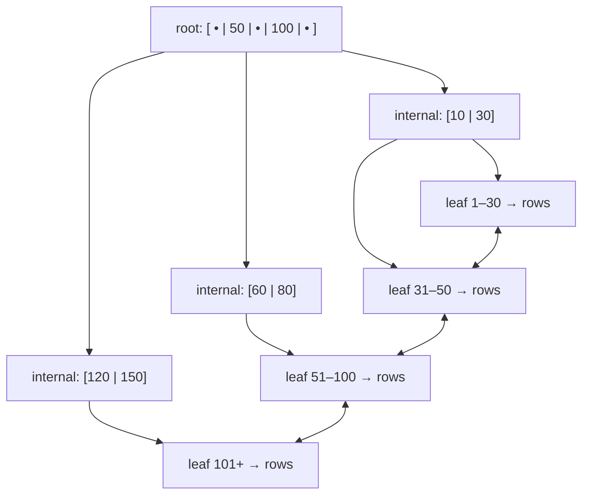

# SQL Indexing & Query Optimization

Indexes are the single biggest lever a backend engineer has over query latency, and
the query planner is the component that decides whether to use them. This page teaches
the *mechanism*: how a B-tree index is physically laid out, why the planner sometimes
ignores your index, how to read an `EXPLAIN` plan, and how to reason about join
algorithms and the write-cost of every index you add. Examples are ANSI SQL with
PostgreSQL and MySQL/InnoDB notes where behavior differs.

> [!KEY-TAKEAWAY]
> An index is a redundant, sorted copy of one or more columns plus a pointer back to
> the row. It trades write amplification and storage for read speed. The planner uses
> table statistics to *estimate* how many rows a predicate matches and picks the
> cheapest access path — so indexing is only half the job; the optimizer has to agree
> it is worth using.

## Why indexes exist and the write-cost trade-off

Without an index, finding rows that match `WHERE email = 'x'` requires a **full table
scan** (a "seq scan" in PostgreSQL): read every page of the table and test the
predicate. Cost is O(N) in rows. An index is an auxiliary data structure that lets the
engine jump to matching rows in roughly O(log N) page reads instead.

The trade-off is not free:

- **Storage:** each index is a separate on-disk structure, often 10–40% of the table
  size per index.
- **Write amplification:** every `INSERT`/`DELETE` and every `UPDATE` of an indexed
  column must also update *every* index on that column. A table with 6 indexes turns
  one row insert into **1 table/heap write + 6 index writes** — 7 structure
  modifications, each potentially triggering its own page split and WAL/redo record.
- **Planner/optimizer overhead:** more indexes means more candidate plans to cost.

Rules of thumb an interviewer wants to hear: index columns used in `WHERE`, `JOIN`,
`ORDER BY`, and `GROUP BY`; do not index low-selectivity columns (e.g. a boolean) on
their own; drop unused indexes on write-heavy tables. PostgreSQL exposes
`pg_stat_user_indexes.idx_scan` and MySQL `sys.schema_unused_indexes` to find indexes
that are never read but still paid for on every write.

> [!TIP]
> "Selectivity" = fraction of rows a predicate keeps. High selectivity (few rows, e.g.
> a unique email) is ideal for an index. Low selectivity (`status = 'active'` matching
> 90% of rows) makes the index useless — a scan is cheaper than random I/O per row.

## B-tree index mechanics

The default index type in essentially every relational database is a **B+tree** (often
just called "B-tree"). Key properties:

- It is **balanced**: every leaf is at the same depth, so *every* lookup costs the same
  number of page reads (the tree height, typically 3–4 levels even for hundreds of
  millions of rows because each internal node has a high fan-out — hundreds of keys per
  page). Balance is what guarantees O(log N) worst case; an unbalanced tree could
  degrade to a linked list.
- Internal nodes hold **separator keys + child pointers**; in a B+tree **all actual
  keys/values live in the leaves**, and the leaves are linked in a doubly-linked list.
- Because leaves are sorted and linked, a B-tree supports both **equality**
  (`= 'x'`) and **range** (`BETWEEN`, `<`, `>`, `>=`) lookups, plus `ORDER BY` on the
  indexed column *without a sort step*, and prefix `LIKE 'abc%'` matches.



A range scan descends to the first matching leaf, then walks the linked leaves
sideways. This is why a B-tree is great for `WHERE created_at BETWEEN a AND b` but a
**hash index cannot do ranges at all** (it only supports `=`).

**Worked example — why the height is only 3–4 (fan-out math).** Take an 8 KB page.
After per-key overhead you fit roughly **400 keys + child pointers** in one internal
node, so each level multiplies reachable rows by ~400:

- Level 1 (root): 400 separator keys
- Level 2: 400 × 400 = **160,000** rows
- Level 3: 400³ = **64,000,000** rows
- Level 4: 400⁴ = **25.6 billion** rows

So a **4-level B-tree indexes ~25 billion rows**, and *any* single-row lookup costs
exactly **4 page reads** — and the top 2–3 levels are almost always resident in the
buffer pool, so it is often just **1 real disk read** at the leaf. That is the whole
point of high fan-out: the cost is `O(log_fanout N)`, i.e. `log_400(N)`, not `log_2(N)`
— `log_400(64M) = 3`, whereas `log_2(64M) ≈ 26`. Doubling the row count barely moves the
height. That is also the honest answer to "how many disk reads to find one row in a
billion-row table?": **3–4, mostly served from cache.**

**Adjacent probe — B-tree vs LSM-tree.** Postgres and MySQL/InnoDB default to B-trees:
updates happen **in place**, which is read-optimized but pays **write amplification**
(rewrite a whole page + WAL record per change). LSM-trees (Cassandra, RocksDB, ScyllaDB)
instead **append** writes to sorted files and merge them later via **compaction** —
write-optimized, but reads may check several levels (**read amplification**, mitigated by
Bloom filters). Rule of thumb: B-tree for read-heavy/OLTP with range scans; LSM for
write-heavy ingestion. (Covered in depth in the storage-engines topic.)

> [!WARNING]
> A B-tree can only be scanned left-to-right on its key. `ORDER BY col DESC` still works
> (walk the leaf list backwards), but `LIKE '%abc'` (leading wildcard) cannot use the
> tree because the leading characters — the sort key — are unknown.

## Clustered vs non-clustered (secondary) indexes

A **clustered index** determines the physical order of the table rows on disk — the
table *is* the B-tree, with full rows stored in the leaf pages. There can be only one
clustered index per table (a table can only be physically sorted one way).

- **InnoDB (MySQL)** always clusters the table on the **primary key** (or a hidden
  6-byte rowid if none). Secondary indexes in InnoDB store the **primary-key value**
  as the row pointer, not a physical address. Consequence: a secondary-index lookup
  that needs columns not in the index does a **second lookup into the clustered index**
  ("bookmark lookup" / double lookup). It also means a large PK bloats every secondary
  index.
- **PostgreSQL is different: it has no clustered index.** All indexes are secondary and
  point to a physical tuple location (`ctid`) in a heap. The `CLUSTER` command
  physically reorders a table by an index *once*, but it is not maintained on
  subsequent writes.
- **Non-clustered / secondary index:** a separate structure whose leaves hold the
  indexed key + a pointer (row id / PK / ctid) to the actual row. Multiple allowed.

> [!INTERVIEW]
> A classic question: "In InnoDB, why can a monotonically increasing PK (auto-increment
> or a time-ordered ID) be better than a random UUID v4 PK?" Because the clustered index
> keeps rows in PK order — sequential inserts append to the rightmost leaf (few page
> splits, good locality), whereas random UUIDs scatter inserts across the whole B-tree,
> causing page splits, fragmentation, and cache misses. (UUID v7 / ULID, being
> time-ordered, largely fix this.)

A **page split** is what happens when an insert must go into a leaf page that is already
full: the engine allocates a new page and moves ~50% of the entries into it to make room,
costing extra I/O and a parent-node update, and leaving **two half-empty pages** (that is
the "fragmentation" — more pages to cache and scan for the same data). Monotonic PKs
almost never split because every insert lands at the right edge and just fills fresh pages
to ~100%; random UUIDs hit already-full interior pages constantly. `fillfactor` (Postgres)
/ `MERGE_THRESHOLD` (InnoDB) deliberately leaves leaf pages partly empty so later inserts
have slack and split less often.

## Composite indexes and the leftmost-prefix rule

A **composite (multi-column) index** on `(a, b, c)` sorts rows by `a`, then `b` within
equal `a`, then `c`. The **leftmost-prefix rule** governs what it can serve: it can be
used for predicates on a *prefix* of the key columns — `(a)`, `(a, b)`, or `(a, b, c)` —
but **not** for a query on `b` alone or `c` alone, because within the index those
columns are only sorted *inside* a fixed value of the preceding columns.

```sql
CREATE INDEX idx_ord ON orders (customer_id, status, created_at);

-- USES the index (leftmost prefix satisfied):
WHERE customer_id = 42
WHERE customer_id = 42 AND status = 'PAID'
WHERE customer_id = 42 AND status = 'PAID' AND created_at > '2026-01-01'

-- CANNOT use it efficiently (skips the leading column):
WHERE status = 'PAID'                      -- no customer_id predicate
WHERE created_at > '2026-01-01'            -- skips customer_id and status
```

Subtleties interviewers probe:

- A **range predicate on a column stops the index from using columns after it** for
  further seeking. In `(customer_id, status, created_at)`, a query
  `WHERE customer_id = 42 AND created_at > X AND status = 'PAID'` can seek on
  `customer_id` but the range on `created_at` means `status` after it is only usable as a
  filter, not a seek — so put equality columns before range columns. The good column
  order is generally: **equality predicates first, then one range column, then columns
  used only for ordering/output.**
- **Column order matters for `ORDER BY`:** `(a, b)` can satisfy `ORDER BY a, b` with no
  sort, and even `ORDER BY a` — but not `ORDER BY b`.
- MySQL 8.0+ has **index skip scan** and PostgreSQL has limited ability to use a
  non-leftmost column via a scan, but never rely on it — design the key order for your
  access pattern.

## Covering indexes and index-only scans

A **covering index** is one that contains *all* the columns a query needs (both the
filter columns and the selected columns), so the engine answers the query **entirely
from the index without touching the table** — an **index-only scan** (PostgreSQL) /
"Using index" (MySQL `EXPLAIN` Extra column). This avoids the random I/O of fetching
each heap row.

```sql
-- Query: SELECT status, total FROM orders WHERE customer_id = 42;
-- This index COVERS it: (customer_id) filter + (status, total) output both present.
CREATE INDEX idx_cover ON orders (customer_id, status, total);           -- MySQL/standard
CREATE INDEX idx_cover ON orders (customer_id) INCLUDE (status, total);  -- Postgres/SQL Server
```

The `INCLUDE` clause (PostgreSQL 11+, SQL Server) stores extra **payload columns only in
the leaf level**, not as part of the sort key — cheaper than adding them to the key when
you never filter/sort on them.

**Worked example — counting the I/Os the covering index saves.** Say
`WHERE customer_id = 42` matches **5 rows**, and the index is a 3-level B-tree.

- *Non-covering secondary index* (`SELECT status, total ...` but the index only has
  `customer_id`): descend the index to the leaf = **~3 reads** (top levels cached, so
  ~1 real), find 5 PK/`ctid` pointers, then do **5 bookmark lookups** — one random
  fetch per row into the heap (Postgres) or the clustered index (InnoDB). Total ≈
  **1 index descent + 5 random row fetches ≈ 6 page accesses**, and those 5 are random
  I/O scattered across the table.
- *Covering / index-only version* (`INCLUDE (status, total)`): the leaf already holds
  `status` and `total`, so after the descent the engine reads the 5 entries straight off
  one or two adjacent leaf pages and **stops — zero heap fetches**. Total ≈ **1–2 page
  accesses.**

That is 6 accesses (5 of them random) collapsing to ~1–2 sequential ones. Now scale the
match to **1,000 rows**: non-covering pays ~1,000 random heap fetches; covering walks a
handful of linked leaf pages. This is exactly why `INCLUDE` earns its keep on hot
read paths — and why InnoDB's mandatory PK "double lookup" for non-covered secondary
indexes is a real cost, not a footnote.

> [!WARNING]
> PostgreSQL's index-only scan still needs the row's **visibility** to be confirmed via
> the **visibility map**. If the page is not marked all-visible (recently updated, not
> yet vacuumed), Postgres must do a heap fetch anyway — `EXPLAIN ANALYZE` shows
> `Heap Fetches: N`. Keeping `VACUUM` current is what makes index-only scans actually
> stay index-only.

## When an index is not used

A frequent interview and debugging scenario: "the index exists but `EXPLAIN` shows a
seq scan — why?" Common causes:

1. **A function or expression wraps the column.** `WHERE LOWER(email) = 'x'` or
   `WHERE date(created_at) = '2026-01-01'` cannot use a plain index on the raw column —
   the index stores `email`, not `LOWER(email)`. Fix: an **expression index** (below) or
   rewrite as a sargable range (`created_at >= '2026-01-01' AND created_at < '2026-01-02'`).
2. **Leading wildcard `LIKE '%abc'`** — the sort prefix is unknown, so no B-tree seek.
   `LIKE 'abc%'` is fine.
3. **Implicit type cast / collation mismatch.** `WHERE varchar_col = 123` or comparing a
   `utf8` column to a differently-collated literal forces a per-row conversion that
   defeats the index. Match the literal's type to the column.
4. **Low selectivity.** If the predicate matches a large fraction of rows, the planner
   correctly decides a seq scan is *cheaper* than millions of random index lookups +
   heap fetches. This is the planner being *right*, not broken.

   **Worked example — where the tipping point actually is.** Table = **1,000,000 rows**
   packed into **10,000 heap pages** (100 rows/page). A `Seq Scan` reads all 10,000 pages
   **sequentially** — cheap per page. Now compare an `Index Scan` for two predicates,
   costing each roughly as "one random page fetch per matching row" (worst case, no two
   matches on the same page):

   - Predicate matches **1%** (10,000 rows): Index Scan ≈ **10,000 random fetches** vs
     Seq Scan = 10,000 sequential reads. Random I/O is several× more expensive per page,
     so the **index still wins** here because it also skips reading the other 99% of pages.
   - Predicate matches **10%** (100,000 rows): Index Scan ≈ **100,000 random fetches** vs
     Seq Scan = still only **10,000 sequential reads**. Now the index does **10× more page
     work, all of it random** — the **Seq Scan wins.**

   So the crossover sits somewhere in the low-single-digit-to-~20% range (Postgres's
   default `random_page_cost = 4` vs `seq_page_cost = 1` puts it near ~5–10%). Between the
   two — "medium selectivity" — Postgres reaches for a **Bitmap Heap Scan**: collect all
   matching tuple locations, sort them, then read each heap page **once in physical order**,
   turning that random I/O back into sequential. That is why the middle of the range has
   its own access path rather than a hard either/or.
5. **Stale statistics** make the planner mis-estimate row counts (run `ANALYZE`).
6. **`OR` across different columns, `!=`/`<>`, or `NOT IN`** often can't use one index
   (though Postgres may combine per-branch indexes via a `BitmapOr`).
7. **Leftmost-prefix violation** (querying a non-leading composite column).

Causes 1, 2, 3, and 6 above are all one underlying defect — a predicate the engine cannot
use as a search key. The next section names that property (**sargability**), states the
mechanical rule once, and catalogs the rewrites in a single table (including the
`EXTRACT(YEAR …)` → half-open-range case). Read "when an index is not used" as the
symptom checklist and "SARGable predicates" as its root cause and cure, not as two
separate lists.

> [!TIP]
> "Sargable" (Search ARGument ABLE) = a predicate the engine can satisfy by seeking an
> index. Keep the indexed column **bare on one side** of the comparison and let the
> constant carry any arithmetic.

## SARGable predicates

**SARGable** — short for **S**earch **ARG**ument **able** — is the property of a `WHERE`
(or `JOIN` / `HAVING`) predicate that lets the engine use it as a *search argument* to
**seek a B-tree index** instead of evaluating it row-by-row over a scan. It is the single
most useful lens for the "why is my index not used?" cases above: every non-use cause in
that list is, at bottom, a predicate that has been made **non-sargable**.

The mechanical rule is simple: **the indexed column must appear bare on one side of the
operator, compared against a value the engine can compute independently of the row.** The
index is sorted by the stored column values, so the engine can only binary-search it if
the thing it is searching for is a plain column value (or a known prefix/range of them).
Wrap the column in a function, cast, or arithmetic and the engine no longer has a value it
can locate in the sorted structure — it must compute the expression for *every* row, which
is a scan.

Sargable operators (B-tree): `=`, `<`, `<=`, `>`, `>=`, `BETWEEN`, `IN (list)`, `IS NULL`
(most engines), and prefix `LIKE 'abc%'`. Predicates that are inherently non-sargable or
often prevent a seek: `<>` / `!=`, `NOT IN`, `NOT LIKE`, leading-wildcard `LIKE '%abc'`,
and `OR` spanning different columns.

### Non-sargable → sargable rewrites

| Non-sargable (index unused) | Sargable rewrite (index seek) | Why |
|---|---|---|
| `WHERE YEAR(created_at) = 2026` | `WHERE created_at >= '2026-01-01' AND created_at < '2027-01-01'` | Column left bare; a half-open range seeks the B-tree. Works for month/day too. |
| `WHERE created_at::date = '2026-07-20'` | `WHERE created_at >= '2026-07-20' AND created_at < '2026-07-21'` | Casting the column defeats an index on the raw `timestamptz`. |
| `WHERE LOWER(email) = 'a@b.com'` | Keep the predicate but add an **expression index** on `LOWER(email)` (or store a normalized column) | Can't strip the function if you need case-insensitivity — index the expression instead. |
| `WHERE price * 1.2 > 100` | `WHERE price > 100 / 1.2` | Move arithmetic to the **constant** side; the column stays bare. |
| `WHERE substr(sku, 1, 3) = 'ABC'` | `WHERE sku LIKE 'ABC%'` | Prefix `LIKE` is a range seek; `substr()` is a per-row function. |
| `WHERE phone = 5551234` (phone is `VARCHAR`) | `WHERE phone = '5551234'` | An implicit cast can coerce the *column* per row; match the literal's type. |
| `WHERE name LIKE '%smith'` | `WHERE name LIKE 'smith%'`, or index a **reversed** expression / use a trigram (`pg_trgm` GIN) index | A leading wildcard has no known prefix to seek; reverse the string or use a specialized index. |
| `WHERE deleted_at IS NOT NULL OR archived = true` | Split into a `UNION` of two sargable branches, or use per-column indexes the planner can combine (Postgres `BitmapOr`) | `OR` across columns can't be served by one composite seek. |
| `WHERE COALESCE(status,'NEW') = 'NEW'` | `WHERE status = 'NEW' OR status IS NULL` (or store a non-null default) | `COALESCE`/`ISNULL` around the column is a function wrapping it. |

> [!WARNING]
> Sargable is necessary but **not sufficient** for an index seek. A perfectly sargable
> predicate on a **low-selectivity** column (e.g. `status = 'active'` matching 90% of rows)
> will still — correctly — get a sequential scan, because the planner costs the scan as
> cheaper than millions of random index lookups. Sargability lets the index be *considered*;
> selectivity and statistics decide whether it's *chosen*.

**Vendor notes.** PostgreSQL and MySQL/InnoDB apply the same core rule, but their fix for
"I must keep the function" differs: PostgreSQL and MySQL 8.0.13+ let you index the
expression directly (expression index / functional key part), whereas older MySQL needs a
**generated (virtual) column** that you then index. SQL Server documentation is where the
term "SARGable" originated. Also note MySQL will happily do an implicit type coercion that
silently drops to a full scan, so type-match your literals.

## Reading EXPLAIN and EXPLAIN ANALYZE

`EXPLAIN` shows the planner's **chosen plan and cost estimates**; `EXPLAIN ANALYZE`
*actually runs* the query and reports **real timings and row counts** (in PostgreSQL;
MySQL 8.0.18+ has `EXPLAIN ANALYZE` too). The most important diagnostic is comparing
**estimated vs actual rows** — a large divergence means bad statistics and likely a bad
plan.

Key PostgreSQL access-path nodes:

| Node | Meaning | When chosen |
|---|---|---|
| `Seq Scan` | Read every heap page | No usable index, or low selectivity / small table |
| `Index Scan` | Walk B-tree, fetch each heap row | High selectivity, few matching rows |
| `Index Only Scan` | Answer from index alone | Covering index + page all-visible |
| `Bitmap Index Scan` + `Bitmap Heap Scan` | Build a bitmap of matching pages, then read them in physical order | Medium selectivity; combines multiple indexes; avoids random per-row I/O |

```text
EXPLAIN ANALYZE SELECT * FROM orders WHERE customer_id = 42;

Index Scan using idx_ord on orders  (cost=0.43..8.45 rows=5 width=64)
                                     (actual time=0.02..0.04 rows=5 loops=1)
  Index Cond: (customer_id = 42)
Planning Time: 0.1 ms
Execution Time: 0.06 ms
```

How to read it: `cost=startup..total` in arbitrary planner units; `rows` = estimate;
`actual ... rows=... loops=...` = measured. `Index Cond` is what was pushed into the
index seek; a `Filter:` line means rows were fetched then discarded (a possible
missing-index or wrong-column-order hint). MySQL's classic `EXPLAIN` reports `type`
(`const` > `eq_ref` > `ref` > `range` > `index` > `ALL`, best to worst), `key` (index
used), `rows` (estimate), and `Extra` (`Using index` = covering, `Using filesort`,
`Using temporary`).

> [!INTERVIEW]
> A `Bitmap Heap Scan` is not a sign of a problem — it is the planner's answer to
> "medium selectivity": too many rows for cheap random `Index Scan` I/O, too few to read
> the whole table. It collects matching tuple locations into a bitmap and reads heap
> pages in **physical order**, turning random I/O into sequential I/O.

## Query planner, statistics and cardinality estimation

The **cost-based optimizer** enumerates candidate plans (access paths × join orders ×
join algorithms) and picks the one with the lowest estimated cost. Cost is a function of
estimated **cardinality** (row counts) and per-operation costs (sequential page read,
random page read, CPU per row/tuple). Getting cardinality right is the whole game.

The planner estimates cardinality from **statistics** gathered by `ANALYZE`
(PostgreSQL — also run automatically by autovacuum) or `ANALYZE TABLE` (MySQL), stored
in `pg_statistic` / surfaced via `pg_stats`:

- **`n_distinct`** — number of distinct values (drives selectivity of `=`).
- **Most Common Values (MCVs)** + their frequencies — handles skew.
- A **histogram** of value distribution — drives range-predicate selectivity.
- **Correlation** — how physically ordered the column is (affects index-scan cost).

Failure modes to name:

- **Stale statistics** after a bulk load → wildly wrong estimates → bad plan. Fix:
  `ANALYZE`.
- **Correlated predicates:** the planner assumes `WHERE city = 'X' AND country = 'Y'`
  are independent and multiplies selectivities, badly underestimating when the columns
  are correlated (a city implies its country). PostgreSQL fix: **extended statistics**
  `CREATE STATISTICS ... (dependencies, ndistinct) ON city, country FROM t`.
- **Parameter sniffing / generic plans:** with prepared statements the cached plan may
  suit the first parameter but not later ones with different selectivity.

> [!TIP]
> Optimizer hints exist (MySQL `USE INDEX`/`FORCE INDEX`, Oracle `/*+ ... */`, the
> `pg_hint_plan` extension) but are a last resort — they mask the real cause (usually
> stale or missing statistics) and rot as data changes. Fix the estimate, not the plan.

## Join algorithms: nested loop, hash, merge

The planner chooses among three physical join algorithms; knowing when each wins is a
staple question.

| Algorithm | How it works | Best when | Cost |
|---|---|---|---|
| **Nested loop** | For each row of the outer, probe the inner (ideally via an index) | Outer side is small **and** inner has an index on the join key | O(outer × inner) without an index; O(outer × log inner) with one |
| **Hash join** | Build a hash table on the smaller ("build") input, then probe it with the larger ("probe") input | Large, unsorted inputs; **equi-joins only** (`=`) | O(N+M); needs memory (`work_mem`) or spills to disk |
| **Merge join** | Sort both inputs on the join key, then walk them in lockstep | Both inputs already sorted (e.g. by an index) or sortable; supports range/`<` joins | O(N log N + M log M), or O(N+M) if pre-sorted |

**Worked example — the same join, three ways.** Join a **10,000-row** outer table to a
**1,000,000-row** inner table on `inner.k = outer.k`:

- **Nested loop, no inner index:** for each of the 10,000 outer rows, scan all 1,000,000
  inner rows → 10,000 × 1,000,000 = **10,000,000,000 (10¹⁰) row comparisons.** This is the
  accidental O(N×M) disaster.
- **Nested loop, inner index on `k`:** each outer row does an index seek ≈ `log₂(1,000,000)
  ≈ 20` probes → 10,000 × 20 = **~200,000 probes.** A 50,000× cut — this is why the planner
  loves nested loop *when the inner side is indexed and the outer side is small*.
- **Hash join:** build a hash table on the smaller (10,000-row) input, then scan the
  1,000,000-row input probing it → ~10,000 build + ~1,000,000 probe = **~1,010,000 ops**,
  no index required.

Note the flip: with the inner index, nested loop (~200K) **beats** hash join (~1.01M);
strip the index and nested loop explodes to 10¹⁰ while hash join is unchanged at ~1.01M.
That is exactly the trade the planner re-evaluates from cardinality estimates — and why a
*wrong* estimate that hides the missing index can drop it into the 10¹⁰ path.

Key points:

- A **nested loop with no inner index** on a big table is the classic accidental
  O(N×M) disaster; the planner usually avoids it, but a bad cardinality estimate can
  trick it into one — a top real-world cause of a query "suddenly" going slow.
- **Hash join handles only equi-joins.** A `t1.a < t2.b` join must use nested loop or
  merge.
- MySQL had **only nested-loop joins** until 8.0.18, which added **hash join** — a
  frequently-tested fact. Before that, joining two large unindexed tables in MySQL was
  brutal.
- A hash join that underestimates the build side and exceeds `work_mem` **spills to
  disk** (batched), degrading performance — visible as `Batches: >1` in Postgres
  `EXPLAIN ANALYZE`.

## Partial and expression indexes

**Partial index** — an index built over only the rows matching a `WHERE` predicate.
Smaller, cheaper to maintain, and only usable when the query's predicate is implied by
the index predicate.

```sql
-- Only index the rows you actually query (e.g. the tiny "unprocessed" queue):
CREATE INDEX idx_unprocessed ON jobs (created_at) WHERE status = 'PENDING';
-- Enforce a partial uniqueness constraint (one active row per user):
CREATE UNIQUE INDEX one_active ON subscriptions (user_id) WHERE active;
```

PostgreSQL and SQLite support partial indexes directly; SQL Server calls them
**filtered indexes**; MySQL/InnoDB has **no partial-index support** (a common gotcha).

**Expression (functional) index** — an index on the *result of an expression*, which
makes an otherwise non-sargable predicate sargable:

```sql
-- Enables case-insensitive lookups to use an index:
CREATE INDEX idx_lower_email ON users (LOWER(email));
-- Now this uses the index:
WHERE LOWER(email) = 'a@b.com';
```

The query's expression must match the index's expression exactly. MySQL 8.0.13+ supports
**functional key parts** (`(CAST(...))`, expressions in parentheses); older MySQL needs a
**generated/virtual column** that you then index.

## Index types beyond B-tree: hash, GiST, GIN, BRIN

B-tree is the default, but specialized types matter for the right workload (PostgreSQL
names shown; other engines have analogues):

| Type | Structure | Supports | Use case |
|---|---|---|---|
| **B-tree** | Balanced sorted tree | `=`, ranges, `ORDER BY`, prefix `LIKE` | The default; almost everything |
| **Hash** | Hash table | `=` **only** (no ranges, no ordering) | Pure equality on large keys; rarely worth it over B-tree |
| **GIN** | Generalized Inverted iNdex (posting lists per element) | Multi-value / containment: JSONB `@>`, arrays, full-text `tsvector` | "Which docs contain this token", JSONB key lookups |
| **GiST** | Generalized Search Tree (balanced, extensible) | Geometric / spatial (PostGIS), range types, nearest-neighbor (`<->`), overlap | Geospatial, ranges, KNN |
| **BRIN** | Block Range INdex: min/max summary per block range | Ranges on **naturally-ordered** huge tables | Append-only time-series; tiny index, only helps if physical order correlates with the column |

Interview-worthy contrasts:

- A **hash index** gives O(1) equality but **cannot do ranges or `ORDER BY`** and (in
  older Postgres) wasn't crash-safe/WAL-logged before v10 — so B-tree is usually
  preferred even for equality, since it also serves ranges. MySQL's InnoDB has no
  user-facing hash indexes but maintains an automatic **adaptive hash index** internally;
  the `MEMORY` engine supports explicit hash indexes.
- **GIN vs GiST:** GIN is faster to *read* and better for static data with many distinct
  keys; GiST is faster to *build/update* and supports nearest-neighbor. For JSONB/full
  text, reach for GIN.
- **BRIN** is astonishingly small (kilobytes for a huge table) but only useful when the
  indexed column correlates with physical row order (e.g. an append-only `created_at`).
  On unordered data it degrades to a near-full scan.

## The N+1 query problem

The **N+1 problem**: fetching a list of N parent rows with one query, then issuing one
additional query *per parent* to load its children — 1 + N round trips. It is the most
common ORM-induced performance bug and a frequent interview topic even though it is
usually caused above the database.

```text
SELECT * FROM authors;                       -- 1 query → N authors
-- then, per author (lazy loading):
SELECT * FROM books WHERE author_id = ?;     -- N queries
```

Each query pays network round-trip + parse + plan overhead; at N=500 this is 501 round
trips where 1–2 would do. Fixes:

- **JOIN / eager fetch:** `SELECT ... FROM authors a JOIN books b ON b.author_id = a.id`
  in one query.
- **Batch with `IN`:** collect the parent ids and issue
  `SELECT * FROM books WHERE author_id IN (?, ?, ...)` — 2 queries total.
- In ORMs: eager/`JOIN FETCH` (Hibernate), `selectinload`/`joinedload` (SQLAlchemy),
  `.includes`/`preload` (Rails), DataLoader batching (GraphQL).

> [!WARNING]
> The N+1 problem is invisible in application logs unless you count queries — it looks
> fine with 3 test rows and collapses at production scale. Detect it with query counters
> / an ORM statement log / APM traces, not by staring at one slow query.

## Common follow-up questions

- "You added an index and the query is still slow — walk me through debugging it."
  Run `EXPLAIN ANALYZE`; check estimated vs actual rows (stale stats → `ANALYZE`); check
  whether the predicate is sargable (function on column? implicit cast? leading
  wildcard?); check leftmost-prefix for composite indexes; check selectivity (maybe a
  scan really is cheaper); check for a `Filter:` line indicating wrong column order.
- "Why not just index every column?" Write amplification, storage, planner overhead,
  and diminishing returns — each index slows every write and most are never used.
- "Composite `(a,b)` vs two single-column indexes on `a` and `b`?" The composite
  serves `a` and `(a,b)` with a single seek and can cover/sort; two singles let Postgres
  do a `BitmapAnd` but each alone is less selective. Prefer a composite tuned to the
  query, ordered equality-then-range.
- "Default isolation level, Postgres vs MySQL?" PostgreSQL is READ COMMITTED;
  MySQL/InnoDB is REPEATABLE READ. (Deep-dived in the transactions topic.)
- "When does an index-only scan still hit the heap in Postgres?" When the page is
  not all-visible in the visibility map (recent writes, not yet vacuumed).
- "How does the planner know how many rows match?" From `ANALYZE` statistics:
  n_distinct, MCV list, histogram, and correlation.

## References

- PostgreSQL Documentation — "Indexes" (Ch. 11), "Index Types", "Using EXPLAIN", "How
  the Planner Uses Statistics", "Row Estimation Examples", "Index-Only Scans and Covering
  Indexes". https://www.postgresql.org/docs/current/
- MySQL 8.0 Reference Manual — "Optimization and Indexes", "How MySQL Uses Indexes",
  "Comparison of B-Tree and Hash Indexes", "EXPLAIN Output Format", "Nested-Loop /
  Hash Join Algorithms", "Multiple-Column Indexes". https://dev.mysql.com/doc/
- Markus Winand, *SQL Performance Explained* / Use The Index, Luke!
  https://use-the-index-luke.com/ — leftmost prefix, covering indexes, sargability.
- Douglas Comer, "The Ubiquitous B-Tree", *ACM Computing Surveys*, 1979.
- Martin Kleppmann, *Designing Data-Intensive Applications*, Ch. 3 (Storage and
  Retrieval: B-trees, LSM-trees).
- ISO/IEC 9075 (SQL standard) — query and predicate semantics.
