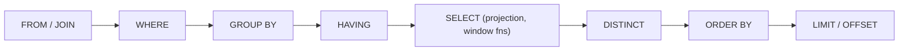
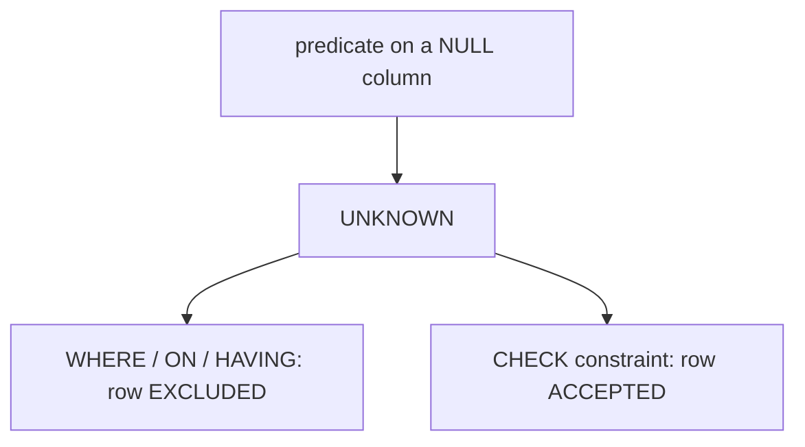

# SQL Query Language & Advanced Queries

SQL (Structured Query Language, standardized as **ISO/IEC 9075**) is a *declarative*
language: you describe the result set you want, and the query planner decides *how* to
compute it. This topic is about **query semantics** — what a query is *guaranteed* to
return and why — not about capacity planning or datastore selection (that lives in
system-design) and not about an ORM's mapping layer (that is its own domain). Here we work
with real ANSI SQL, noting where PostgreSQL, MySQL/InnoDB, SQL Server, and Oracle diverge.

> [!KEY-TAKEAWAY]
> The single most important mental model is the **logical processing order** of a
> `SELECT`. Almost every "why can't I reference this alias / why does my WHERE reject the
> aggregate / why does the LEFT JOIN behave like an INNER JOIN" question falls out of it.
> SQL is also built on **three-valued logic** (TRUE/FALSE/UNKNOWN) — NULL handling is the
> second-biggest source of interview traps.

---

## Logical query processing order

SQL is declarative, so the *written* order of clauses is **not** the order they are
logically evaluated. The standard defines a logical processing order; the optimizer may
physically reorder anything as long as the result is identical.



1. **FROM / JOIN** — build the working set of rows from the base tables (Cartesian product
   + join predicates).
2. **WHERE** — filter individual rows. Cannot see aggregates or `SELECT`-list aliases.
3. **GROUP BY** — collapse rows into groups.
4. **HAVING** — filter *groups* (can reference aggregates).
5. **SELECT** — evaluate the projection list, including **window functions** and column
   aliases.
6. **DISTINCT** — remove duplicate rows.
7. **ORDER BY** — sort the final result. This is the *one* place a `SELECT`-list alias is
   usually visible (because it runs after SELECT).
8. **LIMIT / OFFSET** (a.k.a. `FETCH FIRST n ROWS` in the standard) — slice the sorted set.

**Consequences interviewers probe:**

- You **cannot** use a column alias defined in `SELECT` inside `WHERE`, `GROUP BY`, or
  `HAVING` in standard SQL, because those clauses run *before* `SELECT`. (MySQL and
  PostgreSQL allow aliases in `GROUP BY`/`HAVING` as a non-standard extension; `ORDER BY`
  can use aliases everywhere because it runs last.)
- You **cannot** filter on an aggregate in `WHERE` (`WHERE COUNT(*) > 5` is an error) — use
  `HAVING`.
- Because `WHERE` runs before `GROUP BY`, filtering with `WHERE` is cheaper than `HAVING`
  when the predicate is on a raw column (fewer rows to aggregate).
- `LIMIT` without `ORDER BY` returns an **arbitrary** (non-deterministic) subset — the
  engine may return rows in any order and it can change between runs.
- **`OFFSET` does not skip work — it scans and discards.** `... ORDER BY id LIMIT 20 OFFSET
  10000` still reads and throws away the first 10,000 rows before emitting 20, so deep
  pagination degrades **linearly** (page 500 is ~500× slower than page 1). The scalable fix is
  **keyset / seek pagination**: remember the last row's sort key and filter past it —
  `WHERE (created_at, id) < (:last_ts, :last_id) ORDER BY created_at DESC, id DESC LIMIT 20`
  — which an index on `(created_at, id)` turns into an O(log n) seek regardless of page depth
  (the trade-off: you can only page forward/back, not jump to an arbitrary page number).

> [!WARNING]
> `SELECT` running late is why `SELECT price * 1.1 AS gross ... WHERE gross > 100` fails.
> Repeat the expression in `WHERE`, wrap the query in a subquery/CTE, or (PostgreSQL) use a
> `LATERAL`/derived column.

---

## JOIN types and result semantics

A join combines rows from two tables on a predicate. Start from the conceptual **Cartesian
product** (`CROSS JOIN`) and then filter/augment.

| Join | Keeps | Unmatched side becomes |
|---|---|---|
| `INNER JOIN` | only rows matching the predicate | dropped |
| `LEFT [OUTER] JOIN` | all left rows | right columns = NULL |
| `RIGHT [OUTER] JOIN` | all right rows | left columns = NULL |
| `FULL [OUTER] JOIN` | all rows from both | missing side = NULL |
| `CROSS JOIN` | every left × right combination | n/a (no predicate) |
| self join | table joined to itself (aliased) | depends on join type |

**Example — orders and (possibly missing) customers:**

```sql
SELECT c.name, o.id
FROM customers c
LEFT JOIN orders o ON o.customer_id = c.id;   -- customers with no orders show o.id = NULL
```

**The classic gotcha: predicate placement in an outer join.** With a `LEFT JOIN`, a
condition in the `ON` clause filters *which right rows match*; the same condition in
`WHERE` filters the *result after the join* — and because it rejects the NULL-extended
rows, it silently turns the outer join into an inner join.

```sql
-- Keeps all customers; only "paid" orders are joined, others show NULL:
... LEFT JOIN orders o ON o.customer_id = c.id AND o.status = 'paid';

-- Drops customers with no paid order (o.status is NULL -> UNKNOWN -> excluded):
... LEFT JOIN orders o ON o.customer_id = c.id WHERE o.status = 'paid';
```

**NULL and equality in joins.** Join predicates use normal comparison, so `NULL = NULL`
is UNKNOWN — rows with NULL join keys never match. Anti-joins (`NOT EXISTS`, `LEFT JOIN
... WHERE right.key IS NULL`) are the correct way to find "rows with no match."

- `USING (col)` joins on equally-named columns and collapses them to one output column;
  `NATURAL JOIN` joins on *all* equally-named columns implicitly — avoid `NATURAL JOIN` in
  production because adding a column later silently changes the join.
- **Self join** example: employees to their managers —
  `FROM emp e JOIN emp m ON e.manager_id = m.id`.
- **Full outer join** has no dedicated keyword in MySQL (any version, including 8.0/8.4);
  it is emulated with `LEFT JOIN ... UNION ... RIGHT JOIN`.

---

## Aggregation with GROUP BY and HAVING

Aggregate functions (`COUNT`, `SUM`, `AVG`, `MIN`, `MAX`) collapse many rows into one
value. `GROUP BY` partitions rows into groups and produces one output row per group.

```sql
SELECT customer_id, COUNT(*) AS orders, SUM(amount) AS total
FROM orders
WHERE status = 'paid'          -- filters rows BEFORE grouping
GROUP BY customer_id
HAVING SUM(amount) > 1000      -- filters groups AFTER aggregation
ORDER BY total DESC;
```

**WHERE vs HAVING** — the most-asked distinction:

| | `WHERE` | `HAVING` |
|---|---|---|
| Runs | before `GROUP BY` | after aggregation |
| Operates on | individual rows | groups |
| Can reference aggregates | no | yes |
| Perf | filters early (cheaper) | filters late |

**Counting nuances:**

- `COUNT(*)` counts rows (including NULLs). `COUNT(col)` counts **non-NULL** values of
  `col`. `COUNT(DISTINCT col)` counts distinct non-NULL values.
- All aggregates *except* `COUNT(*)` **ignore NULLs**. `AVG(col)` divides by the count of
  non-NULL values, not the row count — a frequent source of "wrong average" bugs.
- Aggregating an empty set: `COUNT(*)` → 0, but `SUM`/`AVG`/`MAX`/`MIN` → **NULL** (not 0).

**The single-value rule / `ONLY_FULL_GROUP_BY`.** Every column in `SELECT` that is not
inside an aggregate must appear in `GROUP BY` (standard SQL). MySQL historically allowed
"bare" columns and returned an arbitrary value from the group — a data-integrity footgun.
Modern MySQL (5.7.5+) enables `ONLY_FULL_GROUP_BY` by default, matching the standard.
PostgreSQL relaxes this only when the non-grouped columns are functionally dependent on the
primary key in `GROUP BY`.

- `GROUPING SETS`, `ROLLUP`, and `CUBE` produce multiple grouping levels (subtotals /
  grand totals) in one pass.
- `FILTER (WHERE ...)` (SQL standard, PostgreSQL) gives per-aggregate conditional counts:
  `COUNT(*) FILTER (WHERE status='paid')` — cleaner than `SUM(CASE WHEN ... THEN 1 END)`.

---

## Subqueries scalar correlated and EXISTS vs IN

A subquery is a query nested inside another. Key kinds:

- **Scalar subquery** — returns exactly one row, one column; usable anywhere a value is
  expected. Returns NULL if it produces zero rows; **errors** if it returns >1 row.
- **Row / table subquery** — used in `FROM` (a "derived table", must be aliased) or with
  `IN`/`EXISTS`.
- **Correlated subquery** — references a column from the outer query, so it is
  (conceptually) re-evaluated per outer row.

```sql
-- Correlated: customers who have at least one paid order
SELECT c.name
FROM customers c
WHERE EXISTS (SELECT 1 FROM orders o
              WHERE o.customer_id = c.id AND o.status = 'paid');
```

**`EXISTS` vs `IN` vs `JOIN` — the interview centerpiece:**

- **`EXISTS`** stops at the first matching row (short-circuits) and is NULL-safe. Best when
  you only need existence, not the values.
- **`IN (subquery)`** compares against a list. **The NULL trap:** `NOT IN` with a subquery
  that yields *any* NULL returns no rows, because `x NOT IN (1, NULL)` evaluates to
  `x<>1 AND x<>NULL` → UNKNOWN → the row is excluded. **Prefer `NOT EXISTS`** for anti-joins.
- **`JOIN`** can multiply rows if the join key is non-unique (one outer row matching many
  inner rows), whereas `EXISTS`/`IN` return each outer row at most once. Use a semi-join
  (`EXISTS`) when you must not duplicate.
- Modern optimizers often rewrite `IN`/`EXISTS`/`JOIN` into the same **semi-join** plan, so
  they can be equally fast — but the **NULL semantics differ**, and that is what an
  interviewer is testing.

```sql
-- DANGEROUS: returns 0 rows if any order has a NULL customer_id
SELECT * FROM customers WHERE id NOT IN (SELECT customer_id FROM orders);
-- SAFE:
SELECT * FROM customers c
WHERE NOT EXISTS (SELECT 1 FROM orders o WHERE o.customer_id = c.id);
```

**Worked example — the NULL swallows the whole result.** `customers.id = {1, 2, 3}`;
`orders.customer_id = {1, NULL}` (one order placed by customer 1, one order with an unknown
customer). You want "customers who have never ordered" — intuitively `{2, 3}`.

- `NOT IN` expands, for each customer, to `id <> 1 AND id <> NULL`:
  - id=1 → `1<>1` = FALSE → excluded (correct).
  - id=2 → `2<>1` (TRUE) `AND 2<>NULL` (**UNKNOWN**) → `TRUE AND UNKNOWN` = **UNKNOWN** → row not kept.
  - id=3 → `3<>1` (TRUE) `AND 3<>NULL` (**UNKNOWN**) → **UNKNOWN** → row not kept.
  - Result: **0 rows** — not `{2,3}`. The single NULL made every "not-matched" row UNKNOWN.
- `NOT EXISTS` instead asks "is there any order row with `o.customer_id = c.id`?" For id=2
  and id=3 no such row exists (the NULL order's `customer_id = 2` is itself UNKNOWN, i.e. not
  a match), so `NOT EXISTS` is TRUE → correctly returns **{2, 3}**.

---

## Window functions

A window (analytic) function computes a value **across a set of rows related to the current
row** *without collapsing them* — unlike `GROUP BY`, every input row is preserved. Added in
SQL:2003; supported by PostgreSQL, SQL Server, Oracle, and MySQL 8.0+.

```sql
SELECT
  employee_id, department_id, salary,
  ROW_NUMBER() OVER (PARTITION BY department_id ORDER BY salary DESC) AS rn,
  RANK()       OVER (PARTITION BY department_id ORDER BY salary DESC) AS rnk,
  DENSE_RANK() OVER (PARTITION BY department_id ORDER BY salary DESC) AS dense,
  LAG(salary)  OVER (PARTITION BY department_id ORDER BY salary DESC) AS prev_salary,
  AVG(salary)  OVER (PARTITION BY department_id) AS dept_avg
FROM employees;
```

**Ranking functions — the ties question:**

| Function | On ties | After a tie |
|---|---|---|
| `ROW_NUMBER()` | unique numbers (arbitrary tie-break) | continuous 1,2,3,4 |
| `RANK()` | same rank | **gaps** (1,1,3) |
| `DENSE_RANK()` | same rank | **no gaps** (1,1,2) |

**Worked example — one department, salaries `100, 100, 90, 90, 80`** ordered `salary DESC`.
Watch the three columns diverge only at the ties:

| salary | `ROW_NUMBER` | `RANK` | `DENSE_RANK` |
|---|---|---|---|
| 100 | 1 | 1 | 1 |
| 100 | 2 | 1 | 1 |
| 90  | 3 | **3** | **2** |
| 90  | 4 | 3 | 2 |
| 80  | 5 | **5** | **3** |

Reading it: `ROW_NUMBER` never repeats (the two 100s get 1 and 2, tie broken arbitrarily).
`RANK` gives both 100s rank 1, then *skips to 3* for the next value — it "leaves gaps" equal
to the number of tied rows (two 1s consumed positions 1 and 2, so the next rank is 3, and
after the two 3s it jumps to 5). `DENSE_RANK` gives the same 1,1 but then continues 2,2,3 —
no gaps, so it counts *distinct* salary levels. If a query asks for "the 3rd-highest distinct
salary," you want `DENSE_RANK = 3` (returns 80), not `RANK = 3` (returns 90).

**`PARTITION BY` vs `GROUP BY`:** `PARTITION BY` divides rows into windows but keeps every
row; `GROUP BY` returns one row per group. You can have a window that resets per partition
and still see individual rows.

**`LAG(col, n, default)` / `LEAD`** access previous/next rows within the partition —
essential for period-over-period deltas.

**Frames (the advanced gotcha).** When a window has an `ORDER BY` but no explicit frame,
the default frame is `RANGE BETWEEN UNBOUNDED PRECEDING AND CURRENT ROW`. With `RANGE`,
**peer rows (equal ORDER BY values) are included together**, which can make a running
`SUM` jump. Use `ROWS BETWEEN ...` for a precise physical row count (e.g. a trailing
3-row moving average: `ROWS BETWEEN 2 PRECEDING AND CURRENT ROW`).

**Worked example — RANGE includes peers, ROWS advances one physical row.** Take three rows
ordered by `day`, with a tie on day 1: `(day=1, amt=10)`, `(day=1, amt=20)`, `(day=2, amt=5)`,
and compute a running total `SUM(amt) OVER (ORDER BY day ...)`.

| row | day | amt | default `RANGE` running SUM | `ROWS BETWEEN UNBOUNDED PRECEDING AND CURRENT ROW` |
|---|---|---|---|---|
| 1 | 1 | 10 | **30** | 10 |
| 2 | 1 | 20 | **30** | 30 |
| 3 | 2 | 5  | 35 | 35 |

With `RANGE`, rows 1 and 2 are **peers** (same `day = 1`), so the frame for *both* covers
"all rows whose day ≤ current day" — that is both day-1 rows at once — giving `10 + 20 = 30`
on *each* of them. Row 1's running total already shows 30 even though physically it is the
first row: the value "jumped" past its own row. With `ROWS`, the frame is purely positional
("all physical rows up to and including this one"), so row 1 = 10, row 2 = 10+20 = 30, row 3
= 35. Same final total (35), but the intermediate per-row values differ — which is exactly
what breaks a naive "moving average" or "cumulative balance" that assumed one row at a time.

> [!WARNING]
> Window functions are evaluated in the `SELECT` step, *after* `WHERE`/`GROUP BY`/`HAVING`.
> You therefore **cannot** reference a window function in `WHERE` (`WHERE ROW_NUMBER() ...`
> is illegal). Wrap it in a subquery/CTE and filter on the alias (the "top-N per group"
> pattern).

```sql
-- Top 3 paid employees per department:
SELECT * FROM (
  SELECT *, ROW_NUMBER() OVER (PARTITION BY department_id ORDER BY salary DESC) rn
  FROM employees
) t WHERE rn <= 3;
```

---

## Common Table Expressions and recursion

A **CTE** (`WITH` clause) names a subquery so it can be referenced (and reused) in the main
query, improving readability. It is roughly a "named inline view" scoped to one statement.

```sql
WITH paid AS (
  SELECT customer_id, SUM(amount) AS total
  FROM orders WHERE status = 'paid'
  GROUP BY customer_id
)
SELECT c.name, paid.total
FROM customers c JOIN paid ON paid.customer_id = c.id
WHERE paid.total > 1000;
```

**Materialization gotcha.** Historically PostgreSQL treated every CTE as an **optimization
fence** (always materialized, blocking predicate push-down). Since **PostgreSQL 12** a
non-recursive, side-effect-free CTE referenced once is inlined by default; use
`WITH ... AS MATERIALIZED` / `NOT MATERIALIZED` to force the behavior. SQL Server and MySQL
generally inline CTEs (treat them like derived tables).

**Recursive CTEs** (`WITH RECURSIVE`) traverse hierarchies/graphs (org charts, bill-of-
materials, category trees). Structure: an **anchor** member `UNION ALL` a **recursive**
member that references the CTE name.

```sql
WITH RECURSIVE subordinates AS (
  SELECT id, manager_id, name, 1 AS depth        -- anchor: the root
  FROM employees WHERE id = 1
  UNION ALL
  SELECT e.id, e.manager_id, e.name, s.depth + 1 -- recursive: children of prior level
  FROM employees e
  JOIN subordinates s ON e.manager_id = s.id
)
SELECT * FROM subordinates;
```

**Worked example — trace the iterations.** Take this `employees` table and run the CTE above
starting from `id = 1`:

| id | manager_id | name |
|---|---|---|
| 1 | NULL | Ann  |
| 2 | 1    | Bob  |
| 3 | 1    | Cal  |
| 4 | 2    | Dee  |
| 5 | 4    | Eve  |

The engine keeps a *working set* (the rows produced by the previous step) and feeds it into
the recursive member until that member returns **zero rows**:

- **Anchor:** `WHERE id = 1` → `{(1, Ann, depth=1)}`. Result so far: {1}.
- **Iteration 1:** join `employees e` to the working set on `e.manager_id = s.id` where `s.id = 1`
  → Bob (mgr 1) and Cal (mgr 1) → `{(2, Bob, 2), (3, Cal, 2)}`. Result: {1,2,3}.
- **Iteration 2:** working set is now {2,3}. Who reports to 2 or 3? Dee (mgr 2) → `{(4, Dee, 3)}`.
  Cal (id 3) has no reports. Result: {1,2,3,4}.
- **Iteration 3:** working set {4}. Eve (mgr 4) → `{(5, Eve, 4)}`. Result: {1,2,3,4,5}.
- **Iteration 4:** working set {5}. Nobody reports to 5 → **0 rows returned → recursion stops.**

Final output is the union of every step: Ann(1), Bob(2), Cal(2), Dee(3), Eve(4) — the whole
subtree under Ann with each node's `depth`. The key mental model: each iteration only sees the
*most recent* level's rows, not the full accumulated set, so it naturally walks the tree one
level deeper per step.

- `UNION` (vs `UNION ALL`) in a recursive CTE deduplicates, which can help terminate on
  cyclic graphs; still guard against infinite loops (SQL Server: `OPTION (MAXRECURSION n)`;
  PostgreSQL: `LIMIT` or a depth/`CYCLE` clause; MySQL: `cte_max_recursion_depth`).

---

## Set operations UNION INTERSECT EXCEPT

Set operators combine the result sets of two queries **vertically** (stacking rows), unlike
joins which combine **horizontally**. Both inputs must have the same number of columns with
compatible types (column names come from the first query).

| Operator | Meaning | Duplicates |
|---|---|---|
| `UNION` | rows in A or B | **removed** (implicit DISTINCT) |
| `UNION ALL` | rows in A or B | **kept** |
| `INTERSECT` | rows in both A and B | removed (`INTERSECT ALL` keeps) |
| `EXCEPT` (Oracle: `MINUS`) | rows in A not in B | removed (`EXCEPT ALL` keeps) |

**Key points:**

- **`UNION ALL` is faster** than `UNION` because it skips the deduplication sort/hash. If
  you know the inputs are disjoint (or duplicates are fine), always prefer `UNION ALL`.
- Set operators treat **`NULL` as equal to `NULL`** for the purpose of duplicate/row
  matching — the opposite of `WHERE`/join equality. So `INTERSECT` will match two NULL rows.
- Precedence: `INTERSECT` binds tighter than `UNION`/`EXCEPT` in the standard; use
  parentheses to be explicit.
- A single trailing `ORDER BY` applies to the *combined* result and must be the last clause.

---

## NULL and three-valued logic

SQL uses **three-valued logic (3VL)**: predicates evaluate to TRUE, FALSE, or **UNKNOWN**.
NULL means "unknown / no value" — *not* zero and *not* empty string.

**Core rules that trip people up:**

- **Any comparison with NULL yields UNKNOWN**, including `NULL = NULL`. Use `IS NULL` /
  `IS NOT NULL` (or `IS DISTINCT FROM`), never `= NULL`.
- `WHERE` and `ON` keep **only TRUE** rows — UNKNOWN rows are discarded (same as FALSE for
  filtering). But `CHECK` constraints *accept* UNKNOWN (only reject FALSE) — opposite polarity.
- **Intuition:** treat NULL as "could be either TRUE or FALSE." An operator returns a
  *definite* value only when that unknown operand can't change the outcome — `FALSE AND
  anything` is always FALSE, `TRUE OR anything` is always TRUE — otherwise the result is
  UNKNOWN because it would flip depending on the hidden value.
- `NULL AND FALSE = FALSE`; `NULL OR TRUE = TRUE`; but `NULL AND TRUE = UNKNOWN`,
  `NULL OR FALSE = UNKNOWN`, and `NOT NULL = UNKNOWN`.
- Arithmetic and string concatenation with NULL usually yield NULL (`5 + NULL = NULL`).
  (Oracle historically treats `'' ` as NULL for VARCHAR — a portability trap.)



- Tools: `COALESCE(a, b, c)` returns first non-NULL; `NULLIF(a, b)` returns NULL when
  `a = b` (handy to avoid divide-by-zero: `x / NULLIF(y, 0)`); `IS DISTINCT FROM` is a
  NULL-safe `<>`. MySQL's `<=>` is a NULL-safe equality.
- **`UNIQUE` constraints allow multiple NULLs** in standard SQL / PostgreSQL / MySQL,
  because two NULLs are not "equal." (SQL Server allows only *one* NULL in a unique index —
  a notable divergence.)
- Ordering: `ORDER BY` treats NULLs as a group; SQL standard/PostgreSQL default NULLs
  **last** for ASC (configurable with `NULLS FIRST/LAST`); MySQL sorts NULLs **first** for
  ASC.

---

## DISTINCT and duplicate elimination

`DISTINCT` removes duplicate rows from a result set, applied *after* `SELECT` projection.

```sql
SELECT DISTINCT country FROM customers;             -- distinct single column
SELECT DISTINCT country, city FROM customers;       -- distinct on the WHOLE row (both cols)
```

**Key semantics:**

- `DISTINCT` operates on the **entire select list**, not just the first column —
  `DISTINCT a, b` returns unique `(a,b)` pairs, not "distinct a with any b."
- For duplicate elimination **NULLs are treated as equal**, so multiple NULLs collapse to
  one — again the opposite of `=` semantics.
- `DISTINCT` typically requires a **sort or hash aggregation**, so it has a cost; if a
  suitable index exists the planner may do a skip-scan. Don't sprinkle `DISTINCT` to "fix"
  accidental row multiplication from a bad join — fix the join.
- `COUNT(DISTINCT col)` counts unique non-NULL values.
- **`DISTINCT ON (expr)`** (PostgreSQL extension) keeps the first row per distinct `expr`
  according to `ORDER BY` — a concise "one row per group" idiom:

```sql
SELECT DISTINCT ON (customer_id) customer_id, id, created_at
FROM orders ORDER BY customer_id, created_at DESC;  -- latest order per customer
```

---

## Upsert INSERT ON CONFLICT and MERGE

"Upsert" = insert a row, or update it if a key already exists — done **atomically** so
concurrent writers don't race between a `SELECT` and an `INSERT`.

**PostgreSQL / SQLite / MySQL styles:**

```sql
-- PostgreSQL (and SQLite): ON CONFLICT targets a unique/PK constraint
INSERT INTO inventory (sku, qty) VALUES ('A1', 5)
ON CONFLICT (sku) DO UPDATE SET qty = inventory.qty + EXCLUDED.qty;

-- ...DO NOTHING to ignore duplicates:
INSERT INTO inventory (sku, qty) VALUES ('A1', 5) ON CONFLICT (sku) DO NOTHING;

-- MySQL:
INSERT INTO inventory (sku, qty) VALUES ('A1', 5)
ON DUPLICATE KEY UPDATE qty = qty + VALUES(qty);   -- VALUES() deprecated in 8.0.20+ for aliases
```

- In PostgreSQL, `EXCLUDED` is the pseudo-table holding the row that *would* have been
  inserted. `ON CONFLICT` requires an actual **unique index / constraint** to detect the
  conflict (you specify the column(s) or a named constraint).

**Standard `MERGE`** (SQL:2003; SQL Server, Oracle, DB2, and **PostgreSQL 15+**):

```sql
MERGE INTO inventory AS t
USING (VALUES ('A1', 5)) AS s(sku, qty) ON t.sku = s.sku
WHEN MATCHED THEN UPDATE SET qty = t.qty + s.qty
WHEN NOT MATCHED THEN INSERT (sku, qty) VALUES (s.sku, s.qty);
```

> [!WARNING]
> SQL Server's `MERGE` has a long history of documented concurrency/deadlock bugs; many
> practitioners avoid it or add explicit locking hints. `INSERT ... ON CONFLICT` is the
> more robust choice on PostgreSQL because it is designed around the unique index and does
> not suffer the same race conditions.

- Concurrency note: even `ON CONFLICT DO NOTHING` can consume a sequence value (the
  auto-increment is "burned") on a conflict — expect gaps in serial IDs.

---

## SQL command categories (DDL, DML, DCL, TCL, DQL)

SQL statements are conventionally grouped into families by *what they act on*. This
taxonomy ("what are the types of SQL commands?") is a staple opener; the mechanistic point
that matters is **which families auto-commit** and which participate in transactions.

| Category | Full name | Statements | Transactional? |
|---|---|---|---|
| **DDL** | Data Definition Language | `CREATE`, `ALTER`, `DROP`, `TRUNCATE`, `COMMENT`, `RENAME` | usually **implicit commit** (see below) |
| **DML** | Data Manipulation Language | `INSERT`, `UPDATE`, `DELETE`, `MERGE`, (`CALL`) | yes — can be rolled back |
| **DQL** | Data Query Language | `SELECT` (incl. `SELECT ... FOR UPDATE`) | read-only (holds locks in a txn) |
| **DCL** | Data Control Language | `GRANT`, `REVOKE` | vendor-dependent |
| **TCL** | Transaction Control Language | `COMMIT`, `ROLLBACK`, `SAVEPOINT`, `SET TRANSACTION`, `RELEASE SAVEPOINT` | *is* the transaction control |

Some texts fold `SELECT` into DML rather than calling it out as a separate DQL family —
either answer is defensible; name the split so the interviewer sees you know the boundary.

**DDL and implicit/auto commit — the key mechanism.**

- In **Oracle and MySQL**, most DDL statements cause an **implicit commit**:
  the current transaction is committed *before* the DDL runs (and often after), so you
  **cannot roll back** a `CREATE`/`DROP`/`TRUNCATE`. In MySQL/InnoDB this is a documented
  list of "statements that cause an implicit commit," and it is a classic footgun — issuing
  `ALTER TABLE` in the middle of a transaction silently commits your prior DML.
- **PostgreSQL and SQL Server are the notable exceptions**: DDL is **fully transactional**.
  `CREATE TABLE`, `ALTER TABLE`, `DROP`, even `TRUNCATE`, run inside a `BEGIN ... COMMIT` /
  `BEGIN TRANSACTION ... ROLLBACK` block and roll back cleanly — the basis of PostgreSQL's
  transactional-migration story. (Oracle and MySQL are the implicit-commit camp.)

**`TRUNCATE` (DDL) vs `DELETE` (DML)** — a frequent compare-and-contrast:

| | `TRUNCATE` (DDL) | `DELETE` (DML) |
|---|---|---|
| Removes | all rows, by deallocating pages | rows matching an optional `WHERE` |
| Per-row triggers / `WHERE` | no | yes |
| Logging | minimal (fast, bulk) | fully logged per row |
| Identity/sequence | usually **resets** | untouched |
| Rollback | not on Oracle/MySQL (implicit commit); yes on PostgreSQL & SQL Server | always (until commit) |

---

## LATERAL joins and CROSS APPLY

A normal join's right-hand subquery is evaluated **once**, independently of the left row —
it cannot reference left-side columns. A **`LATERAL`** subquery (SQL:1999; PostgreSQL 9.3+,
plus MySQL 8.0.14+) lifts that restriction: the derived table on the right may **reference
columns from tables listed to its left**, and it is (conceptually) re-evaluated for each
left row. SQL Server and Oracle spell the same idea **`CROSS APPLY`** (inner) and
**`OUTER APPLY`** (preserves left rows with no match, like a `LEFT JOIN LATERAL`).

Think of it as *"a correlated subquery you can put in the `FROM` clause and that can return
many rows and many columns"* — something a plain scalar correlated subquery in `SELECT`
cannot do.

```sql
-- Top-3 most recent orders PER customer, without window-function boilerplate:
SELECT c.id, c.name, o.id AS order_id, o.created_at
FROM customers c
CROSS JOIN LATERAL (
  SELECT o.id, o.created_at
  FROM orders o
  WHERE o.customer_id = c.id        -- <-- references the LEFT row; only legal with LATERAL
  ORDER BY o.created_at DESC
  LIMIT 3
) o;
```

- **Why it differs from a normal join:** the correlation (`WHERE o.customer_id = c.id`)
  inside a derived table is a *syntax error* without `LATERAL`. A normal `JOIN ... ON` can
  express a join predicate but cannot apply a **per-left-row `LIMIT`/`ORDER BY`** — that is
  exactly the "top-N-per-group" case `LATERAL`/`APPLY` handles cleanly.
- **`LEFT JOIN LATERAL ... ON true`** keeps left rows even when the subquery returns no rows
  (equivalent to `OUTER APPLY`); a bare `CROSS JOIN LATERAL` drops them.
- **vs window functions:** the `ROW_NUMBER() OVER (PARTITION BY ...)` + outer filter pattern
  also solves top-N-per-group; `LATERAL` can be faster when an index lets each per-group
  subquery stop after N rows (no full-partition scan/sort), and it also handles
  "call a set-returning function once per row" (e.g. `unnest`, a JSON expander).

---

## JSONB and semi-structured data

Relational engines can store schema-flexible documents in a column while remaining
queryable and indexable — useful for sparse attributes, third-party payloads, and
event/audit blobs that would otherwise need dozens of nullable columns or an EAV table.

**`json` vs `jsonb` (PostgreSQL).**

| | `json` | `jsonb` |
|---|---|---|
| Storage | exact text copy (whitespace, key order, dup keys preserved) | decomposed **binary**; whitespace lost, keys reordered, **last duplicate key wins** |
| Insert cost | cheap (just validate) | slightly higher (parse + encode) |
| Query cost | re-parses each access | fast field access, no reparse |
| Indexing | not GIN-indexable | **GIN-indexable** (containment/existence) |

Rule of thumb: use **`jsonb`** for anything you query or index; use `json` only when you
must round-trip the *exact* original text. (MySQL has a single native `JSON` type that is
stored in an optimized binary form, closer to PostgreSQL's `jsonb`.)

**Accessing fields (PostgreSQL operators).**

- `->` returns the child as **`jsonb`** (keeps it as JSON): `data -> 'address' -> 'city'`.
- `->>` returns the child as **`text`**: `data ->> 'name'` (use this when comparing to a
  string or casting, e.g. `(data->>'age')::int > 30`).
- `#>` / `#>>` take a **path array**: `data #>> '{address,city}'`.
- `@>` is **containment** ("does the left doc contain this sub-doc?"):
  `data @> '{"status":"active"}'`; `?` tests **key existence**.

MySQL uses functions/path syntax instead: `JSON_EXTRACT(data, '$.address.city')`, the `->`
and `->>` shorthands, and `JSON_CONTAINS(...)`.

**Indexing `jsonb`.** A plain B-tree can't index arbitrary document paths. A **GIN index**
does:

```sql
-- Broad: supports @> containment and ? key-existence over the whole document
CREATE INDEX idx_doc ON events USING GIN (data);
-- jsonb_path_ops: smaller/faster, supports @> only (not key-existence)
CREATE INDEX idx_doc ON events USING GIN (data jsonb_path_ops);

SELECT * FROM events WHERE data @> '{"type":"login"}';   -- can use the GIN index
```

For a **single hot scalar field** used in range/equality/ORDER BY, a plain **expression
B-tree index** on the extracted value is usually better than GIN:
`CREATE INDEX ON events (((data->>'user_id')));`.

**When JSONB vs normalized columns.**

- Prefer **normalized columns** for attributes you filter/join/aggregate on constantly, that
  have referential integrity needs, or that benefit from column-level typing and
  constraints — the planner has statistics per column and B-tree indexes are cheaper.
- Prefer **`jsonb`** for genuinely sparse/variable/optional attributes, external payloads
  you don't own the shape of, and low-frequency "grab bag" metadata. Don't use it as a
  primary schema replacement: you lose per-field statistics, `NOT NULL`/FK enforcement, and
  updates rewrite the whole document (jsonb has no partial in-place update of one key).

---

## Common follow-up questions

- *Why can't I use a SELECT alias in WHERE?* → logical processing order: `SELECT` runs
  after `WHERE`.
- *`WHERE` vs `HAVING`?* → row-filter before grouping vs group-filter after aggregation.
- *`NOT IN` returned no rows — why?* → a NULL in the subquery makes the whole predicate
  UNKNOWN; use `NOT EXISTS`.
- *`RANK` vs `DENSE_RANK` vs `ROW_NUMBER`?* → gaps vs no-gaps vs strictly unique.
- *How do I get top-N per group?* → `ROW_NUMBER() OVER (PARTITION BY ...)` in a
  subquery/CTE, then filter.
- *`UNION` vs `UNION ALL`?* → dedup (sort/hash cost) vs keep-all (faster).
- *`COUNT(*)` vs `COUNT(col)`?* → all rows vs non-NULL values of the column.
- *Default isolation level of my DB?* → PostgreSQL `READ COMMITTED`, MySQL/InnoDB
  `REPEATABLE READ` (covered in the transactions topic).
- *`LEFT JOIN` acting like `INNER JOIN`?* → a filter on the right table moved into `WHERE`
  instead of `ON`.

## References

- ISO/IEC 9075 (SQL standard) — SQL:2016 / SQL:2023 parts on query expressions, window
  functions, and `MERGE`.
- PostgreSQL documentation: "Queries", "Window Functions", "WITH Queries (CTEs)",
  "INSERT ... ON CONFLICT", "MERGE", "Functions and Operators — comparison / NULL".
- MySQL 8.0 Reference Manual: "SELECT Statement", "Window Functions", "GROUP BY Handling
  (ONLY_FULL_GROUP_BY)", "INSERT ... ON DUPLICATE KEY UPDATE".
- Microsoft SQL Server docs: `MERGE` (and Aaron Bertrand / "Use Caution with MERGE" write-ups).
- Joe Celko, *SQL for Smarties*; Markus Winand, *SQL Performance Explained* / use-the-index-luke.com.
- C. J. Date, *Database in Depth* — three-valued logic critique.
- Berenson, Bernstein et al., "A Critique of ANSI SQL Isolation Levels" (background on
  standard vs implementation semantics).
