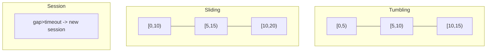
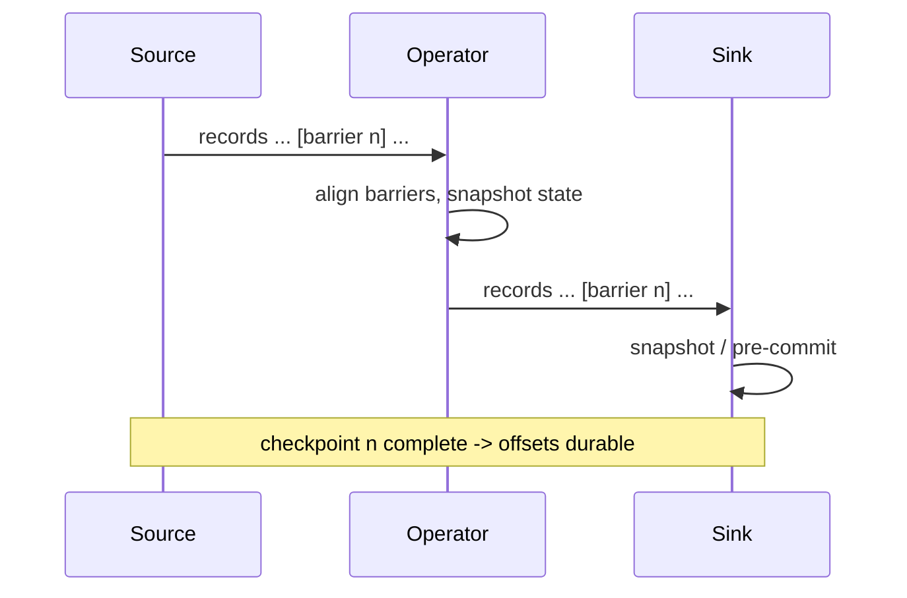
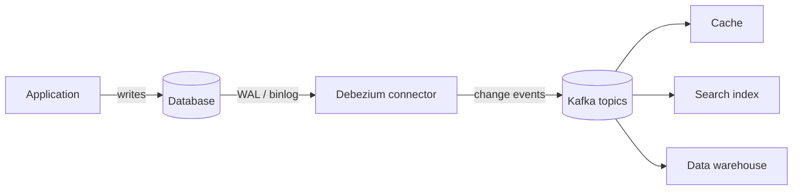
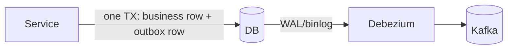

# Stream Processing and Change Data Capture

This page teaches the **mechanism** level of stream processing and Change Data
Capture (CDC): how a streaming engine keeps state, windows events, and achieves
exactly-once; and how CDC turns a database's write-ahead log into an event stream.
It stays out of the whiteboard/architecture altitude (where-does-the-pipeline-go,
capacity math) that the system-design pages own — here we talk about barriers,
watermarks, offsets, WAL/binlog reads, and the failure modes an interviewer probes.

> [!KEY-TAKEAWAY]
> Two big ideas unify this topic. **(1) Stream-table duality:** a stream is a log
> of changes; a table is the current state you get by replaying that log — and you
> can go back and forth. **(2) Log-based CDC:** a database already keeps an ordered,
> durable log of every change (the WAL/binlog) for its own replication; CDC just
> tails that same log, so you get a complete, ordered, low-overhead change stream
> without polling the tables.

---

## Stream vs batch processing

**Batch processing** runs over a bounded, finite dataset: you read a fixed input
(yesterday's files, a table snapshot), compute, and finish. **Stream processing**
runs over an unbounded, never-ending sequence of events, processing each record (or
micro-batch) as it arrives and producing continuously updated results.

The practical differences:

| Aspect | Batch | Stream |
|---|---|---|
| Input | Bounded (has an end) | Unbounded (infinite) |
| Latency | Minutes to hours | Milliseconds to seconds |
| Completeness | All data present at start | Data arrives over time; may be late/out of order |
| State | Recomputed each run | Long-lived, incrementally updated |
| Correctness model | Deterministic re-run | Needs watermarks, checkpoints, idempotence |

The deep insight (Google's *Dataflow* model, and Kleppmann's DDIA): **batch is a
special case of streaming over a bounded stream.** A batch job is just a stream job
whose watermark jumps straight to "infinity" because all the data is already there.
Modern engines (Flink, Spark) expose one API for both, which is why "unified batch
and streaming" is a selling point.

- **Lambda architecture** historically ran a batch layer (accurate, slow) plus a
  speed layer (fast, approximate) and merged them. It is being replaced by
  **Kappa architecture**: a single streaming pipeline that can reprocess history by
  replaying the log from the beginning — simpler, no duplicated logic.

> [!INTERVIEW]
> "When would you choose batch over streaming?" Good answer: when latency doesn't
> matter, the input is naturally bounded, and simpler operational/correctness
> guarantees are worth more than freshness (e.g. nightly financial close, ML
> training data prep). Streaming pays a real complexity tax (state, watermarks,
> exactly-once) — only take it on when freshness has business value.

---

## Event time vs processing time

Every event carries (at least implicitly) two clocks:

- **Event time** — when the event *actually happened* at the source (embedded in
  the record, e.g. the click timestamp on the mobile device).
- **Processing time** — when the streaming engine *observes* the event.
- (A third, **ingestion time**, is when the record entered the messaging system;
  a middle ground some engines offer.)

They diverge because of network delay, buffering, mobile devices going offline, and
backpressure. A phone in a tunnel may emit an event at 10:00 event-time that the
engine only sees at 10:47 processing-time.

**Why it matters:** results should be based on **event time** to be correct and
reproducible. If you window by processing time, replaying the same data on a busy vs
idle cluster gives different answers — the results depend on machine speed, not on
what happened. Event-time processing is deterministic given the data.

The cost of event-time correctness is that you can never be *sure* all events for a
window have arrived (that phone might still be in the tunnel). That uncertainty is
exactly what **watermarks** manage.

---

## Windowing tumbling sliding session

Because a stream is infinite, you can't "count all events" — you group them into
finite **windows** to compute aggregates.

- **Tumbling window** — fixed size, non-overlapping, contiguous. A 1-minute
  tumbling window puts each event in exactly one bucket: `[10:00,10:01)`,
  `[10:01,10:02)`. Use for periodic aggregates ("orders per minute").
- **Sliding (hopping) window** — fixed size but advances by a smaller *slide*, so
  windows overlap and each event lands in multiple windows. Size 10 min, slide
  1 min → "orders in the last 10 minutes, updated every minute." Overlap means
  more windows and more state.
- **Session window** — variable size, defined by a **gap of inactivity**. Events
  keep extending the session until no event arrives for the gap timeout (e.g.
  30 min). Great for user activity sessions; window boundaries are data-driven, not
  clock-driven.



> [!TIP]
> Quick disambiguator: **tumbling** = non-overlapping; **sliding** = overlapping by
> a slide; **session** = closes after a gap of inactivity. A tumbling window is just
> a sliding window whose slide equals its size.

---

## Watermarks and late data

A **watermark** is the engine's assertion: "I believe I have now seen all events
with event-time ≤ T." It is a moving low-watermark on event time that flows through
the pipeline as a special marker interleaved with the data.

- Watermarks let the engine decide **when a window is complete** and can be emitted.
  A window `[10:00,10:01)` fires when the watermark passes 10:01 — meaning the engine
  is confident no more events for that minute will arrive.
- Watermarks are typically generated as `max_event_time_seen - allowed_lateness`
  (a **bounded-out-of-orderness** heuristic). A bigger lag gives more time for late
  events (higher completeness) at the cost of higher latency before results emit.
  This is the fundamental **latency vs completeness** trade-off.

**Late data** = an event whose event-time is *behind the current watermark* (it
arrived "too late"). Options:

1. **Drop it** (default in many engines) — simplest, loses data.
2. **Allowed lateness** — keep window state around past the watermark for a grace
   period and *update* the result when stragglers arrive (Flink `allowedLateness`,
   Beam late firings).
3. **Side output / dead-letter** — route late events to a separate stream for
   reconciliation.

> [!WARNING]
> A watermark is a **heuristic, not a guarantee.** If you set the out-of-orderness
> bound too tight, genuinely late events fall behind the watermark and get dropped;
> too loose and every result is delayed. There is no "correct" watermark — it encodes
> your tolerance for lateness.

**Worked example — watching one window fire.** Bound (allowed out-of-orderness) = 5s,
watermark formula `WM = max_event_time_seen − 5s`, tumbling window `[10:00:00, 10:01:00)`
that fires once `WM ≥ 10:01:00`. Events arrive in this processing order (note #3 is out
of order):

| # | arrives (event-time) | max_seen | watermark = max_seen − 5s | effect |
|---|---|---|---|---|
| 1 | 10:00:10 | 10:00:10 | 10:00:05 | buffered in window (count 1) |
| 2 | 10:00:30 | 10:00:30 | 10:00:25 | buffered (count 2) |
| 3 | 10:00:25 | 10:00:30 | 10:00:25 | out-of-order but not behind WM → buffered (count 3) |
| 4 | 10:00:58 | 10:00:58 | 10:00:53 | buffered (count 4) |
| 5 | 10:01:06 | 10:01:06 | **10:01:01** | WM crosses 10:01:00 → **window fires, result = 4**; the 10:01:06 event opens the next window |

Now a **straggler** with event-time `10:00:40` arrives *after* the fire, when `WM =
10:01:01`. Since `10:00:40 < 10:01:01`, it is **late**:

- **Default (drop):** result stays **4** — the straggler is silently discarded.
- **With `allowedLateness = 10s`:** the window's state is kept until `WM > 10:01:10`.
  The current WM is `10:01:01 ≤ 10:01:10`, so the window is still alive and re-fires with
  the corrected result **5**. Past `10:01:10` the state is dropped and the same straggler
  would be lost. That grace window is the latency-vs-completeness knob made concrete.

**Watermarks across parallel inputs.** When an operator has several input channels
(multiple partitions or upstream tasks), its watermark is the **minimum** of the
per-channel watermarks — the operator can only be sure it has seen everything up to
`T` if *every* input has reached `T`. Consequence: one slow input holds back the whole
pipeline, and an **idle/empty partition** that emits nothing keeps its channel watermark
frozen, so downstream windows **never fire**. The fix is idleness detection (Flink's
`withIdleness`), which marks a silent channel as idle so it stops dragging the minimum
down.

---

## Stateful stream processing

A **stateless** operation (map, filter) needs no memory of past events. A **stateful**
operation remembers information across events: aggregations (running count/sum),
windows (buffered events), joins (the other side's rows), and deduplication (seen
keys). State is the hard part of streaming — it must survive failures.

- State is **keyed**: partitioned by the record key so each key's state is owned by
  exactly one parallel task (like a partition owning its offsets in Kafka).
- **State backends:** in-memory (fast, bounded by heap) or embedded on-disk. Flink's
  RocksDB backend keeps state in an embedded LSM store so state can exceed memory and
  is incrementally checkpointed. Kafka Streams keeps local state in RocksDB and backs
  it by a compacted **changelog topic** in Kafka for recovery.
- **State grows unbounded** unless you bound it: window state is freed after the
  watermark passes; long-lived keyed state needs **TTL** or explicit cleanup or it
  leaks forever (a classic production incident — "why is our state 4 TB?").

> [!INTERVIEW]
> The interviewer's probe: "Where does the state live and how does it survive a crash?"
> The crisp answer: local embedded store (often RocksDB) for fast access, made durable
> by **checkpoints** (Flink) or a **changelog topic** (Kafka Streams) so a restarted
> task rebuilds exactly the state it had at the last consistent snapshot.

---

## Exactly-once with checkpointing and barriers

"Exactly-once" almost never means each event is *physically* processed once — it means
**effectively-once**: the observable output (state and sinks) is as if each event were
processed exactly once, even across failures and retries.

**Flink's mechanism — the Chandy-Lamport asynchronous barrier snapshot:**

1. The source injects a numbered **checkpoint barrier** into the data stream at the
   current input offsets.
2. As the barrier flows downstream, each operator snapshots its state when the barrier
   reaches it. With multiple inputs, an operator **aligns** barriers: it waits for the
   same barrier on every input channel before snapshotting (buffering the faster
   inputs), so the snapshot is a consistent cut across the whole dataflow. **Cost of
   alignment:** under backpressure a fast input can be buffered a long time waiting on a
   slow channel's barrier, stalling the checkpoint (and the pipeline). Flink's **unaligned
   checkpoints** let the barrier overtake in-flight records and snapshot those buffered
   records as part of the state instead of waiting — trading a larger checkpoint for
   checkpoints that still make progress under load.
3. When all operators/sinks confirm, the checkpoint is complete and durably stored.
4. On failure, every operator restores from the last complete checkpoint and the
   sources **rewind to the offsets recorded in it**, then replay.



**Worked example — crash and recover on real offsets.** Checkpoint *n* is taken when the
source is at Kafka **offset 100**; the operator's running count is snapshotted as **40**.
Processing then continues to **offset 150** (count climbs to 90) — but *before* the next
checkpoint, the task **crashes**. On restart:

1. Every operator restores state **as of checkpoint n** → count resets to **40** (the 50
   records in offsets 100–149 that it had processed are erased from state).
2. The source **rewinds to offset 100** (the offset recorded in checkpoint n) and
   **replays offsets 100–149**.
3. State is rebuilt deterministically: count goes 40 → 90 again. Internal state is now
   correct exactly once.

The catch is the **sink**: records for offsets 100–149 were emitted once *before* the
crash and are **re-emitted** on replay. So the raw replay guarantee is **at-least-once**
(offsets 100–149 delivered twice). It becomes effectively-once only if the sink swallows
that duplicate — an idempotent upsert overwrites the same keys to the same values, or a
transactional sink never committed the pre-crash output for 100–149 in the first place so
the duplicate is the *only* commit. That is precisely why the replayed range must hit an
idempotent or transactional sink.

Replay alone gives **at-least-once** (records after the checkpoint are re-emitted).
To upgrade to exactly-once end-to-end you also need the **sink** to cooperate:

- **Idempotent writes** — a re-delivered record produces the same result (e.g.
  upsert by key), so duplicates are harmless.
- **Transactional / two-phase-commit sink** — the sink pre-commits output tied to a
  checkpoint and only commits when the checkpoint completes; on failure the
  uncommitted output is rolled back. Flink's `TwoPhaseCommitSinkFunction` and
  Kafka's transactional producer implement this.

> [!WARNING]
> Exactly-once is a property of the **whole pipeline**, not a single flag. If your
> sink is a plain REST call or a non-transactional insert, the best you get is
> at-least-once no matter what the engine's checkpointing does — you must make the
> sink idempotent or transactional.

---

## Kafka transactions and exactly-once semantics

Kafka provides **exactly-once semantics (EOS)** for the common "consume-transform-produce"
pattern (read from topics, process, write to topics) via three cooperating pieces:

1. **Idempotent producer** (`enable.idempotence=true`, default since Kafka 3.0). The
   producer tags each record batch with a producer ID (PID) and a per-partition
   sequence number; the broker dedups retries so a network retry doesn't create a
   duplicate. This gives exactly-once *for a single producer session to a single
   partition* — it defeats duplicates from retries, not from reprocessing.
2. **Transactions** (`transactional.id` + `initTransactions`/`beginTransaction`/
   `commitTransaction`). Multiple sends across multiple partitions become **atomic**:
   all appear or none do. Crucially, the producer also writes the **consumer offsets**
   into the same transaction via `sendOffsetsToTransaction`, so "I consumed these
   offsets AND produced these outputs" commits atomically.
3. **`isolation.level=read_committed`** on the consumer — it skips records from
   aborted transactions and won't read past an open transaction (the Last Stable
   Offset), so downstream readers only ever see committed output.

```
producer.initTransactions();
producer.beginTransaction();
producer.send(outputRecord);
producer.sendOffsetsToTransaction(offsets, consumerGroupMetadata);
producer.commitTransaction();   // offsets + outputs commit atomically
```

> [!WARNING]
> Kafka EOS covers Kafka-to-Kafka (and Kafka Streams with `processing.guarantee=
> exactly_once_v2`). It does **not** magically extend to an external database sink
> unless that sink participates in a transaction / is idempotent. And EOS is not
> free — transactions add commit latency and coordinator overhead.

---

## Kafka Streams vs Flink vs Spark Structured Streaming

All three do stateful stream processing with event-time windowing and exactly-once,
but they occupy different niches.

| | Kafka Streams | Apache Flink | Spark Structured Streaming |
|---|---|---|---|
| Form factor | **Library** in your JVM app (no cluster) | Distributed cluster / job manager | Distributed cluster (on Spark) |
| Processing | Per-record (event at a time) | Per-record (true streaming) | **Micro-batch** (default); continuous mode experimental |
| Latency | Low (ms) | Lowest (ms), sub-second | Higher (100s ms–s) due to micro-batch |
| Source/sink | Kafka only (in and out) | Many connectors (Kafka, files, DBs, ...) | Many connectors (files, Kafka, Delta, ...) |
| State/EOS | RocksDB + changelog topic; EOS v2 | RocksDB + barrier checkpoints; strong EOS | State store + WAL checkpoints; EOS via idempotent/transactional sinks |
| Best when | You live in Kafka and want no extra cluster | Lowest-latency, complex event-time, large state, CEP | You already run Spark/batch and want unified batch+stream |

Rules of thumb:

- **Kafka Streams** — Kafka-native microservice, no separate cluster to operate, both
  ends are Kafka. Simplest ops; least flexible on sources.
- **Flink** — the most capable *true* streaming engine: rich event-time/watermark
  semantics, huge managed state, complex-event-processing (CEP), lowest latency.
  Choose it for demanding, low-latency, stateful pipelines.
- **Spark Structured Streaming** — best when you already have a Spark/lakehouse
  ecosystem and batch jobs; micro-batch means higher latency but reuses one engine and
  one API for batch + streaming.

> [!INTERVIEW]
> "Why is Spark latency higher than Flink?" Structured Streaming is fundamentally
> **micro-batch**: it groups records into small batches and runs a mini Spark job per
> trigger, so latency is bounded below by the batch interval. Flink processes each
> record as it arrives, so it reaches millisecond latency.

---

## Stream table duality and materialized views

The central abstraction (from Kafka Streams / the log literature):

- A **stream** is an unbounded, append-only log of *events* (facts, deltas): "order
  123 status = SHIPPED at 10:03." Nothing is overwritten.
- A **table** (KTable) is the *current state* per key: the latest value for each key.

They are two views of the same data — **duality**:

- **Table → stream (changelog):** emit every insert/update/delete as an event. This is
  exactly a database's replication log — the source of CDC.
- **Stream → table (materialize):** fold/replay the event log by key, keeping the
  latest value → you reconstruct the table. This is a **materialized view**.

A **materialized view** is a precomputed, continuously updated query result stored for
fast reads. In streaming, you maintain it incrementally: each event updates the view
rather than recomputing from scratch. Kafka's **log compaction** supports the table
view — it retains at least the *latest* value per key and garbage-collects older values,
so a compacted topic is a durable snapshot of "current state per key" you can replay to
rebuild a KTable or a cache.

> [!KEY-TAKEAWAY]
> "Turning the database inside out" (Kleppmann): instead of the DB hiding its changelog
> internally, publish that changelog as a first-class stream and let many consumers
> build their own materialized views (a search index, a cache, an analytics table) — all
> kept consistent by replaying the same log.

---

## Change Data Capture fundamentals

**Change Data Capture (CDC)** is the practice of capturing every row-level change
(INSERT/UPDATE/DELETE) in a database and delivering it as an ordered stream of change
events to other systems. It answers "what changed, in what order, and what were the old
and new values?"

Why engineers reach for CDC:

- Keep a **cache**, **search index**, **data warehouse**, or **another microservice's
  DB** in sync with the system-of-record — without dual writes.
- Build event streams from legacy apps that only know how to write to a database.
- Do near-real-time ETL/replication with low overhead.

A CDC event typically contains: the operation (`c`/`u`/`d`/`r` for create/update/
delete/read-snapshot in Debezium), the **before** and **after** row images, the table/
schema, and the source log position (LSN / binlog offset / SCN) plus a timestamp.

There are two broad implementation families: **log-based** (tail the transaction log)
and **query- or trigger-based** (poll the tables or fire triggers). Log-based is the
modern default and wins on almost every axis — the next sections explain why.

---

## Log-based CDC with WAL and binlog

Every durable relational database already keeps an **ordered, append-only transaction
log** for crash recovery and replication:

- **PostgreSQL:** the **Write-Ahead Log (WAL)**, read via **logical decoding** (an
  output plugin like `pgoutput`) over a **logical replication slot**. Requires
  `wal_level = logical`. The slot tracks the last consumed LSN so no changes are missed.
- **MySQL/MariaDB:** the **binary log (binlog)** in **ROW** format (`binlog_format=ROW`),
  which records the actual before/after row images (vs STATEMENT format which logs SQL).
  The connector acts like a replica reading the binlog stream.
- **Oracle:** redo logs via LogMiner / XStream. **SQL Server:** the transaction log via
  its native CDC/CT features.

**Debezium** is the de-facto open-source log-based CDC platform. It runs as Kafka Connect
connectors (or embedded), performs an initial **consistent snapshot** of existing rows,
then streams subsequent changes from the log, publishing one Kafka topic per table.



Why **log-based wins**:

- **Complete & ordered** — captures *every* change including DELETEs and intermediate
  updates, in exact commit order. Polling misses rows that were inserted and deleted
  between polls.
- **Low overhead** — reads a log the DB already writes; no extra queries hammering the
  tables, no trigger firing on every write.
- **Low latency** — changes stream as they're committed, not on a poll interval.
- **Before-and-after images** — the log carries old and new values.

> [!WARNING]
> Operational gotchas: a **replication slot that no consumer advances** pins WAL on the
> PostgreSQL server and can fill the disk — a real outage cause. Log-based CDC also needs
> elevated privileges and the log in the right format/level, and schema changes (DDL)
> must be handled by the connector.

---

## Query-based and trigger-based CDC

The alternatives to reading the log:

**Query-based (polling):** periodically `SELECT` rows where a monotonically increasing
column changed, e.g.:

```sql
SELECT * FROM orders WHERE updated_at > :last_poll_time;
```

- Simple, no special privileges, works on any DB. But it **misses DELETEs** (the row is
  gone — nothing to select), misses intermediate states between polls, adds query load,
  requires a reliable `updated_at`/version column that the app must maintain, and trades
  latency against poll frequency. It can also miss rows if `updated_at` isn't set
  transactionally or clocks skew.

**Trigger-based:** database **triggers** fire on INSERT/UPDATE/DELETE and write change
rows into an audit/shadow table that a process then reads:

```sql
CREATE TRIGGER orders_audit AFTER INSERT OR UPDATE OR DELETE ON orders
  FOR EACH ROW EXECUTE FUNCTION log_order_change();
```

- Captures DELETEs and before/after values, and is transactionally consistent with the
  change. **But** every write now does extra work inside the transaction (write
  amplification, higher latency, more contention), triggers are hard to maintain and
  DB-specific, and the audit table needs its own cleanup.

| | Log-based | Query-based | Trigger-based |
|---|---|---|---|
| Captures DELETE | Yes | **No** | Yes |
| Intermediate updates | Yes | Missed between polls | Yes |
| Overhead on writes | Minimal | Extra SELECT load | Trigger per write |
| Latency | Low (streamed) | Poll interval | Low |
| Before/after image | Yes | No | Yes |
| Special DB config | Yes (log level, slot) | None | Trigger DDL |

> [!TIP]
> If you ever hear "we sync by comparing timestamps every 5 minutes," that's
> query-based CDC — flag the DELETE-blindness and latency, and propose log-based
> (Debezium) if the DB and privileges allow it.

---

## CDC use cases

CDC's value is decoupling the system-of-record from all the derived views. Common
patterns:

- **Cache invalidation / update** — a change event evicts or refreshes the affected
  cache key, so the cache never serves stale data and you avoid brittle app-side
  dual-writes to DB *and* cache.
- **Search index sync** — stream row changes into Elasticsearch/OpenSearch so search
  stays current without a nightly reindex.
- **Data pipeline / warehouse replication** — feed changes into a lake/warehouse (via
  Kafka) for near-real-time analytics instead of bulk nightly dumps.
- **Microservice data sharing / replication** — one service's DB changes materialize a
  read model in another service, avoiding synchronous cross-service reads.
- **Auditing / history** — the change stream is a natural audit log of who changed what.

**The dual-write problem and the Outbox pattern.** A service that must update its DB
*and* publish an event faces a race: the two writes are not atomic, so a crash between
them leaves the DB and the event stream inconsistent (event lost, or event published for
a rolled-back change). The **Transactional Outbox** pattern fixes this: within the *same
local DB transaction* as the business change, insert a row into an `outbox` table; CDC
then tails the outbox and publishes the events. Because the business row and the outbox
row commit atomically, the event is published **if and only if** the transaction
committed — no distributed transaction needed.



> [!INTERVIEW]
> "How do you reliably publish an event when you save an order?" The expected answer is
> the **Outbox pattern via CDC** — one atomic local transaction writes both the order and
> the outbox row, and CDC turns the committed outbox row into a Kafka event. This beats
> two-phase commit (no XA) and beats dual writes (no lost/orphan events).

---

## Event sourcing vs CDC

Both produce a stream of change events, but they are architecturally different:

- **Event sourcing** — the application is *designed* around events. The **event log is
  the source of truth**: you persist domain events ("MoneyDeposited", "OrderShipped")
  as the primary record and derive current state by replaying them. Events are
  first-class, business-meaningful, and defined by the app up front.
- **CDC** — the **database table is the source of truth**; the change stream is a
  *derived* byproduct of tailing the DB log. Events are low-level row deltas (before/
  after column values), not domain intentions.

| | Event sourcing | CDC |
|---|---|---|
| Source of truth | The event log | The database tables |
| Event semantics | Domain events (intent) | Row-level deltas (mechanical) |
| Retention | Full history, kept forever | Often just recent changes / compacted |
| App awareness | App is built around it | App unaware; bolted on later |
| Rebuild state | Replay all events | Re-snapshot the DB |

- Event sourcing pairs with **CQRS** (Command Query Responsibility Segregation):
  commands append events; separate read models (materialized views) are built by
  projecting those events for fast queries.
- **When to use which:** event sourcing when you need full auditability, temporal
  queries ("state as of last Tuesday"), and the domain naturally speaks in events —
  but it's a bigger commitment (versioning events, snapshots, replay cost). CDC when you
  have an existing table-centric app and just need to *propagate* its changes without
  rewriting it.

> [!WARNING]
> A subtle difference: CDC events reflect *how the data changed physically* (a bulk
> UPDATE looks the same as a user action), while event-sourced events capture *why*
> (business intent). Don't try to reverse-engineer domain intent from raw CDC deltas.

---

## Stream joins

Joining streams is trickier than joining tables because at least one side is unbounded
and events arrive over time. Three kinds:

**Stream-stream join** — join two event streams within a **time window** (you can't
buffer an infinite stream, so you only match events whose timestamps are close). Example:
match `clicks` to `impressions` for the same ad within 30 minutes. Both sides' state is
buffered for the window duration, then evicted. Requires windowing + watermarks; state
can be large.

```
// Kafka Streams
clicks.join(impressions,
  (click, imp) -> enrich(click, imp),
  JoinWindows.ofTimeDifferenceAndGrace(Duration.ofMinutes(30), Duration.ofMinutes(5)));
```

**Stream-table join (enrichment)** — join each event in a stream to the *current* value
in a table (KTable), typically to enrich the event (look up user profile for each click).
The table is the materialized latest-value-per-key; only the **stream** side triggers
output. No windowing needed — the table holds current state. This is the workhorse join
for enrichment.

**Table-table join** — join two changelog tables to produce a new continuously updated
table (a materialized view of the join). Both sides trigger updates.

A subtle but interview-relevant point: **temporal correctness**. A stream-table join
should enrich each event with the table value **as of the event's time**, not whatever
the table happens to hold now. Naive implementations use the latest table value, which is
wrong when the stream event is older than a subsequent table update (this is the
"temporal join" / "versioned table" problem Flink and Kafka Streams address explicitly).

Concretely: a `click` event has event-time **10:00** when user 42's tier is **SILVER**;
the user table is then updated to **GOLD** at **10:05**. If that 10:00 click is
reprocessed at **10:06**, a naive stream-table join reads the *current* table value and
enriches it with **GOLD** — wrong, the user was SILVER when they clicked. A temporal /
versioned join looks up the tier **as-of the event's 10:00 timestamp** and correctly
attaches **SILVER**.

> [!INTERVIEW]
> "Why does a stream-stream join need a window but a stream-table join doesn't?" Because
> both streams are unbounded — you can't hold all of either forever, so you bound the
> match to a time window and evict old state. A table is bounded (one value per key), so
> the stream side can look up against it without windowing.

---

## Common follow-up questions

- **"Difference between a watermark and allowed lateness?"** The watermark declares
  "I think I've seen everything up to time T" and fires windows; allowed lateness keeps a
  fired window's state around *past* the watermark so genuinely late events can still
  update the result before the state is finally dropped.
- **"Is exactly-once really possible?"** Effectively-once, yes — via replay from
  checkpoints/offsets plus idempotent or transactional sinks. Physical once-only delivery
  over an unreliable network is impossible (two-generals); we make duplicates harmless
  instead.
- **"Why is log-based CDC preferred over triggers?"** No write-path overhead, captures
  DELETEs and full history in commit order, low latency, and reuses a log the DB already
  maintains; triggers add per-write cost and are DB-specific and hard to maintain.
- **"What breaks if a Debezium/Postgres replication slot's consumer dies?"** The slot
  stops advancing, so Postgres cannot recycle WAL segments; WAL accumulates and can fill
  the disk, taking the primary down. Monitor slot lag and `restart_lsn`.
- **"Kafka Streams vs Flink in one line?"** Kafka Streams is a Kafka-only library you
  embed in an app (no cluster); Flink is a full distributed engine with the richest
  event-time/state/CEP support and lowest latency.
- **"How does CDC enable the Outbox pattern?"** Write the business change and an outbox
  row in one local transaction; CDC tails the committed outbox and publishes events, so
  the event fires iff the transaction committed — atomic without distributed transactions.
- **"Event time vs processing time — which for windows?"** Event time, for
  reproducible/correct results independent of machine speed and arrival delays; processing
  time only when you genuinely care about wall-clock observation, not when events occurred.

## References

- Martin Kleppmann, *Designing Data-Intensive Applications* — Ch. 11 (Stream Processing),
  Ch. 12; "Turning the database inside out."
- Akidau et al., *The Dataflow Model* (VLDB 2015) and *Streaming 101/102* — event time,
  watermarks, windowing, the batch-as-special-case-of-streaming view.
- Apache Flink documentation — event time & watermarks, windows, state backends, and
  checkpointing (asynchronous barrier snapshotting; two-phase-commit sinks).
- Apache Kafka documentation — idempotent producer, transactions/EOS, `read_committed`
  isolation, log compaction; Confluent Kafka Streams docs (KTable, stream-table duality,
  joins, `exactly_once_v2`).
- Apache Spark Structured Streaming Programming Guide — micro-batch model, watermarking,
  output modes, checkpointing.
- Debezium documentation — PostgreSQL (logical decoding, `pgoutput`, replication slots),
  MySQL (ROW-format binlog) connectors, snapshots, and the Outbox Event Router.
- PostgreSQL documentation — Write-Ahead Logging, logical decoding, replication slots
  (`wal_level=logical`). MySQL Reference Manual — the binary log and row-based logging.
- Chandy & Lamport, *Distributed Snapshots: Determining Global States of Distributed
  Systems* (1985) — the algorithm behind Flink checkpoint barriers.
