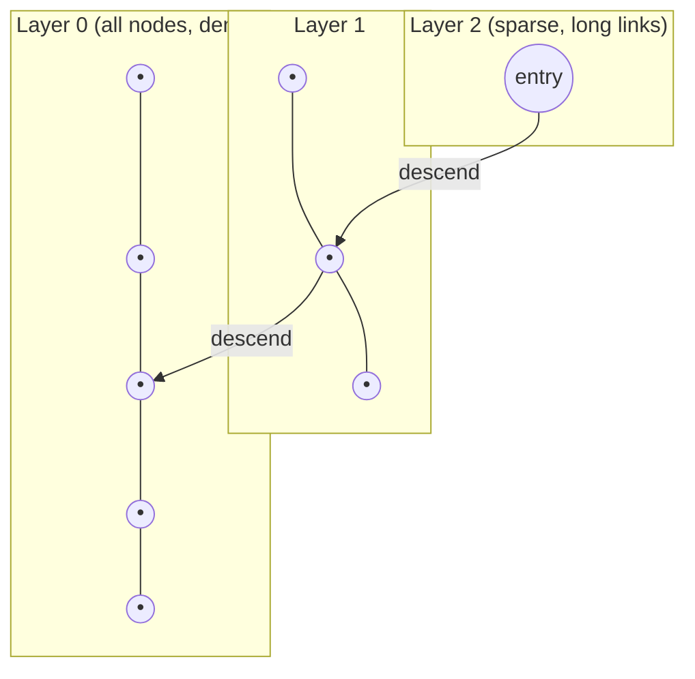
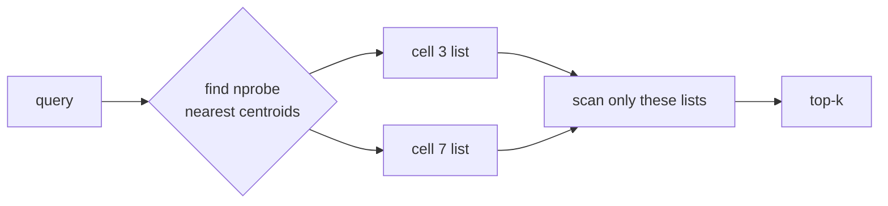
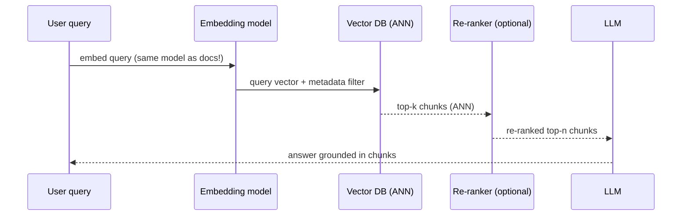

# Vector Databases & Similarity Search

Vector databases store high-dimensional **embeddings** — dense arrays of floats that a
machine-learning model produces to represent the *meaning* of text, images, audio, or
users — and answer **similarity queries**: "given this query vector, return the *k*
stored vectors closest to it." They power semantic search, recommendations, deduplication,
anomaly detection, and — most visibly today — **retrieval-augmented generation (RAG)** for
LLMs.

The core mechanism to internalize: a vector DB does *not* do exact matching. It does
**approximate nearest-neighbor (ANN)** search — trading a small amount of *recall*
(missing a few true neighbors) for orders-of-magnitude better *latency* and *memory*.
Almost every design decision in this space — HNSW vs IVF, quantization, `ef`/`nprobe`
tuning, pre- vs post-filtering — is a knob on the **recall ↔ latency ↔ memory** triangle.

This note stays at the *mechanism* level: how the similarity metrics, index algorithms,
and query paths actually work, and the gotchas an interviewer probes.

---

## Embeddings and vector similarity metrics

An **embedding** is a fixed-length vector (e.g. 384, 768, 1536, or 3072 dimensions) output
by a model such that *semantically similar inputs map to nearby points* in the vector
space. "Nearby" is defined by a **distance/similarity metric** you must choose to match how
the embedding model was trained.

The three metrics you must know:

| Metric | Formula (vectors a, b) | Range / meaning | Bigger = closer? |
|---|---|---|---|
| **Cosine similarity** | `(a·b) / (‖a‖·‖b‖)` | −1 … 1; angle between vectors, magnitude-invariant | Yes (1 = identical direction) |
| **Dot / inner product (IP)** | `a·b = Σ aᵢbᵢ` | unbounded; rewards both alignment *and* magnitude | Yes |
| **Euclidean (L2) distance** | `√Σ(aᵢ−bᵢ)²` | 0 … ∞; straight-line distance | No — smaller = closer |

**Key relationship — the big gotcha.** For **normalized** vectors (‖a‖ = ‖b‖ = 1),
cosine, dot product, and Euclidean distance are all *monotonically equivalent* — they rank
neighbors identically. Specifically `‖a−b‖² = 2 − 2·(a·b)` when both are unit length, so
minimizing L2 equals maximizing dot product equals maximizing cosine. This is why many
libraries recommend **normalizing embeddings and using dot product** (the cheapest to
compute — no square roots or norms).

**Worked check (why higher cosine ⇒ smaller L2).** Take unit vectors `a = (1, 0)`.
- A *farther* neighbor `b = (0.8, 0.6)` (unit: 0.8² + 0.6² = 0.64 + 0.36 = 1).
  cos = a·b = 0.8. L2² = (1−0.8)² + (0−0.6)² = 0.04 + 0.36 = **0.4** — and `2 − 2·(0.8) = 0.4`. ✓
- A *closer* neighbor `b' = (0.95, 0.3122)` (unit: 0.95² + 0.3122² ≈ 0.9025 + 0.0975 = 1).
  cos = 0.95. L2² = (1−0.95)² + 0.3122² = 0.0025 + 0.0975 = **0.1** — and `2 − 2·(0.95) = 0.1`. ✓

Higher cosine (0.95 > 0.8) ⇒ smaller L2² (0.1 < 0.4) ⇒ same ordering. That is the
monotonic equivalence — you can rank with whichever is cheapest.

- **Cosine** is the default for text embeddings (OpenAI, most sentence-transformers) because
  it ignores magnitude and compares *direction* (topic/meaning) only.
- **Dot product** is used when magnitude carries signal (e.g. some retrieval models, or when
  vectors are pre-normalized so IP = cosine but faster). Maximum Inner Product Search (MIPS)
  is *not* a true metric space — the triangle inequality doesn't hold — which complicates
  some index math (addressed by transformations in ScaNN/IVF).
- **Euclidean** suits embeddings where absolute position matters (some image/face embeddings).

> [!WARNING]
> Using the *wrong* metric for a model silently returns bad results — no error, just poor
> recall. Always match the metric the embedding model was trained with. Mixing normalized
> and unnormalized vectors in one index also corrupts dot-product rankings.

> [!TIP]
> pgvector exposes three operators — `<->` (L2), `<#>` (negative inner product), and `<=>`
> (cosine distance). Note `<#>` returns the *negative* dot product so that "smaller = closer"
> holds for ORDER BY, since Postgres index scans return rows in ascending distance order.

---

## The ANN problem: why exact kNN doesn't scale

**Exact k-nearest-neighbor (kNN)** over N stored vectors of dimension D is a brute-force
scan: compute the distance from the query to *every* stored vector (O(N·D)), then keep the
top *k*. For N = 100M vectors × 1536 dims × 4 bytes that is ~600 GB of data touched *per
query* — hundreds of milliseconds to seconds, and it scales linearly with N. Unacceptable
for interactive search.

Unlike 1-D or low-dimensional data, you **cannot** build a B-tree or hash that gives
O(log N) exact lookups in high dimensions — spatial tree structures (k-d trees, ball trees,
R-trees) degrade to near-linear scans once D exceeds ~10–20 (the *curse of dimensionality*,
see below). Exact search remains O(N).

The fix is **Approximate Nearest Neighbor (ANN)**: build an index that finds *most* of the
true nearest neighbors *most* of the time, in sublinear time, by only examining a small
fraction of the dataset. The quality of an ANN system is measured by **recall@k**:

```
recall@k = (# of true top-k neighbors actually returned) / k
```

Typical production targets are recall@10 of 0.95–0.99. ANN gives up that last few percent
of recall in exchange for 10–1000× lower latency and lower memory.

For a concrete instance: if the true top-10 for a query are `{a, b, c, d, e, f, g, h, i, j}`
and the ANN index returns `{a, b, c, d, e, f, g, h, i, z}` — 9 of the true neighbors plus one
impostor `z` — then recall@10 = 9/10 = **0.9**. (Note recall@k here counts *how many of the
true top-k came back*, not their exact order.)

> [!KEY-TAKEAWAY]
> A "vector database" is, at its core, an **ANN index** (HNSW/IVF/PQ/…) wrapped with
> storage, metadata filtering, CRUD, sharding, and persistence. The index choice and its
> parameters dominate performance.

---

## Exact vs brute-force: when it's actually fine

Brute-force (flat) search is not always wrong. For **small collections** (up to ~10K–100K
vectors), a flat/exact scan is *simpler, uses no extra index memory, gives 100% recall, and
supports instant updates* — and modern SIMD makes it fast enough (single-digit ms). Many
systems (FAISS `IndexFlatL2`, pgvector without an index, Postgres small tables) default to
this.

You reach for an ANN index only when N grows large enough that the linear scan misses your
latency SLO. A common mistake in interviews is jumping straight to HNSW for a 5K-row table
where a flat scan is faster to build and 100% accurate.

Also note: some workloads genuinely *require* exact results (compliance, exact dedup). For
those, brute force or an exact GPU kNN is the only correct answer.

---

## HNSW: hierarchical navigable small world graphs

**HNSW** is the most widely used ANN index (FAISS, Qdrant, Weaviate, Milvus, pgvector,
Elasticsearch/Lucene, Pinecone). It is a **graph** index: each vector is a node connected to
its approximate neighbors, and search is a greedy walk toward the query.

**Structure** — a multi-layer "skip-list-like" hierarchy of proximity graphs:



- Higher layers have exponentially fewer nodes with **long-range** links (fast coarse
  navigation, like express lanes); the bottom layer (L0) contains **every** node with dense
  short-range links (fine-grained accuracy).
- **Search**: start at the top-layer entry point, greedily hop to the neighbor closest to
  the query, descend a layer when no closer neighbor exists, repeat down to L0, then run a
  best-first search on L0 keeping a candidate list of size `ef`.

**Traced search (`ef = 4`, `k = 2`).** Say each node's number below is its distance to the
query (smaller = closer); we want the 2 closest.

1. **L2 (entry):** start at `entry` (dist 9). Its only neighbor visible here is closer, so
   we take the descend link down toward L1.
2. **L1:** land near node with dist 5; its neighbor at dist 3 is closer → hop to it. No L1
   neighbor is closer than 3, so descend to L0.
3. **L0 best-first with `ef = 4`:** seed the candidate list with the entry (dist 3). Expand
   the closest unvisited candidate each step, adding its neighbors, and keep only the **4
   closest** seen so far (that is what `ef = 4` bounds):
   - visit dist-3 node → neighbors {2, 6}; list = {2, 3, 6} (all fit in 4).
   - visit dist-2 node → neighbors {1, 4}; candidates {1, 2, 3, 4, 6} → keep 4 closest = {1, 2, 3, 4}.
   - visit dist-1 node → neighbors {2 (seen), 5}; adding 5 gives {1, 2, 3, 4, 5} → still keep {1, 2, 3, 4}.
   - closest unvisited (dist 4) has no neighbor beating the current top; search stops.
4. **Return top `k = 2`** from the list: the dist-1 and dist-2 nodes.

Why `ef ≥ k`: the candidate list *is* the answer pool, so it must hold at least `k` slots.
Raising `ef` (say to 8) would have kept nodes 5 and 6 in play longer, exploring more of L0 —
higher recall (less chance of missing a true neighbor hiding behind a slightly-farther hop)
at the cost of more distance computations.

**Key parameters:**

| Param | When | Effect |
|---|---|---|
| **M** | build | max neighbors per node (graph degree). Higher M → better recall, more memory (each node stores up to M/2M links), slower build. Typical 16–64. |
| **efConstruction** | build | candidate-list size during insertion. Higher → higher-quality graph, better recall, slower build. Typical 100–500. |
| **ef** (`efSearch`) | query | candidate-list size during search. Higher `ef` → higher recall, higher latency. Must be ≥ k. The main *runtime* recall/latency knob. |

**Complexity**: search is ~O(log N); build is ~O(N·log N). Memory ≈ vectors + graph links
(links can be a large fraction of total).

**Strengths**: best recall/latency for in-memory search, great for high-recall interactive
queries, supports incremental inserts. **Weaknesses**: **high memory** (full-precision
vectors + graph must fit in RAM for speed), **expensive to build**, deletions are hard
(usually soft-delete + tombstones, periodic rebuild), and filtered search can break graph
connectivity (see filtering section).

> [!INTERVIEW]
> "How do you raise recall on an HNSW index without rebuilding?" → Increase **`ef`
> (efSearch)** at query time; it costs latency but needs no rebuild. To improve the ceiling,
> rebuild with higher **M**/**efConstruction**.

---

## IVF: inverted file index (coarse quantization)

**IVF (Inverted File)** partitions the vector space into **`nlist`** cells (Voronoi
regions) using k-means to pick `nlist` centroids. Each stored vector is assigned to its
nearest centroid's *inverted list* (posting list). This is the vector analogue of an
inverted index in text search.

**Search**: compute the query's distance to all `nlist` centroids, pick the **`nprobe`**
closest cells, and search *only the vectors in those cells* (not the whole dataset).



**Key parameters:**
- **`nlist`** (build): number of cells. Rule of thumb ~ `sqrt(N)` to `4·sqrt(N)`. More cells
  → smaller lists → faster search but need training on enough data.
- **`nprobe`** (query): how many cells to scan. `nprobe = 1` is fastest/lowest recall;
  raising `nprobe` toward `nlist` approaches exact search. **The runtime recall/latency knob**
  (analogous to HNSW's `ef`).

**Gotcha — the boundary problem**: a true nearest neighbor can sit just across a cell
boundary in a cell you didn't probe → missed. Raising `nprobe` mitigates this.

**IVF requires a training step** (k-means over a representative sample) before you can add
vectors — unlike HNSW which is incremental. IVF is more memory-efficient than HNSW (no graph
links) and builds faster, but generally gives lower recall at the same latency for
in-memory workloads. IVF shines when combined with PQ for **billion-scale, memory-constrained**
datasets.

---

## Product quantization (PQ) and IVF-PQ

**Product Quantization (PQ)** is a lossy **compression** technique that shrinks each vector
from hundreds of full-precision floats to a handful of bytes, so huge datasets fit in RAM.

**How it works:**
1. Split each D-dim vector into **m** contiguous sub-vectors (e.g. 128 dims → 8 sub-vectors
   of 16 dims each).
2. Run k-means *per sub-space* to learn a **codebook** of typically **256 centroids** (so
   each code fits in 1 byte, `nbits=8`).
3. Encode each sub-vector as the **id of its nearest sub-centroid**. A 128-dim × 4-byte
   (512-byte) vector becomes **m = 8 bytes** — a **~64×** compression.

**Search uses Asymmetric Distance Computation (ADC)**: the query stays full-precision; for
each sub-space precompute a small lookup table of query-to-centroid distances, then a stored
vector's distance is just **m table lookups + adds** — very fast, no decompression.

**IVF-PQ** combines both: IVF narrows *which* cells to scan, PQ compresses the vectors
*inside* those cells. This is the workhorse for **billion-scale** systems (FAISS
`IndexIVFPQ`) — e.g. 1B × 128-dim vectors in tens of GB instead of ~500 GB.

**Trade-off**: PQ is **lossy** → lower recall. Systems recover recall with a **re-ranking /
refinement** step: PQ retrieves a larger candidate set (e.g. top-100 approximate), then
those candidates are re-scored with **full-precision** vectors to pick the final top-k
(FAISS `IndexIVFPQR` / `refine`). Storing full vectors on disk/SSD for re-rank is common
(e.g. DiskANN).

| Index | Memory | Recall | Build | Best for |
|---|---|---|---|---|
| Flat | highest | 100% | none | small N, exact |
| HNSW | high (vectors + graph) | very high | slow | in-memory, high recall |
| IVF | medium | medium | medium (needs training) | large N, RAM-ok |
| IVF-PQ | very low | medium (↑ with re-rank) | medium | billion-scale, RAM-limited |

---

## Scalar and binary quantization

Beyond PQ, two simpler **quantization** schemes trade recall for memory/speed:

- **Scalar quantization (SQ)**: map each float32 dimension to an **int8** (or int4) by
  linearly rescaling the observed min–max range per dimension. **4× compression** (32→8
  bits), tiny recall loss (usually <1–2%), and int8 SIMD distance is *faster* than float32.
  This is the most popular "free lunch" — Qdrant, Elasticsearch, and others default toward it.

- **Binary quantization (BQ)**: reduce each dimension to a **single bit** (sign: positive→1,
  negative→0). **32× compression**; distance becomes **Hamming distance** (XOR + popcount),
  which is extremely fast. Recall drops more, so BQ is paired with **oversampling +
  full-precision re-ranking** (retrieve e.g. 5–10× candidates via bits, re-score with
  originals). Works best on high-dimensional embeddings from models trained/robust to it
  (e.g. large 1024+ dim models); poor on low-dim vectors.

| Scheme | Compression | Distance | Recall impact | Notes |
|---|---|---|---|---|
| Scalar (int8) | 4× | int8 dot/L2 | small | good default |
| Binary | 32× | Hamming (XOR+popcount) | large w/o re-rank | needs oversample + re-rank |
| PQ | up to ~64× | ADC lookup tables | moderate | needs codebook training + re-rank |

> [!TIP]
> Quantization is **orthogonal** to the index structure: you can put scalar/binary/PQ
> quantization *under* an HNSW or IVF index. E.g. "HNSW + int8 scalar quantization" cuts RAM
> 4× with negligible recall loss — a very common production config.

---

## Other index families: ScaNN, LSH, DiskANN, Annoy

- **ScaNN (Google)**: uses **anisotropic vector quantization** — a loss function that weights
  quantization error *along the direction that matters for inner-product ranking*, giving
  better MIPS recall than plain PQ. Combined with a tree/partitioning step and SIMD-optimized
  scoring. State-of-the-art on many benchmarks (ann-benchmarks).

- **LSH (Locality-Sensitive Hashing)**: hash functions designed so that *nearby* vectors
  collide in the same bucket with high probability. Query = hash the query, scan colliding
  buckets. Historically important and has strong theoretical guarantees, but in practice
  needs many hash tables (high memory) and is generally **outperformed by HNSW/IVF** on
  real embedding data — rarely the top choice today, though used where provable guarantees
  or streaming/dedup at scale matter.

- **DiskANN / Vamana**: graph index designed to keep most vectors on **SSD** with a
  compressed (PQ) copy in RAM for navigation — enables billion-scale search on a single node
  without holding everything in memory. Trades some latency for huge cost savings.

- **Annoy (Spotify)**: forest of random-projection trees, memory-mapped and immutable — easy
  to build/share, good for read-only recommendation indexes, but no incremental updates and
  lower recall/latency than HNSW.

---

## The curse of dimensionality

As dimension D grows, geometric intuition breaks down and nearest-neighbor search gets
harder — the **curse of dimensionality**:

- **Distance concentration**: in high D, the distances from a query to its nearest and
  farthest points become nearly *equal* (the ratio → 1). "Nearest neighbor" becomes less
  meaningful, and index pruning based on distance thresholds loses power.
- **Volume/sparsity**: volume grows exponentially with D, so any finite sample is
  extremely sparse — cells/buckets are mostly empty and you must probe more of them.
- **Tree indexes collapse**: k-d trees and similar exact structures must backtrack into
  almost every branch above ~10–20 dims, degrading to O(N) — which is *why* graph/quantization
  ANN methods exist.

Practical consequences: embeddings are typically **512–3072 dims**; higher D means more
memory and slower distance computation (each is O(D)). Techniques like **Matryoshka
embeddings** (models trained so a prefix of the vector, e.g. first 256 of 1536 dims, is
still usable) and **PCA/dimensionality reduction** let you shrink D to cut cost, trading a
little accuracy. Note: real embeddings live on a lower-dimensional *manifold*, which is why
ANN works at all despite the nominal high D.

---

## Metadata filtering: pre-filter vs post-filter

Real queries combine similarity with **structured predicates**: "find products similar to
this image *where* `category = 'shoes' AND price < 100 AND in_stock = true`." How the filter
interacts with the ANN index is a major correctness/performance issue.

Three strategies:

| Strategy | How | Problem |
|---|---|---|
| **Post-filter** | ANN returns top-k, *then* drop rows failing the predicate | If the filter is selective, you may return **far fewer than k** (or zero) results — the top-k were all filtered out. |
| **Pre-filter** | Evaluate predicate first, then similarity-search *only* matching rows | Correct result count, but if you naively brute-force the matches it can be slow; and it can **break the ANN graph** — HNSW navigation may not reach a valid node if intermediate hops are filtered out. |
| **Filtered/in-index (single-stage)** | Apply the predicate *during* graph/list traversal, skipping non-matching nodes but still using them to navigate | Best of both — requires index support (Qdrant "filterable HNSW", Weaviate, Milvus, pgvector partial/iterative filtering). |

**The HNSW filtering gotcha**: with a highly selective filter, so few nodes match that the
graph becomes **disconnected** among matching nodes — the greedy walk gets stuck and recall
craters. Systems mitigate with: converting to brute-force below a match-count threshold,
building extra graph connectivity, or **iterative** search that widens `ef` until enough
matches are found. pgvector's `iterative_scan` (0.8+) addresses the "too few rows after
filter" problem by re-scanning with a larger candidate set.

> [!WARNING]
> Post-filtering silently returns **incomplete result sets** under selective filters — a
> classic production bug ("why did my search return 3 results when I asked for 20?"). Prefer
> pre-filter or in-index filtering; if you must post-filter, over-fetch (retrieve k·overfetch
> candidates) and filter down.

---

## Hybrid search: combining vector and keyword (BM25 + RRF)

**Dense** vector search captures *semantics* (paraphrases, synonyms) but can miss **exact
terms** — product SKUs, error codes, rare proper nouns, acronyms — because those get blurred
into the embedding. **Sparse/keyword** search (BM25, the classic TF-IDF-family lexical
ranker) nails exact-term matching but misses semantic paraphrase. **Hybrid search** runs
both and fuses the results, consistently beating either alone.

**Fusion methods:**
- **Reciprocal Rank Fusion (RRF)** — the standard, score-agnostic method. Each result gets
  `Σ 1/(k + rank_i)` summed over each ranker it appears in (rank is its position in that
  ranker's list; **k** is a constant, commonly **60**). Because it uses *ranks* not raw
  scores, it sidesteps the problem that BM25 scores (unbounded) and cosine scores (−1…1) are
  on incomparable scales.

  ```
  RRF_score(d) = Σ_over_rankers  1 / (k + rank_of_d_in_ranker)      # k ≈ 60
  ```

  **Worked example (k = 60).** Two documents:
  - **D1** is BM25 rank 1 and vector rank 3: `1/(60+1) + 1/(60+3) = 1/61 + 1/63 = 0.016393 + 0.015873 = 0.032266`.
  - **D2** is rank 2 in *both* rankers: `1/(60+2) + 1/(60+2) = 1/62 + 1/62 = 0.016129 + 0.016129 = 0.032258`.

  A near-dead-heat (D1 edges D2 by ~0.000008) — being #1 in one list roughly balances being
  solidly mid-pack in both.
  Now consider **D3**, which is BM25 rank 1 but *absent* from the vector top list (only one
  ranker contributes): `1/(60+1) = 0.016393`. Despite topping BM25, D3 (0.016393) loses badly
  to both D1 and D2 (~0.0323) — appearing in **both** rankers beats a strong showing in only one.
  That is the whole point: RRF rewards cross-ranker agreement using *ranks*, so an unbounded
  BM25 score of 200 and a cosine of 0.9 never have to be reconciled on the same scale.

- **Weighted score fusion / convex combination**: `α · normalized_vector_score + (1−α) ·
  normalized_bm25_score` — needs score normalization and a tuned `α`.

There are also **learned sparse** embeddings (e.g. SPLADE) that produce sparse term-weight
vectors combining lexical exactness with some semantic expansion, searchable in an inverted
index. Elasticsearch/OpenSearch, Weaviate, Qdrant, and Milvus all offer built-in hybrid +
RRF; pgvector is often paired with Postgres full-text search (`tsvector`/`ts_rank`) for a
DIY hybrid.

> [!INTERVIEW]
> "Semantic search returns great paraphrase matches but users complain exact model numbers
> don't rank" → classic case for **hybrid** (add BM25/keyword) fused with **RRF**.

---

## Vector search in RAG (retrieval-augmented generation)

**RAG** grounds an LLM's answer in retrieved documents to reduce hallucination and inject
private/fresh knowledge without retraining. The vector DB is the **retrieval** layer.

Pipeline:



**Ingestion (offline)**: documents are **chunked** (e.g. 200–1000 tokens with overlap),
each chunk embedded and stored with metadata (source, section, timestamp). **Chunking
strategy strongly affects quality** — too large dilutes relevance and wastes context; too
small loses context. Common strategies: **fixed-token windows with overlap** (e.g. 500 tokens,
50-token overlap), **recursive/semantic splitting** (break on paragraph/sentence boundaries so
a chunk is a coherent unit), and **parent-document / small-to-big** (embed small precise chunks
for retrieval but return their larger parent for context). The **overlap** exists so an answer
that straddles a boundary isn't cut in half — without it, a sentence split across two chunks
may match neither well.

**Query (online)**: embed the query **with the same model** used for docs (mismatched models
= meaningless distances), ANN-retrieve top-k, optionally **re-rank** with a slower
cross-encoder for precision, then stuff the best chunks into the LLM prompt.

**Interview-relevant gotchas:**
- **Embedding model must match** between indexing and querying, and re-embedding all docs is
  required if you change models — a costly migration.
- **k is a trade-off**: too few misses context; too many adds noise and cost (and can exceed
  the context window). Re-ranking lets you retrieve a large k cheaply then keep a precise n.
- **Metadata filtering** (tenant, date, access-control) is essential for correctness and
  security in multi-tenant RAG — enforce it as a **pre-filter**.
- Recall of the vector layer directly caps answer quality: if the right chunk isn't
  retrieved, the LLM can't use it.

---

## pgvector vs dedicated vector databases

The build-vs-buy decision. **pgvector** is a PostgreSQL extension adding a `vector` type and
ANN indexes (**IVFFlat** and, since 0.5.0, **HNSW**), with L2/cosine/inner-product operators
and full transactional/SQL integration.

```sql
CREATE EXTENSION vector;
CREATE TABLE items (id bigserial PRIMARY KEY,
                    category text, embedding vector(1536));
CREATE INDEX ON items USING hnsw (embedding vector_cosine_ops)
  WITH (m = 16, ef_construction = 64);
SET hnsw.ef_search = 100;                 -- runtime recall/latency knob
SELECT id FROM items
WHERE category = 'shoes'                    -- metadata pre-filter
ORDER BY embedding <=> '[...]'              -- <=> cosine distance
LIMIT 10;
```

**pgvector strengths**: one system for relational data + vectors (join, transaction, filter
with plain SQL — no separate store to sync), operational familiarity, ACID, cheap to start.
**Limits**: scaling to hundreds of millions/billions of vectors strains a single Postgres
node (memory, build time, no native distributed sharding of the vector index); fewer ANN
knobs and quantization options than specialists; filtered search historically weaker (helped
by `iterative_scan` in 0.8).

**Dedicated vector DBs** (Pinecone, Milvus, Weaviate, Qdrant) are purpose-built:
distributed/sharded ANN, quantization (SQ/PQ/BQ), native hybrid search + RRF, filterable
HNSW, high write/query throughput, and managed scaling. Cost is a separate system to run and
keep in sync with your source of truth.

| | pgvector | Dedicated (Pinecone/Milvus/Weaviate/Qdrant) |
|---|---|---|
| Scale ceiling | ~single node, ≲10–50M practical | horizontal, billions |
| Ops | reuse existing Postgres | separate system to run/sync |
| Filtering / joins | full SQL, transactional | metadata filters (varies) |
| Quantization | limited (halfvec, binary in newer) | rich (SQ/PQ/BQ) |
| Hybrid search | DIY with tsvector | often built-in + RRF |
| When | you already run Postgres, moderate scale, want one store | very large scale, high QPS, vector-first product |

> [!KEY-TAKEAWAY]
> Rule of thumb: start with **pgvector** if you already run Postgres and are under tens of
> millions of vectors; move to a **dedicated** vector DB when scale, QPS, advanced filtering,
> or quantization/hybrid needs exceed what a single Postgres node handles well.

---

## Common follow-up questions

- **Why doesn't a B-tree work for vector search?** B-trees give total order on a single
  key; there's no meaningful total ordering of high-dimensional points, and spatial trees
  degrade to O(N) past ~10–20 dims (curse of dimensionality). ANN graph/quantization indexes
  are required.
- **HNSW vs IVF-PQ — when each?** HNSW for in-memory, high-recall, low-latency interactive
  search with incremental inserts. IVF-PQ for billion-scale, memory-constrained batch/large
  workloads where you accept lower recall (recovered by re-ranking).
- **What's the single knob to raise recall at query time?** HNSW: `ef_search`. IVF:
  `nprobe`. Both cost latency, neither needs a rebuild.
- **Why normalize embeddings?** So cosine = dot product; lets you use the cheaper inner-product
  path and keeps rankings consistent. Never mix normalized and unnormalized vectors.
- **How do you delete from HNSW?** Usually soft-delete/tombstone + filter at query time, with
  periodic full rebuilds — in-place deletion damages graph connectivity.
- **Post-filter returned too few results — why?** ANN found top-k first, then the predicate
  removed most of them. Use pre-filter/in-index filtering or over-fetch.
- **How do you keep the vector store in sync with the source of truth?** CDC/streaming or dual
  writes; re-embed on model change; treat the vector DB as a derived index, not the SoR.
- **How do you evaluate a vector search?** recall@k against an exact-kNN ground truth, plus
  latency percentiles and QPS at that recall — the standard ann-benchmarks methodology.

---

## References

- pgvector README & docs — https://github.com/pgvector/pgvector
- FAISS wiki (index types, IVF, PQ, HNSW, guidelines) — https://github.com/facebookresearch/faiss/wiki
- Malkov & Yashunin, "Efficient and robust approximate nearest neighbor search using
  Hierarchical Navigable Small World graphs" (HNSW paper), 2016/2018.
- Jégou, Douze, Schmid, "Product Quantization for Nearest Neighbor Search," IEEE TPAMI 2011.
- Guo et al., "Accelerating Large-Scale Inference with Anisotropic Vector Quantization"
  (ScaNN), ICML 2020.
- Indyk & Motwani, "Approximate Nearest Neighbors: Towards Removing the Curse of
  Dimensionality" (LSH), 1998.
- Subramanya et al., "DiskANN: Fast Accurate Billion-point Nearest Neighbor Search on a
  Single Node," NeurIPS 2019.
- Cormack, Clarke, Büttcher, "Reciprocal Rank Fusion outperforms Condorcet and individual
  Rank Learning Methods," SIGIR 2009.
- ann-benchmarks — https://ann-benchmarks.com/
- Qdrant / Weaviate / Milvus / Pinecone documentation (quantization, filtering, hybrid search).
- Lewis et al., "Retrieval-Augmented Generation for Knowledge-Intensive NLP Tasks," 2020.
