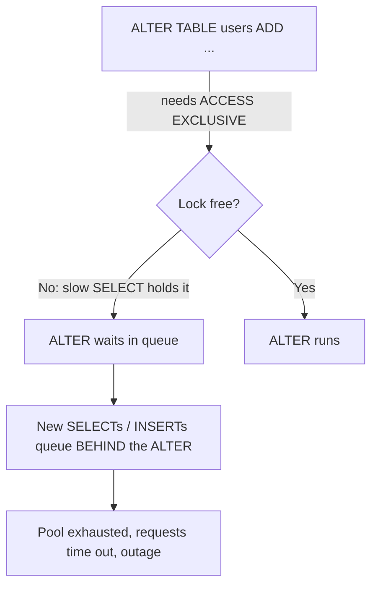
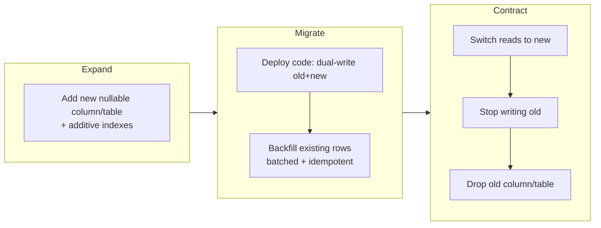
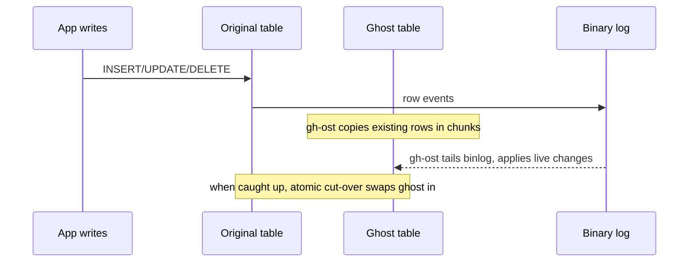
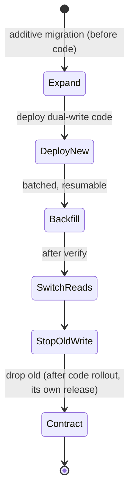

# Zero-Downtime Schema Migrations & Backfills

Production databases hold state that a live service is actively reading and writing.
Changing that schema — adding a column, adding an index, renaming a field, dropping a
table — while the service keeps serving traffic, without taking downtime or breaking
in-flight requests, is a core senior/staff skill. The naive approach (`ALTER TABLE`
during a maintenance window, deploy new code that assumes the new schema) works fine
on a laptop and catastrophically on a busy production table: a single blocking DDL
statement can lock a hot table for minutes, pile up a queue of blocked queries behind
it, exhaust the connection pool, and take the whole service down.

Zero-downtime migration is the discipline of making schema changes **backward- and
forward-compatible** and applying them in **small, non-blocking, reversible steps** so
that old and new versions of the application can run *simultaneously* during a rolling
deploy. The organizing idea is the **expand/contract** (a.k.a. *parallel-change*)
pattern, supported by database-specific techniques for avoiding long locks (online DDL,
`CREATE INDEX CONCURRENTLY`, `pt-online-schema-change`/`gh-ost`) and by disciplined,
batched, resumable **backfills** for moving existing data.

The authoritative grounding here is the PostgreSQL and MySQL/InnoDB manuals (lock
levels, online DDL algorithms, fast defaults, concurrent index builds), the Percona
Toolkit and GitHub `gh-ost` docs (triggerless online schema change), and the widely
cited write-ups by Martin Fowler ("ParallelChange" / expand-contract) and the
Stripe/GitHub/PlanetScale engineering blogs.

> [!KEY-TAKEAWAY]
> Never change schema and application code in a way that requires them to switch
> *atomically*. During a rolling deploy there is always a window where old and new
> code run at the same time against one schema. Every migration must leave the schema
> compatible with **both** the currently-deployed code and the code you are about to
> deploy.

See also `transactions-acid-isolation-levels` (locking, MVCC, long transactions),
`database-scaling-replication-pooling` (replication lag, connection pools, replica
rebuild), and the deployment side in `devops-cicd/deployment-strategies` (rolling,
blue-green, canary).

---

## Why naive migrations cause downtime

A migration causes an outage not because the change is "big" but because of **locks**
and **long-running work on a hot table**. Three distinct failure modes:

1. **The DDL itself holds a strong lock for a long time.** A table rewrite (e.g. MySQL
   `COPY` algorithm, or a PostgreSQL `ALTER TABLE ... TYPE` that rewrites rows) copies
   every row and holds a lock that blocks writes (and sometimes reads) for the whole
   copy. On a 500 GB table this is minutes to hours.

2. **The lock is short, but it queues behind a long query — and everything queues
   behind *it*.** In PostgreSQL, `ALTER TABLE` needs an `ACCESS EXCLUSIVE` lock. If a
   slow `SELECT` is running, the `ALTER` *waits* for it. Crucially, every *new* query
   that arrives now waits behind the `ALTER` in the lock queue — even trivial reads.
   So a metadata-only change that "takes 1 ms" can stall all traffic to the table for
   as long as the pre-existing slow query runs. This is the most common
   "my migration was instant but the site went down" surprise.

3. **The migration exhausts shared resources.** A giant `UPDATE` backfill in one
   transaction generates enormous WAL/redo, bloats undo/rollback segments, holds row
   locks on millions of rows, and — on replicas — creates replication lag while the
   change ships and applies. Connection pools fill with blocked/slow queries and the
   app starts returning errors even though the DB is technically "up."



> [!WARNING]
> Always set an aggressive `lock_timeout` (Postgres) or `lock_wait_timeout` (MySQL)
> for DDL, so a migration that cannot grab its lock quickly **fails fast** instead of
> parking itself at the head of the lock queue and blocking all traffic. Retry with
> backoff rather than waiting indefinitely.

---

## The expand/contract (parallel-change) pattern

Expand/contract (Martin Fowler's *ParallelChange*) splits every breaking schema change
into three phases deployed separately, so the schema is always compatible with two
adjacent code versions:

1. **Expand** — add the new structure in a purely *additive*, backward-compatible way:
   add a nullable/defaulted column, add a new table, add a new index. Old code ignores
   it; nothing breaks.
2. **Migrate** — make new code write to *both* old and new structures (dual-write) and
   **backfill** existing rows so the new structure is fully populated. Reads can still
   come from the old structure.
3. **Contract** — once the new structure is complete and trusted, switch reads to it,
   stop writing the old structure, and finally drop the old column/table.

Each phase is a separate deploy. Between phases the system runs happily with mixed code
versions. Rollback at any phase is safe because nothing has been destroyed yet — the
destructive step (drop) is dead last and only after the new path has been proven.



A worked example — renaming `users.email` to `users.email_address`:

- **Expand:** `ALTER TABLE users ADD COLUMN email_address text;` (nullable, instant).
- **Migrate:** deploy code that writes both `email` and `email_address` on every
  insert/update; backfill `UPDATE users SET email_address = email WHERE email_address
  IS NULL` in batches; add `NOT NULL`/unique constraints on the new column once full.
- **Contract:** deploy code that reads/writes only `email_address`; then
  `ALTER TABLE users DROP COLUMN email;`.

> [!INTERVIEW]
> Interviewers love "how would you rename a column with zero downtime?" The wrong
> answer is `ALTER TABLE ... RENAME COLUMN` in one step — that atomically breaks every
> running instance of the old code the instant it commits. The right answer is the
> three-phase expand/contract dance above.

---

## Backward vs forward compatibility and mixed-version windows

During a rolling deploy, instances of the **old** and **new** application version run
against the **same** database at the same time (this is also true for canary and
blue-green cutovers). Two compatibility directions must hold:

- **Backward compatibility:** the *new* code must work with data written by the *old*
  code and with the pre-migration schema shape it may still see mid-rollout.
- **Forward compatibility:** the *old* code must not break when it encounters the
  schema/data the *new* code produces — e.g. an extra column it doesn't know about, or
  a column it used to write now being optional.

This is why *additive* changes are safe (old code ignores a new nullable column) and
why *destructive/renaming* changes must be deferred: dropping a column that old code
still `SELECT *`s or inserts into will throw errors on the still-running old instances.

> [!TIP]
> The deploy and the migration are separate events with an ordering. Expand migrations
> run **before** the code that uses them; contract (drop) migrations run **after** the
> last code that referenced the old structure is fully rolled out. Never couple a
> destructive migration to the same release as the code that stops using it.

---

## Native online DDL: PostgreSQL

PostgreSQL does many DDL operations as fast, metadata-only catalog changes, but almost
all of them still take a brief `ACCESS EXCLUSIVE` lock — the danger is the *lock queue*
(see "Why naive migrations cause downtime"), not the duration of the change itself.

Key facts:

- **`ADD COLUMN` with a non-volatile default is metadata-only ("fast default", since
  PostgreSQL 11).** The default is stored in the catalog and returned for existing rows
  on read; no table rewrite occurs. Before v11, adding a column *with* a default
  rewrote the entire table.
- **A *volatile* default forces a full rewrite.** `ADD COLUMN created_at timestamptz
  DEFAULT clock_timestamp()` (volatile), a `STORED` generated column, an identity
  column, or a domain type with constraints all rewrite the whole table under
  `ACCESS EXCLUSIVE`. `DEFAULT now()` is fine because `now()` is *stable* within a
  statement (non-volatile in this sense).
- **Changing a column type generally rewrites the table**, except binary-coercible
  changes (e.g. `varchar(50)` → `text`, or widening `varchar` length) which skip the
  rewrite.
- **`ADD CONSTRAINT ... NOT VALID` then `VALIDATE CONSTRAINT`** lets you add a
  `CHECK`/foreign key without a long lock: the `NOT VALID` step is instant (only checks
  *new* rows), and `VALIDATE` scans existing rows under a weaker `SHARE UPDATE
  EXCLUSIVE` lock that permits concurrent reads and writes.

```sql
-- Fast, metadata-only in PG 11+ (non-volatile default):
ALTER TABLE orders ADD COLUMN status text NOT NULL DEFAULT 'pending';

-- Two-step FK without a long lock:
ALTER TABLE orders ADD CONSTRAINT fk_customer
  FOREIGN KEY (customer_id) REFERENCES customers (id) NOT VALID;   -- instant
ALTER TABLE orders VALIDATE CONSTRAINT fk_customer;                -- scans, weak lock
```

> [!WARNING]
> PostgreSQL has no `ALGORITHM=`/`LOCK=` clause like MySQL. Because MVCC keeps old row
> versions rather than updating in place, a rewriting `ALTER` also produces table bloat
> and heavy WAL. For big rewriting changes, prefer expand/contract (new column +
> backfill) or a tool like `pg_repack`, not a raw rewriting `ALTER`.

---

## Native online DDL: MySQL / InnoDB algorithms

MySQL 8 exposes three DDL algorithms via the `ALGORITHM=` clause, plus a `LOCK=` clause
controlling concurrency. Pick the cheapest one the operation supports and pin it
explicitly so the server *fails* rather than silently falling back to an expensive copy.

| Algorithm | What it does | Concurrent DML | Cost |
|---|---|---|---|
| `INSTANT` | Metadata-only change in the data dictionary; no data touched | Yes | Cheapest |
| `INPLACE` | Rebuild/modify within the tablespace, avoiding a full external copy | Usually yes (`LOCK=NONE`) | Moderate |
| `COPY` | Build a new table, copy every row, swap | No (blocks writes; reads only under `LOCK=SHARED`) | Most expensive |

- **`ADD COLUMN` is `INSTANT` by default since MySQL 8.0.12**; since 8.0.29 you can add
  it at any position and `DROP COLUMN` is also `INSTANT`. Set/drop default value,
  rename column (8.0.28+), and adding a column are all instant.
- **`INSTANT` has a 64-row-version limit.** Each instant add/drop column bumps a row
  version; after 64 you must rebuild the table (`OPTIMIZE TABLE` or a rebuilding
  `ALTER`) to reset the counter — otherwise you get `ERROR 4092`.
- **Adding a secondary index is `INPLACE` and allows concurrent reads *and* writes** —
  it does not support `INSTANT` (data must be scanned), but it does not rewrite the
  table and does not block DML.
- **Changing a column data type, dropping a lone primary key, shrinking `VARCHAR`, or
  a charset conversion require `COPY`** and block writes — these are the ones to route
  through an online-schema-change tool.

```sql
-- Explicitly pin the algorithm so the server errors instead of silently COPYing:
ALTER TABLE orders ADD COLUMN status VARCHAR(16), ALGORITHM=INSTANT;
ALTER TABLE orders ADD INDEX idx_status (status), ALGORITHM=INPLACE, LOCK=NONE;
```

> [!TIP]
> Always specify `ALGORITHM=INSTANT` or `ALGORITHM=INPLACE, LOCK=NONE` in production
> DDL. If the operation can't meet that requirement, MySQL raises an error instead of
> quietly running a table-locking `COPY` — turning a silent outage into a caught
> mistake.

---

## Online schema change tools: pt-online-schema-change & gh-ost

When a change genuinely needs a table rebuild that native online DDL can't do without
blocking (or when you're on an older MySQL), use an external online-schema-change tool.
Both build a **shadow/ghost copy** of the table with the new schema, copy rows in
chunks, keep it in sync with live writes, then atomically swap it in.

**`pt-online-schema-change` (Percona Toolkit) — trigger-based:**
- Creates an empty `_tablename_new` with the desired schema.
- Installs **AFTER INSERT/UPDATE/DELETE triggers** on the original table that mirror
  every live write into the new table.
- Copies existing rows in small chunks while triggers keep the new table current.
- Does an atomic `RENAME TABLE` swap and drops the triggers/old table.
- Downside: triggers execute *synchronously inside every production write*, adding
  latency and contention; and it can't be used if the table already has triggers
  (pre-8.0 limitation).

**`gh-ost` (GitHub) — triggerless, binlog-based:**
- Also creates a ghost table and copies rows in chunks, but instead of triggers it
  **impersonates a replica and reads the binary log**, applying live changes to the
  ghost table *asynchronously*.
- No triggers means no added latency on the write path; the copy load can be offloaded
  to a replica; and it offers rich **throttling** (`--max-lag-millis`,
  `--critical-load`) and a controllable, testable **cut-over**.
- This is why gh-ost is generally preferred for very hot tables: the migration work is
  decoupled from the production write path.



> [!KEY-TAKEAWAY]
> pt-osc uses **triggers** (synchronous, on the write path). gh-ost uses the **binlog**
> (asynchronous, off the write path). Both are lock-light and throttleable; gh-ost's
> decoupling makes it safer on the hottest tables. PostgreSQL's analog for
> rewrite-heavy changes is `pg_repack` / `pg_squeeze`.

**Shared constraints and the foreign-key gotcha.** This is the "what actually breaks
with these tools?" follow-up interviewers reach for. Both tools:

- **Need a unique/primary key to chunk on** — they page through the table by that key,
  so a table with no suitable unique key can't be migrated.
- **Roughly double disk usage** during the migration, because the full ghost/shadow copy
  coexists with the original until the swap. A 400 GB table needs ~400 GB free.
- **Handle foreign keys badly — the single most common real-world failure.** Because the
  cut-over is a `RENAME` of the ghost table into place, any *child* table whose FK
  references the original table points at the wrong object after the swap.
  - **gh-ost effectively does not support tables that are referenced by foreign keys**
    (its FK support is off/experimental); teams usually drop the FK, migrate, and
    re-add it, or avoid gh-ost for such tables.
  - **pt-osc requires `--alter-foreign-keys-method`**: `rebuild_constraints` drops and
    re-creates each child's FK to point at the new table (safe but slow, and briefly
    holds a metadata lock on children), while `drop_swap` is faster but leaves a tiny
    window where the constraint/table is inconsistent and is riskier. Neither is free —
    you must choose, and each has a distinct failure mode.

---

## Adding NOT NULL and defaults safely

Two separate hazards: the table rewrite cost of a default, and the full-table scan cost
of enforcing `NOT NULL`.

- **PostgreSQL default:** with fast defaults (v11+), `ADD COLUMN ... DEFAULT <const>`
  is metadata-only — even combined with `NOT NULL`, because the stored default proves
  no existing row is null. This is safe and fast.
- **Adding `NOT NULL` to an *existing* column** requires proving no row is null.
  `ALTER TABLE ... ALTER COLUMN x SET NOT NULL` scans the whole table under `ACCESS
  EXCLUSIVE` (blocking). The zero-downtime trick: add a `CHECK (x IS NOT NULL) NOT
  VALID` (instant), `VALIDATE CONSTRAINT` (weak lock, concurrent), then `SET NOT NULL`
  — in PG 12+ a validated matching `CHECK` lets `SET NOT NULL` skip its scan.
- **MySQL:** adding a `NOT NULL` column with a default is `INSTANT`. Adding `NOT NULL`
  to an existing nullable column that contains nulls will fail or coerce values
  depending on `sql_mode`; backfill the nulls first.

```sql
-- PostgreSQL: add NOT NULL to an existing column without a long blocking scan
ALTER TABLE users ADD CONSTRAINT users_email_nn CHECK (email IS NOT NULL) NOT VALID;
ALTER TABLE users VALIDATE CONSTRAINT users_email_nn;   -- concurrent-friendly scan
ALTER TABLE users ALTER COLUMN email SET NOT NULL;      -- skips scan given valid CHECK
ALTER TABLE users DROP CONSTRAINT users_email_nn;       -- optional, redundant now
```

> [!WARNING]
> Adding a column with a `NOT NULL` and *no default* to a non-empty table fails
> outright (existing rows would violate it). Order it correctly: add nullable →
> backfill → add default/constraint.

---

## Adding indexes without locking

A plain `CREATE INDEX` locks the table against writes for the whole build; on a large
hot table that is an outage.

- **PostgreSQL: `CREATE INDEX CONCURRENTLY`.** Builds the index without blocking
  reads/writes, at the cost of **two table scans** and waiting for concurrent
  transactions to drain. Caveats: it **cannot run inside a transaction block** (so
  migration frameworks that wrap each migration in a transaction must disable that for
  this step); if it fails (deadlock, unique violation) it leaves an **`INVALID`**
  index that still incurs write overhead and must be dropped and rebuilt (or `REINDEX
  INDEX CONCURRENTLY`); it isn't directly supported on partitioned tables (build per
  partition, then attach). Use `DROP INDEX CONCURRENTLY` to remove without a strong
  lock too.
- **MySQL: adding a secondary index is `INPLACE` with concurrent read+write DML** — no
  special "concurrently" keyword needed; pin `ALGORITHM=INPLACE, LOCK=NONE`.

```sql
-- PostgreSQL (note: not inside a transaction; framework must run it standalone)
CREATE INDEX CONCURRENTLY idx_orders_customer ON orders (customer_id);

-- if it fails and leaves an INVALID index:
DROP INDEX CONCURRENTLY idx_orders_customer;   -- then retry
```

> [!INTERVIEW]
> "Why does `CREATE INDEX CONCURRENTLY` take longer than a normal build?" Because it
> does two passes over the table and must wait for in-flight transactions to finish
> between/after the scans, so writers are never blocked. You trade wall-clock time and
> extra CPU/IO for zero write-lockout.

---

## Dual-write and switching reads

The "migrate" phase's job is to get the new structure fully populated and trusted while
the old structure is still the source of truth.

- **Dual-write:** new code writes every change to *both* the old and new columns/tables
  in the same transaction, so from the moment it deploys, new writes keep both copies
  consistent. (For a cross-table split, the write path fans out; keep it in one
  transaction so a crash can't leave them divergent, or reconcile with the backfill.)
- **Backfill** then fills in the historical rows the dual-write never touched.
- **Switch reads** only after backfill completes *and* dual-write has been running long
  enough that every row is covered. A common safety step is a **shadow read /
  comparison** phase: read from both, log/emit a metric on mismatches, and only cut the
  read over when the mismatch rate is zero.
- **Stop the old write** last, then drop.

> [!TIP]
> Order matters: turn on **dual-write before** backfilling. If you backfill first and
> then enable dual-write, rows changed in the gap between "backfill read" and
> "dual-write on" can be lost. With dual-write on first, the backfill only needs to be
> idempotent (`WHERE new IS NULL`) and any concurrent write is already covered.

---

## Backfills at scale

A backfill copies/derives data for existing rows. The cardinal rule: **never** do it
as one giant `UPDATE`. A single statement touching millions of rows holds locks for the
whole run, generates massive WAL/redo and undo, blows up replication lag, and can't be
paused or resumed. Instead, backfill in **small, batched, throttled, idempotent,
resumable** chunks.

- **Batching:** process a bounded number of rows per transaction (e.g. 1k–10k), keying
  by primary key ranges (`WHERE id > :last AND id <= :last + :batch`) so each batch is
  a short transaction that commits and releases locks. Prefer keyset/range pagination
  over `OFFSET`, which gets slower as it scans further.
- **Throttling:** sleep between batches and/or watch replication lag and DB load; back
  off when lag exceeds a threshold so replicas keep up and OLTP traffic isn't starved.
- **Idempotency:** each batch must be safe to re-run. Scope updates with a guard
  (`WHERE new_col IS NULL`) so re-processing a batch after a crash/retry does nothing
  extra.
- **Resumability:** persist a checkpoint (last processed id / cursor) so a crashed or
  paused backfill continues from where it stopped rather than restarting.
- **Avoid lock escalation & long transactions:** short batches keep the number of
  locked rows and the transaction age bounded; in Postgres, long transactions also
  block `VACUUM` from reclaiming dead tuples and hold back the xmin horizon — meaning
  `VACUUM` cannot remove old row versions that might still be visible to your
  long-running transaction (the oldest transaction ID still in play is the "xmin
  horizon"), so dead tuples pile up and the table bloats and slows down. Yet another
  reason to keep each batch a short, quickly-committing transaction. (See
  `transactions-acid-isolation-levels` for the MVCC mechanics.)

```sql
-- Batched, resumable, idempotent backfill loop (pseudocode around SQL)
-- last_id starts at 0; persist it after each batch for resumability
UPDATE users
   SET email_address = email
 WHERE id >  :last_id
   AND id <= :last_id + 5000
   AND email_address IS NULL;     -- idempotent guard
-- commit; set :last_id += 5000; sleep if replica lag high; repeat until no rows
```

**Worked example — the "1 B-row table" backfill math.** This is exactly the arithmetic
an interviewer wants when they say "backfill a billion rows." Take 5,000-row batches:

- Batch count: `1,000,000,000 / 5,000 = 200,000` batches.
- Per-batch cost: say each `UPDATE` of 5k rows commits in ~20 ms, and you sleep ~50 ms
  between batches to let replicas catch up → **70 ms per batch**.
- Wall-clock: `200,000 × 70 ms = 14,000,000 ms = 14,000 s ≈ 3.9 hours`.

Now double the batch size to 10,000 rows to "go faster":

- Batch count halves: `1,000,000,000 / 10,000 = 100,000` batches.
- But each batch does twice the work, ~40 ms, plus the same 50 ms sleep → **90 ms**.
- Wall-clock: `100,000 × 90 ms = 9,000,000 ms = 9,000 s = 2.5 hours`.

So doubling the batch cut total time from ~3.9 h to ~2.5 h — but each transaction now
holds row locks ~2× longer and ships ~2× the WAL/redo per commit, so **replica lag and
lock-hold time rise with batch size**. That is the real trade-off: batch size is a
throughput-vs-lag dial, not a "bigger is always better" knob. The disciplined move is to
pick a batch size, then make the *sleep* adaptive — tie it to observed replication lag
(e.g. skip the sleep while lag < 1 s, back off to 200–500 ms once lag crosses a
threshold) so throughput self-limits to whatever the replicas can absorb.

> [!WARNING]
> `UPDATE ... LIMIT` without an ordered key, or `OFFSET`-based paging, leads to skipped
> or re-scanned rows and quadratic slowdowns. Always drive batches by an indexed,
> monotonic key range and record a checkpoint.

See also `database-scaling-replication-pooling` for how backfill write volume turns
into replica lag and how to throttle against it.

---

## Renaming and removing columns safely

Renames and drops are the classic zero-downtime traps because they **break running old
code atomically** at commit time.

**Rename a column** = expand/contract, never a raw `RENAME`:
1. Add the new column (nullable).
2. Dual-write old + new; backfill.
3. Switch reads to new.
4. Drop the old column (separate, later deploy).

**Drop a column safely:**
1. First deploy code that no longer references the column (no `SELECT *` that maps it,
   no inserts/updates to it). Beware ORMs and `SELECT *`: an old instance doing
   `SELECT *` then mapping to a struct that expects the column will break the moment
   it's gone — the *code* must stop depending on it before the drop.
2. Only after that code is fully rolled out, `DROP COLUMN` (fast/metadata in both PG
   and MySQL 8 instant).
3. Keep the drop in its *own* migration/release so it can be rolled back independently,
   and consider a "soft delete" grace period (stop using it, wait, then drop) so you
   can recover if something still reads it.

> [!WARNING]
> `SELECT *` is the silent killer of column drops and adds. Adding a column can break
> old code that does `INSERT INTO t SELECT * FROM ...` or expects a fixed column count;
> dropping one breaks old readers. Explicit column lists make schema changes far safer.

---

## Migration ordering, deploy sequencing & rollback

The migration and the code deploy are two events, and their **order** depends on
whether the change is expanding or contracting:

- **Expand (additive) migration → runs *before* the new code deploys.** The new column
  must exist before the code that writes it starts. Old code tolerates it (additive).
- **Contract (drop/rename-away) migration → runs *after* the new code is fully rolled
  out.** The old structure must not be dropped until the last instance referencing it
  is gone.

Practical rules:

- Keep expand and contract in **separate releases** (often several deploys apart).
- Make each migration **independently reversible**: an expand can be rolled back by
  dropping what it added (nothing depends on it yet); the contract's drop is the one
  irreversible step, so gate it behind confidence (metrics, grace period, backup).
- **Test rollback**, not just roll-forward: can the *previous* app version run against
  the *new* schema? If not, you can't safely roll back a bad deploy.
- Run DDL with a short `lock_timeout`/`lock_wait_timeout` and retries so a migration
  never becomes the head of the lock queue.



---

## Forward-compatible application code (tolerant reader)

Zero-downtime is as much an application-code discipline as a DB one. The **tolerant
reader** pattern (Postel's Law: "be conservative in what you send, liberal in what you
accept") makes old code survive schema/data it wasn't built for:

- **Don't `SELECT *`** — select explicit columns so adding/removing columns doesn't
  change result shapes the code depends on.
- **Read code should tolerate new, unknown fields** (ignore extras) and tolerate
  *absent* values it will later require (treat a not-yet-backfilled column as
  null/default rather than assuming presence).
- **Write code should not assume** a column exists until the expand migration has run;
  feature-flag the dual-write so you can enable it only after the column is live.
- **Decouple deploy from cutover with flags:** ship the new read/write path dark, then
  flip a flag to switch reads — this separates "code is deployed" from "behavior
  changed," which is exactly the control expand/contract needs.

> [!KEY-TAKEAWAY]
> A tolerant reader plus explicit column lists plus feature-flagged dual-write is what
> lets old and new code coexist during the rollout. The database techniques
> (fast defaults, `CONCURRENTLY`, online DDL, batched backfills) remove the *locking*
> risk; tolerant application code removes the *compatibility* risk. You need both.

---

## Common follow-up questions

- **"Rename a column with zero downtime — walk me through it."** Add new nullable
  column → dual-write + backfill → switch reads → drop old, each a separate deploy.
- **"Your instant `ALTER` still caused an outage. Why?"** It queued behind a long
  transaction holding a conflicting lock, and all new queries queued behind the
  `ALTER`. Fix with a short `lock_timeout` and retry.
- **"Add a `NOT NULL` column to a 1 B-row table in Postgres."** Nullable column is
  metadata-only; with a non-volatile default (v11+) even `NOT NULL DEFAULT const` is
  instant. To make an *existing* column `NOT NULL`, use `CHECK ... NOT VALID` →
  `VALIDATE` → `SET NOT NULL`.
- **"pt-osc vs gh-ost?"** Triggers (synchronous, on write path) vs binlog (async, off
  write path); gh-ost decouples migration load from production writes and throttles on
  lag.
- **"Why batch a backfill?"** Short transactions release locks, bound WAL/undo, avoid
  lock escalation and replica lag, and enable pause/resume; make each batch idempotent
  and checkpoint progress.
- **"MySQL `ALGORITHM=INSTANT` limits?"** Metadata-only ops; 64-row-version cap per
  table before you must rebuild.
- **"Why not just do it in a maintenance window?"** Sometimes valid for small systems,
  but large tables can exceed any acceptable window, and 24/7 services can't take one;
  expand/contract avoids the window entirely.
- **"How do you make a migration rollback-safe?"** Keep destructive steps last and in
  their own release; ensure the previous code version runs against the new schema.

---

## References

- PostgreSQL Manual — [`ALTER TABLE`](https://www.postgresql.org/docs/current/sql-altertable.html)
  (lock levels, fast defaults, rewrite conditions, `NOT VALID`/`VALIDATE CONSTRAINT`).
- PostgreSQL Manual — [`CREATE INDEX` / `CONCURRENTLY`](https://www.postgresql.org/docs/current/sql-createindex.html).
- PostgreSQL Manual — [Explicit Locking / lock modes](https://www.postgresql.org/docs/current/explicit-locking.html).
- MySQL 8.0 Reference — [InnoDB Online DDL Operations](https://dev.mysql.com/doc/refman/8.0/en/innodb-online-ddl-operations.html)
  (INSTANT/INPLACE/COPY, `ALGORITHM`/`LOCK`, row-version limit).
- Percona — [`pt-online-schema-change`](https://docs.percona.com/percona-toolkit/pt-online-schema-change.html).
- GitHub — [`gh-ost`](https://github.com/github/gh-ost) (triggerless, binlog-based online schema migration).
- Martin Fowler / Danilo Sato — [ParallelChange (expand-contract)](https://martinfowler.com/bliki/ParallelChange.html).
- PostgreSQL wiki — [`pg_repack`](https://reorg.github.io/pg_repack/) for rewrite-heavy changes.
- Kleppmann, *Designing Data-Intensive Applications*, ch. 4 (evolvability, forward/backward compatibility).
