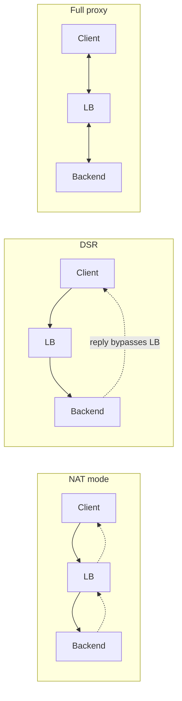

# Proxies, Gateways & Load Balancing (L4 vs L7)

A **proxy** is an intermediary that terminates one connection and originates another on
behalf of a client or a server. **Load balancers** are a specialized kind of proxy (or
packet forwarder) that spread traffic across a pool of backends. **API gateways** are L7
reverse proxies enriched with API-management logic. This topic is about the *mechanics* —
which OSI layer the box operates at, how it forwards packets vs connections, what it can
see and rewrite, and the trade-offs an interviewer will probe. It is vendor- and
language-agnostic: no specific product or library is assumed.

> [!KEY-TAKEAWAY]
> The single most important axis is **which layer the device understands**. An **L4**
> load balancer forwards *connections/packets* (TCP/UDP) and is opaque to application
> content — fast, cheap, protocol-agnostic. An **L7** load balancer terminates the
> *application protocol* (usually HTTP), so it can route on path/host/header, but it must
> parse and re-originate the request — richer, but more CPU and a real endpoint.

---

## Forward proxy vs reverse proxy

Both sit between client and server; the difference is **whom they act on behalf of** and
**who knows they exist**.

**Forward proxy** — sits in front of *clients*, on the client's side of the network. The
client is (usually) explicitly configured to send traffic through it. It acts on behalf of
the client to reach arbitrary origin servers. Uses: corporate egress filtering, caching,
anonymity, bypassing geo-restrictions, content inspection. The origin server sees the
proxy's IP, not the client's.

- For plaintext HTTP the client sends an absolute-form request line
  (`GET http://example.com/x HTTP/1.1`).
- For HTTPS the client issues an **HTTP `CONNECT`** request to open a blind TCP tunnel; the
  proxy just relays encrypted bytes and cannot see inside without a
  man-in-the-middle/TLS-interception setup with a trusted CA.

**Reverse proxy** — sits in front of *servers*, on the server's side. Clients think they
are talking directly to the origin; they are unaware of it. It acts on behalf of the
server/service. Uses: load balancing, TLS termination, caching, compression, WAF,
request routing, hiding backend topology. This is what CDNs, ingress controllers, and API
gateways are.

| | Forward proxy | Reverse proxy |
|---|---|---|
| Protects/serves | the client | the server |
| Who configures it | client (explicit) | server operator |
| Client aware of it? | usually yes | usually no |
| Sees origin selection | client picks origin | proxy picks backend |
| Typical use | egress control, caching, anonymity | LB, TLS term, WAF, routing |

> [!TIP]
> Same software (e.g. a generic HTTP proxy) can be either — the label is about **direction
> and intent**, not the binary. "Forward = for clients reaching out; reverse = for servers
> being reached."

---

## API gateway role

An **API gateway** is an L7 reverse proxy specialized for API traffic. It is the single
entry point ("front door") for a set of backend services and offloads cross-cutting
concerns so services don't each reimplement them:

- **Routing / composition** — map external paths to internal services; sometimes aggregate
  several backend calls into one response.
- **Authentication & authorization** — validate API keys, JWTs, OAuth tokens, mTLS.
- **Rate limiting / throttling / quotas** — protect backends from overload and abuse.
- **TLS termination**, request/response transformation, protocol translation
  (e.g. REST↔gRPC, HTTP/1.1↔HTTP/2 to the backend).
- **Observability** — centralized logging, metrics, tracing, request IDs.

**Gateway vs plain load balancer:** a load balancer answers "which healthy backend gets
this connection?"; a gateway answers that *plus* "is this caller allowed, within quota, and
does the request need transforming/authenticating first?" A gateway is API-aware policy; an
LB is traffic distribution.

**Gateway vs service mesh:** an API gateway handles **north–south** traffic (external
clients → cluster edge). A service mesh (sidecar proxies) handles **east–west** traffic
(service ↔ service inside the cluster). They complement each other; the gateway is the
edge, the mesh is the interior.

> [!WARNING]
> Don't put business logic in the gateway. It becomes a shared bottleneck and a deployment
> chokepoint ("distributed monolith at the edge"). Keep it to cross-cutting concerns.

---

## L4 load balancing (transport layer)

An **L4** load balancer operates at the transport layer (TCP/UDP). It makes its forwarding
decision using the **4-tuple** (source IP, source port, dest IP, dest port) plus protocol,
without parsing the application payload. It is **connection-** or **packet-oriented** and
**opaque** to what's inside.

**Characteristics:**
- Extremely fast and low-latency; minimal per-packet work; can push huge throughput.
- Protocol-agnostic — works for HTTP, SMTP, databases, game/UDP traffic, anything on TCP/UDP.
- Cannot see hostnames, URLs, headers, or cookies (they're above L4, and encrypted if TLS).
- A backend choice is typically pinned **per connection**: once a TCP connection is pinned
  to backend B, all its packets go to B for the connection's life.
- One client TCP connection maps to one backend connection (or is forwarded verbatim).

**How it forwards** — usually one of: NAT (rewrite dest IP/port and track state), Direct
Server Return, or tunneling (encapsulate the packet, e.g. IPIP/GRE). See the NAT-vs-proxy
and DSR sections.

L4 is the right tool when the traffic isn't HTTP, when you need raw speed, when you must
pass TLS through untouched, or when you want the LB to be a lightweight packet mover rather
than a protocol endpoint.

---

## L7 load balancing (application layer)

An **L7** load balancer terminates the **application protocol** — almost always HTTP(S) —
and therefore understands requests. It reads the request line, `Host` header, path, method,
cookies, and other headers, and routes based on **content**.

**Characteristics:**
- **Content-based routing:** `Host: api.example.com` → API pool, `/images/*` → static pool,
  `/checkout` → payments pool. Header/cookie/method-based routing.
- Can modify requests/responses: rewrite paths, inject/strip headers (e.g.
  `X-Forwarded-For`), compress, cache.
- Terminates the client connection and opens its **own** connection(s) to backends, so it
  can **multiplex/pool** many client requests onto a few reusable backend connections and
  even bridge protocols (HTTP/2 in front, HTTP/1.1 to backend).
- Enables per-request load balancing: two requests on the *same* client connection can go to
  *different* backends (especially with HTTP/2 multiplexing).
- Higher CPU cost (parse + often TLS terminate), and it is a real HTTP endpoint (so it must
  handle HTTP correctly, buffering, timeouts, etc.).

> [!INTERVIEW]
> "Can an L4 load balancer route based on URL path?" — No. The path lives in the HTTP
> request line at L7 and, under HTTPS, is encrypted. An L4 LB never parses it. (One nuance:
> it *can* peek at the TLS **SNI** in the ClientHello — that's cleartext — to route by
> hostname without decrypting. That's "L4 with SNI routing," still not payload parsing.)

---

## L4 vs L7: when to use which

| Dimension | L4 | L7 |
|---|---|---|
| OSI layer | Transport (TCP/UDP) | Application (HTTP) |
| Routing key | 4-tuple (+ maybe SNI) | host, path, header, cookie, method |
| Sees payload | No (opaque/encrypted) | Yes (terminates protocol) |
| Speed / overhead | Very fast, low CPU | Slower, more CPU |
| TLS | passthrough (or SNI peek) | usually terminates |
| Protocols | any TCP/UDP | HTTP(S), gRPC, WebSocket |
| Granularity | per connection | per request |
| Health checks | TCP connect / port | HTTP status / body |
| Rewrites/headers | none | full |

**Choose L4 when:** non-HTTP protocols; raw throughput/low latency; you must not terminate
TLS (compliance/end-to-end encryption, passthrough); simple stateless distribution; you
want the LB out of the crypto path.

**Choose L7 when:** you need path/host-based routing, canary/blue-green by header, sticky
sessions by cookie, request rewriting, WAF, response caching/compression, per-request
balancing, or protocol bridging.

**Common real design:** an L4 LB at the very edge (fast, absorbs volume, handles DDoS,
DSR) fronts a fleet of L7 proxies that do the smart HTTP routing. Layering gives speed +
intelligence.

---

## Load-balancing algorithms

How the LB picks a backend from the healthy pool:

- **Round robin** — hand each new request/connection to the next backend in rotation.
  Simple and fair *only if* backends are equal and requests cost the same. Ignores actual
  load.
- **Weighted round robin** — assign weights (e.g. bigger boxes get weight 3) so stronger
  backends receive proportionally more. Good for heterogeneous hardware or gradual rollout
  (send 5% to a new version).
- **Least connections** — send to the backend with the fewest active connections. Adapts to
  uneven request durations (long-lived connections, slow requests) far better than round
  robin. **Weighted least connections** combines both.
- **Least response time / least load** — pick the backend with lowest latency (or a blended
  metric). Needs live measurement.
- **IP hash / consistent hashing** — hash the client IP (or 4-tuple, or a key) to a backend
  deterministically, so the same client keeps landing on the same backend (a form of
  session affinity that needs no cookie). **Consistent hashing** minimizes remapping when
  the pool changes size (only ~1/N keys move), which matters for cache-server pools.
- **Random / random-of-two ("power of two choices")** — pick two backends at random and
  send to the less loaded of the two; cheap and surprisingly close to optimal. *Why two
  samples help so much:* throwing `n` requests at `n` backends purely at random leaves the
  busiest backend with roughly `ln n / ln ln n` more than average, but sampling **two** and
  taking the lesser drops that gap to about `ln ln n / ln 2` — an **exponential**
  improvement — so a single extra sample kills the "unlucky hot node" that pure random (and
  round-robin under skew) both suffer, without the coordination cost of true least-connections.

**Worked example — round robin overloading a node.** Three equal backends A, B, C, all
idle. Requests arrive one per 100 ms, alternating **expensive** (2000 ms) and **cheap**
(10 ms): req1 exp, req2 cheap, req3 exp, req4 cheap, req5 exp, req6 cheap. Round robin
hands them out in strict rotation A, B, C, A, B, C:

| Req (cost) | Arrives | RR target | Still in flight there? |
|---|---|---|---|
| 1 (2000ms) | t=0   | A | A busy until t=2000 |
| 2 (10ms)   | t=100 | B | B free at t=110 |
| 3 (2000ms) | t=200 | C | C busy until t=2200 |
| 4 (10ms)   | t=300 | A | **A still busy** (req1) → queues behind it |
| 5 (2000ms) | t=400 | B | B busy until t=2400 |
| 6 (10ms)   | t=500 | C | **C still busy** (req3) → queues |

The rotation blindly put cheap req4 back onto A **while req1's 2000 ms job was still
running** — even though B had been free since t=110 — so a 10 ms request waits ~1.7 s
(t=300 until A frees at t=2000) behind an unrelated slow job, and cheap req6 similarly
queues on C behind req3. Round robin counts *turns*, not *work in flight*.

Now **least connections** on the same arrivals (route to fewest active connections; ties
broken A<B<C). Each backend runs one request at a time, so "active" is 0 or 1; the counts
are *just before* each arrival:

| Req (cost) | Arrives | Active {A,B,C} | Picks | Why / effect |
|---|---|---|---|---|
| 1 (exp)   | t=0   | {0,0,0} | A | tie → A; A busy until t=2000 |
| 2 (cheap) | t=100 | {1,0,0} | B | A busy; B,C idle, tie → B; B busy until t=110 |
| 3 (exp)   | t=200 | {1,0,0} | B | B freed at t=110; tie B,C → B; B busy until t=2200 |
| 4 (cheap) | t=300 | {1,1,0} | C | A,B busy; C idle → C; done t=310 (no queue) |
| 5 (exp)   | t=400 | {1,1,0} | C | C freed at t=310 → C; C busy until t=2400 |
| 6 (cheap) | t=500 | {1,1,1} | A | all busy, tie → A; A still running req1 → queues ~1.5 s |

The three expensive jobs (1, 3, 5) each land on a **different** backend (A, B, C), and cheap
reqs 2 and 4 each hit an idle node and finish instantly. Only cheap req6 queues — and only
because by t=500 *all three* backends are mid-way through a 2000 ms job, so **no** policy could
have avoided it. Contrast round robin, where cheap req4 queued on A *while B sat idle*. Least
connections adapts to work-in-flight, so it halves the head-of-line blocking here (one cheap
request delayed instead of two) — it just can't conjure capacity once every backend is saturated.

> [!TIP]
> Round robin is the classic default, but **least connections** is usually the better
> general-purpose choice when request costs or durations vary. Interviewers love the
> follow-up "why can round robin overload one node?" — because it ignores that some
> requests are slow/long-lived.

---

## TLS termination vs passthrough vs re-encryption

Three ways an LB/proxy can handle TLS:

- **TLS termination (offload):** the LB holds the certificate/private key, decrypts the TLS
  connection, and talks **plaintext HTTP** to the backends over the (trusted) internal
  network. Pros: backends offload crypto CPU, the LB can inspect/route/rewrite/cache/WAF,
  centralized cert management. Cons: traffic is cleartext inside; the LB is a high-value key
  holder; not end-to-end encrypted.
- **TLS passthrough:** the LB does **not** decrypt; it forwards the encrypted bytes to a
  backend that terminates TLS itself. Preserves true end-to-end encryption; the LB can't see
  or route on HTTP content (it can only route on 4-tuple or **SNI**). Needed for strict
  compliance/mTLS-to-backend or when the LB must stay out of the crypto path. This is inherently an L4 behavior.
- **TLS re-encryption (bridging / end-to-end):** the LB terminates the client TLS (so it can
  inspect/route at L7) **and** opens a *new* TLS connection to the backend. Content is
  visible at the LB but encrypted on both hops. Best of both when you need L7 features *and*
  encryption on the wire to backends (e.g. zero-trust internal networks). Extra CPU for two
  TLS sessions.

| | Termination | Passthrough | Re-encryption |
|---|---|---|---|
| LB decrypts? | Yes | No | Yes |
| Encrypted LB→backend? | No (plaintext) | Yes (same session) | Yes (new session) |
| LB sees HTTP content? | Yes | No | Yes |
| L7 routing/WAF/cache? | Yes | No | Yes |
| End-to-end encrypted? | No | Yes | Two hops, both encrypted |
| Backend crypto load | Low | High | High |

> [!WARNING]
> With TLS termination, the internal hop is plaintext. If your threat model includes the
> internal network (zero-trust), use **re-encryption**, not plain termination.

---

## Health checks

An LB must only send traffic to **healthy** backends. It probes them and removes failing
ones from rotation, re-adding them when they recover.

- **Active health checks:** the LB proactively probes on an interval.
  - **L4 check:** open a TCP connection to the port (or send a UDP probe). Confirms the port
    is listening — but a process can accept connections while being unable to serve requests.
  - **L7 check:** send an HTTP request (e.g. `GET /healthz`) and require a specific status
    (200) and/or body. Much more meaningful — verifies the app actually works, DB reachable,
    etc.
- **Passive health checks (outlier detection):** infer health from real traffic — e.g. if a
  backend returns 5xx or times out N times, eject it temporarily. No probe overhead; reacts
  to real failures.
- **Key parameters:** interval, timeout, **unhealthy threshold** (consecutive failures to
  eject) and **healthy threshold** (consecutive successes to re-add). Thresholds add
  hysteresis so a single blip doesn't flap a node in and out.

> [!TIP]
> Distinguish a **liveness** check ("is the process up?") from a **readiness/deep** check
> ("can it serve — dependencies OK?"). A health endpoint that also pings critical
> dependencies catches "up but broken" backends that a bare TCP check misses — but make it
> cheap, or the check itself becomes a load source and a cascading-failure risk.

---

## Sticky sessions (session affinity)

**Sticky sessions** pin a given client to the same backend across multiple requests. Needed
when a backend holds **local session state** (in-memory session, local cache, a
long-running upload/WebSocket) that other backends don't share.

Mechanisms (L7):
- **Cookie-based affinity:**
  - *LB-inserted cookie* — the LB sets its own cookie (e.g. identifying backend B) and reads
    it on later requests to route back to B. The app doesn't need to know.
  - *Application cookie* — the LB keys affinity off an existing app cookie (e.g. a session
    id).
- **Source-IP affinity (L4):** hash client IP to a backend. Simple, but breaks when many
  clients share one IP (corporate NAT/CGNAT → one backend gets everyone) and when a client's
  IP changes (mobile).

**Trade-offs / gotchas:**
- Stickiness undermines even load distribution and complicates **draining/scaling**: when a
  sticky backend dies, its clients lose their session state anyway.
- Affinity duration and what happens on backend failure both matter.

> [!INTERVIEW]
> The senior answer: sticky sessions are a **crutch for stateful backends**. Prefer
> **stateless services** with session state in a shared store (Redis/DB) or a signed cookie
> (client-held). Then any backend can serve any request and you can load balance freely,
> deploy without draining sessions, and scale horizontally. Reach for stickiness only when
> you truly can't externalize state (e.g. WebSocket connections, which are inherently pinned
> to one backend for the connection's life).

---

## X-Forwarded-For and the Forwarded header

When a reverse proxy/LB terminates the client connection, the backend sees the **proxy's**
source IP, not the client's. To preserve the real client IP (for logging, geo, rate
limiting, ACLs), proxies inject headers:

- **`X-Forwarded-For` (XFF):** de-facto standard, comma-separated list of IPs. Each proxy
  **appends** the address it received the request from, building a left-to-right chain:
  `X-Forwarded-For: <client>, <proxy1>, <proxy2>`. The **leftmost** is (claimed to be) the
  original client; each hop to the right is the next proxy.
- Companions: **`X-Forwarded-Proto`** (`http`/`https` the client used — important after TLS
  termination so the app knows the client was on HTTPS), **`X-Forwarded-Host`**,
  **`X-Forwarded-Port`**.
- **`Forwarded`** (RFC 7239) is the standardized single header replacing the ad-hoc `X-`
  set:
  `Forwarded: for=192.0.2.60;proto=http;by=203.0.113.43`, and can carry multiple `for=`
  entries for a chain. Adopted less widely than XFF in practice.

> [!WARNING]
> **XFF is client-controllable and trivially spoofable.** A client can send
> `X-Forwarded-For: 1.2.3.4` and, if you blindly trust the leftmost value for security
> (IP allowlists, rate limits), you've been fooled. Trust XFF **only** from proxies you
> control, and derive the real client by counting a known number of trusted hops from the
> right (or configure trusted-proxy CIDRs). The address your edge actually received the
> packet from — the L4 peer — is the only truly trustworthy source IP.

---

## Direct Server Return (DSR)

**Direct Server Return** (a.k.a. direct routing / DR mode) is an L4 technique where request
traffic goes **client → LB → backend**, but the backend sends the response **directly back
to the client**, bypassing the LB on the return path.

**How it works:** the LB forwards the request packet without rewriting the destination IP
(often via L2 MAC rewrite or L3 tunneling like IPIP/GRE). Each backend is configured with
the **service VIP** on a loopback (non-ARPing) interface, so it accepts packets addressed to
the VIP and sends replies with the VIP as the source IP straight to the client.

**Why:** in many workloads (streaming, downloads, video) responses are far larger than
requests. Keeping the response off the LB removes it as a bandwidth bottleneck and lets it
scale to enormous throughput — it only handles the small inbound half.

**Limitations / gotchas:**
- The LB never sees responses, so it **can't do L7 processing, response rewriting, or
  connection-level tracking of the reply** — DSR is inherently L4.
- Requires specific network topology (backends and LB on the same L2 segment for MAC-rewrite
  DSR, or tunneling) and loopback VIP + ARP suppression on backends. **Why suppress ARP:**
  the same VIP now lives on the LB *and* every backend's loopback. If a backend answered ARP
  "who has the VIP?", the switch would learn the backend's MAC for the VIP and deliver client
  traffic straight to that backend — bypassing the LB entirely (no balancing) and causing
  duplicate-IP conflicts as multiple hosts claim the address. So backends must be configured
  **not** to ARP-announce or ARP-reply for the VIP (`arp_ignore`/`arp_announce`, or hiding it
  on a non-ARPing loopback); only the LB answers ARP for the VIP, so all inbound client
  packets still land on the LB first.
- Health checking and connection state are trickier since the LB sees only one direction.

---

## NAT mode vs proxy mode

Two fundamentally different ways an intermediary forwards traffic:

**NAT mode (L4, packet-level):** the LB rewrites packet headers and forwards packets. It's a
router-with-a-twist, tracking connection state in a table.
- **Destination NAT (DNAT):** rewrite the dest IP/port from VIP → chosen backend on the way
  in; rewrite it back on the way out. Replies **must** traverse the LB (so it can un-NAT),
  which means the LB (or the backend's default route pointing at it) is on the return path.
- The backend often sees the **client's real source IP** (in one-arm DNAT-only setups) — a
  plus for logging.
- Low overhead: no connection termination, no payload parsing. But return traffic through
  the LB can be a bottleneck (unlike DSR).

**Proxy mode (full proxy, connection-level):** the LB **terminates** the client's TCP
connection and opens a **separate** TCP connection to the backend. There are two independent
connections stitched together.
- The backend sees the **LB's** IP as source (hence the need for `X-Forwarded-For`).
- Enables connection pooling/multiplexing, buffering (absorb slow clients), independent
  TCP tuning per side, TLS termination, and all L7 features.
- Higher resource cost (state + buffers for two connections each), but far more capable.
  This is how every L7 proxy works.

| | NAT mode | Proxy (full-proxy) mode |
|---|---|---|
| Layer | L4 | L4-terminate or L7 |
| Connections | one, packets rewritten | two separate connections |
| Backend sees source | client IP (typ.) | LB IP (use XFF) |
| Return path | via LB (to un-NAT) | via LB (owns the connection) |
| L7 features | none | full |
| Overhead | low | higher |

The three return paths side by side (solid = request, dashed = response):

In NAT the reply retraces its steps through the LB (so it can un-NAT); in DSR the backend
answers the client directly; in full proxy the LB terminates both connections, so every byte
in each direction passes through it.

> [!KEY-TAKEAWAY]
> Three L4 forwarding styles, by return path and rewriting: **NAT** (LB rewrites dest,
> replies return through LB), **DSR** (LB forwards, replies bypass LB), and **full proxy**
> (LB owns both connections). Proxy mode is the only one that unlocks L7.

---

## Consistent hashing done right (ring and virtual nodes)

The one-liner in the algorithms section deserves the full mechanism, because it is the
marquee senior question here.

**Why `hash % N` breaks on membership change.** If you map a key to a backend with
`backend = hash(key) % N`, then changing `N` (adding or removing one node) changes the
divisor for *every* key. Going from 4→5 backends remaps roughly `(N-1)/N ≈ 80%` of keys.
For a cache pool that means an ~80% miss storm and a stampede onto origins; for session
affinity it means most clients suddenly land on a different backend. Modulo hashing only
survives if the pool never changes size — which production pools always do.

**The ring.** Consistent hashing maps both keys *and* backends onto a fixed circular
keyspace (e.g. `0 .. 2^32 - 1`). To find a key's backend, hash the key and walk
**clockwise** to the next backend point on the ring. Adding or removing a backend only
re-homes the keys in the *one arc* between the changed node and its predecessor — about
`K/N` keys — instead of nearly all of them. That bounded disruption is the whole point.

**Worked example — the ring in numbers.** Shrink the keyspace to `0..99` and place three
backends A@10, B@45, C@80. Route each key by hashing it, then walking **clockwise** to the
next backend point (wrapping past 99→0):

- key hashes to **5** → clockwise the first backend is A@10 → **A**
- key hashes to **30** → next backend clockwise is B@45 → **B**
- key hashes to **70** → next backend clockwise is C@80 → **C**
- key hashes to **90** → nothing until we wrap 99→0 and reach A@10 → **A** (the wrap arc)

So each backend owns the arc *ending at its point*: A owns `(80,10]` (i.e. 81..99 and
0..10), B owns `(10,45]`, C owns `(45,80]`.

Now **add D@50**. D owns the arc `(45,50]` — carved out of C's old arc `(45,80]`. The only
keys that move are those hashing into **46..50**: our key at 30 stays on B, at 70 stays on
C, at 5 stays on A. *Nothing* outside 46..50 is disturbed. Contrast `hash % N`: going
`3→4` backends changes the divisor for every key and remaps roughly `(N-1)/N = 3/4 ≈ 75%`
of them. The ring moved one small arc; modulo would have reshuffled three keys in four.

**Virtual nodes, concretely.** With one point each, A owns arc `(80,10]` (length 30), B
`(10,45]` (35), C `(45,80]` (35) — already uneven. Give C three points instead — C@22,
C@60, C@80 — and its share becomes three small arcs scattered around the circle rather than
one fat 35-wide slice, so no single unlucky hash range can dump a huge fraction on one box.
A heavier box simply gets *more* points and thus a bigger — but still smooth — total share:
that is exactly how weight is expressed. More points per box = smoother balance, at the cost
of more ring entries to store and search.

**Virtual nodes (replicas).** Placing each physical backend at a *single* ring point gives
badly uneven arcs (load skew) and can't express weights. The fix is **virtual nodes**: hash
each backend to *many* points (e.g. 100–1000 `hash(node#i)` positions). Averaging over many
small arcs smooths load toward even, and giving a bigger box proportionally more virtual
nodes expresses **weight**. More vnodes = smoother balance but more ring memory and lookup
cost. `ring-hash` in real proxies (Envoy) is exactly this.

## Maglev and rendezvous hashing

Two consistent-hashing families that avoid a literal ring.

**Maglev hashing** (Google, NSDI 2016) builds a fixed-size **lookup table** (size a prime,
e.g. 65537) instead of a ring. Each backend derives a `(offset, skip)` pair from a hash of
its name and thereby a **permutation** of table slots; slots are then filled by letting
backends take turns claiming their most-preferred still-empty slot. The result is a table
that is **near-perfectly evenly balanced** *and* changes only minimally when a backend is
added/removed, with **O(1) per-packet lookup** (index the table). That combination — even
spread + minimal disruption + constant-time lookup — is why Maglev-style hashing is the
modern standard for **per-packet L4 balancing at line rate** (Maglev, Katran, Cilium),
where a ring walk per packet would be too slow. Its disruption on membership change is
slightly worse than an idealized ring but negligible in practice.

**Worked example — filling a size-7 Maglev table.** Table slots `0..6`, backends A, B, C.
Each backend's `(offset, skip)` yields a **permutation** — the order in which it *prefers*
slots. Suppose the derived preference lists are:

- **A**: 0, 3, 6, 2, 5, 1, 4
- **B**: 1, 4, 0, 3, 6, 2, 5
- **C**: 2, 5, 1, 4, 0, 3, 6

Now backends **take turns** (A, then B, then C, repeat), each claiming its most-preferred
*still-empty* slot:

1. A wants 0 → free → **slot 0 = A**
2. B wants 1 → free → **slot 1 = B**
3. C wants 2 → free → **slot 2 = C**
4. A wants 3 → free → **slot 3 = A**
5. B wants 4 → free → **slot 4 = B**
6. C wants 5 → free → **slot 5 = C**
7. A wants 6 → free → **slot 6 = A**

All 7 slots filled. Final table: `[A, B, C, A, B, C, A]` → A owns 3 slots, B and C own 2
each — near-perfectly even for 7 slots / 3 backends (ideal is 2.33 each). A packet's
Connection-ID hashes to a slot index, e.g. `hash=17 → 17 mod 7 = 3 → slot 3 = A`; that's
the whole per-packet lookup — one array index, **O(1)**, no ring walk.

**Removing a backend touches little.** Drop C and refill with just A and B taking turns:

1. A→0. 2. B→1. 3. A: 0 taken → **3**. 4. B: 1 taken → **4**. 5. A: 0,3 taken → **6**.
6. B (list 1,4,0,3,6,2,5): 1,4,0,3,6 all taken → first free is **2**. 7. A (list
0,3,6,2,5): 0,3,6,2 taken → **5**.

New table: `[A, B, B, A, B, A, A]`. Compare to the old `[A, B, C, A, B, C, A]`: slots 0,
1, 3, 4, 6 are unchanged — only C's two slots (2 and 5) got reassigned. A modulo scheme
(`hash mod 3` → `hash mod 2`) would instead have moved a *majority* of keys. That "only the
departed node's share moves" is Maglev's minimal-disruption property.

**Rendezvous / Highest-Random-Weight (HRW) hashing.** For a key, compute `hash(key, node)`
for **every** node and pick the node with the maximum score. Removing a node only affects
the keys that scored highest on *that* node (they fall to their next-highest), so
disruption is minimal and there is no ring or virtual-node bookkeeping to maintain. The
cost is **O(N) per lookup** (score every node), so HRW suits smaller pools or where the
per-key work is amortized. Weights are handled by a weighted scoring function.

| | Ring (with vnodes) | Maglev table | Rendezvous (HRW) |
|---|---|---|---|
| Lookup cost | O(log V) ring search | O(1) table index | O(N) score all nodes |
| Balance quality | good with many vnodes | near-perfect | good |
| Disruption on change | minimal (~K/N) | minimal | minimal |
| State to keep | ring of V points | prime-size table | none (recompute) |
| Typical use | L7 affinity, caches | per-packet L4 at scale | small pools, no state |

## Connection draining and graceful backend removal

Removing a backend (deploy, scale-in, deregister) without dropping live work requires
**draining**: stop sending it *new* connections/requests while letting *in-flight* ones
finish, up to a **drain timeout / deregistration delay**. After the timeout, remaining
connections are force-closed.

- **Lame-duck mode:** the backend deliberately starts *failing its health check* (or
  advertises "not ready") so the LB bleeds traffic off it *before* the process shuts down,
  turning an abrupt removal into a graceful one. Ties into Kubernetes readiness gates.
- **Telling clients to stop reusing a connection:** on HTTP/1.1 the proxy can send
  `Connection: close` so the client opens a fresh connection (which lands on a live
  backend). On HTTP/2 it sends a **`GOAWAY` frame (RFC 9113 §6.8)**: the peer finishes
  streams below the last-stream-ID and opens a new connection for anything else — the clean
  way to rebalance long-lived multiplexed connections.
- **Order matters:** deregister from the LB / go lame-duck **first**, wait a drain window
  so in-flight requests and health-check propagation complete, *then* stop the process.
  Stopping first (or with too short a drain) drops requests and causes connection resets.

## Load balancing HTTP/2 and gRPC long-lived connections

HTTP/2 (and gRPC over it) multiplexes many requests over **one long-lived TCP connection**.
An **L4** LB — and even an L7 LB that only balances at *connection* establishment — pins
that whole connection to a single backend. So all of a client's requests pile onto one
server, and **newly added backends receive zero traffic** until clients happen to
reconnect. Classic symptom: you scale from 3→13 pods and the 3 original pods stay pegged at
100% CPU while the 10 new ones idle.

Fixes:
- **L7 proxy that balances per-stream/per-request** — it terminates HTTP/2 and can send
  each request (stream) to a different backend, spreading load immediately.
- **Client-side (thick-client) load balancing** — the client is given the full endpoint
  list and balances requests across its own subchannels/connections, one per backend.
- **Lookaside / one-arm balancing (gRPC-LB, xDS)** — clients ask a **control plane** for
  the current endpoint set, then connect **directly** to backends, keeping data-path
  latency low while centralizing the membership/policy decision.
- **Connection recycling** — set a **max-connection-age** so the server periodically sends
  `GOAWAY`, forcing clients to reconnect and rebalance onto newer backends even under a
  dumb L4 LB.

## Transparent (intercepting) proxies

A **transparent (intercepting) proxy** processes traffic with **no client configuration** —
the client isn't pointed at a proxy; the network *redirects* its packets into one (via
routing policy, WCCP, or an `iptables`/eBPF redirect on the local host). Because the client
never addressed the proxy, the proxy must handle the destination the client intended.

- **Preserving the client IP to the backend:** with `TPROXY` / `IP_TRANSPARENT`-style
  interception the proxy can originate the backend connection **spoofing the client's
  source IP**, so the backend still sees the real client — something an ordinary
  connection-terminating proxy can't do (it would use its own IP).
- **Where it shows up:** CGNAT and carrier boxes, captive portals, corporate content
  inspection, and **service-mesh sidecars** (the mesh's `iptables`/eBPF rules transparently
  redirect a pod's outbound traffic into the local sidecar). This is the third category
  alongside forward and reverse proxies: forward = client explicitly configured; reverse =
  server-side and client-unaware; transparent = client-unaware *and* unconfigured, spliced
  in by the network.

## PROXY protocol (v1 and v2)

The **PROXY protocol** (HAProxy spec) carries the *real* client address across an **L4**
proxy that would otherwise hide it — because at L4 there is no HTTP layer in which to put an
`X-Forwarded-For`. The sender prepends a small header **before any application bytes**, then
the original stream follows unchanged.

- **v1** — a human-readable ASCII line:
  `PROXY TCP4 198.51.100.7 203.0.113.5 56324 443\r\n` (protocol/family, src IP, dst IP, src
  port, dst port).
- **v2** — binary, beginning with a fixed **12-byte signature**
  (`\x0D\x0A\x0D\x0A\x00\x0D\x0A\x51\x55\x49\x54\x0A`), then a version/command byte, an
  address-family/transport byte, length, the addresses, and optional **TLV** extensions
  (e.g. ALPN, SNI/authority, TLS details, cloud VPC-endpoint IDs). Binary parsing is cheaper
  and unambiguous.
- **Security:** the receiver **must accept the PROXY header only from trusted senders**
  (an allowlist of upstream proxy IPs) and, when configured to expect it, **must reject
  connections that lack it**. Otherwise any client could prepend a forged PROXY line and
  spoof its source IP — the same trust problem as XFF, one layer down.

## Outlier detection and the panic threshold

Passive health checking has real internals beyond "eject after N 5xx":

- **Ejection triggers:** **consecutive-5xx**, **consecutive-gateway-failure** (502/503/504
  or connect failures), and **success-rate / statistical** ejection (eject hosts whose
  success rate is a set number of standard deviations below the pool mean).
- **Bounded, escalating ejection:** ejection time grows (often exponentially) with repeat
  offenses, but **`max-ejection-percent`** caps how much of the pool can be ejected at once
  so you never remove everything.
- **Panic mode / panic threshold:** when the *healthy fraction* of the pool drops below a
  threshold (Envoy default **50%**), the LB concludes its health view is probably wrong
  (correlated failure, bad probe) and **ignores health status, load-balancing across all
  hosts** rather than hammering the handful still marked healthy. This is why "half the
  fleet fails health checks and latency gets *worse*, not better" — the LB has entered panic
  mode and is spraying traffic at hosts it just marked unhealthy, which is usually the safer
  bet during a correlated event.

## Slow start for new backends

A backend that just joined (or just recovered) has cold caches, un-JITed code, empty
connection pools, and lazy-loaded config. If least-connections or round robin gives it a
full, instant share, it can be swamped and time out — looking unhealthy and flapping.
**Slow start** ramps its weight up gradually over a window (e.g. linearly over 30–60 s) so
it warms up under partial load before taking its full share. Pairs naturally with health
checks and connection draining as the "add" side of graceful membership changes.

## Load balancing QUIC and HTTP/3

HTTP/3 runs over **QUIC (RFC 9000)** on **UDP**, which breaks the L4 assumption that the
**4-tuple** identifies a flow:

- QUIC supports **connection migration** (RFC 9000 §9): a client can change its IP/port
  (Wi-Fi → cellular, NAT rebinding) and keep the *same* QUIC connection alive. So the
  4-tuple is not a stable routing key — a migrating client would be re-hashed to a different
  backend mid-connection and dropped.
- QUIC identifies connections by **Connection IDs (RFC 9000 §5.1)**, carried in the packet
  header, not by the 4-tuple. An L4 LB must route on the **Destination Connection ID**. The
  **QUIC-LB draft** has the server encode a routing prefix into the CID it issues, so any LB
  node can map a CID back to the right backend without shared state — the QUIC analog of
  connection tracking.
- Only the first flight is minimally visible; almost everything (including much of the
  handshake) is encrypted, and **stateless reset** must be handled. Practically: balance
  QUIC on the CID, and design the CID-encoding so an ECMP re-pin still resolves to the same
  backend.

## Encrypted Client Hello (ECH) and SNI routing

L4/passthrough hostname routing relies on the **cleartext SNI** in the TLS ClientHello.
**Encrypted Client Hello (ECH)** — a TLS 1.3 extension (`encrypted_client_hello`, current
IETF draft, built on RFC 8446 + HPKE) — encrypts the *inner* ClientHello, including
`server_name`, so a passthrough LB sees only the **outer/public** name (typically a shared
provider front). The consequence: **SNI-based routing silently stops working** for
ECH-enabled clients — a fraction of clients suddenly can't be routed to the right pool. To
route those you must either terminate TLS at a node that can decrypt the inner hello (e.g.
the shared frontend that owns the ECH keys) or route them by the outer name. It is the
sharp modern counter to "just route on SNI."

## HTTP request smuggling

When a front-end proxy and a back-end server **disagree on where one request ends and the
next begins**, an attacker can smuggle a second request inside the first — poisoning caches,
bypassing auth/WAF, or hijacking another user's request. This is precisely a *proxy*
problem, because it lives at the boundary where one hop parses and re-emits requests.

- **CL.TE / TE.CL:** the request carries *both* `Content-Length` and `Transfer-Encoding:
  chunked`; front-end honors one, back-end honors the other, so their boundaries differ.
- **TE.TE:** both honor `Transfer-Encoding`, but one is fooled by an **obfuscated** header
  (`Transfer-Encoding: xchunked`, duplicate/space tricks) into ignoring it.
- **H2.CL / H2.TE:** HTTP/2 front-end **downgrades** to HTTP/1.1 to the back-end and
  mis-serializes length/chunking, smuggling on the downgrade.
- **Mitigation:** **RFC 9112 §6.3** says when both `Content-Length` and `Transfer-Encoding`
  are present, `Transfer-Encoding` overrides `Content-Length` and the message ought to be
  handled as an error (a server MAY reject it — §6.1); normalize and reject conflicting or
  malformed framing; prefer **HTTP/2
  end-to-end** (no downgrade); and use the *same* strict parser on both hops. A caching
  proxy in front makes a successful smuggle worse (poisoned entries served to many users).

## ECMP and anycast for scaling L4 fleets

A single L4 LB node can't scale infinitely, so a **fleet** of LB nodes all advertise the
same VIP and routers spread flows across them with **ECMP** (equal-cost multi-path),
hashing the packet's 4-tuple to pick an LB node. Two consequences:

- ECMP is (mostly) **stateless** and can **re-pin** a flow to a *different* LB node when the
  LB set changes (a node dies/joins and the hash buckets shift). If that new LB node picks a
  *different backend*, the live connection breaks. The fix: every LB node must independently
  choose the **same** backend for a given flow — which is exactly why **Maglev/consistent
  hashing plus connection tracking** live at the LB tier, not just the cache tier. This is
  the staff-level reason consistent hashing matters at the balancer itself.
- **Anycast VIP:** advertise the same VIP from many geographic sites via BGP; clients reach
  the nearest site (latency, and DDoS absorption/spread). Combined with ECMP inside each
  site, you get global + local horizontal scale for a stateless-ish L4 layer, typically
  paired with **DSR** so responses skip the LB.

## Timeouts, buffering, and streaming

A proxy owns several **distinct** timeouts, and conflating them causes outages:

- **Connect timeout** — how long to wait establishing the backend TCP/TLS connection.
- **Idle / keepalive timeout** — how long an *established but quiet* connection may sit
  before being closed (mismatched client/backend idle timeouts cause "connection reset"
  races).
- **Request (per-try) timeout** — max time for a single request/response.
- **Overall/route timeout** — budget across retries.

**Buffering vs streaming:** a **buffering** proxy fully reads the client's request (and/or
the backend's response) before forwarding, which absorbs **slow clients** and defends
against **Slowloris** (many trickle-fed partial requests holding connections open). But
buffering **breaks streaming** workloads — Server-Sent Events, gRPC streaming, large
uploads/downloads, long-poll — which need **pass-through/streaming** mode so bytes flow as
they arrive. Also note **head-of-line blocking**: HTTP/1.1 pipelining blocks behind the
slowest response on a connection, whereas HTTP/2 streams don't (at the HTTP layer) —
though they still share one TCP connection, so packet loss stalls all streams (fixed by
HTTP/3/QUIC's independent streams).

## Retries, hedging, and idempotency at the proxy

Proxies can retry failed requests, but doing it naively turns a small incident into an
outage:

- **Only retry safe/idempotent requests** — GET/HEAD/PUT/DELETE (per HTTP semantics) or
  requests carrying an **idempotency key**. Blindly retrying a POST can double-charge or
  double-create.
- **Retry storms / amplification:** if every layer retries 3×, a deep call stack multiplies
  load (3×3×3 = 27×) exactly when the system is already failing. Mitigate with **retry
  budgets** (cap retries to, say, 10–20% of requests) and **circuit breaking** (stop sending
  to a failing backend/dependency entirely for a cooldown).
- **Request hedging:** send a *second* copy of a (idempotent) request to another backend
  after a latency threshold (e.g. p95) and take whichever responds first, trading extra load
  for tail-latency reduction. Cost must be bounded (hedge budget) or it becomes a
  self-inflicted retry storm.

## Service mesh, xDS, and the gateway boundary

Deepening the gateway-vs-mesh split:

- **xDS control plane:** both API gateways and service meshes are increasingly configured by
  the **xDS** family of APIs — **LDS** (listeners), **RDS** (routes), **CDS** (clusters),
  **EDS** (endpoints) — that stream config to data-plane proxies. The **lookaside/xDS** gRPC
  balancing above is the same idea: a control plane owns membership/policy, the data plane
  owns bytes.
- **Sidecar vs sidecarless / ambient mesh:** the 2024–25 shift moves the per-request L7 work
  out of a per-pod sidecar into a **per-node L4 layer** plus a shared **waypoint** proxy for
  L7 — cutting the sidecar's memory/latency tax while keeping mTLS and policy.
- **East-west identity:** a mesh secures service-to-service traffic with **mTLS** where
  identity is a **SPIFFE ID** carried in an **SVID** (X.509 or JWT), so services
  authenticate by cryptographic identity, not IP. This is where the mesh's security lives
  (east-west), complementing the gateway's north-south auth (API keys/JWT/OAuth).
- **Gateway API** is the emerging vendor-neutral standard for north-south ingress
  configuration, succeeding the older Ingress model.

## Common follow-up questions

- **"Difference between a load balancer and a reverse proxy?"** Every load balancer that
  terminates connections is a reverse proxy; not every reverse proxy load-balances (a single
  reverse proxy can front one backend for TLS/caching). "Load balancer" emphasizes
  distribution across a pool; "reverse proxy" emphasizes the intermediary role.
- **"Why can't an L4 LB do path-based routing?"** The path is in the HTTP request at L7 and
  is encrypted under HTTPS; L4 only sees the 4-tuple. It can at most peek at TLS SNI.
- **"How do you preserve the client IP through a proxy?"** L7: `X-Forwarded-For`/`Forwarded`
  (only trusted from your own proxies). L4: NAT mode or DSR can keep the real source IP; or
  use the PROXY protocol to carry it out-of-band to the backend.
- **"When would you terminate TLS at the LB vs pass it through?"** Terminate for L7 features
  and to offload backend CPU; pass through for end-to-end encryption/compliance; re-encrypt
  when you need both.
- **"Round robin vs least connections?"** Round robin ignores load and can overload a node
  when request durations vary; least connections adapts to that.
- **"How do sticky sessions hurt you?"** Uneven load, painful draining/scaling, lost state on
  failure — prefer stateless backends with shared session storage.
- **"What breaks source-IP stickiness?"** Shared NAT/CGNAT (many clients, one IP → one
  backend) and clients whose IP changes (mobile roaming).
- **"Why DSR?"** Asymmetric traffic (big responses) — keep the response off the LB so it
  isn't the bandwidth bottleneck; cost is losing L7 and reverse-path visibility.

## References

- RFC 9293 — Transmission Control Protocol (TCP)
- RFC 9110 — HTTP Semantics
- RFC 9112 — HTTP/1.1 (message framing, `CONNECT`)
- RFC 9113 — HTTP/2
- RFC 9114 — HTTP/3; RFC 9000 — QUIC
- RFC 8446 — TLS 1.3 (incl. SNI in ClientHello, `server_name` extension per RFC 6066)
- RFC 6066 — TLS Extensions (Server Name Indication)
- RFC 7239 — Forwarded HTTP Extension (standardized `Forwarded` header)
- RFC 6455 — The WebSocket Protocol (long-lived connections and stickiness)
- RFC 9113 §6.8 — HTTP/2 `GOAWAY` frame (graceful connection shutdown / rebalancing)
- RFC 9112 §6.1, §6.3 — HTTP/1.1 message length, `Content-Length` vs `Transfer-Encoding`
  precedence and rejection (request-smuggling defense)
- RFC 9000 §5.1 (Connection IDs), §9 (connection migration); QUIC-LB draft
- RFC 8446 — TLS 1.3; Encrypted Client Hello (`encrypted_client_hello`) IETF draft + HPKE
- Maglev: A Fast and Reliable Software Network Load Balancer (Eisenbud et al., NSDI 2016)
- Consistent hashing (Karger et al.) and Rendezvous / Highest-Random-Weight hashing
- SPIFFE/SVID identity, xDS (LDS/RDS/CDS/EDS) config APIs, and Gateway API
- HAProxy PROXY protocol specification v1/v2 (carrying original client address to backends)
- Cloudflare / NGINX / Envoy documentation — reverse proxy, L4/L7 load balancing, TLS
  termination vs passthrough, health checks, outlier detection / panic threshold, slow start,
  ring-hash/Maglev LB policies, session affinity (conceptual references)
