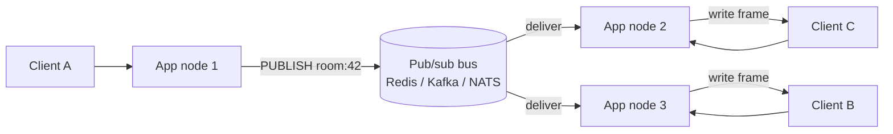

# WebSockets & Server-Sent Events (SSE)

HTTP's classic request/response model is fundamentally **client-driven**: the server can
only speak when spoken to. Real-time features — chat, live scores, collaborative editors,
trading tickers, notifications — need the *server* to push data to the client as events
happen. This topic covers the techniques that solve that problem at the protocol level:
short polling, long polling, **WebSocket** (RFC 6455, a distinct TCP-based protocol
bootstrapped from HTTP), and **Server-Sent Events / SSE** (a WHATWG standard that streams
events over a plain HTTP response). It stays at protocol/mechanics altitude — handshakes,
framing, headers, reconnect — not framework APIs.

> [!KEY-TAKEAWAY]
> WebSocket = **full-duplex**, bidirectional, binary-or-text, its own framed protocol over
> one TCP connection (upgraded from HTTP). SSE = **one-way** server→client, UTF-8 text
> only, plain `text/event-stream` HTTP response with built-in auto-reconnect. Polling =
> the client repeatedly asks over ordinary HTTP requests. Pick by direction, payload type,
> and infrastructure friendliness.

---

## The polling problem

**Why it matters.** Plain HTTP is half-duplex request/response and strictly
client-initiated. A server that learns something new (a new chat message, a price change)
has **no channel** to tell an already-loaded page. Historically the only workaround was to
have the client *ask again*. This is "polling," and it forces an awkward trade-off between
**latency** (how fresh the data is) and **overhead** (wasted requests/CPU/bandwidth).

The core tension:

- Poll **too often** → most responses are "nothing new," wasting a full HTTP round trip
  (TCP/TLS state, request/response headers, server work) each time.
- Poll **too rarely** → data is stale; the user sees an event seconds or minutes late.

Every HTTP request also carries **header overhead** (cookies, `User-Agent`, `Accept`,
etc.) that can dwarf a tiny "no updates" payload. At scale (say 100k clients polling every
2s), that is 50k requests/second of mostly-empty traffic. This overhead is what pushed the
industry toward long polling and then toward true push protocols (WebSocket, SSE).

> [!INTERVIEW]
> A classic opener: "The user needs live updates but HTTP is request/response — how?"
> Walk the ladder: short poll → long poll → SSE/WebSocket, naming the trade-off each rung
> removes (freshness vs. overhead vs. complexity vs. proxy-friendliness).

---

## Short polling vs long polling

Both use ordinary HTTP requests; they differ in **when the server responds**.

**Short polling.** The client sends a request on a fixed interval (e.g. every 3s). The
server answers **immediately** with either new data or an empty "nothing yet" response.
Simple and stateless, but wasteful and adds up to `interval` of latency.

**Long polling.** The client sends a request and the server **holds it open** (does not
respond) until it actually has data or a timeout fires. On response the client immediately
opens a new request. This gives near-real-time delivery over standard HTTP with no special
protocol — it works through virtually every proxy and firewall.

```
Short poll:                          Long poll:
C --GET /updates--> S  (empty)       C --GET /updates--> S     (server holds…)
   ...wait 3s...                          ...event occurs...
C --GET /updates--> S  (empty)       C <---- 200 {event} ---- S
   ...wait 3s...                      C --GET /updates--> S     (holds again)
C --GET /updates--> S  ({event})
```

Long-polling trade-offs / gotchas:

- **Latency**: near-instant on the *first* event, but there is a race window while the
  client is re-establishing the next request during which server events can be missed
  unless the server buffers by cursor/sequence id.
- **Server cost**: each waiting client ties up a connection (and, on thread-per-request
  servers, a thread) doing nothing — a scalability problem async servers mitigate.
- **Proxy timeouts**: intermediaries may kill idle connections, so servers cap the hold
  (e.g. 30–60s) and return empty, prompting a fresh poll.

> [!TIP]
> Long polling is still the standard **fallback** in libraries like Socket.IO when a
> WebSocket upgrade fails (blocked by a corporate proxy). It is not obsolete — it is the
> lowest-common-denominator that works nearly everywhere.

---

## WebSocket HTTP Upgrade handshake

**Why it matters.** WebSocket (RFC 6455) is a *separate* protocol (`ws://` / `wss://`),
but it deliberately **starts life as an HTTP/1.1 request** so it can share ports 80/443 and
traverse HTTP infrastructure. The opening handshake is an HTTP `GET` with an `Upgrade`
header; a successful server reply is **`101 Switching Protocols`**, after which the bytes on
that TCP connection are no longer HTTP — they are WebSocket frames.

Client request:

```
GET /chat HTTP/1.1
Host: example.com
Upgrade: websocket
Connection: Upgrade
Sec-WebSocket-Key: dGhlIHNhbXBsZSBub25jZQ==
Sec-WebSocket-Version: 13
Sec-WebSocket-Protocol: chat, superchat        (optional subprotocol negotiation)
Origin: https://example.com                    (browsers send this; server checks it)
```

Server response:

```
HTTP/1.1 101 Switching Protocols
Upgrade: websocket
Connection: Upgrade
Sec-WebSocket-Accept: s3pPLMBiTxaQ9kYGzzhZRbK+xOo=
Sec-WebSocket-Protocol: chat
```

The **`Sec-WebSocket-Accept`** value is computed deterministically:

```
accept = base64( SHA1( Sec-WebSocket-Key + "258EAFA5-E914-47DA-95CA-C5AB0DC85B11" ) )
```

The magic GUID `258EAFA5-E914-47DA-95CA-C5AB0DC85B11` is a fixed constant from RFC 6455.
This is **not** security — the `Sec-WebSocket-Key` is a random base64 nonce, not a secret.
Its purpose is to prove the server actually understands WebSocket (and to defend against
caching proxies / cross-protocol attacks replaying a plain HTTP response). `Sec-WebSocket-
Version: 13` is the only version defined by RFC 6455.

**Worked example — deriving the canonical accept value.** Take the exact key from the request
above and run the three steps (this reproduces RFC 6455 §1.3's own example):

1. **Concatenate** key + GUID into one string (no separator):
   `dGhlIHNhbXBsZSBub25jZQ==258EAFA5-E914-47DA-95CA-C5AB0DC85B11`
2. **SHA-1** that ASCII string → a 20-byte digest, in hex:
   `b3 7a 4f 2c c0 62 4f 16 90 f6 46 06 cf 38 59 45 b2 be c4 ea`
3. **Base64-encode** those 20 bytes (20 bytes → ceil(20/3)=7 groups → 28 chars incl. one `=`
   pad) → `s3pPLMBiTxaQ9kYGzzhZRbK+xOo=`

That final string is exactly the `Sec-WebSocket-Accept` the server returns. Note the client
never encrypts anything — any observer can compute the same value, which is why it's an
"understands-the-protocol" proof, not authentication.

Key facts interviewers probe:

- Status **101**, not 200. The `Connection: Upgrade` + `Upgrade: websocket` header pair is
  mandatory (these are hop-by-hop headers, which is why some proxies must be configured to
  forward them).
- After 101 the connection is a persistent, **full-duplex** TCP pipe; there is no more HTTP
  request/response structure.
- `Sec-WebSocket-Protocol` negotiates an application **subprotocol** (e.g. `wamp`, a chat
  format); the server echoes the one it picked. `Sec-WebSocket-Extensions` negotiates
  wire-level extensions like `permessage-deflate` compression.
- **Subprotocol vs extension — don't conflate them.** A *subprotocol*
  (`Sec-WebSocket-Protocol`) defines the **application-layer message grammar** that rides
  inside the frames — real examples: **WAMP, STOMP-over-WS, MQTT-over-WS,
  `graphql-ws` / `graphql-transport-ws`**. The server picks **exactly one** and echoes it, or
  omits the header entirely (no agreement — the app decides whether to proceed). An *extension*
  (`Sec-WebSocket-Extensions`) is a **wire transform** applied to the frames themselves —
  `permessage-deflate` is the only widely-deployed one. Subprotocol = what the bytes *mean*;
  extension = how the bytes are *encoded*.
- `wss://` runs the same handshake **inside TLS** on 443. Prefer it: `wss` handshakes
  survive intercepting proxies far better than plaintext `ws`.

> [!WARNING]
> The handshake is HTTP/1.1-shaped. Native WebSocket over HTTP/2 uses a different mechanism
> (extended CONNECT, RFC 8441) and over HTTP/3 (RFC 9220). The classic
> `Upgrade: websocket` header does **not** exist in HTTP/2 — HTTP/2 removed the `Upgrade`
> mechanism entirely.

**RFC 8441 mechanics (deeper).** For WebSocket to run over HTTP/2, the server first advertises
support by sending the **`SETTINGS_ENABLE_CONNECT_PROTOCOL`** (0x8) setting = 1 in its SETTINGS
frame. The client then opens the WebSocket with an **extended CONNECT** request: a `CONNECT`
whose new **`:protocol` pseudo-header = `websocket`** (alongside `:scheme`, `:path`,
`:authority`). The WebSocket then lives **inside a single HTTP/2 stream**, so it shares the one
TCP+TLS connection with other streams and is multiplexed — but it still **inherits TCP-level
head-of-line blocking**, because all H2 streams ride one TCP connection. RFC 9220 defines the
identical bootstrap for HTTP/3, where per-stream QUIC delivery finally removes that HOL
blocking. This is why "WebSocket over HTTP/2" saves a connection but does not fix HOL — see the
WebTransport section for the real fix.

---

## WebSocket framing and full-duplex data transfer

Once open, data moves as **frames**, not HTTP messages. Each frame has a compact binary
header (RFC 6455 §5.2):

```
 0                   1                   2                   3
 0 1 2 3 4 5 6 7 8 9 0 1 2 3 4 5 6 7 8 9 0 1 2 3 4 5 6 7 8 9 0 1
+-+-+-+-+-------+-+-------------+-------------------------------+
|F|R|R|R| opcode|M| Payload len |    Extended payload length    |
|I|S|S|S|  (4)  |A|     (7)     |             (16/64)           |
|N|V|V|V|       |S|             |                               |
| |1|2|3|       |K|             |                               |
+-+-+-+-+-------+-+-------------+ - - - - - - - - - - - - - - - +
```

Fields:

- **FIN** (1 bit): last frame of a message. A message can be split across many frames
  (fragmentation) using FIN=0 continuation frames.
- **RSV1–3**: reserved, 0 unless an extension (e.g. `permessage-deflate` uses RSV1) is
  negotiated.
- **opcode** (4 bits): frame type —
  `0x0` continuation, `0x1` text (UTF-8), `0x2` binary,
  `0x8` close, `0x9` ping, `0xA` pong. `0x3–0x7` and `0xB–0xF` reserved.
- **MASK** (1 bit) + **Masking-key** (32 bits): see below.
- **Payload len**: 7 bits. If value is 0–125 that *is* the length; **126** means the real
  length is the next 16 bits; **127** means the next 64 bits. This variable-length scheme
  keeps small frames tiny.

**Worked example — reading the first bytes of real frames.** The first byte packs FIN + RSV +
opcode; the second packs MASK + the 7-bit length. Trace three unmasked server→client text
frames (opcode `0x1`):

- **5-byte payload "Hello"** → first byte `0x81` = `1000 0001` = FIN=1, RSV=000, opcode=`0x1`
  (text); second byte `0x05` = MASK=0, len=5 (fits in 0–125, no extended field). Wire:
  `81 05 48 65 6C 6C 6F`.
- **200-byte payload** → 200 doesn't fit in 7 bits, so len=**126** and the *real* length rides
  in the next 16 bits, big-endian: 200 = `0x00C8`. Wire header: `81 7E 00 C8` then 200 payload
  bytes. (`0x7E` = `0111 1110` = MASK=0, len-field=126.)
- **70,000-byte payload** → exceeds 65,535, so len=**127** and the length is the next 64 bits:
  70000 = `0x00 00 00 00 00 01 11 70`. Wire header: `81 7F 00 00 00 00 00 01 11 70` then the
  payload.

So the 7-bit field is a *sentinel*, not always the length: values 126/127 say "the length is
elsewhere." A client→server frame would flip the MASK bit (e.g. second byte `0x85` instead of
`0x05`) and insert the 4-byte masking key before the payload.

**Masking.** Every frame sent **client→server MUST be masked**: the payload is XORed with a
random 32-bit key that changes per frame. Server→client frames MUST NOT be masked. Masking
exists to defend intermediaries (proxies/caches) against **cache-poisoning attacks** where
attacker-controlled bytes could otherwise look like a crafted HTTP request. It is not
confidentiality — use `wss://`/TLS for that.

The exact transform (RFC 6455 §5.3) is per-octet:
`transformed[i] = original[i] XOR masking-key[i mod 4]`, where the masking key is 32 bits
drawn fresh **from a strong RNG for every frame** (a predictable key defeats the purpose).

**Worked example — masking "Hello".** Payload `48 65 6C 6C 6F` ("Hello"), masking key
`37 FA 21 3D`. XOR each byte with `key[i mod 4]`:

| i | original | key[i mod 4] | XOR → masked |
|---|---|---|---|
| 0 | `0x48` | `0x37` | `0x7F` |
| 1 | `0x65` | `0xFA` | `0x9F` |
| 2 | `0x6C` | `0x21` | `0x4D` |
| 3 | `0x6C` | `0x3D` | `0x51` |
| 4 | `0x6F` | `0x37` (key wraps: 4 mod 4 = 0) | `0x58` |

Masked payload on the wire: `7F 9F 4D 51 58`. The full client frame is
`81 85 37 FA 21 3D 7F 9F 4D 51 58` (`0x85` = MASK=1, len=5; then the 4 key bytes; then the
masked payload). The server unmasks by XOR-ing with the *same* key — XOR is its own inverse, so
`0x7F XOR 0x37 = 0x48` ("H") again, recovering "Hello". This is the canonical RFC 6455 §5.7
example.
The concrete attack masking defends against is the **transparent-proxy cache-poisoning /
request-smuggling** vector demonstrated in the "Talking to Yourself for Fun and Profit"
research: without an unpredictable mask, a client could upgrade and then emit bytes that a
poisoning proxy parses as a second `GET`, caching attacker content under a victim URL.
Enforcement is strict: a **server MUST fail the connection (close 1002) if it receives an
unmasked client frame**, and a client MUST fail if it receives a masked server frame.

**Byte order and length precision.** Multi-byte fields — the extended payload length and the
masking key — are **network byte order (big-endian)**. For the 64-bit extended length the
**most significant bit MUST be 0**, so the maximum single-frame payload is 2^63−1. The 7-bit
sentinels are exact: 0–125 literal, 126 → next 16 bits, 127 → next 64 bits.

**Fragmentation semantics (RFC 6455 §5.4).** A logical message may be split across frames: the
first frame carries the real opcode (`0x1`/`0x2`) with **FIN=0**, subsequent frames are
**continuation frames (opcode `0x0`)**, and the final one sets **FIN=1**. The rules that trip
candidates up:

- **Control frames may be interleaved** between the fragments of a data message (so a Ping can
  be answered promptly mid-transfer), but **two data messages may NOT be interleaved** on one
  connection — you must finish one fragmented message before starting another.
- The receiver must **buffer** fragments until FIN. Unbounded reassembly buffers are a DoS
  vector (a peer that sends endless `FIN=0` fragments), so implementations enforce a **maximum
  message size** and close with **1009 (message too big)** when exceeded.
- Fragmentation lets a sender stream a message of unknown total length without buffering it
  all first, and lets an endpoint multiplex control traffic during a large transfer.

Framing consequences:

- WebSocket is **message-oriented** on top of TCP's byte stream: the receiver reassembles
  frames into whole messages. This is a real difference from raw TCP where you must frame
  yourself.
- **Text vs binary** is explicit via opcode; text payloads must be valid UTF-8 or the
  connection is closed with 1007.
- Control frames (close/ping/pong) MUST be ≤125 bytes and MUST NOT be fragmented; they may
  be interleaved between fragments of a data message.

---

## Ping/pong keepalive and heartbeats

**Why it matters.** A WebSocket may sit idle for minutes. Idle TCP connections get silently
dropped by NATs, load balancers, and proxies (idle timeouts), and a peer can vanish (crash,
network partition) without a TCP FIN ever arriving. **Ping/pong** control frames are the
built-in liveness mechanism.

- Either endpoint may send a **Ping** (opcode `0x9`) with an optional ≤125-byte payload.
- The receiver **MUST** reply with a **Pong** (opcode `0xA`) echoing the same payload, as
  soon as practical.
- An **unsolicited Pong** is legal and serves as a one-way heartbeat ("I'm alive"), no ping
  required.

Practical use: send a ping every N seconds; if no pong returns within a timeout, treat the
connection as dead and close/reconnect. Pings also **reset idle timers** on intermediaries,
keeping the connection from being reaped. Note: browser JavaScript cannot send WebSocket
pings directly (the API auto-handles incoming pings), so app-level heartbeat messages are
common in browser clients.

> [!TIP]
> Ping/pong is at the **WebSocket protocol layer**, distinct from TCP keepalive (which is
> OS-level, off by default, and often on a 2-hour timer — too coarse for real-time apps).

---

## WebSocket close handshake and close codes

Closing cleanly is a **two-way** exchange, mirroring TCP's FIN/FIN. One side sends a
**Close frame** (opcode `0x8`); the peer replies with its own Close frame; then the
underlying TCP connection is torn down. The Close frame may carry a 2-byte **status code**
plus an optional UTF-8 reason.

Common close codes (RFC 6455 §7.4):

| Code | Meaning |
|---|---|
| 1000 | Normal closure |
| 1001 | Going away (server shutting down, browser navigating away) |
| 1002 | Protocol error |
| 1003 | Unacceptable data type (e.g. binary when only text expected) |
| 1005 | No status code present *(reserved — never sent on the wire)* |
| 1006 | Abnormal closure, no Close frame *(reserved — connection dropped)* |
| 1007 | Invalid payload data (e.g. non-UTF-8 in a text frame) |
| 1008 | Policy violation |
| 1009 | Message too big |
| 1010 | Client aborting: server didn't negotiate a required extension |
| 1011 | Server encountered an unexpected condition |
| 1015 | TLS handshake failure *(reserved — never sent on the wire)* |

The **reserved** codes (1005, 1006, 1015) are used by APIs to *report* a state locally but
must never be put in an actual Close frame. **1006** is the one you see most in the wild: it
means the TCP connection dropped without a proper close handshake (crash, network loss) —
that is your cue to reconnect.

**Close-handshake ordering and edge cases.** Either side may initiate. The initiator sends its
Close frame, **then stops sending data frames** (it may still process incoming ones), waits for
the peer's echoed Close, and only *then* closes the TCP connection — this ordering (send Close
→ receive Close → TCP FIN) is what makes it "clean." To avoid hanging on a peer that never
replies, implementations run a **closing-handshake timeout** and force the TCP socket shut once
it fires. Practically: you get **1000** when a proper Close frame was exchanged; you get
**1006** (synthesized by the API, never on the wire) when the socket died first — so a graceful
server shutdown should *send* 1001 (going away) rather than just dropping the socket, or every
client logs 1006.

**Close-code ranges (RFC 6455 §7.4.2 + IANA registry).** `0–999` are unused. `1000–2999` are
reserved for the protocol/RFC and IANA-registered extensions. `3000–3999` are registered for
**libraries and frameworks** (via IANA) — use these for reusable library semantics.
`4000–4999` are **private / application-defined** — free for your own app to assign meaning
without registration.

---

## WebSocket security: CSWSH, Origin, and authentication

**Why it matters.** RFC 6455 §10 deliberately prescribes **no authentication mechanism** of
its own — the handshake is "just an HTTP request," so you inherit whatever HTTP auth you bolt
on, and the defaults are dangerous. This is the security topic senior interviewers probe
hardest.

**Cross-Site WebSocket Hijacking (CSWSH / CWE-1385).** The single most important gotcha. A
WebSocket handshake from the browser is **NOT subject to the Same-Origin Policy or CORS** — the
browser will open a `wss://your-app` connection from *any* origin's page, and it does so even
with **no CORS response headers at all**. This is the inverse of `fetch`/XHR, which *fail
closed* without CORS; WebSocket **fails open**. Worse, the handshake is a normal request, so
**cookies for your origin ride along cross-site**. Consequence: if your WebSocket auth is
"the session cookie," an attacker's page (`evil.com`) can silently open an authenticated socket
as the logged-in victim and read/write their data — a full hijack, essentially CSRF for
WebSocket with a live bidirectional channel.

Defenses:

- **Validate the `Origin` header server-side** during the handshake against an allowlist. This
  is the primary defense (the browser sets `Origin` and scripts can't forge it). Beware the
  classic pentester bypass: **weak suffix/substring matching** — `startsWith`/`endsWith`/
  `contains` checks let `https://victim.com.evil.com` or `https://evil-victim.com` through.
  Match the full origin exactly.
- Add a **CSRF-style unguessable per-session token** on the handshake (query param or first
  message) that an off-origin attacker cannot read.
- **Best: authenticate via a token carried inside the WS layer, not the ambient session
  cookie** — then a cross-site handshake has no credential to abuse. (Note `Origin` is
  attacker-controlled *outside* the browser, e.g. from a raw socket tool, so Origin checks stop
  *browser*-driven CSWSH but are not a general authZ mechanism.)

**Authentication patterns (and their traps).** The browser `WebSocket` constructor **cannot set
custom request headers** — there is no way to send `Authorization: Bearer …` on the handshake.
Real-world options:

- **Cookie** — automatic, but this is exactly the CSWSH exposure above; needs Origin + CSRF
  token.
- **Smuggle a bearer token in `Sec-WebSocket-Protocol`** — the constructor's second argument
  (subprotocols) *is* sendable from the browser, so a common hack is to pass the token as a
  "subprotocol" and have the server pull it out (and echo a real subprotocol). Ugly but avoids
  cookies.
- **Query-string token** (`wss://app/ws?token=…`) — works everywhere but the token lands in
  **access logs, proxy logs, and browser history** — leaky; use short-lived tokens.
- **First-message auth after connect** — open the socket, immediately send an auth message, and
  have the server refuse all other traffic until it validates. Clean, but the socket exists
  (consuming resources) before auth, so rate-limit and time-out unauthenticated sockets.

---

## permessage-deflate compression

**Why it matters.** `permessage-deflate` (RFC 7692) is the standard WebSocket compression
extension — great for repetitive text (JSON), but it carries CRIME/BREACH-class and
zip-bomb risks that a senior engineer must weigh.

Negotiation happens in `Sec-WebSocket-Extensions` on the handshake, with these parameters:

- **`server_no_context_takeover` / `client_no_context_takeover`** — force that endpoint to
  **reset its LZ77 compression state (the sliding window) after every message** rather than
  carrying it across messages.
- **`server_max_window_bits` / `client_max_window_bits`** — cap the LZ77 window size; the value
  8–15 is the **base-2 log of the window** (2^15 = 32 KiB max). Smaller window = less memory,
  worse ratio.

Wire mechanics:

- **RSV1** is set to 1 on the **first frame of a compressed message** to flag "this message is
  compressed" (which is why RSV1 must be 0 unless this extension is negotiated).
- **Tail trimming** (RFC 7692 §7.2.1): the compressor DEFLATEs the payload, then **strips the
  trailing 4 bytes `0x00 0x00 0xFF 0xFF`** (the empty-block marker) before sending; the
  decompressor **re-appends** them before inflating. This saves 4 bytes per message.
- **Context takeover** = *reusing* the LZ77 window across messages: better compression ratio
  (later messages reference earlier ones) at the cost of **holding the window in memory for the
  connection's whole life** (per connection, per direction).

Security and resource trade-offs:

- **CRIME/BREACH-style leak.** Because context takeover lets the compressed size of a message
  depend on *previously seen bytes*, an attacker who can inject partial content and **observe
  ciphertext/compressed size** can infer secrets (a guess that matches earlier bytes compresses
  smaller). *Concrete illustration:* suppose the window already contains the secret
  `token=SECRET`. The attacker gets the app to compress a message containing their guess. If
  they inject `token=SECR`, DEFLATE finds that 10-byte run already in the window and replaces it
  with a short back-reference — say the frame is **42 bytes**. If they instead inject the wrong
  `token=SECX`, only `token=SEC` matches, the back-reference is one byte shorter, and the frame
  is **43 bytes**. That single-byte size difference leaks "the 5th char is R," so the attacker
  recovers the secret one character at a time just by watching frame sizes. Mitigate by
  disabling context takeover (`*_no_context_takeover`) on sensitive streams, or not compressing
  attacker-influenced-plus-secret data together.
- **Decompression bomb / amplification DoS.** A tiny compressed frame can inflate to a huge
  payload — cheap for the attacker, expensive for you. Bound the **decompressed** size and the
  window (`*_max_window_bits`), and enforce a max message size (close 1009).
- **Memory cost.** Context takeover holds a compression + decompression window *per
  connection*; at hundreds of thousands of connections this dominates memory. Many large-scale
  servers disable it or turn compression off entirely.

---

## Server-Sent Events (SSE): text/event-stream

**Why it matters.** SSE (standardized by WHATWG in the HTML Living Standard, originally
described in the older W3C EventSource spec) is the *lightweight* answer for **one-way,
server→client** streaming. It is not a new protocol at all — it is a normal HTTP response
that never ends, with `Content-Type: text/event-stream`, over which the server writes a
simple UTF-8 text event format. Browsers consume it via the `EventSource` API.

The server responds:

```
HTTP/1.1 200 OK
Content-Type: text/event-stream
Cache-Control: no-cache
Connection: keep-alive
```

…then streams events in this text format:

```
: this is a comment (heartbeat)         ← lines starting with ':' are ignored

event: price                            ← optional event name (default is "message")
data: {"symbol":"ACME","px":42.10}      ← the payload
id: 1027                                 ← optional event id (see Last-Event-ID)

data: line one                          ← multiple data: lines are joined with '\n'
data: line two

retry: 5000                             ← optional: set client reconnect delay (ms)
```

Framing rules:

- Fields are `field: value` lines. Recognized fields: **`event`**, **`data`**, **`id`**,
  **`retry`**. Unknown fields are ignored.
- An event is dispatched on a **blank line** (a bare `\n`). Multiple `data:` lines in one
  event are concatenated with newlines.
- A line beginning with `:` is a **comment**, commonly used as a keep-alive/heartbeat to
  keep the connection and any proxies alive.
- The stream is **UTF-8 text only** — no binary. Binary must be base64-encoded (overhead)
  or SSE avoided.

SSE strengths: dead-simple, uses ordinary HTTP (works through most proxies/CDNs), automatic
reconnection and event-id resume are built into `EventSource`. Weaknesses: one-directional
(client→server still needs a separate normal HTTP request), text only, and — critically —
under **HTTP/1.1** browsers cap ~6 connections per origin, so many SSE streams to one origin
exhaust the pool. Over **HTTP/2+** multiplexing removes that limit.

---

## SSE auto-reconnect and Last-Event-ID

**Why it matters.** This is SSE's headline feature and a favorite interview contrast with
WebSocket (which has *no* built-in reconnection — you write it yourself).

- When the connection drops, `EventSource` **automatically reconnects** after a delay. The
  server can tune that delay by sending a **`retry: <milliseconds>`** field.
- If the server has been assigning event **`id:`** values, the browser remembers the last
  id it received and, on reconnect, sends it back in a request header:
  **`Last-Event-ID: <id>`**.
- The server reads `Last-Event-ID` and **replays events after that id**, so no events are
  lost across a reconnect — a resumable stream with almost no application code.

```
(initial)   GET /stream                → id: 1027 delivered, connection drops
(reconnect) GET /stream
            Last-Event-ID: 1027         → server resumes from 1028
```

Gotchas: the resume guarantee is only as good as the server's ability to buffer/replay by
id; if events aren't persisted, gaps still occur. Also `Last-Event-ID` is only sent on the
*automatic* reconnect, and a full page reload starts fresh (the id lives in the JS
`EventSource` object, not persistent storage).

---

## SSE in practice: EventSource limits, fetch-based SSE, and buffering pitfalls

**Why it matters.** SSE's wire format is simple, but the `EventSource` API and real deployments
have sharp edges that dominate production SSE questions — especially for LLM token-streaming
endpoints.

**`EventSource` is GET-only, no custom headers, no request body.** The browser `EventSource`
constructor issues a **`GET`** and gives you no way to add an `Authorization` header or send a
body. So, exactly like WebSocket, you're pushed to **cookies** (with CSRF/Origin caveats) or a
**query-string token** (log-leak caveat). The modern workaround is to **hand-roll SSE over
`fetch`**: call `fetch` with your method/headers/body, then read the streaming response via
`response.body.getReader()` (piped through `TextDecoderStream`) and parse the
`event:`/`data:`/`id:` grammar yourself. Cost: you lose `EventSource`'s built-in reconnect and
`Last-Event-ID` handling and must re-implement them. This is exactly why most LLM
**token-streaming APIs use fetch-based SSE** — they need `POST` + `Authorization` + a JSON body,
which `EventSource` can't provide.

**HTTP status semantics on (re)connect** (WHATWG spec) — how the client reacts to the response:

- **`200` + `Content-Type: text/event-stream`** → accept and process the stream.
- **`204 No Content`** → the client treats this as "**stop reconnecting**," a clean shutdown
  signal to permanently end the stream.
- **`3xx` redirect** → followed to the new location.
- **Any non-2xx status, or `200` with the wrong Content-Type** → **fatal**: fire `onerror`, set
  `readyState = CLOSED`, and **do NOT auto-reconnect**.
- **Network drop / connection reset** (not an HTTP error response) → the retriable case:
  `readyState = CONNECTING` and EventSource **auto-reconnects** after the retry delay.

The practical tell: check **`readyState`** in `onerror` — `CONNECTING` means "will retry,"
`CLOSED` means "permanent failure, won't retry."

**Cross-origin SSE and credentials.** For a cross-origin `EventSource`, standard CORS applies to
the underlying GET. To send cookies you set **`withCredentials: true`**, and the server must
respond with **`Access-Control-Allow-Credentials: true`** and an **explicit** origin in
`Access-Control-Allow-Origin` (not `*`).

**Proxy/gzip buffering breaks SSE — the #1 production bug.** SSE only works if bytes are
**flushed to the client immediately**; anything that buffers the response destroys real-time
delivery (events arrive in a burst at the end, or on connection close). Common culprits and
fixes:

- **nginx buffers proxied responses by default** → set **`proxy_buffering off`**, or have the
  app emit **`X-Accel-Buffering: no`** to disable buffering for that response.
- **`Content-Encoding: gzip` buffers to fill compression blocks** → **disable compression on
  the SSE endpoint** (or the response sits in the gzip buffer until it's full).
- **App-server / framework output buffering** → call an explicit **flush** after each event.

The canonical symptom: **"it works in `curl` but the browser gets everything at once at the
end"** — that's buffering somewhere in the chain, not an SSE-format bug.

---

## WebTransport over HTTP/3: the modern alternative

**Why it matters.** WebSocket's key structural weakness is that it rides **one TCP stream**, so
a single lost packet **head-of-line blocks** every message behind it, and you get exactly one
ordered reliable stream. **WebTransport** is the forward-looking answer to "what replaces
WebSocket," and naming it signals awareness of where real-time transport is heading.

WebTransport runs over **HTTP/3 / QUIC (UDP)** (`draft-ietf-webtrans-http3`), and on one
connection it offers:

- **Unreliable, unordered datagrams** — fire-and-forget, no retransmission. Ideal for game
  state and live media where a **stale packet is worthless** and you'd rather send the next one
  than retransmit the old.
- **Reliable, ordered streams** — uni- or bidirectional, and you can open **many parallel
  streams** on one connection.
- **No TCP head-of-line blocking** — QUIC isolates loss per stream, so a drop on one stream
  doesn't stall the others (the thing HTTP/2's single TCP connection can't fix).
- **Backpressure via the Streams API** and a `congestionControl` hint
  (`"high-throughput"` vs `"low-latency"`).

When to switch from WebSocket: **games, real-time media, telemetry** (want unreliable datagrams
+ drop-stale-over-retransmit), or workloads with **many independent flows** that suffer from
WebSocket's single-stream HOL blocking. QUIC's transport security is TLS 1.3-based
(RFC 9001). WebTransport is comparatively new; WebSocket/SSE remain the ubiquitous, broadly
supported baseline.

---

## WebSocket vs SSE vs long polling: choosing

The decision hinges on **direction of data flow**, **payload type**, and **infrastructure
friendliness**. A compact comparison:

| Property | Short poll | Long poll | SSE | WebSocket |
|---|---|---|---|---|
| Direction | C→S req / S→C resp | C→S req / S→C resp | **S→C only** | **Full-duplex** |
| Underlying protocol | HTTP | HTTP | HTTP (`text/event-stream`) | Own protocol over TCP (via 101) |
| Payload | any | any | **UTF-8 text only** | text + **binary** |
| Server push latency | poll interval | ~instant (per event) | ~instant | ~instant |
| Auto-reconnect | n/a (client loops) | client re-requests | **built-in** (`retry`/`Last-Event-ID`) | **none** (DIY) |
| Header overhead per event | high (full req) | high (per event) | low (after 1 request) | **very low** (frame header) |
| Proxy / firewall friendliness | best | best | good (plain HTTP) | can be blocked (needs Upgrade; use `wss`) |
| HTTP/1.1 conn-per-origin cost | low (short-lived) | ties up a conn | ties up a conn (~6 cap) | 1 persistent conn (not counted in 6 cap) |
| Complexity | trivial | low | low | higher (framing/state/scale) |

Rules of thumb:

- **Server→client only** (news feed, notifications, live dashboard, log tail, LLM token
  stream): choose **SSE** — simpler, auto-reconnect, plain HTTP, HTTP/2-friendly.
- **Bidirectional / low-latency / binary** (chat, multiplayer game, collaborative editing,
  live trading with client actions): choose **WebSocket**.
- **Must work through hostile proxies, or updates are infrequent**: **long polling** as
  baseline or fallback.
- **Infrequent, non-urgent** state checks where simplicity wins: **short polling** is fine.

> [!INTERVIEW]
> "Why not just use WebSocket for everything?" Because SSE is simpler to operate (it *is*
> HTTP: works with standard auth, CORS, compression, HTTP/2 multiplexing, CDNs, and
> reconnects itself), and many use cases are one-directional. WebSocket adds framing,
> connection state, custom reconnect logic, and proxy friction you don't need for a
> read-only stream.

---

## Scaling stateful real-time connections

**Why it matters.** Polling is stateless and load-balances trivially. WebSocket and SSE hold
a **long-lived, stateful connection** pinned to one server process — this is the hard part
of real-time at scale, and interviewers love it.

Key challenges and standard techniques:

- **Connection limits, not request rate**, become the bottleneck. Each open connection
  consumes a file descriptor and some memory; a single server can hold hundreds of
  thousands of *idle* connections only with an event-driven / async I/O model
  (epoll/kqueue), not thread-per-connection. This ties back to socket I/O multiplexing.
  *Capacity math to anchor it:* budget ~**10 KB** of app+kernel memory per idle WebSocket
  (send/receive buffers + per-connection bookkeeping; real numbers vary). Then **100k
  connections ≈ 100,000 × 10 KB ≈ 1 GB** of RAM just to *hold* them idle, before any message
  traffic — and you must also raise the file-descriptor `ulimit` (default is often 1024) above
  100k. That's why the scaling conversation is about **connection count and memory**, not
  requests/second: a box doing near-zero request rate can still fall over at ~1M connections
  purely on RAM and fds.
- **Load balancing**: L4 (TCP) LBs pass WebSocket through transparently. L7 LBs must be
  configured to forward the `Upgrade`/`Connection` headers and to allow long-lived
  connections (raise idle timeouts). Sticky routing isn't strictly required per connection
  (the socket stays on one node), but **fan-out across nodes** is.
- **Fan-out / horizontal scale**: a message from user A on server 1 must reach user B whose
  socket lives on server 3. Servers therefore subscribe to a shared **pub/sub bus**
  (e.g. a Redis pub/sub, Kafka, or a NATS/message broker); each node delivers only to the
  connections it locally owns. This decouples "who is connected where" from "who needs the
  message."

  *Traced message path* — user **A** (socket on node 1) posts to room 42, where **B** (socket on
  node 3) and **C** (socket on node 2) are listening:

  1. A's frame arrives at **node 1**. Node 1 has no socket for B or C, so it doesn't try to
     deliver directly — it `PUBLISH`es the message to the pub/sub channel **`room:42`**.
  2. Every app node is `SUBSCRIBE`d to `room:42`, so nodes 1, 2, and 3 all *receive* the
     published message from the bus.
  3. Each node writes the frame **only to its own local sockets** for room 42: node 3 writes to
     B, node 2 writes to C, node 1 writes to nobody else (A was the sender). No node needs a
     global map of "who is where" — the bus does the fan-out.


- **Delivery semantics across the backplane**: decide **at-most-once** (fire-and-forget over
  pub/sub — a message published while B is mid-reconnect is simply lost) vs **at-least-once**
  (persist to a durable log/stream and replay on reconnect, which forces consumers to be
  **idempotent** because duplicates will occur). **Ordering** across a reconnect is not free:
  tag messages with a monotonic **sequence id** per conversation/channel so a resuming client
  can request "everything after seq N" and detect gaps — the WebSocket analogue of SSE's
  `Last-Event-ID`.
- **Presence tracking**: "who is online / in this room" is itself distributed state. A common
  pattern is per-node presence keys in a shared store with TTLs refreshed by heartbeats, so a
  node crash expires its users rather than leaving them falsely "online."
- **Proxy/LB traversal**: `wss://` is TLS, so it is **opaque to intermediaries** and tunnels
  cleanly end-to-end; plaintext `ws://` is frequently mangled or blocked by transparent
  proxies. Through a *forward* proxy, browsers tunnel using an HTTP **`CONNECT`**. `Connection`
  and `Upgrade` are **hop-by-hop headers** (RFC 9110), which is precisely why a naive proxy
  that doesn't special-case them **strips** them and breaks the upgrade — L7 proxies must be
  configured to forward them and to disable response buffering.
- **Backpressure**: a slow client whose send buffer fills can bloat server memory. Servers
  must bound per-connection queues and drop/close slow consumers.
- **Reconnect storms & thundering herds**: a deploy or LB blip disconnects everyone at once;
  they all reconnect simultaneously. Mitigate with **jittered exponential backoff**, and
  for SSE tune `retry`. Graceful shutdown should send WebSocket 1001 (going away).
- **Deploys**: rolling a server drops its connections; clients must reconnect and resume
  (WebSocket: app-level replay; SSE: `Last-Event-ID`). Connection draining helps.

> [!WARNING]
> HTTP/1.1's ~6-connections-per-origin browser cap means many independent SSE streams to
> one origin will **starve** other requests. Multiplex over **HTTP/2** or consolidate into
> one stream. WebSocket connections do **not** count against that per-origin cap.

---

## Common follow-up questions

- **Why does the WebSocket handshake return 101 and not 200?** Because it is switching the
  connection off the HTTP protocol onto the WebSocket protocol; `101 Switching Protocols`
  is exactly the HTTP mechanism for that (`Upgrade`/`Connection` headers).
- **What is the magic GUID for?** `258EAFA5-E914-47DA-95CA-C5AB0DC85B11` is concatenated to
  the client's `Sec-WebSocket-Key`, SHA-1'd and base64'd into `Sec-WebSocket-Accept` to
  prove the server understands WebSocket — a handshake integrity check, not security.
- **Why must client frames be masked?** To prevent cache-poisoning attacks on intermediaries
  that might misinterpret attacker-controlled payload bytes as an HTTP request. It provides
  no confidentiality; use TLS (`wss://`).
- **Does SSE support binary?** No — `text/event-stream` is UTF-8 text only; base64-encode
  binary (with size overhead) or use WebSocket.
- **How does SSE recover lost events?** Server assigns `id:` values; on reconnect the browser
  sends `Last-Event-ID`, and the server replays events after that id.
- **WebSocket has no reconnect — how do you handle drops?** Detect via ping/pong timeout or
  close code 1006, then reconnect with jittered exponential backoff and replay missed state.
- **WebSocket over HTTP/2?** Not the classic `Upgrade`; RFC 8441 defines an "extended
  CONNECT" bootstrap over HTTP/2 (and RFC 9220 for HTTP/3).
- **Long polling vs SSE — both hold a connection, why prefer SSE?** SSE keeps one connection
  open for *many* events with tiny framing and built-in reconnect/resume; long polling pays
  a full request/response cycle per event.
- **An attacker's page opens a `wss://` to your app as a logged-in user — how, and how do you
  stop it?** Cross-Site WebSocket Hijacking (CWE-1385): handshakes aren't bound by SOP/CORS and
  cookies ride cross-site. Stop it with server-side `Origin` allowlist validation + a CSRF
  token, or auth via a token inside the WS layer instead of the ambient cookie.
- **Why can't you send an `Authorization` header on a browser WebSocket or `EventSource`?** The
  constructors don't expose custom request headers. Use cookie (+CSWSH mitigation), a token in
  `Sec-WebSocket-Protocol`, a query-string token (log-leak risk), post-connect auth, or (for
  SSE) fetch-based streaming which *can* set headers.
- **You enabled `permessage-deflate` and memory ballooned / a scanner flagged you — why?**
  Context takeover holds an LZ77 window per connection (memory), and history-based compression
  enables CRIME-style size-oracle leaks and decompression-bomb DoS. Use `*_no_context_takeover`
  and bound the window / max message size.
- **WebSocket works locally but drops after ~60s behind a corporate LB/cloud ALB — why?** Idle
  timeout reaping. Fix with app-level heartbeats or protocol pings *within* the timeout;
  browsers can't send protocol pings, so use app-level heartbeat messages.
- **SSE works in `curl` but the browser gets all events at once at the end.** Response buffering
  in the chain: `proxy_buffering off` / `X-Accel-Buffering: no`, disable gzip on the endpoint,
  and flush after each event.
- **Does WebSocket over HTTP/2 fix head-of-line blocking?** No. RFC 8441 extended CONNECT
  multiplexes the socket onto one H2 stream but all streams share one TCP connection, so
  TCP-level HOL blocking remains. HTTP/3/QUIC (RFC 9220, WebTransport) is the real fix.
- **How do you detect a half-open connection where the peer vanished?** TCP won't tell you;
  only an application ping/pong (or heartbeat) timeout reveals it — OS TCP keepalive defaults to
  ~2 hours, far too coarse.

## References

- RFC 6455 — The WebSocket Protocol (incl. §5.3 masking, §5.4 fragmentation, §7.4 close codes,
  §10 security): https://www.rfc-editor.org/rfc/rfc6455
- RFC 7692 — Compression Extensions for WebSocket (`permessage-deflate`):
  https://www.rfc-editor.org/rfc/rfc7692
- RFC 8441 — Bootstrapping WebSockets with HTTP/2 (extended CONNECT,
  `SETTINGS_ENABLE_CONNECT_PROTOCOL`): https://www.rfc-editor.org/rfc/rfc8441
- RFC 9220 — Bootstrapping WebSockets with HTTP/3: https://www.rfc-editor.org/rfc/rfc9220
- CWE-1385 — Missing Origin Validation in WebSockets: https://cwe.mitre.org/data/definitions/1385.html
- OWASP — WebSocket Security Cheat Sheet:
  https://cheatsheetseries.owasp.org/cheatsheets/HTML5_Security_Cheat_Sheet.html
- WebTransport over HTTP/3 (draft-ietf-webtrans-http3):
  https://datatracker.ietf.org/doc/draft-ietf-webtrans-http3/
- MDN — WebTransport API: https://developer.mozilla.org/en-US/docs/Web/API/WebTransport
- RFC 9001 — Using TLS to Secure QUIC: https://www.rfc-editor.org/rfc/rfc9001
- WHATWG HTML Living Standard — Server-sent events (`EventSource`):
  https://html.spec.whatwg.org/multipage/server-sent-events.html
- RFC 9110 — HTTP Semantics (status codes incl. 101): https://www.rfc-editor.org/rfc/rfc9110
- RFC 9113 — HTTP/2 (removed the Upgrade mechanism): https://www.rfc-editor.org/rfc/rfc9113
- MDN — WebSockets API: https://developer.mozilla.org/en-US/docs/Web/API/WebSockets_API
- MDN — Server-sent events: https://developer.mozilla.org/en-US/docs/Web/API/Server-sent_events
