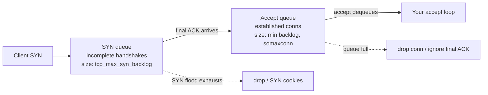

# Socket Programming & I/O Multiplexing

Sockets are the operating system's abstraction for network communication: an endpoint
identified by an IP address + port, exposed to programs as a file-like descriptor. The
**BSD (Berkeley) socket API** — `socket/bind/listen/accept/connect/send/recv/close` — is
the lingua franca that virtually every OS and language runtime copies (Winsock, Java NIO,
Python `socket`, Go's `net` package all wrap it). This topic is about the *mechanics*: how
you set up a connection, how blocking vs non-blocking I/O behaves, which knobs (socket
options) matter, and how servers scale to tens of thousands of connections using **I/O
multiplexing** (`select`/`poll`/`epoll`/`kqueue`) instead of a thread per connection.

> [!KEY-TAKEAWAY]
> A socket is just a file descriptor with network semantics. Everything hard about
> high-performance servers reduces to one question: *how does my process learn that a
> descriptor is ready to read or write without wasting a thread blocked on it?*

## The BSD Socket API model

The BSD socket API defines a small set of system calls, and their ordering encodes the
connection lifecycle. A socket is created with `socket(domain, type, protocol)`:

- `domain` — address family: `AF_INET` (IPv4), `AF_INET6` (IPv6), `AF_UNIX` (local).
- `type` — `SOCK_STREAM` (reliable, ordered byte stream → TCP) or `SOCK_DGRAM`
  (unreliable, message-oriented datagrams → UDP).
- `protocol` — usually `0`, letting the kernel pick the default for the type.

The call returns an integer **file descriptor** (fd). Because it is an fd, the same
`read`/`write`/`close` and `select`/`poll` machinery that works on files and pipes also
works on sockets — this uniformity is the whole point of the abstraction.

Data is moved with `send`/`recv` (socket-specific, take a `flags` argument like
`MSG_PEEK`, `MSG_DONTWAIT`, `MSG_OOB`) or the generic `write`/`read` (equivalent to
`send`/`recv` with `flags == 0`). `close()` releases the fd and, for TCP, initiates the
connection teardown (FIN). An address is packed into a `sockaddr` structure (`sockaddr_in`
for IPv4, `sockaddr_in6` for IPv6) carrying the family, port (network byte order), and
address.

> [!TIP]
> Ports and addresses in `sockaddr` are stored in **network byte order** (big-endian).
> Use `htons()`/`htonl()` when filling them in — forgetting this is a classic bug where a
> server "binds to the wrong port" (e.g. 36895 instead of 8080: 8080 = 0x1F90, whose
> bytes swapped give 0x901F = 36895).

## TCP sockets: the connection lifecycle

TCP is connection-oriented, so client and server follow different call sequences.

**Server side:**
1. `socket()` → get a listening fd.
2. `bind(fd, addr)` → attach it to a local IP + port.
3. `listen(fd, backlog)` → mark it passive; the kernel now completes handshakes and
   queues established connections.
4. `accept(fd)` → **dequeue** the next completed connection and return a *new* fd for that
   one client. The original listening fd stays open to accept more. Blocks if the queue is
   empty (unless non-blocking).
5. `recv`/`send` on the connected fd, then `close()`.

**Client side:**
1. `socket()`.
2. optionally `bind()` (usually skipped — the kernel auto-assigns an ephemeral source
   port, typically from range 49152–65535).
3. `connect(fd, server_addr)` → triggers the TCP 3-way handshake (SYN, SYN-ACK, ACK).
   Returns when the handshake completes (or `EINPROGRESS` on a non-blocking socket).
4. `send`/`recv`, then `close()`.

A TCP connection is uniquely identified by the **4-tuple** `(src IP, src port, dst IP, dst
port)`. This is why one server port can hold thousands of simultaneous connections: each
peer differs in its (IP, port) pair, so the tuples are distinct.

> [!WARNING]
> `accept()` returning a *new* fd is the most-tested subtlety. Reading/writing the
> listening fd is wrong; you communicate over the fd `accept()` hands back. The listening
> socket only ever produces connections, never carries data.

## UDP sockets: connectionless datagrams

UDP has no handshake and no connection state. You create a `SOCK_DGRAM` socket and:

- **Server:** `socket()` → `bind()` → `recvfrom()` / `sendto()`. No `listen()` or
  `accept()` — there is no connection to accept.
- **Client:** `socket()` → `sendto(dst_addr, ...)`. `bind()`/`connect()` are optional.

Each `sendto()` produces exactly one datagram and each `recvfrom()` reads exactly one
datagram (message boundaries are preserved, unlike TCP's byte stream). If your buffer is
smaller than the datagram, the excess is **discarded** (with `MSG_TRUNC` you can detect
it). A `recvfrom()` also yields the sender's address so you know who to reply to.

You *can* call `connect()` on a UDP socket: it doesn't send packets, it just stores a
default peer so you can use `send`/`recv` and receive asynchronous ICMP errors (e.g. "port
unreachable") as `ECONNREFUSED` on the next call — impossible on an unconnected UDP
socket.

| | TCP (`SOCK_STREAM`) | UDP (`SOCK_DGRAM`) |
|---|---|---|
| Setup | `listen`/`accept`/`connect` | none (optional `connect`) |
| Semantics | byte stream, no boundaries | preserved message boundaries |
| Per-client fd | yes (from `accept`) | no — one fd serves all peers |
| Read call | `recv`/`read` | `recvfrom` (gives sender addr) |

## Blocking vs non-blocking sockets

By default a socket is **blocking**: `recv` sleeps the calling thread until data arrives,
`accept` sleeps until a connection is queued, `connect` sleeps until the handshake
finishes, and `send` sleeps if the socket send buffer is full. Simple to reason about, but
one thread can only wait on one thing at a time.

Setting `O_NONBLOCK` (via `fcntl(fd, F_SETFL, ...)` or the `SOCK_NONBLOCK` flag) makes
calls return immediately:
- If the operation can't proceed, it returns `-1` with `errno == EWOULDBLOCK` (a.k.a.
  `EAGAIN` — they are the same value on Linux).
- `connect()` on a non-blocking socket returns `-1`/`EINPROGRESS`; you then wait for the
  socket to become **writable** to learn the handshake finished (checking `SO_ERROR` to
  distinguish success from failure).

Non-blocking sockets are the foundation of event loops: you never let a single fd stall
the thread. But polling a non-blocking socket in a busy loop ("spin") burns CPU — the
correct pattern is *non-blocking sockets + a readiness API* (`epoll`/`kqueue`) that sleeps
until at least one fd is ready.

> [!INTERVIEW]
> "What does `recv` return on a non-blocking socket with no data?" → `-1` and `errno` set
> to `EAGAIN`/`EWOULDBLOCK`. Contrast with `recv` returning **`0`**, which means the peer
> performed an orderly shutdown (received a FIN) — end of stream, not an error.

## Partial reads and writes

TCP is a **byte stream with no message boundaries**, so the count you ask for is not the
count you get. `recv(fd, buf, 4096, 0)` may return `1400` bytes even though 4096 are
"coming" — you must loop and re-read until you have a complete application message. Framing
(length prefix, delimiter, or fixed size) is the application's job, not TCP's. This is why
"I sent one 8 KB message but the server got two chunks" is expected behavior, not a bug.

Similarly `send(fd, buf, n, 0)` may accept fewer than `n` bytes (a **short write**) when
the kernel send buffer is nearly full, especially on non-blocking sockets. Correct code
loops on the returned count until all bytes are handed off:

```
sent = 0
while sent < n:
    r = send(fd, buf[sent:], n - sent, 0)
    if r < 0 and errno in (EAGAIN, EWOULDBLOCK):
        wait_for_writable(fd)   # via epoll/kqueue, then retry
        continue
    sent += r
```

> [!WARNING]
> A `send()` that succeeds means the bytes were copied into the **kernel socket buffer**,
> NOT that the peer received or read them. Delivery confirmation only comes from TCP ACKs
> and, ultimately, an application-level reply. Never treat a successful `send` as
> end-to-end delivery.

## Key socket options

Set with `setsockopt(fd, level, optname, ...)`. The ones interviewers ask about:

- **`SO_REUSEADDR`** — allows `bind()` to a port still in the `TIME_WAIT` state from a
  previous connection. Without it, restarting a server often fails with "Address already
  in use" because the old connection's 4-tuple lingers ~2×MSL. Nearly every server sets
  this.
- **`SO_REUSEPORT`** — lets *multiple* sockets (typically one per worker process/thread)
  bind the **same** IP:port; the kernel load-balances incoming connections across them.
  Key technique for scaling accept across cores and avoiding the "thundering herd" on a
  single listener. (Different from `SO_REUSEADDR`.)
- **`TCP_NODELAY`** — disables **Nagle's algorithm**. Nagle coalesces small writes to
  reduce tiny-packet overhead by holding data until the previous unacknowledged small
  segment is ACKed. Great for bulk transfer, terrible for latency-sensitive
  request/response (chat, RPC, games), where it adds up to a round-trip of delay —
  especially when it interacts badly with **delayed ACK**. Set `TCP_NODELAY` for
  interactive protocols.
- **`SO_KEEPALIVE`** — enables periodic keepalive probes on idle TCP connections to detect
  dead peers. Defaults are coarse (Linux: first probe after 2 hours idle), so tune
  `TCP_KEEPIDLE`/`TCP_KEEPINTVL`/`TCP_KEEPCNT`. Detects half-open connections where the
  peer vanished without sending a FIN.
- **`SO_RCVBUF` / `SO_SNDBUF`** — kernel receive/send buffer sizes; the receive buffer caps
  the TCP receive window and thus throughput on high-latency links (bandwidth-delay
  product).
- **`SO_LINGER`** — controls whether `close()` blocks to flush unsent data, and can force a
  hard **RST** reset instead of a graceful FIN when set with a zero timeout.

> [!TIP]
> `SO_REUSEADDR` vs `SO_REUSEPORT`: `REUSEADDR` mainly lets you rebind a port stuck in
> `TIME_WAIT` (one listener). `REUSEPORT` lets N distinct sockets share the port for
> in-kernel load balancing (N listeners). Interviewers love conflating them.

## The listen backlog and accept queue

`listen(fd, backlog)` sizes the queue of connections waiting to be `accept()`ed. Modern
Linux maintains **two** queues:




- **SYN queue (incomplete)** — connections mid-handshake (SYN received, SYN-ACK sent,
  awaiting the final ACK). Sized by `net.ipv4.tcp_max_syn_backlog`.
- **Accept queue (completed)** — fully established connections awaiting `accept()`. Sized
  by `min(backlog, net.core.somaxconn)`.

When the accept queue is full, new completed connections may be dropped or the final ACK
ignored, forcing the client to retransmit — appearing as connection latency or refusals
under load. A too-small `backlog` (or a slow accept loop) is a classic cause of tail
latency spikes during traffic bursts.

The **SYN flood** attack exploits the SYN queue: an attacker sends many SYNs but never the
final ACK, exhausting the incomplete queue. **SYN cookies** defend against this by encoding
connection state into the SYN-ACK sequence number so the server holds no per-connection
state until the handshake completes.

> [!WARNING]
> Passing `backlog = 1000` does not guarantee 1000 — the effective cap is
> `min(backlog, somaxconn)`, and on older kernels `somaxconn` defaulted to 128. Tune the
> sysctl if you need a deeper queue.

## The C10K problem

The **C10K problem** (coined by Dan Kegel, ~1999) asks: how does a single server handle
**10,000 concurrent connections**? The naive **thread-per-connection** (or
process-per-connection) model breaks down:

- Each thread needs a stack (often ~1 MB default) → 10K threads ≈ 10 GB of address space
  just for stacks.
- The OS scheduler and context-switch overhead grow with thread count.
- Old readiness APIs like `select`/`poll` are **O(n)** per call — cost scales with the
  number of connections you monitor, so a 10K-fd server re-scans 10K fds on every wakeup.

The solution combines **non-blocking sockets** with an **event-driven** architecture and
an **O(1) readiness API** (`epoll` on Linux, `kqueue` on BSD/macOS, IOCP on Windows) so a
handful of threads multiplex thousands of connections. The modern sequel, **C10M** (10
million), pushes further into kernel-bypass (DPDK), `SO_REUSEPORT` sharding across cores,
and user-space networking.

> [!KEY-TAKEAWAY]
> C10K is not "one connection is expensive" — TCP connections are cheap. It's that the
> *coordination* model (one thread each, O(n) scanning) doesn't scale. Fix the model:
> non-blocking I/O + scalable readiness notification + few threads.

## Readiness I/O models: select, poll, epoll, kqueue

These are **readiness notification** (a.k.a. synchronous I/O multiplexing) APIs: they let
one thread wait on many fds and report which are ready to read/write, so you then do
non-blocking I/O only on the ready ones.

- **`select()`** — POSIX, ubiquitous. You pass three `fd_set` bitmaps (read/write/except).
  Limitations: fd values capped by `FD_SETSIZE` (commonly **1024**); the kernel **rescans
  all fds** each call → O(n); the fd_sets are **modified in place** so you must rebuild
  them every iteration. Fine for small fd counts and maximum portability.
- **`poll()`** — POSIX. Takes an array of `pollfd` structs, so **no FD_SETSIZE limit** and
  a cleaner in/out separation (`events` vs `revents`). Still **O(n)**: the kernel and your
  code both walk the whole array each call.
- **`epoll`** (Linux) — a persistent kernel-side interest set. `epoll_create` makes an
  epoll fd; `epoll_ctl` registers/updates/removes fds *once*; `epoll_wait` returns only the
  **ready** fds → effectively **O(number of ready fds)**, not total fds. Scales to hundreds
  of thousands of connections. Supports level- and edge-triggered modes.
- **`kqueue`** (BSD, macOS) — the equivalent scalable API. More general than epoll: a
  single interface (`kevent`) reports not just socket readiness but timers, signals, file
  and process events. Also O(ready).

| API | Portability | Cost per wait | fd limit | Stateful registration |
|---|---|---|---|---|
| `select` | POSIX (all) | O(n) rescan | `FD_SETSIZE` (~1024) | no (rebuild each call) |
| `poll` | POSIX | O(n) rescan | none | no |
| `epoll` | Linux only | O(ready) | none | yes (`epoll_ctl`) |
| `kqueue` | BSD/macOS | O(ready) | none | yes (`kevent`) |

> [!TIP]
> "Why is `epoll` faster than `poll` at 10K fds?" → `poll` copies and re-scans all 10K fds
> on every call even if only 5 are ready. `epoll` keeps the interest set in the kernel and
> returns just the ~5 ready ones, so cost tracks *activity*, not *connection count*.

## Level-triggered vs edge-triggered

`epoll` and `kqueue` support two notification semantics:

- **Level-triggered (LT)** — the default (matches `select`/`poll`). Reports a fd as ready
  **as long as** the condition holds. If data is readable and you read only part of it,
  the next `epoll_wait` still reports it ready. Forgiving; you may drain in convenient
  chunks.
- **Edge-triggered (ET)** — notifies only on a **transition** (e.g. empty → data
  available). You get one wakeup per new edge, so you **must drain the fd completely** —
  keep calling `recv` until it returns `EAGAIN`/`EWOULDBLOCK` — or you'll miss data and
  stall the connection until the *next* edge. Fewer wakeups and syscalls; the standard
  choice for maximum-performance servers (e.g. nginx uses ET).

**Worked trace — 2000 bytes arrive, you read only 1400.** Say the fd's receive buffer
fills with 2000 bytes and your handler does one `recv(fd, buf, 1400)` that returns 1400,
leaving **600 bytes** unread in the kernel buffer.

- **LT:** the *condition* "data is readable" still holds (600 bytes remain), so the very
  next `epoll_wait` returns this fd ready **again** — you get another chance and drain the
  last 600 on the following pass. One read per wakeup is safe; it just costs extra wakeups.
- **ET:** the edge (empty → readable) already fired for the arrival of those 2000 bytes.
  Since you didn't drain to `EAGAIN`, the next `epoll_wait` does **not** report this fd —
  there's been no new *transition*. Those 600 bytes sit unread indefinitely, and the
  connection looks hung, until *more* data happens to arrive and produce a fresh edge.
- **ET done right:** loop on the same numbers — `recv` → 1400, `recv` → 600, `recv` →
  `-1`/`EAGAIN` (three syscalls, buffer fully drained). Only after you hit `EAGAIN` is it
  safe to return to `epoll_wait`, because you've consumed everything the single edge told
  you about.

> [!WARNING]
> The #1 edge-triggered bug: reading once per notification. With ET you *must* loop reads
> (and writes) until `EAGAIN`. A partial read leaves data buffered with no further
> notification, so the connection appears to hang. ET therefore requires non-blocking
> sockets — a blocking `recv` in the drain loop would block on the final iteration.

## Thread-per-connection vs event loop

Two dominant server concurrency architectures:

**Thread-per-connection (blocking):** each accepted connection gets its own thread (or
process) doing simple blocking `recv`/`send`. Easy to write and debug; each request handler
is straight-line code. Costs: memory per thread stack, context-switch overhead, and a hard
ceiling around thousands of connections. Great when connection counts are modest or work is
CPU-bound anyway (a thread pool bounds concurrency).

**Event loop (reactor / non-blocking):** a few threads (often one per core) run a loop
around `epoll_wait`/`kqueue`, dispatching ready fds to handlers that never block. One
thread multiplexes thousands of connections. Excellent for **I/O-bound, high-connection,
mostly-idle** workloads (chat, proxies, push). Costs: inverted control flow (callbacks /
state machines / async-await), and a single **blocking call or CPU-heavy handler stalls
every connection** on that loop.

Hybrids are common: an event loop per CPU core (nginx, Netty, Node.js cluster,
`SO_REUSEPORT` sharding), plus offloading blocking/CPU work to a thread pool. Green threads
/ goroutines / virtual threads offer a third path: you *write* blocking-style code but the
runtime multiplexes it onto an epoll-backed event loop underneath, getting event-loop
scalability with thread-per-connection ergonomics.

| | Thread-per-connection | Event loop |
|---|---|---|
| Programming model | blocking, linear | callbacks / async / state machines |
| Scaling ceiling | ~thousands (stack + switch cost) | 100K+ connections |
| A slow handler | blocks one connection | blocks the whole loop |
| Best for | modest/CPU-bound | high-concurrency, I/O-bound |

## Reactor, Proactor, and true async I/O

Think of a restaurant. **Reactor** = the kitchen shouts "your food's on the counter, come
grab it" — you still walk over and do the pickup (the syscall) yourself. **Proactor** = you
hand over the order and the kitchen carries the finished plate to your table — the work is
done *for* you and you're just told it's complete. Map it: `epoll`/`kqueue` → Reactor;
`io_uring`/IOCP → Proactor.

The **Reactor** pattern is readiness-based: wait for "fd is *ready*," then *you* perform
the (non-blocking) read/write. `epoll`/`kqueue`-based servers are reactors.

The **Proactor** pattern is completion-based: you *submit* an operation and the OS performs
the I/O into your buffer, notifying you when it's **done**. Windows **IOCP** (I/O
Completion Ports) and Linux **`io_uring`** are completion-based. `io_uring` uses shared
submission/completion ring buffers between user space and kernel, cutting syscall overhead
and enabling batched, truly asynchronous I/O (including disk, where `epoll` never worked
well because regular files are "always ready").

> [!INTERVIEW]
> Readiness (`epoll`) vs completion (`io_uring`/IOCP): with readiness the kernel says "go
> ahead, it won't block" and you do the syscall; with completion you hand the kernel the
> buffer and it does the transfer, telling you when finished. Completion models avoid the
> "ready then syscall" round-trip and work for files, not just sockets.

## Graceful shutdown: shutdown() vs close()

`close()` and `shutdown()` are not interchangeable. `close()` decrements the file
descriptor's reference count on the underlying **open file description**; the TCP FIN is
only sent when the *last* fd referring to that connection is closed. So if the fd was
`dup()`'d or inherited across `fork()`, `close()` in one process leaves the connection
fully alive in another. `shutdown(fd, how)` acts on the **connection itself**, regardless
of how many fds reference it, and immediately affects the wire.

`shutdown()` takes a direction:
- `SHUT_WR` — send a FIN now (half-close). You promise to write no more, but you can still
  `recv` the peer's remaining data and its final response. This is the **canonical
  graceful drain**.
- `SHUT_RD` — stop reading (locally discards further inbound data; no wire effect that the
  peer reliably sees).
- `SHUT_RDWR` — shut down both directions.

The canonical zero-downtime drain of an established connection: stop accepting new work,
`shutdown(fd, SHUT_WR)` to send FIN, keep calling `recv` until it returns `0` (peer's FIN),
then `close()`. This interoperates with `SO_LINGER` (which controls whether `close()`
itself blocks to flush or sends an abortive RST) and with load-balancer health checks
during deploys. RFC 9293 §3.6 describes the half-close semantics; a peer that half-closes
appears to you as `recv() == 0` while your write side stays open.

> [!INTERVIEW]
> "How do you drain connections during a zero-downtime deploy?" Stop `accept()`, send FIN
> with `shutdown(SHUT_WR)`, keep reading until EOF (`recv == 0`), then `close()`. Simply
> calling `close()` on all sockets can truncate in-flight responses (especially with a
> zero-linger RST).

## TCP teardown states: TIME-WAIT and CLOSE-WAIT

The end that sends the **first** FIN (the *active closer*) ends up in **`TIME_WAIT`** for
~2×MSL. `TIME_WAIT` exists for two reasons (RFC 9293 §3.5): (1) to absorb any delayed
duplicate segments from the old connection so they can't be mistaken for data on a new
connection reusing the same 4-tuple, and (2) to guarantee the final ACK can be
retransmitted if the peer re-sends its FIN. Many `TIME_WAIT` sockets on your host is
**normal** and simply means your side is actively closing lots of connections (typical of
a client or a proxy).

**`CLOSE_WAIT`** is the opposite and is almost always **your application's bug**. It means
the peer sent a FIN (your `recv` returned `0`) but *your* application never called
`close()`/`shutdown()` in response, so the connection is stuck waiting for you. A pile of
`CLOSE_WAIT` sockets that grows until you hit the fd limit is the signature of a leaked
descriptor — an event handler that detects EOF but forgets to close. Contrast with
`TIME_WAIT`: `TIME_WAIT` drains itself on a timer; `CLOSE_WAIT` never clears until your
code acts.

> [!WARNING]
> Diagnosing with `ss -tan state close-wait` showing thousands of entries points squarely
> at your code, not the network or the peer. The fix is to `close()` the fd after
> observing `recv == 0`.

## epoll flags: EPOLLEXCLUSIVE, EPOLLONESHOT, EPOLLRDHUP

Beyond `EPOLLIN`/`EPOLLOUT`/`EPOLLET`, three flags solve real production problems:

- **`EPOLLEXCLUSIVE`** (Linux 4.5+) — when N worker processes each add the **same shared
  listening fd** to *their own* epoll instance, the default behavior wakes **all** of them
  on each incoming connection (an epoll-level thundering herd; only one wins the
  `accept`, the rest get `EAGAIN`). `EPOLLEXCLUSIVE` tells the kernel to wake only one (or
  a subset) of the waiters. It is valid **only with `EPOLL_CTL_ADD`**; the only companion
  flags allowed are `EPOLLIN`/`EPOLLOUT`/`EPOLLWAKEUP`/`EPOLLET`, and an `EPOLL_CTL_MOD`
  on an `EPOLLEXCLUSIVE` fd fails with `EINVAL`.
- **`EPOLLONESHOT`** — after one event is delivered for the fd, epoll **disables** it (no
  further events) until you re-arm it with `EPOLL_CTL_MOD`. This is the standard building
  block for multi-threaded epoll designs: it guarantees only one worker thread processes a
  given fd at a time, avoiding two threads racing on the same connection. You re-arm after
  finishing the handler.
- **`EPOLLRDHUP`** (Linux 2.6.17+) — fires when the peer half-closes (does
  `shutdown(SHUT_WR)` / sends FIN) *while you may still have data to write*. Under
  edge-triggered monitoring it is the correct way to notice a peer that has gone away
  instead of discovering it only on a later failed `recv`. It ties directly to graceful
  shutdown handling.

## The three thundering-herd cases

Interviewers test whether you can disentangle three distinct "many waiters wake for one
event" scenarios:

1. **Classic `accept()` herd** — many threads blocked directly in `accept()` on **one**
   listening socket. The Linux kernel has used a *wake-one* policy for `accept` since the
   2.6 era, so this is largely a solved, historical problem.
2. **epoll herd** — many **separate epoll instances** (one per worker process) each
   watching the **same shared** listener. The kernel wakes all of them per event; the
   fix is **`EPOLLEXCLUSIVE`**.
3. **`SO_REUSEPORT` avoidance** — herd *avoidance* by architecture: each worker has its
   **own distinct socket** bound to the same IP:port, and the kernel picks exactly one
   socket per incoming connection. There is no shared wait queue to stampede.

Conflating "use `SO_REUSEPORT`" with "use `EPOLLEXCLUSIVE`" is the common mistake:
`EPOLLEXCLUSIVE` fixes a herd on a *shared* fd; `SO_REUSEPORT` removes the shared fd
entirely.

## accept4() and the epoll fd-lifetime gotcha

Plain `accept()` returns a **blocking** fd **without** close-on-exec. Setting those flags
afterward with `fcntl()` leaves a race window: a concurrent `fork()`+`exec()` in another
thread can leak the newly accepted socket into the child, so the child holds the
connection open and the peer's connection never fully closes. `accept4(fd, ..., SOCK_NONBLOCK
| SOCK_CLOEXEC)` sets both atomically at accept time, closing the race. The same argument
motivates `SOCK_CLOEXEC` on `socket()` and `epoll_create1(EPOLL_CLOEXEC)`.

A subtler epoll trap concerns **fd lifetime**. An fd is removed from an epoll interest set
only when **all** fds referring to the same underlying open file description are closed.
After a `dup()` or `fork()`, closing one copy does **not** stop epoll from reporting events
for the connection — you must `EPOLL_CTL_DEL` explicitly (or close every duplicate). This
also produces the classic **stale-event batch bug**: `epoll_wait` returns a batch of
events; while handling event #13 you `close()` a connection and its fd number is reused for
a new connection; event #47 in the same batch still refers to the *old* fd number and you
act on the wrong connection. Robust loops track a generation/validity marker per fd or
defer closes until the batch is fully processed.

## TCP latency and buffering knobs

Beyond `TCP_NODELAY`, several options shape when bytes actually hit the wire:

- **`TCP_CORK`** (Linux; `TCP_NOPUSH` on BSD) — holds partial segments so the kernel can
  coalesce them into full-sized packets, up to a ~200 ms ceiling. The canonical use is
  `sendfile()`-plus-header: cork, write the HTTP headers, `sendfile()` the body, uncork —
  emitting full segments instead of a tiny header packet followed by data. `TCP_CORK`
  **overrides `TCP_NODELAY`** while set; toggling `TCP_NODELAY` on a corked socket forces a
  one-time flush. `MSG_MORE` is the per-`send()` equivalent ("more data coming, don't push
  yet").
- **Nagle + delayed-ACK deadlock (mechanics)** — Nagle (RFC 896) withholds a *new* small
  segment until the previously sent small segment is ACKed. The peer's delayed-ACK (RFC
  1122 §4.2.3.2) withholds that ACK for up to ~40–200 ms hoping to piggyback it on a
  reply. Result: both sides wait for each other → a ~40 ms stall on small
  request/response exchanges. **`TCP_QUICKACK`** disables delayed ACK, but note it is
  **not permanent** — the kernel resets it, so it must be re-set as needed.

  *Timeline trace* — a client writes a request in two small `send()`s, part A then part B
  (each below one MSS), and the server replies only after it has both:
  - `t=0 ms` — client `send(A)`. No unacknowledged small segment is outstanding, so Nagle
    lets A go on the wire immediately.
  - `t=0 ms` — client `send(B)`. But A is still unacknowledged and B is sub-MSS, so **Nagle
    holds B** until A's ACK returns.
  - `t≈0.5 ms` — server receives A. It can't build a reply from A alone (it needs B), and
    it has nothing to piggyback an ACK onto, so **delayed ACK holds** A's acknowledgment,
    hoping a reply will carry it.
  - **Standoff:** client waits for A's ACK before releasing B; server waits for B before
    replying; server's ACK is stuck behind that not-yet-existent reply. Nobody moves.
  - `t≈40 ms` — the server's delayed-ACK timer expires and it sends the bare ACK for A.
    The client now releases B, the server finally has the full request and replies — the
    exchange completes ~40 ms late for want of a handful of bytes.

  **Fix:** `TCP_NODELAY` removes the Nagle hold so B goes out immediately; or use one
  `writev([A, B])`/`send(A+B)` so A and B leave as a **single** segment — the server gets
  the whole request at once, replies right away, and the delayed-ACK timer never arms.
- **`TCP_DEFER_ACCEPT`** — `accept()` returns only once the client has sent data, not
  merely completed the handshake. Saves a wakeup for request/response servers (the first
  read has data waiting). RFC 6928's IW10 (initial congestion window of 10 segments)
  further reduces short-connection latency by allowing more data in the first round trip.
- **`TCP_FASTOPEN`** (RFC 7413) — carries application data in the SYN using a server-issued
  Fast Open cookie, so `accept()` can return (and data be delivered) before the handshake
  fully completes — a 0-RTT data path for repeat clients. The caveat is **replay safety**:
  SYN data can be replayed, so only idempotent requests should use it.

## Detecting dead peers: keepalive and user timeout

`SO_KEEPALIVE` with the default 2-hour idle timer is far too slow to detect a vanished
peer for most services. **`TCP_USER_TIMEOUT`** (RFC 5482) bounds how long *unacknowledged*
transmitted data may remain outstanding before TCP gives up and fails the connection with
`ETIMEDOUT`. Unlike keepalive (which probes *idle* connections), `TCP_USER_TIMEOUT`
applies to connections actively trying to send, and it also **modifies keepalive behavior**
(it overrides how long keepalive probes are tolerated). It is the modern answer to "detect
a dead peer in seconds, not hours."

## io_uring internals

The goal is to stop paying a syscall per I/O. `epoll`-style servers still make a syscall
for every read and write; at millions of ops/sec that kernel-boundary tax dominates.
`io_uring` batches submissions through ring buffers the kernel and your process **share**,
so a busy server can submit and reap hundreds of operations while barely entering the
kernel at all.

`io_uring` (Linux 5.1+) is a true completion-based (Proactor) interface built on two shared
ring buffers mapped between user space and kernel: the **submission queue (SQ)** where you
enqueue operations (SQEs) and the **completion queue (CQ)** where the kernel posts results
(CQEs). Setup is `io_uring_setup()`; you submit and/or wait with `io_uring_enter()`; and
you pre-register resources with `io_uring_register()`. Key performance features:

- **`SQPOLL` mode** — a dedicated kernel thread polls the submission queue, so submitting
  work needs **zero syscalls** in the steady state.
- **Fixed/registered buffers and files** — pre-pinning buffers and fds avoids per-op
  reference counting and address translation.
- **Multishot operations** — a single `accept`/`recv` submission keeps producing
  completions (multiple accepted connections / reads) without re-submitting.

Unlike `epoll`, it works for **regular file** I/O too. Security note: io_uring has been the
source of several kernel CVEs, so some hardened environments (notably parts of Google's
infrastructure and some container runtimes) **disable it by default**; production use
should account for that.

## Zero-copy transmit: sendfile, splice, and zero-copy send

Serving files or proxying bytes at line rate means avoiding user-space copies:

- **`sendfile(out_fd, in_fd, ...)`** — copies file→socket entirely inside the kernel, never
  bouncing through a user buffer (the classic static-file-server fast path). **`splice()`**
  generalizes this, moving bytes between two fds via a kernel pipe (useful for
  socket→socket proxying).
- **`MSG_ZEROCOPY`** / **`SO_ZEROCOPY`** — for `send()`, the kernel **pins the user pages**
  and transmits directly from them rather than copying into the socket buffer. Because the
  pages must stay stable until the NIC is done, completion is **asynchronous**: you learn a
  buffer is reusable via a notification on the socket's **error queue** (`MSG_ERRQUEUE`).
  Zero-copy send only pays off for **large** buffers, where the saved copy outweighs the
  page-pinning and completion-tracking overhead.

## Unix domain sockets vs TCP loopback

For same-host IPC, **Unix domain sockets** (`AF_UNIX`) skip the entire TCP/IP stack — no
checksums, no handshake, no congestion control, no port allocation — so they are faster and
lower-latency than TCP over `127.0.0.1`. They add capabilities impossible over TCP:

- **`SCM_RIGHTS`** — pass an **open file descriptor** (including a live socket) to another
  process as ancillary data over `sendmsg()`/`recvmsg()`. Used for privilege separation and
  hot-reload (hand an accepted connection to a new worker). There is a per-message limit
  (`SCM_MAX_FD`, 253).
- **`SO_PEERCRED`** / **`SCM_CREDENTIALS`** — authenticate the peer by its kernel-verified
  PID/UID/GID, enabling authorization without passwords (systemd, container runtimes rely
  on this).
- **Abstract namespace** (Linux) — a name starting with a null byte lives in an abstract
  namespace with no filesystem entry, auto-cleaned when the socket closes (non-portable).
- **`SOCK_SEQPACKET`** — connection-oriented **and** message-boundary-preserving, combining
  TCP-like reliability with UDP-like framing.

## SO_REUSEPORT internals and the rebalance race

By default the kernel selects the receiving socket in a `SO_REUSEPORT` group by **hashing
the connection 4-tuple**, spreading connections across workers deterministically. Two
depth points interviewers probe:

- **The rebalance / connection-loss race** — when a worker exits and `close()`s its
  `SO_REUSEPORT` socket, any connections that were already sitting in **that socket's accept
  queue** (or half-open in its SYN queue) are dropped, because the kernel had already
  committed them to that socket. Graceful worker shutdown must therefore stop accepting but
  **drain its queue before closing**, not close immediately.
- **Steering** — `SO_ATTACH_REUSEPORT_CBPF`/`EBPF` and `BPF_PROG_TYPE_SK_REUSEPORT` let you
  replace the default hash with a custom program, e.g. to pin a connection to the worker
  running on the same CPU as the NIC RX queue (`SO_INCOMING_CPU`) for cache/NUMA locality.

## Vectored I/O and send/recv flags

- **`writev`/`readv`** and **`sendmsg`/`recvmsg`** perform **scatter-gather** I/O: send a
  header and body from separate buffers in **one** syscall, avoiding an extra copy to
  concatenate them and avoiding the small-header-then-body pattern that triggers Nagle
  stalls. `sendmsg`/`recvmsg` are also the vehicle for **ancillary data** (`cmsg`), which
  carries `SCM_RIGHTS` fd-passing and credentials.
- **`MSG_NOSIGNAL`** — writing to a socket whose peer has sent a FIN/RST raises `SIGPIPE`,
  whose default action **kills the process** — a real production crash ("server dies with
  no error when a client disconnects"). Pass `MSG_NOSIGNAL` on `send()` (or set
  `SO_NOSIGPIPE` on BSD, or globally ignore `SIGPIPE`) so the call instead returns
  `-1`/`EPIPE`, which you handle normally.
- Other flags: **`MSG_WAITALL`** (block until the full count is read), **`MSG_PEEK`**
  (read without consuming), **`MSG_TRUNC`** (report the true datagram size even if
  truncated), **`MSG_DONTWAIT`** (per-call non-blocking without changing socket flags),
  **`MSG_OOB`** (urgent data).

## Edge-triggered writes and starvation

The ET drain discipline applies to **writes**, not just reads. You do **not** register
`EPOLLOUT` permanently — a connected socket is almost always writable, so a persistent
`EPOLLOUT` registration produces a busy-wakeup storm. The correct pattern: write until
`send` returns `EAGAIN`, **then** register `EPOLLOUT`; when the writable edge fires, drain
the pending send buffer, and once it is empty **deregister `EPOLLOUT`** again.

ET also introduces a **fairness** hazard noted in `epoll(7)`: fully draining one very busy
fd to `EAGAIN` before moving on can **starve** other ready fds. The mitigation is to cap
how much you read per fd per loop iteration and maintain your own **ready list** with
round-robin service, rather than looping on a single hot fd until it empties.

## kqueue specifics

`kqueue` differs from epoll in shape as well as generality. A single `kevent()` call takes
both a **changelist** (registrations/deregistrations) and an **eventlist** (returned
events), so you modify the interest set and wait in **one** syscall — whereas epoll splits
this into separate `epoll_ctl` and `epoll_wait` calls. Flags on each `kevent` include
`EV_ADD`, `EV_DELETE`, `EV_ONESHOT` (deliver once, like `EPOLLONESHOT`), and **`EV_CLEAR`**
(edge-triggered semantics — the epoll ET equivalent). Events are typed by **filter**:
`EVFILT_READ`, `EVFILT_WRITE`, `EVFILT_TIMER`, `EVFILT_SIGNAL`, `EVFILT_VNODE` (file
changes), `EVFILT_PROC` (process events) — one unified mechanism where Linux needs
`timerfd`/`signalfd`/`inotify` bolted onto epoll.

## Common follow-up questions

- What's the difference between `send` returning 0 bytes and `recv` returning 0?
  `recv` returning `0` = orderly peer shutdown (FIN), end of stream. `send`/`recv`
  returning `-1` with `EAGAIN` = would block on a non-blocking socket. `send` returning a
  short count = kernel buffer nearly full; loop to send the rest.
- Why does my server get "Address already in use" on restart? The previous connection
  is in `TIME_WAIT` (~2×MSL) holding the 4-tuple. Set `SO_REUSEADDR` before `bind()`.
- When should I disable Nagle (`TCP_NODELAY`)? For latency-sensitive
  request/response/interactive traffic where small writes must go out immediately;
  Nagle + delayed ACK can add ~40 ms stalls. Keep Nagle for bulk throughput.
- Why prefer edge-triggered epoll? Fewer wakeups/syscalls under load; but you must
  fully drain each fd to `EAGAIN` and use non-blocking sockets.
- Is one socket per port a limit on concurrent connections? No — connections are keyed
  by the full 4-tuple, so a single listening port serves many clients. The practical
  limits are file-descriptor limits (`ulimit -n`), memory, and — for a *client* connecting
  to one server — the pool of ephemeral source ports per (src IP, dst IP:port). That pool
  size is OS-configured: IANA *reserves* 49152–65535 (~16K), but Linux's default
  `ip_local_port_range` is 32768–60999, giving the commonly cited **~28K** ports.
- How do goroutines/virtual threads handle 100K connections without 100K OS threads?
  The runtime parks a blocked "thread" and uses an epoll/kqueue-backed netpoller to resume
  it when the fd is ready, multiplexing many logical threads onto few OS threads.
- Why can't `epoll` efficiently watch regular files? Regular files are always reported
  ready (they never "block" in the readiness sense), so `epoll` is useless for disk I/O;
  that's a motivation for `io_uring`.

## References

- RFC 9293 — Transmission Control Protocol (TCP), 2022 (obsoletes RFC 793).
- RFC 768 — User Datagram Protocol (UDP).
- RFC 6335 — Port number ranges (system/user/dynamic-ephemeral 49152–65535).
- RFC 896 / RFC 1122 §4.2.3.2 — Nagle's algorithm and TCP host requirements (delayed ACK).
- RFC 4987 — TCP SYN Flooding Attacks and Common Mitigations (SYN cookies).
- RFC 9293 §3.5 / §3.6 — TCP connection termination, TIME-WAIT, and half-close.
- RFC 7413 — TCP Fast Open (cookies, 0-RTT data, replay caveat).
- RFC 5482 — TCP User Timeout Option (basis for TCP_USER_TIMEOUT).
- RFC 6928 — Increasing TCP's Initial Window (IW10).
- POSIX.1-2017 (IEEE Std 1003.1) — `socket`, `bind`, `listen`, `accept`, `connect`,
  `send`, `recv`, `select`, `poll` specifications (The Open Group Base Specifications).
- Linux man-pages: `socket(2)`, `accept(2)`, `accept4(2)`, `listen(2)`, `epoll(7)`,
  `epoll_ctl(2)` (EPOLLEXCLUSIVE/EPOLLONESHOT/EPOLLRDHUP), `select(2)`, `poll(2)`,
  `shutdown(2)`, `sendmsg(2)`/`recvmsg(2)`, `sendfile(2)`, `splice(2)`, `tcp(7)`
  (CORK/QUICKACK/DEFER_ACCEPT/FASTOPEN/USER_TIMEOUT), `socket(7)`
  (REUSEPORT/REUSEADDR/INCOMING_CPU/ATTACH_REUSEPORT_[CE]BPF), `unix(7)`
  (SCM_RIGHTS/SO_PEERCRED/SEQPACKET), `signal(7)` (SIGPIPE), `io_uring(7)`.
- Linux sysctls: `net.core.somaxconn` (default raised to 4096 in Linux 5.4),
  `net.ipv4.tcp_max_syn_backlog`, `net.ipv4.ip_local_port_range`, `net.ipv4.tcp_tw_reuse`.
- FreeBSD/macOS: `kqueue(2)` manual page.
- Dan Kegel, "The C10K problem" (kegel.com/c10k.html).
- W. Richard Stevens, *UNIX Network Programming, Vol. 1* (socket API reference).
