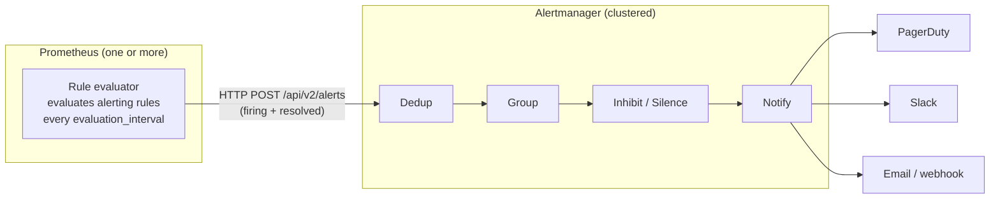
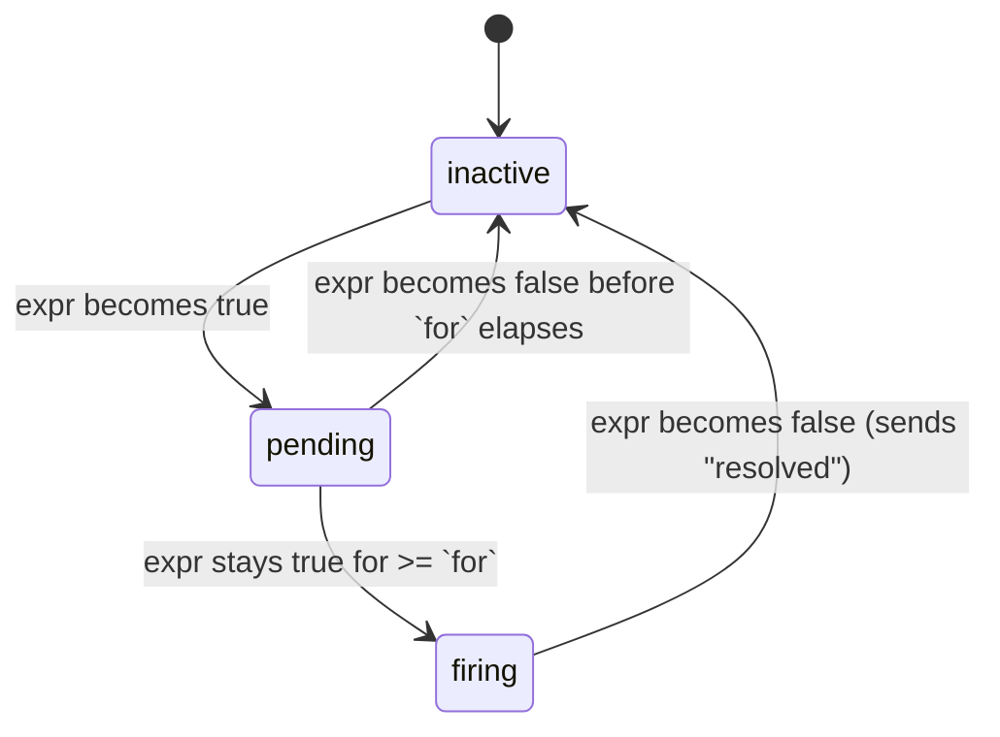
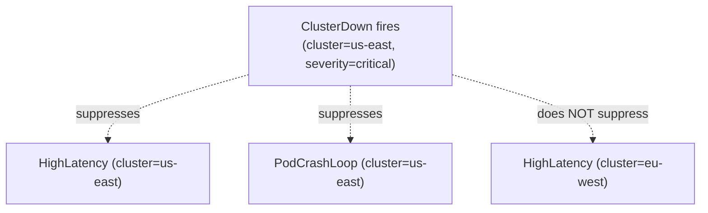
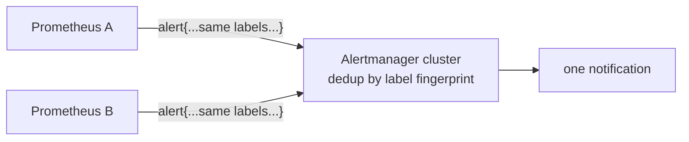

# Alerting Rules & Alertmanager

Alerting is where observability turns into action: a metric crosses a threshold and a
human (or an automated remediation) gets paged. In the Prometheus ecosystem this is a
**two-component** job. **Prometheus** *evaluates* alerting rules against its TSDB and, when
a rule's expression is satisfied, fires an **alert** — it does **not** know or care how
that alert reaches a person. **Alertmanager** is a separate service that *receives* fired
alerts and handles the routing, grouping, deduplication, inhibition, silencing, and
delivery to receivers (PagerDuty, Slack, email, OpsGenie, webhooks).

This topic covers the mechanics of both halves plus the *design* discipline that separates
a useful pager from an ignored one: alert on **symptoms not causes**, page on **imminent
SLO burn** (multi-window multi-burn-rate), and keep every alert **actionable** with a
runbook link. This is the **Observability** domain — we stay at the *signal-quality* level
(what makes an alert good, how it routes). The human **incident/on-call process** (incident
command, postmortems, DORA, runbook authoring) lives in the upcoming
`reliability-and-operations` domain; the architecture-level "where does monitoring fit"
view lives in `system-design/observability-monitoring-reliability`.

> [!KEY-TAKEAWAY]
> **Prometheus evaluates, Alertmanager routes.** Prometheus turns a PromQL expression that
> stays true for a `for:` duration into a firing alert with labels+annotations and pushes it
> to Alertmanager. Alertmanager then **groups** related alerts, **deduplicates** copies from
> HA Prometheus pairs, applies **inhibition** and **silences**, and delivers to the right
> **receiver** via the **routing tree**. Alert on **symptoms** (user-visible SLO breaches),
> not causes; page only on things that need a human *now*.

---

## The split: Prometheus evaluates, Alertmanager routes

The single most important architectural fact about Prometheus alerting is that it is split
across two processes with a one-way handoff.



**Prometheus's job (evaluation):**

- On each `evaluation_interval` (global, often 15–60s), it runs every alerting rule's PromQL
  `expr`. Every series the expression returns is a **potential alert**, identified by its
  full label set.
- It tracks each alert's **state machine** (`inactive` → `pending` → `firing`, see below).
- When an alert is `firing`, Prometheus **pushes** it to *all* configured Alertmanagers via
  HTTP `POST /api/v2/alerts`. It re-sends active alerts periodically (default every ~1
  minute, controlled by internal resend logic) so Alertmanager doesn't expire them, and
  sends a **resolved** notification when the expression stops matching.
- Prometheus knows *nothing* about receivers, grouping, or on-call schedules.

**Alertmanager's job (routing/notification):** dedup, group, inhibit, silence, and deliver.
It owns *all* of the "who gets told and how" logic.

> [!INTERVIEW]
> A classic opener: "Walk me through what happens from a metric crossing a threshold to an
> engineer's phone buzzing." The strong answer names both components and the handoff:
> Prometheus evaluates the rule → holds `pending` for `for:` → fires and POSTs to
> Alertmanager → Alertmanager groups/dedups/inhibits/silences → routes to a receiver. If a
> candidate says "Prometheus sends the Slack message," that's the tell they've never wired
> it up.

**Why split it?** Separation of concerns and reliability: routing policy (who's on call,
which Slack channel) changes far more often than metric definitions, and you want one
routing brain even if you run many Prometheis. Alertmanager is also **clustered/HA**
(gossip protocol) precisely so notification isn't a single point of failure.

---

## Writing alerting rules: expr, for, labels, annotations

An alerting rule lives in a rule group in a rules file loaded by Prometheus (`rule_files:`).
It has four meaningful parts:

```yaml
groups:
  - name: availability
    rules:
      - alert: HighRequestErrorRate
        expr: |
          sum(rate(http_requests_total{code=~"5.."}[5m])) by (service)
            /
          sum(rate(http_requests_total[5m])) by (service)
            > 0.05
        for: 10m
        labels:
          severity: page
          team: checkout
        annotations:
          summary: "High 5xx error rate on {{ $labels.service }}"
          description: "{{ $labels.service }} is serving {{ $value | humanizePercentage }} 5xx over 5m."
          runbook_url: "https://runbooks.example.com/HighRequestErrorRate"
```

- **`alert`** — the alert name (becomes the `alertname` label).
- **`expr`** — the PromQL expression. **Any series it returns** is an active alert instance;
  the returned label set *identifies* that instance. An expression matching 3 services
  produces 3 separate alerts. Use a comparison/boolean expr so it returns a vector only when
  the condition holds.
- **`for`** — how long the expression must be *continuously* true before the alert flips
  from `pending` to `firing` (see next section). Omitting `for` means it fires on the first
  matching evaluation.
- **`labels`** — extra labels *attached to the alert* (merged with the series' own labels).
  These are the **routing keys** Alertmanager matches on (`severity`, `team`, `region`).
  Labels are part of the alert's identity — changing them creates a distinct alert.
- **`annotations`** — human-facing, informational metadata (`summary`, `description`,
  `runbook_url`). They are **not** used for identity, grouping, or dedup. Both labels and
  annotations support Go templating with `{{ $value }}` and `{{ $labels.x }}`.

> [!WARNING]
> Labels vs annotations is a common trap. **Labels = identity + routing** (matched by the
> route tree, dedup, grouping). **Annotations = descriptive text** (never routed on, can
> change freely without creating a "new" alert). Putting a high-cardinality value like a
> request ID in a *label* fragments grouping and dedup; put it in an annotation.

**Recording rules vs alerting rules:** a *recording* rule precomputes an expression into a
new series (for speed / reuse); an *alerting* rule watches an expression and fires. A common
pattern is to record an SLI (e.g. `job:request_errors:ratio_rate5m`) once and reference the
short recorded series from multiple burn-rate alerts.

---

## Pending vs firing, and the `for` duration (avoiding flapping)

Each alert instance moves through a three-state machine inside Prometheus:



- **inactive** — the expression is not matching; nothing is happening.
- **pending** — the expression *just* started matching but has not yet been true for the
  full `for` duration. Prometheus is *watching* but has **not** notified Alertmanager.
- **firing** — the expression has been continuously true for `>= for`; Prometheus now pushes
  the alert to Alertmanager on each cycle.

**Why `for` matters:** it debounces transient spikes. A momentary latency blip that clears
in one scrape never leaves `pending`, so nobody gets paged. Setting `for: 10m` says "only
tell me if this is *sustained*." This is the primary lever against **flapping** (an alert
rapidly toggling firing/resolved and spamming notifications).

> [!WARNING]
> `for` only tolerates the expression being *continuously* true. If the series briefly stops
> matching — even due to a single **missing/stale sample** or one good scrape — the timer
> **resets** to `pending` from zero and the count starts over. A too-tight `for` on a noisy
> signal can therefore *never* fire. Averaging via `rate(...[5m])` in the `expr` smooths the
> signal so `for` behaves predictably.

Trade-off: a longer `for` reduces false pages but **delays** real ones (total detection
latency ≈ `for` + notification pipeline delays). This is exactly why the multi-window
burn-rate pattern uses *short* windows on high burn rates and *long* ones on slow burns
rather than a single big `for`. Note: **flap suppression lives in Prometheus (`for`) and in
alert design**, not in Alertmanager — Alertmanager has no hysteresis feature.

---

## Alertmanager routing tree & receivers

Alertmanager's `route:` block is a **tree**. Every incoming alert enters at the **root**
route and walks down, matching child routes by label. The matched route determines the
**receiver** (notification destination) and the grouping/timing parameters.

```yaml
route:
  receiver: default-email          # fallback receiver at the root
  group_by: [alertname, cluster, service]
  group_wait: 30s
  group_interval: 5m
  repeat_interval: 4h
  routes:
    - matchers: [ severity="page" ]
      receiver: pagerduty-critical
      continue: false              # stop here (default)
    - matchers: [ team="checkout" ]
      receiver: slack-checkout
      routes:
        - matchers: [ severity="warning" ]
          receiver: slack-checkout-warnings

receivers:
  - name: default-email
    email_configs: [ { to: "oncall@example.com" } ]
  - name: pagerduty-critical
    pagerduty_configs: [ { routing_key: "<key>" } ]
  - name: slack-checkout
    slack_configs: [ { channel: "#checkout-alerts" } ]
  - name: slack-checkout-warnings
    slack_configs: [ { channel: "#checkout-warnings" } ]
```

Key routing semantics:

- **Depth-first, first-match-wins per level.** An alert matches the first child route whose
  matchers all match, then descends into that route's children. If no child matches, the
  current node's `receiver` handles it.
- **`continue`** — by default matching stops at the first matching sibling. Set
  `continue: true` to *also* evaluate later sibling routes — this is how you fan one alert
  out to multiple receivers (e.g. page **and** post to Slack).
- **`matchers`** — label matchers (`=`, `!=`, `=~`, `!~`). The modern field is `matchers:`;
  older configs use `match:`/`match_re:`.
- **Inherited settings.** `group_by`, `group_wait`, `group_interval`, `repeat_interval`, and
  `receiver` are inherited from parent routes unless overridden by a child.
- A **receiver** is just a named bundle of one or more integrations
  (`pagerduty_configs`, `slack_configs`, `email_configs`, `webhook_configs`, …). One
  receiver can hit several channels at once.

> [!TIP]
> Route on **labels you control from the rule** (`severity`, `team`, `region`) rather than
> on `alertname`. Then adding a new alert with `severity: page` automatically pages without
> touching Alertmanager config. Use `amtool config routes test` to dry-run which receiver an
> alert with a given label set would hit.

---

## Grouping: group_by, group_wait, group_interval, repeat_interval

**Grouping** batches related alerts into a single notification so that one bad event doesn't
produce 500 separate pages. All alerts sharing the same values for the `group_by` labels form
one **group**, and Alertmanager sends *one* notification per group (updated as the group's
membership changes).

| Parameter | Default | What it controls |
|---|---|---|
| `group_by` | (none / per route) | Which labels define a group. `['...']` disables aggregation (one notification per alert); omitting groups everything in a route together. |
| `group_wait` | `30s` | Delay before sending the **first** notification for a *new* group — lets more alerts of the same group accumulate so they go out together. |
| `group_interval` | `5m` | Minimum wait before sending an **updated** notification for an *existing* group when its membership changes (new alerts join). |
| `repeat_interval` | `4h` | How long before **re-sending** an unchanged, still-firing group (the "nag" interval). |

Timeline for one group: the first alert arrives → wait `group_wait` (30s) collecting
siblings → send notification #1. New alert joins the group → wait at least `group_interval`
(5m) → send an updated notification. Nothing changes but alerts still firing → re-send every
`repeat_interval` (4h).

- **`group_by` choice is the key lever.** Group by `[alertname, cluster]` and a rack-wide
  outage that trips 200 instances of `InstanceDown` becomes **one** page listing 200
  instances, not 200 pages. Too coarse (`group_by: [...]` disabled → per-alert) spams; too
  broad hides distinct incidents in one notification.
- **`repeat_interval` should be a multiple of `group_interval`** — if not, Alertmanager
  rounds it up to the next multiple.

> [!INTERVIEW]
> Expect: "You deployed a bad config and 300 pods started erroring — how do you avoid 300
> pages?" Answer with **grouping** (`group_by: [alertname, service]` collapses them into one
> notification) plus **`group_wait`** letting the burst coalesce, and optionally
> **inhibition** if a parent `ServiceDown` alert should suppress the per-pod noise.

---

## Inhibition: suppress downstream alerts when an upstream fires

**Inhibition** mutes a set of alerts (the *targets*) while some other alert (the *source*)
is firing. It expresses causal dependency: "if the whole datacenter is down, don't also page
me about every individual service in it."

```yaml
inhibit_rules:
  - source_matchers: [ severity="critical", alertname="ClusterDown" ]
    target_matchers: [ severity=~"warning|page" ]
    equal: [ cluster ]     # only within the same cluster
```

- **`source_matchers`** — an alert matching these must be *firing* for the rule to take
  effect.
- **`target_matchers`** — alerts matching these get **muted** while a matching source fires.
- **`equal`** — the listed labels must have *equal values* in source and target for the
  inhibition to apply (so a `ClusterDown` in `cluster=us-east` only suppresses targets in
  `us-east`). A missing label and an empty-value label are treated the same.



> [!WARNING]
> A rule where source and target can both match the *same* alert can make an alert inhibit
> itself. Alertmanager guards the exact-same-alert case, but overlapping matchers still cause
> confusing suppression — keep source and target label sets clearly disjoint. Inhibition is
> **not** dedup and **not** silencing: it's automatic, dependency-based suppression driven by
> a *currently firing* source alert.

---

## Silences: temporarily muting known alerts

A **silence** is a manually created, time-bounded mute for alerts matching a set of label
matchers. Use it during planned maintenance, a known ongoing incident, or a noisy alert
you're actively fixing.

- Created via the Alertmanager **UI**, `amtool silence add`, or the API — **not** in a config
  file (they're runtime state, stored in Alertmanager and gossiped across the cluster).
- Defined by **matchers** (same `=`, `!=`, `=~`, `!~` syntax), a **start/end time**, a
  **creator**, and a **comment** (who/why — required for auditability).
- A silenced alert is still *firing* in Prometheus and *received* by Alertmanager; it simply
  isn't *notified*. It shows as "silenced" in the UI.

**Silence vs inhibition** — the classic distinction:

| | Silence | Inhibition |
|---|---|---|
| Triggered by | A human, manually | Another **firing** alert (automatic) |
| Configured | Runtime (UI/API/amtool) | Static (`inhibit_rules` in config) |
| Duration | Fixed start/end window | As long as the source alert fires |
| Use case | Planned maintenance, known issue | Causal suppression (parent hides children) |

> [!TIP]
> Prefer **matchers scoped tightly** (specific instance/service) with a **short expiry**.
> A broad, long silence (`severity=~".*"` for a week) is how real incidents get swallowed.
> Always require a comment linking the ticket/reason.

---

## Deduplication across HA Prometheus pairs

For availability you run **two (or more) identical** Prometheus servers scraping the same
targets with the same rules — if one dies, the other still alerts. Both will independently
evaluate the same rule, fire the "same" alert, and POST it to Alertmanager. Without
dedup you'd get **double pages**.

**Alertmanager deduplicates automatically.** It identifies an alert by its **label set
(fingerprint)**. Two alerts with identical labels are the *same* alert regardless of which
Prometheus sent them; Alertmanager collapses them and notifies once.



Two requirements for this to work:

1. **Identical labels.** The alerts must carry the *same* label set. Don't add a
   `replica`/`prometheus` label that differs between the pair (or strip it via
   `alert_relabel_configs`) — differing labels defeat dedup and you get two pages.
2. **Cluster the Alertmanagers, don't run independent ones.** Run Alertmanager itself as an
   HA **cluster** (gossip via `--cluster.peer`). The cluster coordinates so only *one*
   member actually sends each notification. Pointing your HA Prometheus pair at *separate,
   non-clustered* Alertmanagers reintroduces duplicates.

> [!INTERVIEW]
> "You run two Prometheis for HA — how do you avoid double paging?" Answer: Alertmanager
> **dedups on the alert's label fingerprint**, so identical alerts from both replicas collapse
> to one; and you run Alertmanager as a **gossip cluster** so only one instance sends. The
> gotcha they're probing: don't stamp a per-replica label on the alert, and don't wire each
> Prometheus to its own standalone Alertmanager.

---

## Severity levels and routing by severity

A `severity` label on each alert is the backbone of routing and the primary defense against
alert fatigue. A common, deliberately small taxonomy:

| Severity | Meaning | Delivery |
|---|---|---|
| `critical` / `page` | User-visible impact or imminent SLO breach; needs a human **now** | Page (PagerDuty/OpsGenie), 24×7 |
| `warning` | Degradation or a trend that needs attention soon, not this second | Ticket / Slack, business hours |
| `info` | Context only; never wakes anyone | Dashboard / low-priority channel |

- Set `severity` in the rule's `labels`, then route on it in Alertmanager (`matchers:
  [severity="page"] → pagerduty`). This decouples "how urgent" (owned by whoever writes the
  rule) from "who/how to notify" (owned by Alertmanager).
- **Every `page`-severity alert must be actionable and urgent.** If an alert can safely wait
  until morning, it is *not* a page — make it a `warning`/ticket. Paging on non-urgent things
  is the fastest route to ignored pagers.
- Keep the set **small**. Ten severity levels means nobody remembers what any of them
  requires.

---

## Alert design: symptoms not causes

The most important alerting principle (Google SRE): **alert on symptoms, not causes.** A
*symptom* is something the user experiences — high error rate, high latency, requests
failing, the SLO burning. A *cause* is an internal condition that *might* lead to a symptom —
high CPU, a full disk, a restarted pod, high memory.

- **Symptom-based alerts** are few, high-signal, and by definition catch real user pain —
  *including* failure modes you never predicted. "Users are getting 5xx" fires whether the
  cause is a bad deploy, a dependency outage, or something novel.
- **Cause-based alerts** are numerous and noisy: high CPU may be totally fine (the service is
  serving traffic happily), and you'll never enumerate every cause. Paging on causes floods
  the on-call with alerts that don't correspond to user impact.

This maps onto the well-known signal frameworks:

- **Four Golden Signals** (SRE): **latency, traffic, errors, saturation** — the first three
  are symptoms (great page candidates); saturation is a leading indicator (better as a
  warning/ticket).
- **RED** (Tom Wilkie, request-driven services): **Rate, Errors, Duration** — all symptom-level.
- **USE** (Brendan Gregg, resources): **Utilization, Saturation, Errors** — resource-level,
  more diagnostic than page-worthy.

> [!KEY-TAKEAWAY]
> **Page on symptoms (user impact / SLO burn); use causes for diagnosis, not paging.** A
> disk-filling-up alert is a *warning that gives you time to act*, not a 3 a.m. page. If a
> cause never produces a symptom, it never should have paged.

Caveat: a few **leading indicators** with no fast symptom warrant a page (a cert expiring in
24h, a disk that *will* fill in 2h) — but treat them as a short, curated exception list, and
give them enough lead time to fix without urgency.

---

## Avoiding alert storms and alert fatigue

An **alert storm** is a flood of notifications from a single underlying event (a datacenter
loses power → thousands of alerts). Alert fatigue is the slow death of the pager: too many
low-value alerts train people to ignore *all* of them, including the real one. The toolkit:

- **`for:` durations** — debounce transients so blips never page.
- **Grouping** (`group_by`, `group_wait`) — collapse many related alerts into one
  notification.
- **Inhibition** — let a root-cause alert (`ClusterDown`) suppress its downstream children.
- **Symptom-based alerting + SLO burn rates** — dramatically fewer, higher-signal alerts.
- **Severity discipline** — only truly urgent things page; everything else is a ticket.
- **Delete/tune alerts nobody acts on.** An alert that's been acknowledged-and-ignored 50
  times is noise; the discipline is to *review and prune*.

> [!INTERVIEW]
> "Your team is drowning in pages — what do you do?" A senior answer is systematic: measure
> which alerts fire most and which lead to *action* (page-to-incident ratio); move
> non-actionable ones to tickets/dashboards; switch cause-based alerts to symptom/SLO-based;
> add `for`, grouping, and inhibition; and delete alerts nobody acts on. The **human process**
> (on-call rotations, escalation policy, blameless review of noisy alerts) is owned by the
> reliability-and-operations domain — mention it, don't deep-dive it here.

---

## Multi-window multi-burn-rate SLO alerting

The state-of-the-art way to page on **symptoms** is to alert on **error-budget burn rate**
rather than a fixed error-rate threshold. Given an SLO (say 99.9% availability → **0.1%**
error budget over 30 days), the **burn rate** is how many times faster than "sustainable"
you're consuming the budget. Burn rate **1** exhausts the whole 30-day budget exactly at day
30; burn rate **14.4** would exhaust it in ~2 days.

Time to exhaust budget = `(SLO window) / burn_rate`. Percent of budget consumed by a burn
rate `b` sustained for time `t` = `b × t / (SLO window)`.

The Google SRE Workbook recommends a **multi-window, multi-burn-rate** setup: pair a **long
window** (catches sustained burn, low false positives) with a **short window** (~1/12 the
long window; confirms the burn is *still happening* so the alert resets quickly). Fire only
when **both** exceed the burn threshold:

| Severity | Long window | Short window | Burn rate | Budget consumed before firing |
|---|---|---|---|---|
| **Page** | 1 hour | 5 min | **14.4** | ~2% |
| **Page** | 6 hours | 30 min | **6** | ~5% |
| **Ticket** | 3 days | 6 hours | **1** | ~10% |

```
# Fast-burn page: 14.4x burn over BOTH 1h and 5m windows (99.9% SLO → budget = 0.001)
(
  job:slo_errors:ratio_rate1h{job="api"}  > (14.4 * 0.001)
and
  job:slo_errors:ratio_rate5m{job="api"}  > (14.4 * 0.001)
)
```

Why two windows:

- **Long window alone** → slow to fire and, worse, slow to *reset* (keeps paging long after
  the incident clears because the long average is still elevated).
- **Short window alone** → jumpy, false-positive-prone on brief spikes.
- **Both together** → fast detection *and* fast reset with few false alarms.

Why multiple burn rates: a **14.4× burn** (torching the budget in hours) is a **page**; a
slow **1× burn** (will exhaust in ~30 days) is a **ticket** you handle next business day.
This directly implements "page only when it *matters how fast*."

> [!TIP]
> Precompute the SLI ratio for each window as **recording rules**
> (`job:slo_errors:ratio_rate5m`, `...rate1h`, `...rate6h`) so the burn-rate alert
> expressions stay cheap and readable, and every window uses the *same* recorded numerator.

---

## Runbook links and actionable annotations

Every page should answer "what do I do about this?" before the on-call has to think. The
mechanism in Prometheus is **annotations** — especially a `runbook_url`.

```yaml
annotations:
  summary: "p99 latency > 1s on {{ $labels.service }} ({{ $value }}s)"
  description: |
    {{ $labels.service }} p99 latency is {{ $value }}s over the last 5m in
    {{ $labels.region }}. SLO is 500ms. Dashboard: https://grafana/…
  runbook_url: "https://runbooks.example.com/HighLatency"
```

- **`summary`** — one-line, human-readable "what's wrong" (goes in the page title).
- **`description`** — richer context: which service/region, the observed value vs the
  threshold, links to the relevant dashboard.
- **`runbook_url`** — link to the step-by-step remediation. Receivers (PagerDuty/Slack
  templates) render it as a clickable link. A page **without** a runbook is a page that starts
  every incident from zero.
- Templating: `{{ $value }}` is the firing value, `{{ $labels.x }}` the alert's labels,
  and helpers like `{{ $value | humanizePercentage }}` / `humanizeDuration` format numbers.

> [!KEY-TAKEAWAY]
> The bar for a good alert: it is a **symptom**, it is **urgent** (if it pages), it is
> **grouped/deduped** so it fires once, and it carries a **runbook link + enough context** to
> start remediation immediately. Anything that fails those tests is noise. (Authoring the
> runbook *content* and the on-call process itself is reliability-and-operations territory —
> here we just make sure the alert *links* to it.)

---

## Common follow-up questions

- "Where does the `for:` duration live — Prometheus or Alertmanager?" Prometheus. It
  governs the `pending → firing` transition during rule evaluation. Alertmanager has no
  hysteresis/debounce of its own; its timing knobs are `group_wait`/`group_interval`/
  `repeat_interval`.
- "What's the difference between `group_wait` and `group_interval`?" `group_wait` (30s)
  delays the *first* notification of a *new* group so siblings can accumulate; `group_interval`
  (5m) is the minimum gap before sending an *updated* notification for an *existing* group.
- "Silence vs inhibition?" Silence = manual, time-boxed, human-created mute. Inhibition =
  automatic suppression of target alerts while a matching *source* alert fires (with `equal`
  scoping). 
- "How do you avoid double-paging with two Prometheis?" Alertmanager dedups on the alert
  label fingerprint; run Alertmanager as a gossip cluster; keep alert labels identical across
  replicas.
- "Why alert on symptoms not causes?" Symptoms map to user pain and catch unforeseen
  failure modes with far fewer, higher-signal alerts; causes (CPU/disk) are numerous, often
  benign, and unenumerable.
- "Why two windows in burn-rate alerting?" The long window avoids false positives and the
  short window confirms the burn is ongoing so the alert resets quickly after recovery.
- "An alert is stuck in `pending` and never fires — why?" The expression isn't staying
  *continuously* true for the whole `for` window (noisy signal, missing samples reset the
  timer). Smooth it with `rate(...[5m])` or shorten `for`.
- "Alert fires but no notification arrives — where do you look?" Check Alertmanager: an
  active **silence**, an **inhibition** rule muting it, a route matching a receiver that's
  misconfigured, or `repeat_interval` not yet elapsed. `amtool` and the Alertmanager UI show
  the alert's state.

## References

- Prometheus docs — [Alerting rules](https://prometheus.io/docs/prometheus/latest/configuration/alerting_rules/),
  [Alertmanager configuration](https://prometheus.io/docs/alerting/latest/configuration/),
  [Alertmanager overview](https://prometheus.io/docs/alerting/latest/alertmanager/)
- Prometheus — [Best practices: alerting](https://prometheus.io/docs/practices/alerting/)
- Google SRE — [*Site Reliability Engineering*, Ch. 6 "Monitoring Distributed Systems"](https://sre.google/sre-book/monitoring-distributed-systems/)
  (symptoms vs causes, four golden signals)
- Google SRE — [*The SRE Workbook*, Ch. 5 "Alerting on SLOs"](https://sre.google/workbook/alerting-on-slos/)
  (multi-window multi-burn-rate)
- Tom Wilkie — [The RED Method](https://grafana.com/blog/2018/08/02/the-red-method-how-to-instrument-your-services/)
- Brendan Gregg — [The USE Method](https://www.brendangregg.com/usemethod.html)
- [`amtool`](https://github.com/prometheus/alertmanager#amtool) — CLI for silences and route testing
