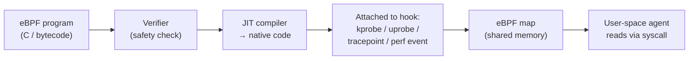
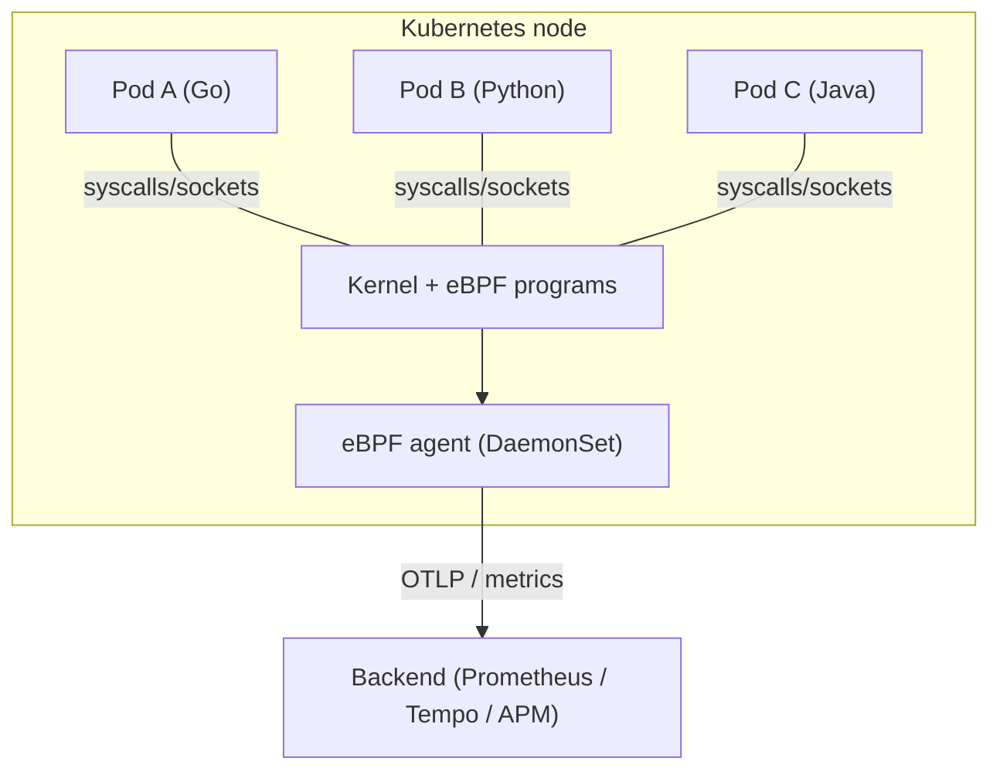
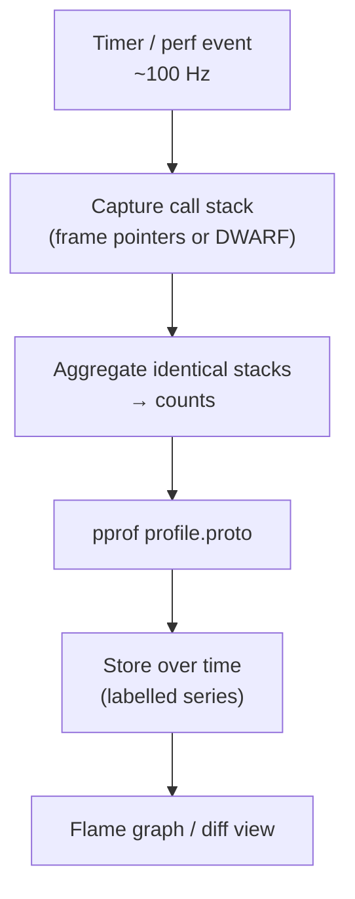

# APM, eBPF & Continuous Profiling

This topic covers three modern, closely-related observability techniques that all share one
goal: **get rich production telemetry with less manual instrumentation effort**.

- **APM (Application Performance Monitoring)** — commercial platforms (Datadog, New Relic,
  Dynatrace, Elastic APM, AppDynamics) that ship a **language agent** which auto-instruments
  your app to produce traces, metrics, and errors with little or no code change.
- **eBPF** — a Linux kernel technology that runs sandboxed programs **in the kernel** to
  observe syscalls, network, and CPU **without touching the application**. Used for zero-code
  auto-instrumentation, network observability (Cilium, Pixie), and profiling.
- **Continuous profiling** — always-on, low-overhead CPU/memory profiling in production
  (Parca, Pyroscope/Grafana, Google Cloud Profiler, `pprof`), often called the **fourth
  pillar** alongside metrics, logs, and traces.

This is the **Observability** angle. We treat all three as *signals*: what they capture, how
they work under the hood, when each beats the others, and their limits. We deliberately do
**not** teach flame-graph *reading technique* as a performance-tuning skill — that belongs to
the upcoming `performance-engineering` domain (cross-reference it). Trace/span mechanics,
sampling, and context propagation are owned by
`observability/distributed-tracing-concepts-and-context-propagation`; here we only cover how
APM agents and eBPF *produce* those spans.

> [!KEY-TAKEAWAY]
> APM = **auto-instrumentation via an in-process language agent** (rich app context, but
> per-language and often vendor-locked). eBPF = **kernel-level, zero-code, language-agnostic**
> observation (broad coverage, no redeploys, but blind to app semantics and encrypted
> payloads). Continuous profiling = **always-on statistical sampling of stacks** (the "why is
> CPU/memory high" signal the other three can't give). They are complementary, not
> substitutes.

---

## What APM is and why it exists

**Application Performance Monitoring (APM)** is the practice — and the class of commercial
tools — that automatically captures a service's performance signals and ties them to the
code that produced them. A modern APM product typically bundles:

- **Distributed traces** with automatic spans for inbound requests, outbound HTTP/gRPC calls,
  DB queries, cache calls, and message-queue operations.
- **Service-level metrics** — the RED signals (Rate, Errors, Duration) per endpoint and per
  dependency, usually derived automatically from spans.
- **Error/exception tracking** — captured stack traces grouped into issues.
- **Service maps / topology** — an auto-generated dependency graph built from trace edges.
- Increasingly: **profiles** (code-level CPU/memory) and **real-user monitoring (RUM)** on
  the frontend.

Why it matters: before APM, you got metrics and logs but had to *manually* add a timer around
every DB call and stitch context across services by hand. APM's promise is **"drop in an
agent, get a service map and latency breakdowns in minutes"** — it collapses instrumentation
effort and correlates the three pillars for you.

The classic interview framing: **APM answers "which endpoint/dependency is slow or failing,
and in which line of code?"** by combining traces (where the time went) with metrics (how
often) and errors (what broke) — all auto-correlated by trace/span IDs.

> [!INTERVIEW]
> Don't define APM as "a dashboard." Define it by its *mechanism*: an auto-instrumenting
> agent that emits correlated traces + metrics + errors, giving you a service map and
> per-endpoint RED signals without hand-written instrumentation.

---

## The vendor-agent auto-instrumentation model

The heart of APM is the **agent**: a language-specific library or runtime hook you load into
your process. It **auto-instruments** popular frameworks and clients by intercepting them so
that spans/metrics are created without you writing tracing code.

How agents hook in, by runtime:

| Runtime | Auto-instrumentation mechanism |
|---|---|
| **Java / JVM** | A `-javaagent` JAR uses **bytecode instrumentation** (ASM/Byte Buddy) to rewrite classes of known libraries (Servlet, JDBC, Spring, Kafka) at class-load time. |
| **.NET** | The CLR **profiling API** rewrites IL on the fly. |
| **Node.js** | **Monkey-patching**: the agent hijacks `require()`/module loading and wraps known modules (http, express, pg). |
| **Python / Ruby** | Import hooks / monkey-patching of library functions. |
| **Go** | Hardest — compiled, no runtime rewriting. Historically needs manual instrumentation or source-code rewriting; increasingly done via **eBPF** or compile-time instrumentation. |

The **vendor-agent model** means each APM vendor ships its own agent, its own wire protocol,
and its own backend. Advantages: turnkey, deep framework coverage, rich app-level context
(SQL text, ORM, framework internals). Disadvantages that interviewers probe:

- **Vendor lock-in** — instrumentation is coupled to one vendor's SDK/protocol; switching
  vendors historically meant re-instrumenting.
- **Per-language effort** — the vendor must build and maintain an agent per runtime; coverage
  and quality vary by language.
- **Overhead & risk** — an in-process agent adds CPU/memory and, because it rewrites
  bytecode, can occasionally break on library upgrades.
- **Go/compiled languages** — the auto-magic largely doesn't work; you fall back to manual
  spans or eBPF.

> [!WARNING]
> Auto-instrumentation is not free coverage. Agents only instrument libraries they *know*.
> Custom protocols, in-house frameworks, and business logic still need **manual spans**. APM
> gives you the skeleton; you add the meat.

---

## APM vs OpenTelemetry (open standards & lock-in)

The industry answer to APM lock-in is **OpenTelemetry (OTel)** — a CNCF standard for how
telemetry is *generated* and *transmitted*, deliberately decoupled from any backend.

The key idea: **OTel standardizes instrumentation and the wire format (OTLP); the backend
becomes swappable.** You instrument once (OTel SDK or OTel auto-instrumentation agent), export
via **OTLP** to a collector, and route to whatever backend you want — Jaeger, Prometheus,
Grafana, *or a commercial APM*. Most APM vendors now **ingest OTLP** natively.

| Dimension | Vendor APM agent | OpenTelemetry |
|---|---|---|
| Owner | One vendor | CNCF / open standard |
| Wire format | Proprietary | **OTLP** (open) |
| Lock-in | High (re-instrument to switch) | Low (swap backend, keep instrumentation) |
| Framework coverage | Often deeper/polished | Broad and growing; community-maintained |
| Backend | The vendor's only | Any OTLP-capable backend |

Nuance for senior interviews: OTel is *instrumentation + transport + semantic conventions*,
**not** a backend or a UI. It does not store data or draw service maps — you still need a
backend (Jaeger/Tempo/Prometheus or an APM). The trade-off is "polished turnkey vendor agent"
vs "portable, standards-based, own-your-data OTel." A common modern architecture is **OTel
instrumentation → OTLP → commercial APM backend**, getting portability *and* a good UI.

> [!KEY-TAKEAWAY]
> OTel doesn't replace APM backends; it replaces the *proprietary agent + wire format*, so
> your instrumentation outlives any single vendor. "Instrument once, export anywhere."

---

## What eBPF is and how it works

**eBPF (extended Berkeley Packet Filter)** lets you run small, sandboxed programs **inside the
Linux kernel** in response to events, without changing kernel source, loading kernel modules,
or modifying applications. It has become the foundation for a new generation of
observability, networking, and security tooling.

The lifecycle of an eBPF program:

Core building blocks (all commonly asked):

- **Hooks / attach points** — programs run when the kernel or an app hits an event:
  - **kprobes / kretprobes** — dynamic instrumentation of (almost any) kernel function
    entry/return.
  - **uprobes / uretprobes** — the same for **user-space** functions (e.g. a function in your
    binary or in libc/OpenSSL).
  - **tracepoints** — stable, predefined kernel instrumentation points (preferred over
    kprobes when available because they don't break across kernel versions).
  - **perf events** — sampling on a timer or hardware counters (the basis for profiling).
  - **XDP / tc / socket hooks** — networking data-path attach points.
- **The verifier** — before load, the kernel statically proves the program is **safe**: it
  must terminate (only *bounded* loops), touch no uninitialized or out-of-bounds memory, and
  stay within complexity/size limits. This is why eBPF can run in kernel context safely. It
  checks *safety*, not intent.
- **JIT compilation** — verified bytecode is compiled to native machine code so it runs at
  near-native speed.
- **Maps** — kernel/user shared data structures (hash maps, arrays, ring/perf buffers, LRU,
  **stack-trace maps**). eBPF programs write to maps; a user-space agent reads them via
  syscalls. This is how in-kernel data reaches your collector.
- **Helper functions** — programs cannot call arbitrary kernel code; they use a stable set of
  **BPF helpers**. **CO-RE (Compile Once, Run Everywhere)** + BTF lets one compiled program
  run across kernel versions with different struct layouts.

Why observability loves it: **one agent, per-node, sees everything** — every process's
syscalls, network, and CPU — with **no application changes, no redeploys, and language
agnosticism**, at low overhead.

> [!INTERVIEW]
> If asked "why is eBPF safe to run in the kernel?" the answer is the **verifier + sandbox**:
> it statically proves termination and memory safety before loading, then JITs to native
> code. If asked "how does data get out?" — **maps** read from user space via syscalls.

---

## eBPF for zero-code auto-instrumentation & network observability

Because eBPF observes at the kernel boundary (syscalls, sockets) it can produce telemetry
**without any SDK in the application** — the pitch is **"instrument without instrumenting."**

Common eBPF observability use cases:

- **Zero-code auto-instrumentation** — tools like **Grafana Beyla**, **Odigos**, and
  Pixie/OpenTelemetry-eBPF attach uprobes/kprobes to detect HTTP/gRPC/SQL at the syscall and
  library level and emit **RED metrics and traces** for services that were never manually
  instrumented — including **Go**, where language-agent auto-instrumentation is hard.
- **Network observability** — **Cilium** (CNI) and **Hubble** give L3/L4/L7 flow visibility,
  service maps, DNS, and network policy enforcement from the kernel data path. **Pixie**
  captures full-body requests for many protocols cluster-wide.
- **Profiling** — whole-system CPU/memory profiling (Parca Agent, Pyroscope eBPF, Datadog
  profiler). See the profiling subtopics below.
- **Security observability** — **Falco**, Tetragon: runtime detection from syscalls.

The big advantage vs a language agent: **one node-level agent covers every pod/process in any
language with no code change and no redeploy** — ideal for Kubernetes platform teams who don't
control every service's source.

---

## When eBPF beats SDK instrumentation — and its limits

This trade-off is a favorite senior interview question. Neither is strictly better.

**When eBPF wins:**

- You **can't or won't modify the app** (third-party binaries, legacy services, no build
  access) or can't redeploy.
- You need **language-agnostic, fleet-wide** coverage from one DaemonSet, including compiled
  languages like Go.
- You want **kernel/network-level signals** (TCP retransmits, DNS latency, syscall latency,
  L3/L4 flows) that an in-process SDK simply cannot see.
- **Whole-system profiling** across all processes, including native/runtime code.

**Where eBPF is limited (and an SDK wins):**

- **Encrypted payloads (TLS)** — traffic on the wire is ciphertext. To see HTTP inside TLS,
  eBPF must attach **uprobes to the TLS library** (e.g. `SSL_read`/`SSL_write` in OpenSSL)
  *before* encryption — which is fragile, library-specific, and can miss statically-linked or
  BoringSSL/Go-crypto cases.
- **Application semantics** — eBPF sees bytes and syscalls, not "this is the checkout flow for
  customer X." It has **no business context**, no logical trace attributes, and weak
  understanding of framework-level structure. An in-process SDK naturally has all of this.
- **Complex protocol parsing** — HTTP/2 multiplexing, gRPC framing, and stateful protocols are
  hard to reconstruct from raw socket buffers within the verifier's size/complexity limits.
- **Context propagation across services** — an SDK injects W3C `traceparent` headers to link
  spans across process hops. eBPF sees a request but can't easily create/propagate distributed
  trace context, so cross-service **distributed** traces are harder (many eBPF tools produce
  per-service RED + local spans rather than fully stitched distributed traces, or they rely on
  headers the app already sets).
- **Requires a modern kernel & privileges** — needs a recent Linux kernel and elevated
  capabilities (`CAP_BPF`/root); managed environments may restrict it. Largely Linux-only.

> [!WARNING]
> The single most-tested eBPF limitation: **it can't read encrypted (TLS) payloads from the
> wire.** You must hook the crypto library with uprobes *before* encryption — fragile and
> incomplete. Don't claim eBPF "sees all your HTTP traffic" without this caveat.

The pragmatic senior answer: use **eBPF for broad, zero-touch, language-agnostic baseline
coverage and network/profiling signals**, and **SDK/OTel instrumentation for deep app context
and reliable cross-service distributed tracing** — they layer together.

---

## Continuous profiling and the "fourth pillar"

**Profiling** answers a question metrics, logs, and traces struggle with: **"which lines of
code / functions are consuming CPU (or allocating memory) right now, and how much?"** A trace
tells you *service B's span took 200 ms*; a profile tells you *that 200 ms was spent 60% in
JSON serialization and 30% in regex compilation*.

**Continuous profiling** means running that profiler **always-on in production** at low
overhead, storing profiles over time so you can query "what was hot last Tuesday at 3am" and
diff releases. This is why it's increasingly called the **fourth pillar of observability**
(alongside metrics, logs, traces) — it's a distinct, always-available signal about **resource
consumption at code granularity**.

Why it matters for interviews:

- It closes the loop between **cost/performance regressions and code**: a 15% CPU rise after a
  deploy can be attributed to a specific function by **diffing** two flame graphs.
- It's **fleet-wide and continuous**, unlike traditional profiling you'd run manually on one
  box during an incident (by which time the incident is often over).
- It directly targets **efficiency / cloud cost**: continuous profiling is often justified as
  a FinOps tool — find the hottest code across the fleet and optimize it.

> [!KEY-TAKEAWAY]
> Traces localize latency to a *span/service*; profiles localize resource use to a
> *function/line*. Continuous profiling makes that always-on and diffable across releases —
> the signal that answers "*why* is this CPU/memory high?"

Boundary note: **reading and interpreting flame graphs as a tuning skill** (identifying
`self` vs cumulative time, spotting lock contention, off-CPU analysis) is a
`performance-engineering` topic. Here we care that continuous profiling *exists as an
always-on production signal* and how it's produced.

---

## How continuous profiling works (sampling, pprof, flame graphs)

Continuous profilers are almost always **statistical sampling profilers**, not instrumenting
profilers, because sampling is what keeps overhead low enough for production.

Mechanics:

- **Sampling** — a timer interrupt (commonly **~100 Hz**, i.e. 100 stack captures per second
  per CPU/thread) grabs the current **call stack**. Functions that appear in more samples were
  on-CPU more, so counts approximate CPU time. Overhead is typically **a few percent or less**
  — the point of continuous profiling is that it's cheap enough to leave on.
- **Stack unwinding** — to capture the stack you must walk frames. Two approaches:
  - **Frame pointers** — fast and simple, but many binaries are compiled with frame pointers
    omitted for a small perf gain (a long-standing pain point; distros are re-enabling them).
  - **DWARF/debug-info unwinding** — works without frame pointers but is heavier and needs
    debug info; eBPF profilers ship unwinders to do this in/near the kernel.
- **Profile types** — **CPU** (on-CPU time), **heap/allocations** (memory), **off-CPU**
  (blocked/waiting time), plus lock/mutex, goroutine, etc.
- **pprof format** — Google's **`pprof` `profile.proto`** is the de-facto interchange format
  for profiles. Go's `net/http/pprof`, Parca, and Pyroscope all speak it. A profile is
  essentially a set of **stack samples with a value** (e.g. CPU nanoseconds or bytes) and
  symbol/location tables.
- **Flame graphs** — the standard visualization: each box is a stack frame, **width ∝ time/
  resource** spent in that frame (and its children), stacked by call depth. **Differential
  (diff) flame graphs** color frames by whether they grew or shrank between two profiles —
  the release-regression workflow. (Interpreting them deeply is a perf-engineering skill.)

> [!TIP]
> Sampling is **statistical**: at 100 Hz a function that runs for 1 ms may never be sampled.
> Profiles are accurate for *aggregate* hot paths over time, not for pinpointing a single
> rare, short call. That's a feature — it's what keeps overhead tiny.

---

## Continuous profiling tools & eBPF-based whole-system profiling

The tool landscape splits into **in-process/runtime profilers** and **eBPF whole-system
profilers**.

| Tool | Approach | Notes |
|---|---|---|
| **Go `pprof`** (`net/http/pprof`) | In-process, per-language runtime | Built into Go; exposes CPU/heap/goroutine profiles in pprof format. Pull-based endpoint. |
| **Parca** (CNCF) | **eBPF whole-system** agent + server | Node-level DaemonSet, zero-code, language-agnostic; stores pprof over time; Prometheus-style labels; diff flame graphs. |
| **Pyroscope / Grafana Pyroscope** | Both: SDKs (push) **and** eBPF agent | Now part of Grafana stack; correlates traces↔profiles ("span profiles"). |
| **Google Cloud Profiler / Datadog / Elastic Universal Profiling** | Managed, often eBPF or agent | Fleet-wide, hosted backend. |
| **`perf`** | Linux built-in sampling profiler | The classic; the ancestor of flame graphs (Brendan Gregg). Not "continuous" by itself. |

**eBPF whole-system profiling** (Parca Agent, Pyroscope eBPF, Elastic Universal Profiling) is
the modern zero-instrumentation approach:

- One **DaemonSet per node** attaches an eBPF program to a **perf event** (the ~100 Hz timer).
- On each sample the eBPF program walks the stack **in the kernel** (using frame pointers or a
  bundled DWARF unwinder) and records it in a **stack-trace map**.
- Because it's at the kernel level, it profiles **every process on the node in every language
  — including native, kernel, and runtime frames — with no code changes and one agent.**
- Symbolization (turning addresses into function names) happens using debug info; for
  interpreted/JIT languages (JVM, Python, Node) extra symbol maps are needed to get meaningful
  frames.

The classic trade-off mirrors the eBPF-vs-SDK one: **eBPF profilers give zero-touch,
whole-fleet, cross-language coverage** including native code; **language runtime profilers
(Go pprof, JFR, async-profiler)** give richer language-specific detail (e.g. accurate
JIT/interpreted frames, allocation call sites) but must be built into each app.

> [!INTERVIEW]
> "How can you profile production continuously without changing the app?" → an **eBPF agent as
> a DaemonSet** samples every process's stack at the kernel level (~100 Hz via perf events),
> stores pprof over time, and lets you diff flame graphs across releases — language-agnostic
> and low-overhead.

---

## Common follow-up questions

- **"APM vs OpenTelemetry — do I need both?"** OTel is the open instrumentation + OTLP
  transport standard; APM is a backend/UI (often with its own agent). Modern best practice:
  instrument with OTel, export OTLP to whatever backend (including a commercial APM) so you
  avoid lock-in but keep a good UI.
- **"Why can't eBPF just see all my HTTP traffic?"** TLS. On the wire it's ciphertext; you
  must uprobe the crypto library before encryption, which is fragile and incomplete. Plus
  HTTP/2 multiplexing is hard to reconstruct within verifier limits.
- **"eBPF or SDK for tracing?"** eBPF for zero-touch, language-agnostic, fleet-wide baseline +
  network signals; SDK/OTel for deep app context and reliable cross-service distributed trace
  context propagation. Layer them.
- **"Why is continuous profiling the 'fourth pillar'?"** It's a distinct always-on signal
  attributing CPU/memory to specific functions/lines — the "why is resource use high" answer
  that metrics/logs/traces don't give at code granularity.
- **"What's the overhead of continuous profiling?"** Sampling profilers at ~100 Hz cost a few
  percent or less — low enough to run always-on in production; that's the whole point vs
  on-demand profiling.
- **"Frame pointers vs DWARF unwinding?"** Frame pointers make stack walking cheap but are
  often omitted by compilers; DWARF/debug-info unwinding works without them but is heavier —
  eBPF profilers bundle unwinders to cope.
- **"Can eBPF do distributed tracing?"** It can produce per-service RED metrics and local
  spans easily, but stitching a full distributed trace needs trace-context propagation
  (W3C `traceparent`) that typically requires the app/SDK to inject headers.
- **"Does APM auto-instrument Go?"** Poorly — Go is compiled with no runtime bytecode
  rewriting, so Go coverage often relies on manual instrumentation, compile-time
  instrumentation, or eBPF.

## References

- OpenTelemetry docs — signals, OTLP, auto-instrumentation, semantic conventions:
  <https://opentelemetry.io/docs/>
- W3C Trace Context (`traceparent`/`tracestate`): <https://www.w3.org/TR/trace-context/>
- ebpf.io — "What is eBPF?" (verifier, JIT, maps, kprobes/uprobes/tracepoints):
  <https://ebpf.io/what-is-ebpf/>
- Cilium & Hubble docs (eBPF network observability): <https://docs.cilium.io/>
- Grafana Beyla (eBPF zero-code auto-instrumentation): <https://grafana.com/docs/beyla/>
- Parca docs (eBPF continuous profiling, pprof, diff flame graphs):
  <https://www.parca.dev/docs/>
- Grafana Pyroscope docs (continuous profiling, span profiles):
  <https://grafana.com/docs/pyroscope/>
- Google `pprof` profile format: <https://github.com/google/pprof>
- Brendan Gregg — Flame Graphs & the USE method: <https://www.brendangregg.com/flamegraphs.html>
- Datadog / New Relic / Dynatrace / Elastic APM product docs (vendor-agent auto-instrumentation).
