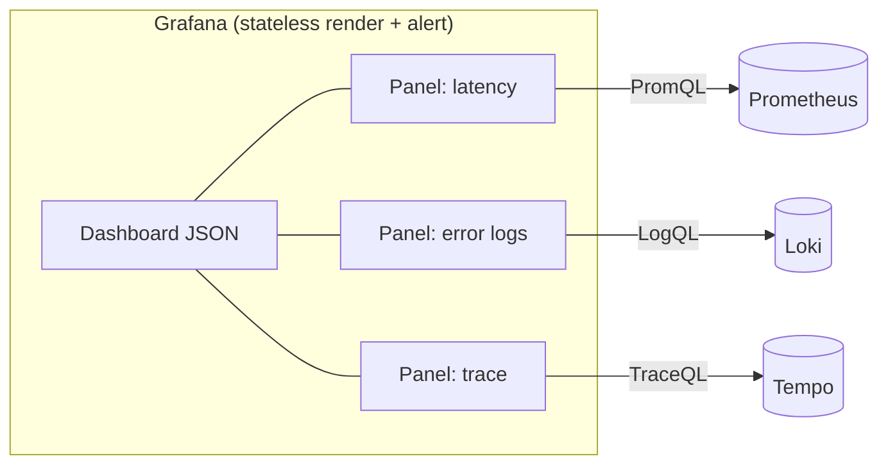
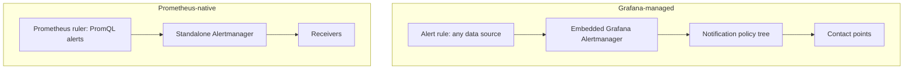

# Dashboards & Visualization with Grafana

Grafana is an open-source **visualization and alerting layer** that sits *on top of* your
telemetry stores. It does not store metrics, logs, or traces itself — it queries data
sources (Prometheus, Loki, Tempo, Elasticsearch, SQL databases, cloud APIs) and renders
the results as panels on dashboards. The interview value of this topic is showing you
understand two things: (1) the **mechanics** — data sources, panels, template variables,
exemplars, provisioning; and (2) the **design judgment** — RED/USE dashboards, what makes
a dashboard actionable at 3 a.m., and how to avoid vanity metrics.

This is the **Observability** domain, so we stay concrete about how Grafana actually talks
to its backends. The architecture-level "where does monitoring fit" discussion lives in
`system-design/observability-monitoring-reliability`. The incident/on-call *process*
(incident command, postmortems, runbooks) belongs to the upcoming reliability-and-operations
domain — here we keep on-call at the **signal-quality / dashboard-design** level. Alert
*routing* internals (Alertmanager grouping, inhibition, silences) are covered in
`alerting-rules-and-alertmanager`; here we cover Grafana's *unified alerting* and how it
relates to Alertmanager.

> [!KEY-TAKEAWAY]
> Grafana is a **stateless query-and-render** tool. A dashboard is a JSON document
> describing panels; each panel runs one or more queries against a **data source** and
> visualizes the result. Grafana's superpowers are **mixing data sources** on one
> dashboard, **template variables** for reusable/dynamic dashboards, **exemplars** to jump
> from a metric spike to the exact trace, and treating dashboards as **code**. Good
> dashboards answer a *question* (is the service healthy? RED/USE) — they are not a wall of
> every metric you can scrape (vanity).

---

## Grafana as a multi-source visualization layer

Grafana's core identity is that it is **not a database**. It is a visualization frontend
that federates over many backends. You configure **data sources** (each is a plugin that
knows how to talk to one backend's API and query language), and every panel names the data
source it queries. This decoupling is the whole point: the same tool visualizes Prometheus
metrics, Loki logs, Tempo traces, a PostgreSQL business table, and CloudWatch — with a
consistent panel/dashboard/alerting UX on top.

Why this matters in interviews: it explains both Grafana's strengths and its limits.

- **Strength — single pane of glass.** One dashboard can correlate a latency spike
  (Prometheus), the error logs during that spike (Loki), and the slow trace
  (Tempo) — without leaving Grafana. Operators don't context-switch across five tools.
- **Strength — no lock-in on storage.** You pick the best store per signal (Prometheus for
  metrics, Loki/Elastic for logs, Tempo/Jaeger for traces) and Grafana unifies the view.
- **Limit — Grafana is only as good as the query.** It pushes computation *down* to the
  data source. A slow PromQL query or a huge Loki scan is slow in Grafana; Grafana can't
  magically make a bad backend fast. It does add **query caching** and (in enterprise)
  recorded queries, but the heavy lifting is the data source's.
- **Limit — no cross-source joins in the query engine (mostly).** Historically you
  couldn't `JOIN` a Prometheus series to a SQL row in one query. Grafana's **mixed data
  source** and **expressions/transformations** narrow this, but true joins happen client-side
  on already-fetched frames, not pushed down.



> [!INTERVIEW]
> If asked "does Grafana store your metrics?" the answer is **no** — it queries data
> sources and renders results. Grafana's own SQLite/MySQL/Postgres database stores
> *dashboards, users, data-source configs, and alert rules*, not time-series data.

## Data sources: Prometheus, Loki, Tempo, and mixed sources

A **data source** is a configured connection to one backend, backed by a plugin. Common
ones and their query languages:

| Data source | Signal | Query language | Notes |
|---|---|---|---|
| Prometheus / Mimir / Thanos | metrics | PromQL | The canonical metrics source; supports exemplars |
| Loki | logs | LogQL | Grafana Labs' logs store; label-indexed like Prometheus |
| Tempo | traces | TraceQL | Trace store; integrates with metrics via exemplars |
| Elasticsearch / OpenSearch | logs (and metrics) | Lucene / query DSL | Full-text; heavier index |
| Graphite / InfluxDB | metrics | Graphite / Flux / InfluxQL | Legacy / TSDB alternatives |
| SQL (Postgres/MySQL/MSSQL) | any tabular | SQL | Business metrics, config tables |
| CloudWatch / Azure Monitor / GCM | cloud metrics/logs | vendor API | Cloud-native sources |

**Default vs explicit data source.** One data source can be marked default; panels that
don't name one use it. Best practice for portable dashboards is to *not* hard-code a data
source UID but reference a **data-source template variable** (see below), so the same JSON
works across environments (dev/staging/prod each with its own Prometheus).

**Mixed data sources.** Selecting the special **`-- Mixed --`** data source on a panel lets
each *query* within that panel target a *different* data source. Example: overlay
Prometheus request rate and a business KPI from Postgres on the same time-series panel. Each
query still runs against its own backend; Grafana aligns the returned frames on the shared
time axis at render time.

**Correlation across sources** is where a lot of the value lives:

- **Metrics → traces** via **exemplars** (a metric sample carries a trace ID; see below).
- **Logs → traces** via **derived fields** in Loki (regex-extract a trace ID from a log
  line and turn it into a link to Tempo).
- **Traces → logs/metrics** via Tempo's "trace to logs" / "trace to metrics" config.

> [!TIP]
> Loki is deliberately designed to be *cheap* by indexing only **labels**, not full log
> content — LogQL then greps the compressed chunks. That is the opposite trade-off from
> Elasticsearch (index everything, fast arbitrary search, higher cost). Know this contrast;
> it's a frequent follow-up.

## Panels and visualization types

A **panel** is the unit of visualization on a dashboard: one or more **queries** + a
**visualization type** + display options (thresholds, units, legend, overrides). Grafana
ships many visualization types; picking the right one is a real skill.

| Visualization | Best for | Anti-pattern |
|---|---|---|
| **Time series** | Trends over time (rate, latency, saturation) | Showing a single current number |
| **Stat** | One big current value + sparkline (e.g. current error rate) | Dozens of stats crammed together |
| **Gauge** / **Bar gauge** | Value against thresholds / capacity | Data with no meaningful max |
| **Table** | Per-label breakdowns, top-N, discrete rows | High-frequency trends |
| **Heatmap** | Latency **distributions** over time (histogram buckets) | Averages (which hide bimodality) |
| **Histogram** | Distribution snapshot | Time evolution |
| **Logs** | Loki/Elastic log lines | Metric trends |
| **Trace** / **Node graph** | Tempo/Jaeger traces, service maps | — |
| **State timeline** / **Status history** | Up/down, discrete states over time | Continuous values |

Key panel mechanics interviewers probe:

- **Thresholds** color a panel by value bands (green/amber/red) and can drive gauge/stat
  coloring — a lightweight way to show "is this bad?" at a glance.
- **Field overrides** let you style one series differently (e.g. put `p99` on a second Y
  axis, or color the `error` series red).
- **Transformations** run *in Grafana after the query*: join, filter, group-by, organize,
  reduce, calculate a new field. Useful for mixed sources and for turning a query result
  into a table — but remember they run client-side/server-side on fetched frames, so pushing
  aggregation into PromQL is usually cheaper than transforming in Grafana.
- **Heatmap for latency** is a signature senior answer: a histogram (`_bucket` series)
  rendered as a heatmap reveals **bimodal** latency (e.g. a fast cache path and a slow DB
  path) that a p99 line or an average would smear away.

**Worked example — why the average lies.** Take 1,000 requests in a window: 900 are cache
hits at **5 ms**, 100 miss and hit the DB at **800 ms**.

- **Average** = (900 × 5 + 100 × 800) / 1000 = (4,500 + 80,000) / 1000 = **84.5 ms**.
- **p50** (the 500th request, sorted) is a cache hit = **5 ms**.
- **p99** (the 990th request) — requests 901–1000 are the DB path — = **800 ms**.

A single-stat panel reading "avg latency **84.5 ms**" describes a value **no request
actually experienced**: every request was either ~5 ms or ~800 ms, and 84.5 ms sits in the
empty gap between the two clusters. The average has invented a fictional "typical" request.
A **heatmap** of the same data shows two bright bands — one at 5 ms, one at 800 ms — so you
instantly see the bimodality and can ask "why do 10% of requests fall off the fast path?"

> [!WARNING]
> A **gauge/single-stat** showing an *average* latency is one of the most misleading panels
> you can build. Averages hide tail latency and bimodality. Prefer time-series of
> **percentiles** (`histogram_quantile`) or a **heatmap** of the full distribution.

## Template variables and dynamic dashboards

**Template variables** turn a static dashboard into a reusable, parameterized one. A
variable (e.g. `$service`, `$instance`, `$datasource`) renders as a dropdown at the top of
the dashboard; its value is interpolated into queries, panel titles, and links. This is how
one dashboard serves 200 services instead of copy-pasting 200 dashboards.

Common variable types:

- **Query** — options come from a query against a data source, e.g. Prometheus
  `label_values(http_requests_total, service)` lists every `service` label value currently
  present. Options update as your fleet changes → *dynamic*.
- **Custom** — a hand-typed static list.
- **Interval** — for choosing a rate window / `$__interval` scaling.
- **Data source** — lets the user pick which Prometheus (dev/staging/prod). Referencing this
  in panels makes the dashboard environment-portable.
- **Constant / Text box / Ad hoc filters** — the last injects arbitrary label filters
  applied to *every* query on the dashboard.

**Chaining / dependent variables:** a variable's query can reference another variable, e.g.
`label_values(up{cluster="$cluster"}, instance)` so picking a cluster narrows the instance
list. **Multi-value** variables let you select several values; in PromQL you interpolate
them into a regex match with the `=~` operator. With Prometheus, a multi-value `$service`
auto-expands to a pipe-joined regex group — e.g. `service=~"$service"` becomes
`service=~"(payments|checkout|search)"` (Grafana's default regex-safe formatting). Use the
explicit **`${service:regex}`** format when you need special characters in the values
escaped for a literal match.

> [!WARNING]
> Keep variable-driving labels **low-cardinality**. A `label_values()` query on a
> high-cardinality label (e.g. `pod` or `instance` across a 10k-node fleet, or worse
> `user_id`) enumerates every distinct value: the backing series-enumeration query is slow,
> the dropdown becomes a scroll-forever list nobody can use, and it runs on **every**
> dashboard load. Also mind the variable's **refresh mode** — "On dashboard load" re-queries
> options each open (fresher, more load) vs "On time range change" (cheaper, can go stale).

```promql
# Panel query driven by template variables:
sum by (status) (
  rate(http_requests_total{service=~"$service", instance=~"$instance"}[$__rate_interval])
)
```

Two built-ins worth knowing cold:

- **`$__rate_interval`** — Grafana-computed window that is always ≥ 4× the scrape interval,
  so `rate()`/`irate()` never returns gaps or NaN when you zoom. Prefer it over a hard-coded
  `[5m]` or the older `$__interval` for rate queries.
- **`$__interval`** — the time width of one pixel/step, used to keep the number of returned
  points sane as you zoom in/out.

**Worked example — why `[15s]` breaks but `$__rate_interval` doesn't.** Grafana computes
`$__rate_interval = max($__interval + scrape_interval, 4 × scrape_interval)`. Say your
scrape interval is **15 s** and you're zoomed in tight so the step `$__interval` resolves to
**10 s**:

- **Hard-coded `rate(...[10s])`:** samples land every 15 s, so a 10 s window frequently
  contains only **one** sample (sometimes zero). `rate()` needs **≥ 2 samples** in the
  window to compute a delta → it returns nothing → the graph shows **gaps / NaN**.
- **`$__rate_interval`:** = max(10 s + 15 s, 4 × 15 s) = max(**25 s**, **60 s**) = **60 s**.
  A 60 s window always spans ~4 scrape samples, so `rate()` always has ≥ 2 points → a
  smooth, gap-free line. The `4 × scrape` floor is exactly the guarantee that no window can
  starve `rate()`.

> [!INTERVIEW]
> "How would you build one dashboard that works for every microservice?" → A **query
> variable** `label_values(..., service)` + a **data source variable** for environment, and
> parameterize every query with `service=~"$service"`. That single JSON, provisioned as
> code, replaces hundreds of hand-built dashboards.

## Provisioning and dashboards-as-code

Clicking dashboards together in the UI is fine for exploration, but production dashboards
should be **version-controlled artifacts** — reviewed in git, reproducible across
environments, and immune to "someone edited prod at 2 a.m. and nobody knows what changed."
Grafana supports this through **provisioning**: config that Grafana reads on startup (and
on a poll interval) to create data sources, folders, and dashboards from files.

- **File-based provisioning** — YAML files in Grafana's provisioning directory
  (`/etc/grafana/provisioning/{datasources,dashboards}/`). A `dashboards` provider YAML
  points at a folder of dashboard **JSON models**; a `datasources` YAML declares each data
  source (type, URL, UID). Grafana loads them at boot and re-reads on `updateIntervalSeconds`.
- **Read-only in the UI (the classic gotcha).** A provisioned dashboard shows a **lock/
  "Provisioned" banner** and cannot be saved from the UI — because the file is the source of
  truth and Grafana would overwrite your edit on the next reload. Edits must go back to the
  source file (or you'll "Save As" a copy). Interviewers love this: it's what enforces
  no-drift GitOps.
- **API vs Terraform vs Grizzly.** Three ways to push dashboards as code: the HTTP
  **`/api/dashboards/db`** API (imperative, good for CI), the **`grafana` Terraform
  provider** (declarative, state-tracked), and **Grizzly** (`grr`, a kubectl-style CLI over
  the API). Same JSON model underneath.
- **The UID / datasource-variable portability pitfall.** When you export a dashboard's JSON,
  its panels reference the data source by **UID** — a value that differs per Grafana
  instance. Import that JSON elsewhere and every panel says "datasource not found." Fixes:
  either export with **`__inputs`** (Grafana's "Export for sharing externally" prompts for a
  datasource on import) or, better, parameterize panels with a **data-source template
  variable** (`${datasource}`) so the same JSON is environment-portable by design.

> [!TIP]
> If asked "how do you review and roll back dashboard changes?" the crisp answer is:
> dashboards are **JSON models under provisioning**, changes go through a git PR, Terraform/
> Grizzly/API applies them, and the live dashboard is **read-only** so no one can silently
> click-edit prod. Rollback = revert the commit.

## The RED and USE dashboard patterns

Two canonical patterns tell you *which* metrics to put on a dashboard, so you're not
guessing.

**RED — for request-driven services** (Tom Wilkie). For every service, show:

- **R**ate — requests per second.
- **E**rrors — failed requests per second (or error ratio).
- **D**uration — latency distribution (percentiles / heatmap).

RED is essentially the request-facing subset of Google's **four golden signals** (latency,
traffic, errors, saturation). It's the default "is this service healthy?" dashboard.

```promql
# Rate
sum(rate(http_requests_total{service="$service"}[$__rate_interval]))
# Error rate (ratio of 5xx)
sum(rate(http_requests_total{service="$service",code=~"5.."}[$__rate_interval]))
  / sum(rate(http_requests_total{service="$service"}[$__rate_interval]))
# Duration (p99 from a histogram)
histogram_quantile(0.99,
  sum by (le) (rate(http_request_duration_seconds_bucket{service="$service"}[$__rate_interval])))
```

**USE — for resources** (Brendan Gregg). For every resource (CPU, memory, disk, network,
queues), show:

- **U**tilization — % of time the resource was busy.
- **S**aturation — degree of extra queued work it couldn't service (run-queue, queue depth).
- **E**rrors — error events (packet drops, ECC errors, failed allocations).

USE is for *finding the bottleneck*; RED is for *seeing user-facing symptoms*. A mature
setup has both: RED at the top (symptoms/SLIs) and USE below (causes/resources) so you can
drill from "users see slow requests" to "the DB connection pool is saturated."

> [!TIP]
> RED = **request** view (services). USE = **resource** view (machines/queues). The
> four golden signals overlap both: latency+traffic+errors ≈ RED, saturation ≈ the S in
> USE.

## Dashboard design principles

A dashboard is a *communication artifact*, not a data dump. Interviewers love asking "what
makes a good dashboard?" because it reveals whether you've actually been on-call.

- **Most important at the top, left-to-right by importance.** SLIs / symptoms (RED) go
  top; supporting/causal detail (USE, per-endpoint breakdowns) below. An on-call engineer
  should get "healthy or not?" in the first screen without scrolling.
- **Answer one question per dashboard.** "Is service X healthy?" or "What is the state of
  the ingestion pipeline?" — not "every metric we emit." Overview dashboard → drill-down
  dashboards, linked.
- **Consistent time range across panels.** All panels share the dashboard time picker so a
  spike at 14:32 lines up everywhere. Beware mixing panels with hard-coded ranges — it
  breaks correlation.
- **Consistent, correct units and thresholds.** Set units (seconds, bytes, req/s) so
  Grafana formats axes; use thresholds/color to encode "good/bad" so the eye finds problems
  without reading numbers.
- **Reduce clutter / cognitive load.** Fewer, well-chosen panels beat a wall of graphs.
  Group related panels into **rows**; collapse deep-dive rows by default.
- **Link drill-downs.** Use **data links** and **dashboard links** so clicking a spike jumps
  to a filtered detail dashboard, to logs (Loki), or to a trace (exemplar). This turns a
  dashboard from a picture into an investigation tool.
- **Design for the tired reader.** On-call dashboards are read under stress at 3 a.m. —
  optimize for glanceability, not for showing off every dimension.

> [!WARNING]
> A dashboard with 60 panels and no hierarchy is a *worse* signal than 6 well-chosen
> panels. During an incident nobody scrolls through 60 graphs; they need symptom → cause in
> two clicks. "More graphs" is not "more observable."

## Annotations

**Annotations** are time-stamped event markers overlaid on graphs — vertical lines/regions
that mark *when something happened*. They convert "the p99 jumped at 14:32" into "the p99
jumped **right after the 14:31 deploy**," which is often the whole diagnosis.

Sources of annotations:

- **Manual** — Ctrl/Cmd-click a graph to mark an event (with a note/tags).
- **Built-in `Annotations & Alerts`** — Grafana's own alert state changes are annotated
  automatically.
- **Annotation queries** — pull events from a data source (e.g. a Loki query for
  `deploy` events, a Prometheus/SQL query, or an external system) and render them as
  markers. A classic setup: CI/CD posts a deploy annotation via the Grafana HTTP API, so
  every deploy shows as a line on latency/error graphs.
- **Region annotations** — a start+end pair marks a *window* (e.g. a maintenance window or
  an incident duration).

> [!TIP]
> The single highest-leverage annotation is **"deploy happened here."** Correlating a
> metric regression with the deploy that caused it is the most common real-world use of
> annotations, and it's a great thing to mention when asked how you'd speed up root-cause.

## Exemplars: jumping from a metric to a trace

**Exemplars** solve the "metrics tell me *that* it's slow, but not *which request*"
problem. An exemplar is a **specific example data point** attached to a metric sample that
carries a **trace ID** (and optional labels). In Grafana, exemplars appear as little
diamonds/stars on a time-series panel; clicking one jumps straight to that **trace** in
Tempo/Jaeger. This is the concrete metrics → traces bridge.

How it works end to end:

1. Instrumentation records an exemplar when it updates a histogram — e.g. a slow request
   observed into `http_request_duration_seconds` attaches the current `trace_id`.
2. Exemplars are exposed in the **OpenMetrics** exposition format: a sample line with a
   trailing `# {trace_id="..."} value timestamp` after a `#`.
3. **Prometheus** stores exemplars in a separate in-memory, fixed-size circular **exemplar
   storage** (must be enabled; it's capped and not long-retained — exemplars are a *sampling*
   of examples, not every data point).
4. Grafana's **Prometheus data source** queries exemplars alongside the metric (the
   `query_exemplars` API) and overlays them; the trace-ID field is configured to link to a
   trace data source.

```
# OpenMetrics exposition with an exemplar (note the trailing # {...}):
http_request_duration_seconds_bucket{le="0.5"} 3 # {trace_id="a1b2c3d4"} 0.42 1690000000
```

> [!INTERVIEW]
> Exemplars are the crisp answer to "how do you connect metrics and traces without
> guessing?" Metrics are aggregates (cheap, always-on); a matching exemplar hands you the
> **exact trace ID** of a representative slow/failed request so you can open the waterfall.
> Caveat: exemplar storage is small and Prometheus-only in Grafana's data source, so it's a
> *pointer to examples*, not a full metrics-to-traces join.

## Grafana unified alerting vs Alertmanager

Grafana can *both* alert on its own and *drive* Prometheus Alertmanager, which confuses
people. The key distinctions:

**Grafana Unified Alerting** (default since Grafana 9; replaced legacy per-panel
"dashboard alerts"). Its model mirrors Prometheus/Alertmanager concepts:

- **Alert rules** — a query + condition + evaluation interval + `for` (pending) duration.
  Rules are **multi-dimensional**: one rule produces one alert *per series* returned. Two
  kinds:
  - **Grafana-managed rules** — evaluated *by Grafana itself*, can query **any** data source
    (even mix them via expressions) and even alert on Loki logs or SQL. This is the big win
    over Alertmanager, which only alerts on Prometheus-style rules.
  - **Data-source-managed rules** — recording/alerting rules stored and evaluated in the
    data source (Mimir/Loki/Prometheus-compatible "ruler"). Grafana just edits them.
- **Contact points** — where a notification goes (email, Slack, PagerDuty, webhook…).
  Replaces legacy "notification channels."
- **Notification policies** — a routing **tree** that matches alert labels and decides which
  contact point + grouping/timing applies. This is exactly Alertmanager's `route` +
  grouping/inhibition/silence model — because Grafana **embeds an Alertmanager** ("Grafana
  Alertmanager") to handle notification for Grafana-managed alerts.

**Prometheus Alertmanager** (standalone). Prometheus/Mimir *evaluate* alerting rules and
*fire* alerts to Alertmanager, which handles **grouping, deduplication, inhibition,
silencing, and routing** to receivers. Grafana can be pointed at an **external
Alertmanager** so its rules' notifications are handled there instead of the built-in one.

| | Grafana-managed alerting | Prometheus + Alertmanager |
|---|---|---|
| Rule evaluation | Grafana | Prometheus/Mimir ruler |
| Data sources | Any (mix metrics/logs/SQL) | Prometheus-model metrics only |
| Notification/routing | Embedded Grafana Alertmanager | Standalone Alertmanager |
| Config as code | Grafana provisioning / API / Terraform | rules files + alertmanager.yml |
| Best when | Multi-source, dashboard-centric teams | Prometheus-native, GitOps rule files |



> [!WARNING]
> Legacy Grafana "dashboard alerts" (one alert tied to one panel) are **deprecated** —
> don't propose them. Unified Alerting decouples rules from panels, supports multi-series
> rules, and adds the notification-policy routing tree.

## Vanity metrics and the good on-call dashboard

The failure mode of dashboards is measuring what's *easy* or *impressive* rather than what's
*actionable*. Interviewers use this to separate people who've operated systems from people
who've only built graphs.

**Vanity metrics** look good but don't change any decision: "total requests served since
launch," a giant "10 billion events!" counter, raw CPU % with no SLO context. Signs a metric
is vanity: it only goes up, nobody would page on it, and it doesn't map to a user outcome.
Prefer **actionable metrics** tied to SLIs and user experience — error *ratio*, latency
*percentiles* vs an SLO, saturation vs capacity.

**What makes a good on-call dashboard:**

- **Symptom-oriented, top of page.** Lead with SLIs / RED (are users hurting?), not causes.
  This aligns with Google SRE's "alert on symptoms, not causes."
- **Every panel maps to a decision.** If a panel wouldn't change what you do during an
  incident, it's clutter. Deep-dive/cause panels live below or on linked drill-downs.
- **SLO / error-budget context.** Show latency/error against the *threshold*, not in a
  vacuum — a p99 of 300 ms is fine or terrible depending on the SLO.
- **Fast to read, correlated.** Consistent time range, deploy annotations, thresholds for
  color, drill-down links to logs/traces (exemplars). Glanceable under stress.
- **Aligned with the alerts.** The dashboard should explain *why the page fired* — the
  first panel should reflect the same signal the alert used, so the responder immediately
  sees the breach. (Alert quality itself — symptom vs cause, routing, actionability — is
  covered in `on-call-alert-fatigue-and-actionable-signals`; the human incident process is
  the upcoming reliability-and-operations domain.)

> [!INTERVIEW]
> "What's wrong with a dashboard that shows total lifetime requests as a huge number?" →
> It's a **vanity metric**: monotonic, non-actionable, no user-outcome or SLO context. A
> good on-call panel shows a *rate* and an *error ratio/latency vs SLO* — something you'd
> actually page on and act on.

## Common follow-up questions

- **Does Grafana store your metrics?** No. It queries data sources and renders results; its
  own DB holds dashboards, users, data-source configs, and alert rules — not time series.
- **How do you make one dashboard serve many services/environments?** Query template
  variable `label_values(..., service)` + a data-source variable, interpolated into every
  query (`service=~"$service"`), and provision the JSON as code.
- **Why `$__rate_interval` instead of `[5m]`?** It auto-sizes the rate window to ≥ 4× the
  scrape interval as you zoom, avoiding gaps/NaN in `rate()`.
- **How do you jump from a latency spike to the actual slow request?** Exemplars: the
  histogram sample carries a trace ID; click the exemplar to open the trace in Tempo/Jaeger.
- **How is Grafana Unified Alerting different from Alertmanager?** Grafana-managed rules are
  evaluated by Grafana over *any* data source and notified via an *embedded* Alertmanager
  (contact points + notification policies). Standalone Alertmanager only handles
  Prometheus-model alerts fired by the Prometheus/Mimir ruler; Grafana can also route to an
  external Alertmanager.
- **Mixed data source — what is it?** A special panel data source where each query targets a
  different backend; frames are aligned on the shared time axis at render.
- **Why prefer a heatmap over an average latency line?** Averages hide tail latency and
  bimodal distributions; a heatmap of histogram buckets exposes both.
- **How do you version/review dashboards?** Dashboards-as-code: export the JSON model,
  provision via files or Terraform/Grizzly, review in git — no click-ops drift.
- **What's a vanity metric and why avoid it on an on-call dashboard?** A metric that looks
  impressive but drives no decision (lifetime totals); it crowds out actionable SLI/RED
  signals.

## References

- Grafana docs — Dashboards, Panels & visualizations, Variables, Data sources, Exemplars,
  Annotations, Provisioning, Alerting (Unified Alerting, contact points, notification
  policies): <https://grafana.com/docs/grafana/latest/>
- Prometheus docs — Exemplars, exposition/OpenMetrics format, `histogram_quantile`,
  `rate()`: <https://prometheus.io/docs/>
- Tom Wilkie — "The RED Method: key metrics for microservices architecture."
- Brendan Gregg — "The USE Method" (<https://www.brendangregg.com/usemethod.html>).
- Google SRE Book — Monitoring Distributed Systems (four golden signals; symptom-based
  alerting): <https://sre.google/sre-book/monitoring-distributed-systems/>
- Grafana Loki docs (LogQL, derived fields) and Grafana Tempo docs (TraceQL, trace-to-logs).
- Prometheus Alertmanager docs — routing, grouping, inhibition, silences.
