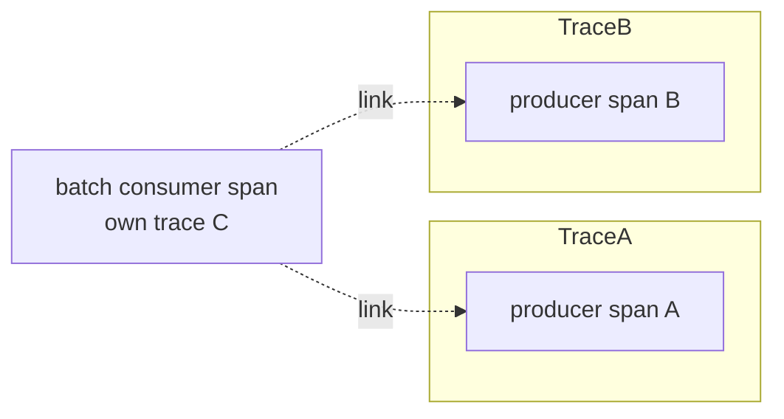
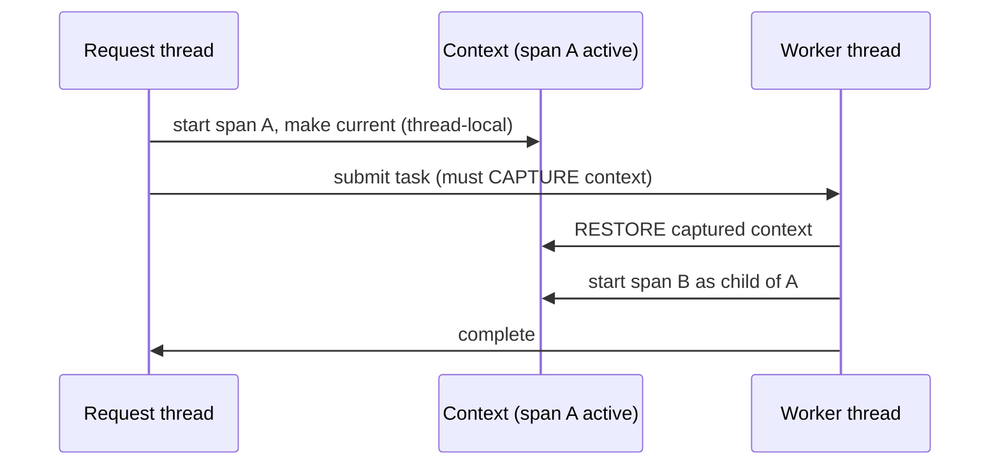
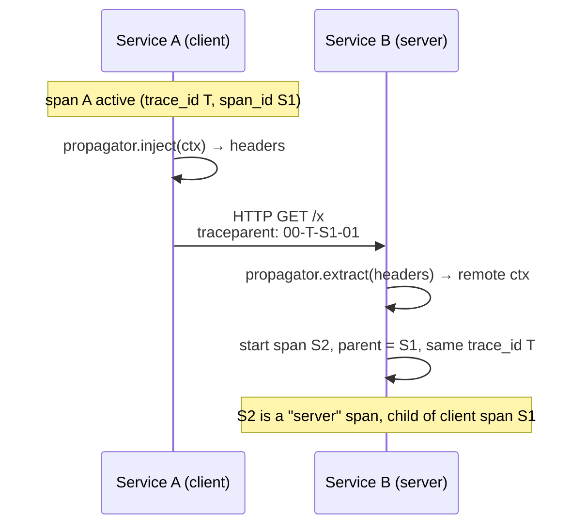
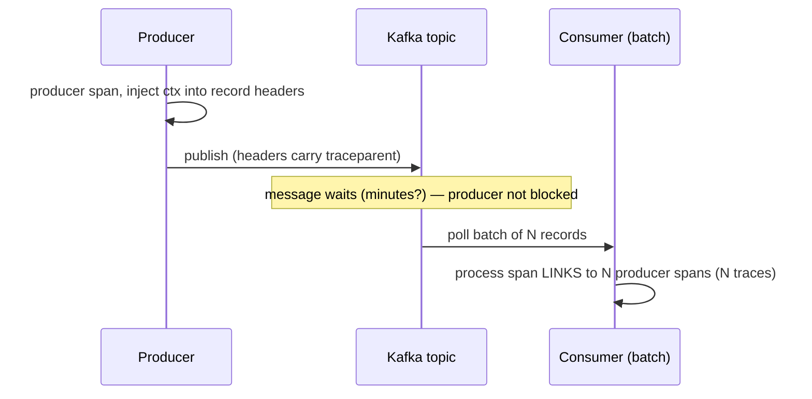

# Distributed Tracing Concepts & Context Propagation

Distributed tracing is the observability signal that follows **a single request
as it fans out across many services, queues, and datastores**, and reconstructs
the causal path as one connected object. Where a metric tells you *"p99 latency
is 800 ms"* and a log tells you *"this line executed"*, a trace tells you
*"**this** request spent 40 ms in the API gateway, 12 ms in auth, then blocked
600 ms waiting on the inventory service's database, which is where your latency
went."* It is the pillar that answers **"where did the time go?"** and **"who
called whom?"** in a system too big to hold in one head.

The whole discipline reduces to two mechanical problems:

1. **Modeling** the work — spans, a trace as a DAG, parent/child and links.
2. **Propagating context** — carrying the trace identity across thread
   boundaries in-process and across the network between processes, so that the
   spans emitted by ten different services can be stitched into one trace.

This document builds the model first (framework-neutral), then grounds it in the
standards that actually ship in production: **W3C Trace Context**, **B3**,
**OpenTelemetry**, and the wire realities of async/messaging propagation,
sampling decisions, and clock skew.

> [!KEY-TAKEAWAY]
> A trace is stitched together by **shared IDs traveling with the request**, not
> by a central coordinator. Every service reads the incoming context, creates a
> child span under the same `trace_id`, and injects updated context downstream.
> Break the propagation chain anywhere and the trace fractures into orphans.

Cross-references: the *design-level* "where does tracing fit in an architecture"
question lives in `system-design/observability-monitoring-reliability`; the
**OpenTelemetry API/SDK instrumentation** mechanics live in
`observability/opentelemetry-signals-and-instrumentation`; **Jaeger** storage and
trace-analysis UI live in `observability/jaeger-and-distributed-trace-analysis`;
**sampling economics and cardinality** are deepened in
`observability/sampling-cardinality-and-telemetry-cost-management`. Here we own
the *mechanics* of the trace model and context propagation.

---

## Why distributed tracing exists

In a monolith, a stack trace and a profiler tell you where a request spent its
time. In a microservice or serverless architecture a single user action might
touch 20–50 services; no single process sees the whole request. Metrics tell you
*that* something is slow (aggregate); logs tell you *what* happened in one
process; only a **trace** reconstructs the end-to-end causal path of **one**
request across all of them.

What tracing uniquely gives you:

- **Latency breakdown / critical path.** A trace waterfall shows exactly which
  service and which operation dominated the request's wall-clock time, and
  whether calls ran serially or in parallel. This is the "where did the time go"
  answer metrics can never give for an individual request.
- **Service dependency mapping.** Aggregating traces reveals the real
  runtime call graph — who actually calls whom, and how often — which is usually
  different from the architecture diagram on the wiki.
- **Error attribution across boundaries.** A 500 at the edge can be traced to
  the specific downstream span that first failed, with the exception attached.
- **Tail-latency debugging.** Traces let you pull the *specific slow requests*
  (the p99.9) and see what made them slow, rather than reasoning about averages.

> [!INTERVIEW]
> A crisp framing interviewers love: *"Metrics are aggregates and cheap; logs
> are per-event and verbose; traces are per-request and relational. Tracing is
> the only signal that preserves **causality and timing across process
> boundaries** for an individual request."*

Tracing does **not** replace metrics (you still need cheap always-on aggregates
for alerting) or logs (you still need detailed event records). It complements
them — and modern tooling correlates all three via the `trace_id` (exemplars in
metrics, `trace_id` in log lines).

---

## Trace, span, and span context

The three core nouns:

- **Span** — a single named, timed unit of work: an operation with a start
  timestamp, a duration, a status (OK/ERROR), and a bag of key/value
  **attributes** (`http.method`, `db.system`, `rpc.service`, …). A span may also
  carry timestamped **events** (logs scoped to the span) and **links**. Examples:
  an incoming HTTP request handler, an outbound RPC, a DB query, a Kafka publish.
- **Trace** — the collection of all spans that share one `trace_id`, connected
  by parent/child relationships. It represents one logical request/transaction
  end-to-end.
- **SpanContext** — the **immutable, serializable identity** of a span that
  actually travels across boundaries. In OpenTelemetry it is:
  `trace_id` (16 bytes / 128-bit), `span_id` (8 bytes / 64-bit), `trace_flags`
  (8-bit, includes the *sampled* bit), and `trace_state` (vendor key/values).
  SpanContext is what gets **injected** into headers and **extracted** on the
  other side; the rest of the span (attributes, events, timing) stays local to
  the process that created it and is exported separately to the backend.

Identifier sizes to memorize (W3C / OTel):

| Field | Size | Hex chars | Notes |
|---|---|---|---|
| `trace_id` | 16 bytes (128-bit) | 32 | Globally unique per trace; all-zeros is invalid |
| `span_id` | 8 bytes (64-bit) | 16 | Unique per span; all-zeros is invalid |
| `trace_flags` | 1 byte (8-bit) | 2 | Only bit 0 (`sampled`) is defined today |

> [!WARNING]
> **SpanContext ≠ Span.** Only the SpanContext (the IDs + flags + tracestate)
> propagates over the wire. The heavyweight span data (name, attributes, events,
> duration) is exported to the collector/backend independently. A common
> misconception is that "the whole span is sent downstream" — it is not; only
> its identity is, so the child can name the parent.

The **span name** should be low-cardinality (e.g. the route template
`GET /users/{id}`, not the concrete URL `/users/12345`) — high-cardinality
values belong in attributes, not the span name, because backends index and group
by name.

---

## The trace as a DAG and the waterfall view

A trace is a **tree** (or, once links are involved, a **directed acyclic graph**)
of spans. Each non-root span records the `span_id` of its **parent**; the root
span has no parent (its parent is the incoming request, or nothing if it
originated the trace). Because every span carries a start time and duration,
the tree is usually rendered as a **waterfall / Gantt** view: time flows left to
right, each span is a bar, and children nest under their parent.

```mermaid
gantt
    title Trace waterfall (one request, trace_id abc123)
    dateFormat X
    axisFormat %L
    section gateway
    GET /checkout (root)        :0, 320
    section auth
    POST /verify (child)        :10, 40
    section cart
    GET /cart (child)           :55, 90
    section inventory
    RPC reserve (child)         :150, 300
    DB SELECT stock (grandchild):170, 290
```



Reading the waterfall answers the questions that matter:

- **Critical path**: the chain of spans that determines total duration. If
  `inventory` (150→300 ms) dominates and everything else finished by 150 ms, the
  fix is in inventory, not the gateway.
- **Serial vs parallel**: bars that overlap in time ran concurrently; bars that
  start only after a sibling ends ran serially (a fan-out that should be
  parallel but is serial is a classic finding).
- **Gaps**: a gap between a parent starting and its first child indicates local
  work (or lock contention/GC) inside the parent before it called out.

The DAG (rather than pure tree) arises because a span can have **multiple
causal predecessors** via *span links* — e.g. a batch consumer span that
processes messages from many different producer traces (see next section).

---

## Parent-child relationships vs span links

Two ways spans relate:

- **Parent-child (`ChildOf`)** — the default, synchronous relationship. The
  parent is (typically) **waiting** on the child. Modeled by the child storing
  the parent's `span_id` and sharing the `trace_id`. This is the request→RPC→DB
  chain.
- **Span link** — a reference from a span to **one or more other spans that may
  be in a different trace**, used when there is a causal relationship but no
  strict "parent is blocked on child" semantics. Links carry a full SpanContext
  (including a different `trace_id`) plus optional attributes.

When you reach for a link instead of a parent:

| Scenario | Relationship | Why |
|---|---|---|
| HTTP handler calls downstream RPC synchronously | parent-child | parent blocks on child; same trace |
| Batch job processes 100 queued messages | **links** | one consumer span links to 100 producer spans, each from its own trace — no single parent |
| Fan-in / scatter-gather aggregating N upstreams | **links** | many causes, one effect; a single parent would be misleading |
| Retissuing/replay of a stored request | **link** | causally related to the original but a new trace |



> [!TIP]
> Rule of thumb: if the parent is **synchronously blocked** on the work, use
> parent-child. If the work is triggered by, but not awaited by, one-or-many
> upstreams (queues, batches, fan-in), use **links**. Links keep each producer's
> trace intact while still recording causality — you don't cram unrelated
> requests into one giant trace.

---

## In-process context propagation

Before a request ever leaves the process, the tracer must know *"what is the
current span?"* so that the next operation becomes its child. That "current
span" is held in a **Context** object propagated implicitly along the execution
path.

- **Synchronous / thread-per-request**: the active span is stored in a
  **thread-local** (Java `ThreadLocal`, via OTel's `Context`/`Scope`; Go passes
  `context.Context` explicitly as the first argument; .NET uses
  `AsyncLocal`/`Activity.Current`; Node uses `AsyncLocalStorage`). Each new span
  is created as a child of whatever is current, then set current for the
  duration of its scope.
- **Asynchronous / thread pools / reactive**: the danger zone. When work hops to
  another thread (executor submit, `CompletableFuture`, reactor/coroutine
  scheduler, callback), the thread-local **does not follow automatically**. The
  context must be explicitly **captured** on the submitting thread and
  **restored** on the executing thread — or the child span is created under the
  wrong parent (or none), fracturing the trace.



Practical mitigations: OTel and Micrometer provide
**context-propagating wrappers** — `Context.wrap(Runnable)`,
`ContextExecutorService`, Reactor's `contextPropagation` hook, Micrometer's
`ContextSnapshot`. Auto-instrumentation agents patch common executors so this
"just works" for standard pools, but hand-rolled threading or custom schedulers
routinely break it.

> [!WARNING]
> The single most common cause of "my trace is missing the downstream spans" in
> Java is losing the `Context` across a thread-pool or reactive boundary. If
> spans show up as **new roots** (no parent) or attach to the *wrong* request,
> suspect in-process context loss before blaming the network propagator.

---

## Cross-process propagation via headers

Between processes there is no shared memory, so the SpanContext is serialized
into the **carrier** — HTTP/gRPC headers, or message metadata — by the caller
(**inject**) and read by the callee (**extract**). OpenTelemetry models this as
a **`TextMapPropagator`** with two operations:

- **inject(context, carrier, setter)** — client-side: write `traceparent` (and
  `tracestate`, baggage, …) into outgoing headers.
- **extract(context, carrier, getter)** — server-side: read those headers back
  into a Context, so the incoming handler's span becomes a child of the caller's
  span.



Key semantics:

- The callee's incoming span is a **child of the caller's span** and inherits the
  **same `trace_id`** and the **sampled flag** — this is what stitches the trace.
- Each hop typically creates a **client span** (caller side, egress) and a
  matching **server span** (callee side, ingress) — SpanKind `CLIENT`/`SERVER`.
- Propagation format is negotiated by configuration; you can register multiple
  propagators (e.g. W3C + B3) so a service interoperates with mixed fleets.

If a service **does not propagate** (an un-instrumented proxy that strips
unknown headers, or a service using an incompatible format), the trace breaks at
that hop and downstream spans start a **new trace** — you see two disconnected
traces instead of one.

---

## W3C Trace Context: traceparent and tracestate

**W3C Trace Context** is the vendor-neutral standard (a W3C Recommendation) and
the **default propagator in OpenTelemetry**. It defines two HTTP headers.

**`traceparent`** — four dash-delimited, lowercase-hex fields:

```
traceparent: 00-4bf92f3577b34da6a3ce929d0e0e4736-00f067aa0ba902b7-01
             │  │                                │                │
             │  │                                │                └─ trace-flags (1 byte): 01 = sampled
             │  │                                └─ parent-id / span-id (8 bytes, 16 hex)
             │  └─ trace-id (16 bytes, 32 hex)
             └─ version (1 byte): 00
```

| Field | Length | Rules |
|---|---|---|
| version | 2 hex | `00` today; `ff` is invalid |
| trace-id | 32 hex (16 B) | all-zeros invalid → ignore the header |
| parent-id | 16 hex (8 B) | the caller's `span_id`; all-zeros invalid |
| trace-flags | 2 hex (8-bit) | bit 0 = **sampled** (`01` sampled, `00` not); other bits reserved/zero |

**`tracestate`** — a comma-separated list of `key=value` vendor entries carrying
per-vendor context alongside the (single, standard) `traceparent`:

```
tracestate: rojo=00f067aa0ba902b7,congo=t61rcWkgMzE
```

Rules that come up in interviews:

- **Max 32 list-members**; one entry per key; values are opaque printable ASCII
  (≤256 chars), no commas/equals inside a value.
- **Mutation prepends**: a vendor that updates its entry moves it to the
  **left-most** position and preserves the order of others. The left-most entry
  identifies the vendor that wrote the current `traceparent`.
- `tracestate` is how multiple tracing systems coexist: each vendor keeps its own
  opaque state without clobbering others, while everyone agrees on the single
  `traceparent` identity.

> [!KEY-TAKEAWAY]
> `traceparent` carries the **shared, standardized identity** (trace-id,
> parent span-id, sampled flag). `tracestate` carries **optional per-vendor
> key/values** and must survive untouched through systems that don't understand
> it. If a hop drops `tracestate` but keeps `traceparent`, the trace still
> stitches — you just lose vendor-specific routing/sampling hints.

---

## B3 (Zipkin) headers and format differences

**B3** is the older Zipkin/Brave propagation format, still widespread (Istio,
many JVM stacks). Two encodings:

**Multi-header:**

```
X-B3-TraceId:      463ac35c9f6413ad48485a3953bb6124   # 128-bit (32 hex) or 64-bit (16 hex)
X-B3-SpanId:       a2fb4a1d1a96d312                    # 64-bit (16 hex)
X-B3-ParentSpanId: 0020000000000001                    # present on children, absent on root
X-B3-Sampled:      1                                    # 1 = accept, 0 = deny, absent = defer
X-B3-Flags:        1                                    # 1 = debug (implies accept)
```

**Single header** `b3`:

```
b3: {TraceId}-{SpanId}-{SamplingState}-{ParentSpanId}
b3: 80f198ee56343ba864fe8b2a57d3eff7-e457b5a2e4d86bd1-1-05e3ac9a4f6e3b90
b3: 0                                   # deny-only, no identifiers
```
Sampling-state chars: `1` accept, `0` deny, `d` debug, absent = defer.

B3 vs W3C — the distinctions interviewers probe:

| Aspect | W3C `traceparent` | B3 |
|---|---|---|
| Trace-id size | always 128-bit | 64-bit **or** 128-bit |
| Span-id size | 64-bit | 64-bit |
| Sampling | flags bit 0 | `X-B3-Sampled` / state char (`0/1/d`) |
| Debug flag | none (not modeled) | `X-B3-Flags:1` / `d` — force-keep |
| Vendor state | `tracestate` | none |
| Encoding | single header, 4 fields | multi-header or single `b3` |

> [!TIP]
> When bridging a mixed fleet, register a **composite/multi propagator** that
> injects *and* extracts both W3C and B3. On extract, if both are present you
> pick one deterministically; on inject you can emit both so downstream services
> using either format stay connected. Istio historically emits B3, so
> OTel-instrumented apps behind Istio commonly need B3 enabled to keep traces
> whole.

---

## Baggage: propagating application context

**Baggage** is a separate propagation mechanism for arbitrary **application-level
key/value pairs** that travel with the request across all hops — e.g.
`user.tier=premium`, `tenant.id=42`, `feature.flag=x`. In W3C it uses the
dedicated **`baggage`** header (a separate spec from Trace Context); in B3 it was
Brave's "extra fields."

Crucial distinctions:

- **Baggage ≠ span attributes.** Baggage propagates *downstream to every
  service*; span attributes are local to one span. To index/query on a baggage
  value you must *explicitly copy it onto a span as an attribute* — baggage is
  not automatically added to spans (and by default is not even exported).
- **Baggage ≠ tracestate.** `tracestate` is reserved for **tracing-system**
  vendor state and is size-limited; baggage is for **your application** data.

> [!WARNING]
> Baggage travels over the wire on **every** request, so (1) it costs header
> bytes on each hop and (2) it can **leak** sensitive data (PII) or **elevate
> trust** if a downstream trusts a baggage value blindly. Keep it small, don't
> put secrets/PII in it, and never make an authorization decision on an
> unvalidated baggage value.

---

## Instrumentation points: where spans are created

Spans come from three layers, usually combined:

- **Automatic (agent/library) instrumentation.** A language agent (e.g. the OTel
  Java agent via bytecode instrumentation, or instrumentation libraries) hooks
  well-known frameworks — HTTP servers/clients, gRPC, JDBC, Kafka clients, Redis
  — and creates spans plus injects/extracts context **with zero code changes**.
  This gives you the "free" server/client spans at every boundary.
- **Manual instrumentation.** You call the tracer API to wrap
  business-meaningful operations the agent can't see (`processOrder`,
  `computePricing`), add attributes, record exceptions, and create links.
- **Library-native instrumentation.** Increasingly, frameworks ship built-in OTel
  support so no separate agent is needed.

The natural instrumentation points are the **boundaries** where context must
cross: inbound request handlers (extract + server span), outbound
clients/RPC/DB calls (client span + inject), and message produce/consume. Getting
those right is 80% of a useful trace; manual spans add the domain-specific
detail.

> [!INTERVIEW]
> "Auto-instrumentation gets you breadth (every boundary, no code); manual
> instrumentation gets you depth (the business operations that explain *why*).
> A good setup layers both — and crucially, both share the same `Context` so
> manual spans nest correctly under auto spans."

---

## Sampling and how the decision propagates

Because keeping every span at high traffic is expensive, tracing systems
**sample**. The decision must be **consistent across the whole trace** — you
want either all spans of a request or none, otherwise you get partial,
misleading traces.

Two families:

- **Head-based sampling** — decide **at the root**, at trace start, before you
  know the outcome (e.g. "keep 1%"). The decision is encoded in the **sampled
  flag** (`traceparent` bit 0 / `X-B3-Sampled`) and **propagated downstream**, so
  every service honors the same choice → consistent, complete traces. Cheap and
  simple; but it's blind — it can't preferentially keep the errors/slow requests
  because it decides before they happen.
- **Tail-based sampling** — buffer **all** spans of a trace (usually at a
  collector), wait until the trace completes, then decide based on the whole
  trace (keep if it errored, exceeded a latency threshold, hit a rare route). Far
  more useful (keeps the interesting traces) but expensive: needs memory to
  buffer, and all spans of a trace must reach the **same** collector instance
  (requires trace-id-aware load balancing).

| | Head-based | Tail-based |
|---|---|---|
| When decided | at trace start (root) | after trace completes |
| Sees outcome (errors/latency)? | no | **yes** |
| Cost | low (drop early) | high (buffer everything) |
| Completeness | consistent via propagated flag | complete by construction |
| Where | in the app/SDK | in the collector |

Consistency detail: naive per-service random sampling would keep a span here and
drop its child there. The standard fix is **propagating the sampled flag** (head)
or **deferring** the whole decision to the tail. OTel's
`ParentBased(root=TraceIdRatioBased(p))` sampler means "respect the parent's
decision if there is one; otherwise sample at ratio p at the root" — this is what
makes head sampling consistent. A related trick is **consistent probability
sampling** using a threshold on the `trace_id` bits so independent services reach
the same keep/drop verdict without communicating.

> [!KEY-TAKEAWAY]
> Sampling is **not** an on/off for whether a span is *created* — the span is
> still created and context still propagates (so downstream can make consistent
> decisions); the sampled flag governs whether spans are **recorded and
> exported**. Head sampling decides early and propagates the flag; tail sampling
> defers to the collector so it can keep the errors and slow tails.

See `observability/sampling-cardinality-and-telemetry-cost-management` for the
cost/economics deep-dive.

---

## Clock skew across spans

Span timestamps come from the **wall clock of the host that created them**, and
different hosts' clocks disagree (typically a few ms with NTP, occasionally
more). Because a trace stitches spans from many hosts, this **clock skew**
produces visual artifacts in the waterfall:

- A **child span that appears to start before its parent** sent the request, or
  a child that appears to **end after** the parent received the response —
  physically impossible, purely a clock-offset artifact.
- Negative or nonsensical "network time" computed as
  `server_span.start − client_span.start`.

Why you can't just trust timestamps: NTP keeps clocks *close*, not *identical*,
and VMs can experience clock drift/steps. Mitigations and realities:

- Backends (Jaeger, etc.) apply **clock-skew adjustment** heuristics: they use
  the **causal constraint** that a server span must be contained within its
  client span, and shift child timestamps to respect that when skew is detected.
- Prefer **monotonic clocks for duration** *within* a process (duration is
  accurate locally); skew only corrupts **cross-host relative positioning**.
- For truly precise cross-host ordering you need the request's causal edges
  (parent-child), not raw timestamps — the tree structure is authoritative even
  when the clocks lie.

> [!WARNING]
> Don't compute one-way network latency by subtracting a client span's timestamp
> from the server span's on a different host — clock skew makes that number (and
> its sign) unreliable. Trust the parent-child structure for ordering; treat
> cross-host absolute times as approximate. Deep distributed-clock theory
> (Lamport/vector clocks, TrueTime) lives in the system-design domain.

---

## Async and messaging context propagation

Queues and streams break the synchronous request/response assumption: the
producer does **not** block on the consumer, and there may be many consumers,
delays, retries, and batching. Context still propagates — but through **message
metadata**, not HTTP headers, and the relationship is usually a **link**, not
parent-child.

Mechanics:

- **Producer** injects the SpanContext into the message's **headers/attributes**
  (Kafka record headers, SQS/SNS message attributes, AMQP headers). This is the
  same `TextMapPropagator.inject`, just into the message carrier.
- **Consumer** extracts it. Because the produce and consume are decoupled in
  time, OTel messaging conventions model the consumer span as **linked** to the
  producer (or as a child, for simple request/reply). For **batch** consumers,
  one processing span **links to many** producer spans — the multi-parent DAG
  case.



Gotchas specific to messaging:

- **Don't force one giant trace.** If a consumer made every batched message a
  child of one span, you'd merge N unrelated user requests into one trace. Links
  preserve each producer's own trace while recording causality.
- **Header stripping / re-serialization.** Some brokers, bridges, or
  serialization steps drop custom headers → propagation breaks. Verify headers
  survive the transport.
- **Fan-out / retries / DLQ.** Redelivery and dead-letter hops each want their
  own span linked back to the original, so you can follow a message's full
  lifecycle.
- **Time semantics.** A trace can span minutes if the message sat in the queue —
  the waterfall's long "gap" is queue wait, which is itself the insight (queue
  latency, not processing latency).

---

## Correlation with logs and metrics

The `trace_id` (and `span_id`) is the join key that unifies the three pillars:

- **Logs**: emit `trace_id`/`span_id` on every log line (via MDC / structured
  logging) so that from a slow span you can jump to the exact log lines that
  request produced across all services — and vice versa.
- **Metrics → traces (exemplars)**: Prometheus/OpenMetrics **exemplars** attach a
  `trace_id` to specific histogram observations, so from a latency-histogram
  bucket in Grafana you can click straight into an example slow trace. This is
  the "metric told me p99 is bad → here's a concrete trace of a p99 request"
  workflow.
- **Traces → logs/metrics**: from a trace, pivot to the host/service dashboards
  for the same time window.

> [!TIP]
> The payoff of a correlated stack: alert fires on a metric → open a Grafana
> panel with an **exemplar** → jump to the offending **trace** → see the slow
> span → jump to that span's **logs**. Instrument once (OTel), correlate by
> `trace_id`, and the mean-time-to-diagnosis collapses.

---

## Common follow-up questions

- **"How does a trace get stitched together across services?"** Shared
  `trace_id` propagated in headers; each callee extracts the caller's
  SpanContext and creates a child span under the same trace, inheriting the
  sampled flag. No central coordinator — it's the traveling context.
- **"What's the difference between parent-child and a span link?"** Parent-child
  = synchronous, parent blocked on child, same trace. Link = causal but not
  awaited, can cross traces (batches, fan-in, async).
- **"Walk me through the `traceparent` header."** `version-trace_id-span_id-flags`,
  all lowercase hex: `00`, 32-hex trace-id (128-bit), 16-hex parent span-id
  (64-bit), 2-hex flags with bit 0 = sampled.
- **"Head vs tail sampling — which keeps the errors?"** Tail — it decides after
  the trace completes so it can keep errored/slow traces; head decides at the
  root and propagates a flag (cheap but blind to outcome).
- **"Why does my downstream service show up as a separate trace?"** Broken
  propagation: an un-instrumented hop, stripped headers, or format mismatch
  (e.g. B3 vs W3C) — or in-process context lost across a thread pool.
- **"Why does a child span appear to start before its parent?"** Clock skew
  between hosts; backends apply skew-adjustment using the causal (parent-child)
  constraint.
- **"How is context propagated through Kafka?"** Producer injects the
  SpanContext into record headers; consumer extracts and usually creates a
  **linked** span (batch = one span linked to many producer spans).
- **"Baggage vs span attributes vs tracestate?"** Baggage = your app's k/v
  propagated to all downstream services; attributes = local to one span (indexed
  for query); tracestate = tracing-vendor state, ≤32 entries, propagated with
  traceparent.
- **"How do you keep sampling consistent across services?"** Propagate the
  sampled flag (ParentBased sampler) so children honor the root's decision, or
  use tail sampling / consistent trace-id-based probability sampling.

## References

- W3C Trace Context Recommendation — `traceparent`/`tracestate` format, sampled
  flag, tracestate 32-member/mutation rules: <https://www.w3.org/TR/trace-context/>
- W3C Baggage spec — `baggage` header: <https://www.w3.org/TR/baggage/>
- OpenTelemetry Traces specification (span, SpanContext, links, SpanKind):
  <https://opentelemetry.io/docs/specs/otel/trace/api/>
- OpenTelemetry context propagation & propagators:
  <https://opentelemetry.io/docs/concepts/context-propagation/>
- OpenTelemetry sampling (ParentBased, TraceIdRatioBased, tail sampling):
  <https://opentelemetry.io/docs/concepts/sampling/>
- OpenTelemetry semantic conventions (HTTP, messaging, database):
  <https://opentelemetry.io/docs/specs/semconv/>
- OpenZipkin B3 propagation: <https://github.com/openzipkin/b3-propagation>
- Jaeger docs — architecture, clock-skew adjustment, sampling:
  <https://www.jaegertracing.io/docs/>
- Google Dapper paper (the original large-scale tracing system):
  <https://research.google/pubs/pub36356/>
- Prometheus exemplars (metrics↔traces correlation):
  <https://prometheus.io/docs/prometheus/latest/feature_flags/#exemplars-storage>
