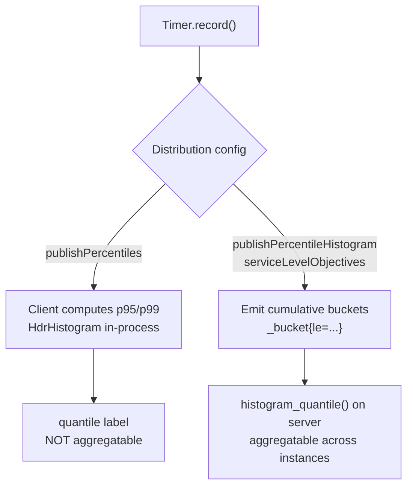

# Instrumentation with Micrometer & Metrics Libraries

Micrometer is the de-facto **metrics instrumentation facade** for JVM applications. Just as SLF4J
lets you write logging calls once and swap the backend (Logback, Log4j2) behind it, Micrometer lets
you instrument your code once against a vendor-neutral API and publish those metrics to whatever
monitoring system you choose — Prometheus, OTLP/OpenTelemetry, Datadog, CloudWatch, Graphite,
InfluxDB, and more. It is the metrics engine that ships inside Spring Boot Actuator.

This note covers Micrometer's facade model and registry backends, every meter type, how latency
distributions are captured (client-side percentiles vs server-side histogram buckets), the naming
convention and dimensional tags, base units, common tags, the cardinality trap, `MeterBinder`
auto-instrumentation, the `@Timed` annotation, and the Spring Boot Actuator integration. It is
concept-first but tool-grounded; where the mechanics matter (e.g. why you cannot average a
client-side p99 across instances) the reasoning is spelled out.

> [!KEY-TAKEAWAY]
> Instrument against the Micrometer API, keep names dimensional and low-cardinality, and prefer
> **server-side histograms** over client-side percentiles when you need to aggregate latency across
> many instances. The registry translates your dotted names into each backend's dialect.

---

## Micrometer as a metrics facade

Micrometer is often described as **"SLF4J for metrics."** Your application code depends only on
`micrometer-core` and calls a vendor-neutral API (`Counter`, `Timer`, `MeterRegistry`, …). The
concrete monitoring-system client (e.g. `micrometer-registry-prometheus`) is a separate runtime
dependency. Swapping backends is a dependency + configuration change, not a code change — you avoid
**vendor lock-in** at the instrumentation layer.

Why a facade matters for interviews:

- **Portability** — one instrumented codebase can publish to Prometheus in one environment and
  CloudWatch in another. Libraries (e.g. Spring, Resilience4j, HikariCP, gRPC) can ship Micrometer
  instrumentation and let the *application* decide the backend.
- **Uniform semantics** — Micrometer normalizes concepts (base units, naming, tags) so a `Timer`
  behaves consistently regardless of backend, even though each backend represents it differently.
- **Bridging** — Micrometer can bridge to OpenTelemetry (OTLP registry) and, from Micrometer 1.10+,
  its **Observation API** unifies metrics + tracing from a single instrumentation point.

> [!INTERVIEW]
> "How is Micrometer like SLF4J?" — Both are facades: a stable API in your code, a pluggable
> backend chosen at deploy time via a dependency. The difference is that SLF4J emits *events*
> (log lines) while Micrometer emits *aggregated time-series* (meters).

---

## MeterRegistry and registry backends

The `MeterRegistry` is the core Micrometer component: it **creates and holds meters** and is the
seam that publishes them to a backend. Each monitoring system has its own registry implementation.

| Backend | Registry artifact | Model |
|---|---|---|
| Prometheus | `micrometer-registry-prometheus` | **pull/scrape** — exposes `/actuator/prometheus` |
| OpenTelemetry (OTLP) | `micrometer-registry-otlp` | **push** to an OTLP endpoint/collector |
| Datadog, New Relic, Dynatrace | vendor registries | push (SaaS) |
| CloudWatch | `micrometer-registry-cloudwatch2` | push |
| Graphite, InfluxDB, StatsD | respective registries | push |

Key facts:

- A `SimpleMeterRegistry` holds the latest values in memory with no export — the default when no
  backend is configured, and handy in tests.
- A **`CompositeMeterRegistry`** fans a single meter out to several backends at once. Spring Boot's
  global registry is a composite, so the same `Counter` can publish to Prometheus *and* an OTLP
  endpoint simultaneously.
- `Metrics.globalRegistry` is a static composite for code that cannot easily inject a registry
  (libraries), though dependency-injecting the registry is preferred in application code.

The registry is where **`MeterFilter`s**, common tags, naming conventions, and distribution
statistics defaults are configured (`registry.config()…`).

---

## Meter types overview

A **meter** is the interface for collecting a set of measurements (which Micrometer calls
*metrics*). The base types you must know:

| Meter | Purpose | Direction |
|---|---|---|
| **Counter** | Count occurrences of an event | monotonically increasing |
| **Gauge** | Sample a value that goes up and down *right now* | instantaneous |
| **Timer** | Measure short-duration latency + frequency | records durations |
| **DistributionSummary** | Distribution of non-time values (e.g. payload sizes) | records amounts |
| **LongTaskTimer** | Duration of *in-flight* long-running tasks | active tasks |
| **FunctionCounter** / **FunctionTimer** | Track a monotonic count/time on an external object | derived |
| **TimeGauge** | A gauge whose value is a time in a base unit | instantaneous |

Micrometer supports both **naming convention** portability and **dimensionality** (tags) across all
of these. Choosing the right meter type is the most common junior mistake interviewers probe —
e.g. using a Gauge for something that should be a Counter, or a Counter for something you should
derive with `rate()`.

---

## Counter

A **Counter** reports a single **monotonically increasing** value — it only ever goes up (or resets
to zero on restart). Use it for *counts of events*: requests served, errors, messages processed,
retries. You never set a counter to an absolute value; you `increment()` it.

```java
Counter errors = Counter.builder("orders.failed")
    .description("orders that failed to place")
    .tag("reason", "payment")
    .register(registry);
errors.increment();          // +1
errors.increment(3);         // +3
```

> [!WARNING]
> Do not query a raw counter's absolute value on a dashboard — it is meaningless across restarts
> and instances. Query its **rate**: in PromQL `rate(orders_failed_total[5m])` gives per-second
> throughput and correctly handles counter resets. Prometheus appends the `_total` suffix to counter
> names automatically.

Advanced gotcha: a counter's value can be a floating-point number, and Prometheus expects
counters to reset to 0 (not to a negative number) — `rate()`/`increase()` detect resets by looking
for a decrease. Manually decrementing a "counter" breaks that assumption, which is why Micrometer's
`Counter` has no `decrement()`.

---

## Gauge

A **Gauge** samples the **current value of something that can go up and down**: queue depth, active
connections, cache size, memory used, temperature. Micrometer gauges are **observed, not set** — you
register a reference to an object plus a function that reads the current value, and the registry
calls that function when it publishes.

```java
// Track the size of a queue by handing Micrometer a reference + accessor
Gauge.builder("orders.queue.size", orderQueue, Queue::size)
    .description("orders awaiting processing")
    .register(registry);

// Convenience for collections/maps: registry holds a weak reference
registry.gaugeCollectionSize("orders.queue.size", Tags.empty(), orderQueue);
```

Critical gotchas interviewers love:

- **Weak reference** — the gauge holds a *weak* reference to the object so it does not cause a memory
  leak. If the object is garbage-collected, the gauge reports `NaN`. Keep a strong reference alive.
- **Sample, don't accumulate** — a gauge reflects the value *at publish time*. Events between
  samples are invisible; a gauge is unsuitable for counting things (use a Counter).
- **Monotonic values belong in a Counter/FunctionCounter, not a Gauge** — gauges are not
  rate-friendly and can miss peaks between scrapes.

---

## Timer

A **Timer** measures **short-duration latencies and the frequency of those events** at the same
time. Every Timer reports at minimum a **count** of events and a **total time** — so from one Timer
you get both throughput and cumulative latency, and `total/count` gives the mean.

```java
Timer timer = Timer.builder("http.server.requests")
    .description("HTTP request latency")
    .tags("method", "GET", "status", "200")
    .register(registry);

timer.record(() -> handleRequest());              // times the lambda
timer.record(Duration.ofMillis(23));              // record a known duration
Timer.Sample sample = Timer.start(registry);      // manual start/stop
// ...
sample.stop(timer);
```

- The Prometheus registry publishes a Timer as `_seconds_count`, `_seconds_sum` (base unit
  **seconds** — see base units) and, if configured, `_seconds_bucket` histogram series.
- `Timer.builder(...).publishPercentiles(0.95, 0.99)` adds **client-side** percentiles;
  `publishPercentileHistogram()` adds **server-side** histogram buckets (see the dedicated section
  for the crucial difference).
- Micrometer clamps a Timer's recorded distribution to an expected range
  (`minimumExpectedValue` / `maximumExpectedValue`, default 1ms–30s) to bound memory.

> [!TIP]
> A Timer captures *count + total + optional distribution* in one meter. Prefer it over hand-rolling
> a Counter for calls and a separate Gauge for latency.

---

## DistributionSummary

A **DistributionSummary** tracks the **distribution of events whose value is not a duration** —
request payload sizes, batch sizes, response byte counts. It is the non-time sibling of Timer: same
distribution machinery (count, total amount, max, optional percentiles/histogram), but you supply
an arbitrary numeric amount rather than a duration.

```java
DistributionSummary payload = DistributionSummary.builder("http.request.size")
    .baseUnit("bytes")
    .publishPercentileHistogram()
    .register(registry);
payload.record(2048);
```

The distinction on the exam: **Timer = seconds/duration; DistributionSummary = any other unit.**
Both share `publishPercentiles`, `publishPercentileHistogram`, `serviceLevelObjectives`, and the
min/max expected value clamps. A `DistributionSummary` has a **scaling** option (`scale`) that
Timers do not.

---

## LongTaskTimer

A regular Timer only records a task **after it finishes** — so a request that has been stuck for 10
minutes contributes nothing until it completes (or times out). A **LongTaskTimer** measures tasks
**while they are still running**: it reports the **number of active/in-flight tasks** and the
**duration of each active task so far**.

```java
LongTaskTimer scrape = LongTaskTimer.builder("batch.job.duration")
    .register(registry);
LongTaskTimer.Sample sample = scrape.start();
try {
    runNightlyBatch();
} finally {
    sample.stop();
}
```

Use it for **long-running operations** you want to observe in progress: nightly batch jobs, large
migrations, long-polling connections, a scheduled task that might hang. It answers "is a job stuck
right now and for how long?" — a question a normal Timer cannot answer until completion.

> [!INTERVIEW]
> "A batch job sometimes hangs for hours; a Timer shows nothing until it finishes. What do you use?"
> — A **LongTaskTimer**, because it reports duration of the *active* task, so an alert can fire
> while the job is still stuck.

---

## Client-side percentiles vs server-side histograms

This is the single most important — and most probed — distinction in the topic. There are two ways
to get percentiles/latency SLIs out of a Timer or DistributionSummary:

1. **`publishPercentiles(0.95, 0.99)` — client-side (pre-computed) percentiles.** The app computes
   the p95/p99 *inside the process* using an **HdrHistogram** (High Dynamic Range histogram: a
   compact in-process data structure that records values across a wide range with a configurable,
   bounded *relative* error, so the resulting percentiles are accurate to that error rather than
   truly exact) and publishes the resulting numbers (Prometheus: a series with a `quantile` label;
   conceptually like a Prometheus *Summary*).
2. **`publishPercentileHistogram()` / `serviceLevelObjectives(...)` — server-side histogram
   buckets.** The app publishes **cumulative bucket counts** (`_bucket{le="..."}`); the monitoring
   backend computes the quantile at query time (Prometheus `histogram_quantile`).

The decisive difference is **aggregatability**:

> [!WARNING]
> **Pre-computed (client-side) percentiles cannot be aggregated across instances.** The average of
> ten instances' p99 is *not* the fleet p99 — quantiles are not additive. Histogram **buckets are
> additive counts**, so you can `sum` them across instances first and then compute the quantile.
> If you need a fleet-wide latency SLI, use **server-side histograms**.

```promql
# CORRECT: aggregate additive buckets across all instances, then take the quantile
histogram_quantile(0.95, sum by (le) (rate(http_server_requests_seconds_bucket[5m])))

# WRONG: averaging pre-computed per-instance quantiles is statistically invalid
avg(http_server_requests_seconds{quantile="0.95"})
```



Trade-offs summary:

| | Client-side percentiles | Server-side histogram |
|---|---|---|
| Where computed | in the app process | in Prometheus/backend at query time |
| Aggregate across instances | **No** (invalid) | **Yes** (sum buckets by `le`) |
| Change percentile after the fact | No (fixed at publish) | Yes (any φ from same buckets) |
| Cost | fewer series | more series (one per bucket) |
| Accuracy | high precision, bounded by HdrHistogram relative error | bounded by bucket width |

---

## publishPercentileHistogram, SLO boundaries and native histograms

`publishPercentileHistogram()` tells Micrometer to emit a **pre-set histogram** suitable for
computing percentiles server-side. By default it produces a fixed set of buckets (Micrometer clamps
to ~1ms–30s for Timers, generating on the order of dozens of buckets) so that
`histogram_quantile` has reasonable resolution without you hand-picking boundaries.

`serviceLevelObjectives(...)` (a.k.a. **SLO boundaries**) adds **specific bucket boundaries you care
about** — the latency thresholds in your SLO. Each SLO boundary becomes an extra cumulative bucket,
letting you both drive `histogram_quantile` *and* directly compute "fraction of requests under my
SLO threshold."

```java
Timer.builder("http.server.requests")
    .publishPercentileHistogram()                        // broad buckets for quantiles
    .serviceLevelObjectives(                              // exact SLO thresholds you alert on
        Duration.ofMillis(100),
        Duration.ofMillis(300),
        Duration.ofSeconds(1))
    .minimumExpectedValue(Duration.ofMillis(1))
    .maximumExpectedValue(Duration.ofSeconds(10))
    .register(registry);
```

```promql
# What fraction of requests completed under the 300ms SLO in the last 5m?
sum(rate(http_server_requests_seconds_bucket{le="0.3"}[5m]))
  / sum(rate(http_server_requests_seconds_count[5m]))
```

> [!TIP]
> **Native (exponential) histograms** (Prometheus 2.40+, Micrometer supports emitting them) store
> the whole distribution in one compact series with dynamically-sized exponential buckets — no
> manual boundary picking, automatic aggregation, and lower storage than classic per-bucket series.
> Prefer them when both your Micrometer registry and Prometheus support them. Classic histogram
> error depends on bucket width; native histogram error is bounded by the chosen resolution.

`minimumExpectedValue`/`maximumExpectedValue` bound the histogram range so you do not pay for
buckets outside the plausible latency range — a memory/cardinality control, not a hard filter on
recorded values.

---

## Meter naming convention

Micrometer's convention is **lowercase words separated by dots**: `http.server.requests`,
`jvm.memory.used`, `orders.placed`. You write the name once in this neutral form and each backend's
**`NamingConvention`** translates it to that system's idiom, stripping disallowed characters.

| Backend | `http.server.requests` becomes |
|---|---|
| Prometheus | `http_server_requests_seconds` (snake_case + base-unit suffix) |
| Atlas | `httpServerRequests` (camelCase) |
| Graphite | `http.server.requests` (dots preserved) |
| InfluxDB | `http_server_requests` (snake_case) |

Naming rules that come up in interviews:

- **Name the *what*, tag the *which*.** A meter name should describe the measurement; specifics go
  in tags. Good: `database.calls{db="users"}`. Bad: a generic `calls{class="database"}` that is
  useless without drilling down.
- **Prometheus appends unit and type suffixes** — `_total` for counters, `_seconds`/`_seconds_sum`/
  `_seconds_count`/`_seconds_bucket` for timers. Don't bake these into your Micrometer name.
- Names must be consistent so the same logical metric aggregates across services. Following the
  dot convention gives maximum portability.

---

## Tags, dimensions and base units

**Tags** (elsewhere called **dimensions** or labels) are key/value pairs attached to a meter that
let you slice one metric many ways. `http.server.requests` with tags `method`, `uri`, `status`
becomes a queryable multi-dimensional series.

```java
registry.counter("http.server.requests", "method", "GET", "status", "200").increment();
```

Rules and gotchas:

- Tag **values must be non-null**; a null tag value throws.
- A meter is **uniquely identified by name + the full set of tag key/values**. Two counters with the
  same name but different tag *sets* are different time series (and every series with a given name
  should carry the *same tag keys* — inconsistent key sets break queries).
- **Base units** — Micrometer records in canonical base units so backends are consistent: **time in
  seconds**, data **in bytes**. That is why the Prometheus Timer name gets a `_seconds` suffix even
  though you may have recorded a `Duration`. Set a `DistributionSummary`'s unit with
  `.baseUnit("bytes")` so dashboards label it correctly.

> [!INTERVIEW]
> "Why does my `http.server.requests` timer show up as `http_server_requests_seconds` in
> Prometheus?" — Because Micrometer's base time unit is seconds and the Prometheus `NamingConvention`
> appends the base-unit suffix; the value is stored in seconds regardless of how you recorded it.

---

## Common tags

**Common tags** are tags automatically applied to **every meter** in a registry — infrastructure
context like environment, region, host, application, or stack. Configure them once on the registry
rather than repeating them on every meter.

```java
registry.config().commonTags("application", "orders", "region", "us-east-1", "env", "prod");
// In Spring Boot, a MeterRegistryCustomizer bean is the idiomatic place:
@Bean
MeterRegistryCustomizer<MeterRegistry> common(@Value("${region}") String region) {
    return r -> r.config().commonTags("region", region, "env", "prod");
}
```

Two gotchas:

- Common tags **must be added before any meters (including auto-configured `MeterBinder`s) are
  registered**, or early meters miss them. Using a `MeterRegistryCustomizer` bean ensures the timing
  is correct in Spring Boot.
- Common tags are still tags — keep their cardinality bounded. `region`/`env` are fine;
  a per-pod `instance` tag is usually added by Prometheus at scrape time from the target labels
  instead, to avoid duplication.

---

## Avoiding high-cardinality tags

**Cardinality** = the number of distinct time series a metric produces = the product of the
distinct values of each tag. Every unique combination of tag values is a separate series that must
be stored, indexed, scraped, and queried. High-cardinality tags are the number-one cause of
Prometheus/TSDB blowups and cost overruns.

Dangerous tag values (effectively unbounded):

- User IDs, email addresses, session IDs, request IDs, trace IDs
- Full raw URLs with path params (`/orders/12345`) — **use the route template** `/orders/{id}`
- Unbounded error strings, or a raw HTTP path for 404s (every missing resource = a new series)
- Timestamps, epoch millis, UUIDs

```java
// BAD: path parameter explodes cardinality — one series per order id
registry.counter("http.server.requests", "uri", "/orders/12345");
// GOOD: templated route — bounded set of endpoints
registry.counter("http.server.requests", "uri", "/orders/{id}");
```

Controls:

- **Normalize** high-variety values (collapse 404 URIs to `NOT_FOUND`; bucket status into `2xx/4xx/5xx`
  when detail isn't needed).
- Use a **`MeterFilter`** — `MeterFilter.maximumAllowableTags(...)`,
  `MeterFilter.denyNameStartsWith(...)`, or `deny()` — to cap or drop offending tags/meters at the
  registry.
- Micrometer has a **high-cardinality tags detector** that warns when a meter's series count grows
  unexpectedly.
- Remember cardinality **multiplies**: `method`(5) × `uri`(200) × `status`(6) × 50 instances =
  300,000 series from one metric name.

> [!WARNING]
> Cardinality is the cardinal sin of metrics. Ask "is this tag value bounded and known in advance?"
> Trace/request IDs belong in **traces and logs**, never in metric tags.

---

## MeterBinder and auto-instrumentation

A **`MeterBinder`** is a reusable component that binds a set of related metrics to a registry — the
mechanism behind Micrometer's out-of-the-box **JVM and system metrics**. You (or Spring Boot) call
`binder.bindTo(registry)` once and it registers all its meters.

```java
new JvmMemoryMetrics().bindTo(registry);      // jvm.memory.used/committed/max
new JvmGcMetrics().bindTo(registry);          // jvm.gc.pause, allocation
new JvmThreadMetrics().bindTo(registry);      // jvm.threads.live/daemon/peak
new ClassLoaderMetrics().bindTo(registry);
new ProcessorMetrics().bindTo(registry);      // system.cpu.usage, process.cpu.usage
new FileDescriptorMetrics().bindTo(registry);
new UptimeMetrics().bindTo(registry);
```

Library authors ship `MeterBinder`s so their internals become observable with zero app code:
HikariCP connection-pool metrics, Caffeine/EhCache cache stats, Kafka client metrics, Log4j2/Logback
event counts, Tomcat/Jetty metrics. In Spring Boot these binders are **auto-configured** — adding
Actuator + a registry yields JVM, GC, CPU, thread, HTTP-server, datasource, and cache metrics for
free.

> [!TIP]
> Before writing custom instrumentation, check whether a `MeterBinder` already exists — most common
> infrastructure (JVM, pools, caches, HTTP clients/servers) is covered.

---

## The @Timed annotation

`@Timed` is a declarative way to time a method without writing `Timer` code. It lives in
`micrometer-core` and is applied by an AspectJ-style aspect.

```java
@Timed(value = "orders.place", description = "time to place an order",
       percentiles = {0.95, 0.99}, histogram = true, extraTags = {"tier", "gold"})
public Order placeOrder(Cart cart) { ... }
```

The **critical requirement**: `@Timed` does nothing on its own — you must register a **`TimedAspect`
bean** (and have AspectJ/proxying available) so the annotation is actually intercepted.

```java
@Bean
public TimedAspect timedAspect(MeterRegistry registry) {
    return new TimedAspect(registry);
}
```

Notes and gotchas:

- The method must be invoked through the proxy (same self-invocation caveat as any Spring AOP —
  calling `this.placeOrder()` internally bypasses the aspect).
- `@Timed` does **not** support meta-annotations (you can't compose it into your own annotation).
- Spring Boot's **web layer already provides `http.server.requests`** timers automatically via its
  own instrumentation — you don't annotate controllers with `@Timed` for basic request timing.
- There is a `@Counted` counterpart (with a `CountedAspect`) for counting method invocations.

---

## Spring Boot Actuator integration

Spring Boot **Actuator** is the most common way Micrometer is consumed. Actuator auto-configures the
`MeterRegistry`, wires in the JVM/system/HTTP/datasource `MeterBinder`s, applies common tags from
properties, and exposes the metrics endpoints.

- Add `spring-boot-starter-actuator` + a registry (`micrometer-registry-prometheus`), then
  `management.endpoints.web.exposure.include=prometheus,metrics` exposes **`/actuator/prometheus`**
  (Prometheus scrape format) and **`/actuator/metrics`** (browse in JSON).
- Configure distribution statistics via properties instead of code, e.g.:

```properties
management.metrics.distribution.percentiles-histogram.http.server.requests=true
management.metrics.distribution.slo.http.server.requests=100ms,300ms,1s
management.metrics.tags.region=us-east-1
```

- Out of the box you get `http.server.requests` (with `uri` **templated** to the route, `method`,
  `status`, `outcome`), `jvm.*`, `system.*`, `process.*`, `hikaricp.*`, `tomcat.*`, `logback.*`,
  and cache metrics.

This topic owns Micrometer's mechanics; the deeper Actuator endpoint surface and Prometheus
scraping/`PromQL` are covered in the Prometheus and PromQL topics — cross-reference those for the
query and storage side.

---

## Common follow-up questions

- **"Counter vs Gauge — when do you use each?"** Counter for cumulative event counts you'll turn
  into a rate; Gauge for an instantaneous value that rises and falls (queue depth, connections).
- **"Why can't I average p99 across my pods?"** Percentiles aren't additive. Averaging pre-computed
  quantiles is statistically invalid — use server-side histogram buckets and `histogram_quantile`
  over summed buckets.
- **"My Prometheus fell over — what's the likely metrics cause?"** High cardinality: a tag with an
  unbounded value (user id, raw URL, request id) multiplying series count. Template URLs, normalize
  values, apply a `MeterFilter`.
- **"Timer vs LongTaskTimer?"** Timer records after completion; LongTaskTimer reports duration of
  tasks *still running* — needed to alert on a stuck long job.
- **"Why is my metric named with `_seconds`/`_total` in Prometheus but not in my code?"** The
  Prometheus `NamingConvention` adds base-unit and type suffixes; base time unit is seconds.
- **"@Timed isn't recording anything."** You forgot the `TimedAspect` bean, or the call is a
  self-invocation that bypasses the proxy.
- **"How does Micrometer relate to OpenTelemetry?"** Micrometer can publish via an OTLP registry,
  and its Observation API unifies metrics + tracing; OTel is the broader vendor-neutral telemetry
  standard covered in its own topic.
- **"What's a MeterBinder?"** A reusable bundle of related meters (JVM, GC, pools, caches) bound to
  a registry — Micrometer's auto-instrumentation mechanism.

## References

- Micrometer docs — Concepts: <https://docs.micrometer.io/micrometer/reference/concepts.html>
- Micrometer docs — Naming Meters: <https://docs.micrometer.io/micrometer/reference/concepts/naming.html>
- Micrometer docs — Timers & `@Timed`: <https://docs.micrometer.io/micrometer/reference/concepts/timers.html>
- Micrometer docs — Counters, Gauges, Distribution Summaries, Long Task Timers (Concepts nav)
- Micrometer docs — JVM & system metrics (`MeterBinder`s): <https://docs.micrometer.io/micrometer/reference/reference/jvm.html>
- Prometheus docs — Histograms and summaries: <https://prometheus.io/docs/practices/histograms/>
- Prometheus docs — Metric and label naming: <https://prometheus.io/docs/practices/naming/>
- Spring Boot docs — Metrics (Actuator + Micrometer): <https://docs.spring.io/spring-boot/reference/actuator/metrics.html>
- Google SRE — SLIs/SLOs and the four golden signals (latency, traffic, errors, saturation)
