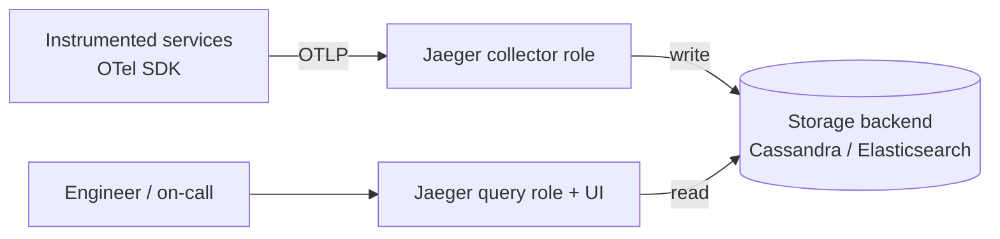
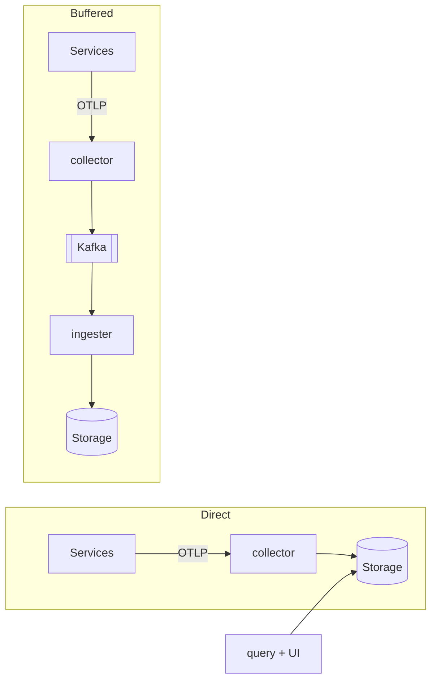
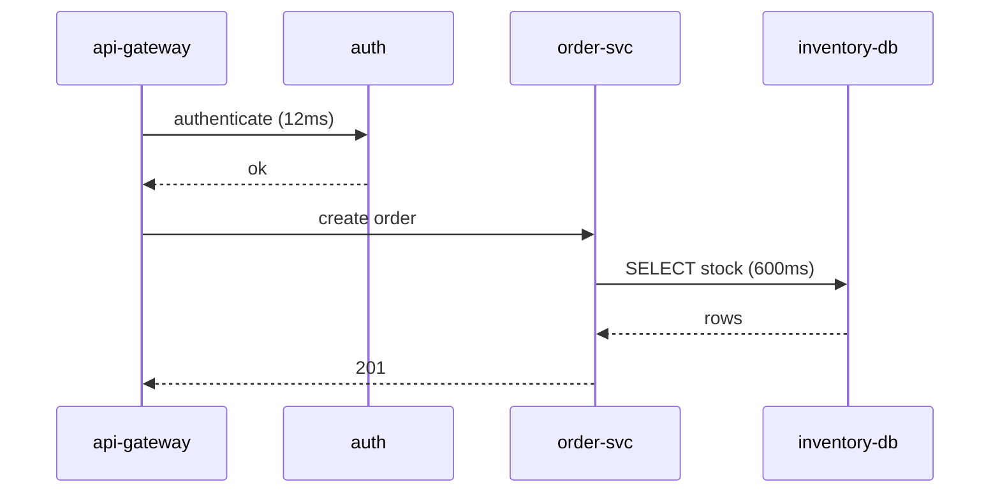
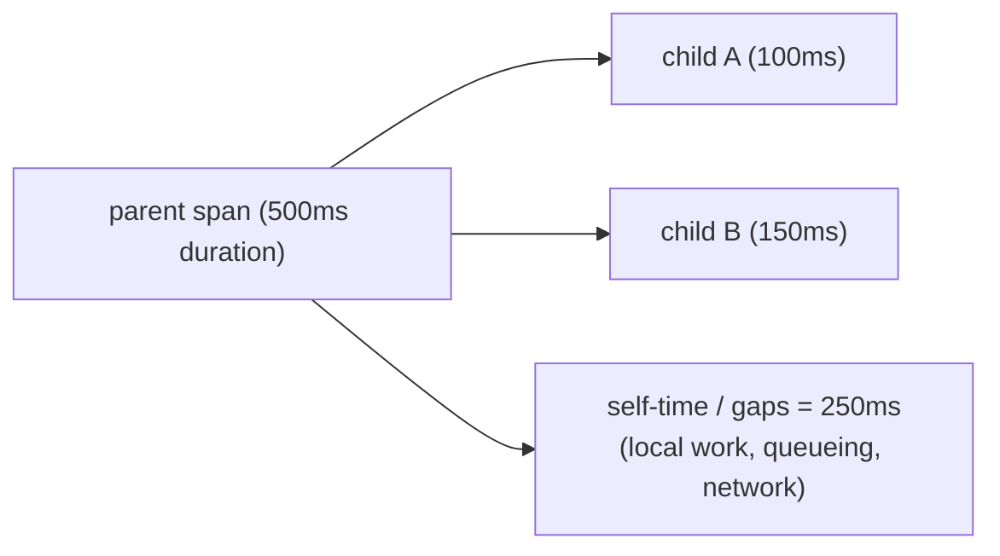
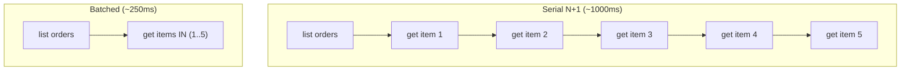
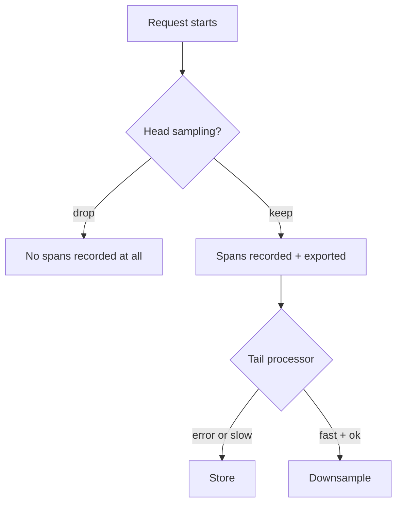
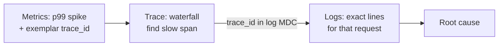

# Jaeger & Distributed Trace Analysis

Jaeger is an open-source, end-to-end **distributed tracing backend** originally
built at Uber and now a graduated CNCF project. Where the *mechanics* of the
trace model and context propagation are owned by
`observability/distributed-tracing-concepts-and-context-propagation`, and the
*emitting* of spans is owned by
`observability/opentelemetry-signals-and-instrumentation`, **this topic owns the
back half of the pipeline: how a tracing backend ingests, stores, queries, and
above all lets a human *read* traces to find where the latency and errors live.**

In an interview this topic tends to split into two skills:

1. **Operating the backend** — Jaeger's component roles, ingestion wire formats,
   storage-backend trade-offs, sampling configuration.
2. **Analysis** — the skill that actually matters on-call: opening a slow trace,
   finding the **critical path**, distinguishing **self-time from wait/queueing**,
   spotting **N+1 and serial-vs-parallel** patterns, using the **service
   dependency graph**, comparing traces, and pivoting from a trace to the
   correlated logs and metrics.

> [!KEY-TAKEAWAY]
> A trace backend does not *find* your bug — it gives you the evidence. The
> reusable analysis move is: sort by duration → open a slow exemplar → walk the
> **critical path** → for each dominant span ask *"is this time real work
> (self-time) or waiting (a gap / a child span)?"* → attribute the latency to the
> one span that owns it → pivot to that service's logs/metrics via the trace ID.

Cross-references: sampling *economics* and cardinality are deepened in
`observability/sampling-cardinality-and-telemetry-cost-management`; the
OpenTelemetry Collector as a general pipeline lives in
`observability/opentelemetry-collector-and-pipelines` (Jaeger v2 is literally a
distribution of it); always-on production profiling (eBPF/APM) is
`observability/apm-ebpf-and-continuous-profiling`.

---

## Why Jaeger and where it fits

Instrumented services emit **spans**; something has to receive, store, index,
and serve them for query. That "something" is a tracing backend, and Jaeger is
one of the canonical open-source choices (alongside Zipkin, Grafana Tempo, and
commercial APMs like Datadog/Honeycomb/Lightstep).

Jaeger's job in the telemetry pipeline:

- **Ingest** spans over the wire (today: OTLP; historically Jaeger's own Thrift
  and gRPC formats, plus Zipkin).
- **Store** them in a scalable backend (Cassandra, Elasticsearch/OpenSearch, …).
- **Index** by trace ID, service, operation, tags, duration, and time so you can
  search.
- **Serve** a query API and a **UI** that renders the trace **waterfall**, a
  **service dependency graph**, and (with SPM) RED-style metrics derived from
  spans.

> [!TIP]
> The modern recommendation is: instrument with the **OpenTelemetry SDK**, export
> **OTLP**, and let Jaeger be the storage-and-UI backend. Jaeger-specific client
> libraries are retired in favor of OpenTelemetry.

---

## Jaeger architecture and component roles

Jaeger is a **collection of roles**, not one monolithic server. Understanding
the roles is a common interview probe because it maps directly to how you scale
and where you can lose data.

| Role | Responsibility |
|---|---|
| **collector** | Receives spans from clients, validates/transforms them, and writes to storage (or to Kafka). Stateless and horizontally scalable. |
| **query** | Serves the query API and back-end for the UI; reads from storage. |
| **UI** | React front-end (served by the query role) that renders waterfalls, the dependency graph, and SPM. |
| **ingester** | In a Kafka-buffered deployment, reads spans off Kafka and writes them to storage (decouples ingest spikes from storage write throughput). |
| **agent** *(legacy)* | Host-local daemon/sidecar that batched spans from clients to the collector. Superseded by running the **OpenTelemetry Collector** as the agent. |
| **all-in-one** | Single binary combining collector + query + in-memory storage. Great for dev/CI, **not** for production (restart loses data). |

**Jaeger v2** is a significant architectural change: it is now a **customized
distribution of the OpenTelemetry Collector**. The single binary is configured
into different roles, and internally it is composed of OTel Collector receivers,
processors, and exporters plus Jaeger-specific extensions (Jaeger Storage
Extension/Exporter, Jaeger Query Extension, Remote Sampling Extension, Adaptive
Sampling Processor).

> [!WARNING]
> The Kafka-buffered path (collector → Kafka → ingester) exists to absorb ingest
> bursts and protect the storage backend, but Kafka is durable buffer, not
> storage — if the ingester falls permanently behind or storage is down, you
> still drop trace data eventually. All-in-one's in-memory store loses **all**
> data on restart.

---

## Trace ingestion and wire formats

Jaeger's collector accepts several receivers; knowing which is current matters.

- **OTLP** (OpenTelemetry Protocol, gRPC on 4317 / HTTP on 4318) — the
  recommended path today. This is what an OTel SDK exports natively.
- **Jaeger native** — historically Thrift over UDP (to the agent) and Thrift/gRPC
  over HTTP to the collector. Still accepted, but the client libraries are
  retired.
- **Zipkin** — Jaeger can accept Zipkin-format spans (JSON/Thrift/Protobuf) for
  migration.

The realistic modern flow: **OTel SDK → OTLP → (optionally an OpenTelemetry
Collector) → Jaeger collector → storage.** Because Jaeger v2 *is* an OTel
Collector distribution, you can also do processing (batching, tail sampling,
attribute scrubbing) right in the same binary.

> [!TIP]
> If an interviewer asks "how do apps send data to Jaeger today," the crisp
> answer is **OTLP** — not the old Jaeger Thrift/UDP agent path. Mentioning the
> agent is fine as history, but flag that it's superseded by the OTel Collector.

---

## Storage backends and their trade-offs

Jaeger is storage-pluggable. The backend choice is the biggest operational
decision and a frequent interview question because it dictates scale, cost, and
query capability.

| Backend | Use case | Notes |
|---|---|---|
| **Memory** | dev / all-in-one | Lost on restart; bounded by RAM. |
| **Badger** | small single-node / embedded | Local disk KV store; not for large clusters. |
| **Cassandra** | high write throughput at scale | Great ingest, but limited ad-hoc query flexibility on tags. |
| **Elasticsearch / OpenSearch** | rich tag search + aggregation | Powerful querying/filtering by tags; heavier to operate, indexing cost. |
| **ClickHouse / Kafka (buffer)** | newer / pipeline | ClickHouse as columnar store; Kafka as durable buffer, not final store. |

The classic trade-off: **Cassandra** favors write throughput and predictable
scaling; **Elasticsearch/OpenSearch** favors flexible search and aggregation
over span tags (which powers richer UI filtering) at higher operational cost.

> [!INTERVIEW]
> "You need to find all traces where `http.status_code=500` **and**
> `customer.tier=gold` over the last 24h." That's an ad-hoc tag-search /
> aggregation workload — **Elasticsearch/OpenSearch** is the stronger fit than
> Cassandra. But remember: you can only search on tags you actually **indexed**,
> and only on traces that were **sampled and stored**.

---

## Reading a trace waterfall

The **waterfall** (Gantt-style timeline) is the core Jaeger view. The x-axis is
wall-clock time from the trace's start; each span is a horizontal bar positioned
at its start offset with width equal to its duration; children are nested and
indented under their parent.

How to read it fast:

1. **Total duration** = width of the root span. That's the number the user felt.
2. **Nesting** shows causality: a child span sits inside its parent's time range.
3. **Sequential bars** (one starts after the previous ends) = serial calls.
   **Overlapping bars** = concurrent/parallel work.
4. **Color/markers** flag errored spans (e.g., `error=true`), so you can jump
   straight to failures.

The **critical path** is the chain of spans that, if shortened, would shorten the
whole trace — the sequence of operations the root was actually *blocked waiting
on*. Time spent in a child that the parent did **not** wait for (fire-and-forget,
or a parallel branch that finished early) is **not** on the critical path. On-call
optimization effort should target the critical path, not the largest span in
isolation.

> [!KEY-TAKEAWAY]
> The biggest bar isn't always the bottleneck. A 600 ms span that ran in parallel
> with the request's real work, or a slow async job the caller never awaited,
> contributes **zero** to end-user latency. Always ask *"was the parent blocked on
> this?"* before optimizing it.

---

## Span duration vs self-time, and reading gaps

A span's **duration** is its total wall-clock time. Its **self-time** (a.k.a.
exclusive time) is duration **minus** the wall-clock time **covered** by its
child spans — i.e., the time the operation spent doing its *own* work rather than
waiting on downstream calls. "Covered" means the **union** of the children's time
intervals, **not** the arithmetic sum of their durations: overlapping/parallel
children only cover the wall-clock they collectively span. This distinction is
where real root-causing happens.

- **Duration ≈ sum of children** → this span is mostly an *orchestrator*; the
  latency lives **downstream**, not here. Go into the children.
- **High self-time** (duration ≫ children) → the time is spent **in this
  service's own code** (CPU, serialization, a local computation, or an
  un-instrumented call). This span *owns* the latency.

**Gaps** are equally diagnostic. A gap between the end of one child span and the
start of the next (within the same parent) is time unaccounted for by any span:

- **Before a downstream call starts** — often local processing, thread-pool
  queueing, GC pause, or connection-pool wait.
- **Between the client-send and server-receive of the same RPC** — network
  latency, TLS handshake, or the callee's inbound queue.

Above, children A and B run **serially** (they don't overlap), so they cover
100 + 150 = 250 ms of wall-clock and self-time = 500 − 250 = 250 ms. The naive
"subtract the sum of child durations" shortcut only works in this serial case.
If instead two 150 ms children ran **in parallel and fully overlapped**, they
cover just 150 ms of wall-clock (not 300 ms), so self-time is *larger* than a
sum-based estimate — subtracting the sum would over-count and can even go
negative. Always subtract the wall-clock **union** of child intervals.

> [!WARNING]
> A large gap with no child span is the classic sign of **missing
> instrumentation** — an un-instrumented DB driver, an internal queue, or a
> serialization step. You know time was spent but not *where*. The fix is often
> to add a span, not to guess.

---

## Serial vs parallel spans and N+1 detection

Trace shape reveals inefficiency patterns that aggregate metrics hide entirely.

- **Serial (sequential) calls**: bars laid end to end. If a service makes five
  200 ms downstream calls **serially**, the user waits ~1 s. If they were
  independent, they could run in **parallel** and cost ~200 ms. Seeing a
  staircase of sequential bars that *could* be concurrent is a top optimization
  finding.
- **N+1 pattern**: one query returns N rows, followed by N nearly identical child
  spans (e.g., N `SELECT ... WHERE id=?` calls). In the waterfall this looks like
  a dense picket fence of many short, similar spans. The fix is batching (an
  `IN (...)` query, a batch RPC, or a dataloader). This is the tracing analog of
  the ORM N+1 problem, and traces are the best tool to *see* it.

> [!INTERVIEW]
> "A page is slow only under load, and the trace shows 30 tiny sequential DB
> spans." That's an **N+1** almost certainly — collapse it into a single batched
> query. The tell is *many near-identical short spans in series under one
> parent*.

---

## Identifying latency bottlenecks and root cause via traces

Root-causing latency with a trace is a repeatable procedure:

1. **Find a representative slow trace.** Search by service/operation and sort by
   duration (or use a p99 exemplar from a dashboard). One slow exemplar is worth
   more than an average.
2. **Walk the critical path** from the root. At each span decide: on the path or
   off it?
3. **For each critical-path span, split duration into self-time vs children.**
   The span with high **self-time** that sits **on the critical path** is your
   prime suspect — it *owns* the latency.
4. **Inspect that span's tags/events** — DB statement, `http.url`, retry count,
   error, `peer.service`. This tells you *what* it was doing.
5. **Pivot to that service's logs/metrics** via the trace ID to confirm the
   cause (GC pause, lock contention, slow query plan).

Common root-cause signatures in a waterfall:

| Signature | Likely cause |
|---|---|
| One deep child span dominates | A specific downstream service/DB is slow. |
| Big self-time, no children | CPU-bound work or un-instrumented call in *this* service. |
| Gap before a call starts | Thread-pool / connection-pool queueing, GC, local latency. |
| Staircase of sequential calls | Serializable work not parallelized. |
| Picket fence of similar spans | N+1. |
| Retried child spans (2–3 attempts) | Downstream flakiness + retry policy inflating latency. |

> [!KEY-TAKEAWAY]
> "Which span owns the latency" = **on the critical path** *and* **high
> self-time**. That pair, not raw duration, points to the code to fix.

---

## Span tags/attributes, logs, events, and process/resource

Spans carry structured context that turns a timing bar into a diagnosis. In
OpenTelemetry terms (Jaeger maps onto these):

- **Attributes / tags** — key/value pairs describing the operation:
  `http.method`, `http.status_code`, `db.system`, `db.statement`, `peer.service`,
  `error=true`. These are what you **filter and search** on, and what SPM
  aggregates.
- **Events / span logs** — timestamped points *within* a span (e.g., an exception
  with a stack trace, a cache-miss marker, a "retry #2" note). They annotate
  *when* something happened inside the span's lifetime.
- **Process / resource** — attributes about the *emitter*: `service.name`, host,
  version, container/pod. `service.name` is what groups spans into services on
  the dependency graph and SPM; getting it right is essential.
- **Span status/kind** — `SpanKind` (SERVER, CLIENT, PRODUCER, CONSUMER,
  INTERNAL) tells the UI whether a span is an inbound or outbound edge, which is
  how it builds the dependency graph and computes client-vs-server latency.

> [!WARNING]
> High-cardinality attributes (user IDs, full URLs with IDs, raw SQL with
> literals) bloat storage/index cost and can blow up Elasticsearch. Prefer
> normalized values (`/orders/{id}`, parameterized `db.statement`). This is the
> tracing face of the cardinality problem covered in the sampling/cost topic.

---

## Service dependency graph

By aggregating the CLIENT→SERVER edges across many traces, Jaeger builds a
**service dependency graph**: nodes are services (`service.name`), edges are
call relationships weighted by call count. This is often *more accurate than the
architecture wiki* because it reflects what actually happens at runtime.

Uses:

- Discover **unexpected dependencies** (a service calling something it
  shouldn't).
- Understand **blast radius** — if service X degrades, who is upstream of it?
- Spot **hotspots** — the most-called nodes/edges.

Implementation note: in classic Jaeger the dependency graph came from a
Spark/Flink aggregation job over stored spans (or is computed for all-in-one
in-memory). It reflects only **sampled** traffic, so absolute counts are scaled,
not exact.

> [!TIP]
> The dependency graph answers *"who calls whom"* (topology). It does **not**
> answer *"where did this one request's time go"* — that's the waterfall. Don't
> confuse the two views in an interview.

---

## Service Performance Monitoring (SPM) and trace comparison

**SPM** in Jaeger derives **RED-style metrics** (Rate, Errors, Duration) from
spans using the **Span Metrics connector** and stores them in a Prometheus-
compatible backend, so the UI shows request rate, error rate, and latency (p50/
p95/p99) per service and operation — **without** a separate metrics pipeline.
This is the bridge between tracing and metrics: aggregate span data into
time series.

**Trace comparison** lets you diff two traces (e.g., a fast baseline vs a slow
outlier, or before vs after a deploy). The UI highlights structural differences —
extra spans, missing spans, changed durations — which is powerful for answering
*"what changed?"* when a p99 regresses.

> [!INTERVIEW]
> SPM shows you the *RED metrics* say latency for `order-svc` jumped at 14:00;
> you then open **traces** in that window to see *why*; trace **comparison**
> against a pre-14:00 baseline shows a new downstream span appeared. That
> metrics→traces→diff flow is a strong senior answer.

---

## How sampling shapes what you can find

Sampling is the single biggest constraint on trace analysis, and interviewers
love to probe it because it changes *what questions you can even answer*.

- **Head-based sampling** decides at trace **start** (before you know the
  outcome), typically **probabilistic** (e.g., 1%) or **rate-limiting** (N/sec).
  Cheap and simple, but you will **miss most rare errors and slow outliers** —
  the exact traces you want during an incident. The decision propagates so a
  whole trace is kept or dropped consistently.
- **Tail-based sampling** decides **after** the trace completes, so you can keep
  *all* error traces and slow traces and downsample the boring fast/OK ones.
  Requires buffering complete traces (memory + latency) and is implemented via
  the OpenTelemetry Collector's **`tailsamplingprocessor`**. This is what lets
  you reliably find the p99 and the failures.
- **Remote / adaptive sampling** — Jaeger can serve sampling strategies to SDKs
  remotely; **adaptive sampling** watches per-service/per-operation traffic and
  recalculates probabilities to hit a `target_samples_per_second`, so
  low-traffic endpoints aren't starved of samples while high-traffic ones aren't
  overwhelming storage. Default without config is probabilistic **0.001 (0.1%)**.

> [!WARNING]
> With head-based sampling, "I can't find the trace for the failed request" is
> usually not a Jaeger bug — the trace was **never sampled**. If your goal is
> reliably capturing errors/outliers, you need **tail-based** sampling. Also: a
> trace can fracture if different services use inconsistent sampling decisions —
> propagate the decision (the `sampled` flag in W3C `traceparent`).

---

## Correlating traces with logs and metrics

The trace's real superpower is being the **join key** across all three pillars.
Every span carries a **trace ID** (and span ID); if your logs and metrics also
record it, you can pivot losslessly between signals.

- **Trace ↔ logs**: inject `trace_id`/`span_id` into structured logs (via the
  OTel logging bridge / MDC). From a suspect span, jump to *exactly* the log
  lines that request produced in that service — no guessing by timestamp.
- **Trace ↔ metrics**: **exemplars** attach a sample trace ID to a metric bucket
  (e.g., a Prometheus histogram bucket for the p99 latency). In Grafana you click
  the spike on the latency panel and jump straight to a representative slow
  trace.
- **Trace ↔ trace**: span links connect related traces (e.g., a batch job to the
  requests it processed).

> [!KEY-TAKEAWAY]
> The correlation chain metrics → (exemplar) → trace → (trace_id) → logs is the
> single most valuable observability workflow. Design for it: propagate context,
> log the trace ID, and emit exemplars. Without the shared trace ID you're back
> to correlating by wall-clock, which breaks under concurrency.

---

## Common follow-up questions

- **"How do applications send traces to Jaeger today?"** OTLP (gRPC 4317 / HTTP
  4318) from the OpenTelemetry SDK. The old Jaeger Thrift/UDP agent path is
  superseded by running the OpenTelemetry Collector.
- **"Cassandra or Elasticsearch for Jaeger storage?"** Cassandra for raw write
  throughput and predictable scaling; Elasticsearch/OpenSearch for flexible tag
  search and aggregation at higher operational cost.
- **"You can't find the trace for a failed request — why?"** Almost always
  head-based sampling dropped it. Use tail-based sampling to reliably keep errors
  and slow traces.
- **"The biggest span in the trace is 800 ms — is that the bottleneck?"** Only if
  it's on the critical path and the parent was blocked on it. Check self-time vs
  children and whether it ran in parallel.
- **"Duration vs self-time?"** Duration is total wall-clock; self-time is
  duration minus children — the time in this span's own code. High self-time on
  the critical path = the span that owns the latency.
- **"How does Jaeger build the service dependency graph?"** By aggregating
  CLIENT→SERVER span edges across (sampled) traces; historically a Spark/Flink
  job over storage.
- **"What is SPM?"** RED metrics derived from spans via the Span Metrics
  connector, exposed to Prometheus — request rate, error rate, latency per
  service/operation.
- **"How do you get from a metric spike to the offending log line?"** Exemplar on
  the metric → trace → trace_id in structured logs. The trace ID is the join key.
- **"What's a big gap with no child span?"** Unaccounted time: queueing, GC,
  network, or missing instrumentation — often the last. Add a span.
- **"What is Jaeger v2 architecturally?"** A customized distribution of the
  OpenTelemetry Collector, configured into collector/query/ingester roles.

---

## References

- Jaeger documentation — Architecture, Deployment, Sampling, SPM, Storage:
  https://www.jaegertracing.io/docs/latest/
- Jaeger v2 (OpenTelemetry Collector distribution) docs:
  https://www.jaegertracing.io/docs/latest/architecture/
- OpenTelemetry specification — traces, spans, semantic conventions, OTLP:
  https://opentelemetry.io/docs/specs/otel/
- OpenTelemetry Collector — `tailsamplingprocessor`, `spanmetrics` connector:
  https://github.com/open-telemetry/opentelemetry-collector-contrib
- W3C Trace Context (traceparent/tracestate, sampled flag):
  https://www.w3.org/TR/trace-context/
- Google SRE Workbook — using signals together (metrics/logs/traces):
  https://sre.google/workbook/
- Tom Wilkie — the RED method (Rate, Errors, Duration):
  https://grafana.com/blog/2018/08/02/the-red-method-how-to-instrument-your-services/
