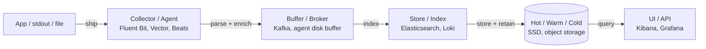
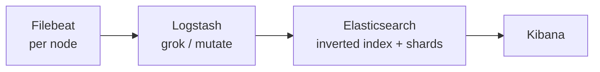
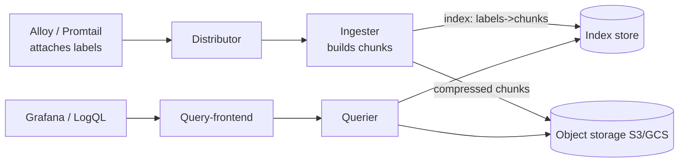
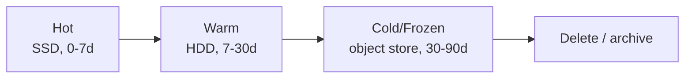

# Log Aggregation & Analysis (ELK / Loki)

**Logs** are timestamped, append-only records of discrete events — one of the three pillars
of observability alongside metrics and traces. On a single host you can `grep` a file; across
a fleet of ephemeral containers and dozens of services you cannot. **Log aggregation** is the
discipline of shipping every service's logs to a **central** system where they can be parsed,
indexed, stored, correlated, and queried as one dataset. This topic covers the *mechanics* of
that pipeline and the two dominant architectures — **the Elastic Stack (ELK)** and **Grafana
Loki** — plus the collectors, parsing, cost model, and retention strategy that surround them.

This is the **hands-on toolchain** view. Where logs fit into an architecture at the design
level lives in `system-design/observability-monitoring-reliability`; how you *write* good log
events (levels, structure, correlation IDs) lives in `structured-logging-and-log-levels`. Here
we assume the events exist and focus on getting them off the host and making them queryable.

> [!KEY-TAKEAWAY]
> The single biggest architectural decision in log aggregation is **what you index**.
> Elasticsearch builds a **full-text inverted index over the message body** — powerful ad-hoc
> search, but the index is large and expensive. Loki indexes **only a small set of labels**
> (like Prometheus) and stores raw log lines as **compressed chunks in object storage** —
> cheap to ingest and store, but a content search becomes a brute-force scan of matching
> streams. Everything else (collectors, parsing, retention) is downstream of that choice.

> [!INTERVIEW]
> High-frequency probes: *"walk me through a centralized logging pipeline"*, *"how does Loki
> differ from Elasticsearch / why is it cheaper?"* (label index vs full-text index),
> *"what is grok and when do you prefer JSON logs?"*, *"what is log/label cardinality and why
> does a high-cardinality label blow up cost?"*, *"how do you keep 90 days of logs affordably?"*
> (hot/warm/cold tiering + object storage), and *"how do you get a metric out of logs?"*
> (log-based metrics / `unwrap` / `metric_relabel`).

---

## The centralized logging pipeline

Almost every log system, regardless of vendor, is the same five-stage pipeline. Naming the
stages lets you reason about failure and cost at each hop.



1. **Ship** — a lightweight **agent** on each host/pod tails files or reads the container
   runtime's stdout/stderr stream and forwards events.
2. **Parse / enrich** — turn a raw line into structured fields (extract `level`, `trace_id`,
   `status`), and attach metadata (pod, namespace, region, `k8s` labels).
3. **Buffer** — decouple producers from the store so a slow or down backend doesn't drop logs
   or block the app. This is a disk buffer in the agent and/or a broker like **Kafka**.
4. **Index / store** — write events into the backend, building whatever index the backend
   uses, and persist the raw data to tiered storage.
5. **Query** — a UI/API for search, filtering, aggregation, and correlation with metrics/traces.

> [!TIP]
> A useful mental model: **ingest cost** is dominated by parsing + indexing (CPU), **storage
> cost** by what you retain and where, and **query cost** by how much data a query must scan.
> ELK and Loki make opposite bets on where to spend: ELK pays at ingest/index time to make
> queries fast; Loki pays little at ingest and pushes work to query time.

---

## Collectors, agents, and forwarders

The **collector** (a.k.a. agent, shipper, forwarder) is the process that gets logs off the
host. Modern practice splits two roles: a per-node **agent** (must be light) and an optional
central **aggregator** (does heavier parsing/routing).

| Tool | Role | Notes |
|---|---|---|
| **Filebeat / Beats** | Lightweight shipper (Elastic) | Purpose-built for the Elastic Stack; tails files, minimal transforms. |
| **Logstash** | Heavy aggregator (Elastic) | JVM-based; rich `filter` plugins (grok, mutate, geoip); high resource use. |
| **Fluentd** | Aggregator/forwarder (CNCF) | Ruby core + C; large plugin ecosystem; more memory than Fluent Bit. |
| **Fluent Bit** | Lightweight agent (CNCF) | C, tiny footprint (~MBs of RAM); the common DaemonSet in Kubernetes. |
| **Vector** | Agent **or** aggregator | Rust; high throughput; VRL transform language; vendor-neutral routing. |
| **Promtail / Grafana Alloy** | Loki agent | Discovers targets and attaches **labels**; Promtail is deprecated in favor of Alloy. |
| **OTel Collector** | Vendor-neutral pipeline | Handles logs alongside metrics/traces (see `opentelemetry-collector-and-pipelines`). |

Two properties matter most in an interview:

- **Backpressure & buffering.** A good agent buffers to memory then **disk** when the backend
  is slow, and applies backpressure rather than dropping or OOMing. Most agents give
  **at-least-once** delivery (retries can duplicate events); true exactly-once is rare.
- **Push vs the backend's model.** Agents **push** to Elasticsearch/Loki over HTTP. (Contrast
  Prometheus metrics, which are **pull/scrape** — logs are almost always push because events
  are produced continuously and can't be re-derived by a later scrape.)

> [!WARNING]
> The agent runs on every node and competes with your workload for CPU/RAM. Doing expensive
> regex parsing (grok) in a per-node agent at high volume is a classic way to burn node CPU;
> push heavy parsing to a central aggregator or, better, **emit structured (JSON) logs** so no
> regex is needed.

---

## Parsing: grok vs JSON (structured logs)

Backends index and aggregate **fields**, not raw text. Parsing is how a line becomes fields.

**Grok** matches unstructured text with named regex patterns. A classic Apache/Logstash
example:

```
# Log line:
127.0.0.1 - frank [10/Oct/2000:13:55:36 -0700] "GET /api HTTP/1.0" 200 2326

# Grok pattern:
%{IPORHOST:client} %{USER:ident} %{USER:auth} \[%{HTTPDATE:ts}\] \
"%{WORD:method} %{URIPATHPARAM:req} HTTP/%{NUMBER:httpversion}" \
%{NUMBER:status:int} %{NUMBER:bytes:int}
```

Grok is powerful but **fragile and CPU-hungry**: patterns are regex, break when the log format
changes, and a poorly-anchored pattern can backtrack catastrophically.

**Structured logging** sidesteps parsing: the application emits JSON (or logfmt) directly, so
the collector just deserializes it — no regex.

```json
{"ts":"2026-07-20T13:55:36Z","level":"error","service":"checkout",
 "trace_id":"4bf92f...","status":500,"msg":"payment declined","order_id":"A123"}
```

> [!KEY-TAKEAWAY]
> **Structured logs make aggregation cheap and reliable.** Fields arrive already typed and
> named, so there is no fragile parse step, aggregations (`count by status`) are exact, and
> correlation (join on `trace_id`) is trivial. The interview-correct answer to "grok vs JSON"
> is almost always: *emit JSON at the source; reserve grok for third-party/legacy logs you
> don't control.*

---

## The Elastic Stack (ELK / Beats)

**ELK** = **E**lasticsearch + **L**ogstash + **K**ibana, usually with **Beats** as the shipper
(the modern name is the **Elastic Stack**). Roles:

- **Beats/Filebeat** — ship logs off hosts.
- **Logstash** (optional) — central parse/transform/route (grok, mutate, enrich).
- **Elasticsearch** — the store + **full-text search index** and aggregation engine.
- **Kibana** — the query/visualization UI (Discover, dashboards, KQL).



Elasticsearch's superpower is that **every field (including the free-text message) is indexed**,
so you can do fast ad-hoc full-text search, fuzzy matching, and rich aggregations without
knowing your queries in advance. The price is a large, compute-heavy index (see next section)
and the operational weight of a stateful, memory-hungry cluster.

---

## Elasticsearch internals: the inverted index

Elasticsearch is built on **Apache Lucene**. When a text field is indexed, it is run through an
**analyzer**: the text is **tokenized** (split into terms) and normalized (lowercased, stemmed,
stop-words handled). Lucene then builds an **inverted index** — a dictionary mapping each
**term → the list of documents (postings) that contain it**.

```
term      postings (doc ids)
-------   -------------------
payment   [ 3, 17, 42, ... ]
declined  [ 3, 42, 91, ... ]
timeout   [ 8, 42, ... ]
```

To answer "find logs containing `payment declined`", Elasticsearch intersects the postings
lists for `payment` and `declined` — this is why full-text search is fast regardless of how
many logs you have. Physically, an index is split into **shards**, each a self-contained
Lucene index made of immutable **segments**; **primary** shards hold data and **replica**
shards add redundancy and read throughput. A **mapping** declares each field's type and how
it's analyzed (`text` = analyzed/tokenized for search; `keyword` = stored verbatim for exact
match/aggregation).

> [!WARNING]
> The inverted index is what makes ELK **expensive**: it can rival or exceed the size of the
> raw logs, needs lots of RAM (heap + OS page cache) to stay fast, and indexing every token
> costs CPU at ingest. That cost is the direct trade for schema-free, ad-hoc search — and it's
> exactly the cost Loki refuses to pay.

---

## Grafana Loki: label-based indexing

Loki was designed as **"Prometheus, but for logs."** Its defining decision:

> **Loki does not full-text index log contents. It indexes only a small set of labels per
> stream, and stores the raw log lines as compressed chunks in object storage.**

Key concepts:

- A **stream** is a unique set of **labels** (e.g. `{app="checkout", namespace="prod",
  level="error"}`). Each stream's log lines are batched, compressed (gzip/snappy), and written
  as **chunks** to object storage (S3, GCS, Azure Blob) — cheap, durable, near-infinite.
- The **index** maps `labels → chunks`. It is tiny relative to the data because it only tracks
  label combinations and time ranges, not the words inside the lines.
- Components (in microservices mode): **distributor** (receives/validates writes) → **ingester**
  (builds chunks, holds recent data in memory, flushes to object store) → **querier** (fetches
  chunks and applies filters) → **query-frontend** (splits/parallelizes queries).



Because there is no content index, a text search like `|= "declined"` is executed by **fetching
every chunk in the matching streams and scanning it**. This is fast *if the label selector
narrows to a few streams* and slow if it matches a huge amount of data — which is why label
design is everything in Loki (next section).

> [!TIP]
> Loki's cost win: object storage is ~an order of magnitude cheaper than the SSD + RAM an
> Elasticsearch cluster needs, and there's no big inverted index to build or hold in memory.
> You trade "search anything instantly" for "cheap to ingest and store, filter-then-scan."

---

## LogQL: querying Loki

**LogQL** is Loki's query language, deliberately modeled on PromQL. Every query starts with a
**log stream selector** (label matchers in `{}`) — this uses the index and is mandatory — then
optionally applies **line filters** and **parsers/expressions**.

```logql
# 1. Log query: errors from checkout in prod, containing "declined"
{app="checkout", namespace="prod", level="error"} |= "declined"

# 2. Parse JSON, keep only status>=500, extract a field
{app="checkout"} | json | status >= 500 | line_format "{{.msg}} order={{.order_id}}"

# 3. Metric query: per-second rate of error lines over 5m, by pod
sum by (pod) (rate({app="checkout"} |= "error" [5m]))

# 4. Extract a numeric field and aggregate it (log-based metric)
quantile_over_time(0.99, {app="checkout"} | json | unwrap latency_ms [5m])
```

Line-filter operators: `|=` (contains), `!=` (not contains), `|~` (regex match), `!~`
(regex not match). Parser stages (`| json`, `| logfmt`, `| pattern`, `| regexp`) turn the line
into labels you can filter/format on. `rate()`, `count_over_time()`, `sum by`, and `unwrap`
turn logs into time series — the same shape as PromQL, so Loki logs graph next to Prometheus
metrics in Grafana.

> [!INTERVIEW]
> A favorite gotcha: *"why is `{level=~".+"}` or a bare `|= "error"` across all apps slow?"*
> Because the selector matches thousands of streams, forcing Loki to fetch and scan a huge
> volume of chunks. **Always narrow with high-value labels first**, then filter. The label
> selector is the only part that uses the index.

---

## Index cardinality vs label cardinality cost

Both systems have a cardinality problem, but in **different places**.

**Loki — label cardinality.** Each unique combination of label values is a **separate stream**
with its own chunks and index entry. Put a high-cardinality value in a label (`user_id`,
`request_id`, `trace_id`, raw `path`, timestamps) and you create a **stream explosion**:
millions of tiny streams, a bloated index, tiny inefficient chunks, and ingesters running out
of memory. This is the exact analogue of Prometheus metric cardinality.

```logql
# BAD label design — request_id as a label => one stream per request
{app="checkout", request_id="A123"}   # millions of streams

# GOOD — keep request_id in the LOG LINE, filter/parse at query time
{app="checkout"} | json | request_id="A123"
```

> [!KEY-TAKEAWAY]
> Loki rule of thumb: labels should be **low-cardinality, bounded, and known-ahead**
> (`app`, `env`, `namespace`, `level`, `region`). Anything unbounded or per-event belongs in
> the **log line**, extracted at query time — not in a label.

**Elasticsearch — field/mapping cardinality & mapping explosion.** High-cardinality `keyword`
fields inflate the index and aggregation memory (each unique value is a term), and dynamic
mapping of ever-changing JSON keys causes **mapping explosion** (too many fields), which
degrades cluster performance. The fix is disciplined mappings and not indexing fields you
never search.

---

## ELK vs Loki: the core trade-off

| Dimension | Elastic Stack (ELK) | Grafana Loki |
|---|---|---|
| **What's indexed** | Full-text **inverted index** over message + fields | **Labels only**; raw lines stored as chunks |
| **Ad-hoc text search** | Fast, rich (fuzzy, relevance, aggregations) | Brute-force scan of matching streams (slower for broad searches) |
| **Storage backend** | SSD-backed cluster; index ~= or > raw size | Object storage (S3/GCS); small index + compressed chunks |
| **Ingest cost (CPU/RAM)** | High (analyze + build index) | Low (no content indexing) |
| **Storage cost** | High | Low |
| **Operational weight** | Heavy stateful cluster; shard/heap tuning | Lighter; scales via object storage + stateless queriers |
| **Query language / UI** | KQL / Query DSL, Kibana | LogQL, Grafana |
| **Best when** | You need arbitrary, exploratory full-text search & analytics | You know your labels, want cheap high-volume logs correlated with Prometheus/traces |

> [!INTERVIEW]
> The crisp one-liner: *"ELK pays at ingest to make any search fast; Loki pays almost nothing
> at ingest and defers work to query time by scanning chunks. Choose ELK when you need
> powerful ad-hoc search/analytics over log content; choose Loki when volume/cost dominates and
> your access pattern is label-scoped grep that lives next to your Prometheus metrics."*
> They are not mutually exclusive — many shops run both, or route only high-value logs to ELK.

---

## Retention & storage tiering (hot / warm / cold)

Logs are high-volume and lose value with age, so nobody keeps everything on fast storage.
**Tiering** (Elastic calls it **ILM — Index Lifecycle Management**) moves data through tiers as
it ages and enforces retention:

- **Hot** — most recent data on fast SSD/NVMe, fully indexed, high query rate (last hours/days).
- **Warm** — older, read-mostly, on cheaper disk; may be shrunk/force-merged, fewer replicas.
- **Cold / frozen** — rarely queried; in Elastic, **searchable snapshots** back the frozen tier
  from **object storage** (cheap, slower). In Loki, all chunks already live in object storage,
  so tiering is mostly about **retention deletion** and caching recent data.
- **Delete** — after the retention period (e.g. 30/90 days, or years for compliance/audit logs).



> [!TIP]
> Retention is where log cost is won or lost. Match tier and retention to the log's **query
> pattern and value**: debug logs a few days hot; access logs weeks warm; audit/security logs
> years in cheap cold storage (often a legal requirement). Rolling indices by day/size
> (Elastic **rollover**) makes deletion a cheap whole-index drop instead of per-document
> deletes.

---

## Log-based metrics

Metrics are far cheaper to store and alert on than logs, but sometimes the only signal you have
is in a log line. **Log-based metrics** derive a time series *from* logs — useful for
retrofitting metrics onto legacy apps, or counting things you didn't instrument.

- **Loki:** LogQL metric queries turn matching lines into series:
  `sum(rate({app="checkout"} |= "5xx" [5m]))`, or extract a numeric field with `unwrap` and
  apply `quantile_over_time` / `sum_over_time`. Loki can also generate **recording rules** that
  write these results back to a Prometheus-compatible store.
- **Elastic:** aggregations (`date_histogram` + `terms`) or transforms produce metric-like
  rollups; alerts run on query results.
- **Prometheus side:** `mtail` / `grok_exporter` scrape log files and export counters, and the
  **Loki/OTel** pipelines can emit log-derived metrics.

> [!WARNING]
> Deriving a metric from logs is a fallback, not a substitute for real instrumentation. It's
> more expensive (you scan logs to compute it), and it breaks if the log wording changes.
> Prefer emitting a real counter/histogram (see `instrumentation-with-micrometer-and-metrics-libraries`);
> use log-based metrics for signals you can't otherwise get.

---

## Correlating logs with traces and metrics

Aggregated logs are far more powerful when **joined to the other two pillars**. The mechanism
is a shared identifier in the log line:

- Emit **`trace_id` / `span_id`** (from W3C Trace Context, see
  `distributed-tracing-concepts-and-context-propagation`) into every structured log. Grafana
  can then jump from a log line to the full **trace** (via a **derived field** in Loki that
  links to Tempo/Jaeger), and from a spiking metric to the logs for that time window.
- Consistent **resource labels** (`service`, `namespace`, `pod`, `region`) across metrics, logs,
  and traces let you pivot between them for the same entity — the core promise of a unified
  observability stack (Grafana LGTM: **L**oki logs, **G**rafana, **T**empo traces,
  **M**imir metrics).

> [!KEY-TAKEAWAY]
> The reason structured logs + stable labels + `trace_id` matter so much: they turn three
> separate silos into one navigable graph. "Metric alerted → drill to logs for that
> service/time → click `trace_id` → see the exact slow span" is the workflow good log
> aggregation exists to enable.

---

## Common follow-up questions

- **"Walk me through what happens to a log line from `stdout` to a Kibana search."** Ship
  (Filebeat tails container stdout) → parse/enrich (Logstash grok or JSON decode, add k8s
  metadata) → buffer (Kafka/disk) → index (Elasticsearch analyzes fields, builds inverted
  index, writes to hot shard) → store (ILM ages to warm/cold) → query (Kibana Discover hits
  the inverted index).
- **"Why is Loki cheaper than Elasticsearch?"** No full-text inverted index to build (low ingest
  CPU/RAM) and raw lines live compressed in object storage instead of SSD-backed shards (low
  storage cost). The trade is slower broad text search.
- **"A Loki query is timing out / ingesters are OOMing — what do you check?"** Label
  cardinality. Look for high-cardinality labels (request_id, user_id, path) causing stream
  explosion; move them into the log line and query with `| json`. Also check the selector is
  narrow enough that the text filter scans few chunks.
- **"grok vs JSON logging?"** JSON at the source removes fragile, CPU-heavy regex and gives
  exact, typed fields; grok only for logs you don't control.
- **"How do you keep 1 year of audit logs without going bankrupt?"** Tier: short hot retention,
  age to warm, then cold/frozen searchable snapshots in object storage; roll indices by day so
  deletion is a cheap index drop.
- **"Push or pull for logs?"** Push — events are continuous and can't be re-derived by a scrape,
  unlike Prometheus metrics.
- **"How do you avoid losing logs when the backend is down?"** Agent disk buffering +
  backpressure and/or a Kafka broker in front of the store; accept at-least-once (dedupe on a
  key if needed).
- **"Structured vs unstructured — impact on aggregation?"** Structured (JSON) fields aggregate
  exactly and cheaply and correlate by `trace_id`; unstructured needs parsing first and is
  brittle.

## References

- Grafana Loki docs — *Overview* (label-only indexing, chunks in object storage), *LogQL*
  (log & metric queries, `unwrap`), *Labels & cardinality best practices*.
- Elastic docs — *Documents and indices* (JSON docs, shards, Lucene segments), *Text analysis*
  (analyzers, tokenization), *Inverted index*, *Index Lifecycle Management (ILM)* & data tiers
  (hot/warm/cold/frozen, searchable snapshots), *Mapping* (`text` vs `keyword`, mapping
  explosion).
- Elastic *Beats/Filebeat* and *Logstash* docs (shippers, grok filter).
- Fluentd / Fluent Bit docs (CNCF collectors), Vector docs (Rust pipeline, VRL).
- Grafana Alloy / Promtail docs (Loki agents, label attachment).
- Grafana LGTM stack docs (Loki/Grafana/Tempo/Mimir correlation, derived fields, trace_id
  linking).
- Google SRE Workbook — logging within observability; OpenTelemetry logs signal (see
  `opentelemetry-signals-and-instrumentation`).
