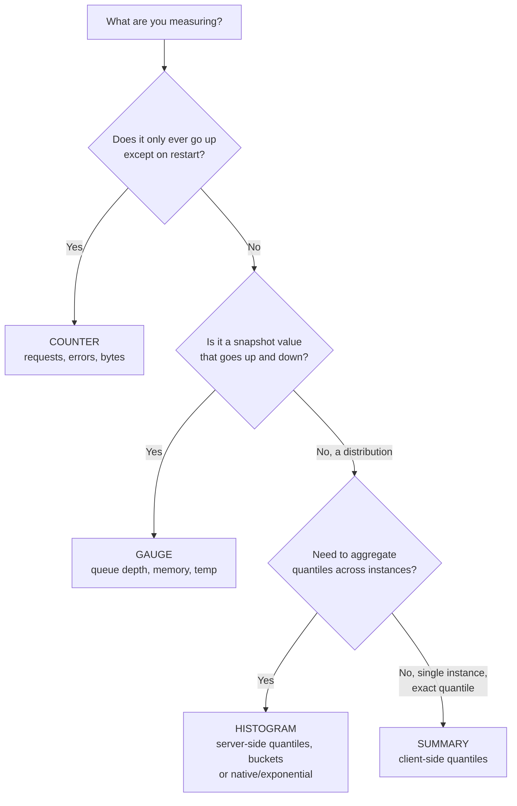

# Metric Types & the Dimensional Data Model

Metrics are the cheapest, most queryable observability signal: numeric measurements
sampled over time and stored as time series. Unlike logs (one row per event) and traces
(one tree per request), a metric aggregates many events into a compact number you can
alert on and graph cheaply. To use them well in an interview *and* in production you have
to understand two things precisely: **what the four metric types actually mean**
(counter, gauge, histogram, summary) and **how a metric name plus its labels defines a
distinct time series** — the "dimensional data model" — because that model is what drives
query power, aggregation, and the cardinality that can bankrupt your monitoring bill.

This note is Prometheus/OpenTelemetry-grounded because that is the stack most backend
interviews probe, but the type semantics generalize to Micrometer, StatsD, Datadog, and
CloudWatch. The design-level "where does monitoring fit" question lives in
`system-design/observability-monitoring-reliability`; here we own the mechanics.

> [!KEY-TAKEAWAY]
> A time series is uniquely identified by its **metric name + the full set of
> label key/value pairs**. Every unique label combination is a *separate* series with its
> own storage and memory cost. Metric *type* (counter/gauge/histogram/summary) tells you
> how to interpret and query the numbers; it is metadata, not a storage format.

---

## The dimensional data model

The dimensional (or "multi-dimensional") model says a measurement is identified by a
**metric name** plus a set of **labels** (Prometheus term) / **attributes** (OpenTelemetry
term) / **tags** (StatsD/Datadog term). The name says *what* is being measured; the labels
say *which slice*. Together they name a single **time series** — a stream of
`(timestamp, value)` samples.

```
http_requests_total{method="GET", handler="/api/orders", status="200"}  → one series
http_requests_total{method="POST", handler="/api/orders", status="500"} → a DIFFERENT series
```

Both share the metric name `http_requests_total`, but because at least one label value
differs they are two independent time series stored separately. Formally, the identity of a
series is the metric name (which is itself just the special `__name__` label in Prometheus)
plus the exact set of label name/value pairs. Change, add, or remove any label value and you
get a new series.

Why this matters:

- **Query power** — you can slice and aggregate along any dimension after the fact:
  "5xx rate for the checkout handler, by pod" without pre-planning that exact chart. This is
  the whole point vs. old-style hierarchical `stats.d`-style dotted names
  (`prod.web01.orders.GET.200.count`), where the dimensions are baked into an opaque string
  and can't be recombined.
- **Aggregation** — `sum by (status)(...)` collapses the dimensions you don't care about.
- **Cost** — the flip side: series count = product of the cardinalities of your labels.
  This is the single biggest operational trap (see *Cardinality*).

> [!INTERVIEW]
> "What uniquely identifies a time series?" Answer: the metric name **and** the complete
> set of label key/value pairs — not the name alone. Interviewers use this to check whether
> you understand that `foo{a="1"}` and `foo{a="2"}` are two series, and that adding a label
> to an existing metric multiplies series count.

---

## Counters

A **counter** is a cumulative metric whose value can only **monotonically increase** or be
**reset to zero** (on process restart). Use it for counts of things that happen:
requests served, errors, bytes sent, tasks completed, cache hits.

```
# HELP http_requests_total Total HTTP requests.
# TYPE http_requests_total counter
http_requests_total{method="GET",status="200"} 148923
```

The raw counter value (148923) is rarely interesting on its own — what you almost always
want is its **rate of change** (`rate(http_requests_total[5m])` = requests/sec). Because it
only ever goes up, you can safely compute deltas and rates across scrapes even if some
scrapes were missed.

Key rules and gotchas:

- **Never use a counter for something that can go down** (queue depth, temperature, memory
  in use) — that is a gauge. A decrease would look like a counter reset and corrupt `rate()`.
- **Reset semantics**: a restart sends the counter back to 0. Rate functions detect the
  drop (new value < previous value) and treat it as a reset, adding the pre-reset value so
  the rate stays correct. You should therefore *not* try to reason about the absolute value.
- **`_total` suffix**: by Prometheus/OpenMetrics convention counter names end in `_total`
  (`errors_total`), which is how OpenMetrics identifies the type on the wire.
- A counter should only be reset by a restart, never by application logic.

---

## Gauges

A **gauge** is a metric representing a single value that can **arbitrarily go up and down**.
Use it for instantaneous measurements: current memory usage, in-flight requests, queue
depth, temperature, number of active goroutines/threads, a connection pool's free slots.

```
# TYPE node_memory_used_bytes gauge
node_memory_used_bytes 5.8721e+09
```

Because a gauge is a snapshot, you generally graph it **as-is** and aggregate it with
`sum`, `avg`, `min`, `max`, `topk` — **not** with `rate()` (rate is meaningless on a value
that isn't monotonic). If you *do* want how fast a gauge is changing, use `deriv()` or
`delta()`, not `rate()`.

Common gauge-specific functions: `delta(v[range])` (difference over the window),
`deriv(v[range])` (per-second derivative via linear regression), `predict_linear()` (for
"disk will be full in N hours" alerts).

> [!WARNING]
> Choosing counter vs gauge is the most common metric-modeling mistake. A "current active
> requests" gauge and a "total requests handled" counter are different metrics answering
> different questions. If a value can decrease during normal operation, it is a gauge.

---

## Histograms

A **histogram** samples observations (usually request durations or response sizes) and
counts them into configurable **buckets**, while also tracking a running sum and count. It
lets you compute quantiles (p50/p95/p99) and averages *after the fact, on the server*.

A classic Prometheus histogram named `<base>` exposes **three** kinds of series:

- `<base>_bucket{le="<upper bound>"}` — a set of **cumulative** counters. Each bucket counts
  observations **less than or equal to** its `le` ("less than or equal") upper bound. Buckets
  are cumulative, so `le="0.5"` includes everything counted in `le="0.1"`.
- `<base>_sum` — the sum of all observed values.
- `<base>_count` — the number of observations (identical to the `le="+Inf"` bucket).

```
# TYPE http_request_duration_seconds histogram
http_request_duration_seconds_bucket{le="0.1"}   24054
http_request_duration_seconds_bucket{le="0.3"}   32723
http_request_duration_seconds_bucket{le="1.0"}   34561
http_request_duration_seconds_bucket{le="+Inf"}  34588
http_request_duration_seconds_sum               8953.33
http_request_duration_seconds_count             34588
```

You query a quantile by wrapping the *rate of the buckets* in `histogram_quantile`:

```promql
# 95th percentile latency over the last 5 minutes
histogram_quantile(0.95, rate(http_request_duration_seconds_bucket[5m]))
```

**Worked example — how `histogram_quantile` turns those buckets into a p95.** Take the
numbers above. Total count = 34588, so the p95 sits at rank `0.95 × 34588 = 32858.6`.
Scan the cumulative buckets to find where that rank lands: `le="0.3"` holds 32723 (too few)
and `le="1.0"` holds 34561 (enough), so the p95 falls **inside the (0.3s, 1.0s] bucket**.
Now linearly interpolate across that bucket's boundaries, assuming the 32858.6 − 32723 =
135.6 "extra" observations are spread evenly through the 34561 − 32723 = 1838 observations in
the bucket:

```
p95 ≈ 0.3 + (32858.6 − 32723) / (34561 − 32723) × (1.0 − 0.3)
    = 0.3 + (135.6 / 1838) × 0.7
    = 0.3 + 0.0516
    ≈ 0.35 s
```

Notice how coarse this is: everything from 0.3s to 1.0s is treated as uniformly distributed,
so the true p95 could be anywhere in that 700ms-wide band and we just picked ~0.35s. If your
SLO is "p95 < 0.5s", a bucket that straddles 0.5s can't tell you which side of the line you're
on — which is exactly why you **choose bucket boundaries that bracket your SLO thresholds**
(add an `le="0.5"` here) instead of leaving a wide gap.

Key properties and gotchas:

- **Buckets are counters** — that's why you `rate()` them first, to get per-second bucket
  rates before computing the quantile.
- **Quantile accuracy is bounded by bucket boundaries.** `histogram_quantile` linearly
  interpolates *within* the bucket the quantile falls into, so a p99 that lands in a wide
  bucket (say `le="1.0"` to `le="10"`) can be very rough. You must pick buckets that bracket
  your SLO thresholds. The highest bucket must be `+Inf`.
- **A quick average**: `rate(_sum[5m]) / rate(_count[5m])` gives mean latency.
- **Aggregatable across series** — because buckets are just counters with shared `le`
  boundaries, you can `sum by (le)(rate(..._bucket[5m]))` across pods/instances and *then*
  take the quantile. This is the histogram's superpower over summaries.
- Bucket boundaries must be chosen up front (classic histograms) and are the main tuning
  knob; too few = coarse quantiles, too many = cardinality cost (each bucket is a series).

---

## Summaries

A **summary** also samples observations and exposes `_sum` and `_count`, but instead of
buckets it calculates **configurable φ-quantiles on the client**, over a sliding time window,
and exposes them directly:

```
# TYPE rpc_duration_seconds summary
rpc_duration_seconds{quantile="0.5"}   0.012
rpc_duration_seconds{quantile="0.9"}   0.031
rpc_duration_seconds{quantile="0.99"}  0.104
rpc_duration_seconds_sum               17421.9
rpc_duration_seconds_count             261423
```

The quantile values are computed *inside the instrumented process* (a streaming quantile
estimator). That has two consequences:

- **Precision on that one instance is good** and needs no bucket tuning — the client knows
  the exact distribution it saw. You get the p99 directly, no interpolation error.
- **You CANNOT aggregate quantiles across instances.** There is no mathematically valid way
  to average or sum the p99 from 10 pods into a fleet-wide p99. `avg(quantile="0.99")` is
  *wrong* (the average of percentiles is not the percentile of the aggregate). You are stuck
  with per-instance quantiles or must fall back to `_sum`/`_count` for a mean.

The `_sum` and `_count` of a summary **are** aggregatable (they're counters), so a fleet
average latency still works; only the pre-computed quantiles are trapped per-series.

**Worked example — why `avg(p99)` is nonsense.** Two pods behind the same load balancer:

- Box A is idle: 10 requests, all fast, `p99 = 5ms`.
- Box B is hammered: 10,000 requests, slow, `p99 = 800ms`.

Averaging the two reported quantiles gives `avg(p99) = (5 + 800) / 2 = 402.5ms`. But no
request in the fleet actually experienced ~400ms as its 99th-percentile latency — the number
is a fiction, because box A (10 requests) and box B (10,000 requests) get equal weight in the
average despite contributing 1000× different traffic. The *true* fleet p99 is over all
10,010 requests: the slowest 1% (≈100 requests) are dominated entirely by box B, so the real
fleet p99 is right up near **800ms**, not 402ms. A histogram avoids this by summing the raw
bucket counts of both boxes into one combined distribution first, then computing a single
quantile over all 10,010 observations — which correctly lands near 800ms.

---

## Histograms vs summaries

This comparison is a very common interview question. Both give you `_sum` and `_count`;
the difference is **where and how quantiles are produced**.

| Aspect | Histogram (classic) | Summary |
|---|---|---|
| Quantile computed | **Server-side**, at query time via `histogram_quantile` | **Client-side**, in the app, over a sliding window |
| Aggregatable across instances | **Yes** — `sum by (le)` then quantile | **No** — quantiles cannot be averaged/summed |
| Accuracy | Bounded by bucket boundaries (interpolation error) | Precise per-instance for the configured φ |
| Configuration | Choose bucket boundaries up front | Choose which quantiles + error target |
| Client CPU/memory cost | Cheap (just increment bucket counters) | Higher (streaming quantile estimator) |
| Change target quantile later | Free — recompute from buckets in a query | Requires code change + redeploy |
| Series produced | one per bucket + `_sum` + `_count` | one per quantile + `_sum` + `_count` |

**Rule of thumb:** prefer **histograms** for anything you aggregate across many instances
(nearly all service latency SLOs) — you can compute any quantile at query time and combine
across pods. Reach for a **summary** only when you need an exact quantile from a *single*
process and will never aggregate it, or when you can't know good bucket boundaries in
advance. Micrometer's `Timer` publishes histogram buckets (client-side percentiles are
opt-in and carry the same aggregation caveat).

> [!INTERVIEW]
> The killer follow-up: "Why can't you average p99 across servers?" Because a percentile is
> a property of a *distribution*; the mean of ten p99s is not the p99 of the combined
> traffic (a low-traffic idle box and a hammered box contribute equally to the average but
> not to the real distribution). Histograms sidestep this by aggregating the raw *bucket
> counts* first and computing the quantile once on the combined distribution.

---

## Native and exponential histograms

Classic histograms force a hard trade-off: fixed buckets you must guess in advance, and
resolution costs you one series per bucket. **Native histograms** (Prometheus) /
**exponential histograms** (OpenTelemetry) solve this.

- **Prometheus native histograms** (stable-ish, opt-in) store the whole distribution in a
  *single* time series as a special sample carrying count, sum, and a **dynamically growing
  set of exponentially-spaced buckets**. No pre-configured `le` boundaries. Resolution is
  controlled by a `schema`/`scale` factor and adapts automatically. This dramatically cuts
  cardinality (one series instead of N bucket series) and gives high, uniform relative
  resolution. You still query with `histogram_quantile(0.95, rate(...[5m]))` — same function,
  different underlying representation.
- **OpenTelemetry exponential histograms** use the same idea: bucket boundaries follow
  `base = 2**(2**-scale)`, so bucket `i` covers `(base^i, base^(i+1)]`. A larger `scale`
  means finer resolution. A special `zero_count` bucket with a `zero_threshold` handles
  values at/near zero.

**Worked example — what `scale` actually buys you.** Take OTel `scale=3`. Then
`base = 2**(2**-3) = 2**(1/8) = 2**0.125 ≈ 1.0905`, so each bucket is about **9% wider than
the previous one**. Bucket boundaries march up geometrically: …, 1.0000, 1.0905, 1.1892,
1.2968, 1.4142, … Every bucket has the *same* relative width (~9%), so a value at 10ms and a
value at 10s both land in a bucket that pins them to within ~9% of their magnitude — a fixed
**~9% relative error at any latency scale**. Bump to `scale=4` and `base = 2**(1/16) ≈
1.0443`, halving the relative error to ~4.4% (finer resolution, still one series). Contrast a
classic fixed bucket like `le="1.0"` with the next at `le="10"`: a value of 9.5s and a value
of 1.1s both fall in the same bucket, so the relative error explodes to nearly 900% for
values far from the lower boundary. That is the "uniform relative resolution" win made
concrete: exponential buckets keep the error percentage constant instead of letting it blow
up between widely-spaced fixed boundaries.

The property that makes them powerful: **perfect subsetting / mergeability**. Buckets at a
higher resolution map exactly onto buckets at a lower resolution, so two exponential
histograms (even at different scales) can be merged *without error* by downscaling to the
coarser one. Classic histograms with *different* `le` boundaries are generally **not**
mergeable at all — a real problem when teams pick different buckets.

> [!TIP]
> If asked "how would you get accurate high-percentile latency without exploding
> cardinality or guessing buckets?" — native/exponential histograms are the modern answer:
> one series, auto-scaling exponential buckets, still aggregatable and quantile-queryable.

---

## Rating a counter and counter resets

`rate()` is the function you use most on counters, and interviewers love probing its edge
cases.

- **`rate(v[window])`** = per-second average rate of increase over the window. It
  automatically **adjusts for counter resets**: when it sees a sample lower than the
  previous one (a restart), it assumes a reset and adds the pre-reset value so the computed
  rate stays correct rather than going negative.
- **Extrapolation**: `rate()` extrapolates to the exact edges of the time window to
  compensate for scrapes not landing precisely on the boundaries, which is why a `rate()`
  can yield a slightly non-integer or surprising value over short windows.
- **`irate(v[window])`** = *instant* rate using only the **last two** samples in the window.
  Good for volatile, fast-moving counters on a graph; bad for alerting because brief dips can
  reset a `for:` clause and spiky graphs are unreadable. Rule: **`rate()` for alerts and
  slow counters; `irate()` for graphing fast-moving ones.**
- **`increase(v[window])`** = total increase over the window; it is exactly
  `rate(v[window]) * window_seconds` — syntactic sugar, easier for humans to read
  ("~500 errors in the last hour").

**Worked example — reset detection on a real scrape sequence.** Say a counter is scraped
every interval and reads `100, 130, 10, 40` (the process restarted between the 2nd and 3rd
scrape, sending it back toward 0). A naive "last minus first" delta would give
`40 − 100 = −60` — a negative, nonsensical rate. `rate()` instead walks consecutive pairs and
treats any drop as a reset:

```
100 → 130 : 130 ≥ 100 → normal increase          +30
130 →  10 :  10 < 130 → RESET; the counter fell, so it restarted at 0 and
            climbed back to 10 → count the post-reset value              +10
 10 →  40 :  40 ≥  10 → normal increase                                  +30
```

So the counted increase is `30 + 10 + 30 = 70` over the window — positive and correct, instead
of the bogus `40 − 100 = −60`. The subtlety students miss: the reset step contributes `+10` (the
value climbed after the restart, i.e. `0 → 10`), **not** the pre-reset `130`. Equivalently,
Prometheus's correction is `(last − first) + Σ(pre-reset values) = (40 − 100) + 130 = 70`. (`rate()`
then divides by the window seconds and extrapolates to the window edges; the key point is that
reset detection turns a would-be negative into the true increase.)

Ordering rule with aggregation — a classic trap:

```promql
# CORRECT: rate() first (per series, so resets are detected), then aggregate
sum by (status) (rate(http_requests_total[5m]))

# WRONG: aggregating raw counters first hides per-series resets → bogus rate
rate(sum by (status) (http_requests_total)[5m:])
```

Always take `rate()`/`irate()` **before** `sum`/`avg`, because reset detection is per-series
and summing first destroys the per-series monotonicity information.

Also: the window must span **at least two scrapes** (rule of thumb ≥ 4× the scrape interval)
or `rate()` returns nothing/noise. A `rate()` over a window shorter than the scrape interval
yields empty results.

---

## Cumulative vs delta temporality

**Aggregation temporality** describes whether a reported value includes everything since a
fixed start (cumulative) or only what happened in the last interval (delta). It applies to
Sums, Histograms, and ExponentialHistograms.

- **Cumulative** (Prometheus's model): each sample reports the running total since the
  process started; the start timestamp stays fixed, so windows overlap: `(T0,T1]`, `(T0,T2]`,
  `(T0,T3]`. Rates are derived by the *reader* subtracting consecutive samples (what `rate()`
  does). Robust to a missed scrape — the next cumulative sample still carries the full total.
- **Delta** (StatsD's model, and an OTel option): each sample reports only the change since
  the previous report; windows do not overlap: `(T0,T1]`, `(T1,T2]`, `(T2,T3]`. The client
  can be **memory-less** (doesn't retain running totals), which suits sampling and pushing
  high-cardinality data, but a lost delta is data permanently gone.

| | Cumulative | Delta |
|---|---|---|
| Value reported | Total since start | Change since last report |
| Windows | Overlapping (fixed start) | Non-overlapping |
| Client state | Must remember running totals | Can be stateless |
| Missed data point | Self-healing (next sample has full total) | Permanently lost |
| Rate computation | Reader subtracts samples | Reader sums deltas |
| Exemplified by | Prometheus | StatsD |

One gotcha interviewers like: the **first sample / unknown-start-time problem**. With
cumulative metrics you need **at least two samples** after a (re)start before `rate()` can
yield anything — a single cumulative value has nothing to subtract against, so the very first
scrape of a freshly-started process produces no rate. A reset at time T likewise resets the
effective start, which is why a `rate()` over a very short window that straddles a restart can
read empty until a second post-restart sample lands.

Why it matters in practice: **Prometheus's storage model has no concept of delta counters**,
so when an OpenTelemetry pipeline emits delta metrics you must convert delta → cumulative
before writing to Prometheus. That conversion is **stateful** (the collector must accumulate)
and requires all points for a series to reach **one** destination — the "single-writer"
principle — otherwise totals get double-counted or lost. This is a favorite senior-level
question when you connect the OTel Collector to Prometheus remote-write.

---

## Aggregating across dimensions

The dimensional model's payoff is that you can **collapse labels you don't care about** at
query time. In PromQL this is done with aggregation operators plus `by` / `without`.

```promql
# Total request rate, ignoring which handler/instance
sum(rate(http_requests_total[5m]))

# Grouped: request rate per status code across the whole fleet
sum by (status) (rate(http_requests_total[5m]))

# Same, but keep everything EXCEPT instance (drop only the instance label)
sum without (instance) (rate(http_requests_total[5m]))
```

Rules and pitfalls:

- **`by` keeps** the listed labels and aggregates the rest away; **`without` drops** the
  listed labels and keeps the rest. `without` is often safer because new labels are retained
  automatically.
- **Sum bucket counts, not quantiles.** To aggregate histogram quantiles across instances:
  `histogram_quantile(0.95, sum by (le) (rate(http_request_duration_seconds_bucket[5m])))`
  — aggregate `by (le)` first, then take the quantile. You must keep the `le` label through
  the `sum`.
- **Summaries can't be aggregated at the quantile level** (see *Summaries*) — only their
  `_sum`/`_count`.
- **Only aggregate metrics that are the same logical thing.** Prometheus's guideline: a
  metric should mean the same thing across all its label values, such that `sum()` or `avg()`
  over the dimensions is meaningful. Summing a gauge like `queue_size` across queues is fine;
  averaging a ratio across wildly different-traffic instances can mislead.
- For gauges use `sum`/`avg`/`max`/`min`/`topk`; for counters take `rate()` first then `sum`.

---

## Cardinality and the series explosion

**Cardinality** = the number of distinct time series a metric produces, which equals the
**product of the number of distinct values of each of its labels** (times the instances
exposing it). This is the number-one way to blow up a metrics backend.

```
requests_total{method, status, handler}
  methods: 5   ×   statuses: 8   ×   handlers: 40   =  1,600 series  (fine)

# add a per-user label:
requests_total{method, status, handler, user_id}
  1,600 × 500,000 users  =  800,000,000 series           (catastrophe)
```

Each series consumes memory in the TSDB head block, index space, and query time. High
cardinality causes OOMs, slow queries, and huge bills (cost-per-series is how most SaaS
vendors charge). Rules:

- **Never put unbounded/high-cardinality values in labels**: user IDs, email addresses,
  full URLs with IDs, request IDs, session IDs, raw timestamps, container IDs that churn.
- **Bound your label values**: normalize URLs to route templates (`/orders/{id}` not
  `/orders/12345`), cap status to code classes if needed, avoid free-form strings.
- **A histogram multiplies cardinality by its bucket count** — each bucket is a series. 10
  buckets × the label combinations above. Native/exponential histograms fix this (one series).
- **Remember buckets and quantiles are extra series**: a histogram with 12 buckets is
  ~14 series (12 buckets + `_sum` + `_count`) *per label combination*.
- Watch for **label churn** (labels whose values are ephemeral, like pod names in an
  autoscaling deployment) — old series linger in the head block and index.

High-cardinality *dimensional* data belongs in **traces or logs (or exemplars)**, not
metric labels. This links to the `sampling-cardinality-and-telemetry-cost-management` topic.

---

## Naming conventions and base units

Consistent naming makes metrics discoverable and safely aggregatable. Prometheus/OpenMetrics
conventions (interviewers check you know these):

- **Application prefix / namespace**: start with a single-word domain prefix —
  `http_...`, `process_...`, `node_...`, `prometheus_notifications_total`.
- **Unit suffix, base units, singular quantity**: the name SHOULD end with the unit in
  plural, and use **base units** — **seconds** (not milliseconds), **bytes** (not
  KB/MB, and use bytes even where bits are common), **meters**, **celsius**, **ratio**
  (0–1, not a 0–100 percent), **grams**. A name MUST refer to a *single* unit and a *single*
  quantity: `http_request_duration_seconds`, `node_memory_usage_bytes`.
- **`_total` for counters**: accumulating counts end in `_total`
  (`http_requests_total`, `process_cpu_seconds_total`). This is how OpenMetrics marks the
  type.
- **Don't encode dimensions in the name — use labels.** Not
  `http_responses_500_total` + `http_responses_200_total`; use
  `http_responses_total{status="500"}`. Putting label names in the metric name is redundant
  and breaks aggregation.
- **Consistency / aggregation test**: a metric should represent the same logical thing
  across all label values, such that `sum()` or `avg()` over its dimensions is meaningful.
- OpenTelemetry differs slightly: it carries **unit as separate metadata** and uses `.`-
  delimited names (`http.server.request.duration`); the OTel→Prometheus exporter translates
  these (dots → underscores, appends `_total`, etc.).

> [!TIP]
> Store durations in **seconds** and sizes in **bytes** even if it feels unnatural — every
> dashboard and alerting rule then agrees on units, and Grafana can format for display. The
> classic bug is mixing `_ms` and `_seconds` metrics and computing a nonsense average.

---

## The exposition format

Prometheus scrapes a plain-text endpoint (`/metrics`) in the **text exposition format**
(OpenMetrics is its standardized successor). Reading it is a common practical question.

```
# HELP http_requests_total Total number of HTTP requests.
# TYPE http_requests_total counter
http_requests_total{method="GET",status="200"} 1027 1699999999000
http_requests_total{method="POST",status="500"} 3

# TYPE http_request_duration_seconds histogram
http_request_duration_seconds_bucket{le="0.1"} 24054
http_request_duration_seconds_bucket{le="0.5"} 33444
http_request_duration_seconds_bucket{le="+Inf"} 34588
http_request_duration_seconds_sum 8953.33
http_request_duration_seconds_count 34588
```

- Each line is `metric_name{labels} value [optional_timestamp_ms]`. The optional trailing
  timestamp is usually omitted so Prometheus stamps at scrape time.
- `# HELP` gives a human description; `# TYPE` declares counter/gauge/histogram/summary.
  Prometheus's server internally flattens everything except native histograms into untyped
  float series — the `# TYPE` is metadata/documentation.
- A histogram/summary is *not* one line — it expands into its `_bucket`/`quantile`, `_sum`,
  and `_count` lines as shown.
- This is **pull-based**: the app exposes state, Prometheus scrapes on an interval. Push
  systems (StatsD, OTLP push, Pushgateway) invert that. Scrape-vs-push mechanics are
  covered in `prometheus-architecture-and-scraping`.

---

## Choosing the right metric type

A compact decision guide (a great whiteboard summary):



- **Count of events** → counter (`_total`), query with `rate()`.
- **Current level** → gauge, query as-is / `avg` / `max`.
- **Distribution you'll aggregate** (latency SLOs across a fleet) → histogram; prefer
  native/exponential to avoid bucket guessing and cardinality blow-up.
- **Exact per-instance quantile, never aggregated** → summary (rare in modern setups).

---

## Common follow-up questions

- **"What uniquely identifies a Prometheus time series?"** The metric name (the `__name__`
  label) plus the complete set of label key/value pairs. Any label difference = new series.
- **"Counter vs gauge — how do you decide?"** If the value can decrease during normal
  operation, it's a gauge; if it only accumulates (resetting only on restart), it's a
  counter. You `rate()` counters, not gauges.
- **"Why can't you average p99 latency across servers?"** A percentile describes a
  distribution; the average of per-server p99s isn't the p99 of combined traffic. Aggregate
  histogram bucket counts first, then compute the quantile once.
- **"Histogram vs summary?"** Histogram = server-side quantiles from aggregatable buckets;
  summary = client-side quantiles that can't be aggregated. Default to histograms.
- **"What breaks `rate()`?"** Using it on a gauge; a window shorter than ~2 scrape intervals;
  aggregating counters *before* `rate()` (hides per-series resets); expecting exact integers
  (it extrapolates).
- **"How would you accidentally 100× your metrics bill?"** Add a high-cardinality label
  (user_id, request_id, full URL) — series count = product of label cardinalities.
- **"Cumulative vs delta, and why does it matter for OTel→Prometheus?"** Prometheus is
  cumulative; delta metrics must be converted to cumulative (stateful, single-writer) before
  ingestion.
- **"Why base units?"** Uniform seconds/bytes everywhere prevents unit-mixing bugs and lets
  every dashboard/alert agree; display formatting happens in Grafana.
- **"What's a native/exponential histogram and why use it?"** A single series with
  auto-scaling exponential buckets — high resolution, low cardinality, still aggregatable
  and quantile-queryable; avoids guessing bucket boundaries.

---

## References

- Prometheus — Metric types: https://prometheus.io/docs/concepts/metric_types/
- Prometheus — Data model: https://prometheus.io/docs/concepts/data_model/
- Prometheus — Querying functions (`rate`, `irate`, `increase`, `histogram_quantile`):
  https://prometheus.io/docs/prometheus/latest/querying/functions/
- Prometheus — Metric and label naming: https://prometheus.io/docs/practices/naming/
- Prometheus — Histograms and summaries:
  https://prometheus.io/docs/practices/histograms/
- Prometheus — Native histograms:
  https://prometheus.io/docs/specs/native_histograms/
- OpenMetrics specification: https://github.com/OpenObservability/OpenMetrics/blob/main/specification/OpenMetrics.md
- OpenTelemetry — Metrics data model (temporality, exponential histograms):
  https://opentelemetry.io/docs/specs/otel/metrics/data-model/
- Micrometer — Concepts (Counter, Gauge, Timer, DistributionSummary):
  https://docs.micrometer.io/micrometer/reference/concepts.html
- Google SRE Workbook — Alerting on SLOs (context for histogram-based SLIs):
  https://sre.google/workbook/alerting-on-slos/
