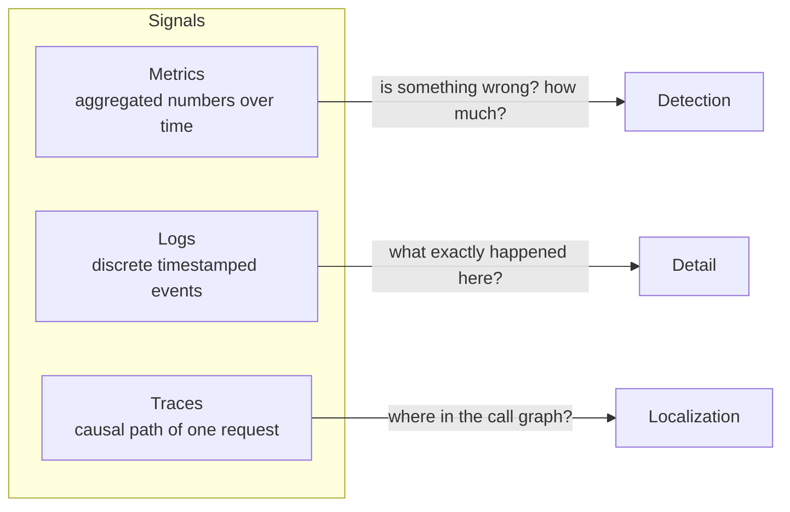
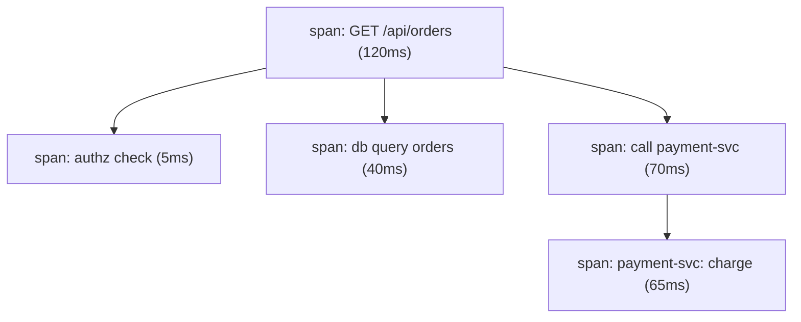
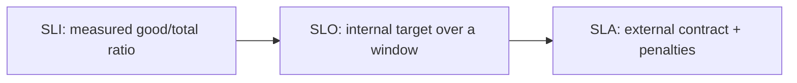
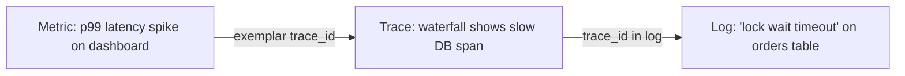

# Observability Fundamentals & the Three Pillars

Observability is the property of a system that lets you **understand its internal
state from the outputs it emits** — without shipping new code to answer a new
question. It is the practical discipline of instrumenting software so that when
something goes wrong (or goes strange) in production, you can ask *why* and get an
answer from data you already collected. This topic is the hands-on foundation for
the rest of the observability domain: what signals exist (metrics, logs, traces,
and increasingly wide structured events), the mental models interviewers probe
(monitoring vs observability, the four golden signals, RED, USE, white-box vs
black-box), and the vocabulary of reliability targets (SLI/SLO/SLA, error budgets)
that everything downstream — dashboards, alerting, sampling — is built on.

This topic owns the **signal mechanics and mental models**. The design-level view of
where monitoring fits in an architecture lives in
`system-design/observability-monitoring-reliability`. The human *process* of
incidents, on-call rotations, and postmortems belongs to the upcoming
reliability-and-operations domain — here we keep on-call at the **signal-quality**
level (what makes an alert actionable). Flame-graph reading as a performance skill
belongs to performance-engineering; here, continuous profiling is treated only as
another always-on production signal.

> [!INTERVIEW]
> Three probes separate a senior answer from a junior one on this topic:
> (1) *"What's the difference between monitoring and observability?"* — the crisp
> answer is **known-unknowns vs unknown-unknowns**, not "observability is
> monitoring plus tracing." (2) *"You have metrics, logs, and traces — are you
> observable?"* — no; three disconnected pillars that you can't correlate is not
> observability, which is why *wide structured events* and *exemplars* matter.
> (3) *"Golden signals vs RED vs USE — when do you use each?"* — golden signals and
> RED are **request/service-oriented**; USE is **resource-oriented**.

---

## Monitoring vs. observability

**Monitoring** is watching a predefined set of signals for conditions you already
know to look for: CPU > 80%, error rate > 1%, queue depth > 1000. You decide the
questions in advance and build dashboards and alerts around them. Monitoring is
excellent for **known-unknowns** — failure modes you can anticipate ("the disk
might fill up," "the database might get slow").

**Observability** is the ability to ask *arbitrary, previously-unanticipated*
questions about your system's behavior and get answers from existing telemetry —
without deploying new instrumentation. It targets **unknown-unknowns**: the novel
failure modes you never predicted ("requests from Android clients on API v3 hitting
shard 7 during cache warmup are 40× slower"). You can only answer that if your
telemetry is rich and high-cardinality enough to slice along dimensions you didn't
think to pre-aggregate.

| | Monitoring | Observability |
|---|---|---|
| Question type | Predefined ("is X healthy?") | Arbitrary, ad hoc ("why is X weird?") |
| Targets | Known-unknowns | Unknown-unknowns |
| Failure it catches | Anticipated | Novel / emergent |
| Typical artifact | Fixed dashboards, threshold alerts | Explorable high-cardinality data |
| Relationship | A **subset/consumer** of observability data | The broader capability |

> [!KEY-TAKEAWAY]
> Monitoring and observability are not opposites and not synonyms. Monitoring is
> *acting on what you predicted*; observability is *the capacity to investigate
> what you didn't*. Monitoring is a use case built on top of observable telemetry.

The trap in interviews is to say "observability = metrics + logs + traces." Tools
are not the definition. A system can emit all three pillars and still be
*unobservable* if you can't correlate them or slice them along the dimension that
matters. Conversely, sufficiently wide, high-cardinality event data can be highly
observable with "just" one signal type.

## Observability as inference of internal state (control-theory origin)

The word comes from **control theory** (Rudolf E. Kálmán, 1960). A dynamical system
is **observable** if you can determine its complete internal state purely from its
**external outputs** over a finite time window. Applied to software: your service's
internal state (which code path executed, what a variable held, why a request was
slow) must be *inferable* from the telemetry it emits — logs, metrics, traces,
events — because in production you cannot attach a debugger and inspect memory.

This framing has two practical consequences interviewers like:

- **Instrumentation is not optional overhead; it is what makes the state
  recoverable.** If a code path emits no signal, that part of the system's state is
  *unobservable* — you are blind to it no matter how many dashboards you have.
- **The goal is inference of the unknown, not confirmation of the known.** Good
  observability lets you reconstruct a story you didn't pre-plan for, the same way a
  Kalman filter estimates hidden state variables from noisy outputs.

> [!TIP]
> If asked "why is it called observability?", cite Kálmán and control theory:
> observability = can you reconstruct internal state from outputs. It signals you
> understand the concept, not just the buzzword.

## The three pillars: metrics, logs, and traces

The classic model describes three complementary telemetry signal types. Each answers
a different question and has a different cost/shape profile.



**Metrics** — numeric measurements aggregated over time, stored as time series
identified by a name plus key/value labels. Cheap to store and query (fixed
cardinality, regular sampling), ideal for dashboards, trends, and alerting. They
tell you *that* something is wrong and *how much*, but not *why*. Example
Prometheus exposition:

```text
# HELP http_requests_total Total HTTP requests.
# TYPE http_requests_total counter
http_requests_total{method="GET",route="/api/orders",status="200"} 24853
http_requests_total{method="GET",route="/api/orders",status="500"} 17
```

**Logs** — discrete, timestamped records of individual events. Highest detail per
event; can carry arbitrary context. Structured (JSON/key-value) logs are queryable;
unstructured free text is not. Logs tell you *what exactly happened* at a point, but
are expensive at volume and hard to aggregate. Example structured log line:

```json
{"ts":"2026-07-20T10:15:03Z","level":"error","service":"orders","route":"/api/orders","trace_id":"4bf92f3577b34da6a3ce929d0e0e4736","user_tier":"gold","msg":"payment gateway timeout","latency_ms":5031}
```

**Traces** — the causal, timed path of a *single request* as it fans out across
services, represented as a tree of **spans**. Each span is a named, timed operation
with attributes; child spans nest under parents. Traces tell you *where* in the call
graph time was spent or an error occurred — invaluable in distributed systems.



| Pillar | Shape | Best at | Weak at | Cost driver |
|---|---|---|---|---|
| Metrics | Aggregated series | Detection, trends, alerting | Explaining *why* | Label cardinality |
| Logs | Discrete events | Deep detail on one event | Aggregation, cost at scale | Volume (bytes) |
| Traces | Per-request span tree | Localizing latency/errors across services | Whole-fleet aggregates | Volume × sampling |

## Why the three pillars are necessary but not sufficient

The "three pillars" model is a useful teaching device but is increasingly criticized
(notably by Charity Majors and the Honeycomb/observability-2.0 community) as
**necessary but not sufficient**. The problems:

- **Three disconnected silos.** If your metrics are in Prometheus, logs in ELK, and
  traces in Jaeger with no shared identifiers, you have three tools and three bills,
  but you still can't answer a cross-cutting question. Observability requires
  **correlation** across signals (see exemplars, below), not just their existence.
- **Metrics pre-aggregate away the detail.** A metric is aggregated *at write time*;
  once you've collapsed requests into a counter, you can no longer decompose it by a
  dimension you didn't add as a label. High-cardinality dimensions (user ID, request
  ID) blow up metric storage, so metrics fundamentally cannot answer high-cardinality
  questions.
- **Sampled traces + coarse logs miss the outlier.** The one weird request is often
  what matters, and it's exactly what naive sampling drops.

> [!WARNING]
> "We have metrics, logs, and traces" is not a proof of observability. Three pillars
> you cannot join on a common `trace_id`/`service`/`request` dimension are three
> data silos. The failure mode is a 2am incident where each tool shows a symptom but
> nothing connects them.

The pillars remain the working vocabulary of the field, and most stacks are built on
them — but the maturity signal is knowing their limits.

Some teams treat **continuous profiling** as a fourth always-on production signal.
Continuous profiling is low-overhead statistical sampling of CPU and
memory-allocation profiles *in production* (not just in a one-off lab run),
attributed down to the function/line level and increasingly correlated by service
and trace context. It answers a question the three classic pillars struggle with —
*which code is burning the resource?* — but, like the pillars, it is only useful
when it can be joined to the rest of your telemetry. (Reading a single flame graph
as a performance-tuning skill belongs to performance-engineering; here it is just
another correlated signal.)

## Observability 2.0: wide structured events & high cardinality

"**Observability 2.0**" reframes the ideal primitive not as three separate pillars
but as **arbitrarily-wide structured events**: one rich event per unit of work (e.g.
per request) carrying *many* dimensions — trace/span IDs, user ID, tier, region,
build SHA, feature flags, DB shard, cache hit/miss, latency, error, and more. From
that single source of truth you can **derive** metrics (aggregate the events), see
traces (events share a trace ID), and read logs (the events themselves).

The decisive enabler is **high cardinality and high dimensionality**:

- **Cardinality** = the number of *distinct values* a field can take. `user_id` has
  very high cardinality (millions); `http_method` has low cardinality (a handful).
- **Dimensionality** = the number of *different fields* you attach to an event.

High-cardinality fields are precisely what let you isolate unknown-unknowns ("only
`build_sha=abc123` + `region=eu-west-1` requests are failing"). Traditional metrics
systems can't store high-cardinality labels (each label-value combination is a
separate time series — a **cardinality explosion**), which is why event-based
columnar stores (Honeycomb, and increasingly wide-event pipelines) exist.

> [!KEY-TAKEAWAY]
> Observability 2.0's thesis: store **wide, high-cardinality events** as the single
> source of truth and derive metrics/traces/logs from them, rather than emitting
> three lossy, disconnected signal types. The currency of debugging
> unknown-unknowns is *cardinality*.

## The four golden signals

From Google's SRE book, the **four golden signals** are the minimal set to monitor
for a **user-facing request-driven service**. If you can only measure four things,
measure these:

1. **Latency** — how long requests take. Crucially, **separate successful from failed
   requests**: a fast error can otherwise flatter your latency numbers, and a slow
   error is a different problem than a slow success.
2. **Traffic** — demand on the system (e.g. requests/second, transactions/second).
3. **Errors** — rate of failed requests (explicit 5xx, plus implicit failures like
   wrong content or policy violations).
4. **Saturation** — how "full" the service is; how close to a resource limit
   (CPU, memory, I/O, connection pool). Often the leading indicator of imminent
   trouble.

> [!TIP]
> The classic gotcha: **always split latency by success vs failure.** Averaging them
> hides both a flood of instant 500s (which drag the mean *down*) and slow timeouts.
> And always look at **latency distributions/percentiles**, not the mean — the mean
> hides the tail (p99).

## The RED method

The **RED method** (Tom Wilkie, Grafana/Weaveworks) is a request-oriented
distillation for **every service**, especially microservices. For each service,
measure:

- **Rate** — requests per second.
- **Errors** — number/rate of failed requests.
- **Duration** — distribution of request latencies.

RED is essentially the four golden signals minus saturation, made uniform so every
microservice gets the same three dashboards and you can reason about them
identically. It maps naturally onto request-driven, online-serving systems and is
easy to standardize across a fleet.

| | Focus | Signals | Best for |
|---|---|---|---|
| Golden signals | User-facing service health | Latency, Traffic, Errors, Saturation | Any serving system |
| RED | Per-service request health | Rate, Errors, Duration | Microservices (uniform dashboards) |
| USE | Resource health | Utilization, Saturation, Errors | Hosts, disks, CPUs, queues |

## The USE method

The **USE method** (Brendan Gregg) is **resource-oriented**, complementary to RED.
For every *resource* (CPU, memory, disk, network interface, I/O bus, connection
pool), check:

- **Utilization** — the fraction of time the resource was busy (or fraction of
  capacity used).
- **Saturation** — the degree of extra work queued that the resource can't service
  yet (e.g. run-queue length, swap activity).
- **Errors** — count of error events on the resource.

USE is the fastest way to find a **bottleneck** during a performance investigation:
walk each resource and check U, S, E. RED tells you a service is slow *from the
request's perspective*; USE tells you *which resource is the constraint*. Senior
answers use them together: RED/golden signals for the **symptom** (users are
suffering), USE for the **cause** (this resource is saturated).

> [!INTERVIEW]
> Remember the split: **RED and golden signals are request/workload-centric (measured
> from the consumer's side); USE is resource-centric (measured from the machine's
> side).** Saturation appears in both, which is your bridge between them.

## White-box vs. black-box monitoring

- **White-box monitoring** uses signals from *inside* the system: metrics, logs, and
  traces the application and its runtime expose (heap usage, internal queue depth,
  `http_requests_total`, DB connection pool stats). It gives you *cause-level*
  visibility and can be predictive (you see saturation building before users notice).
- **Black-box monitoring** tests the system from *outside*, as a user would, with no
  knowledge of internals — synthetic probes, health-check pings, uptime checks from
  an external prober. It tells you *symptom-level* truth: "the endpoint is actually
  down/slow **right now** for a real client."

Both are needed. Black-box catches "is it broken *for users* this second?" and
un-fakeable outages (including problems your internal metrics can't see, like DNS or
a load balancer misroute). White-box explains *why* and warns *before* the outage.

> [!KEY-TAKEAWAY]
> Google SRE guidance: **alert primarily on symptoms** (black-box / user-facing SLIs)
> and use white-box signals for **diagnosis** and for a few impending-cause alerts
> (e.g. "disk will fill in 4 hours"). Paging on every internal cause creates noise.

## Cardinality & dimensionality

**Cardinality** is the count of distinct values a label/field can take;
**dimensionality** is how many labels/fields you attach. They're the central cost and
capability lever of observability.

In a dimensional metrics system (Prometheus, Micrometer), **each unique combination
of label values is a separate time series**. Total series ≈ the *product* of each
label's cardinality:

```text
http_requests_total{method, route, status}
# methods(5) × routes(200) × statuses(15) = 15,000 series  ✔ manageable
# add user_id (1,000,000 users) → 15,000 × 1,000,000 = 15 BILLION series  → cardinality explosion
```

This is the **cardinality explosion**: putting a high-cardinality field (user ID,
email, full URL with IDs, session ID) into a metric label multiplies series count
until the TSDB's memory and index blow up. Rules of thumb:

- **Metrics labels must be low-cardinality and bounded.** Never use user ID, request
  ID, or raw URLs as metric labels.
- **High-cardinality identity belongs in traces/logs/wide events**, where each is a
  separate record, not a multiplied series — this is exactly where those signals
  shine.
- More dimensions = more questions you can answer, but every high-cardinality
  dimension you add to *metrics* is a cost multiplier.

> [!WARNING]
> The single most common self-inflicted observability outage is a well-meaning
> engineer adding a `user_id` or `request_id` label to a Prometheus metric. It can
> OOM the Prometheus server. Cardinality is a product, not a sum.

Deeper treatment (sampling and cost control) lives in
`sampling-cardinality-and-telemetry-cost-management`; here you just need the model.

## SLI, SLO, SLA and error budgets

These three terms are constantly conflated in interviews. The precise hierarchy:

- **SLI (Service Level Indicator)** — a *measured* quantitative signal of service
  behavior, expressed as a ratio of good events to total events. E.g. "proportion of
  HTTP requests served in < 300 ms" or "proportion of requests that return non-5xx."
- **SLO (Service Level Objective)** — an *internal target* for an SLI over a window.
  E.g. "99.9% of requests succeed over 28 days." This is what your team commits to.
- **SLA (Service Level Agreement)** — an *external contract* with customers that
  includes **consequences** (refunds, credits) if the objective is missed. SLAs are
  typically set *looser* than internal SLOs so you breach the SLO (and get alerted)
  before you ever breach the contractual SLA.



The **error budget** is the operational genius of this model. If your SLO is 99.9%
success over 28 days, then **0.1% of requests are allowed to fail** — that 0.1% is a
budget you can spend.

```text
SLO            = 99.9% over 28 days
Error budget   = 100% − 99.9% = 0.1% of requests
If 28d traffic = 100,000,000 requests
Allowed failures = 0.001 × 100,000,000 = 100,000 requests

Downtime-equivalent for a 99.9% availability SLO:
  0.1% of 28 days ≈ 40.3 minutes of "fully down" budget per 28 days
  (99.9% over 30 days ≈ 43.2 min; 99.99% ≈ 4.3 min)
```

Error budgets turn reliability into a shared, quantified currency: while budget
remains, ship features fast; when it's exhausted, freeze risky changes and spend
effort on reliability. This is the foundation for **burn-rate alerting** (paging when
you're consuming the budget too fast) covered in `slo-based-alerting-and-error-budgets`.

> [!INTERVIEW]
> Nail the distinction: **SLI = the metric, SLO = your internal target, SLA = the
> customer contract with penalties.** And "100% is the wrong reliability target" —
> the error budget exists precisely because chasing 100% is infinitely expensive and
> kills feature velocity.

## Telemetry signal correlation & exemplars

Observability's payoff is *connecting* signals so you can pivot from "something is
wrong" (metric) to "this exact request shows why" (trace) to "here's the log line"
in one motion. The mechanisms:

- **Shared identifiers.** Emit the same `trace_id` (and `span_id`) into logs,
  attach `service.name` / resource attributes everywhere. A structured log carrying
  `trace_id` lets you jump straight from a log line to the full trace.
- **Exemplars.** An **exemplar** is a *specific trace/request example attached to a
  metric bucket*. Prometheus (via OpenMetrics exposition) can annotate a histogram
  bucket with an exemplar carrying a `trace_id`, so in Grafana you click the spike on
  a latency histogram and jump directly to a *representative slow trace*. This is the
  concrete bridge from aggregate metrics to individual traces. OpenMetrics exposition
  looks like:

```text
# TYPE http_request_duration_seconds histogram
http_request_duration_seconds_bucket{le="0.1"} 24054
http_request_duration_seconds_bucket{le="0.5"} 33444 # {trace_id="4bf92f3577b34da6a3ce929d0e0e4736"} 0.42 1687189200
http_request_duration_seconds_bucket{le="+Inf"} 33800
```

Here `# {trace_id="…"} 0.42 1687189200` is the exemplar: value `0.42s`, at the given
timestamp, pointing at a real trace in that bucket.



- **W3C Trace Context** standardizes the propagation identifier so correlation works
  across services and vendors (see distributed-tracing topic). The `traceparent`
  header is `version-traceid-spanid-flags`, e.g.
  `00-4bf92f3577b34da6a3ce929d0e0e4736-00f067aa0ba902b7-01`.

> [!KEY-TAKEAWAY]
> Correlation is what turns three pillars into observability. **Exemplars** (metric →
> trace) and a **shared `trace_id` in logs** (trace ↔ log) are the two concrete
> mechanisms interviewers expect you to name.

## Alert quality: symptom vs cause and actionable signals

Signal *quality*, not quantity, determines whether observability helps or drowns you.
(The human on-call *process* — rotations, incident command, postmortems — belongs to
the reliability-and-operations domain; here we stay at what makes a *signal* good.)

- **Alert on symptoms, not causes.** Page on user-visible pain ("checkout error rate
  breaching SLO", "p99 > 2s") rather than every internal cause ("CPU 90%"). High CPU
  might be totally fine; a symptom alert fires when users are actually hurt and
  captures causes you never enumerated. Keep a *small* number of cause-based *impending*
  alerts (e.g. "disk full in 4h").
- **Every alert must be actionable.** If a human can't (or shouldn't) do something in
  response, it should be a dashboard/ticket, not a page. Non-actionable pages are the
  root of **alert fatigue** — responders start ignoring alerts, including the real one.
- **Symptom-based + SLO-based alerts reduce noise.** Multi-window multi-burn-rate SLO
  alerting (covered later) fires on *sustained meaningful budget burn*, not on every
  transient blip.

> [!WARNING]
> A monitoring system that pages on causes generates a page for every twitchy metric
> and trains humans to ignore it. The measure of a good alert is not "did it fire when
> a threshold crossed" but "did a human need to act, and could they?"

## Common follow-up questions

- "Is observability just monitoring rebranded?" No. Monitoring watches predefined
  signals for known-unknowns; observability is the capacity to ask arbitrary questions
  about unknown-unknowns from existing rich telemetry. Monitoring is a use case built
  on observable data.
- "You have all three pillars — are you observable?" Not necessarily. If they're
  disconnected silos you can't correlate (no shared `trace_id`, no exemplars) or your
  metrics can't be sliced by the dimension that matters (cardinality), you're not.
- "Why can't I just put `user_id` in a metric label?" Cardinality explosion —
  each label-value combination is a separate time series; series count is the product
  of label cardinalities, so a high-cardinality label can OOM the TSDB. Put identity in
  traces/logs/wide events.
- "Golden signals vs RED vs USE?" Golden signals (Latency/Traffic/Errors/Saturation)
  and RED (Rate/Errors/Duration) are request/service-centric; USE
  (Utilization/Saturation/Errors) is resource-centric. Use RED for the symptom, USE
  to find the constrained resource.
- "SLI vs SLO vs SLA?" SLI = measured indicator; SLO = internal target; SLA =
  external contract with penalties. SLAs are looser than SLOs.
- "What's an error budget and why 99.9% not 100%?" The allowed unreliability
  (1 − SLO). 100% is infinitely costly and blocks feature velocity; the budget lets
  you trade reliability for speed explicitly.
- "How do you jump from a metric spike to the cause?" Exemplars link a histogram
  bucket to a representative `trace_id`; the trace localizes the slow/failed span; the
  span's `trace_id` in structured logs surfaces the exact log line.
- "White-box vs black-box — which do you alert on?" Alert primarily on black-box /
  symptom SLIs (user-facing); use white-box for diagnosis and a few impending-cause
  alerts.

## References

- Google, *Site Reliability Engineering* — "Monitoring Distributed Systems" (four
  golden signals; symptom vs cause; white-box vs black-box) and *The Site Reliability
  Workbook* (SLIs/SLOs, error budgets, burn-rate alerting).
- Charity Majors, Liz Fong-Jones, George Miranda, *Observability Engineering*
  (O'Reilly) — unknown-unknowns, wide structured events, high cardinality,
  observability 2.0.
- Brendan Gregg — "The USE Method" (brendangregg.com/usemethod.html).
- Tom Wilkie / Grafana — "The RED Method" (grafana.com blog; monitoring microservices).
- Prometheus docs — metric types, data model, exposition format, exemplars/OpenMetrics,
  native histograms.
- OpenTelemetry docs & specification — signals (metrics/logs/traces), semantic
  conventions, OTLP.
- W3C Trace Context Recommendation — `traceparent` / `tracestate` header format.
- R. E. Kálmán (1960) — "On the General Theory of Control Systems" (origin of
  observability in control theory).
