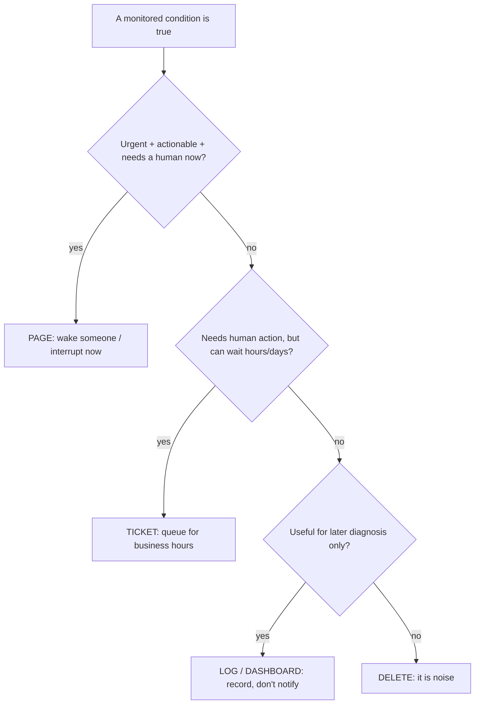
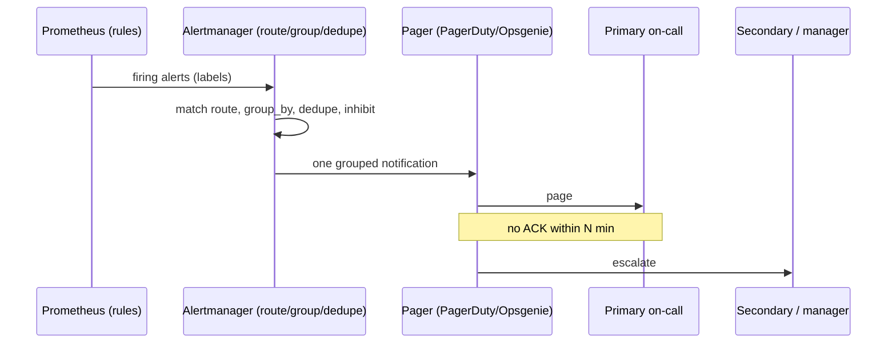

# On-Call, Alert Fatigue & Actionable Signals

An alert is a **piece of software waking a human**. That framing is the whole
topic. Every page you configure is a bet that a machine cannot resolve this
situation and that a person's attention — possibly at 3am, possibly mid-dinner —
is worth more than the cost of interrupting them. Most production alerting is a
graveyard of bets that were never worth making: alerts that fire on causes
nobody acts on, alerts that duplicate each other, alerts that fire on transient
blips that self-heal, alerts nobody has looked at in a year. The aggregate cost
of those bad bets is **alert fatigue** — and its terminal failure mode is the
one alert that actually mattered being ignored because it arrived in a flood of
noise.

This document is about **signal quality**: what makes an alert worth sending,
how to tell symptom from cause, how to route by severity, why every page needs a
runbook, and how SLO-based paging structurally reduces noise. It stays at the
**signal level**. The *human process* around an incident — incident command,
comms, blameless postmortems, DORA metrics, on-call scheduling and comp — is
owned by the upcoming `reliability-and-operations` domain, which this topic
points to for the full loop. The *design-level* "where does monitoring fit in an
architecture" question lives in
`system-design/observability-monitoring-reliability`. The **mechanics** of the
alert rules themselves (Prometheus `for:`, Alertmanager grouping/inhibition) are
deepened in `observability/alerting-rules-and-alertmanager`, and the **SLO math**
(burn-rate windows, error-budget calculus) is deepened in
`observability/slo-based-alerting-and-error-budgets`. Here we own the *judgment*:
which signals deserve a human, and how to keep that set small enough to trust.

> [!KEY-TAKEAWAY]
> The goal is not "more alerts" or even "fewer alerts" — it is a **high
> signal-to-noise ratio on a small, trusted set of pages, every one of which is
> urgent, actionable, and requires a human**. If an alert fails any of those
> three tests, it should be a ticket, a dashboard, or deleted — never a page.

---

## What makes an alert actionable

The single most useful heuristic in on-call design comes from Google's SRE book:
a page must be **urgent, actionable, and require human judgment**. If any one of
those is false, paging a human is the wrong response.

- **Urgent** — it needs a response *now*, not next business day. If it can wait
  until Monday, it is a ticket, not a page.
- **Actionable** — the responder can actually *do* something to change the
  outcome. An alert that says "the upstream provider is down" when you have no
  failover and no lever to pull is not actionable; it is a notification.
- **Requires a human** — the response cannot be automated. If the fix is always
  "restart the pod," then the *system* should restart the pod (a liveness probe,
  an autoscaler, a self-healing controller), and the human should only be paged
  if the automation fails.

Everything else is noise. A famous internal reformulation is the **"novel,
actionable, and requiring intelligence"** test — good pages should be about
situations that are genuinely new and demand a thinking human, not rote toil a
runbook step or a script could handle.

> [!INTERVIEW]
> A very common interview probe: *"You get paged that CPU is at 90%. Good alert
> or bad?"* The strong answer: **almost always bad**, because CPU at 90% is
> neither inherently urgent nor actionable — a healthy service can run hot. You
> should alert on the **symptom the user feels** (latency, errors), and treat CPU
> as a *diagnostic* signal you look at *after* you're paged, not a paging trigger.

A practical litmus test for any proposed alert: *"When this fires, what is the
first thing the on-call will do?"* If the honest answer is "look at it, confirm
it's fine, and close it," the alert is noise and should be deleted or downgraded.
If the answer is "acknowledge, then follow these three runbook steps," it is a
real page.

---

## Symptom-based versus cause-based alerting

This is the highest-leverage distinction in the whole topic and a near-guaranteed
interview question.

- **Symptom-based alerting** fires on *what the user experiences*: elevated error
  rate, high latency, requests failing, the checkout flow returning 500s. It
  answers **"is the service actually broken for someone?"**
- **Cause-based alerting** fires on *a possible internal reason*: a full disk,
  high CPU, a restarted process, a saturated thread pool, a specific host down.
  It answers **"is this internal thing happening?"** — which may or may not
  affect users.

The SRE guidance is: **alert (page) on symptoms, diagnose with causes.** Symptoms
are what customers and SLOs care about; there are relatively few of them per
service, and they catch *unknown* failure modes you never predicted. Causes are
numerous, often self-healing, and paging on every one produces a flood — most of
which never becomes a user-visible problem.

| | Symptom-based | Cause-based |
|---|---|---|
| Fires on | User-visible effect (errors, latency) | Internal condition (CPU, disk, restarts) |
| Answers | "Is it broken for users?" | "Is this internal thing happening?" |
| Volume | Few per service | Many; grows with infra |
| Catches unknown failures | Yes | No — only pre-imagined causes |
| Best used as | **Page** | **Diagnostic dashboard / ticket** |
| Failure mode | Can be slower to pinpoint root cause | Alert fatigue; noise; false pages |

The reason symptom-based alerting is *robust* is that there are effectively
infinite ways for a service to break, but only a few ways for it to be broken
*from the user's perspective*. One well-chosen symptom alert on the error rate
catches a bad deploy, a dependency outage, a memory leak, and a config typo — all
at once — whereas you'd need dozens of cause alerts to cover the same ground, and
you'd still miss the novel failure.

> [!WARNING]
> "Alert on symptoms" does **not** mean "never alert on causes." There are
> legitimate cause-based pages for conditions that *guarantee* imminent
> user-visible failure with enough lead time to act — the classic is **"disk will
> be full in 4 hours"** (predictive), because by the time it *is* full the symptom
> is already customer-facing and it may be too late. The rule of thumb: page on a
> cause only when it is a reliable *leading indicator* with actionable lead time.

The four golden signals (latency, traffic, errors, saturation) and the RED method
(Rate, Errors, Duration) are mostly *symptom* signals; the USE method (Utilization,
Saturation, Errors) leans toward *cause/resource* signals used for diagnosis.

---

## Alert fatigue: causes and cost

**Alert fatigue** is the desensitization that happens when responders are exposed
to frequent, low-value alerts. It is not a soft "morale" problem — it is a direct
**reliability risk**, because its worst outcome is a *real* alert being missed,
silenced, or slow-acknowledged because it arrived amid noise. This is the
observability analog of medicine's well-documented "alarm fatigue," which has
been linked to patient harm when clinicians tune out monitors.

Common causes:

- **Cause-based / resource alerts** that fire on internal conditions users never
  feel (the CPU-at-90% classic).
- **Static thresholds** that don't fit real traffic (a threshold set for peak
  fires constantly at trough, or vice-versa).
- **Flapping / transient** conditions that self-heal in seconds but still page
  (missing `for:` duration or debounce).
- **No deduplication/grouping** — one bad deploy triggers 200 alerts, one per
  instance, instead of one grouped notification.
- **Non-actionable informational** alerts sent as pages ("deploy started",
  "backup completed").
- **Duplicate coverage** — three teams alerting on the same underlying signal.

The cost is compounding:

- **Missed real incidents** — the signal drowns; MTTR and impact grow.
- **Burnout and attrition** — disrupted sleep, cognitive load, learned
  helplessness; on-call becomes a reason people leave.
- **Slower response overall** — responders triage a queue instead of acting.
- **Erosion of trust** — once a team believes "the alerts are always noise," they
  stop reading them, which defeats the entire monitoring investment.

> [!KEY-TAKEAWAY]
> A useful health metric: **what fraction of pages led to a real action?** If most
> pages resolve as "acknowledged, no action needed," you have an alerting problem,
> not a reliability problem — and the fix is tuning the alerts, not adding more.

---

## Page, ticket, or log-only: choosing the response

Not every signal deserves the same delivery mechanism. Mature alerting routes
each condition to the *lowest-urgency channel that still gets it handled*.



- **Page** — highest severity. Wakes/interrupts a human immediately. Reserved for
  urgent + actionable + human-required conditions (usually SLO-threatening
  symptoms). **Every page must have a runbook.**
- **Ticket** — needs human action but can wait for business hours. Certificate
  expiring in 20 days, disk at 60% and slowly growing, a non-critical
  degraded-redundancy condition. Creating a ticket (Jira/Sim) preserves the
  action without stealing sleep.
- **Log-only / dashboard** — recorded for diagnosis and trend analysis, never
  notifies anyone proactively. Most cause/diagnostic signals belong here: they're
  invaluable *after* you're paged, worthless *as* pages.
- **Delete** — if it's neither actionable now, actionable later, nor useful for
  diagnosis, it is pure noise. Remove it.

The severity mapping in most tools (PagerDuty/Opsgenie/Alertmanager) usually
looks like: **critical/SEV → page**, **warning → ticket or low-priority notify**,
**info → log/dashboard only**. A frequent anti-pattern is wiring "warning"
severity to the pager "just in case" — which reliably manufactures fatigue.

> [!TIP]
> A "warning" that fires for weeks without anyone acting is proof it should be a
> ticket or deleted. The test isn't "could this ever matter?" (everything could)
> — it's "does someone act *now* when it fires?"

---

## Every page must have a runbook

**Rule: no page without a runbook.** If you can't write down what the on-call
should do when an alert fires, either you don't understand the failure well
enough to page on it, or it isn't actually actionable. Google's SRE practice
codifies this: playbooks/runbooks roughly triple response effectiveness and cut
MTTR, especially for the rare page a responder has never seen.

A good runbook, linked directly from the alert annotation, contains:

- **What the alert means** in plain language and what user impact it implies.
- **How to confirm** it's real (which dashboard, which query, expected vs. actual).
- **First mitigation steps** — the fastest path to *stop the bleeding* (roll back,
  fail over, scale up, drain a node), prioritized over root-causing.
- **Escalation path** — who/what to escalate to if the steps don't resolve it.
- **Links** to relevant dashboards, traces, and the service's SLO.

In Prometheus/Alertmanager this is conventionally an annotation:

```yaml
- alert: HighRequestErrorRate
  expr: |
    sum(rate(http_requests_total{job="checkout",code=~"5.."}[5m]))
      / sum(rate(http_requests_total{job="checkout"}[5m])) > 0.05
  for: 10m
  labels:
    severity: critical
  annotations:
    summary: "checkout 5xx error rate above 5% for 10m"
    description: "Error ratio is {{ $value | humanizePercentage }} on {{ $labels.job }}"
    runbook_url: "https://runbooks.example.com/checkout/high-error-rate"
```

> [!WARNING]
> A runbook that is *only* "restart the service" is a signal you should
> **automate the restart** and stop paging. Runbooks full of rote mechanical steps
> are toil in disguise; the human-required test is failing.

---

## Signal-to-noise and alert tuning

**Signal-to-noise ratio (SNR)** is the working measure of alert quality: the
proportion of alerts that represent a real, actionable problem versus false or
non-actionable noise. Every noisy alert doesn't just waste the response it
triggers — it *lowers the credibility of every other alert*.

The tuning playbook, applied to each noisy alert in priority order, is essentially
**delete, aggregate, or route** (plus tune thresholds/duration):

1. **Delete** — the highest-value action. If an alert has never driven a real
   action, remove it. Deleting a bad alert is strictly better than tuning it.
2. **Aggregate / group / deduplicate** — collapse many related alerts into one
   notification (group per deploy, per service, per cluster) so a fleet-wide event
   pages once, not N times. Use Alertmanager `group_by`.
3. **Route / downgrade** — send it to a ticket queue or dashboard instead of the
   pager if it isn't urgent.
4. **Add a duration (`for:`) / debounce** — require the condition to hold for a
   window before firing, killing transient flaps that self-heal.
5. **Fix the threshold** — replace a static number with one derived from the SLO,
   or use burn-rate/multi-window logic that adapts to load.
6. **Inhibit** — suppress downstream alerts when a known parent condition is
   already firing (e.g., suppress per-service alerts when the whole cluster is
   down), via Alertmanager `inhibit_rules`.

> [!TIP]
> Treat alert count like a budget. A common rule of thumb (from the SRE
> community) is that on-call should handle **at most ~2 significant incidents per
> shift** — enough time to root-cause each properly. If a shift routinely exceeds
> that, the alert set is over budget and needs pruning, not the on-call working
> harder.

The mechanics of `group_by`, `group_wait`, `repeat_interval`, and
`inhibit_rules` are covered in
`observability/alerting-rules-and-alertmanager`; here the point is *which* lever
to reach for and *why*.

---

## The 3am test and human-required alerts

The **"3am test"** (a.k.a. the "every alert wakes a human at 3am" test) is a blunt
gut-check applied to every candidate page: *imagine this alert fires at 3am and
wakes you from deep sleep — was that interruption justified?* If a bleary,
half-awake responder would look at it and think *"why did this wake me? there's
nothing to do,"* it fails and must not be a page.

The test forces three questions:

1. **Is it real?** Or a transient that will self-heal before I'm even at my laptop?
2. **Does it need me *now*?** Or could it have waited until 9am (→ ticket)?
3. **Is there something for a *human* to do?** Or is the fix mechanical and
   automatable?

That third question is the **human-required** criterion. The purest tell that an
alert fails it: the runbook is a fixed script with no judgment calls. If the
response is deterministic ("if X then restart Y"), encode it as automation —
self-healing controllers, autoscalers, automated failover, circuit breakers — and
only page when the automation *itself* fails or hits a case it can't handle. The
human is the last resort for **novel situations requiring intelligence**, not the
first responder to routine toil.

> [!INTERVIEW]
> Expect: *"How do you decide whether something should page?"* Answer with the
> three tests (urgent, actionable, human-required) and the 3am framing, then give
> the automation corollary: *anything a runbook does mechanically every time
> should be automated so it never pages a human at all.*

---

## SLO-based alerting reduces noise

The structural fix for most alert fatigue is to **stop alerting on arbitrary
thresholds and alert on error-budget burn instead.** An SLO (e.g., 99.9%
availability over 30 days) defines an **error budget** (0.1% ≈ 43 minutes of
allowed badness per 30 days). You alert on the *rate at which you are consuming
that budget* — the **burn rate** — rather than on instantaneous values.

Why this cuts noise so effectively:

- **It alerts on user impact, by construction.** The SLI *is* the user-facing
  symptom, so SLO alerts are inherently symptom-based.
- **It normalizes for load and integrates over time.** Burn rate is a *ratio*
  (actual error ratio ÷ SLO error ratio), so unlike a static *absolute-count*
  threshold ("errors > 100/s") it doesn't misfire across the traffic cycle — an
  absolute-count rule fires constantly at peak and can stay silent during a real
  low-traffic outage, whereas burn rate is the *same* 50x for a sustained 5%
  error ratio at any volume (it is traffic-independent). What actually makes a
  blip cheap is its **short duration**, not low traffic: because burn rate is
  measured against the budget over time, a 5% error ratio lasting ~2 minutes
  spends only ~0.2% of the 43.2-minute budget (a 50x burn would exhaust the
  30-day budget in ~14.4 h, so 2 min ≈ 2/864), while the same 5% sustained for an
  hour spends ~7% and should page.
- **It collapses many alerts into few.** One error-budget policy per SLO replaces
  a pile of ad-hoc threshold alerts.
- **It ties paging to a *decision*.** Budget nearly exhausted → page and possibly
  freeze feature releases; budget healthy → a transient blip is *within budget*
  and shouldn't wake anyone. The budget makes "is this worth paging?" quantitative.

Worked example — a 99.9% availability SLO over 30 days:

```
Total requests window: 30 days
Allowed unavailability: 0.1%  ->  error budget = 0.001
30 days ≈ 43,200 minutes  ->  budget ≈ 43.2 minutes of "all requests failing"
Burn rate = (actual error ratio) / (SLO error ratio, i.e. 0.001)

burn rate 1x  -> exactly on pace to exhaust the 30-day budget in 30 days
burn rate 14.4x -> would exhaust the ENTIRE 30-day budget in ~50 hours
```

A burn rate of 1 means you are spending budget exactly as fast as the SLO
permits; sustained >1 means you'll blow the budget early and something is wrong.
The full budget/burn calculus lives in
`observability/slo-based-alerting-and-error-budgets`; here the takeaway is that
SLO-based paging is *the* mechanism that keeps the paging set both small and
genuinely user-relevant.

---

## Multi-window multi-burn-rate alerting

A single burn-rate threshold forces an ugly trade-off: a *fast* alert (short
window, low threshold) is twitchy and noisy; a *slow* alert (long window, high
threshold) is stable but reacts too late to fast outages. Google's SRE Workbook
resolves this with **multi-window, multi-burn-rate** alerting, the current best
practice.

Two ideas combine:

1. **Multiple burn-rate tiers.** A *fast-burn* rule pages when the budget is being
   consumed very quickly (a sharp outage) and a *slow-burn* rule catches a slow
   leak that would still exhaust the budget over days. Faster burn → higher
   severity / page; slower burn → lower severity / ticket.
2. **A short "and" window per tier.** Each burn-rate condition must *also* hold
   over a short recent window before it fires. This kills spikes: a one-minute
   blip won't satisfy the short confirming window, so it never pages — dramatically
   improving precision without hurting detection time for real outages.

A canonical set (from the SRE Workbook, for a 30-day SLO):

| Tier | Long window | Short window | Burn rate | Budget consumed to fire | Action |
|---|---|---|---|---|---|
| Fast (page) | 1 h | 5 m | 14.4 | ~2% in 1 h | page |
| Medium (page) | 6 h | 30 m | 6 | ~5% in 6 h | page |
| Slow (ticket) | 3 d | 6 h | 1 | ~10% in 3 d | ticket |

Sketch of the fast-burn rule in PromQL (using a precomputed error-ratio SLI):

```promql
(
  slo:errors:ratio_rate1h{service="checkout"}  > (14.4 * 0.001)
and
  slo:errors:ratio_rate5m{service="checkout"}  > (14.4 * 0.001)
)
```

The long window sets the alert's *sensitivity* (how much budget must burn), and
the short window is the *confirmation* that the burn is still happening *now*,
which resets quickly when the incident ends (good for auto-resolution). This gives
the holy grail: **high recall on real outages, high precision against blips, and
fast reset** — the antidote to burn-rate noise.

---

## Escalation, routing, and grouping basics

At the signal level, on-call tooling has to answer: *who gets this, and what
happens if they don't respond?* (The full human process — schedules, handoffs,
incident command, comp — is `reliability-and-operations`' territory.)

- **Routing** — send each alert to the *right* team/responder based on labels
  (service, severity, environment). Alertmanager does this with a routing tree
  (`route` + `routes` matched on labels); PagerDuty/Opsgenie use services and
  escalation policies. Misrouting is itself a fatigue source — teams paged for
  things they can't fix.
- **Grouping** — bundle related alerts into one notification (`group_by`,
  `group_wait`, `group_interval`) so a correlated event is one page, not fifty.
- **Escalation policy** — if the primary on-call doesn't **acknowledge** within N
  minutes, the alert *escalates* to a secondary, then to a manager/wider group.
  This safety net is why an unacknowledged page must never silently disappear.
- **Deduplication** — repeated firings of the same alert collapse into one active
  incident rather than re-paging.
- **Silences / maintenance windows** — during known work, suppress alerts
  deliberately (Alertmanager silences) instead of letting responders ignore them
  ad hoc.



For the human side — on-call rotation health, follow-the-sun, incident command
roles, and blameless postmortems — see the upcoming
`reliability-and-operations` domain.

---

## Toil from alerts

**Toil**, in SRE terms, is work that is manual, repetitive, automatable, tactical,
devoid of enduring value, and scales linearly with service growth. Alerts are a
major toil generator, in two ways:

1. **Responding to non-actionable pages is toil** — every "ack and close, nothing
   to do" wastes human attention and produces no lasting value.
2. **Alerts whose runbook is a fixed mechanical script are toil made schedulable
   at 3am** — if the response is always the same rote steps, the alert is asking a
   human to be a slow, error-prone robot.

The SRE prescription: **measure toil, cap it (Google targets <50% of an SRE's
time), and automate it away.** Applied to alerting, that means periodically
auditing which pages produce rote responses and converting them into automation
(auto-remediation, self-healing) or eliminating them. An alert that reliably
fires and reliably gets a fixed response is not a monitoring win — it's an
automation *to-do* that's been left as a recurring human interrupt.

> [!KEY-TAKEAWAY]
> If a page's runbook could be executed by a shell script with no human judgment,
> the correct long-term fix is to *make it a shell script* (triggered by the
> alert) and stop paging the human. Toil reduction and alert-fatigue reduction are
> the same project viewed from two angles.

---

## Alert review and retrospectives

Alerts are not "set and forget." Because services, traffic, and dependencies
change, an alert set decays: thresholds drift out of relevance, new failure modes
appear, old ones become impossible. Mature teams run a recurring **alert review**
(sometimes folded into an on-call retro or handoff) to keep the set healthy.

A typical cadence and content:

- **On-call handoff / weekly review** — the outgoing on-call walks through every
  page from the shift: *was it actionable? did it lead to a fix? was it noise?*
  Each noisy page gets an action: delete, tune, aggregate, or route.
- **Track per-alert metrics** — fire frequency, ack time, and (crucially)
  **actionability rate** (what fraction led to real action). Chronically noisy
  alerts are surfaced and fixed.
- **Every new page requires a runbook and a review** before it goes live, so the
  three tests are applied *before* it can wake anyone.
- **Post-incident action items** frequently *add or fix* alerts — and just as
  importantly, are a chance to *delete* the ones that didn't help during the
  incident.

> [!TIP]
> A simple, powerful ritual: in the on-call handoff, any page that fired and
> resulted in no action must get a ticket to fix or delete it. This creates
> steady downward pressure on noise instead of letting it accumulate.

The blameless *incident postmortem* process (the human, cultural side) is owned by
`reliability-and-operations`; here the focus is the **alerting-quality feedback
loop** specifically.

---

## Anti-patterns and gotchas

- **Paging on causes/resources by default** (CPU, memory, disk %, restarts) rather
  than user-facing symptoms — the top source of fatigue.
- **Wiring "warning" severity to the pager** "to be safe." Warnings should ticket
  or notify low-priority, not wake people.
- **Static thresholds that ignore load** — a fixed absolute-count "errors > N"
  fires constantly at peak and misses real problems at low-traffic troughs (where
  the error *ratio* is high but the raw count stays under N). Prefer SLO/burn-rate.
- **No `for:` duration** — every transient blip pages. Add a debounce window.
- **No grouping/inhibition** — one incident produces a storm of duplicate pages.
- **Pages with no runbook** — responder is left to improvise at 3am; MTTR balloons.
- **Alerts nobody owns or reviews** — orphaned rules that fire forever and get
  ignored, training the team to ignore *all* alerts.
- **Over-alerting to "cover" for weak dashboards** — if you need a page to know
  something, but there's nothing to do, you need a dashboard, not a page.
- **Silencing instead of fixing** — permanently silencing a noisy alert hides it
  rather than deleting or tuning it; the silence outlives the memory of why.
- **Ignoring the human cost** — treating on-call load as free. Sustained noise
  drives burnout and attrition, which is far more expensive than the engineering
  time to tune alerts.

---

## Common follow-up questions

**"Give me the test for whether something should page."** Urgent + actionable +
requires a human, plus the 3am gut-check. If any fails: ticket, dashboard, or
delete. If the response is mechanical every time, automate it and don't page.

**"Symptom vs cause — one sentence."** Page on symptoms (what the user feels),
diagnose with causes (internal resource state); symptom alerts are few and catch
unknown failures, cause alerts are many and mostly self-heal.

**"Why is CPU-at-90% usually a bad alert?"** It's neither inherently urgent nor
actionable — a healthy service can run hot, and a struggling service can be at 40%.
Alert on the user-visible symptom; use CPU as a diagnostic *after* you're paged.

**"How does SLO-based alerting reduce noise?"** It alerts on error-budget burn
rate, which is symptom-based by construction and normalizes for traffic (a ratio,
not an absolute count), so short blips within budget don't page and one budget
policy replaces many ad-hoc thresholds.

**"What's multi-window multi-burn-rate?"** Multiple burn-rate tiers (fast page /
slow ticket) each gated by a short confirming window, giving high precision
(no spikes) with fast detection and fast auto-resolution.

**"When is it OK to page on a cause?"** When the cause is a reliable *leading
indicator* of imminent user impact with actionable lead time — the canonical case
being predictive "disk full in 4 hours."

**"How do you fix an alert-fatigued rotation?"** Audit every page against
actionability; delete non-actionable ones, aggregate/inhibit duplicates, add
`for:` debounce, route warnings to tickets, and migrate to SLO burn-rate paging.
Make alert review part of every on-call handoff.

**"What belongs to the incident *process* vs. here?"** Incident command, comms,
blameless postmortems, DORA, rotation design → `reliability-and-operations`. Here:
what makes a *signal* worth paging on and how to keep the set trustworthy.

---

## References

- Google, *Site Reliability Engineering*, Ch. 6 "Monitoring Distributed Systems"
  (symptom vs cause; urgent/actionable/human tests) and Ch. 11 "Being On-Call"
  (alert fatigue, cognitive load, ~2 incidents/shift). https://sre.google/sre-book/
- Google, *The Site Reliability Workbook*, "Alerting on SLOs" (multi-window
  multi-burn-rate alerting; burn-rate tables). https://sre.google/workbook/alerting-on-slos/
- Google SRE, *Eliminating Toil* (definition of toil, <50% target).
  https://sre.google/sre-book/eliminating-toil/
- Rob Ewaschuk, "My Philosophy on Alerting" (page on symptoms, actionable alerts;
  the basis for the SRE monitoring chapter). https://docs.google.com/document/d/199PqyG3UsyXlwieHaqbGiWVa8eMWi8zzAn0YfcApr8Q/
- Prometheus docs — Alerting rules and annotations (`for:`, `runbook_url`).
  https://prometheus.io/docs/prometheus/latest/configuration/alerting_rules/
- Prometheus docs — Alertmanager (routing, grouping, inhibition, silences).
  https://prometheus.io/docs/alerting/latest/alertmanager/
- Tom Wilkie, "The RED Method" (rate/errors/duration as symptom signals).
  https://grafana.com/blog/2018/08/02/the-red-method-how-to-instrument-your-services/
- Brendan Gregg, "The USE Method" (utilization/saturation/errors for resource
  diagnosis). https://www.brendangregg.com/usemethod.html
